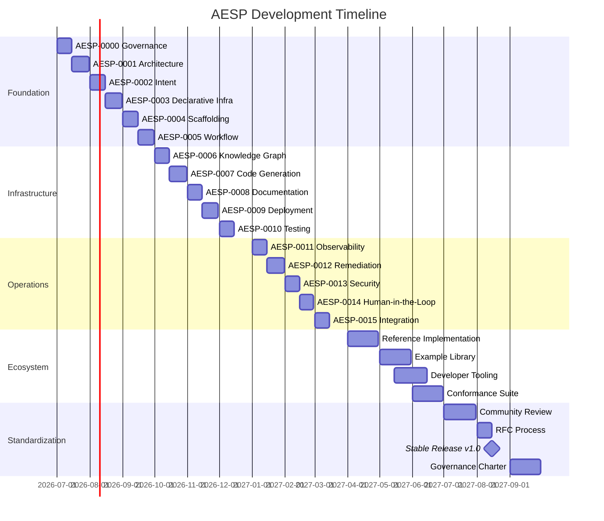

# AESP Development Roadmap

This document describes the planned development timeline for the Autonomous
Engineering Specification (AESP). All dates and scope are subject to change
pending community review and committee decisions.

## Overview

| Phase | Name | Specs | Target | Status |
|-------|------|-------|--------|--------|
| Phase 1 | Foundation | AESP-0000 — AESP-0005 | Q3 2026 | IN PROGRESS |
| Phase 2 | Infrastructure | AESP-0006 — AESP-0010 | Q4 2026 | DRAFT COMPLETE |
| Phase 3 | Operations | AESP-0011 — AESP-0015 | Q1 2027 | PLANNED |
| Phase 4 | Ecosystem | Reference implementation, examples, tooling | Q2 2027 | PLANNED |
| Phase 5 | Standardization | Community review, RFC process, stable release | Q3 2027 | PLANNED |

---

## Phase 1: Foundation (Q3 2026)

**Goal**: Establish the architectural bedrock of AESP — governance, core
concepts, intent-driven operations, declarative infrastructure, scaffolding, and
knowledge management.

| Spec | Title | Objective | Target |
|------|-------|-----------|--------|
| AESP-0000 | Specification Governance & Process | Define the governance model, change process, version control, and contribution workflow for all AESP specifications | July 2026 |
| AESP-0001 | Core Model | Define the foundational AEO data model for agents, organizations, roles, work units, capabilities, resources, state, identity, and extensibility | July 2026 |
| AESP-0002 | Agent Roles | Define role templates, responsibilities, permission boundaries, escalation expectations, and role-based operational patterns | July 2026 |
| AESP-0003 | Communication Protocols | Define message envelopes, transport bindings, communication patterns, capability discovery, reliability, and multi-agent coordination | July 2026 |
| AESP-0004 | Memory Systems | Specify memory architectures, operations, storage backends, retrieval mechanisms, distributed consistency, and inter-agent memory sharing | July 2026 |
| AESP-0005 | Workflow Orchestration | Define workflow graphs, execution semantics, failure handling, scheduling, and cross-agent orchestration patterns | July 2026 |

### Phase 1 Exit Criteria

- [x] AESP-0000 Specification Governance & Process published
- [x] AESP-0001 Core Model published
- [x] AESP-0002 Agent Roles published
- [x] AESP-0003 Communication Protocols published
- [x] AESP-0004 Memory Systems published
- [x] AESP-0005 Workflow Orchestration published
- [x] All six specifications reach DRAFT status with complete normative content
- [ ] Architecture Decision Records (ADRs) published for all major design choices
- [ ] At least two independent technical reviews completed per specification
- [ ] Mermaid diagrams provided for all architectural components
- [ ] Cross-references between specifications validated

---

## Phase 2: Infrastructure (Q4 2026)

**Goal**: Define the operational infrastructure layer — knowledge graphs, code
generation, documentation, deployment, and testing.

| Spec | Title | Objective | Target |
|------|-------|-----------|--------|
| AESP-0006 | Knowledge Graph | Specify entity and relationship modeling, ontology and schema languages, query semantics, construction, reasoning, memory integration, and graph federation | October 2026 |
| AESP-0007 | Code Generation | Define code generation protocols, template engines, output validation, and artifact lifecycle management | October 2026 |
| AESP-0008 | Documentation Generator | Specify automated documentation generation, schema-to-docs pipelines, and living documentation patterns | November 2026 |
| AESP-0009 | Deployment Automation | Define deployment orchestration, rollout strategies, rollback procedures, and environment promotion | November 2026 |
| AESP-0010 | Testing & Validation | Specify testing frameworks, validation protocols, test generation, and coverage requirements | December 2026 |

### Phase 2 Exit Criteria

- [x] AESP-0006 Knowledge Graph published (DRAFT)
- [x] AESP-0007 Code Generation published (DRAFT)
- [x] AESP-0008 Documentation Generator published (DRAFT)
- [x] AESP-0009 Deployment Automation published (DRAFT)
- [x] AESP-0010 Testing & Validation published (DRAFT)
- [x] All five specifications reach DRAFT status with complete normative content
- [ ] Integration points with Phase 1 specifications fully defined
- [ ] Reference implementations started for at least three specifications
- [ ] Security review completed for all Phase 1 and Phase 2 specifications

---

## Phase 3: Operations (Q1 2027)

**Goal**: Define the runtime operational layer — observability, remediation,
security, human interaction, and system integration.

| Spec | Title | Objective | Target |
|------|-------|-----------|--------|
| AESP-0011 | Observability | Define telemetry standards, event schemas, metric aggregation, tracing, and alerting protocols | January 2027 |
| AESP-0012 | Remediation & Self-Healing | Specify automated remediation workflows, escalation chains, circuit breaker patterns, and healing strategies | January 2027 |
| AESP-0013 | Security & Compliance | Define security frameworks, compliance mapping, audit logging, access control, and threat models | February 2027 |
| AESP-0014 | Human-in-the-Loop | Specify human intervention points, approval workflows, escalation protocols, and operator interfaces | February 2027 |
| AESP-0015 | Integration & Interoperability | Define integration protocols, API standards, adapter patterns, and cross-system communication | March 2027 |

### Phase 3 Exit Criteria

- [ ] All five specifications reach DRAFT status with complete normative content
- [ ] Full specification suite (AESP-0000 through AESP-0015) internally consistent
- [ ] All cross-specification references validated
- [ ] Compliance matrix published

---

## Phase 4: Ecosystem (Q2 2027)

**Goal**: Build the ecosystem around the specification — reference
implementations, comprehensive examples, developer tooling, and integration
libraries.

### Deliverables

| Deliverable | Description | Target |
|-------------|-------------|--------|
| Reference Implementation | A minimal but complete implementation of the full AESP stack demonstrating all 16 specifications | April 2027 |
| Example Library | At least five real-world example deployments covering different technology stacks and use cases | May 2027 |
| Developer Tooling | CLI tools, schema validators, linting tools, and IDE extensions for working with AESP specifications | May 2027 |
| Integration Libraries | SDKs and adapters for major programming languages and infrastructure platforms | June 2027 |
| Conformance Test Suite | Automated test suite that implementations can run to verify AESP conformance | June 2027 |

### Phase 4 Exit Criteria

- [ ] Reference implementation passes all conformance tests
- [ ] All example deployments documented and reproducible
- [ ] At least two language SDKs available
- [ ] Conformance test suite published

---

## Phase 5: Standardization (Q3 2027)

**Goal**: Transition from project specification to industry standard through
community review, RFC process maturation, and stable release.

### Deliverables

| Deliverable | Description | Target |
|-------------|-------------|--------|
| Community Review | Open review period for all specifications with feedback collection and resolution | July 2027 |
| RFC Process | Formal Request for Comments process established with clear acceptance criteria | August 2027 |
| Stable Release v1.0 | First stable release of the complete AESP specification suite | August 2027 |
| Governance Charter | Formal governance charter for the AESP Standards Committee | September 2027 |
| Industry Engagement | Presentations and workshops at major industry conferences | September 2027 |

### Phase 5 Exit Criteria

- [ ] All community feedback addressed or dispositioned
- [ ] AESP v1.0 STABLE released
- [ ] Governance charter ratified
- [ ] At least two independent implementations demonstrating interoperability

---

## Milestone Summary

---

*Last updated: 2026-07-10*

For the current status of individual specifications, see
[specification/README.md](specification/README.md).
