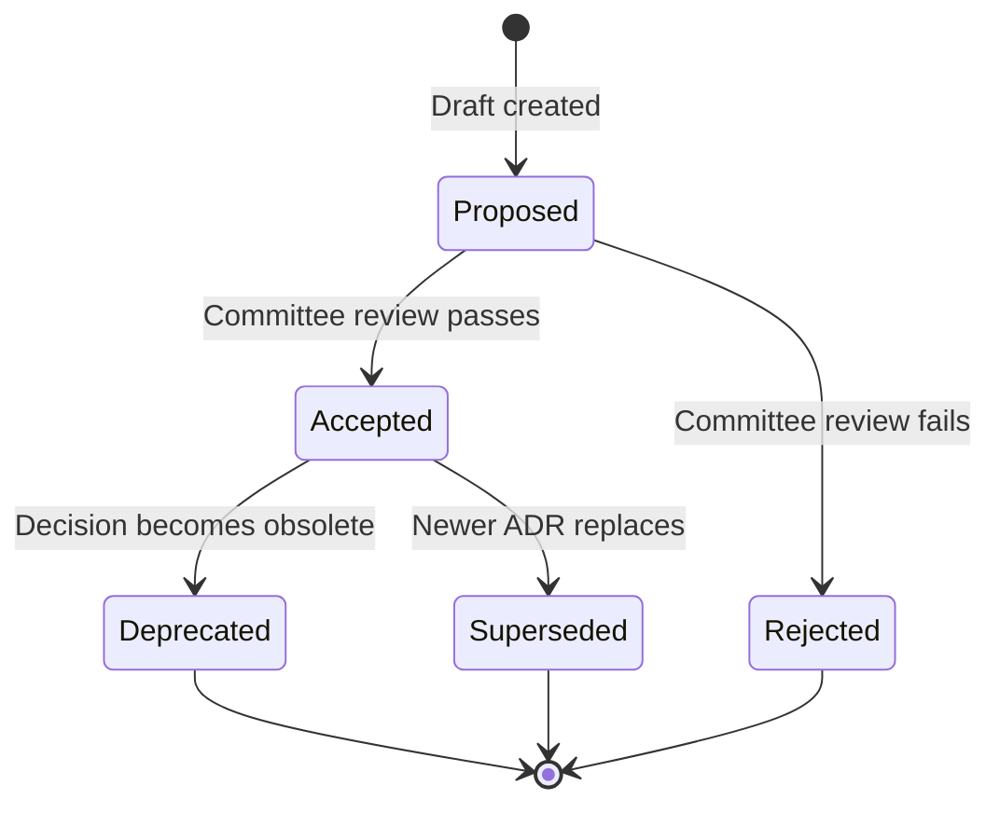

# Architecture Decision Records (ADR)

This directory contains Architecture Decision Records (ADRs) for the
Autonomous Engineering Specification (AESP). ADRs capture significant
design decisions, the context in which they were made, and their consequences.

## What is an ADR?

An Architecture Decision Record (ADR) is a document that captures an
important architectural decision made along with its context and
consequences. ADRs help current and future contributors understand why
the specification is designed the way it is, and prevent the same
decisions from being re-litigated unnecessarily.

Each ADR in this repository follows the template defined in
[AESP-0000: Specification Governance & Process](../specification/AESP-0000.md).

## ADR Index

| ADR | Title | Status | Date | Affected Specs |
|-----|-------|--------|------|----------------|
| ADR-0001 | [Reserved] | Proposed | — | — |

## ADR Status Legend

| Status | Description |
|--------|-------------|
| **Proposed** | The decision has been proposed but not yet reviewed. |
| **Accepted** | The decision has been reviewed and accepted by the committee. |
| **Deprecated** | The decision is no longer relevant or has been superseded. |
| **Superseded** | The decision has been replaced by a newer ADR. Reference provided. |

## When to Create an ADR

An ADR SHOULD be created when:

- A design decision affects multiple AESP specifications
- A decision involves significant trade-offs between competing approaches
- A decision is likely to be questioned or revisited in the future
- A decision constrains future design options
- A decision involves breaking changes or deprecation

An ADR is NOT required for:

- Minor implementation details within a single specification
- Editorial or formatting choices
- Decisions that are self-evident from the specification text

## ADR Lifecycle



## Format

Each ADR file MUST be named `ADR-NNNN.md` and MUST follow this structure:

```markdown
# ADR-NNNN: [Decision Title]

**Status:** [Proposed | Accepted | Deprecated | Superseded]
**Date:** YYYY-MM-DD
**Deciders:** @github-handle1, @github-handle2

## Context

What is the issue that we're seeing that is motivating this decision or change?

## Decision

What is the change that we're proposing or have agreed on?

## Consequences

What becomes easier or more difficult to do because of this change?

### Positive

- [Benefit 1]
- [Benefit 2]

### Negative

- [Drawback 1]
- [Drawback 2]

### Neutral

- [Neutral consequence 1]

## Alternatives Considered

| Alternative | Pros | Cons | Decision |
|-------------|------|------|----------|
| [Option A] | [Pros] | [Cons] | Rejected — [reason] |
| [Option B] | [Pros] | [Cons] | Accepted |

## References

- [Related specification section]
- [External reference]
```

## Contributing

To propose a new ADR:

1. Create a new file following the naming convention `ADR-NNNN.md`
2. Fill in all sections of the template
3. Submit a pull request with commit message: `docs(adr): add ADR-NNNN [title]`

See [CONTRIBUTING.md](../CONTRIBUTING.md) for the full contribution process.

---

*For questions about ADRs, open a [GitHub Discussion](https://github.com/kishoreHQ/AESP/discussions).*
