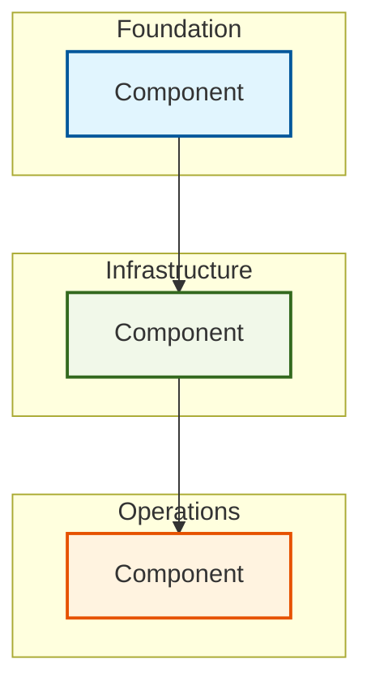
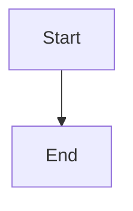

# Architecture Diagrams

This directory contains architecture diagrams for the Autonomous
Engineering Specification (AESP). All diagrams are authored in
[Mermaid](https://mermaid-js.github.io/) syntax to ensure they remain
editable, version-controllable, and renderable across platforms.

## Purpose

Visual representations of architectural concepts serve several purposes:

1. **Clarity**: Complex relationships and flows are easier to understand visually
2. **Consistency**: Shared diagrams ensure all contributors have the same mental model
3. **Onboarding**: New contributors can quickly understand the architecture
4. **Validation**: Diagrams can be reviewed for accuracy against specifications

## Diagram Standards

### Mermaid Syntax

All diagrams MUST use [Mermaid](https://mermaid-js.github.io/) syntax.
Mermaid diagrams are:

- **Text-based**: Stored as code, diffable in version control
- **Portable**: Rendered by GitHub, GitLab, and many documentation tools
- **Editable**: Modified with any text editor
- **Accessible**: Screen readers can describe diagram structure

### Diagram Types

| Type | Mermaid Directive | Use For |
|------|------------------|---------|
| Flowchart | `graph TD` / `graph LR` | Component relationships, data flow |
| Sequence | `sequenceDiagram` | Interactions between actors over time |
| State | `stateDiagram-v2` | State machines and lifecycles |
| Class | `classDiagram` | Object models and type hierarchies |
| Entity-Relationship | `erDiagram` | Data models and relationships |
| Gantt | `gantt` | Project timelines and schedules |
| Pie | `pie` | Proportional distributions |
| Git Graph | `gitGraph` | Branching strategies |

### Style Conventions

All diagrams SHOULD follow these style conventions for consistency:



#### Color Coding

| Layer | Fill Color | Stroke Color | Hex Reference |
|-------|-----------|-------------|---------------|
| Foundation | Light Blue | Dark Blue | `#e1f5fe` / `#01579b` |
| Infrastructure | Light Green | Dark Green | `#f1f8e9` / `#33691e` |
| Operations | Light Orange | Dark Orange | `#fff3e0` / `#e65100` |
| External Systems | Light Gray | Dark Gray | `#f5f5f5` / `#616161` |
| Data Stores | Light Purple | Dark Purple | `#f3e5f5` / `#4a148c` |

#### Naming Conventions

- Use descriptive node IDs: `INTENT_PARSER` not `IP`
- Use full names in node labels: `"Intent Parser"` not `"IP"`
- Group related nodes in `subgraph` declarations
- Label all edges with descriptive text

## Diagram Index

| Diagram | File | Type | Description | Related Spec |
|---------|------|------|-------------|--------------|
| [Architecture Overview](architecture-overview.md) | `architecture-overview.md` | Flowchart | High-level system architecture | AESP-0001 |
| [Intent Pipeline](intent-pipeline.md) | `intent-pipeline.md` | Sequence | Intent processing flow | AESP-0002 |
| [State Reconciliation](state-reconciliation.md) | `state-reconciliation.md` | State | State machine for reconciliation | AESP-0003 |
| [Knowledge Graph Model](knowledge-graph.md) | `knowledge-graph.md` | ER | Entity-relationship for knowledge graph | AESP-0005 |
| [Verification Loop](verification-loop.md) | `verification-loop.md` | Sequence | Continuous verification flow | AESP-0006 |
| [Deployment Pipeline](deployment-pipeline.md) | `deployment-pipeline.md` | Flowchart | Deployment orchestration flow | AESP-0009 |
| [Remediation Workflow](remediation-workflow.md) | `remediation-workflow.md` | State | Self-healing state transitions | AESP-0012 |
| [Security Architecture](security-architecture.md) | `security-architecture.md` | Flowchart | Security component layout | AESP-0013 |
| [Human-in-the-Loop Flow](hitl-flow.md) | `hitl-flow.md` | Sequence | Human intervention flow | AESP-0014 |
| [Integration Topology](integration-topology.md) | `integration-topology.md` | Flowchart | Cross-system integration map | AESP-0015 |

*Note: Diagram files are created as specifications are developed.*

## Embedding Diagrams

### In Specifications

Diagrams SHOULD be embedded directly in specification documents using
Mermaid code blocks:

````markdown

````

### In Documentation

For external documentation, diagrams can be:

1. **Referenced by file**: Link to the Mermaid file for live rendering
2. **Exported as images**: Use Mermaid CLI to generate PNG/SVG
3. **Embedded as code**: Include the Mermaid block directly

## Exporting Diagrams

To export Mermaid diagrams to images:

```bash
# Using Mermaid CLI
npx @mermaid-js/mermaid-cli -i diagrams/architecture-overview.md -o diagrams/architecture-overview.svg

# For all diagrams
for f in diagrams/*.md; do
    npx @mermaid-js/mermaid-cli -i "$f" -o "${f%.md}.svg"
done
```

## Contributing

To add a new diagram:

1. Identify the need for a visual representation
2. Create a `.md` file following the naming convention `[descriptive-name].md`
3. Use Mermaid syntax following the style conventions above
4. Update the diagram index in this README
5. Submit a pull request with commit message: `docs(diagrams): add [diagram-name]`

### Diagram Review Criteria

- [ ] Mermaid syntax is valid and renders correctly
- [ ] Style conventions are followed
- [ ] Diagram accurately reflects the specification
- [ ] All nodes and edges are labeled
- [ ] Color coding matches the layer conventions

See [CONTRIBUTING.md](../CONTRIBUTING.md) for the full contribution process.

---

*For questions about diagrams, open a [GitHub Discussion](https://github.com/kishoreHQ/AESP/discussions).*
