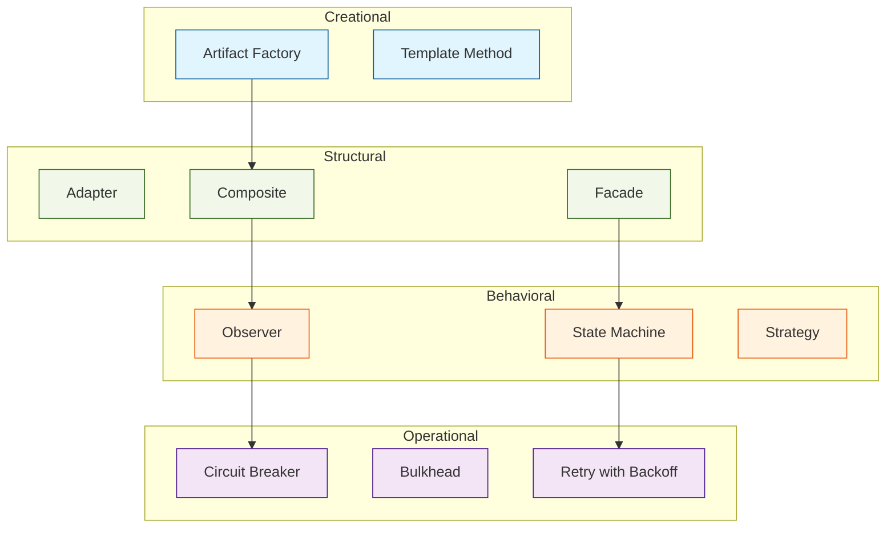

# Design Patterns Catalog

This directory contains a catalog of design patterns for the Autonomous
Engineering Specification (AESP). These patterns represent proven solutions
to recurring problems in autonomous engineering systems.

## What is a Design Pattern?

A design pattern is a general, reusable solution to a commonly occurring
problem within a given context. Patterns in this catalog are:

- **Vendor-neutral**: Applicable across different technologies and platforms
- **Proven**: Based on established practice and validated through implementation
- **Documented**: Described with context, problem, solution, consequences, and examples
- **Referenced**: Linked to relevant AESP specifications

## Pattern Format

Each pattern document MUST be named `PATTERN-NNNN.md` and MUST follow this
structure:

```markdown
# PATTERN-NNNN: [Pattern Name]

**Category:** [Creational | Structural | Behavioral | Operational]
**Status:** [Proposed | Accepted | Deprecated]
**Related Specs:** [AESP-NNNN, AESP-NNNN]
**Related Patterns:** [PATTERN-NNNN, PATTERN-NNNN]

## Context

[The situation in which the pattern applies.]

## Problem

[The recurring problem that this pattern addresses.]

## Forces

[Conflicting considerations or constraints that must be balanced.]

- [Force 1]
- [Force 2]
- [Force 3]

## Solution

[The proposed solution with enough detail to apply it.]

## Structure

```mermaid
[Diagram showing the pattern structure]
```

## Participants

| Role | Responsibility |
|------|----------------|
| [Role 1] | [Responsibility] |
| [Role 2] | [Responsibility] |

## Consequences

### Benefits

- [Benefit 1]
- [Benefit 2]

### Liabilities

- [Liability 1]
- [Liability 2]

## Implementation

[Guidance on implementing this pattern.]

## Example

[Concrete example of the pattern in use.]

## Known Uses

[References to real-world implementations using this pattern.]
```

## Pattern Categories

### Creational Patterns

Patterns related to the creation of autonomous engineering artifacts:

| Pattern | Description | Related Spec |
|---------|-------------|--------------|
| [PATTERN-0001](PATTERN-0001.md) | [Reserved] | — |

### Structural Patterns

Patterns related to the composition and organization of autonomous engineering
systems:

| Pattern | Description | Related Spec |
|---------|-------------|--------------|
| [PATTERN-0001](PATTERN-0001.md) | [Reserved] | — |

### Behavioral Patterns

Patterns related to the interactions and responsibilities between components:

| Pattern | Description | Related Spec |
|---------|-------------|--------------|
| [PATTERN-0001](PATTERN-0001.md) | [Reserved] | — |

### Operational Patterns

Patterns related to running and maintaining autonomous engineering systems:

| Pattern | Description | Related Spec |
|---------|-------------|--------------|
| [PATTERN-0001](PATTERN-0001.md) | [Reserved] | — |

## Pattern Language Overview



## Using Patterns

### For Specification Authors

- Reference patterns in specifications to provide implementation guidance
- Use pattern names as shared vocabulary in discussions
- Extend the pattern catalog when encountering new recurring problems

### For Implementors

- Apply patterns as starting points for implementation
- Adapt patterns to specific technology constraints
- Document deviations from standard patterns with rationale

### For Operators

- Use operational patterns as runbooks for common procedures
- Combine patterns to address complex operational scenarios
- Contribute new patterns discovered in production

## Contributing

To propose a new pattern:

1. Ensure the pattern addresses a recurring problem, not a one-off solution
2. Follow the pattern format template above
3. Include a Mermaid diagram illustrating the pattern structure
4. Provide at least one concrete example
5. Submit a pull request with commit message: `docs(patterns): add PATTERN-NNNN [name]`

### Pattern Review Criteria

- [ ] Pattern addresses a genuinely recurring problem
- [ ] Context and forces are clearly described
- [ ] Solution is sufficiently detailed to apply
- [ ] Consequences (positive and negative) are documented
- [ ] At least one example is provided
- [ ] Related specifications and patterns are referenced

See [CONTRIBUTING.md](../CONTRIBUTING.md) for the full contribution process.

---

*For questions about patterns, open a [GitHub Discussion](https://github.com/kishoreHQ/AESP/discussions).*
