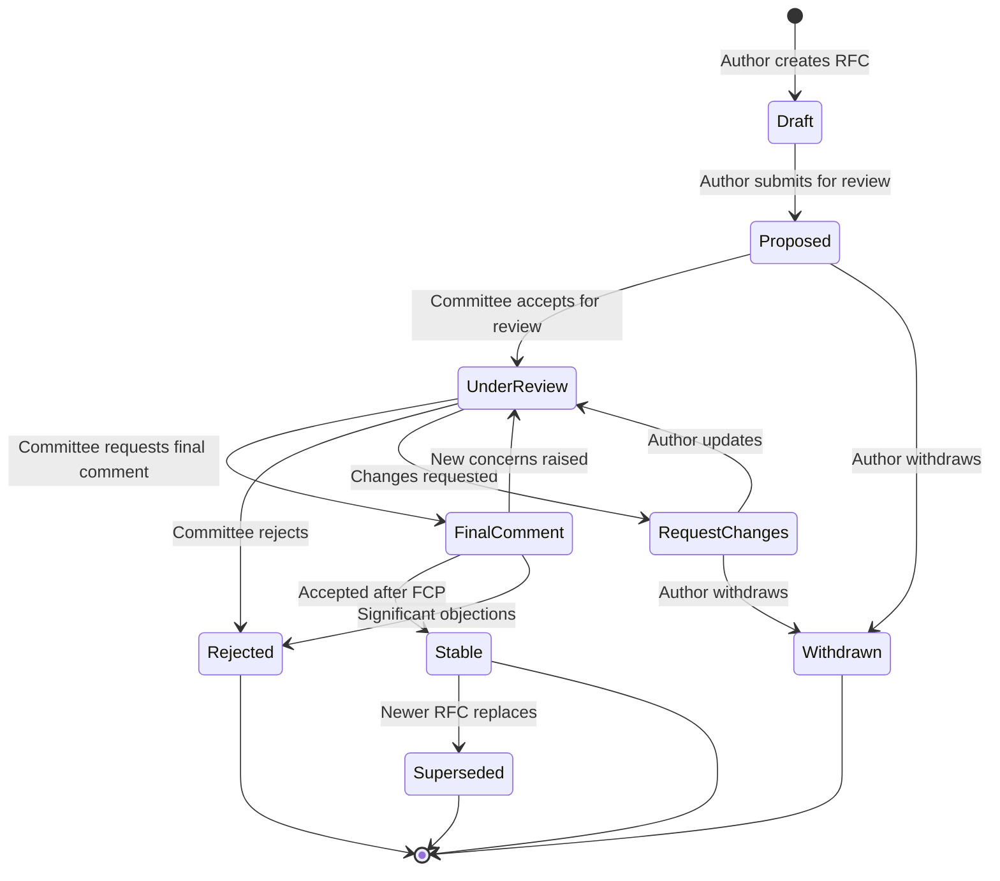

# RFC Process Documentation

This directory contains the Request for Comments (RFC) process documentation
for the Autonomous Engineering Specification (AESP). The RFC process governs
significant changes to the specification suite.

## What is an RFC?

An RFC (Request for Comments) is a formal proposal for a significant change
to the AESP specification suite. RFCs ensure that major decisions are made
through a transparent, collaborative process with community input.

## When an RFC is Required

An RFC is REQUIRED for:

- Changes that modify existing normative requirements (MUST, MUST NOT, SHOULD,
  SHOULD NOT)
- Addition of new major architectural components
- Removal of previously specified features or protocols
- Changes that affect interoperability between implementations
- Changes to the governance model or RFC process itself

An RFC is NOT required for:

- Editorial fixes (typos, formatting, broken links)
- Clarifications that do not change normative meaning
- Addition of examples, diagrams, or non-normative notes
- Addition of new examples to existing protocols

## RFC Lifecycle



## RFC States

| State | Description | Duration |
|-------|-------------|----------|
| **Draft** | The author is developing the proposal. | Open-ended |
| **Proposed** | Submitted for review. Open for community feedback. | 7 days minimum |
| **Under Review** | Committee is actively reviewing. Changes may be requested. | 14 days typical |
| **Final Comment** | Two-week final comment period before disposition. | 14 days fixed |
| **Stable** | Accepted. Merged into relevant specification(s). | Permanent |
| **Rejected** | Not accepted. Reasons documented. | Permanent |
| **Withdrawn** | Withdrawn by the author. | Permanent |
| **Superseded** | Replaced by a newer RFC. Reference to new RFC provided. | Permanent |

## RFC Document Format

RFC documents MUST be named `RFC-NNNN.md` and MUST follow this structure:

```markdown
# RFC-NNNN: [Title]

**Status:** [Draft | Proposed | Under Review | Final Comment | Stable | Rejected | Withdrawn | Superseded]
**Author(s):** [Name (@github-handle), Affiliation]
**Created:** YYYY-MM-DD
**Last Updated:** YYYY-MM-DD
**Target Specifications:** [AESP-NNNN, AESP-NNNN]
**Replaces:** [RFC-NNNN or "None"]
**Replaced By:** [RFC-NNNN or "None"]

## Summary

[One-paragraph summary of the proposal.]

## Motivation

[Detailed explanation of the problem being addressed. Why is this change
necessary? What are the current limitations?]

## Detailed Design

[The core of the RFC. Describe the proposed change in detail.]

### Changes to Existing Specifications

[List specific sections to be added, modified, or removed.]

### New Content

[New sections, protocols, or requirements being introduced.]

### Backwards Compatibility

[Analysis of backwards compatibility impact. Migration path if applicable.]

## Alternatives Considered

| Alternative | Pros | Cons | Decision |
|-------------|------|------|----------|
| [Option A] | [Pros] | [Cons] | Rejected — [reason] |
| [Option B] | [Pros] | [Cons] | Accepted |
| [Status Quo] | [Pros] | [Cons] | Rejected — [reason] |

## Impact Analysis

### Implementations

[What will implementations need to change?]

### Documentation

[What documentation changes are required?]

### Ecosystem

[Broader impact on the AESP ecosystem.]

## Timeline

| Milestone | Target Date | Description |
|-----------|-------------|-------------|
| RFC Proposed | YYYY-MM-DD | RFC submitted for review |
| RFC Stable | YYYY-MM-DD | RFC accepted |
| Implementation | YYYY-MM-DD | Reference implementation |
| Documentation | YYYY-MM-DD | Documentation updated |

## References

- [AESP-0000: Specification Governance & Process](../specification/AESP-0000.md)
- [Related specifications]
- [External references]

## Discussion Log

[Record of significant discussion points and their resolution.]

| Date | Participant | Comment | Resolution |
|------|-------------|---------|------------|
| YYYY-MM-DD | @handle | [Comment] | [Resolution] |
```

## RFC Index

| RFC | Title | Status | Author | Target Specs |
|-----|-------|--------|--------|-------------|
| [RFC-0001](RFC-0001.md) | [Reserved] | Draft | — | — |

## Process Details

### Submission

1. Fork the AESP repository
2. Create a new file `rfc/RFC-NNNN-[descriptive-title].md`
3. Fill in all sections of the RFC template
4. Submit a pull request with status `Draft`
5. Request review from the committee

### Review

1. The committee assigns a shepherd to guide the RFC through review
2. Community feedback is collected during the `Proposed` state
3. The committee reviews during the `Under Review` state
4. If changes are requested, the author updates and resubmits
5. Once satisfactory, the RFC enters `Final Comment` period

### Final Comment Period (FCP)

- A 14-day period for final community input
- If no significant objections, the RFC moves to `Stable`
- If significant new concerns are raised, the RFC returns to `Under Review`

### Acceptance

An RFC is accepted when:

- [ ] All committee review comments are addressed
- [ ] Final Comment Period completes without blocking objections
- [ ] All required sections are complete
- [ ] Impact analysis is thorough and accurate
- [ ] Alternatives are fairly documented
- [ ] Target specifications are identified and updated

### After Acceptance

1. The RFC is merged into the repository with `Stable` status
2. Relevant specifications are updated to incorporate the RFC
3. The CHANGELOG is updated
4. If applicable, reference implementations are updated

## Contributing

To propose a new RFC:

1. Confirm the change requires an RFC (see [When an RFC is Required](#when-an-rfc-is-required))
2. Review existing RFCs to avoid duplication
3. Follow the RFC document format template above
4. Submit as a pull request with commit message: `docs(rfc): add RFC-NNNN [title]`

See [CONTRIBUTING.md](../CONTRIBUTING.md) for the full contribution process.

---

*For questions about the RFC process, open a [GitHub Discussion](https://github.com/kishoreHQ/AESP/discussions).*
