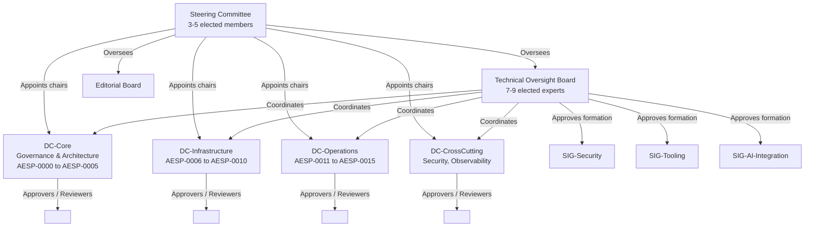
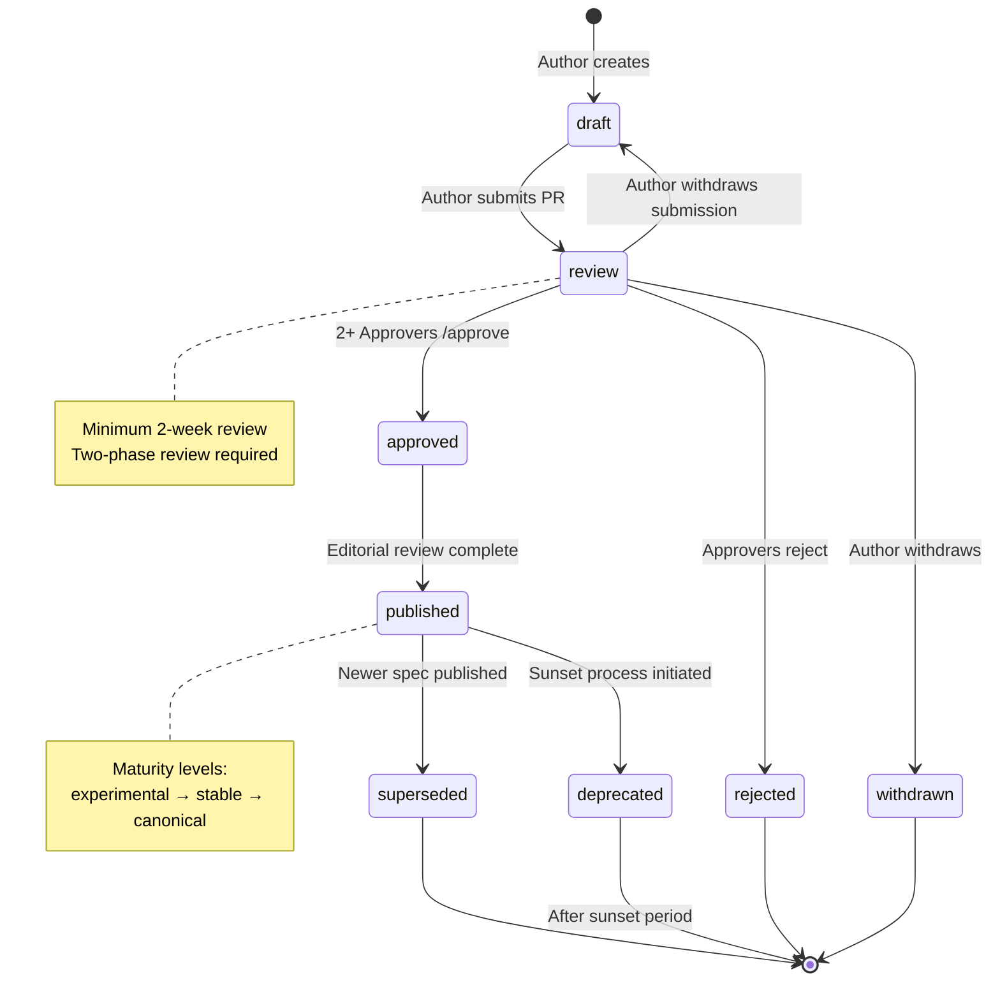

# AESP-0000: Constitution — Supplement (Sections 5-11 + Appendices)

**This document contains Sections 5-11 and Appendices of the AESP-0000 Constitution.**

**See `AESP-0000.md` for Sections 1-4 (Introduction, Foundational Principles, AEO Model, Specification Framework).**

---

## 5. Governance Structure

### 5.1 Principles

The governance of the AESP Initiative is founded on seven core principles that ensure the long-term health, independence, and technical excellence of the standard. These principles apply to all participants, committees, and decision-making processes within the Initiative.

**1. Influence through Contribution, Not Sponsorship**

Technical influence within the AESP Initiative is earned through the quality, quantity, and consistency of one's contributions—not through financial sponsorship, corporate affiliation, or marketing expenditure. Decisions are made by those who demonstrate sustained technical engagement and expertise. While corporate sponsorship may fund infrastructure, events, or tooling, it SHALL NOT confer voting rights, veto power, or preferential treatment in technical decisions. No organization may purchase representation on any governing body.

**2. Transparent Operations**

All technical discussions, governance decisions, meeting minutes, and specification drafts MUST be conducted in publicly accessible forums. There SHALL be no private decision-making channels for technical matters. Working materials—including draft specifications, review comments, meeting recordings, and decision records—MUST remain publicly available in perpetuity. The only exceptions to this principle involve matters of personal privacy, security vulnerability disclosure under embargo, or legal obligations subject to attorney-client privilege.

**3. Rough Consensus, Not Unanimity**

The AESP Initiative operates on the principle of "rough consensus" as practiced by the IETF. This means that decisions are made when there is broad agreement among participants—not when every participant is fully satisfied. The standard is not the best solution for any one party; it is the best solution that the community can agree upon. Dissent is recorded but does not block progress unless the dissenting position demonstrates a fundamental flaw in the proposal. The test for rough consensus is whether all points of view have been heard and the chair judges that the proposal is not opposed by a significant portion of the community.

**4. Merit-Based Technical Decisions**

Technical decisions are evaluated based on their intrinsic merits: correctness, completeness, implementability, interoperability, and alignment with the Initiative's architectural vision. Arguments from authority, seniority, or corporate affiliation carry no special weight. The best technical argument wins, regardless of its source. Contributors are expected to support their positions with data, use cases, prototype implementations, or references to established practice.

**5. Vendor Neutrality**

No single vendor, organization, or affiliated group of organizations may control the direction of the AESP standard. Governance structures include diversity requirements, term limits, and maximum representation thresholds to prevent capture. The standard MUST be implementable by any organization without licensing fees, patent encumbrances, or preferential access to specifications or test suites. The AESP Initiative welcomes competition among implementers and strives to create a level playing field.

**6. Separation of Technical and Business Oversight**

Technical decisions are made by technical experts who are actively engaged in implementing and deploying the standard. Business oversight—including funding, legal matters, trademark enforcement, and external partnerships—is handled by separate bodies with distinct charters. The Steering Committee sets strategic direction but does not intervene in specific technical decisions within a Domain Committee's scope. The Technical Oversight Board ensures cross-domain consistency but does not manage community operations or funding.

**7. Clear Escalation Paths**

Every participant MUST have access to clear, documented escalation paths for disputes, concerns, or appeals. Disagreements within a Domain Committee are first addressed through discussion and formal objection. If unresolved, they may be escalated to the Technical Oversight Board for mediation. Disputes about governance processes or constitutional interpretation may be escalated to the Steering Committee. All escalation paths have defined timelines, and escalation bodies MUST respond within two weeks of receiving an escalated matter.

### 5.2 Steering Committee

The Steering Committee (SC) is the highest governance body of the AESP Initiative, responsible for strategic direction, constitutional governance, and appointment of leadership positions.

**Composition**

The Steering Committee consists of 3 to 5 elected members. This odd-numbered, small composition ensures decisive action while maintaining diversity of perspective. Members serve 1-year terms and MAY be renewed once, for a maximum of 2 consecutive terms. After serving 2 consecutive terms, a former member MUST wait at least 1 year before seeking re-election. There is no limit on non-consecutive terms.

**Election Process**

Steering Committee members are elected by the Member-level community (as defined in Section 5.7). Elections follow this process:

1. **Nomination Period**: A 2-week nomination period is announced at least 30 days in advance. Any Member in good standing may nominate themselves or another Member with their consent.
2. **Candidate Statements**: Nominated candidates provide a brief statement (maximum 500 words) describing their qualifications, vision for the Initiative, and relevant experience.
3. **Voting**: Members vote using a ranked-choice method over a 1-week period.
4. **Result Confirmation**: A candidate is elected if they receive the highest rank in the ranked-choice tally AND the opposition does not exceed 25% of votes cast. The 25% opposition threshold ensures that elected representatives have broad community support.
5. **Installation**: Newly elected members assume their roles within 1 week of election confirmation.

**Responsibilities**

The Steering Committee has the following responsibilities:

- **Strategic Direction**: Sets the overall strategic direction and priorities for the AESP Initiative. This includes determining which high-level problem domains the Initiative should address and in what order.
- **Appointment of Domain Chairs**: Appoints and removes Domain Committee chairs based on nominations from the Technical Oversight Board and community input. Domain chairs serve at the pleasure of the Steering Committee but are expected to have broad support within their domains.
- **Dispute Resolution**: Serves as the final arbiter for escalated disputes that cannot be resolved by the Technical Oversight Board. The SC may issue binding decisions on governance and procedural matters.
- **Constitutional Amendments**: Approves changes to this Constitution (AESP-0000). Proposed amendments require a 2/3 supermajority vote of the Steering Committee.
- **External Relations**: Represents the Initiative in external partnerships, press communications, and relationships with standards bodies. Individual SC members do not speak for the Initiative without SC authorization.
- **Budget and Legal Oversight**: Oversees the Initiative's budget, legal standing, trademark portfolio, and contractual obligations.

**Meetings and Transparency**

The Steering Committee meets at least monthly. Meeting agendas are published at least 48 hours in advance, and minutes are published within 1 week of each meeting. Decisions made in closed sessions (limited to personnel matters, legal issues, or security vulnerability coordination) are summarized publicly without revealing confidential details.

### 5.3 Domain Committees

Domain Committees (DCs) are the primary technical decision-making bodies of the AESP Initiative. Each Domain Committee owns a coherent set of specifications within a defined problem domain and is responsible for their development, review, and maintenance.

**Structure and Leadership**

Each Domain Committee has:

- **2 or more Chairs**: Chairs are appointed by the Steering Committee, typically from among the domain's Approvers. Chairs coordinate domain activities, run meetings, assign reviewers, and serve as the domain's representatives to other governance bodies. Chairs do not have unilateral technical authority; their role is facilitative.
- **3 or more Approvers**: Approvers are experienced domain experts who can `/approve` specifications. They make final acceptance decisions for specifications within their domain.
- **5 or more Reviewers**: Reviewers can provide `/lgtm` (looks good to me) assessments and are expected to participate regularly in specification reviews.

**Responsibilities**

Each Domain Committee has the following responsibilities:

- **Specification Development**: Guides the development of specifications within its domain, from initial proposal through publication and maintenance.
- **Review Assignment**: Assigns reviewers to specification changes based on expertise, availability, and conflict-of-interest avoidance. Reviewer assignment SHOULD NOT assign a reviewer to review their own contribution as the sole reviewer.
- **Domain Expertise Maintenance**: Ensures that the domain maintains deep expertise in its subject area. This includes monitoring industry trends, gathering implementation feedback, and identifying gaps in the specification suite.
- **Annual Reporting**: Produces an annual report for the Steering Committee summarizing domain activities, specification status, implementation adoption metrics, and plans for the coming year.
- **Cross-Domain Coordination**: Coordinates with other Domain Committees on cross-cutting concerns. Specifications that span multiple domains require approval from each impacted domain.

**Initial Domain Structure**

The AESP Initiative begins with the following Domain Committee structure:

| Domain | Code | Specifications |
|--------|------|---------------|
| Core Governance | DC-Core | AESP-0000 (Constitution), AESP-0001 (Architecture), AESP-0002 (Agent Model), AESP-0003 (Organization Model), AESP-0004 (Lifecycle), AESP-0005 (Metadata) |
| Infrastructure | DC-Infra | AESP-0006 (Communication), AESP-0007 (Tool Interface), AESP-0008 (Context Management), AESP-0009 (State Persistence), AESP-0010 (Deployment) |
| Operations | DC-Ops | AESP-0011 (Monitoring), AESP-0012 (Observability), AESP-0013 (Human-in-the-Loop), AESP-0014 (Security), AESP-0015 (Compliance) |
| Cross-Cutting | DC-Cross | Security Framework, Observability Framework, Conformance Testing (span all domains) |

This structure is not fixed. The Technical Oversight Board MAY recommend reorganization—splitting, merging, or creating new domains—based on community growth and specification evolution.

**Organizational Chart**



**Domain Committee Meetings**

Each Domain Committee meets at least bi-weekly while active specifications are under review. Meetings are open to all community members. Domain chairs publish agendas 48 hours in advance and minutes within 1 week. Technical decisions made in meetings are provisional until confirmed through the specification review process.

### 5.4 Technical Oversight Board

The Technical Oversight Board (TOB) ensures cross-domain consistency, resolves technical disputes, and maintains the overall architectural integrity of the AESP standard.

**Composition**

The Technical Oversight Board consists of 7 to 9 elected technical experts. TOB members:

- MUST have demonstrated deep technical expertise across multiple AESP domains
- SHALL be elected by the Member-level community
- Serve 2-year terms, staggered so that approximately half the board is elected each year
- Are subject to a maximum representation limit: no more than 2 members may be employed by the same company or its subsidiaries
- May serve up to 3 consecutive terms, followed by a mandatory 1-year break

**Responsibilities**

The Technical Oversight Board has the following responsibilities:

- **Cross-Domain Consistency**: Reviews specifications across all domains to ensure consistency in terminology, patterns, and architectural principles. The TOB may request modifications to a specification that has domain approval if it conflicts with cross-domain conventions.
- **Dispute Resolution**: Serves as the escalation body for technical disputes within or between Domain Committees. The TOB mediates disagreements and may issue binding technical decisions when mediation fails.
- **New Specification Approval**: Approves the creation of new specifications (assignment of AESP numbers). The TOB evaluates whether a proposed specification fits within the Initiative's scope and assigns it to the appropriate domain.
- **Domain Reorganization**: Recommends structural changes to the domain layout—splitting, merging, or creating new domains based on community growth.
- **SIG Formation**: Approves the formation of new Special Interest Groups and evaluates existing SIGs for continued relevance.
- **Architectural Review**: Conducts periodic architectural reviews of the specification suite as a whole, identifying inconsistencies, gaps, or technical debt.

**Decision Making**

TOB decisions are made by rough consensus in open meetings. If rough consensus cannot be achieved, the TOB chair (elected by TOB members from among themselves) makes a decision that SHALL be documented with rationale. TOB decisions may be appealed to the Steering Committee.

### 5.5 Special Interest Groups

Special Interest Groups (SIGs) are focused workgroups that address specific topics, technologies, or cross-cutting concerns that span multiple domains or require specialized expertise.

**Formation and Charter**

SIGs are formed by approval of the Technical Oversight Board. A SIG proposal MUST include:

- A clear charter defining the SIG's scope, objectives, and deliverables
- A proposed lead or co-leads
- An expected duration (time-bounded or ongoing)
- A list of interested participants

SIGs may be time-bounded (focused on a specific deliverable with an end date) or ongoing (addressing a persistent cross-cutting concern).

**Participation**

SIGs are open to all community participants regardless of membership level. There are no voting requirements or contribution thresholds for SIG participation. SIGs are collaborative forums for exploration, experimentation, and deep-dive analysis.

**Examples**

The following SIGs are expected to form in the early phases of the Initiative:

- **SIG-Security**: Addresses security architecture, threat models, authentication patterns, and security best practices across all AESP specifications.
- **SIG-Tooling**: Develops reference implementations, developer tools, linters, validators, and documentation generators for the AESP ecosystem.
- **SIG-AI-Integration**: Explores integration patterns with AI/ML systems, model context protocols, and autonomous reasoning frameworks.
- **SIG-Interoperability**: Focuses on testing and ensuring interoperability between different AESP implementations.

**Relationship to Domain Committees**

SIGs do not have approval authority. Their outputs—recommendations, analysis, reference designs—are submitted to the relevant Domain Committees through the standard specification review process. SIG leads are expected to present SIG findings to Domain Committees and advocate for their adoption.

### 5.6 Editorial Board

The Editorial Board maintains the quality, consistency, and readability of all AESP specifications. It is a service-oriented body that supports specification authors and Domain Committees.

**Composition**

The Editorial Board consists of 2 to 4 editors appointed by the Steering Committee. Editors should have strong technical writing skills, familiarity with the AESP document standards, and a commitment to editorial quality.

**Responsibilities**

The Editorial Board has the following responsibilities:

- **Style Guide Enforcement**: Ensures that all published specifications conform to the AESP Style Guide. This includes proper use of RFC 2119 keywords, consistent formatting, correct cross-references, and adherence to the required section structure.
- **Consistency Review**: Reviews specifications for internal consistency and consistency with other AESP specifications. Identifies contradictory definitions, inconsistent terminology, or conflicting requirements.
- **Documentation Quality**: Works with specification authors to improve clarity, organization, and readability. The Editorial Board may suggest rewrites, restructuring, or additional examples.
- **Metadata Management**: Maintains the `aesp.yaml` schema and ensures that all specifications include accurate, complete metadata.
- **Editorial Advisory Role**: The Editorial Board does not make technical decisions. When an editorial concern has technical implications, the Board raises it with the relevant Domain Committee or the Technical Oversight Board for resolution.

**Editorial Review Process**

Every specification MUST receive editorial review before publication. The editorial review occurs after technical approval and focuses on document quality rather than technical correctness. A specification may not proceed to the `published` state without editorial approval.

### 5.7 Community Membership

The AESP Initiative recognizes a ladder of community membership levels that reflect increasing contribution, expertise, and responsibility. Progression up the ladder is merit-based and automatic when criteria are met.

**Contributor**

A Contributor is anyone who contributes to the AESP Initiative. Contributions include— but are not limited to—specification text, code, documentation, issue reports, review comments, presentations, and community support. There are no prerequisites; anyone who makes a contribution becomes a Contributor. Contributors are recognized in specification acknowledgments.

**Member**

A Member is a recognized Contributor with demonstrated sustained engagement who has been granted voting rights in community elections. To become a Member, a Contributor MUST:

- Have made at least 5 non-trivial contributions (specification PRs, substantial review comments, documentation improvements, or equivalent) over a period of at least 3 months
- Be sponsored by 2 existing Members who can attest to the quality of their contributions
- Understand the project's governance structure and code of conduct
- Be approved by a simple majority vote of the relevant Domain Committee or by Steering Committee affirmation

Members may vote in Steering Committee and Technical Oversight Board elections, may nominate candidates for governance positions, and are listed in the public membership registry.

**Reviewer**

A Reviewer can provide `/lgtm` (looks good to me) assessments on specifications within their domain. Reviewers are expected to provide thorough, constructive technical reviews. To become a Reviewer, a Member MUST:

- Have demonstrated expertise in the domain through contributions and review participation
- Have provided at least 10 substantive review comments on domain specifications
- Be nominated by a Domain Chair and approved by the Domain Committee
- Understand the domain's specifications and review criteria

Reviewers are assigned to review incoming specification changes within their domain.

**Approver**

An Approver can `/approve` specifications, which is required for a specification to progress from `review` to `approved`. Approvers have deep domain expertise and judgment. To become an Approver, a Reviewer MUST:

- Have consistently provided high-quality reviews over at least 6 months
- Have demonstrated good judgment in technical evaluations
- Be nominated by a Domain Chair and approved by 2/3 of existing Approvers in the domain
- Understand cross-domain implications of domain specifications

Approvers make final acceptance decisions for specifications within their domain. Approver status may be revoked by the Domain Chair (with TOB notification) if an Approver becomes inactive or consistently approves without due diligence.

**Domain Chair**

A Domain Chair leads a Domain Committee. Domain Chairs are appointed by the Steering Committee from among a domain's Approvers, typically based on TOB recommendation and community input. Domain Chairs serve 1-year renewable terms. A domain SHOULD have at least 2 Chairs to ensure continuity.

**Progression Summary**

| Level | Voting Rights | Review Authority | Approval Authority | How Earned |
|-------|--------------|------------------|-------------------|------------|
| Contributor | None | None | None | Make any contribution |
| Member | Yes | None | None | 5+ contributions, 2 sponsors |
| Reviewer | Yes | `/lgtm` | None | Domain expertise, 10+ reviews |
| Approver | Yes | `/lgtm` | `/approve` | 6 months quality reviews, 2/3 vote |
| Domain Chair | Yes | `/lgtm` | `/approve` | SC appointment from Approvers |


## 6. Specification Lifecycle

### 6.1 Lifecycle States

Every AESP specification exists in exactly one state from the following state machine. The state reflects the specification's position in the development, review, and publication pipeline.

| State | Description | Visibility |
|-------|-------------|------------|
| `draft` | The specification is under active authoring. The author may make substantial changes. The specification is not yet ready for formal review. | Public repository |
| `review` | The specification has been submitted for community review. Reviewers and Approvers evaluate its technical content. Changes during review SHOULD be limited to addressing feedback. | Public repository, announced |
| `approved` | The specification has passed technical review and received the required approvals. It awaits editorial review and final publication preparation. | Public repository |
| `published` | The specification is a live, stable reference document. Implementers MAY rely on its content. Editorial changes only (errata). | Official publication site |
| `superseded` | The specification has been replaced by a newer specification. The old specification remains available for reference but SHOULD NOT be used for new implementations. | Archived |
| `deprecated` | The specification is marked for future removal. A deprecation notice identifies the successor or alternative. Implementers SHOULD migrate away. | Archived with notice |
| `withdrawn` | The author has withdrawn the specification before approval. The specification remains in the repository for historical reference. | Archived |
| `rejected` | The specification was explicitly rejected by Approvers. The rejection rationale is documented. | Archived with rationale |

In addition to lifecycle states, every published specification has a **maturity level** that indicates the stability guarantee:

| Level | Description | Stability Guarantee |
|-------|-------------|---------------------|
| `experimental` | Early specification. May change significantly based on implementation feedback. Suitable for prototyping and evaluation. | None. Breaking changes may occur at any revision. |
| `stable` | Approved specification with community consensus. Implementations are encouraged. The specification is considered complete for its scope. | Backward compatible for at least 2 major versions. Deprecated features remain functional for the deprecation period. |
| `canonical` | Widely adopted, de facto standard. Used in production by multiple independent implementations. Represents best current practice. | Full backward compatibility. Breaking changes require a new specification number, not just a version bump. |

The maturity level is orthogonal to the lifecycle state. A specification in the `published` state may be `experimental`, `stable`, or `canonical`. A `superseded` specification retains the maturity level it had when superseded.

### 6.2 State Transitions

The following state transitions are valid. Each transition requires specific conditions and actors.



**Transition Descriptions**

- **`draft` → `review`**: The author submits a pull request (PR) changing the specification's state from `draft` to `review`. Automated checks MUST pass before the transition is accepted. The PR description MUST include a summary of changes, motivation, and any design decisions worth highlighting.
- **`review` → `draft`**: The author may withdraw a submission back to `draft` if significant issues are discovered during review. This is a non-destructive reversal.
- **`review` → `approved`**: Requires at least 2 approvals from domain Approvers, no outstanding objections, all automated checks passing, and the minimum 2-week review period completed.
- **`review` → `rejected`**: If Approvers determine that the specification is fundamentally flawed, out of scope, or cannot be brought to acceptable quality, they may reject it. Rejection requires the same threshold as approval (2+ Approvers) and MUST include a detailed rationale.
- **`review` → `withdrawn`**: The author may withdraw the specification at any time during review. Withdrawal is recorded but not stigmatized; authors may resubmit later.
- **`approved` → `published`**: After technical approval, the Editorial Board conducts editorial review. Once editorial concerns are addressed, the specification is published to the official publication site.
- **`published` → `superseded`**: When a newer specification replaces this one, the old specification is marked `superseded`. The newer specification MUST reference the superseded one.
- **`published` → `deprecated`**: A deprecation process is initiated. The specification remains valid during a deprecation period (minimum 6 months for `stable` specifications) but implementers SHOULD migrate.

**Maturity Transitions**

- **`experimental` → `stable`**: Requires at least 2 independent implementations, completion of the 2-week community review, and approval by the domain Approvers. The implementations MUST demonstrate that the specification is implementable and useful.
- **`stable` → `canonical`**: Requires widespread adoption (evidenced by implementation registry entries), at least 1 year in `stable` status, and approval by the Technical Oversight Board. The TOB evaluates whether the specification has achieved de facto standard status.

### 6.3 Review Process

The review process ensures that every published specification meets the Initiative's quality, consistency, and completeness standards.

**Step 1: Author Submission**

The author submits a pull request (PR) moving the specification from `draft` to `review`. The PR MUST include:

- A link to the rendered specification
- A summary of changes since the last review (or initial creation)
- Motivation for the specification or changes
- Design decisions and alternatives considered
- Any open questions for reviewers
- Impact assessment on existing specifications

**Step 2: Automated Checks**

Before human review begins, automated checks MUST pass:

- **Structure Validation**: Verifies that all required sections are present (Section 7.1)
- **RFC 2119 Compliance**: Checks that ALL-CAPS keywords are used correctly and that the RFC 8174 boilerplate is present
- **Link Checking**: Verifies that all internal and external links resolve
- **Mermaid Diagram Validation**: Confirms that all Mermaid diagrams render correctly
- **Metadata Validation**: Validates the `aesp.yaml` file against the schema

**Step 3: Reviewer Assignment**

Reviewers are automatically assigned based on the owning Domain Committee's reviewer pool. At least 2 Reviewers MUST be assigned. Reviewer assignment considers:

- Domain expertise relevant to the specification content
- Availability and current workload
- Avoidance of conflicts of interest (reviewers SHOULD NOT review their own primary contributions)

**Step 4: Two-Phase Review**

The review proceeds in two phases:

**Phase 1: Technical Review (`/lgtm`)**

Reviewers evaluate the specification for:
- **Correctness**: Technical accuracy of definitions, algorithms, and requirements
- **Completeness**: All necessary concepts are defined; no gaps in the specification
- **Consistency**: Alignment with other AESP specifications and established patterns
- **Clarity**: Clear, unambiguous language; appropriate examples
- **Implementability**: The specification can be implemented by a competent practitioner

Reviewers provide comments and may issue a `/lgtm` when satisfied. A `/lgtm` may be conditional (e.g., `/lgtm with nits` or `/lgtm after minor fixes`). If a reviewer finds significant issues, they issue `/hold` with a detailed explanation of the blocking concerns.

**Phase 2: Approval Review (`/approve`)**

After at least one `/lgtm` has been received and all blocking concerns resolved, domain Approvers conduct a holistic acceptance review. Approvers evaluate:

- Whether the specification as a whole is ready for acceptance
- Whether the specification aligns with the domain's strategic direction
- Whether cross-domain implications have been adequately considered
- Whether the specification's maturity level is appropriate

An `/approve` indicates that the Approver judges the specification ready to proceed. A `/approve` may also be conditional. Approvers MAY issue `/hold` to block progression if they identify concerns not caught in Phase 1.

**Step 5: Minimum Review Period**

A minimum 2-week review period MUST elapse before a specification can transition from `review` to `approved`. This ensures adequate time for community feedback across time zones and work schedules. The review period may be extended if:

- Significant changes are made during review (the clock resets)
- A Reviewer or Approver requests additional time with justification
- The Technical Oversight Board determines that additional review is warranted

**Step 6: Address Feedback**

The author MUST address all blocking concerns (`/hold` items) before approval. Non-blocking suggestions SHOULD be addressed or explicitly deferred with rationale.

**Step 7: Final Approval**

Once all conditions are met—minimum review period, required approvals, no outstanding holds, all automated checks passing—the specification transitions to `approved`.

**Review Response Codes**

| Code | Meaning | Who Can Issue |
|------|---------|---------------|
| `/lgtm` | Technical review passed | Reviewers, Approvers |
| `/approve` | Holistic acceptance | Approvers only |
| `/hold` | Block progression | Reviewers, Approvers |
| `/hold cancel` | Remove hold | Original holder or Domain Chair |
| `/lgtm cancel` | Withdraw lgtm | Original issuer |

### 6.4 Approval Criteria

A specification MUST meet ALL of the following criteria to transition from `review` to `approved`:

1. **Minimum Approvals**: At least 2 approvals (`/approve`) from distinct domain Approvers. The approving Approvers MUST NOT have authored the primary content of the specification.

2. **No Outstanding Objections**: No outstanding `/hold` from any Reviewer or Approver. All blocking concerns raised during review MUST be resolved to the satisfaction of the holder or overridden by domain consensus.

3. **Automated Checks Passing**: All automated checks (structure, RFC 2119, links, diagrams, metadata) MUST pass.

4. **Minimum Review Period**: At least 2 weeks MUST have elapsed since the specification entered `review` state. The review period is measured from the timestamp of the state-transition PR.

5. **At Least One LGTM**: At least one `/lgtm` from a domain Reviewer (distinct from the Approvers who approved).

6. **Cross-Domain Approval (if applicable)**: For specifications that impact multiple domains, at least 1 Approver from each impacted domain MUST approve.

7. **Editorial Pre-Check**: The Editorial Board MAY conduct a pre-publication check and raise editorial concerns. Editorial concerns do not block technical approval but MUST be addressed before `published`.

**Approval Process**

Approval is recorded by Approvers posting `/approve` as comments on the review PR. The final transition to `approved` is executed by a Domain Chair or an automated system once all criteria are met. If automated, the system posts a summary comment confirming that all criteria are satisfied.

### 6.5 Deprecation and Superseding

**Deprecation Process**

The deprecation process allows specifications to be retired gracefully, giving implementers time to migrate:

1. **Deprecation Proposal**: A proposal to deprecate a specification is submitted to the owning Domain Committee. The proposal MUST include rationale, a timeline, and identification of the successor or alternative.
2. **Community Announcement**: If approved by the Domain Committee, the deprecation is announced to the community with at least 30 days notice before the deprecation takes effect.
3. **Mark Deprecated**: The specification's state is changed to `deprecated`. A deprecation notice is added to the specification header including:
   - `deprecatedAt`: The date deprecation took effect
   - `sunset`: The planned removal date
   - `documentation`: Link to migration documentation
   - `successor`: Reference to the replacement specification, if any
4. **Sunset Period**: The specification remains available during the sunset period. For `stable` specifications, the minimum sunset period is 6 months. For `canonical` specifications, the sunset period is 12 months.
5. **Removal**: After the sunset period, the specification is archived. It remains accessible for historical reference but is no longer listed as active.

**Superseding Process**

When a new specification replaces an older one:

1. The new specification MUST reference the superseded specification by AESP number and title.
2. A migration guide MUST be provided, explaining how implementers transition from the old to the new specification.
3. The old specification is marked `superseded` with a reference to the replacement.
4. The superseded specification's maturity level is frozen; it does not advance further.

**Rich Deprecation Metadata**

The `aesp.yaml` file for a deprecated specification MUST include:

```yaml
deprecation:
  deprecatedAt: "2025-06-01"
  sunset: "2025-12-01"
  successor: "AESP-NNNN"
  migrationGuide: "https://docs.aesp.io/migrate/aesp-000N-to-aesp-NNNN"
  rationale: "Replaced by unified specification that addresses both use cases."
```


## 7. Document Standards

### 7.1 Required Sections

Every AESP specification MUST contain the following sections in the specified order. Sections marked "informative" provide guidance but do not contain normative requirements.

**1. Header and Metadata**

Every specification begins with a YAML metadata block (`aesp.yaml`) containing: specification number, title, version, state, maturity, domain, authors, creation date, last updated date, and related specifications.

**2. Status of This Specification**

A brief paragraph indicating the current lifecycle state, maturity level, date of last update, and relationship to other specifications. For specifications in `review` state, this section includes a link to the active review PR.

Example:
> This specification is in the `published` state with `stable` maturity. It was last updated on 2025-01-15. It supersedes AESP-0000 v0.9.0.

**3. Abstract (REQUIRED)**

A concise summary of the specification's purpose, scope, and key contributions. The abstract MUST NOT exceed 300 words. The abstract MUST NOT contain citations, references, or hyperlinks. The abstract is informative.

**4. Table of Contents**

An automatically generated table of contents listing all sections and subsections with their numbering and page anchors.

**5. 1. Introduction (REQUIRED)**

The introduction provides:
- **Motivation**: Why this specification exists. What problem does it solve?
- **Applicability**: What contexts, implementations, and use cases does this specification address?
- **Relationship to Other Specifications**: How this specification relates to other AESP specifications and external standards
- **Out of Scope**: Explicit boundaries defining what this specification does NOT address

**6. 1.1 Terminology (REQUIRED)**

A glossary of domain-specific terms used in the specification. Terms defined here use the format: "**Term**: Definition." Terms defined in other AESP specifications SHOULD be referenced rather than redefined. Terms used with their common English meaning SHOULD NOT be defined.

**7. 1.2 Requirements Language (REQUIRED)**

The following boilerplate MUST appear verbatim:

> The key words "MUST", "MUST NOT", "REQUIRED", "SHALL", "SHALL NOT", "SHOULD", "SHOULD NOT", "RECOMMENDED", "NOT RECOMMENDED", "MAY", and "OPTIONAL" in this document are to be interpreted as described in BCP 14 [RFC2119] [RFC8174] when, and only when, they appear in all capitals, as shown here.

**8. 2+. Core Specification Sections (REQUIRED)**

The technical substance of the specification. These sections contain the normative requirements, data models, algorithms, protocols, and interfaces that the specification defines. The exact structure of core sections depends on the specification's subject matter. Core sections SHOULD follow a logical progression from general concepts to specific details.

**9. N. Security Considerations (REQUIRED)**

Every specification MUST include a Security Considerations section. This section addresses:
- Security threats relevant to the specification's scope
- Mitigations for identified threats
- Security-relevant configuration options
- Guidance for secure implementation
- Known limitations that have security implications

See Section 10 for detailed guidance on security considerations.

**10. N+1. Examples (REQUIRED, informative)**

Concrete, realistic examples showing correct usage of the specification. Examples illustrate the intended application of normative requirements. Examples are informative, not normative—if an example conflicts with normative text, the normative text prevails.

**11. N+2. Counter-Examples (REQUIRED, informative)**

Examples showing incorrect usage of the specification, with explanations of why each example is incorrect and what the correct approach would be. Counter-examples help implementers avoid common pitfalls.

**12. N+3. Best Practices (informative)**

Recommended approaches and patterns that go beyond the minimum requirements. Best practices represent community consensus on how to achieve optimal outcomes.

**13. N+4. Anti-Patterns (informative)**

Common mistakes, problematic approaches, and patterns that SHOULD be avoided even though they are not prohibited by normative requirements.

**14. N+5. Future Work (informative)**

Known areas for future enhancement, extension, or clarification. Future work items help orient contributors toward valuable follow-on work.

**15. References (REQUIRED)**

References are divided into:
- **Normative References**: Specifications, standards, or documents that are required for implementing this specification. Normative references are those that the specification explicitly depends upon.
- **Informative References**: Documents that provide background, context, or supporting information but are not required for implementation.

**16. Appendices (as needed, informative)**

Supplementary material that supports the specification but is not part of its normative content. Appendices may include: detailed algorithms, background information, change logs, decision records, or implementation notes.

### 7.2 RFC 2119 Usage Guidelines

RFC 2119 keywords are the mechanism by which AESP specifications express normative requirements. Their correct use is essential for specification clarity and implementability.

**When to Use RFC 2119 Keywords**

RFC 2119 keywords MUST be used ONLY for requirements that affect interoperability, safety, or security. They SHOULD NOT be used for:
- General statements of fact or opinion
- Motivational or explanatory text
- Examples (which are always informative)
- Best practices or recommendations that do not affect interoperability

**Capitalization Rules**

Only ALL-CAPS forms of the keywords carry normative meaning: MUST, MUST NOT, REQUIRED, SHALL, SHALL NOT, SHOULD, SHOULD NOT, RECOMMENDED, NOT RECOMMENDED, MAY, OPTIONAL. Lowercase forms (must, should, may) are non-normative and equivalent to their ordinary English meanings.

**RFC 8174 Boilerplate**

Every specification MUST include the RFC 8174 boilerplate in Section 1.2 (Requirements Language). Specifications published before the adoption of RFC 8174 MAY reference RFC 2119 only.

**Sparseness Principle**

Use RFC 2119 keywords sparingly. Each keyword represents a requirement that implementations must satisfy. Overuse dilutes their significance and creates compliance burdens. If a statement is not a conformance requirement, express it in plain language without keywords.

**Common Pitfalls**

| Pitfall | Correct Approach |
|---------|-----------------|
| Using "must" in lowercase as normative | Always use "MUST" in ALL-CAPS for normative requirements |
| Using "SHOULD" when "MUST" is intended | "SHOULD" means there may exist valid reasons to ignore the requirement; use "MUST" when compliance is required |
| Using keywords in examples | Examples are informative; rephrase without keywords or use lowercase |
| Using "SHALL" and "MUST" interchangeably | They are synonymous per RFC 2119; pick one and use it consistently throughout the specification |
| Negating "MAY" as "MAY NOT" | Use "MUST NOT" instead; "MAY NOT" is ambiguous |

### 7.3 Mermaid Diagrams

AESP specifications use Mermaid syntax for diagrams. Diagrams serve as both explanatory aids and, in some cases, normative representations of required behavior.

**Diagram Requirements**

All diagrams in AESP specifications MUST use Mermaid syntax. This ensures that diagrams are version-controlled, diffable, and renderable across platforms. The following diagram types are commonly used:

- **Architecture diagrams**: Show component relationships and system structure
- **Sequence diagrams**: Illustrate interaction flows between agents, humans, or systems
- **State diagrams**: Define valid states and transitions (normative when they define required behavior)
- **Flowcharts**: Describe decision flows and processes

**Normative vs. Informative Diagrams**

Diagrams are **normative** when they illustrate behavior that implementations MUST conform to. Normative diagrams are explicitly labeled:

> **Figure N**: [Title] *(Normative)*

Diagrams are **informative** when they illustrate examples, concepts, or optional patterns. Informative diagrams are labeled:

> **Figure N**: [Title] *(Informative)*

If a diagram and its accompanying text conflict, the text prevails. Diagrams SHOULD NOT introduce requirements not present in the text.

**Diagram Quality**

Diagrams MUST be clear, readable, and self-contained. They SHOULD include legends when symbols or colors carry meaning. Diagrams MUST render correctly in the official publication rendering pipeline.

### 7.4 Examples and Counter-Examples

Every specification MUST include concrete examples that demonstrate correct usage and counter-examples that demonstrate incorrect usage.

**Examples**

Examples show the intended application of normative requirements. They help implementers understand how abstract requirements translate to concrete implementations. Examples:

- MUST be realistic and relevant to the specification's domain
- SHOULD cover the most common use cases
- SHOULD demonstrate edge cases where appropriate
- MAY use pseudocode, JSON, YAML, or other structured formats
- Are always informative, never normative

**Counter-Examples**

Counter-examples show incorrect usage and explain why it is incorrect. They:

- MUST be clearly marked as counter-examples (e.g., with a warning icon or "Counter-Example" label)
- MUST explain why the example is incorrect
- SHOULD show the correct approach alongside or following the counter-example
- Address common mistakes that implementers are likely to make

Example format:

> **Counter-Example: Incorrect agent definition**
> ```yaml
> agent:
>   id: "agent-1"
>   # ERROR: Missing required 'capabilities' field
> ```
> This definition is incorrect because the `capabilities` field is REQUIRED (Section 3.2). Without capabilities, the orchestrator cannot determine what tasks the agent can perform.

### 7.5 Checklists

Checklists are structured lists that help implementers and reviewers verify conformance or quality.

**Implementation Checklists**

Implementation checklists help implementers verify that their implementation conforms to the specification. They enumerate the requirements from the specification in checklist form, organized by section. Implementation checklists are informative.

**Review Checklists**

Review checklists help reviewers evaluate specifications during the review process. They enumerate the criteria that a specification must meet, organized by category (technical, editorial, structural). Domain Committees SHOULD maintain review checklists for their domain specifications.

**Checklist Format**

Checklists use the following format:

```markdown
- [ ] Item description (reference to specification section)
```

Checklists SHOULD reference the specific section or requirement they verify. Checklists SHOULD be versioned alongside the specifications they reference.

### 7.6 Decision Records

Architecture Decision Records (ADRs) capture significant decisions made during the development of a specification. ADRs provide context for future contributors and help avoid revisiting decisions without understanding their history.

**ADR Format**

Every specification SHOULD include an ADR directory containing decision records. Each ADR follows this structure:

1. **Title**: A short, descriptive title
2. **Status**: `proposed`, `accepted`, `deprecated`, `superseded`
3. **Context**: What is the issue or problem that we're addressing? What forces are at play?
4. **Decision**: What we decided to do
5. **Consequences**: What becomes easier, harder, or different as a result
6. **Alternatives Considered**: What alternatives were evaluated and why they were not chosen

**ADR Principles**

- ADRs are **immutable** once published. If a decision changes, a new ADR is written that supersedes the old one. The old ADR is updated to reference the new ADR but its original content is preserved.
- ADRs are **informative**, not normative. If an ADR captures a decision that has normative implications, those implications MUST be reflected in the specification text.
- ADRs SHOULD be written at the time the decision is made, not retrospectively.
- ADRs SHOULD be lightweight. A good ADR is 1-2 pages. If an ADR is longer, consider splitting it.

**Example ADR Status Lifecycle**

```
proposed → accepted → (unchanged forever)
                    → superseded by ADR-NNNN
```


## 8. Extension Mechanism

The AESP standard provides an extension mechanism that allows implementers to add vendor-specific or application-specific fields without breaking compatibility with conformant implementations. This mechanism follows the pattern established by OpenAPI's `x-` extension prefix and applies across all AESP specifications.

**Extension Naming**

Extensions use the following naming conventions:

- **AESP-Reserved Extensions**: Fields prefixed with `x-aesp-*` are reserved for the AESP Initiative's own use. Only the Technical Oversight Board or a designated working group may define `x-aesp-*` extensions. These extensions represent features that are experimental or transitional and may graduate to standard fields in future specification versions.

- **Vendor Extensions**: Fields prefixed with `x-vendor-*` or `x-{company}-*` (where `{company}` is a recognized vendor identifier) are vendor-specific extensions. Vendor identifiers MUST be registered with the Editorial Board to avoid collisions. Example: `x-acmecorp-custom-trigger`.

- **Private Extensions**: Fields prefixed with `x-*` that do not match the above patterns are private extensions. Private extensions have no guarantee of uniqueness and SHOULD NOT be used in specifications intended for broad interoperability.

**Extension Semantics**

Extensions MUST NOT change the semantics of standard fields defined by AESP specifications. An implementation that ignores all extensions MUST still correctly process the standard fields. Extensions MAY add information, hints, or metadata that enhances processing but they MUST NOT:

- Override or modify the meaning of standard fields
- Introduce requirements that contradict the base specification
- Be required for correct interpretation of standard fields
- Change validation rules for standard fields

**Extension Processing Requirements**

Implementations of AESP specifications:

- MUST ignore unknown extensions without error
- SHOULD preserve unknown extensions when round-tripping data (reading and writing)
- MAY process known extensions to enhance functionality
- MUST NOT reject a document solely because it contains unknown extensions
- SHOULD document which extensions they support and how they are processed

This requirement follows Postel's Law: "Be liberal in what you accept, conservative in what you send."

**Extension Graduation**

Extensions MAY graduate to become standard features through the following process:

1. **Proposal**: An extension is proposed for standardization through the specification change process. The proposal MUST demonstrate broad adoption and utility.
2. **Domain Review**: The owning Domain Committee reviews the proposal as a specification change.
3. **Community Review**: The proposal undergoes the standard 2-week community review period.
4. **Approval**: If approved, the extension is incorporated into the next version of the specification as a standard field.
5. **Deprecation of Extension**: The `x-*` form of the extension is deprecated. Implementations SHOULD migrate to the standard field.

**Extension Registry**

The Editorial Board maintains a public Extension Registry listing known extensions, their definitions, owning vendors (for vendor extensions), and status. The registry is informative but serves as the authoritative reference for extension identifiers. Vendors SHOULD register their extensions before broad deployment.

**Version Negotiation**

When extensions affect protocol behavior, implementations MUST use explicit version negotiation rather than extension detection to determine feature support. An implementation MUST NOT assume that the presence of an extension field indicates support for a protocol feature.


## 9. Conformance and Certification

The AESP conformance program ensures that implementations correctly implement the standard and provides implementers with a way to demonstrate their conformance to customers and users.

**Conformance Test Suite**

Each AESP specification has an associated conformance test suite. The test suite:

- Is maintained alongside the specification in the same repository
- Is versioned with the specification it tests
- Covers all MUST and MUST NOT requirements in the specification
- Includes positive tests (correct behavior) and negative tests (rejection of invalid input)
- Is available under the same open-source license as the specification

**Conformance Levels**

The AESP conformance program defines two levels of conformance recognition:

**AESP Conformant**

An implementation is "AESP Conformant" for a given specification if it passes the conformance test suite for that specification. Conformance is self-tested: implementers run the test suite against their implementation and report results. Conformance is:

- **Self-declared**: Implementers test their own implementations and declare conformance
- **Publicly reported**: Test results are published in the implementation registry
- **Version-specific**: Conformance is tied to a specific specification version
- **Feature-specific**: For specifications with optional features, conformance MAY be reported per-feature

**AESP Certified**

An implementation is "AESP Certified" if it has undergone formal certification by an authorized certification body. Certification provides a higher level of assurance than self-testing and is suitable for implementations where conformance is critical. Certification:

- Is conducted by an independent certification body authorized by the Steering Committee
- Includes test suite execution plus additional scrutiny of implementation documentation and architecture
- Results in a certificate that is valid for a specific specification version
- May be required by procurement policies or regulatory frameworks

**Implementation Requirements for Stable Maturity**

A specification MAY advance from `experimental` to `stable` maturity only when at least 2 independent implementations have demonstrated conformance. The implementations:

- MUST be developed by distinct organizations (not subsidiaries or affiliates)
- MUST pass the conformance test suite
- MUST cover all REQUIRED features of the specification
- MUST be available for community inspection (open source or accessible for interoperability testing)

This requirement ensures that specifications are implementable and have been validated in practice before being declared stable.

**Implementation Registry**

The community maintains a public Implementation Registry listing known implementations of AESP specifications. Each registry entry includes:

- Implementation name and version
- Organization responsible
- Specifications implemented and conformance level achieved
- Optional features supported
- Link to implementation source or product
- Date of last conformance test

The Implementation Registry is maintained by the community and is informative. Inclusion in the registry does not constitute endorsement by the AESP Initiative.

**Interoperability Testing**

The AESP Initiative organizes periodic interoperability testing events where implementers test their implementations against each other. Interoperability testing:

- Validates that independent implementations can work together
- Identifies ambiguities or gaps in specifications
- Builds confidence in the ecosystem
- Is open to all implementers

Results from interoperability testing inform specification clarifications and help identify areas where the standard needs strengthening.

**Conformance Claims**

Organizations MAY claim conformance to AESP specifications only if their claims are accurate and verifiable. Misleading conformance claims MAY result in removal from the Implementation Registry and revocation of certification. The AESP Initiative does not police all conformance claims but investigates credible reports of misrepresentation.

**Conformance Test Evolution**

Conformance test suites evolve alongside specifications:

- Errata (editorial corrections) do not change test requirements
- Minor version updates MAY add tests for clarified requirements
- Major version updates MAY add, modify, or remove tests
- Test changes are reviewed through the same process as specification changes


## 10. Security Considerations

Every AESP specification MUST include a Security Considerations section that addresses the security implications of the specification's subject matter. This section provides the security framework that applies across all AESP specifications.

**Agent Authentication and Authorization**

AESP implementations MUST authenticate agents before allowing them to perform actions within an Autonomous Engineering Organization. Authentication mechanisms SHOULD support:

- **Identity verification**: Cryptographic verification of agent identity using keys, certificates, or tokens
- **Credential lifecycle**: Secure issuance, rotation, and revocation of agent credentials
- **Least privilege**: Agents MUST be granted only the minimum permissions required for their assigned tasks
- **Role-based access control (RBAC)**: Permissions SHOULD be organized into roles that can be assigned to agents based on their responsibilities

Authorization decisions MUST be auditable and SHOULD be deterministic given the same inputs.

**Human Oversight for High-Risk Actions**

Autonomous agents operating within an AESP framework MAY perform actions that have significant consequences. Specifications defining high-risk actions MUST include:

- **Human-in-the-loop requirements**: Actions with irreversible or high-impact consequences (e.g., production deployments, data deletion, financial transactions) MUST require explicit human approval
- **Escalation mechanisms**: Agents MUST be able to escalate decisions to human operators when confidence is low or consequences are significant
- **Approval workflows**: Multi-party approval SHOULD be required for the highest-risk actions
- **Audit trails**: All high-risk actions MUST be logged with the approving human's identity

**Audit Logging**

All agent actions within an AESP-managed organization MUST be logged. Audit logs MUST include:

- Agent identity and version
- Action performed and parameters
- Timestamp (with timezone)
- Authorization context (who approved, under what policy)
- Result (success, failure, partial)
- Correlation identifier for tracing across distributed actions

Audit logs MUST be tamper-evident and SHOULD be immutable. Access to audit logs SHOULD be restricted to authorized personnel.

**Data Privacy and Protection**

AESP specifications that handle sensitive data MUST address:

- **Data classification**: Mechanisms for classifying data by sensitivity level
- **Encryption**: Data MUST be encrypted in transit and at rest when handling sensitive information
- **Minimization**: Agents SHOULD access only the data necessary for their current task
- **Retention**: Data retention policies MUST be enforceable and auditable
- **Cross-border considerations**: Specifications SHOULD address data residency and sovereignty requirements where applicable

**Supply Chain Security**

The security of autonomous engineering organizations depends on the integrity of the agents, tools, and definitions they use. AESP specifications MUST address:

- **Agent provenance**: Ability to verify the origin and integrity of agent definitions
- **Dependency management**: Tracking and validating dependencies of agents and tools
- **Plugin security**: Sandboxing and permission controls for third-party plugins
- **Update verification**: Cryptographic verification of updates to agents, tools, and definitions
- **Vulnerability management**: Processes for disclosing and patching security vulnerabilities in AESP implementations

**Denial of Service Prevention**

AESP specifications that define APIs, protocols, or resource management mechanisms MUST address denial of service:

- **Rate limiting**: APIs SHOULD support rate limiting to prevent abuse
- **Resource quotas**: Resource consumption MUST be controllable and limitable
- **Timeout handling**: Operations MUST have configurable timeouts to prevent indefinite resource holding
- **Cancellation**: Long-running operations MUST be cancellable
- **Fair scheduling**: When resources are constrained, scheduling SHOULD be fair across agents and tasks

**Secure Defaults**

AESP specifications MUST specify secure defaults:

- The default configuration of any AESP implementation MUST be secure for production use
- Security features MUST NOT be opt-in; they MUST be enabled by default
- Insecure options MAY be available for development or testing but MUST require explicit opt-in
- Specifications SHOULD include a "Security Configuration" section documenting all security-relevant configuration options

**Security Vulnerability Disclosure**

The AESP Initiative follows a coordinated vulnerability disclosure process. Security vulnerabilities in AESP specifications or reference implementations SHOULD be reported to the Security SIG or the designated security contact. Vulnerabilities are handled under embargo until a fix is available, at which point they are disclosed publicly with appropriate severity classification.


## 11. Future Work

The AESP Initiative begins with an initial suite of 16 specifications covering governance, architecture, agent models, communication, infrastructure, operations, and cross-cutting concerns. This initial set establishes the foundation for the standard but represents only the beginning of the Initiative's work.

**Expected Expansion Areas**

The following areas have been identified as likely candidates for future specification work:

- **Testing Specifications**: Detailed specifications for agent testing frameworks, test case definitions, coverage metrics, and continuous validation of autonomous behavior. This includes unit testing for individual agents, integration testing for agent collectives, and end-to-end testing for complete engineering workflows.

- **Deployment Specifications**: Standards for deploying autonomous engineering organizations across different environments (on-premises, cloud, hybrid). This includes deployment descriptors, environment configuration, scaling policies, and blue-green deployment patterns for agent updates.

- **Monitoring and Observability Specifications**: Expanded specifications for real-time monitoring of agent health, performance telemetry, distributed tracing across agent interactions, and alerting frameworks for anomaly detection in autonomous systems.

- **Agent Marketplace Specifications**: Standards for discovering, evaluating, and integrating third-party agents into an autonomous engineering organization. This includes agent manifests, capability advertisements, rating systems, and trust frameworks.

- **Multi-Organization Coordination**: Specifications for coordination between autonomous engineering organizations, enabling agents from different organizations to collaborate on shared objectives while maintaining organizational boundaries.

**Community-Driven Specification Proposals**

New specifications are proposed by the community through the specification proposal process. Any Member MAY propose a new specification by submitting a proposal to the Technical Oversight Board. The TOB evaluates proposals against the Initiative's strategic direction and assigns approved proposals to the appropriate Domain Committee.

The Initiative welcomes proposals from all sectors: tool vendors, platform providers, enterprise users, academic researchers, and individual practitioners. The merit of a proposal is judged by its technical quality, community need, and alignment with the AESP vision—not by its source.

**Integration with Emerging Standards**

The AESP Initiative actively monitors and engages with related standards efforts:

- **Model Context Protocol (MCP)**: As MCP evolves, AESP specifications will define integration patterns for MCP-compatible tools and context providers within autonomous engineering organizations.
- **Agent-to-Agent (A2A) Protocol**: AESP will align its inter-agent communication specifications with the A2A protocol where applicable, ensuring interoperability between AESP-managed organizations and A2A-compatible agents.
- **Other Standards**: The Initiative tracks developments in cloud-native standards (OCI, Kubernetes), API standards (OpenAPI, AsyncAPI), and security standards (OIDC, SPIFFE) to ensure appropriate alignment and integration.

**Conformance Program Maturity**

The conformance program described in Section 9 will mature over time. Planned enhancements include:

- Expanded test suites covering optional features and edge cases
- Automated conformance testing in CI/CD pipelines
- Performance benchmarking standards
- Formal certification program with authorized certification bodies
- Conformance badges and trademarks for marketing use

The Initiative's roadmap is maintained as a living document, updated quarterly by the Steering Committee with community input.


## References

### Normative References

The following referenced documents are indispensable for the application of this document. For dated references, only the edition cited applies. For undated references, the latest edition of the referenced document (including any amendments) applies.

[RFC2119]
: Bradner, S., "Key words for use in RFCs to Indicate Requirement Levels", BCP 14, RFC 2119, DOI 10.17487/RFC2119, March 1997, <https://www.rfc-editor.org/info/rfc2119>.

[RFC8174]
: Leiba, B., "Ambiguity of Uppercase vs Lowercase in RFC 2119 Key Words", BCP 14, RFC 8174, DOI 10.17487/RFC8174, May 2017, <https://www.rfc-editor.org/info/rfc8174>.

[RFC7322]
: Flanagan, H. and S. Ginoza, "RFC Style Guide", RFC 7322, DOI 10.17487/RFC7322, September 2014, <https://www.rfc-editor.org/info/rfc7322>.

[AESP-GLOSSARY]
: "AESP Glossary of Terms", AESP-0001, Autonomous Engineering Standardization Project, <https://aesp.io/specs/aesp-0001>.

### Informative References

[OPENAPI]
: "OpenAPI Specification Version 3.1.0", OpenAPI Initiative, February 2021, <https://spec.openapis.org/oas/v3.1.0>.

[OCI-DISTRIBUTION]
: "Open Container Initiative Distribution Specification", Open Containers Initiative, <https://github.com/opencontainers/distribution-spec>.

[KEP]
: "Kubernetes Enhancement Proposals Process", Kubernetes SIG Architecture, <https://github.com/kubernetes/enhancements/tree/master/keps/sig-architecture/0001-kep-process>.

[MCP]
: "Model Context Protocol Specification", Anthropic, PBC, 2024, <https://modelcontextprotocol.io>.

[A2A]
: "Agent-to-Agent Protocol", Google and Partners, 2025, <https://github.com/google/A2A>.

[IETF-PROCESS]
: "The IETF Process: An Informal Guide", Internet Engineering Task Force, <https://www.ietf.org/process/>.

[K8S-GOVERNANCE]
: "Kubernetes Governance", Kubernetes Community, <https://github.com/kubernetes/community/blob/master/governance.md>.


## Appendices

### Appendix A: Quick Reference Card for RFC 2119 Keywords

The following table provides a quick reference for the normative keywords defined in RFC 2119 and RFC 8174.

| Keyword | Meaning | Implication for Implementers |
|---------|---------|------------------------------|
| MUST | An absolute requirement | Must be implemented exactly as specified. No exceptions. |
| MUST NOT | An absolute prohibition | Must never be done. No exceptions. |
| REQUIRED | Synonym for MUST | Same as MUST. |
| SHALL | Synonym for MUST | Same as MUST. |
| SHALL NOT | Synonym for MUST NOT | Same as MUST NOT. |
| SHOULD | Recommended; valid reasons may exist to ignore | Should be followed unless there is a specific, documented reason not to. |
| SHOULD NOT | Not recommended; valid reasons may exist | Should not be done unless there is a specific, documented reason. |
| RECOMMENDED | Synonym for SHOULD | Same as SHOULD. |
| NOT RECOMMENDED | Synonym for SHOULD NOT | Same as SHOULD NOT. |
| MAY | Truly optional | May or may not be implemented. Interoperability must not depend on it. |
| OPTIONAL | Synonym for MAY | Same as MAY. |

**Key Rules:**

1. Only ALL-CAPS forms carry normative meaning
2. Lowercase forms (must, should, may) are non-normative
3. Use MUST/REQUIRED/SHALL for interoperability requirements
4. Use SHOULD/RECOMMENDED for best practices that affect interoperability
5. Use MAY/OPTIONAL for features that enhance but are not required for interoperability
6. Use sparingly—every keyword creates a conformance obligation

### Appendix B: aesp.yaml Full Schema

Every AESP specification includes a metadata file named `aesp.yaml` at the root of its directory. This file contains structured metadata about the specification.

```yaml
# aesp.yaml - AESP Specification Metadata Schema
# Version 1.0

# Required fields
specNumber: "AESP-0000"           # AESP specification number
title: "Constitution"             # Short title
version: "1.0.0"                  # Semantic version
state: "published"                # draft | review | approved | published | superseded | deprecated | withdrawn | rejected
maturity: "canonical"             # experimental | stable | canonical
domain: "DC-Core"                 # Owning domain committee

# Authors and contributors
authors:
  - name: "Jane Doe"
    email: "jane@example.com"
    organization: "Example Corp"
    role: "editor"
  - name: "John Smith"
    email: "john@example.org"
    organization: "Open Source Project"
    role: "contributor"

# Dates
created: "2024-01-15"             # Date of first submission
lastUpdated: "2025-01-15"         # Date of last modification

# Relationships
relatedSpecs:
  - number: "AESP-0001"
    relationship: "superseded-by"
  - number: "AESP-0002"
    relationship: "references"

# Review tracking
currentReview:
  reviewPR: "https://github.com/aesp/specs/pull/123"
  reviewStart: "2025-01-01"
  reviewersAssigned: ["alice", "bob"]
  lgtm: ["alice"]
  approved: ["charlie"]
  holds: []

# Deprecation (only when state is deprecated or superseded)
deprecation:
  deprecatedAt: "2025-06-01"
  sunset: "2025-12-01"
  successor: "AESP-NNNN"
  migrationGuide: "https://docs.aesp.io/migrate/aesp-0000-to-aesp-nnnn"
  rationale: "Replaced by unified specification."

# Extensions (for tooling and metadata)
extensions:
  x-aesp-review-dashboard: "https://dashboard.aesp.io/AESP-0000"
  x-aesp-rendered-spec: "https://aesp.io/specs/aesp-0000"
```

### Appendix C: Review Response Codes

The following codes are used during the specification review process. They are posted as comments on the review pull request.

| Code | Full Form | Issued By | Meaning | Reversible |
|------|-----------|-----------|---------|------------|
| `/lgtm` | Looks Good To Me | Reviewers, Approvers | Technical review passed. The specification is technically sound. | Yes (`/lgtm cancel`) |
| `/approve` | Approve | Approvers only | Holistic acceptance. The specification should proceed to the next state. | Yes (`/approve cancel`) |
| `/hold` | Hold | Reviewers, Approvers | Block progression. There are blocking concerns that must be resolved. | Yes (`/hold cancel`) |
| `/lgtm cancel` | Cancel LGTM | Original issuer | Withdraw a previously issued `/lgtm`. | N/A |
| `/approve cancel` | Cancel Approve | Original issuer | Withdraw a previously issued `/approve`. | N/A |
| `/hold cancel` | Cancel Hold | Original holder or Domain Chair | Remove a hold. May be used by the Domain Chair to override a hold with documented rationale. | N/A |
| `/retest` | Retest | Anyone | Request that automated checks be re-run. | N/A |
| `/assign @user` | Assign | Domain Chair, Reviewers | Request review from a specific user. | N/A |
| `/priority {level}` | Set Priority | Domain Chair | Set review priority: critical, high, normal, low. | Yes |

**Response Code Rules:**

1. A specification MUST have at least 1 `/lgtm` and 2 `/approve` to proceed to `approved`
2. Any outstanding `/hold` blocks progression until resolved or overridden
3. Only the original issuer of `/lgtm` or `/approve` may cancel it (except Domain Chairs may cancel stale responses)
4. `/hold cancel` by a Domain Chair MUST include rationale if overriding another reviewer's hold
5. Response codes are case-insensitive but SHOULD be lowercase

### Appendix D: Document Checklist

This checklist is used by authors, reviewers, and the Editorial Board to verify that a specification is ready for publication.

**Structure Checklist**

- [ ] `aesp.yaml` metadata file present and valid
- [ ] "Status of This Specification" section present
- [ ] Abstract present (300 words or fewer, no citations)
- [ ] Table of Contents present and accurate
- [ ] Introduction section with motivation and applicability
- [ ] Terminology section with all defined terms
- [ ] RFC 8174 boilerplate in Requirements Language section
- [ ] Security Considerations section present
- [ ] Examples section present with at least 2 examples
- [ ] Counter-Examples section present with at least 1 counter-example
- [ ] References section with Normative and Informative subsections
- [ ] All required sections are numbered correctly

**Content Checklist**

- [ ] All RFC 2119 keywords used correctly (ALL-CAPS for normative)
- [ ] No lowercase "must", "should", "may" used normatively
- [ ] Every MUST/MUST NOT requirement is testable
- [ ] Examples are marked as informative
- [ ] Diagrams use Mermaid syntax and render correctly
- [ ] All external links resolve
- [ ] All internal cross-references are correct
- [ ] No unresolved TODO or FIXME comments
- [ ] Terminology is consistent throughout

**Process Checklist**

- [ ] Minimum 2-week review period completed
- [ ] At least 2 Approvers have issued `/approve`
- [ ] At least 1 Reviewer has issued `/lgtm`
- [ ] No outstanding `/hold` items
- [ ] All automated checks passing
- [ ] Editorial Board review completed
- [ ] Cross-domain approval obtained (if applicable)
- [ ] Decision records updated (if applicable)

**Publication Checklist**

- [ ] Specification rendered and formatted correctly
- [ ] Version number follows semantic versioning
- [ ] State set to `published`
- [ ] Maturity level appropriate and justified
- [ ] Related specifications cross-referenced
- [ ] Change log updated (for new versions)
- [ ] Announcement prepared for community

---

*End of AESP-0000 Constitution, Sections 5-11*
