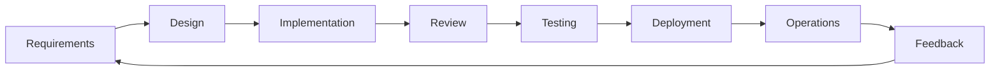
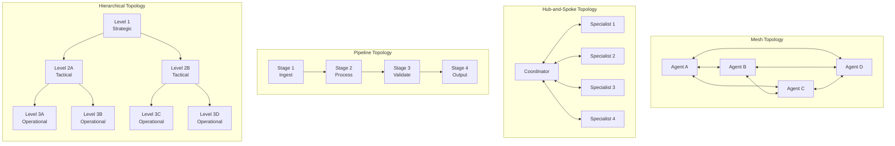
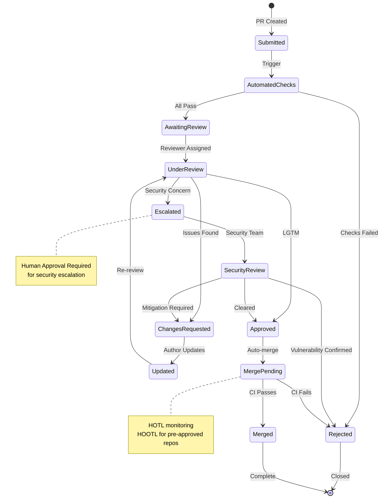
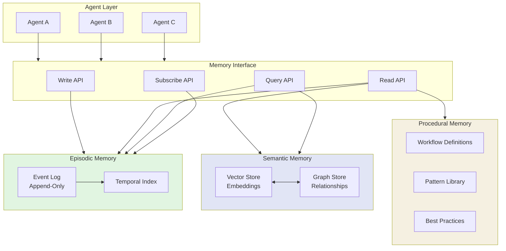
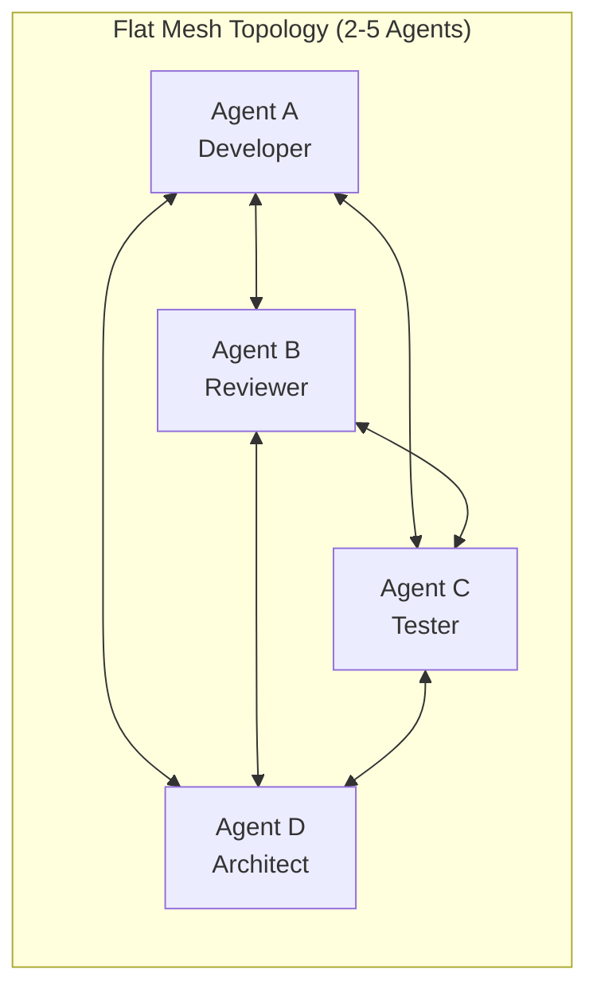
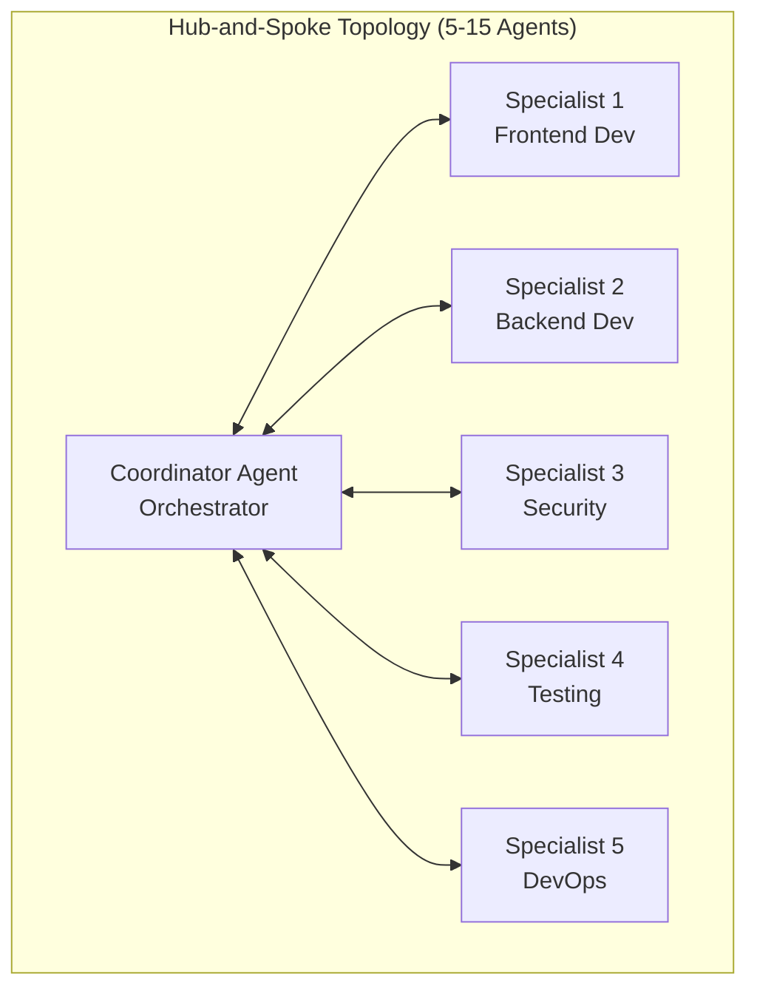
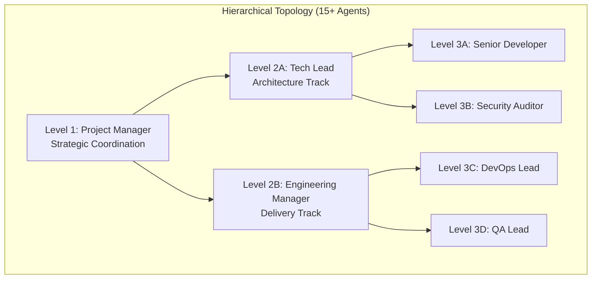
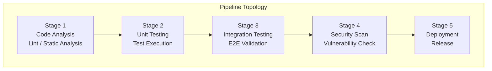
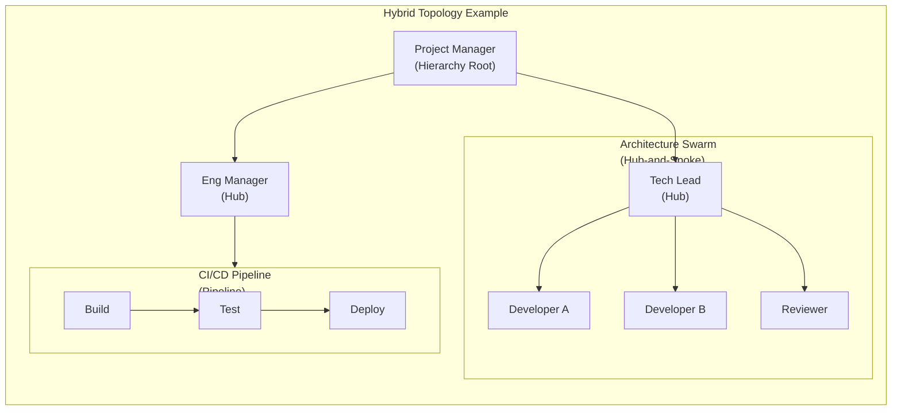
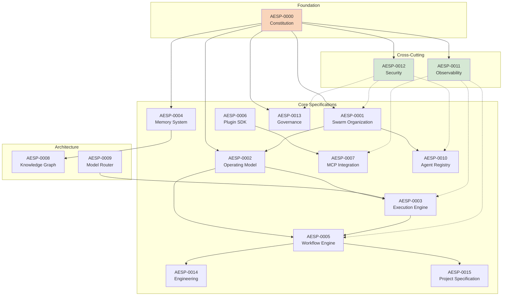

# AESP-0000: Constitution of the Autonomous Engineering Specification

**Version:** 1.0.0-draft  
**Status:** Draft  
**Maturity Target:** Canonical  
**Last Updated:** 2026-07-09  
**Editors:** AESP Standards Committee  

---

## Status of This Specification

This document is **AESP-0000 Constitution**, version 1.0.0-draft, of the Autonomous Engineering Specification (AESP). It defines the foundational principles, governance structure, and specification framework that govern all specifications within the AESP family. As the Constitution, this document occupies a unique position in the standards hierarchy: it is normative for all other specifications, which MUST conform to the framework, terminology, and principles established herein.

The status of this document is **Draft**. It is circulated for review and comment by the broader autonomous engineering community. While in Draft status, substantive changes MAY be made based on community feedback. Upon reaching sufficient maturity through implementation experience and community review, this document is expected to transition to **Canonical** status. The Constitution is designed for long-term stability; its foundational principles SHOULD remain substantially unchanged across revisions. Amendments to the Constitution require a higher bar than amendments to other AESP specifications, as detailed in the governance procedures defined herein.

This specification is intended to be self-contained. It presumes familiarity with software engineering concepts, distributed systems, and AI agent frameworks, but does not require prior knowledge of any specific vendor technology. All terms used with normative force are defined in Section 1.4. The key words "MUST", "MUST NOT", "REQUIRED", "SHALL", "SHALL NOT", "SHOULD", "SHOULD NOT", "RECOMMENDED", "NOT RECOMMENDED", "MAY", and "OPTIONAL" in this document are to be interpreted as described in BCP 14 [RFC2119] [RFC8174] when, and only when, they appear in all capitals.

---

## Abstract

The Autonomous Engineering Specification (AESP) defines a vendor-neutral open standard for Autonomous Engineering Organizations (AEOs) — structured engineering teams composed of AI agents that collaborate under human governance to deliver software engineering outcomes. AESP addresses the fragmentation of the current agent ecosystem, where every framework defines its own communication protocols, memory systems, workflow models, and governance approaches, resulting in vendor lock-in, interoperability failures, and inconsistent human oversight. Without a unifying standard, organizations face escalating integration costs, platform migration barriers, and governance gaps that prevent autonomous engineering from reaching production scale.

This document, the AESP Constitution, establishes the foundational principles, governance model, and specification framework upon which all other AESP specifications are built. It defines the conceptual architecture of an Autonomous Engineering Organization, specifies the requirements language used throughout the standard, and articulates eight foundational principles: autonomy with oversight, vendor neutrality, declarative over imperative specification, machine-readable definitions, extensibility by design, rough consensus and running code, content-addressable artifacts, and continuous evolution. The Constitution further defines the specification lifecycle, the governance structure comprising Domain Committees and a Steering Committee, and the conformance framework for validating implementations. Sixteen related specifications extend the Constitution to cover agent roles, communication protocols, memory systems, workflow orchestration, observability, security, compliance, and other aspects of autonomous engineering. AESP enables organizations to define, deploy, and govern autonomous engineering teams in a portable, interoperable, and auditable manner.

---

## Table of Contents

- [1. Introduction](#1-introduction)
  - [1.1 What is Autonomous Engineering?](#11-what-is-autonomous-engineering)
  - [1.2 What is AESP?](#12-what-is-aesp)
  - [1.3 Motivation](#13-motivation)
  - [1.4 Terminology](#14-terminology)
  - [1.5 Requirements Language](#15-requirements-language)
- [2. Foundational Principles](#2-foundational-principles)
  - [2.1 Autonomy with Oversight](#21-autonomy-with-oversight)
  - [2.2 Vendor Neutrality](#22-vendor-neutrality)
  - [2.3 Declarative over Imperative](#23-declarative-over-imperative)
  - [2.4 Machine-Readable First](#24-machine-readable-first)
  - [2.5 Extensibility by Design](#25-extensibility-by-design)
  - [2.6 Rough Consensus and Running Code](#26-rough-consensus-and-running-code)
  - [2.7 Content-Addressable Artifacts](#27-content-addressable-artifacts)
  - [2.8 Continuous Evolution](#28-continuous-evolution)
- [3. The Autonomous Engineering Organization Model](#3-the-autonomous-engineering-organization-model)
  - [3.1 Definition](#31-definition)
  - [3.2 Core Concepts](#32-core-concepts)
  - [3.3 Organizational Topology](#33-organizational-topology)
  - [3.4 Agent Roles](#34-agent-roles)
  - [3.5 Human Governance Integration](#35-human-governance-integration)
- [4. Specification Framework](#4-specification-framework)
  - [4.1 The AESP Specification Set](#41-the-aesp-specification-set)
  - [4.2 Specification Relationships and Dependencies](#42-specification-relationships-and-dependencies)
  - [4.3 Specification Numbering](#43-specification-numbering)
  - [4.4 Specification Metadata (aesp.yaml)](#44-specification-metadata-aespyaml)
  - [4.5 Cross-Specification References](#45-cross-specification-references)
- [5. Governance Structure](#5-governance-structure)
- [6. Specification Lifecycle](#6-specification-lifecycle)
- [7. Document Standards](#7-document-standards)
- [8. Extension Mechanism](#8-extension-mechanism)
- [9. Conformance and Certification](#9-conformance-and-certification)
- [10. Security Considerations](#10-security-considerations)
- [11. Future Work](#11-future-work)
- [References](#references)
- [Appendices](#appendices)

---

# 1. Introduction

## 1.1 What is Autonomous Engineering?

Autonomous Engineering is the practice of organizing artificial intelligence agents into structured engineering teams that operate under human governance to plan, design, implement, verify, deploy, and maintain software systems. It represents a fundamental shift in how software engineering work is organized — from human teams using AI tools, to mixed teams where AI agents are first-class engineering participants with defined roles, responsibilities, and processes.

### The Analogy to Human Engineering Teams

To understand autonomous engineering, consider how a human software engineering team is organized. A typical team has a tech lead who makes architectural decisions, senior engineers who design systems, junior engineers who implement features, a QA engineer who verifies correctness, a DevOps engineer who manages deployment, and a product manager who prioritizes work. These roles have defined responsibilities, the team communicates through established channels (stand-ups, code reviews, design documents), and decisions follow documented processes (RFCs for major changes, incident post-mortems for failures).

An Autonomous Engineering Organization (AEO) mirrors this structure but with AI agents occupying some or all of these roles. An agent MAY serve as an architect, analyzing requirements and producing design documents. Another agent MAY serve as an implementer, writing code and tests. A third MAY serve as a reviewer, analyzing code for correctness, security, and style compliance. These agents communicate through standardized protocols, maintain organizational memory across sessions, and execute workflows with human oversight at critical decision points.

The critical distinction is structure. Autonomous engineering is not "prompting an LLM to write code." It is the systematic organization of multiple AI agents into a coherent engineering team with:

- **Defined roles**: Each agent has a specific role with bounded responsibilities, analogous to job descriptions in human teams.
- **Structured communication**: Agents communicate through protocols, not ad-hoc prompt chains. Messages have defined schemas, routing rules, and delivery guarantees.
- **Persistent memory**: The organization maintains knowledge across sessions — codebases, decisions, lessons learned, architectural context — through structured memory systems.
- **Process compliance**: Work follows defined workflows with checkpoints, reviews, and approval gates.
- **Human governance**: Humans set direction, approve high-impact decisions, and retain override authority, but need not be involved in every operational detail.

### The Analogy to DevOps

If traditional AI-assisted development is like manual deployment (each release requires human hands-on involvement), autonomous engineering is like DevOps — the automation of the software delivery pipeline with appropriate gates and monitoring. Just as DevOps automated build, test, and deployment processes while retaining human oversight for production changes, autonomous engineering automates engineering workflows while retaining human governance for architectural decisions, security approvals, and strategic direction.

The DevOps movement gave us infrastructure as code, continuous integration, and deployment pipelines. Autonomous engineering gives us **organizations as code** — the ability to define an engineering team's structure, processes, and workflows in machine-readable form, version them, and evolve them systematically.

### The Analogy to Site Reliability Engineering

Site Reliability Engineering (SRE) applies software engineering principles to operations problems. SRE teams define Service Level Objectives (SLOs), error budgets, and automated remediation playbooks. When a service violates its SLO, automation handles the response — paging, rollback, traffic shifting — while humans investigate root causes.

Autonomous engineering applies SRE principles to the engineering process itself. An AEO defines Engineering Level Objectives (ELOs) — targets for code quality, review latency, test coverage, and security posture. When these objectives are violated, automated workflows trigger remediation: code review agents flag issues, testing agents generate additional test cases, security agents scan for vulnerabilities. Human engineers investigate systemic problems and refine the organization's processes.

### The Scope of Autonomous Engineering

Autonomous engineering encompasses the full software engineering lifecycle:



At each stage, AI agents MAY perform work that was previously human-only, always within boundaries defined by human governance. The degree of autonomy varies by context — a critical security patch to a financial system requires more human oversight than a documentation update to an internal tool.

Autonomous engineering is not about replacing human engineers. It is about amplifying human engineering capacity by delegating structured, repeatable work to AI agents organized into coherent teams, freeing humans to focus on creative problem-solving, architectural judgment, and strategic decisions.

## 1.2 What is AESP?

The Autonomous Engineering Specification (AESP) is a vendor-neutral, open technical standard that defines the structures, interfaces, protocols, and behaviors of Autonomous Engineering Organizations. AESP is a specification — not a tool, not a framework, not a platform. It describes what an AEO IS, not how to build one.

### AESP is the "OpenAPI Specification for AI Engineering Organizations"

Just as the OpenAPI Specification defines a standard, language-agnostic interface to HTTP APIs — enabling tools, documentation generators, and testing frameworks to work with any API described in OpenAPI — AESP defines a standard, vendor-agnostic interface to Autonomous Engineering Organizations. An AEO described in AESP can be reasoned about by compliance tools, orchestrated by any conformant platform, monitored by standard observability systems, and governed through consistent human interfaces.

When an API is described with OpenAPI, any OpenAPI-compliant tool can generate client libraries, validate requests, render documentation, or run mock servers. When an AEO is described with AESP, any AESP-compliant platform can:

- Instantiate the organization with the correct agent roles and relationships
- Route communications through the specified protocols
- Enforce the defined workflows and approval gates
- Monitor operational metrics against specified objectives
- Audit decisions and actions for compliance
- Migrate the organization between platforms without redefinition

### AESP is like OCI for Agent Organizations

The Open Container Initiative (OCI) defines open standards for container formats and runtimes, ensuring that a container built with one tool can run on any OCI-compliant runtime. AESP serves an analogous function for agent organizations: an AEO defined with AESP can be deployed on any AESP-compliant orchestration platform.

This portability is critical. Without it, organizations that invest in defining their AEO on one platform face complete redefinition costs to switch platforms. With AESP, the AEO definition is portable — the same definition can be deployed on platform A today and platform B tomorrow, just as an OCI container can run on Docker today and containerd tomorrow.

### AESP is like Kubernetes for Agent Orchestration

Kubernetes defines a declarative API for container orchestration — you describe the desired state (replicas, networking, storage) and Kubernetes converges the actual state toward it. AESP defines a declarative API for agent organization orchestration — you describe the desired organization (roles, workflows, governance policies) and an AESP-compliant platform instantiates and maintains it.

The parallel extends to the ecosystem. Kubernetes spawned a rich ecosystem of tools — Helm for packaging, Prometheus for monitoring, Istio for service mesh — all operating against the Kubernetes API. AESP is designed to spawn a similar ecosystem: organization design tools, governance dashboards, compliance auditors, performance analyzers, and migration tools, all operating against the AESP definitions.

### The Specification Family

AESP comprises sixteen related specifications, each addressing a distinct aspect of autonomous engineering:

| Number | Title | Domain | Status |
|--------|-------|--------|--------|
| AESP-0000 | Constitution | Meta | Draft |
| AESP-0001 | Swarm Organization | Core | Planned |
| AESP-0002 | Operating Model | Core | Planned |
| AESP-0003 | Execution Engine | Core | Planned |
| AESP-0004 | Memory System | Core | Planned |
| AESP-0005 | Workflow Engine | Core | Planned |
| AESP-0006 | Plugin SDK | Core | Planned |
| AESP-0007 | MCP Integration | Core | Planned |
| AESP-0008 | Knowledge Graph | Architecture | Planned |
| AESP-0009 | Model Router | Architecture | Planned |
| AESP-0010 | Agent Registry | Core | Planned |
| AESP-0011 | Observability | Cross-cutting | Planned |
| AESP-0012 | Security | Cross-cutting | Planned |
| AESP-0013 | Governance | Core | Planned |
| AESP-0014 | Engineering | Core | Planned |
| AESP-0015 | Project Specification | Core | Planned |

Each specification is independently versioned, independently implementable, and independently useful. Together, they provide comprehensive coverage of autonomous engineering concerns. The Constitution (this document) governs all specifications; individual specifications define their own conformance requirements within the framework established here.

### What AESP is Not

AESP is deliberately limited in scope. It is NOT:

- **A programming framework**: AESP does not provide code libraries, SDKs, or runtime implementations.
- **A specific AI model**: AESP does not prescribe which AI models agents use. Any model — Claude, GPT, Gemini, Kimi, Llama, Mistral, or future models — can power an AESP-compliant agent.
- **A cloud service**: AESP is not a hosted platform. It is a document that platforms can implement.
- **A replacement for human judgment**: AESP defines how human governance integrates into AEOs, but does not automate human decisions.
- **A security silver bullet**: AESP defines security requirements and interfaces, but implementations must still secure their own infrastructure.

## 1.3 Motivation

The autonomous engineering ecosystem is fragmented. Dozens of frameworks, platforms, and protocols have emerged — each solving pieces of the problem, none providing a coherent, interoperable whole. This fragmentation creates real costs for organizations attempting to adopt autonomous engineering at scale.

### The Fragmentation Problem

Consider the current state of the agent ecosystem:

- **Anthropic** defines the Model Context Protocol (MCP) for agent-to-tool communication.
- **Google** defines the Agent-to-Agent (A2A) protocol for agent-to-agent communication.
- **Microsoft** promotes AutoGen for multi-agent conversation patterns.
- **CrewAI**, **LangGraph**, **LlamaIndex**, and others each define their own orchestration models, memory systems, and workflow definitions.

Each of these is a genuine technical contribution. But they are mutually incompatible. An agent built for MCP cannot directly communicate with an agent built for A2A. A workflow defined in LangGraph cannot execute on CrewAI. A memory system built for one framework is inaccessible to another. Organizations must choose a single ecosystem or invest in expensive integration layers.

AESP solves this by defining the common interfaces that all frameworks can implement, just as HTTP defines the common interface that all web servers and clients implement, regardless of their internal architecture.

### No Standard Way to Describe Agent Teams

Human engineering teams have well-understood descriptive frameworks: organizational charts, role definitions, RACI matrices, and process documentation. Autonomous engineering teams have no equivalent standard.

If an engineering manager wants to describe a human team, they use established tools and formats. If they want to describe an AEO, they must invent their own description format or embed their intent in framework-specific configuration. There is no way to answer basic questions in a standardized way:

- What roles exist in this AEO?
- What are the communication paths between agents?
- What workflows does this AEO follow?
- What approval gates exist?
- What memory does this AEO maintain?
- How is this AEO governed?

AESP provides standardized answers to all of these questions through machine-readable, vendor-neutral definitions.

### Vendor Lock-in Risk

When an organization adopts a specific agent framework, they make a long-term bet. Their agent definitions, workflow configurations, memory schemas, and governance policies become encoded in framework-specific formats. Migrating to a different framework requires redefining everything from scratch.

This is the same lock-in dynamic that motivated open standards for containers (OCI), for APIs (OpenAPI), and for package formats (SPDX). AESP provides the same escape valve: by defining AEOs in a standard format, organizations retain the freedom to move between implementations.

### No Interoperability Between Frameworks

Real engineering organizations use multiple tools. A human team might use Jira for tracking, GitHub for code, Slack for communication, and Datadog for monitoring. These tools interoperate through standard protocols and APIs.

AEOs today cannot interoperate. An AEO built on framework A cannot delegate work to an AEO built on framework B. They cannot share memory, exchange messages, or coordinate workflows. This limits autonomous engineering to isolated tool silos.

AESP defines the interoperability layer — the common protocols and data formats that enable AEOs to work together regardless of their underlying implementation.

### Human Oversight is Ad-Hoc

The most critical gap in current agent frameworks is governance. Most frameworks provide minimal, if any, structured support for human oversight. When a human must review an agent's work, the mechanism is typically framework-specific and inconsistently applied.

AESP treats governance as a first-class concern. It defines standardized human-in-the-loop interfaces, approval workflows, escalation paths, and audit requirements. Human oversight is not an afterthought — it is a foundational principle.

### Memory Systems are Incompatible

An AEO's memory — its accumulated knowledge about codebases, decisions, failures, and lessons learned — is its most valuable asset. Yet memory systems are framework-specific and incompatible. An AEO that switches platforms loses its organizational memory.

AESP defines standard memory interfaces and schemas, enabling memory portability and cross-platform knowledge sharing.

### Security and Compliance Gaps

Autonomous systems that can write code, access production environments, and make architectural decisions represent significant security and compliance risks. Current frameworks provide minimal standardized support for:

- Authentication and authorization of agent actions
- Audit logging of all agent decisions
- Compliance with regulatory requirements (SOC 2, GDPR, etc.)
- Secure handling of credentials and secrets
- Isolation and sandboxing of agent execution

AESP defines security requirements, compliance interfaces, and audit standards that all implementations MUST support.

### The Cost of Inaction

Without a unifying standard, the autonomous engineering ecosystem will continue to fragment. Organizations will face increasing lock-in, integration costs will rise, and the full potential of autonomous engineering — the transformation of software engineering itself — will be delayed by a decade of standards wars.

AESP exists to prevent this outcome by providing the common ground on which the entire ecosystem can build.

## 1.4 Terminology

This section defines terms used throughout the AESP specification family. Terms are listed alphabetically. Each definition is normative — when a term appears in all capitals in any AESP specification, it carries the meaning defined here.

**Agent**
An autonomous software entity that performs engineering work within an AEO. An agent has a defined role, communicates through standardized protocols, maintains state, and operates within governance boundaries. An agent MAY be powered by any AI model or combination of models. An agent is distinct from a "tool" in that an agent has persistent identity, memory, and decision-making authority within its role.

**Autonomous Engineering Organization (AEO)**
A structured engineering team composed of one or more agents operating under human governance through defined roles, responsibilities, processes, and workflows. An AEO is the primary unit of organization in autonomous engineering. An AEO MAY contain human members, agent members, or both. An AEO has persistent identity, memory, and governance policies.

**Conformance**
The degree to which an implementation satisfies the normative requirements of a specification. AESP defines three conformance levels: **Full Conformance** (all MUST-level requirements satisfied), **Partial Conformance** (a documented subset satisfied), and **Non-Conformance** (otherwise). Conformance claims MUST be verifiable through automated testing where possible.

**Domain Committee**
A group of subject matter experts responsible for the technical direction of specifications within a specific domain (e.g., Security, Communication, Workflow). Domain Committees review proposals, adjudicate technical disputes, and recommend specifications for maturity transitions.

**Governance**
The system of rules, practices, and processes by which an AEO is directed and controlled. Governance includes role definitions, approval workflows, escalation paths, audit requirements, and human oversight mechanisms. Governance operates at two levels: the governance of individual AEOs and the governance of the AESP specification itself.

**Human-in-the-Loop (HITL)**
A design pattern requiring human review, approval, or intervention at defined decision points within an AEO workflow. HITL is not continuous human monitoring; it is structured human oversight at critical gates. The scope of HITL — which decisions require human involvement — is configurable per AEO and per workflow.

**Implementation**
A software system, platform, or service that realizes one or more AESP specifications. An implementation MAY be open source or proprietary. An implementation MAY conform to a single specification or to multiple specifications. Implementations are evaluated against the conformance framework.

**Knowledge Graph**
A structured representation of an AEO's accumulated knowledge, including codebase structure, architectural decisions, dependency relationships, failure modes, and lessons learned. The Knowledge Graph serves as the semantic layer of an AEO's memory system.

**MCP (Model Context Protocol)**
A protocol for agent-to-tool communication, originally developed by Anthropic. AESP recognizes MCP as one valid protocol for agent-tool interaction but does not mandate its use.

**Observability**
The capability to understand the internal state of an AEO through its external outputs. Observability encompasses logs, metrics, traces, and events emitted by agents, workflows, and the AEO as a whole.

**Specification**
A document that defines normative requirements for implementations. Each AESP specification addresses a specific aspect of autonomous engineering. Specifications are independently versioned and independently implementable.

**Steering Committee**
The body responsible for the overall direction, coherence, and integrity of the AESP specification family. The Steering Committee approves maturity transitions, resolves cross-domain disputes, and maintains the Constitution.

**Swarm**
A collection of agents collaborating on a shared objective with minimal centralized coordination. A swarm operates through peer-to-peer communication and emergent coordination patterns, as distinct from hierarchically orchestrated workflows.

**Workflow**
A defined sequence of steps, decisions, and transitions that accomplishes an engineering objective. Workflows specify which agents participate, what actions they perform, what data flows between steps, and where approval gates and human oversight are required.

## 1.5 Requirements Language

The key words "MUST", "MUST NOT", "REQUIRED", "SHALL", "SHALL NOT", "SHOULD", "SHOULD NOT", "RECOMMENDED", "NOT RECOMMENDED", "MAY", and "OPTIONAL" in this document are to be interpreted as described in BCP 14 [RFC2119] [RFC8174] when, and only when, they appear in all capitals.

### Usage in AESP

AESP specifications use these terms with the following conventions:

**MUST** and **MUST NOT** indicate absolute requirements. Implementations that do not satisfy all MUST-level requirements are non-conformant. For example: "Implementations MUST support JSON as a serialization format" means that any implementation claiming conformance MUST be capable of reading and writing JSON.

**SHOULD** and **SHOULD NOT** indicate strong recommendations. There MAY be valid reasons in particular circumstances to ignore these recommendations, but the full implications must be understood and carefully weighed before choosing a different course. For example: "Workflow definitions SHOULD use content-addressable identifiers" means that while other identifier schemes are permitted, content-addressable identifiers are strongly preferred.

**MAY** and **OPTIONAL** indicate truly optional features. Implementations can choose whether to support these features without affecting conformance. For example: "Implementations MAY support YAML in addition to JSON" means that YAML support is permitted but not required.

The use of **REQUIRED** is equivalent to **MUST**. The use of **RECOMMENDED** is equivalent to **SHOULD**. The use of **NOT RECOMMENDED** is equivalent to **SHOULD NOT**. These alternative forms are used for stylistic variety but carry identical normative force.

AESP specifications use these terms exclusively for normative requirements. Explanatory text, examples, and rationale do not use capitalized keywords. When a keyword appears in lowercase in running text, it carries no normative meaning.

Implementers should note that **SHOULD**-level requirements are not optional recommendations to be casually disregarded. They represent the consensus of the specification authors about best practices. Deviations from SHOULD-level requirements SHOULD be documented and justified.

---

# 2. Foundational Principles

This section defines the eight foundational principles that govern all AESP specifications. These principles are invariant across specifications and versions. They guide specification authors, implementers, and users of the standard. Every AESP specification MUST be consistent with these principles.

## 2.1 Autonomy with Oversight

Agents MUST operate autonomously within defined boundaries. Human governance MUST be integrated at critical decision points.

### Bounded Autonomy

The principle of bounded autonomy holds that agents possess the authority to make decisions and take actions within the scope of their defined role, but that authority is bounded by governance policies set by humans. These boundaries are not afterthoughts — they are fundamental to the architecture of every AEO.

Consider a code review agent. Its role includes analyzing pull requests for correctness, security vulnerabilities, style compliance, and test coverage. Within this role, the agent operates autonomously: it reads the code, runs static analysis, compares against organizational standards, and produces a review report. It does not require human approval to perform this analysis.

However, if the review identifies a critical security vulnerability, the governance policy may require human escalation. The agent flags the finding and blocks merge pending human review. The human retains final authority over security-critical decisions.

This is bounded autonomy: the agent has full authority within its lane, but lanes have guardrails, and guardrails are set by humans.

### Governance Integration Points

AESP identifies three categories of governance integration points:

**Mandatory Human Approval (MHA)**: Certain actions MUST NOT proceed without explicit human approval. Examples include: deploying to production, modifying security policies, accessing sensitive data, changing architectural decisions, and disabling audit logging. The set of MHA actions is configurable per AEO but MUST include a baseline set defined by AESP-0012 (Security) and AESP-0013 (Governance).

**Human Notification (HN)**: Certain actions MUST notify a designated human but do not block on human response. Examples include: completion of significant milestones, detection of anomalies, exhaustion of error budgets, and failure of critical workflows. The human MAY intervene but is not required to.

**Fully Autonomous (FA)**: Routine actions within an agent's defined role MAY proceed without human involvement. Examples include: running tests, formatting code, updating documentation, triaging low-priority issues, and generating routine reports.

The classification of actions into these categories is itself a governance policy, defined in the AEO's governance specification and subject to human configuration.

### The Principle of Progressive Autonomy

AEOs SHOULD implement progressive autonomy — new agents or agents in new domains operate with more restrictive boundaries until they demonstrate reliability. As an agent accumulates successful outcomes and organizational trust, its boundaries MAY expand. This mirrors how human engineers gain responsibility: junior engineers require more review, senior engineers operate with greater autonomy.

Progressive autonomy is not automatic. Boundary expansion MUST be a deliberate governance decision, supported by observability data demonstrating the agent's reliability.

## 2.2 Vendor Neutrality

AESP MUST NOT favor any specific AI model provider, framework, or platform. Specifications MUST be implementable by any AI system, present or future.

### Influence Through Contribution, Not Sponsorship

AESP is governed by the principle that influence is earned through technical contribution, not purchased through sponsorship. No vendor, regardless of market position or financial contribution, receives preferential treatment in the standard. Specifications are evaluated on technical merit, implementability, and community benefit — not on their alignment with any vendor's product strategy.

This principle is essential to the standard's credibility. If AESP were perceived as favoring Claude over GPT, or Google over Anthropic, the ecosystem would fragment along vendor lines, and the standard would fail in its primary purpose: unification.

### Model Neutrality

AESP specifications MUST be implementable using any AI model or combination of models. An agent role defined in AESP does not specify which model powers the agent. A workflow defined in AESP does not assume specific model capabilities. A memory system defined in AESP does not depend on model-specific context windows or embedding formats.

This does not mean AESP ignores model differences. AESP acknowledges that different models have different strengths, context limits, and reasoning capabilities. Specifications MAY define capability requirements (e.g., "the agent MUST be capable of reasoning about code dependencies") without prescribing which model satisfies those requirements.

### Protocol Neutrality

AESP does not mandate specific underlying protocols. While AESP-0007 defines the MCP Integration framework, it permits multiple transport bindings. An AEO MAY use MCP for agent-tool communication, A2A for agent-agent communication, or any future protocol that satisfies the framework's requirements. AESP defines the abstract interface; concrete protocol bindings are implementation choices.

### Platform Neutrality

AESP specifications MUST NOT require specific runtime platforms, cloud providers, or operating systems. An AESP-compliant implementation MAY run on AWS, GCP, Azure, on-premises infrastructure, or edge devices. The standard defines portable interfaces, not platform-specific implementations.

## 2.3 Declarative over Imperative

AESP describes WHAT an AEO is, not HOW to implement it. All specifications define structures, interfaces, and behaviors declaratively.

### The Declarative Approach

A declarative specification defines the desired state without prescribing the steps to achieve it. Consider the difference between:

- **Imperative**: "To create an agent, first initialize the runtime, then load the model weights, then configure the context window, then set the system prompt, then register the tools..."
- **Declarative**: "An Agent is an entity with the following properties: role, model requirements, tool bindings, memory configuration, and governance boundaries."

AESP uses the declarative approach. An AEO definition is a document — a JSON or YAML artifact — that describes the organization's structure. Any implementation that can read this document and produce an AEO matching the described structure is conformant. How the implementation achieves this is outside the scope of the specification.

This approach provides several benefits:

**Implementation Independence**: Multiple independent implementations can exist, each bringing different technical approaches, performance characteristics, and operational models. Competition among implementations drives innovation while the standard ensures interoperability.

**Version Control**: Declarative definitions can be version-controlled, diffed, reviewed, and rolled back, just like infrastructure-as-code definitions.

**Tooling Ecosystem**: Declarative definitions enable a rich ecosystem of tools — linters, validators, visualization tools, migration assistants — that operate on the definition itself.

**Auditability**: A declarative definition is a complete, inspectable specification of the AEO's intended structure. Auditors can verify that an AEO's definition matches its governance requirements without needing to understand the implementation.

### Normative Schemas

Every AESP specification MUST provide a normative schema (JSON Schema or equivalent formal definition) that defines the valid structures for that specification's domain. Human-readable prose accompanies these schemas, explaining semantics, constraints, and intended usage. In case of ambiguity, the normative schema is authoritative.

### Behavioral Specification

AESP specifications define not just data structures but also behaviors — how agents communicate, how workflows execute, how memory is retrieved. These behavioral specifications are declarative in that they define the observable effects without prescribing implementation algorithms. For example, AESP-0005 specifies that a workflow step MUST complete before subsequent steps begin, but does not specify how the orchestration engine schedules those steps.

## 2.4 Machine-Readable First

All AESP specifications MUST be machine-readable. Human-readable prose accompanies normative schemas but does not replace them.

### The Primacy of Machine-Readable Definitions

In any conflict between the human-readable prose of a specification and its machine-readable schema, the machine-readable schema is authoritative. This rule ensures that automated tools — validators, code generators, compliance auditors — can operate reliably without natural language parsing.

The machine-readable definition is the specification. The human-readable prose is commentary, explanation, and guidance.

### Schema Formats

AESP specifications use JSON Schema [JSON-SCHEMA] as the primary schema definition language. YAML is permitted as an alternative serialization format for specifications that are conventionally authored in YAML. Every specification MUST provide:

1. A JSON Schema defining the valid document structures.
2. At least one example document in valid JSON.
3. Human-readable documentation of each schema element.

### Schema Versioning

Schemas are versioned independently of specification documents. A schema version is identified by a URI of the form:

```
https://spec.aesp.dev/schemas/{spec-number}/{major}.{minor}.{patch}
```

For example, the schema for AESP-0001, version 2.1.0, is available at:

```
https://spec.aesp.dev/schemas/0001/2.1.0
```

Schema URIs are immutable. A published schema URI MUST NOT change its content. Corrections require a new schema version.

## 2.5 Extensibility by Design

AESP specifications include a defined extension mechanism that enables implementations to add capabilities beyond the standard without breaking interoperability.

### The x-aesp-* Extension Prefix

Implementations MAY add vendor-specific or implementation-specific fields to AESP documents by using field names prefixed with `x-aesp-`. For example:

```json
{
  "agent_id": "agent-001",
  "role": "code-reviewer",
  "x-aesp-acme-custom-field": "acme-specific-value"
}
```

Fields without the `x-aesp-` prefix MUST be defined in the relevant AESP specification. Unknown non-prefixed fields MUST cause validation errors.

### Postel's Law: Conservative in What You Send, Liberal in What You Accept

Implementations of AESP specifications MUST follow Postel's Law:

- **When producing (sending)**: Implementations MUST include only fields defined in the specification plus `x-aesp-*` extensions. They MUST NOT include unknown non-prefixed fields.
- **When consuming (receiving)**: Implementations MUST ignore unknown `x-aesp-*` fields. They MUST NOT fail due to the presence of unknown extensions. They SHOULD preserve unknown extensions when round-tripping documents.

This rule ensures that extensions do not break interoperability. An implementation that does not understand a particular extension can safely ignore it while still processing the standard fields correctly.

### Extension Graduation

Extensions that prove broadly useful MAY graduate to standard features through the specification evolution process. An extension graduates when:

1. At least two independent implementations support the extension.
2. A specification change proposal is submitted to the relevant Domain Committee.
3. The proposal receives rough consensus from the committee.
4. The Steering Committee approves the change.

Upon graduation, the `x-aesp-` prefix is removed, and the field becomes part of the standard schema.

### Extension Registration

Implementations SHOULD register their extensions in the AESP Extension Registry to promote awareness and potential standardization. Registration is not mandatory but is RECOMMENDED for extensions intended for broad use.

## 2.6 Rough Consensus and Running Code

Decisions in the AESP standards process are made by rough consensus, not unanimity. Specifications MUST be validated by at least two independent implementations before reaching stable maturity.

### Rough Consensus

Rough consensus, as defined in [RFC7282], is the dominant view, not necessarily the unanimous view. The standards process seeks decisions that the group can live with, not decisions that everyone loves. Dissent is noted but does not block progress when the dominant view is clear.

The test for rough consensus is not "does everyone agree?" but "is anyone strongly opposed?" If a participant has a fundamental objection — a concern that the proposal, if adopted, would cause serious harm to the standard or its implementability — that concern must be addressed. Mere preference for a different approach is not a fundamental objection.

### Running Code

No AESP specification reaches **Stable** maturity without at least two independent, interoperable implementations. This requirement ensures that specifications are grounded in implementation experience, not theoretical design.

The running code requirement serves several purposes:

- **Technical validation**: Implementation reveals issues that specification review does not catch.
- **Interoperability verification**: Multiple implementations confirm that the specification is unambiguous and complete.
- **Practical feedback**: Implementors provide feedback on usability, performance, and edge cases.
- **Ecosystem signal**: The existence of multiple implementations signals to the market that the specification is viable.

Implementations used to satisfy the running code requirement MUST be independent — they MUST NOT share code, developers, or organizational sponsorship. This independence requirement ensures that the specification, not a common implementation, is what enables interoperability.

### The Standards Track

Specifications progress through maturity levels (defined in Section 6) based on implementation experience and community review. Early maturity levels (Experimental, Draft) do not require multiple implementations. **Stable** and **Canonical** maturity levels do.

## 2.7 Content-Addressable Artifacts

All AEO artifacts — agent definitions, workflow definitions, policy documents, knowledge graph nodes, and other persistent objects — SHOULD use content-addressable identifiers based on SHA256 cryptographic digests.

### Content Addressing

A content-addressable identifier is derived from the content it identifies. The SHA256 digest of an artifact's canonical serialization serves as its identifier. Two artifacts with identical content have identical identifiers. Two artifacts with different content have different identifiers with overwhelming probability.

Content-addressable identifiers have the form:

```
sha256:{hex-encoded-sha256-digest}
```

For example:

```
sha256:e3b0c44298fc1c149afbf4c8996fb92427ae41e4649b934ca495991b7852b855
```

### Benefits of Content Addressing

**Immutability**: Once an artifact is identified by its content, it cannot change. If the content changes, the identifier changes. This immutability simplifies caching, replication, and reasoning about system state.

**Deduplication**: Identical artifacts stored in multiple locations share a single identifier. Deduplication is automatic — no additional comparison is needed.

**Integrity Verification**: When an artifact is retrieved by its content address, the recipient can verify integrity by recomputing the digest. Any tampering or corruption is immediately detected.

**Distributed Storage**: Content-addressed artifacts can be stored in any location — local disk, object storage, content delivery networks — and retrieved without a central registry. The identifier itself is sufficient to locate and verify the artifact.

### Canonical Serialization

To ensure that the same logical content always produces the same digest, AESP defines canonical serialization rules:

1. JSON artifacts MUST be serialized with keys in lexicographic order.
2. Whitespace MUST follow the minimal format: no trailing whitespace, single space after colon and comma, newline after each element in arrays and objects.
3. Numeric values MUST be serialized without exponent notation when the exponent is zero.
4. String encoding MUST be UTF-8.

These rules ensure that two implementations producing the same logical artifact generate identical digests.

### Transition from Location-Based Addressing

AESP acknowledges that many existing systems use location-based addressing (URIs, file paths, database keys). Implementations MAY use content-addressable identifiers alongside location-based identifiers during transition periods. New implementations SHOULD use content-addressable identifiers as the primary addressing scheme.

## 2.8 Continuous Evolution

AESP is a living standard. Specifications evolve through a defined lifecycle. Breaking changes are managed through deprecation with sunset dates. Migration paths MUST be provided.

### The Living Standard Model

AESP does not publish versioned releases of the specification family as a whole. Each specification evolves independently, at its own pace, according to its own maturity lifecycle. The Constitution provides the stable foundation; individual specifications grow, mature, and occasionally retire as the field advances.

This model is inspired by the WhatWG Living Standard model for HTML and the continuous evolution of the Unicode Standard. It acknowledges that autonomous engineering is a rapidly evolving field and that a standard that requires years between versions will be perpetually behind the state of the art.

### Specification Lifecycle

Each AESP specification progresses through defined maturity levels:

- **Experimental**: Early-stage specifications for community review. Subject to significant change. Not suitable for production use.
- **Draft**: Specifications that have received substantial community feedback and at least one implementation. May still change based on experience.
- **Stable**: Specifications with at least two independent implementations, broad review, and stable interfaces. Suitable for production use.
- **Canonical**: Specifications that have proven their value over time, reached wide adoption, and become foundational. Changes are rare and require extraordinary process.
- **Retired**: Specifications that have been superseded by newer specifications or withdrawn for other reasons. Retired specifications remain available for reference but MUST NOT be used for new implementations.

Detailed lifecycle rules are defined in Section 6.

### Deprecation and Breaking Changes

Breaking changes to **Stable** or **Canonical** specifications are strongly discouraged. When necessary, they MUST follow the deprecation policy:

1. The change is announced in the specification's change log at least two maturity cycles before taking effect.
2. A migration guide is published alongside the announcement.
3. Both old and new behaviors are supported during a transition period of at least 12 months.
4. The old behavior is clearly marked as deprecated in documentation and, where possible, in machine-readable schemas.
5. After the transition period, the old behavior MAY be removed.

### Migration Paths

Every breaking change MUST include a documented migration path. The migration path describes how existing implementations can transition from the old behavior to the new behavior. Migration paths are reviewed by the relevant Domain Committee and MUST be approved before the breaking change is finalized.

### Backward Compatibility

AESP specifications strive for backward compatibility. New versions of a specification SHOULD be supersets of previous versions — they add capabilities without removing existing ones. When backward compatibility cannot be maintained, the deprecation process provides a graceful transition.

---

# Section 3: The Autonomous Engineering Organization Model

## 3.1 Definition

An **Autonomous Engineering Organization (AEO)** is a structured collection of AI agents operating under human governance to deliver engineering outcomes. An AEO is not merely a group of agents executing tasks; it is an organized, governable system that mirrors the structure, accountability, and operational patterns of human engineering organizations while leveraging autonomous agents for execution velocity and scale.

An AEO comprises six essential elements that MUST be present for any valid organization:

1. **Defined Roles** — Each agent within the organization has a clearly specified role that defines its responsibilities, authority boundaries, required capabilities, and communication patterns. Roles are not ad hoc; they are deliberately designed to cover the full lifecycle of engineering delivery, from requirements analysis through design, implementation, testing, deployment, and operations.

2. **Communication Protocols** — Agents within an AEO communicate through well-defined protocols that specify message formats, transport mechanisms, routing patterns, and error handling. These protocols enable coordination among agents that may be implemented by different vendors, using different underlying models, or operating in different runtime environments.

3. **Memory Systems** — An AEO maintains persistent memory across three tiers: episodic memory (records of events and interactions), semantic memory (factual knowledge about codebases, systems, and relationships), and procedural memory (knowledge of how to perform tasks, including workflows, patterns, and best practices). This memory persists across sessions and is shared among authorized agents within the organization.

4. **Workflows** — Engineering work within an AEO is structured as workflows: defined sequences of activities with explicit states, transitions, approval gates, error handling, and input/output contracts. Workflows ensure that engineering processes are repeatable, observable, and governable.

5. **Governance Policies** — Human oversight is not optional. An AEO operates under governance policies that define approval requirements, rate limits, security boundaries, budget constraints, and audit requirements. These policies constrain agent behavior and ensure that autonomous action remains within human-defined boundaries.

6. **Observability** — All agent actions, decisions, communications, and state changes within an AEO are observable. This includes structured logging, metrics, tracing, and audit trails that enable humans to understand what the organization is doing, diagnose problems, and demonstrate compliance.

A critical principle of the AEO model is that it is **DECLARATIVE**. An AEO describes the desired state of an engineering organization — its structure, its processes, its governance constraints — independent of any particular implementation. The same AEO specification can be realized by multiple implementations, just as the same Kubernetes deployment specification can be scheduled onto different container runtimes. This declarative nature enables portability, interoperability, and vendor independence.

An AEO specification MUST be serializable to a machine-readable document in JSON or YAML format. This serialization includes the complete description of roles, communication topology, workflow definitions, governance policies, and memory configuration. The serialized form enables version control, code review, automated validation, and programmatic manipulation.

Multiple implementations MAY realize the same AEO specification. An AEO might be executed by a LangGraph-based runtime, a CrewAI-based platform, a custom framework, or a cloud-hosted AEO service. The specification does not prescribe the implementation technology; it defines the contract that any implementation MUST satisfy to be considered a conforming AEO runtime.

---

## 3.2 Core Concepts

This section defines the foundational concepts upon which the AEO model is built. These concepts are referenced throughout the AESP specification set and MUST be understood by implementers.

### 3.2.1 Agent

An **Agent** is an autonomous computational entity capable of perceiving its environment, making decisions, and taking actions to achieve objectives. Within an AEO, an Agent is not merely a language model invocation; it is a persistent, stateful entity with well-defined attributes.

An Agent has the following attributes:

- **Role**: The responsibilities and scope of the agent within the organization. The role defines what the agent is accountable for, what decisions it can make autonomously, and what requires escalation. Roles are defined in Section 3.4.
- **Capabilities**: The tools, skills, and APIs that the agent can access. Capabilities include both internal tools (provided by the AEO runtime) and external tools (accessed via protocols such as MCP). Capabilities are declared in the agent's **Agent Card** — a JSON metadata document describing what the agent can do, what inputs it expects, and what outputs it produces.
- **Memory**: The agent's access to the three-tier memory system. Each role has defined read and write permissions for episodic, semantic, and procedural memory tiers. Agents accumulate episodic memory through their interactions and can query semantic and procedural memory to inform their decisions.
- **Communication Interface**: The protocols through which the agent interacts with other agents, human operators, and external systems. This includes support for A2A (Agent-to-Agent) protocol, MCP (Model Context Protocol), and human-facing notification mechanisms.
- **Governance Bindings**: The approval requirements, constraints, and audit rules that apply to this agent. Governance bindings are role-specific and define what actions the agent can take autonomously, what requires human approval, and what is prohibited.

An Agent's behavior emerges from the interaction of its role definition, its capabilities, its memory access, and its governance bindings. Two agents with identical underlying models but different roles or governance bindings will exhibit different behavior patterns.

### 3.2.2 Swarm

A **Swarm** is a coordinated group of agents that collaborate to achieve shared objectives. A swarm is not merely a collection of agents; it is an organizational unit with defined structure, communication patterns, and membership rules.

A Swarm has the following attributes:

- **Topology**: The structural arrangement of agents within the swarm. Common topologies include mesh (all-to-all communication), hub-and-spoke (central coordinator), pipeline (sequential stages), and hierarchical (multi-level management). Topologies are defined in detail in Section 3.3.
- **Communication Patterns**: The routing patterns used for inter-agent communication. Patterns include broadcast (one-to-all), point-to-point (direct), publish/subscribe (topic-based), and request/response (synchronous). The choice of communication pattern depends on the topology and the nature of the work.
- **Shared Objectives**: The goals that all agents in the swarm work toward. Objectives are typically expressed as specifications or requirements documents that the swarm is responsible for delivering.
- **Dynamic Membership**: The ability for agents to join and leave the swarm at runtime. New agents may be instantiated to handle increased workload or specialized tasks; existing agents may be terminated when their work is complete. Membership changes MUST be observable and auditable.

The following Mermaid diagram illustrates the four primary swarm topologies:



A swarm's topology and communication patterns together define its **coordination model**. Different coordination models are appropriate for different types of work: a mesh topology with broadcast communication suits brainstorming and exploration; a pipeline topology with sequential routing suits CI/CD processes; a hierarchical topology with command-and-control routing suits large-scale project management.

### 3.2.3 Workflow

A **Workflow** is a defined sequence of activities that transforms inputs into outputs through a series of states. Workflows are the mechanism by which an AEO delivers engineering outcomes in a repeatable, observable, and governable manner.

A Workflow has the following attributes:

- **States and Transitions**: A workflow is a state machine. Each state represents a point in the process where specific work is performed or a decision is made. Transitions define how the workflow moves from one state to another, triggered by events, conditions, or timers.
- **Human Approval Gates**: Transitions between certain states MAY require human approval. An approval gate is a defined point in the workflow where execution pauses until a human operator reviews the current state and either approves continuation, requests changes, or rejects the workflow.
- **Error Handling and Retries**: Each state and transition defines error handling behavior, including retry policies (maximum attempts, backoff strategies), fallback states, and escalation paths for unrecoverable errors.
- **Observability Hooks**: Each state transition emits events that are captured by the observability system. This enables real-time monitoring, alerting, and post-hoc analysis of workflow execution.
- **Input/Output Contracts**: Each workflow defines the expected inputs and guaranteed outputs, including data formats, validation rules, and error responses.

The following Mermaid state diagram illustrates a representative code review workflow:



Workflows MAY compose: the output of one workflow MAY serve as the input to another. This composability enables complex engineering processes to be built from simpler, reusable workflow components.

### 3.2.4 Memory

An AEO's **Memory System** provides persistent storage of knowledge across three tiers. This three-tier model is inspired by cognitive science research on human memory and adapted for the requirements of autonomous engineering organizations.

The three tiers are:

- **Episodic Memory**: Records of events and experiences. This includes agent conversations, tool invocations, decisions made, errors encountered, and workflow state transitions. Episodic memory is temporal — it captures what happened, when, and in what context. Episodic memory is typically implemented as an append-only event log, supporting audit requirements and enabling replay and analysis.
- **Semantic Memory**: Factual knowledge about the domain. This includes codebase structure, API documentation, dependency graphs, system architecture, and relationships between entities. Semantic memory is typically implemented using a hybrid vector-plus-graph architecture: vector embeddings enable similarity search, while graph structure captures relationships and dependencies.
- **Procedural Memory**: Knowledge of how to perform tasks. This includes workflow definitions, coding patterns, debugging strategies, deployment procedures, and organizational best practices. Procedural memory encodes the organization's accumulated operational wisdom.

The following Mermaid diagram illustrates the memory architecture:



Agents interact with memory through a unified **Memory Interface** that provides write, read, query, and subscribe operations. The interface abstracts the underlying storage implementation, enabling different storage backends to be used without changing agent code.

### 3.2.5 Governance Policy

A **Governance Policy** is a rule or set of rules that constrain agent behavior within defined boundaries. Governance policies are what make an autonomous system accountable to human operators.

Governance policies include:

- **Human Approval Requirements**: Definitions of which actions require explicit human approval before execution. Common examples include: deployments to production environments, changes to security configurations, modifications to governance policies themselves, and access to sensitive data.
- **Rate Limits and Budgets**: Constraints on resource consumption, including API call rates, token usage limits, compute budgets, and time allocations. These prevent runaway costs and ensure fair resource distribution.
- **Security Boundaries**: Definitions of what agents can access, what data they can handle, and what operations they can perform. Security boundaries include network isolation, data classification levels, and privilege separation between roles.
- **Audit Requirements**: Rules about what MUST be logged, how long logs MUST be retained, and who can access audit records. Audit requirements ensure that agent actions can be reviewed and that the organization can demonstrate compliance.

Governance policies are **composable**: multiple policies MAY apply to the same agent, and the most restrictive interpretation MUST be applied when policies conflict. Policies are evaluated at decision points — before an agent takes an action, the runtime checks all applicable policies and either permits the action, requires approval, or denies it.

---

## 3.3 Organizational Topology

An AEO's **Organizational Topology** defines the structural arrangement of agents and the communication patterns between them. The topology determines how work is distributed, how decisions are made, and how information flows through the organization.

The following five topologies are defined as standard patterns. Real-world AEOs typically use hybrid combinations of these patterns.

### Flat (Mesh)

In a **Flat (Mesh)** topology, every agent can communicate directly with every other agent. There is no central coordinator; agents self-organize to assign work and coordinate activities.

**Characteristics:**
- All agents are peers
- Communication is all-to-all
- No single point of failure
- No coordination bottleneck

**Best for:** Small teams of 2-5 agents working on closely related tasks. Exploration and brainstorming phases where rapid iteration and cross-pollination of ideas are valued.

**Limitations:** Does not scale beyond approximately 5 agents. Communication overhead grows quadratically with team size. No clear escalation path. Risk of conflicting actions without central coordination.



### Hub-and-Spoke

In a **Hub-and-Spoke** topology, a central coordinator agent delegates work to specialist agents and aggregates their results. The coordinator is the single point of contact for the swarm.

**Characteristics:**
- Central coordinator manages work distribution
- Specialists focus on their domains
- Clear routing: all communication goes through the hub
- Coordinator can become a bottleneck

**Best for:** Teams of 5-15 agents with clear division of labor. Scenarios where work can be decomposed into independent tasks that specialists can execute in parallel.

**Limitations:** The coordinator is a single point of failure and a potential bottleneck. Coordinator complexity increases with team size. Less fault-tolerant than mesh.



### Hierarchical

In a **Hierarchical** topology, agents are organized into multiple levels. Higher-level agents manage lower-level agents, which may themselves manage other agents. This is a recursive application of the hub-and-spoke pattern.

**Characteristics:**
- Multiple levels of management
- Work decomposes recursively
- Clear chain of command
- Scales to large organizations

**Best for:** Organizations of 15+ agents. Complex projects with multiple workstreams that require strategic coordination. Scenarios where decisions at different levels require different expertise and authority.

**Limitations:** Adds latency due to multiple routing hops. Information may be lost or distorted as it passes up and down the hierarchy. More complex to configure and observe.



### Pipeline

In a **Pipeline** topology, work flows sequentially through stages. Each stage is a specialized agent or swarm that transforms the work product and passes it to the next stage.

**Characteristics:**
- Sequential processing stages
- Each stage has defined input/output contracts
- Predictable flow
- Easy to observe and debug

**Best for:** CI/CD processes, code review pipelines, release management, and any process where work must pass through a series of quality gates. Predictable, repeatable processes.

**Limitations:** Rigid — difficult to handle branching or iteration. Throughput limited by the slowest stage. Not suitable for exploratory or creative work where the process is not known in advance.



### Hybrid

A **Hybrid** topology combines two or more of the above patterns. Most real-world AEOs use hybrid topologies that match the organizational structure to the work being performed.

For example, a hybrid topology might use a hierarchical structure at the strategic level, with hub-and-spoke swarms for each workstream, and pipeline topologies within each workstream for CI/CD processes.



---

## 3.4 Agent Roles

An AEO defines standard **Agent Roles** that cover the full lifecycle of engineering delivery. Each role has defined responsibilities, required capabilities, communication patterns, and approval authority. Implementations MAY extend this set with additional roles, but all implementations MUST support the core roles defined here.

### Architect

The **Architect** role is responsible for system design and technology decisions.

| Attribute | Definition |
|-----------|------------|
| Responsibilities | System architecture, technology selection, API design, technical standards, cross-cutting concerns |
| Required Capabilities | Design tools, architecture visualization, technology research, pattern libraries |
| Communication Patterns | Publishes design documents, reviews implementation plans, consults on technical decisions |
| Approval Authority | Can approve design decisions and technology choices; cannot approve deployments or security exceptions |

### Developer

The **Developer** role is responsible for code implementation and testing.

| Attribute | Definition |
|-----------|------------|
| Responsibilities | Feature implementation, bug fixes, unit tests, code documentation, refactoring |
| Required Capabilities | Code editors, compilers, test frameworks, version control, debugging tools |
| Communication Patterns | Receives tasks from Architect/PM, submits code for review, reports progress to coordinator |
| Approval Authority | Can commit code to feature branches; cannot merge to main without review |

### Reviewer

The **Reviewer** role is responsible for code review and quality assurance.

| Attribute | Definition |
|-----------|------------|
| Responsibilities | Code review, quality assessment, adherence to standards, feedback provision |
| Required Capabilities | Static analysis tools, diff viewers, style checkers, test result analysis |
| Communication Patterns | Receives review requests, publishes review comments, approves or rejects changes |
| Approval Authority | Can approve or reject code changes; can request changes; escalates security concerns |

### Security Auditor

The **Security Auditor** role is responsible for security analysis and vulnerability assessment.

| Attribute | Definition |
|-----------|------------|
| Responsibilities | Security review, vulnerability scanning, threat modeling, compliance verification |
| Required Capabilities | Security scanners, SAST/DAST tools, threat intelligence databases, compliance checklists |
| Communication Patterns | Audits code and deployments, publishes security findings, escalates critical issues |
| Approval Authority | Can block deployments with security findings; can approve security exceptions with HITL |

### DevOps Engineer

The **DevOps Engineer** role is responsible for infrastructure, deployment, and operations.

| Attribute | Definition |
|-----------|------------|
| Responsibilities | Infrastructure management, CI/CD pipeline operation, deployment execution, monitoring |
| Required Capabilities | Infrastructure-as-code tools, container orchestration, monitoring systems, cloud APIs |
| Communication Patterns | Receives deployment requests, executes deployments, reports infrastructure status |
| Approval Authority | Can execute pre-approved deployments; production deployments require HITL |

### Product Manager

The **Product Manager** role is responsible for requirements and prioritization.

| Attribute | Definition |
|-----------|------------|
| Responsibilities | Requirements gathering, prioritization, roadmap management, stakeholder communication |
| Required Capabilities | Requirements management tools, analytics, user feedback systems, project planning |
| Communication Patterns | Defines requirements, prioritizes work, validates deliverables, communicates status |
| Approval Authority | Can approve feature completeness; can prioritize work; cannot override security decisions |

### Technical Writer

The **Technical Writer** role is responsible for documentation.

| Attribute | Definition |
|-----------|------------|
| Responsibilities | API documentation, user guides, runbooks, architecture documentation |
| Required Capabilities | Documentation generators, diagramming tools, style checkers, review workflows |
| Communication Patterns | Collaborates with developers for accuracy, publishes documentation, maintains docs |
| Approval Authority | Can publish documentation updates; content changes require domain review |

### Test Engineer

The **Test Engineer** role is responsible for test design and execution.

| Attribute | Definition |
|-----------|------------|
| Responsibilities | Test strategy, test case design, test automation, test execution, quality reporting |
| Required Capabilities | Test frameworks, automation tools, coverage analyzers, defect tracking |
| Communication Patterns | Designs tests from requirements, executes test suites, reports quality metrics |
| Approval Authority | Can approve test plans; can block releases on quality grounds with evidence |

Roles are not mutually exclusive. A single agent MAY hold multiple roles, and multiple agents MAY hold the same role. The assignment of roles to agents is part of the AEO specification and can be changed at runtime.

---

## 3.5 Human Governance Integration

An AEO operates under human governance. The degree of human involvement varies based on the criticality of decisions, the maturity of the system, and organizational risk tolerance. This section defines the standard governance modes and mechanisms.

### Governance Modes

Three governance modes define the relationship between human operators and autonomous agents:

**Human-in-the-Loop (HITL)**: A human MUST approve or reject specific actions before they are executed. The agent proposes an action, the action is presented to a human operator, and the action is only executed upon explicit approval. HITL mode is used for high-risk actions such as production deployments, security configuration changes, access grants, and financial transactions.

In HITL mode, the workflow runtime pauses at the approval gate and does not proceed until a human response is received. The pending approval is observable in the governance dashboard, and notifications are sent to designated approvers. If no response is received within a configured timeout, the action MAY be escalated to additional approvers or rejected, depending on policy.

**Human-on-the-Loop (HOTL)**: Agents execute actions autonomously, but human operators monitor execution in real time and can intervene at any point. HOTL mode is used for medium-risk actions where the cost of delay from HITL outweighs the risk of autonomous action, but human oversight remains important.

In HOTL mode, the workflow runtime executes autonomously but emits continuous telemetry that human operators can observe. Human operators can pause, modify, or terminate workflows that are in progress. Intervention mechanisms include: workflow pause, task reassignment, parameter override, and emergency stop.

**Human-out-of-the-Loop (HOOTL)**: Agents execute actions fully autonomously within defined boundaries. No human approval is required for individual actions. HOOTL mode is used for low-risk, high-volume actions that follow well-defined patterns, such as linting, automated testing, documentation generation, and deployment to pre-production environments.

In HOOTL mode, the workflow runtime executes without human involvement. Human oversight is retrospective: humans review aggregated metrics, audit logs, and exception reports rather than individual actions. HOOTL boundaries are defined by governance policies that specify what agents can do autonomously.

### Governance Escalation

When an agent encounters a situation that exceeds its authority or falls outside defined policies, it MUST escalate to human operators. Escalation paths are defined in the governance policy and include:

- **Authority Escalation**: The agent lacks the required approval authority for a proposed action.
- **Policy Ambiguity**: No policy clearly covers the situation, and the agent cannot determine the correct course of action.
- **Anomaly Detection**: The agent detects an anomaly that suggests a potential security issue, data quality problem, or system malfunction.
- **Resource Exhaustion**: The agent has exceeded its budget, rate limit, or other resource constraint.
- **Conflict**: Two or more agents have conflicting directives that cannot be resolved through normal coordination mechanisms.

Escalations are routed to the appropriate human operator based on the type of escalation and the organizational structure. Escalation routing is configurable and supports escalation chains (if the primary approver does not respond, escalate to the next in the chain).

### Audit Trail

All agent actions, decisions, communications, and state changes within an AEO MUST be recorded in an **audit trail**. The audit trail has the following properties:

- **Completeness**: Every action taken by an agent is recorded, including the agent identity, the action taken, the timestamp, the inputs, the outputs, and the decision rationale.
- **Immutability**: Audit records, once written, cannot be modified or deleted. This ensures that the audit trail provides a faithful record of what occurred.
- **Retrievability**: Audit records can be queried by agent, by workflow, by time range, by action type, and by outcome.
- **Retention**: Audit records are retained for a period defined by governance policy. Typical retention periods range from 90 days for routine actions to 7 years for compliance-sensitive actions.

The audit trail serves three purposes: operational debugging (understanding what happened and why), compliance demonstration (proving that processes were followed), and forensic analysis (investigating incidents).

### Override Capability

Human operators MUST always have the ability to override agent decisions. The override mechanism is a fundamental safeguard that ensures human operators retain ultimate authority over the AEO.

Override types include:

- **Action Override**: Cancel a specific action that an agent has proposed or is executing.
- **Policy Override**: Temporarily relax or modify a governance policy. Policy overrides are auditable and time-bounded.
- **Workflow Override**: Force a workflow to a specific state, bypass normal transitions, or terminate a workflow.
- **Role Override**: Reassign an agent's role, revoke an agent's capabilities, or terminate an agent.

All overrides are recorded in the audit trail with the identity of the human operator who performed the override, the reason for the override, and the scope of the override.

### Approval Matrices

An **Approval Matrix** defines what actions require human approval and at what level. The approval matrix is a central governance artifact that maps action types to governance modes and approval authorities.

A representative approval matrix:

| Action | Governance Mode | Approver | Timeout |
|--------|----------------|----------|---------|
| Deploy to dev | HOOTL | Auto | — |
| Deploy to staging | HOTL | On-call engineer | 30 min |
| Deploy to production | HITL | Tech Lead + | 4 hours |
| Modify security policy | HITL | Security Lead | 1 hour |
| Grant elevated access | HITL | Manager | 2 hours |
| Merge to main branch | HITL | Code Reviewer | 24 hours |
| Update dependencies | HOTL | On-call engineer | 1 hour |
| Generate documentation | HOOTL | Auto | — |

Approval matrices are defined in the AEO specification and can be updated through a controlled change process that itself requires approval.

---

# Section 4: Specification Framework

## 4.1 The AESP Specification Set

AESP defines a set of specifications that collectively describe the Autonomous Engineering Organization model. The specification set is organized into domains, each covering a distinct aspect of AEO construction and operation.

The following table lists all specifications in the AESP-0000 through AESP-0155 range:

| Number | Title | Domain | Status |
|--------|-------|--------|--------|
| AESP-0000 | Constitution | Meta | Draft |
| AESP-0001 | Swarm Organization | Core | Draft |
| AESP-0002 | Operating Model | Core | Draft |
| AESP-0003 | Execution Engine | Core | Draft |
| AESP-0004 | Memory System | Core | Draft |
| AESP-0005 | Workflow Engine | Core | Draft |
| AESP-0006 | Plugin SDK | Core | Draft |
| AESP-0007 | MCP Integration | Core | Draft |
| AESP-0008 | Knowledge Graph | Architecture | Draft |
| AESP-0009 | Model Router | Architecture | Draft |
| AESP-0010 | Agent Registry | Core | Draft |
| AESP-0011 | Observability | Cross-cutting | Draft |
| AESP-0012 | Security | Cross-cutting | Draft |
| AESP-0013 | Governance | Core | Draft |
| AESP-0014 | Engineering | Core | Draft |
| AESP-0015 | Project Specification | Core | Draft |

**Core specifications** (AESP-0001 through AESP-0007, AESP-0010, AESP-0013 through AESP-0015) define the essential components of an AEO: how agents are organized, how they operate, how they execute workflows, how they store and retrieve memory, how they extend their capabilities through plugins, how they communicate with tools via MCP, how they register and discover each other, how they are governed, and how they deliver engineering outcomes.

**Architecture specifications** (AESP-0008 through AESP-0009) define the structural and model-routing aspects of AEOs. The Knowledge Graph specification defines how semantic relationships are represented and queried. The Model Router specification defines how requests are routed to appropriate language models based on capability, cost, latency, and quality requirements.

**Cross-cutting specifications** (AESP-0011 through AESP-0012) apply across all other specifications. Observability defines how AEOs emit telemetry, logs, metrics, and traces. Security defines authentication, authorization, encryption, audit, and threat models. These specifications are not independent; they are integrated into every other specification.

The **Constitution** (AESP-0000, this document) is the foundational specification. It defines the core concepts, organizational model, and specification framework. All other specifications depend on the Constitution for their conceptual foundation and terminology.

Each specification in the AESP set is independently versioned and maintained. Specifications can be updated independently, subject to compatibility rules defined in Section 4.5. This approach mirrors the OCI (Open Container Initiative) model, where image, runtime, and distribution specifications evolve independently while sharing common concepts.

Implementations of AESP are not required to implement all specifications. An implementation MAY claim conformance to a subset of specifications, provided it clearly declares which specifications it supports and at what version. However, specifications marked as **core** MUST be implemented for an AEO to be considered a complete AESP implementation.

---

## 4.2 Specification Relationships and Dependencies

The AESP specifications are designed to minimize dependencies between them. Where possible, specifications are self-contained and can be understood and implemented independently. However, some dependencies are inherent to the nature of the domain.

### Dependency Principles

The following principles govern specification dependencies:

1. **The Constitution is the foundation**: All specifications depend on AESP-0000 for core concepts and terminology. This is the only universal dependency.
2. **Core specifications form a layer**: Core specifications (AESP-0001 through AESP-0007, AESP-0010, AESP-0013 through AESP-0015) may depend on each other, but dependencies SHOULD be minimized.
3. **Cross-cutting concerns are pervasive**: Security (AESP-0012) and Observability (AESP-0011) apply to all other specifications. Rather than depending on these specifications, other specifications integrate their concepts by reference.
4. **Dependencies flow upward**: A specification MAY depend on a specification with a lower number (more fundamental), but MUST NOT depend on a specification with a higher number (less fundamental).
5. **No circular dependencies**: Circular dependencies between specifications are prohibited. If two specifications have interdependent concepts, the shared concepts MUST be defined in the Constitution or in a lower-numbered specification.

### Dependency Graph

The following Mermaid diagram illustrates the specification dependency relationships:



> **Legend:** Solid arrows indicate direct dependencies. Dotted arrows indicate integration by reference (cross-cutting concerns).

### Specification Interaction Patterns

The dependency graph reveals several interaction patterns:

**Foundation Pattern**: The Constitution provides the conceptual vocabulary that all specifications share. When AESP-0005 (Workflow Engine) refers to a "workflow state," the definition of that term comes from AESP-0000 Section 3.2.3. This shared vocabulary is what makes the specifications interoperable.

**Core Stack Pattern**: Swarm Organization (AESP-0001) and Operating Model (AESP-0002) form the base of the core stack. Execution Engine (AESP-0003) and Workflow Engine (AESP-0005) build on these. Memory System (AESP-0004) and Knowledge Graph (AESP-0008) form a parallel track for knowledge management.

**Cross-Cutting Pattern**: Security (AESP-0012) and Observability (AESP-0011) are not "used by" other specifications in the traditional dependency sense. Instead, every other specification defines how it integrates with security and observability. For example, AESP-0003 defines how the Execution Engine authenticates agents (security integration) and how it emits execution traces (observability integration).

**Independence Pattern**: Specifications that share no direct dependency can evolve independently. AESP-0006 (Plugin SDK) and AESP-0009 (Model Router) have no direct dependency and can be versioned independently. This independence is deliberate: it allows implementers to adopt specifications incrementally.

---

## 4.3 Specification Numbering

AESP specifications use a hierarchical numbering system that encodes the specification's category and enables future expansion. The numbering system is designed to accommodate a large number of specifications while maintaining logical organization.

### Number Format

Each specification is identified by a unique number in the format:

```
AESP-NNNN
```

Where `NNNN` is a four-digit decimal number, zero-padded (e.g., `0001`, `0100`). The "AESP-" prefix identifies the specification as part of the Autonomous Engineering Standard for Agents and Processes.

### Number Ranges

The number space is divided into the following ranges:

| Range | Category | Description |
|-------|----------|-------------|
| 0000 | Constitution | The foundational specification (this document) |
| 0001–0099 | Core Specifications | Essential AEO components |
| 0100–0199 | Architecture Specifications | System design and model routing |
| 0200–0299 | Agent Specifications | Agent behavior, roles, and capabilities |
| 0300–0399 | Workflow Specifications | Workflow definitions, state machines, orchestration |
| 0400–0499 | Governance Specifications | Policies, compliance, HITL/HOTL/HOOTL |
| 0500–0599 | Reserved | Reserved for future use |
| 0600–0699 | Security Specifications | Authentication, authorization, encryption, audit |
| 0700–0799 | Reserved | Reserved for future use |
| 0800–0899 | Reserved | Reserved for future use |
| 0900–0999 | Reserved | Reserved for future use |
| 1000–1999 | Domain-Specific Specifications | Industry or domain-specific extensions |
| 2000–9999 | Reserved | Reserved for future expansion |

### Number Assignment

Numbers within a range are assigned sequentially as specifications are created. Gaps in numbering are permitted — if specification 0005 is published and 0006 is not yet assigned, that does not indicate a missing specification.

When a specification is superseded, its number is retired. The superseding specification receives a new number. This ensures that historical references remain unambiguous.

The current assignment (AESP-0000 through AESP-0015) represents the initial specification set. As the standard evolves, new specifications will be assigned numbers in their respective ranges.

---

## 4.4 Specification Metadata (aesp.yaml)

Every AESP specification MUST include a metadata file named `aesp.yaml` in the root of the specification's repository. This file provides machine-readable metadata about the specification, enabling automated tooling for specification discovery, validation, and tracking.

The `aesp.yaml` file follows the schema defined in this section. All fields are REQUIRED unless explicitly marked as optional.

### Schema Definition

The following YAML template defines the metadata schema:

```yaml
# Required: The specification number in NNNN format (zero-padded)
aesp-number: "0001"

# Required: The full title of the specification
title: "Swarm Organization"

# Required: A short title (max 20 characters) for abbreviated references
short-title: "SwarmOrg"

# Required: Current status of the specification
# Valid values: draft, review, approved, published, superseded, deprecated
status: draft

# Required: Maturity level of the specification
# Valid values: experimental, stable, canonical
# experimental: New specification, may change significantly
# stable: Specification has been implemented and validated
# canonical: Specification is widely adopted and changes rarely
maturity: experimental

# Required: List of authors (GitHub handles or email addresses)
authors:
  - "@handle1"
  - "@handle2"

# Required: The Domain Committee responsible for this specification
# Format: dc-<name>
owning-dc: "dc-agents"

# Optional: List of Domain Committees that participate in this specification
participating-dcs:
  - "dc-architecture"
  - "dc-security"

# Required: Date when the specification was first created
# Format: ISO 8601 (YYYY-MM-DD)
creation-date: "2026-07-09"

# Required: Date of the most recent update
# Format: ISO 8601 (YYYY-MM-DD)
last-updated: "2026-07-09"

# Optional: List of reviewers (GitHub handles or email addresses)
reviewers:
  - "@reviewer1"

# Optional: List of approvers (GitHub handles or email addresses)
approvers:
  - "@approver1"

# Optional: List of related specifications (by number)
see-also:
  - "AESP-0002"
  - "AESP-0003"

# Optional: List of specifications this specification supersedes
supersedes:
  - "AESP-0009"

# Optional: Specification that supersedes this one (if superseded)
superseded-by: ""

# Optional: Replaced-by field for tracking specification evolution
replaced-by: []
```

### Field Semantics

**aesp-number**: The specification number MUST match the directory/repository name and MUST be unique across all AESP specifications. Numbers are assigned by the Standards Committee and cannot be changed without committee approval.

**status**: The status field tracks the specification through its lifecycle:
- `draft`: Initial development phase
- `review`: Under formal review by the community
- `approved`: Approved by the Standards Committee
- `published`: Published as part of the official standard
- `superseded`: Replaced by a newer specification
- `deprecated`: Scheduled for removal, implementers should migrate

**maturity**: The maturity field indicates implementation readiness:
- `experimental`: Specification may change significantly; implementers should expect breaking changes
- `stable`: Specification has been implemented in production and has demonstrated interoperability
- `canonical`: Specification is widely adopted; changes require extensive review and deprecation periods

**owning-dc**: Every specification has exactly one owning Domain Committee. The owning DC is responsible for maintaining the specification, reviewing changes, and approving updates. See Section 5 for Domain Committee definitions.

**participating-dcs**: Specifications that span multiple domains list all participating DCs. Participating DCs have review rights but not approval authority.

**see-also**: Cross-references to related specifications. These are not dependencies (dependencies are implied by the specification content); they are recommendations for readers who want additional context.

### Validation

The `aesp.yaml` file MUST pass automated validation before a specification can be published. Validation checks include:

- All required fields are present
- The `aesp-number` is unique
- The `status` and `maturity` values are valid
- The `owning-dc` references a defined Domain Committee
- All `see-also` references exist
- Date fields are valid ISO 8601 dates
- The file is valid YAML

Validation tooling is provided by the AESP infrastructure and is run automatically on pull requests.

---

## 4.5 Cross-Specification References

AESP specifications frequently reference other specifications. This section defines the rules and conventions for cross-specification references to ensure clarity and maintainability.

### Reference Format

References to other AESP specifications use the format:

```
AESP-NNNN
```

When referring to a specific section within another specification, the section number SHOULD be included:

```
AESP-0001 Section 3.2
```

When referring to a specific requirement within another specification, the requirement identifier (if defined) SHOULD be included:

```
AESP-0001 Section 3.2, REQ-001
```

### Reference Semantics

References can have two semantic meanings:

**Normative references**: The referenced specification is required for the referring specification to be implemented. A specification MUST NOT have normative references to specifications with lower maturity than itself. For example, a specification at `stable` maturity MUST NOT have a normative reference to a specification at `experimental` maturity.

**Informative references**: The referenced specification provides useful context but is not required for implementation. Informative references have no maturity restrictions.

Whether a reference is normative or informative is determined by context: if the reference is in a section using RFC 2119 keywords (MUST, SHOULD, MAY), it is normative. If the reference is in an explanatory or example section, it is informative.

### Dependency Rules

The following rules govern cross-specification dependencies:

1. **No circular dependencies**: If specification A normatively references specification B, then specification B MUST NOT normatively reference specification A. If a mutual dependency is discovered during development, the shared concept MUST be extracted into a lower-numbered specification or into the Constitution.

2. **Maturity compatibility**: A specification MUST NOT have a normative reference to a specification with lower maturity. A `stable` specification can only normatively reference `stable` or `canonical` specifications. An `experimental` specification can normatively reference specifications at any maturity.

3. **Stability expectation**: A specification SHOULD NOT have normative references to specifications that are expected to change in incompatible ways. If a dependency is unstable, the specification SHOULD define its interface explicitly rather than referencing the unstable specification directly.

4. **External references**: References to standards outside AESP (e.g., OpenAPI, OCI, RFCs) MUST use the normative/informative distinction. Normative references to external standards SHOULD reference stable, published versions.

### External Standards References

When referencing external standards, the following conventions apply:

- IETF RFCs: Referenced as "RFC NNNN" (e.g., "RFC 2119")
- W3C specifications: Referenced by short name (e.g., "W3C WebSub")
- OCI specifications: Referenced as "OCI <name>" (e.g., "OCI Image Format")
- OpenAPI specifications: Referenced as "OpenAPI X.Y" (e.g., "OpenAPI 3.1")
- ISO standards: Referenced as "ISO NNNNN" (e.g., "ISO 27001")

External standards SHOULD be referenced by their stable published versions. References to draft or experimental versions of external standards MUST be informative, not normative.

### Reference Maintenance

The Standards Committee is responsible for maintaining the integrity of cross-specification references. When a specification is updated, the committee checks all specifications that reference it to ensure references remain valid. Automated tooling assists in this process by:

- Detecting broken references
- Flagging references to superseded specifications
- Notifying specification owners when a dependency changes maturity

Specification authors SHOULD verify that all cross-specification references are current before submitting updates for review.

---

*Sections 5-11 and Appendices continue in the next commit.*
