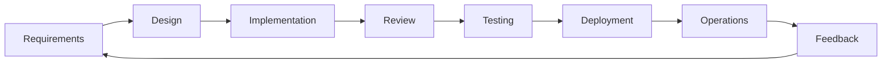

# AESP-0000: Constitution of the Autonomous Engineering Specification

**Version:** 1.0.0-draft  
**Status:** Draft  
**Maturity Target:** Canonical  
**Last Updated:** 2026-07-09  
**Editors:** AESP Standards Committee  

---

## Status of This Specification

This document is **AESP-0000 Constitution**, version 1.0.0-draft, of the Autonomous Engineering Specification (AESP). It defines the foundational principles, governance structure, and specification framework that govern all specifications within the AESP family. As the Constitution, this document occupies a unique position in the standards hierarchy: it is normative for all other specifications, which MUST conform to the framework, terminology, and principles established herein.

The status of this document is **Draft**. It is circulated for review and comment by the broader autonomous engineering community. While in Draft status, substantive changes MAY be made based on community feedback. Upon reaching sufficient maturity through implementation experience and community review, this document is expected to transition to **Canonical** status. The Constitution is designed for long-term stability; its foundational principles SHOULD remain substantially unchanged across revisions. Amendments to the Constitution require a higher bar than amendments to other AESP specifications, as detailed in the governance procedures defined herein.

This specification is intended to be self-contained. It presumes familiarity with software engineering concepts, distributed systems, and AI agent frameworks, but does not require prior knowledge of any specific vendor technology. All terms used with normative force are defined in Section 1.4. The key words "MUST", "MUST NOT", "REQUIRED", "SHALL", "SHALL NOT", "SHOULD", "SHOULD NOT", "RECOMMENDED", "NOT RECOMMENDED", "MAY", and "OPTIONAL" in this document are to be interpreted as described in BCP 14 [RFC2119] [RFC8174] when, and only when, they appear in all capitals.

---

## Abstract

The Autonomous Engineering Specification (AESP) defines a vendor-neutral open standard for Autonomous Engineering Organizations (AEOs) — structured engineering teams composed of AI agents that collaborate under human governance to deliver software engineering outcomes. AESP addresses the fragmentation of the current agent ecosystem, where every framework defines its own communication protocols, memory systems, workflow models, and governance approaches, resulting in vendor lock-in, interoperability failures, and inconsistent human oversight. Without a unifying standard, organizations face escalating integration costs, platform migration barriers, and governance gaps that prevent autonomous engineering from reaching production scale.

This document, the AESP Constitution, establishes the foundational principles, governance model, and specification framework upon which all other AESP specifications are built. It defines the conceptual architecture of an Autonomous Engineering Organization, specifies the requirements language used throughout the standard, and articulates eight foundational principles: autonomy with oversight, vendor neutrality, declarative over imperative specification, machine-readable definitions, extensibility by design, rough consensus and running code, content-addressable artifacts, and continuous evolution. The Constitution further defines the specification lifecycle, the governance structure comprising Domain Committees and a Steering Committee, and the conformance framework for validating implementations. Sixteen related specifications extend the Constitution to cover agent roles, communication protocols, memory systems, workflow orchestration, observability, security, compliance, and other aspects of autonomous engineering. AESP enables organizations to define, deploy, and govern autonomous engineering teams in a portable, interoperable, and auditable manner.

---

## Table of Contents

- [1. Introduction](#1-introduction)
  - [1.1 What is Autonomous Engineering?](#11-what-is-autonomous-engineering)
  - [1.2 What is AESP?](#12-what-is-aesp)
  - [1.3 Motivation](#13-motivation)
  - [1.4 Terminology](#14-terminology)
  - [1.5 Requirements Language](#15-requirements-language)
- [2. Foundational Principles](#2-foundational-principles)
  - [2.1 Autonomy with Oversight](#21-autonomy-with-oversight)
  - [2.2 Vendor Neutrality](#22-vendor-neutrality)
  - [2.3 Declarative over Imperative](#23-declarative-over-imperative)
  - [2.4 Machine-Readable First](#24-machine-readable-first)
  - [2.5 Extensibility by Design](#25-extensibility-by-design)
  - [2.6 Rough Consensus and Running Code](#26-rough-consensus-and-running-code)
  - [2.7 Content-Addressable Artifacts](#27-content-addressable-artifacts)
  - [2.8 Continuous Evolution](#28-continuous-evolution)
- [3. The Autonomous Engineering Organization Model](#3-the-autonomous-engineering-organization-model)
- [4. Specification Framework](#4-specification-framework)
- [5. Governance Structure](#5-governance-structure)
- [6. Specification Lifecycle](#6-specification-lifecycle)
- [7. Document Standards](#7-document-standards)
- [8. Extension Mechanism](#8-extension-mechanism)
- [9. Conformance and Certification](#9-conformance-and-certification)
- [10. Security Considerations](#10-security-considerations)
- [11. Future Work](#11-future-work)
- [References](#references)
- [Appendices](#appendices)

---

# 1. Introduction

## 1.1 What is Autonomous Engineering?

Autonomous Engineering is the practice of organizing artificial intelligence agents into structured engineering teams that operate under human governance to plan, design, implement, verify, deploy, and maintain software systems. It represents a fundamental shift in how software engineering work is organized — from human teams using AI tools, to mixed teams where AI agents are first-class engineering participants with defined roles, responsibilities, and processes.

### The Analogy to Human Engineering Teams

To understand autonomous engineering, consider how a human software engineering team is organized. A typical team has a tech lead who makes architectural decisions, senior engineers who design systems, junior engineers who implement features, a QA engineer who verifies correctness, a DevOps engineer who manages deployment, and a product manager who prioritizes work. These roles have defined responsibilities, the team communicates through established channels (stand-ups, code reviews, design documents), and decisions follow documented processes (RFCs for major changes, incident post-mortems for failures).

An Autonomous Engineering Organization (AEO) mirrors this structure but with AI agents occupying some or all of these roles. An agent MAY serve as an architect, analyzing requirements and producing design documents. Another agent MAY serve as an implementer, writing code and tests. A third MAY serve as a reviewer, analyzing code for correctness, security, and style compliance. These agents communicate through standardized protocols, maintain organizational memory across sessions, and execute workflows with human oversight at critical decision points.

The critical distinction is structure. Autonomous engineering is not "prompting an LLM to write code." It is the systematic organization of multiple AI agents into a coherent engineering team with:

- **Defined roles**: Each agent has a specific role with bounded responsibilities, analogous to job descriptions in human teams.
- **Structured communication**: Agents communicate through protocols, not ad-hoc prompt chains. Messages have defined schemas, routing rules, and delivery guarantees.
- **Persistent memory**: The organization maintains knowledge across sessions — codebases, decisions, lessons learned, architectural context — through structured memory systems.
- **Process compliance**: Work follows defined workflows with checkpoints, reviews, and approval gates.
- **Human governance**: Humans set direction, approve high-impact decisions, and retain override authority, but need not be involved in every operational detail.

### The Analogy to DevOps

If traditional AI-assisted development is like manual deployment (each release requires human hands-on involvement), autonomous engineering is like DevOps — the automation of the software delivery pipeline with appropriate gates and monitoring. Just as DevOps automated build, test, and deployment processes while retaining human oversight for production changes, autonomous engineering automates engineering workflows while retaining human governance for architectural decisions, security approvals, and strategic direction.

The DevOps movement gave us infrastructure as code, continuous integration, and deployment pipelines. Autonomous engineering gives us **organizations as code** — the ability to define an engineering team's structure, processes, and workflows in machine-readable form, version them, and evolve them systematically.

### The Analogy to Site Reliability Engineering

Site Reliability Engineering (SRE) applies software engineering principles to operations problems. SRE teams define Service Level Objectives (SLOs), error budgets, and automated remediation playbooks. When a service violates its SLO, automation handles the response — paging, rollback, traffic shifting — while humans investigate root causes.

Autonomous engineering applies SRE principles to the engineering process itself. An AEO defines Engineering Level Objectives (ELOs) — targets for code quality, review latency, test coverage, and security posture. When these objectives are violated, automated workflows trigger remediation: code review agents flag issues, testing agents generate additional test cases, security agents scan for vulnerabilities. Human engineers investigate systemic problems and refine the organization's processes.

### The Scope of Autonomous Engineering

Autonomous engineering encompasses the full software engineering lifecycle:



At each stage, AI agents MAY perform work that was previously human-only, always within boundaries defined by human governance. The degree of autonomy varies by context — a critical security patch to a financial system requires more human oversight than a documentation update to an internal tool.

Autonomous engineering is not about replacing human engineers. It is about amplifying human engineering capacity by delegating structured, repeatable work to AI agents organized into coherent teams, freeing humans to focus on creative problem-solving, architectural judgment, and strategic decisions.

## 1.2 What is AESP?

The Autonomous Engineering Specification (AESP) is a vendor-neutral, open technical standard that defines the structures, interfaces, protocols, and behaviors of Autonomous Engineering Organizations. AESP is a specification — not a tool, not a framework, not a platform. It describes what an AEO IS, not how to build one.

### AESP is the "OpenAPI Specification for AI Engineering Organizations"

Just as the OpenAPI Specification defines a standard, language-agnostic interface to HTTP APIs — enabling tools, documentation generators, and testing frameworks to work with any API described in OpenAPI — AESP defines a standard, vendor-agnostic interface to Autonomous Engineering Organizations. An AEO described in AESP can be reasoned about by compliance tools, orchestrated by any conformant platform, monitored by standard observability systems, and governed through consistent human interfaces.

When an API is described with OpenAPI, any OpenAPI-compliant tool can generate client libraries, validate requests, render documentation, or run mock servers. When an AEO is described with AESP, any AESP-compliant platform can:

- Instantiate the organization with the correct agent roles and relationships
- Route communications through the specified protocols
- Enforce the defined workflows and approval gates
- Monitor operational metrics against specified objectives
- Audit decisions and actions for compliance
- Migrate the organization between platforms without redefinition

### AESP is like OCI for Agent Organizations

The Open Container Initiative (OCI) defines open standards for container formats and runtimes, ensuring that a container built with one tool can run on any OCI-compliant runtime. AESP serves an analogous function for agent organizations: an AEO defined with AESP can be deployed on any AESP-compliant orchestration platform.

This portability is critical. Without it, organizations that invest in defining their AEO on one platform face complete redefinition costs to switch platforms. With AESP, the AEO definition is portable — the same definition can be deployed on platform A today and platform B tomorrow, just as an OCI container can run on Docker today and containerd tomorrow.

### AESP is like Kubernetes for Agent Orchestration

Kubernetes defines a declarative API for container orchestration — you describe the desired state (replicas, networking, storage) and Kubernetes converges the actual state toward it. AESP defines a declarative API for agent organization orchestration — you describe the desired organization (roles, workflows, governance policies) and an AESP-compliant platform instantiates and maintains it.

The parallel extends to the ecosystem. Kubernetes spawned a rich ecosystem of tools — Helm for packaging, Prometheus for monitoring, Istio for service mesh — all operating against the Kubernetes API. AESP is designed to spawn a similar ecosystem: organization design tools, governance dashboards, compliance auditors, performance analyzers, and migration tools, all operating against the AESP definitions.

### The Specification Family

AESP comprises sixteen related specifications, each addressing a distinct aspect of autonomous engineering:

| Number | Title | Domain | Status |
|--------|-------|--------|--------|
| AESP-0000 | Constitution | Meta | Draft |
| AESP-0001 | Swarm Organization | Core | Planned |
| AESP-0002 | Operating Model | Core | Planned |
| AESP-0003 | Execution Engine | Core | Planned |
| AESP-0004 | Memory System | Core | Planned |
| AESP-0005 | Workflow Engine | Core | Planned |
| AESP-0006 | Plugin SDK | Core | Planned |
| AESP-0007 | MCP Integration | Core | Planned |
| AESP-0008 | Knowledge Graph | Architecture | Planned |
| AESP-0009 | Model Router | Architecture | Planned |
| AESP-0010 | Agent Registry | Core | Planned |
| AESP-0011 | Observability | Cross-cutting | Planned |
| AESP-0012 | Security | Cross-cutting | Planned |
| AESP-0013 | Governance | Core | Planned |
| AESP-0014 | Engineering | Core | Planned |
| AESP-0015 | Project Specification | Core | Planned |

Each specification is independently versioned, independently implementable, and independently useful. Together, they provide comprehensive coverage of autonomous engineering concerns. The Constitution (this document) governs all specifications; individual specifications define their own conformance requirements within the framework established here.

### What AESP is Not

AESP is deliberately limited in scope. It is NOT:

- **A programming framework**: AESP does not provide code libraries, SDKs, or runtime implementations.
- **A specific AI model**: AESP does not prescribe which AI models agents use. Any model — Claude, GPT, Gemini, Kimi, Llama, Mistral, or future models — can power an AESP-compliant agent.
- **A cloud service**: AESP is not a hosted platform. It is a document that platforms can implement.
- **A replacement for human judgment**: AESP defines how human governance integrates into AEOs, but does not automate human decisions.
- **A security silver bullet**: AESP defines security requirements and interfaces, but implementations must still secure their own infrastructure.

## 1.3 Motivation

The autonomous engineering ecosystem is fragmented. Dozens of frameworks, platforms, and protocols have emerged — each solving pieces of the problem, none providing a coherent, interoperable whole. This fragmentation creates real costs for organizations attempting to adopt autonomous engineering at scale.

### The Fragmentation Problem

Consider the current state of the agent ecosystem:

- **Anthropic** defines the Model Context Protocol (MCP) for agent-to-tool communication.
- **Google** defines the Agent-to-Agent (A2A) protocol for agent-to-agent communication.
- **Microsoft** promotes AutoGen for multi-agent conversation patterns.
- **CrewAI**, **LangGraph**, **LlamaIndex**, and others each define their own orchestration models, memory systems, and workflow definitions.

Each of these is a genuine technical contribution. But they are mutually incompatible. An agent built for MCP cannot directly communicate with an agent built for A2A. A workflow defined in LangGraph cannot execute on CrewAI. A memory system built for one framework is inaccessible to another. Organizations must choose a single ecosystem or invest in expensive integration layers.

AESP solves this by defining the common interfaces that all frameworks can implement, just as HTTP defines the common interface that all web servers and clients implement, regardless of their internal architecture.

### No Standard Way to Describe Agent Teams

Human engineering teams have well-understood descriptive frameworks: organizational charts, role definitions, RACI matrices, and process documentation. Autonomous engineering teams have no equivalent standard.

If an engineering manager wants to describe a human team, they use established tools and formats. If they want to describe an AEO, they must invent their own description format or embed their intent in framework-specific configuration. There is no way to answer basic questions in a standardized way:

- What roles exist in this AEO?
- What are the communication paths between agents?
- What workflows does this AEO follow?
- What approval gates exist?
- What memory does this AEO maintain?
- How is this AEO governed?

AESP provides standardized answers to all of these questions through machine-readable, vendor-neutral definitions.

### Vendor Lock-in Risk

When an organization adopts a specific agent framework, they make a long-term bet. Their agent definitions, workflow configurations, memory schemas, and governance policies become encoded in framework-specific formats. Migrating to a different framework requires redefining everything from scratch.

This is the same lock-in dynamic that motivated open standards for containers (OCI), for APIs (OpenAPI), and for package formats (SPDX). AESP provides the same escape valve: by defining AEOs in a standard format, organizations retain the freedom to move between implementations.

### No Interoperability Between Frameworks

Real engineering organizations use multiple tools. A human team might use Jira for tracking, GitHub for code, Slack for communication, and Datadog for monitoring. These tools interoperate through standard protocols and APIs.

AEOs today cannot interoperate. An AEO built on framework A cannot delegate work to an AEO built on framework B. They cannot share memory, exchange messages, or coordinate workflows. This limits autonomous engineering to isolated tool silos.

AESP defines the interoperability layer — the common protocols and data formats that enable AEOs to work together regardless of their underlying implementation.

### Human Oversight is Ad-Hoc

The most critical gap in current agent frameworks is governance. Most frameworks provide minimal, if any, structured support for human oversight. When a human must review an agent's work, the mechanism is typically framework-specific and inconsistently applied.

AESP treats governance as a first-class concern. It defines standardized human-in-the-loop interfaces, approval workflows, escalation paths, and audit requirements. Human oversight is not an afterthought — it is a foundational principle.

### Memory Systems are Incompatible

An AEO's memory — its accumulated knowledge about codebases, decisions, failures, and lessons learned — is its most valuable asset. Yet memory systems are framework-specific and incompatible. An AEO that switches platforms loses its organizational memory.

AESP defines standard memory interfaces and schemas, enabling memory portability and cross-platform knowledge sharing.

### Security and Compliance Gaps

Autonomous systems that can write code, access production environments, and make architectural decisions represent significant security and compliance risks. Current frameworks provide minimal standardized support for:

- Authentication and authorization of agent actions
- Audit logging of all agent decisions
- Compliance with regulatory requirements (SOC 2, GDPR, etc.)
- Secure handling of credentials and secrets
- Isolation and sandboxing of agent execution

AESP defines security requirements, compliance interfaces, and audit standards that all implementations MUST support.

### The Cost of Inaction

Without a unifying standard, the autonomous engineering ecosystem will continue to fragment. Organizations will face increasing lock-in, integration costs will rise, and the full potential of autonomous engineering — the transformation of software engineering itself — will be delayed by a decade of standards wars.

AESP exists to prevent this outcome by providing the common ground on which the entire ecosystem can build.

## 1.4 Terminology

This section defines terms used throughout the AESP specification family. Terms are listed alphabetically. Each definition is normative — when a term appears in all capitals in any AESP specification, it carries the meaning defined here.

**Agent**
An autonomous software entity that performs engineering work within an AEO. An agent has a defined role, communicates through standardized protocols, maintains state, and operates within governance boundaries. An agent MAY be powered by any AI model or combination of models. An agent is distinct from a "tool" in that an agent has persistent identity, memory, and decision-making authority within its role.

**Autonomous Engineering Organization (AEO)**
A structured engineering team composed of one or more agents operating under human governance through defined roles, responsibilities, processes, and workflows. An AEO is the primary unit of organization in autonomous engineering. An AEO MAY contain human members, agent members, or both. An AEO has persistent identity, memory, and governance policies.

**Conformance**
The degree to which an implementation satisfies the normative requirements of a specification. AESP defines three conformance levels: **Full Conformance** (all MUST-level requirements satisfied), **Partial Conformance** (a documented subset satisfied), and **Non-Conformance** (otherwise). Conformance claims MUST be verifiable through automated testing where possible.

**Domain Committee**
A group of subject matter experts responsible for the technical direction of specifications within a specific domain (e.g., Security, Communication, Workflow). Domain Committees review proposals, adjudicate technical disputes, and recommend specifications for maturity transitions.

**Governance**
The system of rules, practices, and processes by which an AEO is directed and controlled. Governance includes role definitions, approval workflows, escalation paths, audit requirements, and human oversight mechanisms. Governance operates at two levels: the governance of individual AEOs and the governance of the AESP specification itself.

**Human-in-the-Loop (HITL)**
A design pattern requiring human review, approval, or intervention at defined decision points within an AEO workflow. HITL is not continuous human monitoring; it is structured human oversight at critical gates. The scope of HITL — which decisions require human involvement — is configurable per AEO and per workflow.

**Implementation**
A software system, platform, or service that realizes one or more AESP specifications. An implementation MAY be open source or proprietary. An implementation MAY conform to a single specification or to multiple specifications. Implementations are evaluated against the conformance framework.

**Knowledge Graph**
A structured representation of an AEO's accumulated knowledge, including codebase structure, architectural decisions, dependency relationships, failure modes, and lessons learned. The Knowledge Graph serves as the semantic layer of an AEO's memory system.

**MCP (Model Context Protocol)**
A protocol for agent-to-tool communication, originally developed by Anthropic. AESP recognizes MCP as one valid protocol for agent-tool interaction but does not mandate its use.

**Observability**
The capability to understand the internal state of an AEO through its external outputs. Observability encompasses logs, metrics, traces, and events emitted by agents, workflows, and the AEO as a whole.

**Specification**
A document that defines normative requirements for implementations. Each AESP specification addresses a specific aspect of autonomous engineering. Specifications are independently versioned and independently implementable.

**Steering Committee**
The body responsible for the overall direction, coherence, and integrity of the AESP specification family. The Steering Committee approves maturity transitions, resolves cross-domain disputes, and maintains the Constitution.

**Swarm**
A collection of agents collaborating on a shared objective with minimal centralized coordination. A swarm operates through peer-to-peer communication and emergent coordination patterns, as distinct from hierarchically orchestrated workflows.

**Workflow**
A defined sequence of steps, decisions, and transitions that accomplishes an engineering objective. Workflows specify which agents participate, what actions they perform, what data flows between steps, and where approval gates and human oversight are required.

## 1.5 Requirements Language

The key words "MUST", "MUST NOT", "REQUIRED", "SHALL", "SHALL NOT", "SHOULD", "SHOULD NOT", "RECOMMENDED", "NOT RECOMMENDED", "MAY", and "OPTIONAL" in this document are to be interpreted as described in BCP 14 [RFC2119] [RFC8174] when, and only when, they appear in all capitals.

### Usage in AESP

AESP specifications use these terms with the following conventions:

**MUST** and **MUST NOT** indicate absolute requirements. Implementations that do not satisfy all MUST-level requirements are non-conformant. For example: "Implementations MUST support JSON as a serialization format" means that any implementation claiming conformance MUST be capable of reading and writing JSON.

**SHOULD** and **SHOULD NOT** indicate strong recommendations. There MAY be valid reasons in particular circumstances to ignore these recommendations, but the full implications must be understood and carefully weighed before choosing a different course. For example: "Workflow definitions SHOULD use content-addressable identifiers" means that while other identifier schemes are permitted, content-addressable identifiers are strongly preferred.

**MAY** and **OPTIONAL** indicate truly optional features. Implementations can choose whether to support these features without affecting conformance. For example: "Implementations MAY support YAML in addition to JSON" means that YAML support is permitted but not required.

The use of **REQUIRED** is equivalent to **MUST**. The use of **RECOMMENDED** is equivalent to **SHOULD**. The use of **NOT RECOMMENDED** is equivalent to **SHOULD NOT**. These alternative forms are used for stylistic variety but carry identical normative force.

AESP specifications use these terms exclusively for normative requirements. Explanatory text, examples, and rationale do not use capitalized keywords. When a keyword appears in lowercase in running text, it carries no normative meaning.

Implementers should note that **SHOULD**-level requirements are not optional recommendations to be casually disregarded. They represent the consensus of the specification authors about best practices. Deviations from SHOULD-level requirements SHOULD be documented and justified.

---

# 2. Foundational Principles

This section defines the eight foundational principles that govern all AESP specifications. These principles are invariant across specifications and versions. They guide specification authors, implementers, and users of the standard. Every AESP specification MUST be consistent with these principles.

## 2.1 Autonomy with Oversight

Agents MUST operate autonomously within defined boundaries. Human governance MUST be integrated at critical decision points.

### Bounded Autonomy

The principle of bounded autonomy holds that agents possess the authority to make decisions and take actions within the scope of their defined role, but that authority is bounded by governance policies set by humans. These boundaries are not afterthoughts — they are fundamental to the architecture of every AEO.

Consider a code review agent. Its role includes analyzing pull requests for correctness, security vulnerabilities, style compliance, and test coverage. Within this role, the agent operates autonomously: it reads the code, runs static analysis, compares against organizational standards, and produces a review report. It does not require human approval to perform this analysis.

However, if the review identifies a critical security vulnerability, the governance policy may require human escalation. The agent flags the finding and blocks merge pending human review. The human retains final authority over security-critical decisions.

This is bounded autonomy: the agent has full authority within its lane, but lanes have guardrails, and guardrails are set by humans.

### Governance Integration Points

AESP identifies three categories of governance integration points:

**Mandatory Human Approval (MHA)**: Certain actions MUST NOT proceed without explicit human approval. Examples include: deploying to production, modifying security policies, accessing sensitive data, changing architectural decisions, and disabling audit logging. The set of MHA actions is configurable per AEO but MUST include a baseline set defined by AESP-0012 (Security) and AESP-0013 (Governance).

**Human Notification (HN)**: Certain actions MUST notify a designated human but do not block on human response. Examples include: completion of significant milestones, detection of anomalies, exhaustion of error budgets, and failure of critical workflows. The human MAY intervene but is not required to.

**Fully Autonomous (FA)**: Routine actions within an agent's defined role MAY proceed without human involvement. Examples include: running tests, formatting code, updating documentation, triaging low-priority issues, and generating routine reports.

The classification of actions into these categories is itself a governance policy, defined in the AEO's governance specification and subject to human configuration.

### The Principle of Progressive Autonomy

AEOs SHOULD implement progressive autonomy — new agents or agents in new domains operate with more restrictive boundaries until they demonstrate reliability. As an agent accumulates successful outcomes and organizational trust, its boundaries MAY expand. This mirrors how human engineers gain responsibility: junior engineers require more review, senior engineers operate with greater autonomy.

Progressive autonomy is not automatic. Boundary expansion MUST be a deliberate governance decision, supported by observability data demonstrating the agent's reliability.

## 2.2 Vendor Neutrality

AESP MUST NOT favor any specific AI model provider, framework, or platform. Specifications MUST be implementable by any AI system, present or future.

### Influence Through Contribution, Not Sponsorship

AESP is governed by the principle that influence is earned through technical contribution, not purchased through sponsorship. No vendor, regardless of market position or financial contribution, receives preferential treatment in the standard. Specifications are evaluated on technical merit, implementability, and community benefit — not on their alignment with any vendor's product strategy.

This principle is essential to the standard's credibility. If AESP were perceived as favoring Claude over GPT, or Google over Anthropic, the ecosystem would fragment along vendor lines, and the standard would fail in its primary purpose: unification.

### Model Neutrality

AESP specifications MUST be implementable using any AI model or combination of models. An agent role defined in AESP does not specify which model powers the agent. A workflow defined in AESP does not assume specific model capabilities. A memory system defined in AESP does not depend on model-specific context windows or embedding formats.

This does not mean AESP ignores model differences. AESP acknowledges that different models have different strengths, context limits, and reasoning capabilities. Specifications MAY define capability requirements (e.g., "the agent MUST be capable of reasoning about code dependencies") without prescribing which model satisfies those requirements.

### Protocol Neutrality

AESP does not mandate specific underlying protocols. While AESP-0007 defines the MCP Integration framework, it permits multiple transport bindings. An AEO MAY use MCP for agent-tool communication, A2A for agent-agent communication, or any future protocol that satisfies the framework's requirements. AESP defines the abstract interface; concrete protocol bindings are implementation choices.

### Platform Neutrality

AESP specifications MUST NOT require specific runtime platforms, cloud providers, or operating systems. An AESP-compliant implementation MAY run on AWS, GCP, Azure, on-premises infrastructure, or edge devices. The standard defines portable interfaces, not platform-specific implementations.

## 2.3 Declarative over Imperative

AESP describes WHAT an AEO is, not HOW to implement it. All specifications define structures, interfaces, and behaviors declaratively.

### The Declarative Approach

A declarative specification defines the desired state without prescribing the steps to achieve it. Consider the difference between:

- **Imperative**: "To create an agent, first initialize the runtime, then load the model weights, then configure the context window, then set the system prompt, then register the tools..."
- **Declarative**: "An Agent is an entity with the following properties: role, model requirements, tool bindings, memory configuration, and governance boundaries."

AESP uses the declarative approach. An AEO definition is a document — a JSON or YAML artifact — that describes the organization's structure. Any implementation that can read this document and produce an AEO matching the described structure is conformant. How the implementation achieves this is outside the scope of the specification.

This approach provides several benefits:

**Implementation Independence**: Multiple independent implementations can exist, each bringing different technical approaches, performance characteristics, and operational models. Competition among implementations drives innovation while the standard ensures interoperability.

**Version Control**: Declarative definitions can be version-controlled, diffed, reviewed, and rolled back, just like infrastructure-as-code definitions.

**Tooling Ecosystem**: Declarative definitions enable a rich ecosystem of tools — linters, validators, visualization tools, migration assistants — that operate on the definition itself.

**Auditability**: A declarative definition is a complete, inspectable specification of the AEO's intended structure. Auditors can verify that an AEO's definition matches its governance requirements without needing to understand the implementation.

### Normative Schemas

Every AESP specification MUST provide a normative schema (JSON Schema or equivalent formal definition) that defines the valid structures for that specification's domain. Human-readable prose accompanies these schemas, explaining semantics, constraints, and intended usage. In case of ambiguity, the normative schema is authoritative.

### Behavioral Specification

AESP specifications define not just data structures but also behaviors — how agents communicate, how workflows execute, how memory is retrieved. These behavioral specifications are declarative in that they define the observable effects without prescribing implementation algorithms. For example, AESP-0005 specifies that a workflow step MUST complete before subsequent steps begin, but does not specify how the orchestration engine schedules those steps.

## 2.4 Machine-Readable First

All AESP specifications MUST be machine-readable. Human-readable prose accompanies normative schemas but does not replace them.

### The Primacy of Machine-Readable Definitions

In any conflict between the human-readable prose of a specification and its machine-readable schema, the machine-readable schema is authoritative. This rule ensures that automated tools — validators, code generators, compliance auditors — can operate reliably without natural language parsing.

The machine-readable definition is the specification. The human-readable prose is commentary, explanation, and guidance.

### Schema Formats

AESP specifications use JSON Schema [JSON-SCHEMA] as the primary schema definition language. YAML is permitted as an alternative serialization format for specifications that are conventionally authored in YAML. Every specification MUST provide:

1. A JSON Schema defining the valid document structures.
2. At least one example document in valid JSON.
3. Human-readable documentation of each schema element.

### Schema Versioning

Schemas are versioned independently of specification documents. A schema version is identified by a URI of the form:

```
https://spec.aesp.dev/schemas/{spec-number}/{major}.{minor}.{patch}
```

For example, the schema for AESP-0001, version 2.1.0, is available at:

```
https://spec.aesp.dev/schemas/0001/2.1.0
```

Schema URIs are immutable. A published schema URI MUST NOT change its content. Corrections require a new schema version.

## 2.5 Extensibility by Design

AESP specifications include a defined extension mechanism that enables implementations to add capabilities beyond the standard without breaking interoperability.

### The x-aesp-* Extension Prefix

Implementations MAY add vendor-specific or implementation-specific fields to AESP documents by using field names prefixed with `x-aesp-`. For example:

```json
{
  "agent_id": "agent-001",
  "role": "code-reviewer",
  "x-aesp-acme-custom-field": "acme-specific-value"
}
```

Fields without the `x-aesp-` prefix MUST be defined in the relevant AESP specification. Unknown non-prefixed fields MUST cause validation errors.

### Postel's Law: Conservative in What You Send, Liberal in What You Accept

Implementations of AESP specifications MUST follow Postel's Law:

- **When producing (sending)**: Implementations MUST include only fields defined in the specification plus `x-aesp-*` extensions. They MUST NOT include unknown non-prefixed fields.
- **When consuming (receiving)**: Implementations MUST ignore unknown `x-aesp-*` fields. They MUST NOT fail due to the presence of unknown extensions. They SHOULD preserve unknown extensions when round-tripping documents.

This rule ensures that extensions do not break interoperability. An implementation that does not understand a particular extension can safely ignore it while still processing the standard fields correctly.

### Extension Graduation

Extensions that prove broadly useful MAY graduate to standard features through the specification evolution process. An extension graduates when:

1. At least two independent implementations support the extension.
2. A specification change proposal is submitted to the relevant Domain Committee.
3. The proposal receives rough consensus from the committee.
4. The Steering Committee approves the change.

Upon graduation, the `x-aesp-` prefix is removed, and the field becomes part of the standard schema.

### Extension Registration

Implementations SHOULD register their extensions in the AESP Extension Registry to promote awareness and potential standardization. Registration is not mandatory but is RECOMMENDED for extensions intended for broad use.

## 2.6 Rough Consensus and Running Code

Decisions in the AESP standards process are made by rough consensus, not unanimity. Specifications MUST be validated by at least two independent implementations before reaching stable maturity.

### Rough Consensus

Rough consensus, as defined in [RFC7282], is the dominant view, not necessarily the unanimous view. The standards process seeks decisions that the group can live with, not decisions that everyone loves. Dissent is noted but does not block progress when the dominant view is clear.

The test for rough consensus is not "does everyone agree?" but "is anyone strongly opposed?" If a participant has a fundamental objection — a concern that the proposal, if adopted, would cause serious harm to the standard or its implementability — that concern must be addressed. Mere preference for a different approach is not a fundamental objection.

### Running Code

No AESP specification reaches **Stable** maturity without at least two independent, interoperable implementations. This requirement ensures that specifications are grounded in implementation experience, not theoretical design.

The running code requirement serves several purposes:

- **Technical validation**: Implementation reveals issues that specification review does not catch.
- **Interoperability verification**: Multiple implementations confirm that the specification is unambiguous and complete.
- **Practical feedback**: Implementors provide feedback on usability, performance, and edge cases.
- **Ecosystem signal**: The existence of multiple implementations signals to the market that the specification is viable.

Implementations used to satisfy the running code requirement MUST be independent — they MUST NOT share code, developers, or organizational sponsorship. This independence requirement ensures that the specification, not a common implementation, is what enables interoperability.

### The Standards Track

Specifications progress through maturity levels (defined in Section 6) based on implementation experience and community review. Early maturity levels (Experimental, Draft) do not require multiple implementations. **Stable** and **Canonical** maturity levels do.

## 2.7 Content-Addressable Artifacts

All AEO artifacts — agent definitions, workflow definitions, policy documents, knowledge graph nodes, and other persistent objects — SHOULD use content-addressable identifiers based on SHA256 cryptographic digests.

### Content Addressing

A content-addressable identifier is derived from the content it identifies. The SHA256 digest of an artifact's canonical serialization serves as its identifier. Two artifacts with identical content have identical identifiers. Two artifacts with different content have different identifiers with overwhelming probability.

Content-addressable identifiers have the form:

```
sha256:{hex-encoded-sha256-digest}
```

For example:

```
sha256:e3b0c44298fc1c149afbf4c8996fb92427ae41e4649b934ca495991b7852b855
```

### Benefits of Content Addressing

**Immutability**: Once an artifact is identified by its content, it cannot change. If the content changes, the identifier changes. This immutability simplifies caching, replication, and reasoning about system state.

**Deduplication**: Identical artifacts stored in multiple locations share a single identifier. Deduplication is automatic — no additional comparison is needed.

**Integrity Verification**: When an artifact is retrieved by its content address, the recipient can verify integrity by recomputing the digest. Any tampering or corruption is immediately detected.

**Distributed Storage**: Content-addressed artifacts can be stored in any location — local disk, object storage, content delivery networks — and retrieved without a central registry. The identifier itself is sufficient to locate and verify the artifact.

### Canonical Serialization

To ensure that the same logical content always produces the same digest, AESP defines canonical serialization rules:

1. JSON artifacts MUST be serialized with keys in lexicographic order.
2. Whitespace MUST follow the minimal format: no trailing whitespace, single space after colon and comma, newline after each element in arrays and objects.
3. Numeric values MUST be serialized without exponent notation when the exponent is zero.
4. String encoding MUST be UTF-8.

These rules ensure that two implementations producing the same logical artifact generate identical digests.

### Transition from Location-Based Addressing

AESP acknowledges that many existing systems use location-based addressing (URIs, file paths, database keys). Implementations MAY use content-addressable identifiers alongside location-based identifiers during transition periods. New implementations SHOULD use content-addressable identifiers as the primary addressing scheme.

## 2.8 Continuous Evolution

AESP is a living standard. Specifications evolve through a defined lifecycle. Breaking changes are managed through deprecation with sunset dates. Migration paths MUST be provided.

### The Living Standard Model

AESP does not publish versioned releases of the specification family as a whole. Each specification evolves independently, at its own pace, according to its own maturity lifecycle. The Constitution provides the stable foundation; individual specifications grow, mature, and occasionally retire as the field advances.

This model is inspired by the WhatWG Living Standard model for HTML and the continuous evolution of the Unicode Standard. It acknowledges that autonomous engineering is a rapidly evolving field and that a standard that requires years between versions will be perpetually behind the state of the art.

### Specification Lifecycle

Each AESP specification progresses through defined maturity levels:

- **Experimental**: Early-stage specifications for community review. Subject to significant change. Not suitable for production use.
- **Draft**: Specifications that have received substantial community feedback and at least one implementation. May still change based on experience.
- **Stable**: Specifications with at least two independent implementations, broad review, and stable interfaces. Suitable for production use.
- **Canonical**: Specifications that have proven their value over time, reached wide adoption, and become foundational. Changes are rare and require extraordinary process.
- **Retired**: Specifications that have been superseded by newer specifications or withdrawn for other reasons. Retired specifications remain available for reference but MUST NOT be used for new implementations.

Detailed lifecycle rules are defined in Section 6.

### Deprecation and Breaking Changes

Breaking changes to **Stable** or **Canonical** specifications are strongly discouraged. When necessary, they MUST follow the deprecation policy:

1. The change is announced in the specification's change log at least two maturity cycles before taking effect.
2. A migration guide is published alongside the announcement.
3. Both old and new behaviors are supported during a transition period of at least 12 months.
4. The old behavior is clearly marked as deprecated in documentation and, where possible, in machine-readable schemas.
5. After the transition period, the old behavior MAY be removed.

### Migration Paths

Every breaking change MUST include a documented migration path. The migration path describes how existing implementations can transition from the old behavior to the new behavior. Migration paths are reviewed by the relevant Domain Committee and MUST be approved before the breaking change is finalized.

### Backward Compatibility

AESP specifications strive for backward compatibility. New versions of a specification SHOULD be supersets of previous versions — they add capabilities without removing existing ones. When backward compatibility cannot be maintained, the deprecation process provides a graceful transition.

---

*Sections 3-11 and Appendices continue in the next commit.*
