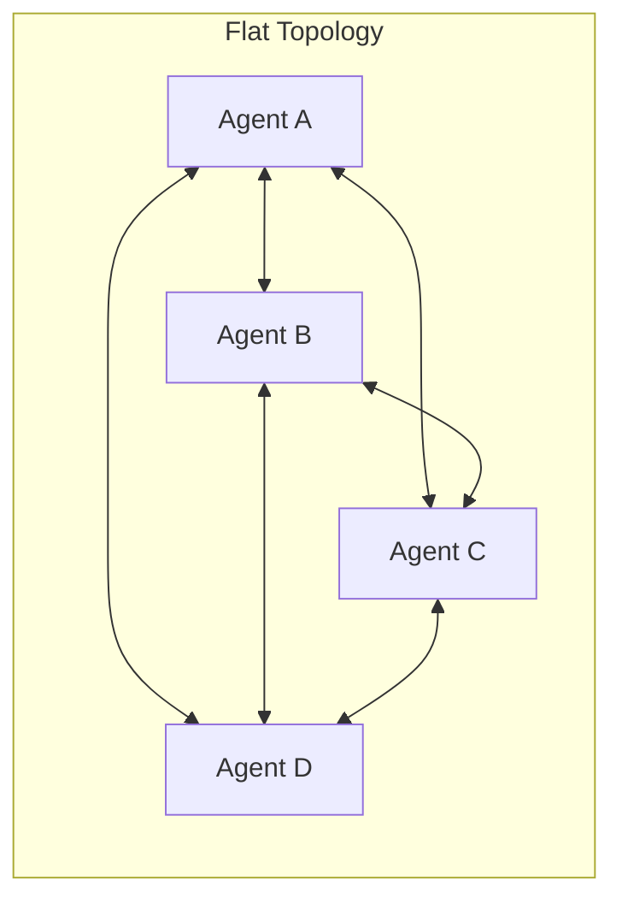
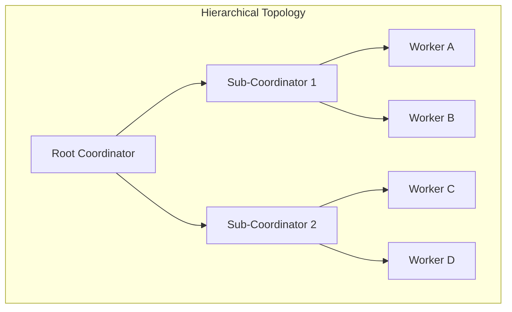
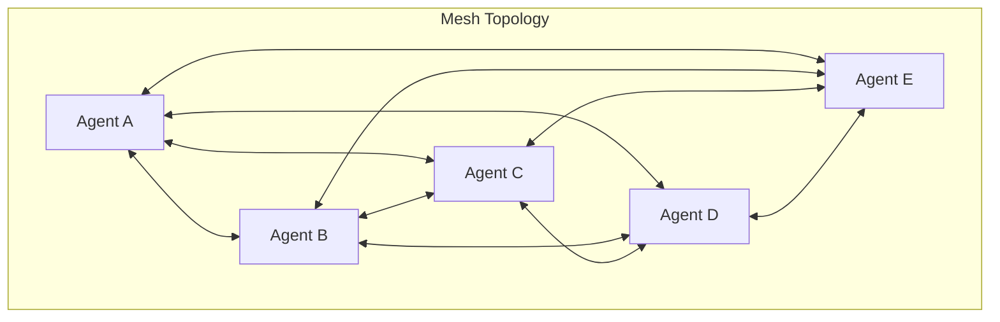
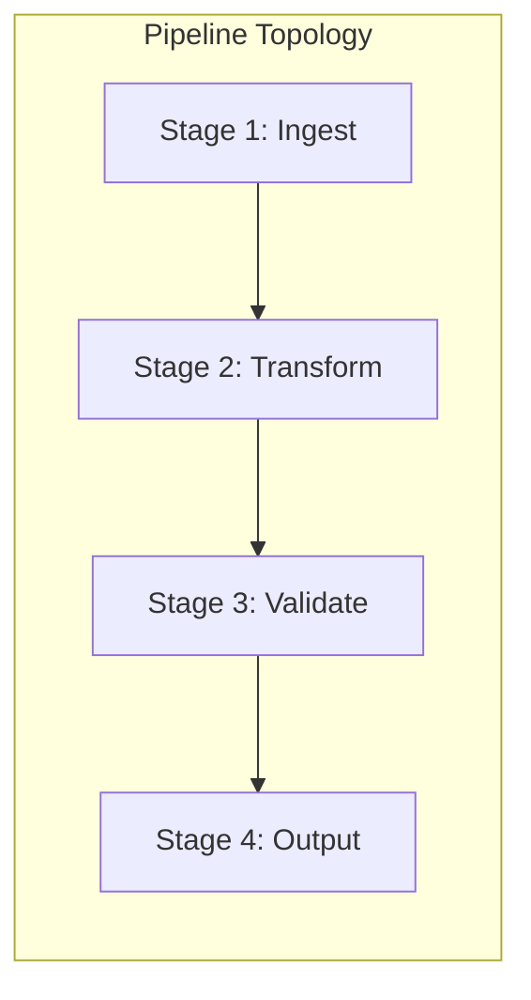
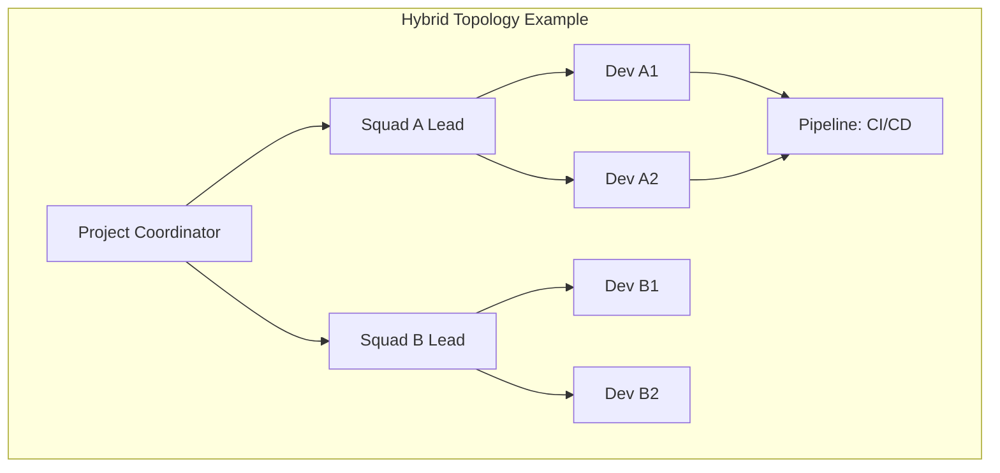
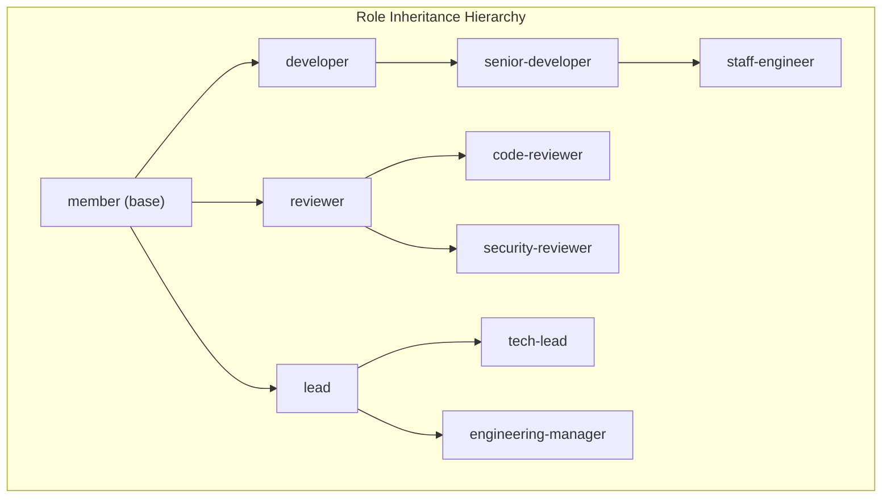
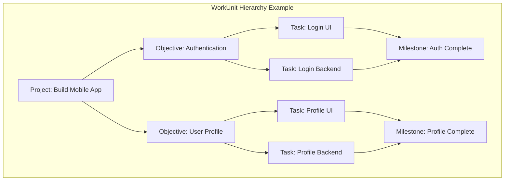
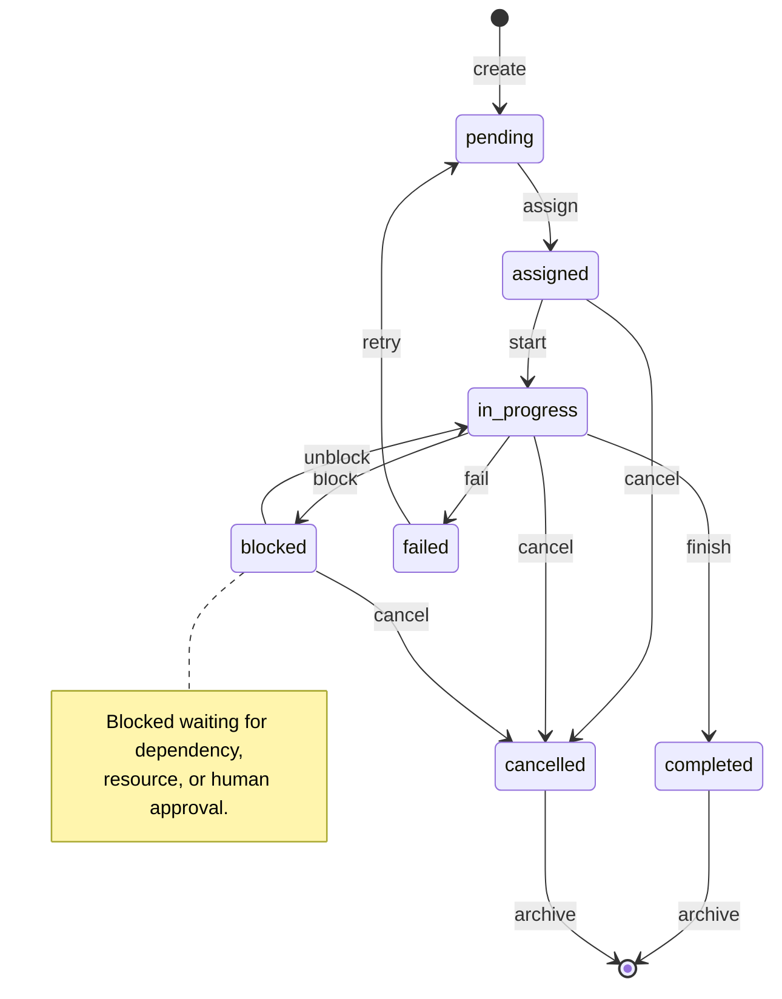
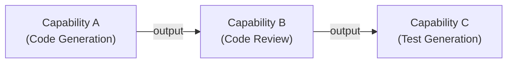
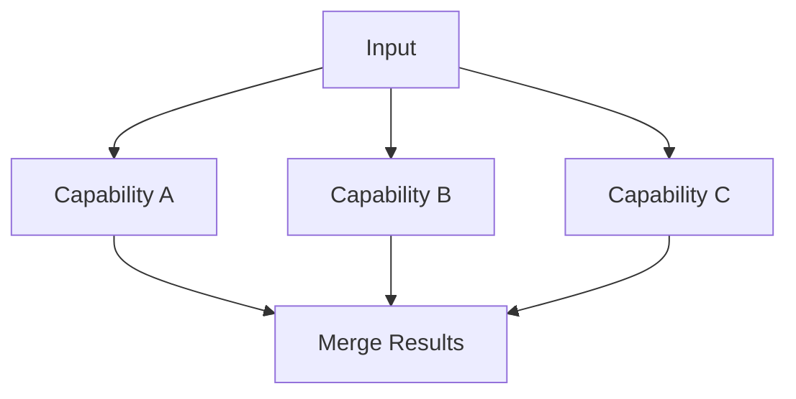

# AESP-0001: AEO Core Model (Continued)

**This document contains Sections 3-6 of AESP-0001.**

**See `AESP-0001.md` for Sections 1-2 (Introduction and Agent Model).**  
**See `AESP-0001-reference.md` for Sections 7-14 (Resource Model, State Model, Schemas, Examples, Appendices).**

---

# 3. Organization Model

An Autonomous Engineering Organization (AEO) is a structured system of agents, roles, work units, and governance policies operating within defined boundaries to achieve engineering objectives. The Organization is the primary container and administrative boundary for all AEO entities. Every agent, role, work unit, and capability exists within the scope of exactly one Organization. Cross-organization interactions are governed by AESP-0015 (Interoperability); this specification defines the internal structure of a single Organization.

The Organization Model draws upon established organizational theory. Mintzberg's framework of organizational configurations [Mintzberg79] identifies five ideal-type structures that trade coordination mechanisms against environmental uncertainty. For AEOs, the adhocracy configuration — characterized by mutual adjustment, cross-functional teams, and distributed authority — provides the strongest foundation for innovation-intensive engineering work, while the machine bureaucracy configuration provides patterns for operational reliability [AESP-0001-ORG]. The Spotify model [Kniberg12] further refines these principles into actionable structures: Squads (small autonomous teams), Tribes (domain-aligned collections), Chapters (skill-based groups), and Guilds (communities of interest). AESP-0001 distills these insights into five normative topology patterns and a comprehensive role-based permission system.

## 3.1 Organization Definition

An Organization is defined by the following JSON Schema:

```json
{
  "$schema": "https://json-schema.org/draft/2020-12/schema",
  "$id": "urn:aeo:schema:organization",
  "title": "Organization",
  "description": "An Autonomous Engineering Organization",
  "type": "object",
  "required": ["id", "name", "version", "topology", "governanceMode", "agents", "roles", "capabilities"],
  "properties": {
    "id": {
      "type": "string",
      "format": "uri",
      "description": "Globally unique identifier for the organization."
    },
    "name": {
      "type": "string",
      "minLength": 1,
      "maxLength": 256
    },
    "description": {
      "type": "string",
      "maxLength": 4096
    },
    "version": {
      "type": "string",
      "pattern": "^(0|[1-9][0-9]*)\\.(0|[1-9][0-9]*)\\.(0|[1-9][0-9]*)"
    },
    "topology": {
      "type": "string",
      "enum": ["flat", "hierarchical", "mesh", "pipeline", "hybrid"]
    },
    "governanceMode": {
      "type": "string",
      "enum": ["autonomous", "human-in-the-loop", "human-on-the-loop", "human-in-command"]
    },
    "agents": {
      "type": "array",
      "items": { "$ref": "urn:aeo:schema:agent" },
      "description": "Agents belonging to this organization."
    },
    "roles": {
      "type": "array",
      "items": { "$ref": "urn:aeo:schema:role" },
      "description": "Role definitions available within this organization."
    },
    "workUnits": {
      "type": "array",
      "items": { "$ref": "urn:aeo:schema:workunit" },
      "description": "Work units managed by this organization."
    },
    "capabilities": {
      "type": "array",
      "items": { "$ref": "urn:aeo:schema:capability" },
      "description": "Capability definitions available within this organization."
    },
    "metadata": {
      "type": "object",
      "additionalProperties": true
    }
  }
}
```

### 3.1.1 Field Semantics

**`id`** (REQUIRED) — Globally unique URI. Two organizations with the same `id` are the same organization.

**`topology`** (REQUIRED) — The structural arrangement of agents. See Section 3.2.

**`governanceMode`** (REQUIRED) — The default human oversight level. Individual roles MAY override this. See Section 4.5.

**`agents`** (REQUIRED) — The set of agents. MUST contain at least one agent.

**`roles`** (REQUIRED) — The set of role definitions. MUST contain at least one role.

**`capabilities`** (REQUIRED) — The set of capability definitions. MAY be empty if all capabilities are imported.

---

## 3.2 Organization Topology

The topology of an Organization defines how agents are arranged and how authority, communication, and work flow through the structure. AESP-0001 defines five normative topology patterns. An organization MUST declare exactly one primary topology. Hybrid organizations MUST designate one topology as primary and document secondary patterns in metadata.

### 3.2.1 Flat Topology

All agents are peers. No hierarchy, no central coordinator. Agents communicate directly with each other.



**Best for:** Small teams (2-8 agents), exploration, research, brainstorming.  
**Constraints:** Every agent must know about every other agent. Does not scale beyond ~10 agents.

### 3.2.2 Hierarchical Topology

Tree structure with a root coordinator delegating to sub-coordinators and workers.



**Best for:** Large organizations, clear chain of command, multi-level delegation.  
**Constraints:** Single point of failure at root. Latency increases with depth.

### 3.2.3 Mesh Topology

Fully connected graph. Every agent can communicate with every other agent.



**Best for:** High-availability systems, fault-tolerant configurations, decentralized decision-making.  
**Constraints:** O(n²) communication overhead. Not practical beyond ~7 agents.

### 3.2.4 Pipeline Topology

Linear chain of stages. Output of stage N is input to stage N+1.



**Best for:** ETL processes, CI/CD, document processing, sequential workflows.  
**Constraints:** Rigid. Difficult to handle branching or conditional logic.

### 3.2.5 Hybrid Topology

Combination of two or more topologies. Most real-world AEOs use hybrid patterns.



### 3.2.6 Topology Comparison

| Topology | Scalability | Communication Overhead | Fault Tolerance | Flexibility | Best Use Case |
|---|---|---|---|---|---|
| **Flat** | Low (≤8) | O(n) | Low | High | Small teams, prototyping |
| **Hierarchical** | High | O(log n) | Medium (root SPOF) | Medium | Large orgs, clear authority |
| **Mesh** | Very Low (≤5) | O(n²) | High | High | HA systems, consensus |
| **Pipeline** | Medium | O(n) | Low (chain breaks) | Low | Sequential processes |
| **Hybrid** | High | Variable | Variable | High | Real-world AEOs |

---

## 3.3 Organization Lifecycle

Organizations progress through a lifecycle:

```
creating → provisioning → active ←——→ reorganizing → dissolving → dissolved
                  ↑_____________________↓
```

| State | Description |
|---|---|
| **creating** | Organization definition is being validated and provisioned. |
| **provisioning** | Agents are being instantiated, roles assigned, capabilities loaded. |
| **active** | Fully operational. Work units can be assigned and executed. |
| **reorganizing** | Topology or membership is being modified. Work execution MAY be paused. |
| **dissolving** | Graceful shutdown in progress. In-flight work is being completed or cancelled. |
| **dissolved** | Organization is shut down. All resources released. Immutable audit log retained. |

---

## 3.4 Membership and Boundaries

### 3.4.1 Agent Membership

An Agent is a member of exactly one Organization at any point in time. Agent transfer between organizations is a two-phase process:

1. **Export**: The source organization generates an Agent Export Package containing the agent definition, persistent state, and audit history.
2. **Import**: The destination organization validates the package, re-instantiates the agent with a new `id`, and loads the persistent state.

### 3.4.2 Organizational Boundaries

All references between entities within an Organization are **internal references** (relative URIs). References to entities outside the Organization are **external references** (absolute URIs) and MUST be explicitly authorized.

> **Example — Internal vs External References**
> ```json
> {
>   "agentId": "urn:aeo:agent:code-reviewer",
>   "assignee": "/agents/code-reviewer",
>   "externalConsultant": "https://other-ao.example.com/agents/security-expert"
> }
> ```

---

# 4. Role Model

## 4.1 Role Definition

A **Role** is a named set of permissions, responsibilities, and behavioral expectations that can be assigned to one or more Agents. The Role Model is the foundation of AEO governance.

### 4.1.1 Role JSON Schema

```json
{
  "$schema": "https://json-schema.org/draft/2020-12/schema",
  "$id": "urn:aeo:schema:role",
  "title": "Role",
  "description": "A role within an AEO",
  "type": "object",
  "required": ["id", "name", "description", "permissions", "governanceMode"],
  "properties": {
    "id": { "type": "string", "format": "uri" },
    "name": { "type": "string", "minLength": 1, "maxLength": 128 },
    "description": { "type": "string", "maxLength": 4096 },
    "permissions": {
      "type": "array",
      "items": { "$ref": "urn:aeo:schema:permission" }
    },
    "responsibilities": {
      "type": "array",
      "items": { "type": "string" },
      "description": "Human-readable list of responsibilities."
    },
    "governanceMode": {
      "type": "string",
      "enum": ["autonomous", "human-in-the-loop", "human-on-the-loop", "human-in-command"]
    },
    "escalationPolicy": {
      "type": "object",
      "properties": {
        "timeoutSeconds": { "type": "integer", "minimum": 1 },
        "escalationChain": { "type": "array", "items": { "type": "string", "format": "uri" } }
      }
    },
    "parentRole": { "type": "string", "format": "uri", "description": "RoleRef of parent role for inheritance." },
    "metadata": { "type": "object", "additionalProperties": true }
  }
}
```

### 4.1.2 Permission JSON Schema

```json
{
  "$schema": "https://json-schema.org/draft/2020-12/schema",
  "$id": "urn:aeo:schema:permission",
  "title": "Permission",
  "description": "A permission granted to a role",
  "type": "object",
  "required": ["action", "resource"],
  "properties": {
    "action": {
      "type": "string",
      "enum": ["create", "read", "update", "delete", "execute", "delegate", "approve"]
    },
    "resource": {
      "type": "string",
      "description": "Resource pattern, e.g., 'workunit:*', 'agent:self', 'role:senior-reviewer'"
    },
    "condition": {
      "type": "string",
      "description": "Optional condition expression. e.g., 'owner == self', 'priority <= 3'"
    }
  }
}
```

---

## 4.2 Role Assignment

Roles are assigned to agents through **Role Assignments**:

```json
{
  "agentId": "urn:aeo:agent:developer-1",
  "roleId": "urn:aeo:role:senior-developer",
  "assignedBy": "urn:aeo:agent:admin",
  "assignedAt": "2025-01-15T09:00:00Z",
  "expiresAt": null,
  "context": { "project": "mobile-app", "squad": "squad-alpha" }
}
```

Assignment modes:
- **Static**: Assigned at agent creation. Persists until explicitly revoked.
- **Dynamic**: Assigned at runtime based on workload or context.
- **Conditional**: Active only when specified conditions are met.
- **Temporary**: Has an expiration time.

An agent MUST have at least one role to participate in work execution. The default role `urn:aeo:role:member` is automatically assigned to all agents.

---

## 4.3 Role Inheritance and Composition

Roles can extend other roles through the `parentRole` field, forming an inheritance hierarchy.



### 4.3.1 Inheritance Rules

1. A role inherits all permissions from its parent role.
2. A role MAY add additional permissions beyond its parent.
3. A role MAY NOT remove or restrict permissions from its parent.
4. Inheritance chains MUST NOT form cycles.
5. The maximum inheritance depth SHOULD be limited to 5 levels.

### 4.3.2 Permission Conflict Resolution

When an agent holds multiple roles with conflicting permissions, the **most permissive** interpretation wins for positive permissions, and the **most restrictive** interpretation wins for constraints.

> **Example:** An agent holds both `developer` (can update own workunits) and `reviewer` (can read all workunits). The combined effective permission is: can read all workunits AND update own workunits.

---

## 4.4 Permission Model

### 4.4.1 Permission Format

Permissions use the format: **`action:resource:condition`**

| Component | Values | Example |
|---|---|---|
| **action** | `create`, `read`, `update`, `delete`, `execute`, `delegate`, `approve` | `execute` |
| **resource** | Entity type + qualifier | `workunit:own`, `agent:*`, `role:developer` |
| **condition** (optional) | Expression | `priority <= 3`, `owner == self` |

### 4.4.2 Resource Qualifiers

| Qualifier | Meaning |
|---|---|
| `*` | All instances of the resource type |
| `self` | Instances owned by the agent |
| `subordinate` | Instances owned by agents managed by this agent |
| `{specific-id}` | A specific instance |

### 4.4.3 Common Permission Patterns

| Permission | Meaning |
|---|---|
| `workunit:execute:own` | Can execute work units assigned to self |
| `agent:read:*` | Can read any agent's metadata |
| `role:assign:subordinate` | Can assign roles to subordinate agents |
| `workunit:approve:priority <= 2` | Can approve high-priority work units |

---

## 4.5 Governance Mode Binding

Governance modes (from Constitution §3.5) bind to **roles**, not individual agents. When an agent with a HITL-role attempts a restricted action, execution pauses for human approval.

### 4.5.1 Approval Matrix

| Role | Governance Mode | Approval Required For |
|---|---|---|
| `member` | HOOTL | N/A (observation only) |
| `developer` | HOOTL | N/A |
| `senior-developer` | HOTL | Deployments to production |
| `code-reviewer` | HOTL | Approving own code |
| `security-reviewer` | HITL | All security-related changes |
| `tech-lead` | HOTL | Architecture changes |
| `engineering-manager` | HITL | Budget allocation, hiring decisions |
| `staff-engineer` | HITL | Cross-org changes |

### 4.5.2 Escalation Policy

When a HITL action is triggered:

1. The action is suspended and an approval request is created.
2. The request is routed to the escalation chain defined in the role.
3. If no response within `timeoutSeconds`, the request escalates to the next level.
4. If the chain is exhausted with no response, the action is denied (default-deny).

> **Example — Escalation Chain**
> ```json
> {
>   "timeoutSeconds": 3600,
>   "escalationChain": [
>     "urn:aeo:agent:tech-lead",
>     "urn:aeo:agent:engineering-manager",
>     "urn:aeo:agent:cto-proxy"
>   ]
> }
> ```

---

# 5. WorkUnit Model

## 5.1 WorkUnit Definition

A **WorkUnit** is the smallest unit of work that can be assigned to an Agent. WorkUnits form the operational backbone of an AEO.

### 5.1.1 WorkUnit JSON Schema

```json
{
  "$schema": "https://json-schema.org/draft/2020-12/schema",
  "$id": "urn:aeo:schema:workunit",
  "title": "WorkUnit",
  "description": "A unit of work within an AEO",
  "type": "object",
  "required": ["id", "name", "type", "status", "input", "output"],
  "properties": {
    "id": { "type": "string", "format": "uri" },
    "name": { "type": "string", "minLength": 1, "maxLength": 256 },
    "description": { "type": "string", "maxLength": 4096 },
    "type": {
      "type": "string",
      "enum": ["task", "project", "objective", "milestone"]
    },
    "status": {
      "type": "string",
      "enum": ["pending", "assigned", "in_progress", "blocked", "completed", "cancelled", "failed"]
    },
    "input": {
      "type": "object",
      "description": "Input parameters schema and values.",
      "properties": {
        "schema": { "type": "object", "description": "JSON Schema for input" },
        "values": { "type": "object", "description": "Actual input values" }
      }
    },
    "output": {
      "type": "object",
      "description": "Output schema and accumulated results.",
      "properties": {
        "schema": { "type": "object", "description": "JSON Schema for output" },
        "results": { "type": "object", "description": "Actual output values" }
      }
    },
    "assignee": { "type": "string", "format": "uri", "description": "AgentRef of assigned agent." },
    "assigner": { "type": "string", "format": "uri", "description": "AgentRef who assigned this work." },
    "parent": { "type": "string", "format": "uri", "description": "WorkUnitRef of parent work unit." },
    "children": {
      "type": "array",
      "items": { "type": "string", "format": "uri" },
      "description": "WorkUnitRefs of sub-tasks."
    },
    "dependencies": {
      "type": "array",
      "items": { "type": "string", "format": "uri" },
      "description": "WorkUnitRefs that must complete before this one starts."
    },
    "priority": { "type": "integer", "minimum": 1, "maximum": 5, "default": 3 },
    "deadline": { "type": "string", "format": "date-time" },
    "progress": { "type": "number", "minimum": 0, "maximum": 100, "default": 0 },
    "metadata": { "type": "object", "additionalProperties": true }
  }
}
```

---

## 5.2 WorkUnit Hierarchy

WorkUnits form a **Hierarchical Task Network (HTN)**. Complex work is decomposed into sub-tasks recursively.



### 5.2.1 Hierarchy Rules

1. A WorkUnit of type `project` can only have children of type `objective`.
2. A WorkUnit of type `objective` can only have children of type `task`.
3. A WorkUnit of type `task` can have children of type `task` (sub-tasks) or `milestone`.
4. A WorkUnit of type `milestone` cannot have children.
5. Cycles in the hierarchy are PROHIBITED.
6. The maximum depth of the hierarchy SHOULD be limited to 6 levels.

### 5.2.2 Hierarchy Constraints Table

| Parent Type | Allowed Child Types | Max Depth from Root |
|---|---|---|
| `project` | `objective` | 1 |
| `objective` | `task` | 2 |
| `task` | `task`, `milestone` | 5 |
| `milestone` | (none) | 6 |

---

## 5.3 WorkUnit Lifecycle



### 5.3.1 State Definitions

| State | Description |
|---|---|
| **pending** | Created but not yet assigned to an agent. |
| **assigned** | Assigned to an agent but not yet started. |
| **in_progress** | Actively being executed. |
| **blocked** | Execution paused waiting for dependency, resource, or approval. |
| **completed** | Successfully finished. Output validated. |
| **cancelled** | Explicitly cancelled. No output produced. |
| **failed** | Execution failed. Can be retried. |

---

## 5.4 Assignment and Delegation

### 5.4.1 Direct Assignment

A coordinator assigns a WorkUnit to a worker:

```json
{
  "workUnitId": "urn:aeo:workunit:implement-login",
  "assignee": "urn:aeo:agent:developer-1",
  "assigner": "urn:aeo:agent:tech-lead",
  "assignedAt": "2025-01-15T09:00:00Z",
  "expectedDuration": "4h",
  "priority": 2
}
```

### 5.4.2 Delegation Chain

An agent that receives a WorkUnit MAY delegate it to another agent, forming a delegation chain. The chain MUST be tracked for accountability.

> **Example — Delegation Chain**
> ```json
> {
>   "workUnitId": "urn:aeo:workunit:security-audit",
>   "delegationChain": [
>     { "agent": "urn:aeo:agent:cto", "action": "assign", "timestamp": "2025-01-15T08:00:00Z" },
>     { "agent": "urn:aeo:agent:security-lead", "action": "delegate", "timestamp": "2025-01-15T08:30:00Z" },
>     { "agent": "urn:aeo:agent:security-analyst", "action": "accept", "timestamp": "2025-01-15T09:00:00Z" }
>   ]
> }
> ```

### 5.4.3 Contract Net Protocol (Optional)

For dynamic assignment, AEOs MAY implement the Contract Net Protocol:

1. **Announcement**: A coordinator broadcasts a task announcement.
2. **Bidding**: Capable agents submit bids with estimated cost and duration.
3. **Award**: The coordinator selects the best bid and awards the contract.
4. **Execution**: The awarded agent executes the task.
5. **Result**: The agent reports results to the coordinator.

---

## 5.5 Progress Tracking

WorkUnits report progress through the `progress` field (0-100 percentage). Progress updates SHOULD be sent:
- When a sub-task completes (for parent WorkUnits).
- At configurable time intervals.
- When significant milestones are reached.

For WorkUnits with children, progress is automatically computed as the weighted average of child progress.

---

# 6. Capability Model

## 6.1 Capability Definition

A **Capability** is a declarative description of a skill, tool, or function that an Agent can perform.

### 6.1.1 Capability JSON Schema

```json
{
  "$schema": "https://json-schema.org/draft/2020-12/schema",
  "$id": "urn:aeo:schema:capability",
  "title": "Capability",
  "description": "A capability within an AEO",
  "type": "object",
  "required": ["id", "name", "description", "inputSchema", "outputSchema"],
  "properties": {
    "id": { "type": "string", "format": "uri" },
    "name": { "type": "string", "minLength": 1, "maxLength": 128 },
    "description": { "type": "string", "maxLength": 4096 },
    "inputSchema": { "type": "object", "description": "JSON Schema for inputs." },
    "outputSchema": { "type": "object", "description": "JSON Schema for outputs." },
    "sideEffects": {
      "type": "array",
      "items": { "type": "string" },
      "description": "Description of side effects (e.g., 'writes to database')."
    },
    "executionMode": {
      "type": "string",
      "enum": ["local", "remote", "delegated"],
      "default": "local"
    },
    "endpoint": { "type": "string", "format": "uri", "description": "URL for remote execution." },
    "authentication": {
      "type": "object",
      "properties": {
        "type": { "type": "string", "enum": ["none", "bearer", "api_key", "mtls"] }
      }
    },
    "metadata": { "type": "object", "additionalProperties": true }
  }
}
```

---

## 6.2 Capability Discovery

Agents discover capabilities through:

1. **Static Declaration**: Capabilities listed in the agent's `capabilities` field.
2. **Capability Registry**: Organization-wide registry queryable by capability attributes.
3. **Agent Cards**: External agents advertised via Agent Cards (Section 2.4.2).

### 6.2.1 Discovery Query Format

```json
{
  "query": {
    "name": "code-review",
    "inputSchema.properties.language.enum": ["python", "javascript"]
  },
  "limit": 10
}
```

---

## 6.3 Capability Invocation

Capabilities are invoked through a standard request-response pattern:

### 6.3.1 Invocation Request

```json
{
  "capabilityId": "urn:aeo:cap:code-review",
  "input": {
    "code": "def fib(n): ...",
    "language": "python",
    "context": "PR #1234"
  },
  "timeout": 300,
  "async": false
}
```

### 6.3.2 Invocation Response

```json
{
  "status": "success",
  "output": {
    "issues": [...],
    "suggestions": [...]
  },
  "executionTime": 14500,
  "agentId": "urn:aeo:agent:code-reviewer"
}
```

### 6.3.3 Execution Modes

| Mode | Description |
|---|---|
| **local** | Executed by the agent's own code. |
| **remote** | HTTP request to an external service. |
| **delegated** | Passed to another agent for execution. |

---

## 6.4 Capability Composition

Capabilities can be composed to create complex operations:

### 6.4.1 Sequential Composition

Output of capability A becomes input to capability B:



### 6.4.2 Parallel Composition

Multiple capabilities execute concurrently, results are merged:



### 6.4.3 Conditional Composition

Different capability based on condition:

```
if (language == "python"):
    invoke(python-linter)
else if (language == "javascript"):
    invoke(eslint-reviewer)
else:
    invoke(generic-reviewer)
```

Full workflow composition is defined in AESP-0005 (Workflow Orchestration).

---

*End of AESP-0001 Sections 3-6. Continued in AESP-0001-reference.md (Sections 7-14 + Appendices).*
