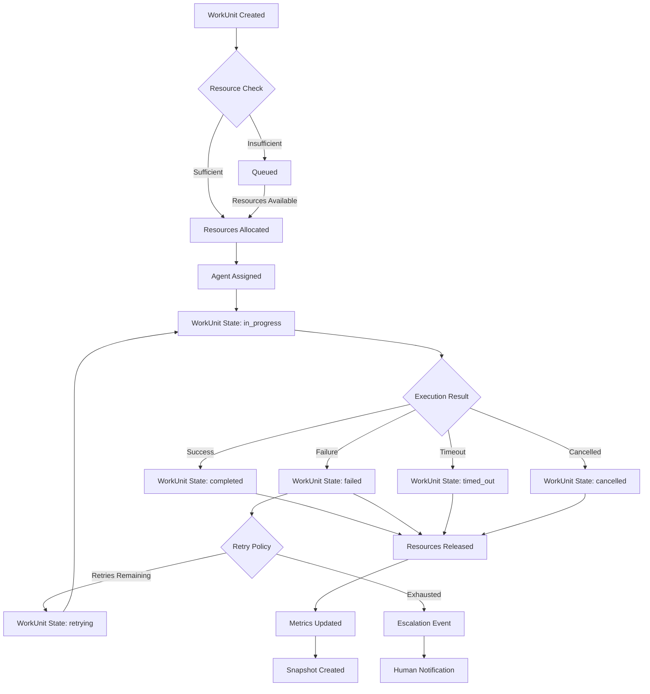

# AESP-0001: AEO Core Model (Reference)

**This document contains Sections 7-14 and Appendices of AESP-0001.**

**See `AESP-0001.md` for Sections 1-2 (Introduction and Agent Model).**  
**See `AESP-0001-continued.md` for Sections 3-6 (Organization, Role, WorkUnit, Capability Models).**

---

## 7. Resource Model

The Resource Model defines how computational resources, external service quotas, and temporal budgets are classified, allocated, monitored, and enforced within an Autonomous Engineering Organization (AEO). Every AEO implementation MUST implement the core resource types and quota enforcement mechanisms described in this section. The model is designed to support multi-agent resource sharing, autoscaling, and backpressure while preventing resource exhaustion and ensuring fair allocation across competing WorkUnits.

### 7.1 Resource Types

A **Resource** represents a quantifiable, consumable capability available to agents within the AEO. Implementations MUST support the following resource types:

| Type | Unit | Description | Example |
|------|------|-------------|---------|
| `compute` | millicores | CPU processing capacity | 2000m = 2 vCPU cores |
| `memory` | bytes | Working memory (RAM) | 8589934592 = 8 GiB |
| `tokens` | token count | LLM API consumption quota | 100000 = 100k tokens |
| `storage` | bytes | Persistent disk capacity | 107374182400 = 100 GiB |
| `network` | bytes/second | Data transfer bandwidth | 10485760 = 10 MiB/s |
| `time` | seconds | Execution deadline or budget | 3600 = 1 hour |

Each Resource instance consists of three fields: `type` (enumerated string), `amount` (non-negative numeric value), and `unit` (string indicating the unit of measure). The unit field allows implementations to express quantities in human-readable terms while normalizing internally.

**Resource JSON Schema:**

```json
{
  "$schema": "https://json-schema.org/draft/2020-12/schema",
  "$id": "https://aesp.org/schemas/resource.json",
  "title": "Resource",
  "type": "object",
  "required": ["type", "amount", "unit"],
  "properties": {
    "type": {
      "type": "string",
      "enum": ["compute", "memory", "tokens", "storage", "network", "time"]
    },
    "amount": {
      "type": "number",
      "minimum": 0,
      "description": "Non-negative quantity of the resource"
    },
    "unit": {
      "type": "string",
      "description": "Unit of measurement (e.g., 'millicores', 'bytes', 'tokens', 'seconds')"
    }
  }
}
```

### 7.2 Resource Allocation Strategies

An AEO implementation MUST support at least one of the following allocation strategies. Implementations MAY support multiple strategies and allow selection per-WorkUnit or per-Organization.

#### 7.2.1 Quota-Based Allocation

Under quota-based allocation, each Agent or WorkUnit is assigned a fixed maximum resource budget. The AEO MUST enforce that consumption never exceeds the assigned quota. Quotas support two modes:

- **Hard Quota**: Consumption exceeding the quota causes immediate termination of the offending WorkUnit. Suitable for cost-sensitive environments.
- **Soft Quota**: Exceeding the quota triggers a warning event and MAY trigger escalation to a human operator or coordinator agent. WorkUnit execution continues. Suitable for development environments.

#### 7.2.2 Burst Allocation

Burst allocation allows Agents to temporarily exceed their base quota by drawing from a shared organizational pool. The AEO MUST track:

- **Base Quota**: Guaranteed minimum allocation per-Agent or per-Role.
- **Burst Pool**: Shared organizational reserve available on demand.
- **Burst Limit**: Maximum total consumption (base + burst) allowed.
- **Decay Rate**: Rate at which burst consumption returns to base levels.

When the burst pool is exhausted, subsequent burst requests MUST be denied or queued. The AEO SHOULD emit a `ResourceExhausted` event when the burst pool is depleted below a configurable threshold (default: 20%).

#### 7.2.3 Unlimited Allocation

Unlimited allocation removes all resource constraints. This strategy is RECOMMENDED for system-level agents and human proxies only. Worker agents MUST NOT be granted unlimited allocation in production environments except during explicit troubleshooting sessions with audit logging.

### 7.3 Resource Monitoring

The AEO MUST expose resource consumption metrics for each Agent, WorkUnit, and Organization. At minimum, implementations MUST track:

| Metric | Type | Description |
|--------|------|-------------|
| `resource_consumed` | Counter | Cumulative resource units consumed |
| `resource_allocated` | Gauge | Currently allocated resource units |
| `resource_quota` | Gauge | Maximum allowed resource units |
| `resource_utilization_ratio` | Gauge | `allocated / quota` as percentage |
| `resource_throttled_events` | Counter | Number of times consumption was throttled |
| `resource_wait_time_ms` | Histogram | Time spent waiting for resource availability |

All metrics MUST include labels for `agent_id`, `workunit_id`, `organization_id`, and `resource_type` to enable multi-dimensional querying.

### 7.4 Backpressure

When resource utilization exceeds a configurable threshold (default: 85%), the AEO MUST activate backpressure mechanisms to prevent cascading failures. Backpressure strategies include:

1. **Queue Throttling**: New WorkUnit submissions are rate-limited or rejected with a `ResourceUnavailable` error.
2. **Priority Preemption**: Lower-priority WorkUnits MAY be paused to free resources for higher-priority work.
3. **Auto-Scaling**: The AEO MAY provision additional resources if auto-scaling is configured.
4. **Circuit Breaking**: Repeated resource exhaustion MAY trigger circuit breaker patterns for external service calls.

The AEO MUST emit `BackpressureActivated` and `BackpressureDeactivated` events with full context including the triggering resource type, threshold, and current utilization.

### 7.5 Resource Inheritance

Resources flow through the organizational hierarchy according to the following rules:

1. **Organization Quota**: The root Organization defines the total resource budget.
2. **Sub-Organization Inheritance**: Sub-organizations inherit a configurable fraction of their parent organization's budget. The parent MUST reserve at least a minimum percentage (default: 10%) for direct use.
3. **Role-Based Defaults**: Roles define default resource allocations for agents assigned to them. An agent's effective quota is the sum of quotas from all assigned roles plus any agent-specific overrides.
4. **WorkUnit Budgets**: WorkUnits receive a budget from the executing agent's pool. Budgets are reserved at WorkUnit start and released on completion, failure, or cancellation.

```
Organization (1000 tokens)
├── Sub-Org A (600 tokens)
│   ├── Agent A1 (Role: developer → 200 tokens)
│   │   └── WorkUnit W1 (budget: 50 tokens)
│   └── Agent A2 (Role: reviewer → 200 tokens)
└── Sub-Org B (300 tokens)
    └── Agent B1 (Role: analyst → 300 tokens)
```

### 7.6 Resource Lifecycle

Resources follow a defined lifecycle:

1. **Allocated**: Resources are reserved when a WorkUnit transitions to `in_progress`.
2. **Consumed**: Resources are consumed as the WorkUnit executes. Consumption is reported through periodic heartbeat messages.
3. **Released**: Resources are released when the WorkUnit reaches a terminal state (`completed`, `failed`, `cancelled`).
4. **Reclaimed**: Unused allocated resources MAY be reclaimed by the AEO after a grace period (default: 5 minutes) and returned to the available pool.

---

## 8. State and Persistence Model

The State and Persistence Model defines how agent, organization, and WorkUnit state is represented, transitioned, persisted, and synchronized across distributed AEO instances. This section is normative: all AEO implementations MUST implement the core state model and persistence requirements.

### 8.1 State Classification

State within an AEO is classified into three layers:

| Layer | Description | Persistence | Consistency |
|-------|-------------|-------------|-------------|
| **Entity State** | Current state of Agents, Organizations, Roles, WorkUnits | Required — MUST be durable | Strongly consistent within single node, eventually consistent across nodes |
| **Runtime State** | In-memory execution context (variables, partial results) | Optional — MAY be ephemeral | Not guaranteed across restarts |
| **Derived State** | Computed values (metrics, audit logs, analytics) | Recommended | Eventual consistency acceptable |

### 8.2 State Transitions

Every entity in the AEO model has a defined state machine. State transitions MUST be validated against allowed transitions. Invalid transitions MUST be rejected with a `StateTransitionError`.

All state transitions MUST be recorded as events with the following fields:

```json
{
  "event_id": "urn:aeo:event:uuid-v4",
  "event_type": "Agent.StateChanged",
  "entity_type": "Agent",
  "entity_id": "urn:aeo:agent:example",
  "previous_state": "idle",
  "new_state": "executing",
  "triggered_by": "urn:aeo:agent:orchestrator",
  "timestamp": "2026-07-09T12:34:56Z",
  "correlation_id": "urn:aeo:workunit:parent-task",
  "metadata": {}
}
```

### 8.3 Event Sourcing

The AEO MUST implement event sourcing as the primary persistence mechanism. Under event sourcing:

1. The **event stream** is the source of truth for all entity state.
2. Current entity state is derived by replaying events in chronological order.
3. Events are immutable and append-only.
4. Events MUST be assigned monotonically increasing sequence numbers within their stream.
5. Event streams are partitioned by entity type and entity ID for scalability.

**Required Event Types:**

| Event Category | Event Types |
|----------------|-------------|
| Agent Lifecycle | `Agent.Created`, `Agent.StateChanged`, `Agent.ConfigUpdated`, `Agent.Terminated` |
| Organization | `Organization.Created`, `Organization.StructureChanged`, `Organization.PolicyUpdated` |
| WorkUnit | `WorkUnit.Created`, `WorkUnit.StateChanged`, `WorkUnit.Assigned`, `WorkUnit.Completed`, `WorkUnit.Failed` |
| Role | `Role.Created`, `Role.Assigned`, `Role.Revoked`, `Role.PermissionsUpdated` |
| Capability | `Capability.Registered`, `Capability.Updated`, `Capability.Deregistered` |
| Resource | `Resource.Allocated`, `Resource.Consumed`, `Resource.Released`, `Resource.QuotaUpdated` |

### 8.4 CRDTs for Distributed State

AEO implementations supporting multi-node deployments MUST use Conflict-free Replicated Data Types (CRDTs) for state that must converge across nodes without coordination.

**CRDT-Required State:**

| Data Structure | CRDT Type | Use Case |
|----------------|-----------|----------|
| Presence (agent online/offline) | G-Set (Grow-Only Set) | Agent availability tracking |
| WorkUnit counters | PN-Counter | WorkUnit completion/failure counts |
| Agent capability registry | OR-Set (Observed-Remove Set) | Dynamic capability registration |
| Organization membership | OR-Map | Agent-to-organization mappings |
| Resource quotas | PN-Counter | Quota tracking across nodes |

CAP Theorem positioning: The AEO state model prioritizes **Availability and Partition tolerance (AP)** for operational state (agent presence, WorkUnit distribution) and **Consistency and Partition tolerance (CP)** for identity and registry state (agent IDs, role assignments). Implementations MAY provide configurable consistency levels per data type.

### 8.5 Snapshotting

To prevent unbounded event replay, the AEO MUST support snapshotting:

1. Snapshots capture the complete state of an entity at a specific sequence number.
2. The AEO SHOULD create snapshots at configurable intervals (default: every 1000 events).
3. Recovery proceeds from the latest snapshot plus replay of subsequent events.
4. Snapshots MUST be content-addressed (SHA256 of the snapshot data) to ensure integrity.

### 8.6 Event Flow Diagram

The following diagram illustrates the event flow for a typical WorkUnit lifecycle:



### 8.7 Implementation Requirements

1. **Idempotency**: All state transitions MUST be idempotent. Replaying the same event multiple times MUST produce the same final state.
2. **Ordering**: Events within a single entity stream MUST be totally ordered. Cross-entity ordering is not required but MAY be established through correlation IDs.
3. **Durability**: Once an event is acknowledged to the producer, it MUST NOT be lost, even in the event of system failure.
4. **Queryability**: The AEO MUST support querying current entity state by ID and querying event history with filters for entity type, time range, and event type.

---

## 9. JSON Schema Definitions

This section provides complete JSON Schema definitions for the five core entities defined in AESP-0001. These schemas are normative: conformant implementations MUST accept and produce data that validates against these schemas. Schemas use JSON Schema Draft 2020-12.

### 9.1 Agent Schema

```json
{
  "$schema": "https://json-schema.org/draft/2020-12/schema",
  "$id": "https://aesp.org/schemas/agent.json",
  "title": "Agent",
  "description": "An autonomous entity within an AEO that performs work",
  "type": "object",
  "required": ["id", "name", "version", "type", "state"],
  "properties": {
    "id": {
      "type": "string",
      "format": "uri",
      "description": "Unique URN identifier for this agent"
    },
    "name": {
      "type": "string",
      "minLength": 1,
      "description": "Human-readable agent name"
    },
    "description": {
      "type": "string",
      "description": "Optional description of the agent's purpose"
    },
    "version": {
      "type": "string",
      "pattern": "^\\d+\\.\\d+\\.\\d+(-[a-zA-Z0-9.-]+)?$",
      "description": "Semantic version of the agent implementation"
    },
    "type": {
      "type": "string",
      "enum": ["worker", "coordinator", "human_proxy", "system"],
      "description": "Agent type classification"
    },
    "state": {
      "type": "string",
      "enum": ["uninitialized", "initializing", "idle", "executing", "paused", "error", "terminating", "terminated"],
      "description": "Current lifecycle state"
    },
    "capabilities": {
      "type": "array",
      "items": {
        "type": "object",
        "required": ["id"],
        "properties": {
          "id": { "type": "string", "format": "uri" },
          "version_constraint": { "type": "string" },
          "configuration": { "type": "object" }
        }
      }
    },
    "roles": {
      "type": "array",
      "items": {
        "type": "object",
        "required": ["id"],
        "properties": {
          "id": { "type": "string", "format": "uri" },
          "scope": { "type": "string", "enum": ["organization", "workunit"] }
        }
      }
    },
    "configuration": {
      "type": "object",
      "description": "Agent-specific configuration parameters"
    },
    "metadata": {
      "type": "object",
      "description": "Implementation-specific metadata",
      "additionalProperties": true
    },
    "created_at": {
      "type": "string",
      "format": "date-time"
    },
    "updated_at": {
      "type": "string",
      "format": "date-time"
    }
  }
}
```

### 9.2 Organization Schema

```json
{
  "$schema": "https://json-schema.org/draft/2020-12/schema",
  "$id": "https://aesp.org/schemas/organization.json",
  "title": "Organization",
  "type": "object",
  "required": ["id", "name", "topology", "state"],
  "properties": {
    "id": {
      "type": "string",
      "format": "uri"
    },
    "name": {
      "type": "string",
      "minLength": 1
    },
    "description": {
      "type": "string"
    },
    "parent_id": {
      "type": "string",
      "format": "uri",
      "description": "Reference to parent organization, if any"
    },
    "topology": {
      "type": "string",
      "enum": ["flat", "hierarchical", "mesh", "pipeline", "hybrid"]
    },
    "state": {
      "type": "string",
      "enum": ["draft", "active", "suspended", "archived"]
    },
    "governance_mode": {
      "type": "string",
      "enum": ["HITL", "HOTL", "HOOTL"],
      "description": "Human-in-the-loop mode"
    },
    "policies": {
      "type": "array",
      "items": {
        "type": "object",
        "required": ["id", "type"],
        "properties": {
          "id": { "type": "string", "format": "uri" },
          "type": { "type": "string" },
          "configuration": { "type": "object" }
        }
      }
    },
    "resource_quotas": {
      "type": "array",
      "items": { "$ref": "https://aesp.org/schemas/resource.json" }
    },
    "metadata": {
      "type": "object",
      "additionalProperties": true
    },
    "created_at": {
      "type": "string",
      "format": "date-time"
    },
    "updated_at": {
      "type": "string",
      "format": "date-time"
    }
  }
}
```

### 9.3 Role Schema

```json
{
  "$schema": "https://json-schema.org/draft/2020-12/schema",
  "$id": "https://aesp.org/schemas/role.json",
  "title": "Role",
  "type": "object",
  "required": ["id", "name", "permissions"],
  "properties": {
    "id": {
      "type": "string",
      "format": "uri"
    },
    "name": {
      "type": "string",
      "minLength": 1
    },
    "description": {
      "type": "string"
    },
    "parent_role_id": {
      "type": "string",
      "format": "uri",
      "description": "For role inheritance hierarchy"
    },
    "permissions": {
      "type": "array",
      "items": {
        "type": "object",
        "required": ["action", "resource"],
        "properties": {
          "action": {
            "type": "string",
            "description": "Permission action (e.g., 'workunit:create')"
          },
          "resource": {
            "type": "string",
            "description": "Resource pattern (e.g., 'organization:*:workunits')"
          },
          "condition": {
            "type": "string",
            "description": "Optional condition expression"
          },
          "effect": {
            "type": "string",
            "enum": ["allow", "deny"],
            "default": "allow"
          }
        }
      }
    },
    "resource_quotas": {
      "type": "array",
      "items": { "$ref": "https://aesp.org/schemas/resource.json" }
    },
    "approval_matrix": {
      "type": "object",
      "description": "Actions requiring approval and approver roles",
      "additionalProperties": {
        "type": "array",
        "items": { "type": "string", "format": "uri" }
      }
    },
    "metadata": {
      "type": "object",
      "additionalProperties": true
    }
  }
}
```

### 9.4 WorkUnit Schema

```json
{
  "$schema": "https://json-schema.org/draft/2020-12/schema",
  "$id": "https://aesp.org/schemas/workunit.json",
  "title": "WorkUnit",
  "type": "object",
  "required": ["id", "name", "state"],
  "properties": {
    "id": {
      "type": "string",
      "format": "uri"
    },
    "name": {
      "type": "string",
      "minLength": 1
    },
    "description": {
      "type": "string"
    },
    "parent_id": {
      "type": "string",
      "format": "uri",
      "description": "Parent WorkUnit for HTN decomposition"
    },
    "state": {
      "type": "string",
      "enum": ["pending", "queued", "in_progress", "blocked", "awaiting_approval", "completed", "failed", "cancelled", "timed_out", "retrying"]
    },
    "priority": {
      "type": "integer",
      "minimum": 0,
      "maximum": 100,
      "default": 50,
      "description": "Higher values indicate higher priority"
    },
    "assigned_agent_id": {
      "type": "string",
      "format": "uri"
    },
    "required_capabilities": {
      "type": "array",
      "items": { "type": "string", "format": "uri" }
    },
    "input_parameters": {
      "type": "object",
      "description": "Input data for the WorkUnit"
    },
    "output_artifacts": {
      "type": "array",
      "items": {
        "type": "object",
        "properties": {
          "name": { "type": "string" },
          "type": { "type": "string" },
          "content_hash": { "type": "string" },
          "size_bytes": { "type": "integer" }
        }
      }
    },
    "resource_budget": {
      "type": "array",
      "items": { "$ref": "https://aesp.org/schemas/resource.json" }
    },
    "deadline": {
      "type": "string",
      "format": "date-time"
    },
    "retry_policy": {
      "type": "object",
      "properties": {
        "max_retries": { "type": "integer", "minimum": 0, "default": 3 },
        "backoff_strategy": {
          "type": "string",
          "enum": ["fixed", "linear", "exponential"],
          "default": "exponential"
        },
        "backoff_base_ms": { "type": "integer", "minimum": 1, "default": 1000 }
      }
    },
    "delegation_chain": {
      "type": "array",
      "items": {
        "type": "object",
        "properties": {
          "from_agent_id": { "type": "string", "format": "uri" },
          "to_agent_id": { "type": "string", "format": "uri" },
          "delegated_at": { "type": "string", "format": "date-time" },
          "reason": { "type": "string" }
        }
      }
    },
    "created_at": {
      "type": "string",
      "format": "date-time"
    },
    "started_at": {
      "type": "string",
      "format": "date-time"
    },
    "completed_at": {
      "type": "string",
      "format": "date-time"
    },
    "metadata": {
      "type": "object",
      "additionalProperties": true
    }
  }
}
```

### 9.5 Capability Schema

```json
{
  "$schema": "https://json-schema.org/draft/2020-12/schema",
  "$id": "https://aesp.org/schemas/capability.json",
  "title": "Capability",
  "type": "object",
  "required": ["id", "name", "interface_definition"],
  "properties": {
    "id": {
      "type": "string",
      "format": "uri"
    },
    "name": {
      "type": "string",
      "minLength": 1
    },
    "description": {
      "type": "string"
    },
    "version": {
      "type": "string",
      "pattern": "^\\d+\\.\\d+\\.\\d+(-[a-zA-Z0-9.-]+)?$"
    },
    "interface_definition": {
      "type": "object",
      "required": ["input_schema", "output_schema"],
      "properties": {
        "input_schema": {
          "type": "object",
          "description": "JSON Schema for capability inputs"
        },
        "output_schema": {
          "type": "object",
          "description": "JSON Schema for capability outputs"
        },
        "error_schema": {
          "type": "object",
          "description": "JSON Schema for capability errors"
        }
      }
    },
    "composition_patterns": {
      "type": "array",
      "items": {
        "type": "string",
        "enum": ["sequential", "parallel", "conditional", "retry", "fallback"]
      }
    },
    "required_resources": {
      "type": "array",
      "items": { "$ref": "https://aesp.org/schemas/resource.json" }
    },
    "metadata": {
      "type": "object",
      "additionalProperties": true
    },
    "created_at": {
      "type": "string",
      "format": "date-time"
    },
    "updated_at": {
      "type": "string",
      "format": "date-time"
    }
  }
}
```

---

## 10. Examples

This section provides comprehensive examples demonstrating correct application of the AEO Core Model. Each example includes complete JSON representations.

### 10.1 Example: Software Development Organization

A flat-organization AEO with specialized developer agents working on a software project.

```json
{
  "organization": {
    "id": "urn:aeo:org:devteam-alpha",
    "name": "DevTeam Alpha",
    "topology": "flat",
    "state": "active",
    "governance_mode": "HITL",
    "resource_quotas": [
      { "type": "tokens", "amount": 500000, "unit": "tokens" },
      { "type": "compute", "amount": 8000, "unit": "millicores" }
    ]
  },
  "roles": [
    {
      "id": "urn:aeo:role:senior-dev",
      "name": "Senior Developer",
      "permissions": [
        { "action": "workunit:*", "resource": "organization:devteam-alpha:workunits" },
        { "action": "code:push", "resource": "repository:main" }
      ]
    },
    {
      "id": "urn:aeo:role:reviewer",
      "name": "Code Reviewer",
      "permissions": [
        { "action": "code:review", "resource": "repository:*" },
        { "action": "workunit:approve", "resource": "organization:devteam-alpha:workunits" }
      ]
    }
  ],
  "agents": [
    {
      "id": "urn:aeo:agent:frontend-dev",
      "name": "Frontend Developer",
      "version": "1.2.0",
      "type": "worker",
      "state": "idle",
      "capabilities": [
        { "id": "urn:aeo:cap:react-development" },
        { "id": "urn:aeo:cap:ui-testing" }
      ],
      "roles": [
        { "id": "urn:aeo:role:senior-dev" }
      ]
    },
    {
      "id": "urn:aeo:agent:backend-dev",
      "name": "Backend Developer",
      "version": "1.3.0",
      "type": "worker",
      "state": "idle",
      "capabilities": [
        { "id": "urn:aeo:cap:api-design" },
        { "id": "urn:aeo:cap:database-modeling" }
      ],
      "roles": [
        { "id": "urn:aeo:role:senior-dev" }
      ]
    },
    {
      "id": "urn:aeo:agent:code-reviewer",
      "name": "Code Reviewer",
      "version": "2.0.0",
      "type": "worker",
      "state": "idle",
      "capabilities": [
        { "id": "urn:aeo:cap:code-review" },
        { "id": "urn:aeo:cap:static-analysis" }
      ],
      "roles": [
        { "id": "urn:aeo:role:reviewer" }
      ]
    }
  ],
  "workunits": [
    {
      "id": "urn:aeo:wu:feature-auth",
      "name": "Implement Authentication",
      "state": "in_progress",
      "priority": 80,
      "assigned_agent_id": "urn:aeo:agent:backend-dev",
      "required_capabilities": ["urn:aeo:cap:api-design"],
      "resource_budget": [
        { "type": "tokens", "amount": 50000, "unit": "tokens" }
      ]
    },
    {
      "id": "urn:aeo:wu:review-auth",
      "name": "Review Authentication Implementation",
      "state": "pending",
      "priority": 70,
      "assigned_agent_id": "urn:aeo:agent:code-reviewer",
      "parent_id": "urn:aeo:wu:feature-auth",
      "required_capabilities": ["urn:aeo:cap:code-review"]
    }
  ]
}
```

### 10.2 Example: Hierarchical Data Processing Pipeline

A hierarchical organization for large-scale data processing with coordinator-managed task distribution.

```json
{
  "organization": {
    "id": "urn:aeo:org:data-pipeline",
    "name": "Data Processing Pipeline",
    "topology": "hierarchical",
    "state": "active",
    "governance_mode": "HOTL"
  },
  "sub_organizations": [
    {
      "id": "urn:aeo:org:data-ingestion",
      "name": "Ingestion Layer",
      "parent_id": "urn:aeo:org:data-pipeline",
      "topology": "pipeline"
    },
    {
      "id": "urn:aeo:org:data-transform",
      "name": "Transformation Layer",
      "parent_id": "urn:aeo:org:data-pipeline",
      "topology": "pipeline"
    },
    {
      "id": "urn:aeo:org:data-output",
      "name": "Output Layer",
      "parent_id": "urn:aeo:org:data-pipeline",
      "topology": "pipeline"
    }
  ],
  "agents": [
    {
      "id": "urn:aeo:agent:pipeline-coordinator",
      "name": "Pipeline Coordinator",
      "version": "3.0.0",
      "type": "coordinator",
      "state": "executing",
      "capabilities": [
        { "id": "urn:aeo:cap:workflow-orchestration" },
        { "id": "urn:aeo:cap:resource-scheduling" }
      ]
    }
  ]
}
```

### 10.3 Example: Human-in-the-Loop Approval Flow

A financial AEO demonstrating HITL governance with approval workflows for high-value transactions.

```json
{
  "organization": {
    "id": "urn:aeo:org:finance-ops",
    "name": "Financial Operations",
    "topology": "hierarchical",
    "state": "active",
    "governance_mode": "HITL"
  },
  "roles": [
    {
      "id": "urn:aeo:role:analyst",
      "name": "Financial Analyst",
      "permissions": [
        { "action": "workunit:create", "resource": "organization:finance-ops:workunits" },
        { "action": "report:generate", "resource": "organization:finance-ops:reports" }
      ],
      "approval_matrix": {
        "transaction:approve": ["urn:aeo:role:manager"]
      }
    },
    {
      "id": "urn:aeo:role:manager",
      "name": "Finance Manager",
      "permissions": [
        { "action": "transaction:approve", "resource": "organization:finance-ops:transactions" },
        { "action": "workunit:*", "resource": "organization:finance-ops:workunits" }
      ]
    },
    {
      "id": "urn:aeo:role:human-approver",
      "name": "Human Approver Proxy",
      "permissions": [
        { "action": "transaction:approve", "resource": "organization:finance-ops:transactions", "condition": "amount > 10000" }
      ]
    }
  ],
  "workunits": [
    {
      "id": "urn:aeo:wu:process-payment",
      "name": "Process High-Value Payment",
      "state": "awaiting_approval",
      "priority": 95,
      "assigned_agent_id": "urn:aeo:agent:finance-analyst",
      "required_capabilities": ["urn:aeo:cap:payment-processing"]
    }
  ]
}
```

### 10.4 Example: Capability Composition

A capability definition with sequential and fallback composition patterns.

```json
{
  "capability": {
    "id": "urn:aeo:cap:document-processing",
    "name": "Document Processing Pipeline",
    "version": "1.0.0",
    "interface_definition": {
      "input_schema": {
        "type": "object",
        "required": ["document_url"],
        "properties": {
          "document_url": { "type": "string", "format": "uri" },
          "extract_metadata": { "type": "boolean", "default": true }
        }
      },
      "output_schema": {
        "type": "object",
        "required": ["extracted_text", "entities"],
        "properties": {
          "extracted_text": { "type": "string" },
          "entities": { "type": "array", "items": { "type": "string" } },
          "metadata": { "type": "object" }
        }
      },
      "error_schema": {
        "type": "object",
        "required": ["error_code", "message"],
        "properties": {
          "error_code": { "type": "string" },
          "message": { "type": "string" },
          "recoverable": { "type": "boolean" }
        }
      }
    },
    "composition_patterns": ["sequential", "fallback", "retry"],
    "required_resources": [
      { "type": "compute", "amount": 2000, "unit": "millicores" },
      { "type": "tokens", "amount": 10000, "unit": "tokens" }
    ]
  }
}
```

---

## 11. Counter-Examples

This section illustrates common anti-patterns and incorrect applications of the AEO Core Model. Each counter-example includes an explanation of why it violates the specification and how to correct it.

### 11.1 Counter-Example: Missing Capability Declaration

**Incorrect:** An agent attempts to execute a WorkUnit requiring a capability it does not possess.

```json
{
  "agent": {
    "id": "urn:aeo:agent:frontend-dev",
    "capabilities": [
      { "id": "urn:aeo:cap:react-development" }
    ]
  },
  "workunit": {
    "id": "urn:aeo:wu:backend-task",
    "required_capabilities": ["urn:aeo:cap:api-design"],
    "assigned_agent_id": "urn:aeo:agent:frontend-dev"
  }
}
```

**Violation:** The WorkUnit requires `urn:aeo:cap:api-design` but the agent only declares `urn:aeo:cap:react-development`.

**Correction:** Either reassign the WorkUnit to an agent with the required capability, or grant the agent the required capability (with appropriate capability verification).

### 11.2 Counter-Example: Circular Role Inheritance

**Incorrect:** Role A inherits from Role B, which inherits from Role A.

```json
{
  "role_a": { "id": "urn:aeo:role:admin", "parent_role_id": "urn:aeo:role:super-admin" },
  "role_b": { "id": "urn:aeo:role:super-admin", "parent_role_id": "urn:aeo:role:admin" }
}
```

**Violation:** Circular inheritance creates infinite loops in permission resolution.

**Correction:** Ensure role inheritance forms a directed acyclic graph (DAG). The AEO SHOULD validate this on role creation.

### 11.3 Counter-Example: Invalid State Transition

**Incorrect:** Attempting to transition a WorkUnit directly from `pending` to `completed`.

**Violation:** The WorkUnit state machine requires passing through `in_progress`. Direct `pending` → `completed` skips resource allocation, execution tracking, and output validation.

**Correction:** WorkUnits MUST transition through `in_progress` before reaching `completed`. The AEO MUST reject invalid transitions.

### 11.4 Counter-Example: Hard-Coded Agent Identifiers

**Incorrect:** WorkUnits reference agents by hardcoded human-readable names.

```json
{
  "workunit": {
    "assigned_agent_id": "the-backend-guy"
  }
}
```

**Violation:** Agent IDs MUST be URNs. Human-readable names are not guaranteed unique and cannot be resolved across AEO instances.

**Correction:** Use proper URN identifiers: `urn:aeo:agent:backend-dev-001`.

### 11.5 Counter-Example: Unlimited Production Quotas

**Incorrect:** Granting unlimited resource quotas to worker agents in production.

```json
{
  "agent": {
    "id": "urn:aeo:agent:data-processor",
    "type": "worker",
    "resource_quotas": []
  }
}
```

**Violation:** Worker agents MUST have defined resource quotas in production. Unlimited quotas risk runaway costs and resource exhaustion.

**Correction:** Define explicit quotas appropriate to the agent's role and expected workload.

### 11.6 Counter-Example: Missing Approval Matrix

**Incorrect:** A high-privilege role without an approval matrix for sensitive operations.

```json
{
  "role": {
    "id": "urn:aeo:role:deployment-admin",
    "permissions": [
      { "action": "deployment:execute", "resource": "production:*" }
    ]
  }
}
```

**Violation:** Production deployments SHOULD require multi-person approval. The absence of an approval matrix for high-impact actions violates the principle of autonomy with oversight.

**Correction:** Add an approval matrix requiring at least one other role to approve production deployments.

### 11.7 Counter-Example: Flat Topology for Complex Domains

**Incorrect:** Using a flat topology for an organization with 50+ agents and complex dependency chains.

**Violation:** Flat topologies do not support delegation chains, resource inheritance, or scoped governance. At scale, coordination overhead becomes unsustainable.

**Correction:** Use a hierarchical or hybrid topology with sub-organizations aligned to functional domains.

---

## 12. Best Practices

### 12.1 Agent Design

1. **Single Responsibility**: Each agent SHOULD have a focused, well-defined responsibility. Avoid "god agents" that perform unrelated tasks.
2. **Capability Granularity**: Capabilities SHOULD be fine-grained and composable. Prefer `urn:aeo:cap:code-review` over `urn:aeo:cap:full-development`.
3. **Agent Versioning**: All agents MUST include version numbers. Changes to agent behavior SHOULD increment the version.
4. **Graceful Degradation**: Agents SHOULD handle missing or degraded capabilities gracefully, falling back to alternative approaches.
5. **Heartbeat Monitoring**: Agents SHOULD emit periodic heartbeat events (recommended interval: 30 seconds) to enable health monitoring.

### 12.2 Organization Design

6. **Topology Selection**: Choose the simplest topology that meets your needs. Start with flat for small teams (< 10 agents), hierarchical for larger organizations.
7. **Sub-Organization Boundaries**: Align sub-organizations with team boundaries or functional domains. The Spotify Model (squads/tribes/chapters/guilds) provides a useful reference.
8. **Governance Mode Selection**: Use HITL for high-risk domains (finance, healthcare, production deployments). Use HOTL for standard development workflows. Use HOOTL only for well-understood, low-risk automation.
9. **Resource Headroom**: Reserve 20-30% of organizational resource quotas for burst allocation and unexpected demand.
10. **Event Retention**: Retain event streams for at least 90 days for audit and debugging purposes. Snapshot frequently to limit replay time.

### 12.3 WorkUnit Design

11. **Appropriate Granularity**: WorkUnits SHOULD represent 5-30 minutes of agent work. Too fine-grained creates overhead; too coarse limits parallelism.
12. **Explicit Dependencies**: Always declare parent-child relationships for dependent WorkUnits. Avoid implicit ordering through side effects.
13. **Retry Configuration**: Use exponential backoff with jitter for external service calls. Set max_retries based on the criticality of the WorkUnit.
14. **Timeout Setting**: Always set explicit deadlines on WorkUnits. The default timeout SHOULD be no more than 10 minutes for worker tasks.
15. **Output Artifacts**: WorkUnits SHOULD produce content-addressable output artifacts to enable reproducibility and caching.

### 12.4 Security

16. **Least Privilege**: Assign agents the minimum roles and permissions required for their tasks. Regularly audit role assignments.
17. **Capability Verification**: Verify declared capabilities through automated testing before accepting agent registrations.
18. **Audit Everything**: Log all state transitions, permission checks, and approval decisions to an immutable audit stream.
19. **Secret Management**: Never store secrets in agent configuration. Use a dedicated secret management system with dynamic credential generation.
20. **Input Validation**: Validate all WorkUnit inputs against their declared schemas before execution. Reject malformed inputs at the boundary.

---

## 13. Security Considerations

### 13.1 Authentication and Authorization

All agents within an AEO MUST be authenticated before performing any action. The AEO MUST support:

- **Identity Verification**: Every agent MUST present a cryptographically verifiable identity (e.g., JWT signed by the AEO's identity provider).
- **Permission Enforcement**: All actions MUST be authorized against the agent's roles and permissions. Deny-by-default is REQUIRED.
- **Capability Verification**: Agents MUST prove possession of declared capabilities before being assigned WorkUnits requiring those capabilities.

### 13.2 Human Oversight

The AEO MUST implement the following oversight controls:

1. **Approval Gates**: Actions classified as high-risk (deployment to production, financial transactions, data deletion) MUST pass through human approval.
2. **Emergency Stop**: Human operators MUST be able to immediately halt all agent activity in an organization ("kill switch").
3. **Audit Logging**: All agent actions, especially those taken autonomously, MUST be logged to an immutable audit trail.
4. **Anomaly Detection**: The AEO SHOULD monitor for anomalous agent behavior (unusual resource consumption, repeated failures, unauthorized access attempts) and alert human operators.

### 13.3 Data Protection

- **Encryption in Transit**: All inter-agent communication MUST use TLS 1.3 or equivalent.
- **Encryption at Rest**: Event streams and snapshots MUST be encrypted.
- **Data Minimization**: Agents SHOULD only access data necessary for their current WorkUnit.
- **Retention Policies**: Implement data retention policies compliant with applicable regulations (GDPR, CCPA, etc.).

### 13.4 Supply Chain Security

- **Capability Provenance**: The origin of all capabilities SHOULD be tracked and verified.
- **Dependency Scanning**: External capabilities and tools used by agents SHOULD be scanned for known vulnerabilities.
- **Reproducible Builds**: Agent implementations SHOULD use reproducible build processes to ensure integrity.

### 13.5 Denial of Service

The AEO MUST implement protections against DoS attacks:
- Rate limiting on WorkUnit creation
- Resource quotas (see Section 7)
- Circuit breakers for external service calls
- Maximum WorkUnit depth limits to prevent stack exhaustion from deep HTN chains

---

## 14. Future Work

The following areas are identified for future specification development:

### 14.1 Planned AESP Specifications

The following specifications will build upon the core model defined in AESP-0001:

| Specification | Domain | Description |
|---------------|--------|-------------|
| AESP-0002 | DC-Core | Agent Roles — Standard role definitions and templates |
| AESP-0003 | DC-Infra | Communication Protocols — Inter-agent message passing |
| AESP-0004 | DC-Infra | Memory Systems — Short-term and long-term agent memory |
| AESP-0005 | DC-Ops | Workflow Orchestration — Advanced workflow patterns |
| AESP-0006 | DC-Cross | Knowledge Graph — Shared organizational knowledge |
| AESP-0007 | DC-Infra | Tool Integration — External tool and API integration |
| AESP-0008 | DC-Ops | Testing and Quality — Agent testing frameworks |
| AESP-0009 | DC-Ops | Deployment — Deployment and scaling patterns |
| AESP-0010 | DC-Ops | Monitoring and Observability — Metrics and tracing |
| AESP-0011 | DC-Core | Multi-Organization Federation — Cross-organizational collaboration |
| AESP-0012 | DC-Cross | Marketplace — Capability and agent marketplace |
| AESP-0013 | DC-Infra | Security — Detailed security protocols and cryptography |
| AESP-0014 | DC-Cross | Compliance — Regulatory compliance frameworks |
| AESP-0015 | DC-Core | Migration — Version migration and backward compatibility |

### 14.2 Research Directions

1. **Formal Verification**: Exploring formal methods for verifying agent behavior against specifications.
2. **Emergent Behavior**: Studying emergent collective behavior in large-scale AEOs and methods for safe emergence.
3. **Human-Agent Teaming**: Advanced patterns for effective human-agent collaboration beyond HITL/HOTL/HOOTL.
4. **Cross-Organization Trust**: Distributed trust mechanisms for multi-organizational AEO federation.

---

## Appendices

### Appendix A: Resource Quota Example

Complete example of a resource quota configuration for a mid-sized development team:

```json
{
  "organization_quotas": [
    { "type": "tokens", "amount": 2000000, "unit": "tokens", "allocation": "quota" },
    { "type": "compute", "amount": 16000, "unit": "millicores", "allocation": "quota" },
    { "type": "memory", "amount": 34359738368, "unit": "bytes", "allocation": "quota" }
  ],
  "burst_pool": [
    { "type": "tokens", "amount": 500000, "unit": "tokens" },
    { "type": "compute", "amount": 4000, "unit": "millicores" }
  ],
  "role_defaults": {
    "urn:aeo:role:developer": {
      "tokens": { "base": 100000, "burst": 50000 },
      "compute": { "base": 2000, "burst": 1000 }
    },
    "urn:aeo:role:reviewer": {
      "tokens": { "base": 50000, "burst": 25000 },
      "compute": { "base": 1000, "burst": 500 }
    },
    "urn:aeo:role:coordinator": {
      "tokens": { "base": 20000, "burst": 10000 },
      "compute": { "base": 500, "burst": 250 }
    }
  },
  "backpressure": {
    "activation_threshold": 0.85,
    "deactivation_threshold": 0.70,
    "strategy": "queue_throttling"
  }
}
```

### Appendix B: Decision Records

#### ADR-0001: Actor Model for Agent Abstraction

**Status**: Accepted  
**Date**: 2026-07-09

**Context**: The AEO Core Model needed a computational foundation for agents that supports concurrency, distribution, and fault isolation.

**Decision**: Adopt the Actor Model as the conceptual foundation for agent abstraction. Each agent is an actor with a mailbox, internal state, and behavior.

**Consequences**:
- (+) Natural fit for autonomous, message-driven entities
- (+) Well-established theoretical foundation with proven implementations
- (+) Enables location transparency for distributed deployments
- (-) Requires message-passing discipline; shared state must be explicit
- (-) Debugging message-passing systems can be challenging

#### ADR-0002: Role-Centric Permission Model

**Status**: Accepted  
**Date**: 2026-07-09

**Context**: Agent permissions could be assigned directly or through role-based indirection.

**Decision**: Adopt RBAC with role inheritance as the primary permission model. Direct permission assignment to agents is NOT supported.

**Consequences**:
- (+) Simplified permission management at scale
- (+) Natural alignment with organizational structures
- (+) Audit-friendly: permissions flow through role assignments
- (-) Requires careful role design to avoid permission accumulation
- (-) Role hierarchy depth should be limited (recommended: max 3 levels)

#### ADR-0003: HTN for WorkUnit Decomposition

**Status**: Accepted  
**Date**: 2026-07-09

**Context**: WorkUnit decomposition needed a structured approach that supports planning, replanning, and mixed-initiative decomposition.

**Decision**: Adopt Hierarchical Task Networks (HTN) as the decomposition model. WorkUnits form a tree through parent-child relationships.

**Consequences**:
- (+) Mature planning formalism with extensive research support
- (+) Supports both automated and human-guided decomposition
- (+) Natural fit for goal-directed agent behavior
- (-) Requires domain knowledge in the form of decomposition methods
- (-) HTN planning can be computationally expensive for deep hierarchies

#### ADR-0004: Content-Addressable Capability Identifiers

**Status**: Accepted  
**Date**: 2026-07-09

**Context**: Capability identifiers need to support versioning, discovery, and verification.

**Decision**: Use structured URNs for capability identifiers. Versioning is part of the identifier. Capability interfaces are defined by JSON Schema.

**Consequences**:
- (+) Human-readable and machine-resolvable
- (+) Versioning is explicit in the identifier
- (+) Enables capability registries and marketplaces
- (-) URN length may be verbose in some contexts
- (-) Requires namespace management

#### ADR-0005: CRDTs for Distributed State

**Status**: Accepted  
**Date**: 2026-07-09

**Context**: Multi-node AEO deployments require state synchronization without single points of failure.

**Decision**: Use CRDTs for state that must converge across nodes. Event sourcing provides the durability layer.

**Consequences**:
- (+) Strong eventual consistency without coordination
- (+) Natural fit with event-sourced architectures
- (+) Supports offline operation and partition recovery
- (-) CRDTs have memory overhead compared to simple values
- (-) Not all data structures have efficient CRDT representations

### Appendix C: Migration Guide

#### Migrating from Ad-Hoc Agent Systems

Organizations migrating from ad-hoc agent implementations to AESP-0001 compliance SHOULD follow this sequence:

**Phase 1: Inventory (Week 1-2)**
1. Catalog all existing agents and their responsibilities
2. Map current permission models to Role definitions
3. Identify resource consumption patterns
4. Document existing communication patterns

**Phase 2: Role Design (Week 2-3)**
1. Design role hierarchy based on functional domains
2. Define permissions for each role using the action:resource:condition pattern
3. Establish approval matrices for sensitive operations
4. Define resource quotas per role

**Phase 3: Agent Migration (Week 3-6)**
1. Assign agents to roles
2. Register capabilities with formal interface definitions
3. Implement Agent Cards for all agents
4. Add heartbeat and monitoring

**Phase 4: WorkUnit Migration (Week 5-8)**
1. Identify current task types and map to WorkUnit patterns
2. Implement HTN decomposition for complex workflows
3. Add explicit resource budgets to all WorkUnits
4. Set up event sourcing for audit trails

**Phase 5: Validation (Week 7-8)**
1. Run parallel old and new systems
2. Compare outputs and resource consumption
3. Validate all permission enforcement
4. Gradually cut over traffic

#### Version Migration

When AESP-0001 is updated, implementations SHOULD:

1. Review the CHANGELOG for breaking changes
2. Update JSON Schema validations
3. Migrate persisted state using event stream transformation
4. Test all agent integrations against new schemas
5. Update capability interface definitions as needed
