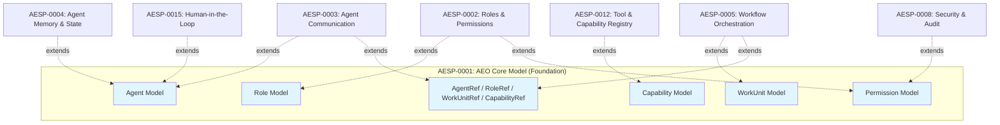
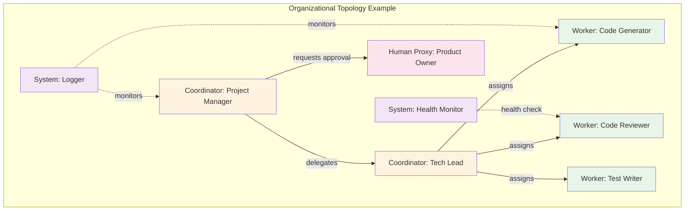
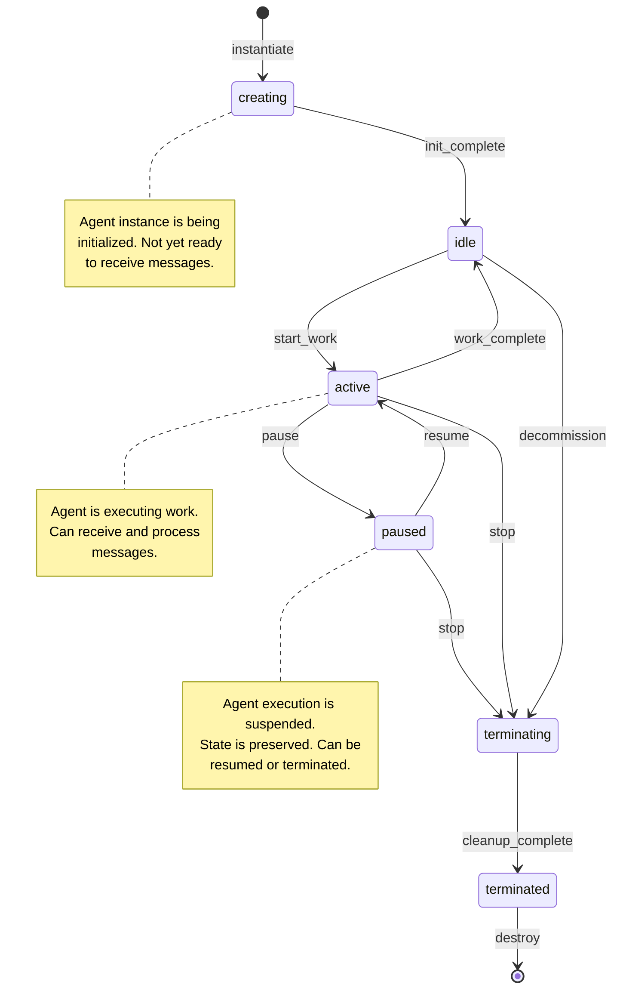

# AESP-0001: Autonomous Engineering Organization Core Model

**Version:** 1.0.0-draft  
**Status:** Draft  
**Maturity Target:** Stable  
**Last Updated:** 2026-07-09  
**Domain:** DC-Core  
**Dependencies:** AESP-0000 (Constitution) — normative  

---

## Status of This Specification

This document is **AESP-0001 AEO Core Model**, version 1.0.0-draft. It defines the
foundational data model, abstractions, and relationships of an Autonomous
Engineering Organization (AEO). This specification is normative for all other
AESP specifications that extend the core model.

The status is **Draft**. This specification is under active development and
review. It has not yet reached the maturity threshold of 2 independent
implementations required for **Stable** status.

---

## Abstract

This specification defines the core data model of the Autonomous Engineering
Organization (AEO). It specifies the foundational entities — Agent, Organization,
Role, WorkUnit, and Capability — their attributes, relationships, lifecycles,
and state models. All other AESP specifications extend or constrain the
abstractions defined herein. This specification is the schema definition for the
AESP standard.

---

> **Document Structure:** This specification is split across three files:
> - `AESP-0001.md` — Sections 1-2: Introduction and Agent Model
> - `AESP-0001-continued.md` — Sections 3-6: Organization Model, Role Model, WorkUnit Model, Capability Model
> - `AESP-0001-reference.md` — Sections 7-14: Resource Model, State Model, JSON Schemas, Examples, and Appendices

---

# 1. Introduction

## 1.1 What is the AEO Core Model

The AEO Core Model is the foundational data model for all Autonomous Engineering Organizations (AEOs). It defines the structural abstractions, entity types, relationships, and invariants that every AEO MUST implement or extend. This specification answers the question: **"What is an AEO?"** It does NOT answer: **"How is an AEO implemented?"** Implementation details are left to downstream specifications, vendor tooling, and organizational policies.

An AEO, as defined in the AESP-0000 Constitution Section 3, is *"a structured collection of AI agents operating under human governance, organized for the purpose of executing engineering work units through cooperative computation."* The AEO Core Model materializes this definition into concrete, machine-readable specifications.

The Core Model provides:

1. **Entity definitions** — The building blocks of every AEO: agents, roles, work units, capabilities, and references.
2. **Relationship invariants** — How entities relate to one another and what constraints govern those relationships.
3. **Lifecycle semantics** — The state machines and transition rules that govern entity behavior over time.
4. **Identity and addressing** — How entities are globally identified, discovered, and referenced across AEO boundaries.
5. **Extensibility contracts** — The mechanisms by which the Core Model is extended by domain-specific specifications.

Every AEO implementation MUST provide a *Core Model Manifest* — a JSON document conforming to the schema defined in this specification — that enumerates the entities, relationships, and configurations present in that AEO. The manifest serves as the machine-readable contract between the AEO and any tooling that interacts with it.

> **Example 1.1 — Minimal AEO Core Model Manifest**
>
> ```json
> {
>   "aeoVersion": "1.0.0",
>   "aeoId": "urn:aeo:example:engineering-org-42",
>   "name": "Example Engineering Organization",
>   "topology": "hierarchical",
>   "governanceMode": "human-in-the-loop",
>   "agents": [
>     {
>       "id": "urn:aeo:agent:code-reviewer",
>       "name": "Code Reviewer",
>       "type": "worker",
>       "version": "1.0.0",
>       "state": "idle",
>       "capabilities": ["urn:aeo:cap:code-review"],
>       "roles": ["urn:aeo:role:senior-reviewer"]
>     }
>   ]
> }
> ```

The Core Model is designed to be **vendor-neutral** and **implementation-agnostic**. An AEO MAY be implemented using LangGraph, CrewAI, AutoGen, a custom orchestrator, or a hybrid of multiple frameworks. The Core Model does not prescribe the underlying framework; it prescribes the data model that the framework MUST expose.

> **Non-Normative Note:** The distinction between "model" and "implementation" is intentional and mirrors the separation between the OpenAPI Specification (which defines API contracts) and the servers that implement those APIs. Two AEOs that expose identical Core Model manifests are interchangeable from the perspective of AEO tooling, even if their internal implementations differ radically.

---

### 1.2 Relationship to Constitution

AESP-0001 is the first specification governed by the AESP-0000 Constitution. It directly implements the AEO model defined in Constitution Section 3, and operationalizes the eight foundational principles defined in Constitution Section 2.

| Constitutional Principle | Core Model Operationalization |
|---|---|
| **Autonomy with Oversight** (§2.1) | Agent lifecycle states provide hooks for human intervention. GovernanceMode enum encodes oversight levels. |
| **Vendor Neutrality** (§2.2) | Entity definitions contain no framework-specific fields. The model is designed to be implementable by any orchestrator. |
| **Declarative over Imperative** (§2.3) | The Core Model Manifest is a declarative document describing WHAT the AEO is, not HOW it operates. |
| **Machine-Readable First** (§2.4) | All entities are defined with JSON Schemas. Human-readable documentation is derived from the schemas. |
| **Extensibility** (§2.5) | Extension points are explicit: `metadata`, `configuration`, and `extensions` fields on every entity. |
| **Rough Consensus** (§2.6) | This specification is authored by the AESP Standards Committee through the consensus process. |
| **Content-Addressable Artifacts** (§2.7) | All entity references use content-addressable URIs. |
| **Continuous Evolution** (§2.8) | Version fields on every entity enable graceful evolution. |

AESP-0001 is **normative** over the data model but **informative** over implementation.

---

### 1.3 Relationship to Other Specifications

AESP-0001 is the **foundation** of the AESP specification family. All other specifications extend, specialize, or depend upon the Core Model.



| Specification | Extends Core Model Element | Extension Nature |
|---|---|---|
| **AESP-0002** — Roles & Permissions | `Role` entity, Permission model | Adds role hierarchies, permission grants, access control lists |
| **AESP-0003** — Agent Communication | `Agent` messaging interface, `AgentRef` | Defines message formats, transport protocols, delivery guarantees |
| **AESP-0004** — Agent Memory & State | `Agent` state model | Specifies memory types, persistence mechanisms, context window management |
| **AESP-0005** — Workflow Orchestration | `WorkUnit` entity, `WorkUnitRef` | Defines workflow graphs, execution semantics, failure handling |
| **AESP-0008** — Security & Audit | Permission model | Adds authentication, authorization, audit logging, threat models |
| **AESP-0012** — Tool & Capability Registry | `Capability` entity, `CapabilityRef` | Standardizes tool descriptions, capability discovery, versioning |

Each downstream specification MUST declare its Core Model dependency in its specification header using the `coreModelVersion` field. A specification that extends the Core Model MUST NOT contradict any normative requirement in AESP-0001; it MAY only add constraints or define extensions at explicitly marked extension points.

---

### 1.4 Terminology

**Agent** — An autonomous computational actor that receives messages, processes them according to its configuration and capabilities, and produces responses. An Agent is the primary unit of work in an AEO. See Section 2.

**Organization** — The top-level entity representing an AEO. An Organization is a named, governed collection of Agents, Roles, Work Units, and Capabilities with a defined Topology and GovernanceMode.

**Role** — A named set of permissions, responsibilities, and behavioral expectations that can be assigned to one or more Agents. A single Agent MAY hold multiple Roles; a single Role MAY be assigned to multiple Agents.

**WorkUnit** — The smallest unit of work that can be assigned to an Agent. A WorkUnit has a type, input parameters, output schema, execution constraints, and a lifecycle state.

**Capability** — A declarative description of a skill, tool, or function that an Agent can perform. Capabilities enable discovery: an Agent can find other Agents by querying for Capabilities.

**AgentRef** — A URI that uniquely identifies an Agent within an AEO. An AgentRef MUST be a valid URI.

**RoleRef** — A URI that uniquely identifies a Role.

**WorkUnitRef** — A URI that uniquely identifies a WorkUnit.

**CapabilityRef** — A URI that uniquely identifies a Capability.

**Topology** — The structural arrangement of Agents within an AEO: `flat`, `hierarchical`, `graph`, or `federated`.

**GovernanceMode** — The level of human oversight: `autonomous`, `human-in-the-loop`, `human-on-the-loop`, or `human-in-command`.

**ResourceAllocation** — The mapping of computational resources to Agents.

---

### 1.5 Requirements Language

The key words "MUST", "MUST NOT", "REQUIRED", "SHALL", "SHALL NOT", "SHOULD", "SHOULD NOT", "RECOMMENDED", "NOT RECOMMENDED", "MAY", and "OPTIONAL" in this document are to be interpreted as described in BCP 14 [RFC 8174] [RFC 2119] when, and only when, they appear in all capitals, as shown here.

Normative requirements are expressed using the BCP 14 keywords. Non-normative guidance is provided in Notes labeled "Non-Normative Note", Examples labeled "Example", and Counter-examples labeled "Counter-Example".

All JSON Schema fragments in this specification are **normative**. All Mermaid diagrams are **informative**.

---

# 2. Agent Model

### 2.1 Agent Definition

An **Agent** is an autonomous computational actor that receives messages, processes them according to its configuration and capabilities, and produces responses. Agents are the primary unit of computation in an AEO. This specification defines the **interface and data model** of an Agent; it does NOT define the internal implementation.

> **Non-Normative Note:** The Agent abstraction draws from the Actor Model of computation and the BDI (Belief-Desire-Intention) agent architecture. The AEO Core Model uses the Actor Model as its computational foundation and the BDI model as a conceptual lens for understanding agent behavior.

#### 2.1.1 Agent JSON Schema

```json
{
  "$schema": "https://json-schema.org/draft/2020-12/schema",
  "$id": "urn:aeo:schema:agent",
  "title": "Agent",
  "description": "An autonomous computational actor within an AEO",
  "type": "object",
  "required": ["id", "name", "version", "type", "state", "capabilities", "roles"],
  "properties": {
    "id": {
      "type": "string",
      "format": "uri",
      "description": "Globally unique identifier for this agent. MUST be a valid URI."
    },
    "name": {
      "type": "string",
      "minLength": 1,
      "maxLength": 256,
      "description": "Human-readable name for the agent."
    },
    "description": {
      "type": "string",
      "maxLength": 4096,
      "description": "Human-readable description of the agent's purpose and behavior."
    },
    "version": {
      "type": "string",
      "pattern": "^(0|[1-9][0-9]*)\\.(0|[1-9][0-9]*)\\.(0|[1-9][0-9]*)",
      "description": "Semantic version of the agent. MUST follow SemVer 2.0.0."
    },
    "type": {
      "type": "string",
      "enum": ["worker", "coordinator", "human_proxy", "system"],
      "description": "The agent type. Determines behavioral expectations and lifecycle rules."
    },
    "state": {
      "type": "string",
      "enum": ["creating", "idle", "active", "paused", "terminating", "terminated"],
      "description": "Current lifecycle state of the agent. See Section 2.3."
    },
    "capabilities": {
      "type": "array",
      "items": { "type": "string", "format": "uri" },
      "description": "List of CapabilityRefs this agent claims."
    },
    "roles": {
      "type": "array",
      "items": { "type": "string", "format": "uri" },
      "description": "List of RoleRefs assigned to this agent."
    },
    "configuration": {
      "type": "object",
      "description": "Agent-specific behavior parameters. See Section 2.5."
    },
    "resources": {
      "type": "object",
      "description": "Resource allocation for this agent. Overrides organization defaults.",
      "properties": {
        "maxConcurrentWorkUnits": {
          "type": "integer", "minimum": 1,
          "description": "Maximum number of work units this agent may execute concurrently."
        },
        "contextWindowTokens": {
          "type": "integer", "minimum": 1,
          "description": "Maximum context window size in tokens."
        },
        "rateLimits": {
          "type": "array",
          "items": {
            "type": "object",
            "properties": {
              "api": { "type": "string" },
              "requestsPerMinute": { "type": "integer", "minimum": 1 }
            }
          }
        }
      }
    },
    "metadata": {
      "type": "object",
      "description": "Extension point for vendor-specific or domain-specific metadata.",
      "additionalProperties": true
    },
    "createdAt": {
      "type": "string", "format": "date-time",
      "description": "ISO 8601 timestamp of agent creation."
    },
    "updatedAt": {
      "type": "string", "format": "date-time",
      "description": "ISO 8601 timestamp of last agent modification."
    }
  },
  "additionalProperties": false
}
```

#### 2.1.2 Field Semantics

**`id`** (REQUIRED) — Globally unique identifier. MUST be a valid URI per RFC 3986. Two Agents with the same `id` are the same Agent.

**`name`** (REQUIRED) — Human-readable display name. NEED NOT be unique.

**`version`** (REQUIRED) — Semantic version per SemVer 2.0.0. Applies to the Agent definition, not the runtime instance.

**`type`** (REQUIRED) — Determines behavioral contract. Set at creation time and MUST NOT change. See Section 2.2.

**`state`** (REQUIRED) — Lifecycle state. Managed by the AEO runtime; MUST NOT be modified directly by clients.

**`capabilities`** (REQUIRED) — List of CapabilityRef values. MAY be empty or updated at runtime.

**`roles`** (REQUIRED) — List of RoleRef values. MAY be empty.

**`configuration`** (OPTIONAL) — Behavior parameters. Scoped to the Agent. See Section 2.5.

**`resources`** (OPTIONAL) — Resource allocation overrides. See schema above.

**`metadata`** (OPTIONAL) — Extension point. Keys SHOULD use reverse-domain notation.

---

### 2.2 Agent Types

Every Agent has a `type` field that determines its behavioral contract. The AEO Core Model defines four Agent types. An implementation MAY define additional types as extensions, but all implementations MUST support the four core types.

#### 2.2.1 Type Definitions

**`worker`** — A Worker Agent performs tasks and executes WorkUnits. It is the primary unit of computation. Workers do NOT manage other agents; they are leaf nodes in the organizational topology.

- Workers MUST be capable of executing at least one WorkUnit type.
- Workers SHOULD execute WorkUnits to completion unless interrupted.
- Workers MUST report their status (idle, busy, error) to the AEO runtime.

**`coordinator`** — A Coordinator Agent delegates work and manages other Agents. Coordinators are internal nodes in the organizational topology. They receive high-level WorkUnits, decompose them, assign sub-tasks, and aggregate results.

- Coordinators MUST be capable of discovering and referencing other Agents.
- Coordinators MUST implement a delegation protocol (defined in AESP-0005).
- Coordinators SHOULD monitor the health of the Agents they manage.
- Coordinators MUST NOT execute WorkUnits directly (they delegate).

**`human_proxy`** — A Human Proxy Agent represents a human participant in the AEO. It enables Human-in-the-Loop (HITL) workflows by routing messages between the AEO and human interfaces.

- Human Proxies MUST support a "request approval" operation that blocks until human input is received.
- Human Proxies MUST timeout if human input is not received within a configured duration.
- Human Proxies MUST clearly identify themselves as human representatives.

**`system`** — A System Agent provides infrastructure services: logging, monitoring, metrics collection, health checking, and runtime maintenance.

- System Agents MUST have read access to all AEO entities for monitoring.
- System Agents SHOULD NOT modify WorkUnit state (read-only monitoring).

#### 2.2.2 Agent Type Relationships



#### 2.2.3 Type-Specific Constraints

| Constraint | `worker` | `coordinator` | `human_proxy` | `system` |
|---|---|---|---|---|
| Can execute WorkUnits | YES | NO (delegates) | NO | NO |
| Can delegate WorkUnits | NO | YES | NO | NO |
| Can manage other Agents | NO | YES | NO | NO |
| Can request human input | NO | YES (via proxy) | YES | NO |
| Can access all entity state | NO | NO | NO | YES (read) |
| Max per AEO | unbounded | unbounded | ≥1 for HITL | ≥1 |

---

### 2.3 Agent Lifecycle

Every Agent has a lifecycle — a finite state machine that governs its runtime behavior.

#### 2.3.1 Lifecycle State Machine



#### 2.3.2 State Definitions

**`creating`** — The Agent instance is being initialized. MUST NOT receive or process messages.

**`idle`** — Initialized and ready to receive work, but not currently executing any WorkUnit.

**`active`** — Currently executing one or more WorkUnits. Fully operational.

**`paused`** — Execution is suspended. Operational state is preserved but execution is halted. MUST NOT produce side effects.

**`terminating`** — In the process of shutting down. MUST complete or cancel in-flight WorkUnits, release resources, and persist state.

**`terminated`** — Shutdown complete. All resources released. CANNOT be restarted; a new instance MUST be created.

#### 2.3.3 Transitions and Triggers

| Transition | Trigger | Side Effects |
|---|---|---|
| `creating` → `idle` | Initialization completes | Agent becomes addressable. Registered in AEO Agent Registry. |
| `creating` → `terminated` | Initialization fails | Error logged. Resources released. |
| `idle` → `active` | WorkUnit assigned | Resource allocation verified. Execution begins. |
| `active` → `idle` | WorkUnit completes | Results published. |
| `active` → `paused` | Pause command | Execution suspended. State checkpointed. |
| `paused` → `active` | Resume command | Execution resumed from checkpoint. |
| `active` → `terminating` | Stop command | In-flight work cancelled or completed. |
| `idle` → `terminating` | Decommission command | Cleanup begins immediately. |
| `terminating` → `terminated` | Cleanup completes | Agent deregistered. |

#### 2.3.4 Transition Constraints

1. An Agent MUST be created in the `creating` state.
2. An Agent in the `terminated` state MUST NOT transition to any other state.
3. An Agent in the `creating` state MUST NOT receive WorkUnit assignments.
4. A transition from `active` to `terminating` MUST wait for in-flight WorkUnits to complete OR cancel them with a timeout.
5. An Agent in the `paused` state MUST preserve its operational state (checkpoint).
6. Multiple concurrent transitions on the same Agent MUST be serialized.

#### 2.3.5 Lifecycle Events

Every lifecycle transition generates a **LifecycleEvent**:

```json
{
  "eventType": "agent.lifecycle.transition",
  "agentId": "urn:aeo:agent:code-reviewer",
  "previousState": "active",
  "newState": "paused",
  "trigger": "pause",
  "triggeredBy": "urn:aeo:agent:human-proxy-operator",
  "timestamp": "2025-01-15T09:23:47.000Z",
  "reason": "Suspicious output detected"
}
```

LifecycleEvents are immutable audit records. They MUST be retained per the AEO's audit policy (see AESP-0008).

---

### 2.4 Agent Identity and Addressing

#### 2.4.1 URI-Based Identity

The primary identifier is the `id` field — a URI that MUST be globally unique.

| Scheme | Format | Description |
|---|---|---|
| `urn:aeo:agent:` | `urn:aeo:agent:{name}` | Name-based URN within an AEO namespace. |
| `urn:aeo:agent:sha256:` | `urn:aeo:agent:sha256:{hex}` | Content-addressable URN. Immutable. |
| `https:` | `https://{host}/{path}` | Web-resolvable identifier. |

#### 2.4.2 Agent Cards

An **Agent Card** is a JSON metadata document describing an Agent's capabilities, configuration, and interface. It is the primary mechanism for Agent discovery and capability negotiation.

Agent Cards are discoverable at a well-known URL: `/.well-known/agent.json` relative to the Agent's endpoint.

> **Example — Agent Card**
>
> ```json
> {
>   "id": "urn:aeo:agent:code-reviewer",
>   "name": "Code Reviewer",
>   "version": "2.1.0",
>   "type": "worker",
>   "description": "Reviews code for bugs, style issues, and security vulnerabilities.",
>   "capabilities": [
>     {
>       "id": "urn:aeo:cap:code-review",
>       "name": "Code Review",
>       "inputSchema": { "$ref": "urn:aeo:schema:code-review-request" },
>       "outputSchema": { "$ref": "urn:aeo:schema:code-review-result" }
>     }
>   ],
>   "endpoint": "https://agents.example.com/code-reviewer",
>   "authentication": { "type": "bearer", "header": "Authorization" },
>   "supportedMessageFormats": ["application/json", "application/a2a+json"]
> }
> ```

#### 2.4.3 Content-Addressable Identifiers

Per Constitution §2.7, all artifacts SHOULD be content-addressable. The canonicalization algorithm:

1. Serialize the Agent JSON with keys sorted lexicographically.
2. Remove all optional whitespace.
3. Encode as UTF-8.
4. Compute SHA-256 hash.
5. Encode hash as lowercase hexadecimal.

#### 2.4.4 Discovery

Agents are discovered through capability queries:

| Operation | Description |
|---|---|
| `findAgentsByCapability(capabilityRef)` | Returns all Agents claiming the given capability. |
| `findAgentsByRole(roleRef)` | Returns all Agents assigned the given role. |
| `findAgentsByType(type)` | Returns all Agents of the given type. |
| `findAgentById(agentRef)` | Returns the Agent with the given ID, or null. |

---

### 2.5 Agent Configuration

#### 2.5.1 Configuration Schema

```json
{
  "temperature": { "type": "number", "minimum": 0, "maximum": 2, "default": 0.7 },
  "maxIterations": { "type": "integer", "minimum": 1, "default": 10 },
  "timeoutSeconds": { "type": "integer", "minimum": 1, "default": 300 },
  "maxRetries": { "type": "integer", "minimum": 0, "default": 3 },
  "retryPolicy": { "type": "string", "enum": ["fixed", "exponential_backoff", "linear_backoff"], "default": "exponential_backoff" },
  "systemPrompt": { "type": "string", "maxLength": 10000 },
  "terminationPolicy": { "type": "string", "enum": ["wait_for_completion", "cancel_immediately", "cancel_with_timeout"], "default": "cancel_with_timeout" },
  "checkpointPolicy": { "type": "string", "enum": ["never", "on_pause", "on_transition", "continuous"], "default": "on_pause" }
}
```

#### 2.5.2 Configuration Precedence (highest to lowest)

1. WorkUnit-scoped overrides
2. Agent-level configuration
3. Role-level defaults (see AESP-0002)
4. Organization-level defaults
5. Runtime hardcoded defaults

#### 2.5.3 Configuration Validation

The AEO runtime MUST validate Agent configuration at creation time, configuration update time, and WorkUnit assignment time. Validation failures MUST prevent the operation and produce a descriptive error.

---

### 2.6 Agent State Model

The term "state" refers to three distinct concepts:

#### 2.6.1 Execution State

The lifecycle state (`creating`, `idle`, `active`, `paused`, `terminating`, `terminated`). This is the state defined in Section 2.3. It is managed by the AEO runtime.

#### 2.6.2 Operational State

The runtime data that the Agent maintains while executing: current WorkUnit(s), conversation context, local variables, intermediate results. Operational state is ephemeral — it exists only while the Agent is `active`. It MAY be checkpointed when transitioning to `paused`.

#### 2.6.3 Persistent State

The data that survives Agent restarts: learned patterns, accumulated knowledge, preferences, historical performance metrics. Persistent state is managed by the memory subsystem (see AESP-0004). It is stored outside the Agent and loaded on initialization.

> **Non-Normative Note:** This three-layer state model is inspired by LangGraph's checkpointing system and the actor model's state isolation. The separation enables: (1) lifecycle management independent of execution, (2) lightweight pause/resume through operational state checkpointing, and (3) long-term learning through persistent state.

*End of AESP-0001 Sections 1-2. Continued in AESP-0001-continued.md (Sections 3-6) and AESP-0001-reference.md (Sections 7-14).*
