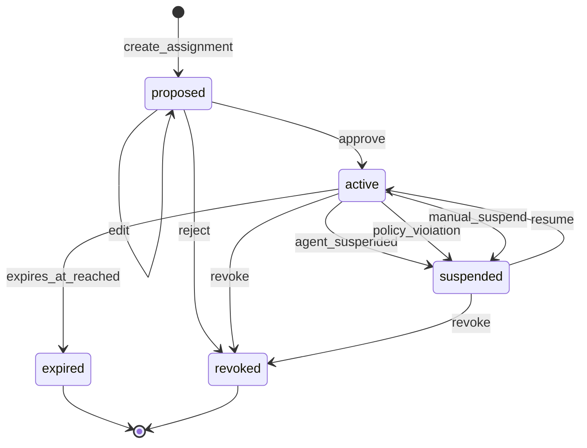

| `retired` | The template is no longer functional. New assignments SHALL be rejected. Existing assignments MAY be force-migrated to a replacement template or allowed to expire naturally, depending on organizational policy. |

**Transition rules:**
- A template in `draft` MAY transition to `published` when it passes validation and review.
- A `published` template MAY transition to `deprecated` when a newer version or replacement is available.
- A `deprecated` template MAY transition to `retired` after a configurable grace period (default: 90 days).
- A `deprecated` template MAY transition back to `published` via `undeprecate` if the deprecation was in error.
- A `retired` template SHALL NOT transition to any other state.
- Template state changes SHALL trigger events that assignment management systems MAY observe.

**Version semantics within lifecycle:**
- Templates in `draft` state MAY be versioned as `0.x.y` (pre-release).
- Published templates MUST use semantic versioning (`major.minor.patch`).
- A breaking change to a published template SHALL create a new `major` version.
- A backward-compatible addition SHALL create a new `minor` version.
- A bug fix SHALL create a new `patch` version.

### 6.2 RoleAssignment Lifecycle

RoleAssignments have a five-state lifecycle that is independent of but influenced by the RoleTemplate lifecycle.

**State definitions and transitions** (detailed in §4.4) are summarized here for lifecycle completeness:

| State | Entered Via | Exited Via |
|---|---|---|
| `proposed` | Assignment creation | `approve` → `active`; `reject` → `revoked` |
| `active` | Approval of proposed; resumption of suspended | `suspend` → `suspended`; `revoke` → `revoked`; `expire` → `expired` |
| `suspended` | Agent lifecycle change; policy violation; manual action | `resume` → `active`; `revoke` → `revoked` |
| `revoked` | Explicit revocation; rejection of proposed | Terminal |
| `expired` | `expires_at` reached | Terminal |

**Lifecycle integration with agent state (AESP-0001):**

| Agent State | Effect on Assignments |
|---|---|
| `initializing` | No assignments. Agent is being set up. |
| `active` | Assignments MAY be created, activated, and used. |
| `suspended` | All active assignments SHALL transition to `suspended`. |
| `terminating` | All active assignments SHALL transition to `suspended`, then `revoked` on termination completion. |
| `terminated` | No active assignments. All assignments are `revoked` or `expired`. |
| `degraded` | Assignments remain active but SHOULD be monitored for performance impact. |
| `recovering` | Suspended assignments MAY be eligible for resumption. |
| `quarantined` | All active assignments SHALL transition to `suspended` pending investigation. |

### 6.3 Version Migration

When a RoleTemplate is updated, existing RoleAssignments continue to function with the version they were created against (ADR-2, version pinning). New assignments use the latest published version unless explicitly pinned.

**Version pinning rules:**
- Each RoleAssignment SHALL record the exact `template_version` at creation time.
- The system SHALL resolve permissions using the pinned version, not the latest version.
- An assignment MAY be migrated to a newer template version through an explicit migration operation.

**Migration workflow:**
1. The system identifies assignments referencing a template version that has been deprecated or superseded.
2. A migration plan is created mapping old assignments to new template versions.
3. For each assignment, the system recomputes `effective_permissions` using the new template version.
4. If the new effective permissions differ from the old, the migration is flagged for review.
5. Upon approval (automatic or manual), the assignment's `template_version` is updated and `effective_permissions` are refreshed.

**Breaking change handling.** When a template's `major` version increments (indicating a breaking change):
- Existing assignments SHALL NOT be automatically migrated.
- The system SHOULD notify assignment administrators of the breaking change.
- Assignments MAY be manually migrated after review and testing.
- After a configurable grace period, deprecated versions MAY be blocked for new assignments.

### 6.4 Phase-Based Assignment

Work units progress through phases: `planning` → `execution` → `review` → `closure`. RoleAssignments MAY be bound to specific phases, enabling automatic role transitions as work progresses (ADR-8).

**Phase affinity.** Each RoleTemplate MAY declare `phase_affinity` — a list of work unit phases for which the role is most appropriate:

| Role Template | Phase Affinity |
|---|---|
| `role.coord.strategist` | `planning` |
| `role.exec.architect` | `planning` |
| `role.exec.researcher` | `planning` |
| `role.exec.executor` | `execution` |
| `role.exec.specialist` | `execution` |
| `role.qual.evaluator` | `review` |
| `role.qual.auditor` | `review` |
| `role.qual.guardian` | `closure` |
| `role.coord.orchestrator` | `all` |
| `role.coord.facilitator` | `all` |

**Phase binding behavior:**
- An assignment with `phase_binding.phase = P` and `auto_transition = true` SHALL be automatically `suspended` when the work unit transitions to a phase not in the role's `phase_affinity`.
- When the work unit returns to a phase in the role's affinity, the assignment SHALL automatically resume to `active`.
- An assignment with `phase_binding.auto_transition = false` SHALL NOT be automatically suspended or resumed; its status is managed independently of work unit phase.
- An assignment without `phase_binding` (value `null`) is phase-agnostic and remains `active` regardless of work unit phase.

**Phase transition trigger.** When a work unit's phase changes, the system SHALL:
1. Identify all assignments in the work unit's scope.
2. For each assignment with `phase_binding` and `auto_transition = true`:
   - If the new phase is in the template's `phase_affinity` (or the affinity is `"all"`), resume to `active`.
   - Otherwise, suspend the assignment.
3. Log all automatic transitions for audit purposes.

### 6.5 Role Rotation

Role rotation is the practice of periodically reassigning roles among agents to prevent capability stagnation, reduce single points of failure, and distribute knowledge.

**Rotation patterns:**

| Pattern | Description | Applicable Roles |
|---|---|---|
| **Time-based rotation** | Roles rotate on a fixed schedule (e.g., weekly, per sprint). | Execution, Quality |
| **Task-based rotation** | Roles rotate after task completion. | Execution |
| **Round-robin** | Roles cycle through eligible agents in order. | Coordination, Bridge |
| **Skill-based rotation** | Roles rotate to agents with the highest matching capability score. | All |
| **Break-glass rotation** | Elevated roles rotate to different agents each incident. | Emergency elevation |

**Rotation constraints.** The system SHALL enforce the following during rotation:
- A rotation SHALL NOT leave a work unit without required roles (respect `min_per_workunit` constraints).
- A rotation SHALL NOT create role conflicts (§4.8).
- A rotation SHOULD maintain at least one role holder active at all times (no gaps).
- Rotated-out assignments SHOULD be transitioned to `expired` (not `revoked`) to preserve audit history.

**Rotation workflow:**
1. The system identifies candidates for rotation based on the rotation pattern and schedule.
2. For each role to rotate, the system selects a replacement agent from the eligible pool.