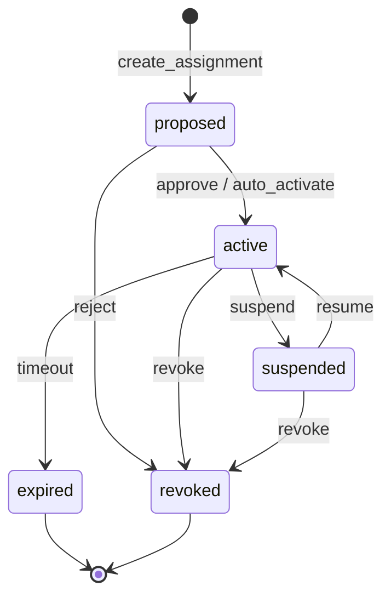

# AESP-0002: Agent Roles — Sections 4–6

> **AESP Number:** 0002 | **Title:** Agent Roles | **Status:** Draft  
> **Depends On:** AESP-0001 (Foundation) | **Leads To:** AESP-0003 (Workflow & Handoffs), AESP-0007 (Security & Governance)

---

## 4. Role Assignments

### 4.1 Definition and Purpose

A **RoleAssignment** is the contextual binding of a RoleTemplate to an Agent within a specific scope. While a RoleTemplate defines *what* a role is — its permissions, constraints, and composition rules — a RoleAssignment defines *who* has that role, *where* it applies, and *for how long*.

RoleAssignments serve as the bridge between the static role definition layer and the dynamic runtime authorization layer. Each assignment pins a specific version of a RoleTemplate, resolves that template's permissions through the RBAC+ pipeline defined in Section 5, and produces a set of **effective permissions** that the agent may exercise within the assignment's scope.

The dual-level model (ADR-1) separates concerns: RoleTemplate authors design reusable role blueprints, while assignment administrators bind those blueprints to agents in context. An agent MUST NOT exercise role-derived permissions without a corresponding active RoleAssignment. The system MUST evaluate permission requests against an agent's active assignments in the requesting scope.

### 4.2 Field Specification

A RoleAssignment SHALL contain the following fields:

| Field | Type | Required | Description |
|---|---|---|---|
| `id` | UUID string | yes | Unique assignment identifier. Format: `ra-{uuid}`. |
| `template_id` | string | yes | Reference to a published RoleTemplate by its `id`. |
| `template_version` | semver | yes | The exact template version pinned at assignment creation. |
| `agent_id` | URN | yes | Reference to the Agent (per AESP-0001) that holds this role. Format: `urn:aeo:agent:{agent_id}`. |
| `scope` | Scope object | yes | The namespace in which this assignment is valid (see §4.3). |
| `granted_permissions` | Permission[] | yes | The raw permissions from the template, before RBAC+ resolution. |
| `effective_permissions` | EffectivePermission[] | yes | The fully resolved permissions produced by the RBAC+ pipeline (see §5). |
| `status` | enum | yes | Current lifecycle state: `proposed`, `active`, `suspended`, `revoked`, or `expired` (see §4.4). |
| `assumed_at` | timestamp | yes | The point in time when the assignment entered the `active` state. |
| `expires_at` | timestamp \| null | no | Auto-expiration time. A value of `null` indicates the assignment does not expire. |
| `trust_policy` | TrustPolicyRef \| null | no | If the assignment was created via dynamic assumption, a reference to the TrustPolicy that authorized it (see §4.6). |
| `elevated_via` | string \| null | no | If the assignment represents an elevated session, the session or approval identifier that authorized it. |
| `phase_binding` | PhaseBinding \| null | no | If the assignment is bound to a specific work unit phase, the phase constraint (see §6.4). |
| `metadata` | object | no | Extensible metadata including assignment reason, assigner identity, and audit fields. |

**Scope Sub-entity:**

| Field | Type | Description |
|---|---|---|
| `type` | enum | Either `"organization"` or `"workunit"`. |
| `id` | URN | The organization or work unit identifier. |

**TrustPolicyRef Sub-entity:**

| Field | Type | Description |
|---|---|---|
| `policy_id` | string | The TrustPolicy identifier. |
| `assumed_at` | timestamp | When the dynamic assumption occurred. |
| `session_id` | string | The RoleSession identifier for this assumption. |

**PhaseBinding Sub-entity:**

| Field | Type | Description |
|---|---|---|
| `phase` | enum | The work unit phase: `"planning"`, `"execution"`, `"review"`, or `"closure"`. |
| `auto_transition` | boolean | Whether the assignment status SHOULD transition automatically when the work unit phase changes. |

**Example — RoleAssignment (Organization-Scoped):**

```json
{
  "id": "ra-uuid-1234",
  "template_id": "role.exec.executor",
  "template_version": "1.0.0",
  "agent_id": "urn:aeo:agent:builder-001",
  "scope": { "type": "organization", "id": "urn:aeo:org:team-alpha" },
  "granted_permissions": [
    { "action": "workunit:execute", "resource": "organization:{org_id}:workunits", "effect": "allow" }
  ],
  "effective_permissions": [
    {
      "permission": { "action": "workunit:execute", "resource": "organization:team-alpha:workunits", "effect": "allow" },
      "provenance": ["template:role.exec.executor:v1.0.0", "scope_resolution"]
    }
  ],
  "status": "active",
  "assumed_at": "2024-01-15T10:00:00Z",
  "expires_at": null,
  "trust_policy": null,
  "elevated_via": null,
  "phase_binding": null,
  "metadata": {
    "assigned_by": "urn:aeo:agent:coordinator-001",
    "assignment_reason": "crew_composition_auto",
    "ares_score": 0.85
  }
}
```

### 4.3 Assignment Scope

Every RoleAssignment MUST be scoped to exactly one namespace. The scope determines where the assignment's effective permissions are valid. Two scope types exist:

**Organization-scoped assignments.** When `scope.type` is `"organization"`, the assignment's effective permissions apply across all work units within that organization. Organization-scoped assignments are appropriate for:
- Roles that require cross-workunit visibility (e.g., Orchestrator, Auditor).
- Agents that participate in multiple work units simultaneously.
- Governance and oversight roles.

**Workunit-scoped assignments.** When `scope.type` is `"workunit"`, the assignment's effective permissions apply only within the specified work unit. Workunit-scoped assignments are appropriate for:
- Delivery-aligned roles (e.g., Executor, Guardian).
- Roles with tightly constrained resource access.
- Situations where the principle of least privilege applies.

**Scope resolution rules:**
- An agent with an organization-scoped assignment to role R has the effective permissions of R in every work unit within that organization.
- An agent with a workunit-scoped assignment to role R has the effective permissions of R only in the specified work unit.
- Permission resolution SHALL filter out permissions whose resource references fall outside the assignment scope (see §5.6, Step 6).
- Cross-scope permission leakage SHALL NOT occur. An assignment in scope A MUST NOT grant permissions in scope B unless a ReBAC relationship tuple explicitly authorizes cross-scope access (see §5.4).

### 4.4 Assignment Lifecycle States

A RoleAssignment progresses through a well-defined lifecycle. The system MUST enforce valid transitions between states.



**State definitions:**

| State | Description |
|---|---|
| `proposed` | The assignment has been created but is not yet active. Effective permissions are computed but not enforced. The assignment MAY require approval before activation. |
| `active` | The assignment is in effect. The agent MAY exercise the effective permissions within the assignment scope. |
| `suspended` | The assignment is temporarily inactive. The agent MUST NOT exercise the assignment's permissions. The suspension MAY be triggered by agent lifecycle changes, policy violations, or manual administrative action. |
| `revoked` | The assignment has been permanently terminated. The agent MUST NOT exercise the assignment's permissions. Revocation is final and irreversible. |
| `expired` | The assignment reached its `expires_at` timestamp without renewal. The agent MUST NOT exercise the assignment's permissions. Expired assignments MAY be renewed by creating a new assignment. |

**Transition rules:**
