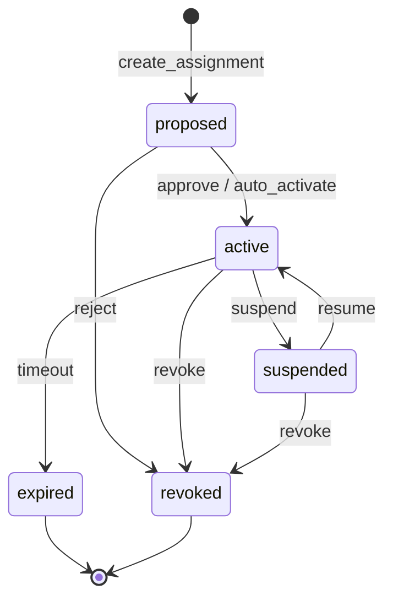
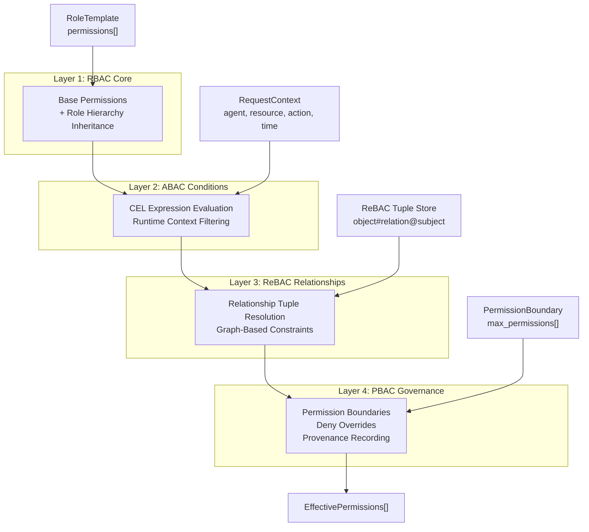
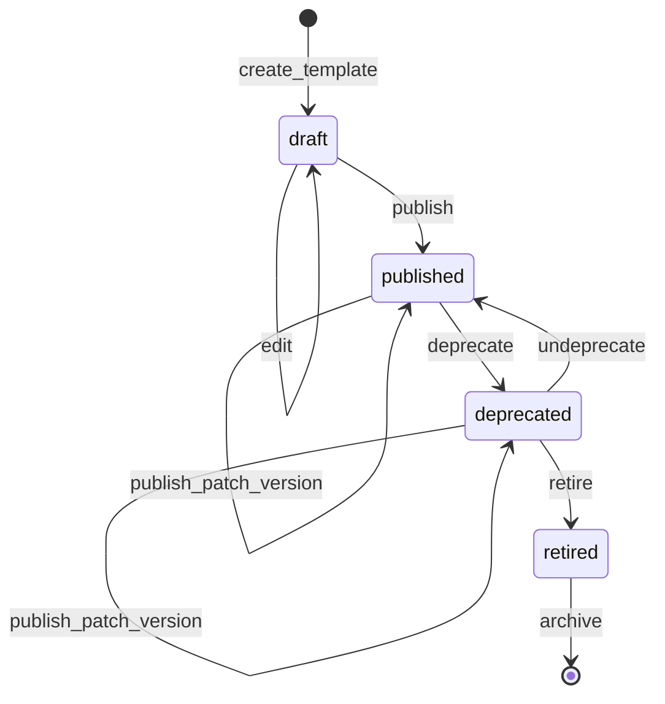
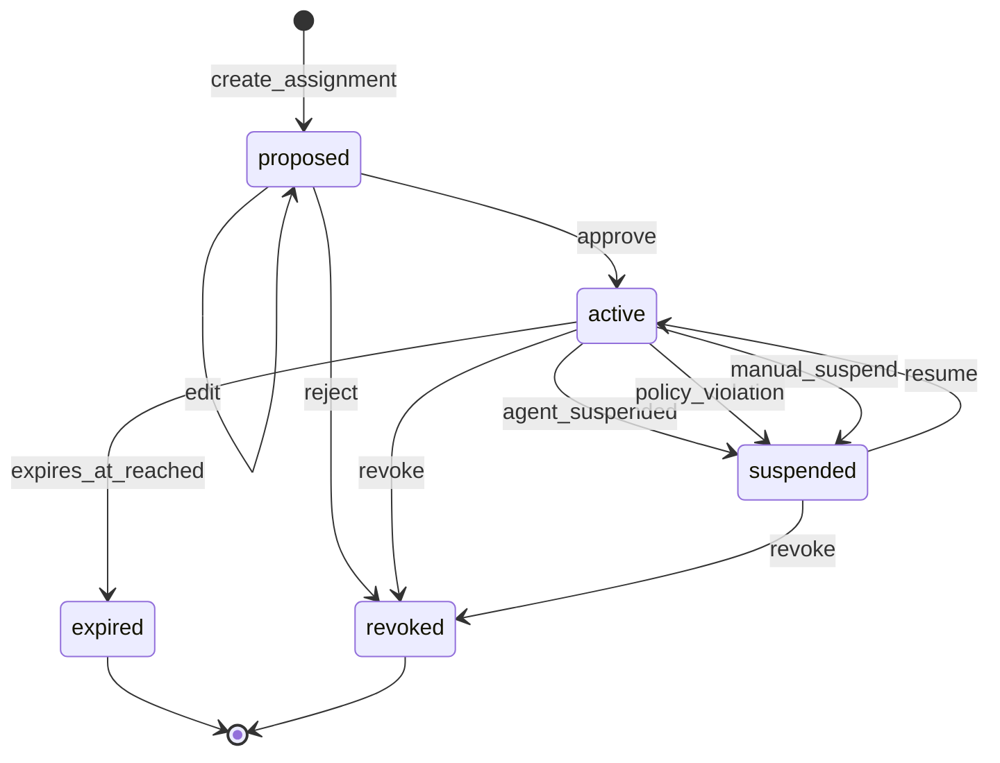

# AESP-0002: Agent Roles — Sections 4–6

> **AESP Number:** 0002 | **Title:** Agent Roles | **Status:** Draft  
> **Depends On:** AESP-0001 (Foundation) | **Leads To:** AESP-0003 (Workflow & Handoffs), AESP-0007 (Security & Governance)

---

## 4. Role Assignments

### 4.1 Definition and Purpose

A **RoleAssignment** is the contextual binding of a RoleTemplate to an Agent within a specific scope. While a RoleTemplate defines *what* a role is — its permissions, constraints, and composition rules — a RoleAssignment defines *who* has that role, *where* it applies, and *for how long*.

RoleAssignments serve as the bridge between the static role definition layer and the dynamic runtime authorization layer. Each assignment pins a specific version of a RoleTemplate, resolves that template's permissions through the RBAC+ pipeline defined in Section 5, and produces a set of **effective permissions** that the agent may exercise within the assignment's scope.

The dual-level model (ADR-1) separates concerns: RoleTemplate authors design reusable role blueprints, while assignment administrators bind those blueprints to agents in context. An agent MUST NOT exercise role-derived permissions without a corresponding active RoleAssignment. The system MUST evaluate permission requests against an agent's active assignments in the requesting scope.

### 4.2 Field Specification

A RoleAssignment SHALL contain the following fields:

| Field | Type | Required | Description |
|---|---|---|---|
| `id` | UUID string | yes | Unique assignment identifier. Format: `ra-{uuid}`. |
| `template_id` | string | yes | Reference to a published RoleTemplate by its `id`. |
| `template_version` | semver | yes | The exact template version pinned at assignment creation. |
| `agent_id` | URN | yes | Reference to the Agent (per AESP-0001) that holds this role. Format: `urn:aeo:agent:{agent_id}`. |
| `scope` | Scope object | yes | The namespace in which this assignment is valid (see §4.3). |
| `granted_permissions` | Permission[] | yes | The raw permissions from the template, before RBAC+ resolution. |
| `effective_permissions` | EffectivePermission[] | yes | The fully resolved permissions produced by the RBAC+ pipeline (see §5). |
| `status` | enum | yes | Current lifecycle state: `proposed`, `active`, `suspended`, `revoked`, or `expired` (see §4.4). |
| `assumed_at` | timestamp | yes | The point in time when the assignment entered the `active` state. |
| `expires_at` | timestamp \| null | no | Auto-expiration time. A value of `null` indicates the assignment does not expire. |
| `trust_policy` | TrustPolicyRef \| null | no | If the assignment was created via dynamic assumption, a reference to the TrustPolicy that authorized it (see §4.6). |
| `elevated_via` | string \| null | no | If the assignment represents an elevated session, the session or approval identifier that authorized it. |
| `phase_binding` | PhaseBinding \| null | no | If the assignment is bound to a specific work unit phase, the phase constraint (see §6.4). |
| `metadata` | object | no | Extensible metadata including assignment reason, assigner identity, and audit fields. |

**Scope Sub-entity:**

| Field | Type | Description |
|---|---|---|
| `type` | enum | Either `"organization"` or `"workunit"`. |
| `id` | URN | The organization or work unit identifier. |

**TrustPolicyRef Sub-entity:**

| Field | Type | Description |
|---|---|---|
| `policy_id` | string | The TrustPolicy identifier. |
| `assumed_at` | timestamp | When the dynamic assumption occurred. |
| `session_id` | string | The RoleSession identifier for this assumption. |

**PhaseBinding Sub-entity:**

| Field | Type | Description |
|---|---|---|
| `phase` | enum | The work unit phase: `"planning"`, `"execution"`, `"review"`, or `"closure"`. |
| `auto_transition` | boolean | Whether the assignment status SHOULD transition automatically when the work unit phase changes. |

**Example — RoleAssignment (Organization-Scoped):**

```json
{
  "id": "ra-uuid-1234",
  "template_id": "role.exec.executor",
  "template_version": "1.0.0",
  "agent_id": "urn:aeo:agent:builder-001",
  "scope": { "type": "organization", "id": "urn:aeo:org:team-alpha" },
  "granted_permissions": [
    { "action": "workunit:execute", "resource": "organization:{org_id}:workunits", "effect": "allow" }
  ],
  "effective_permissions": [
    {
      "permission": { "action": "workunit:execute", "resource": "organization:team-alpha:workunits", "effect": "allow" },
      "provenance": ["template:role.exec.executor:v1.0.0", "scope_resolution"]
    }
  ],
  "status": "active",
  "assumed_at": "2024-01-15T10:00:00Z",
  "expires_at": null,
  "trust_policy": null,
  "elevated_via": null,
  "phase_binding": null,
  "metadata": {
    "assigned_by": "urn:aeo:agent:coordinator-001",
    "assignment_reason": "crew_composition_auto",
    "ares_score": 0.85
  }
}
```

### 4.3 Assignment Scope

Every RoleAssignment MUST be scoped to exactly one namespace. The scope determines where the assignment's effective permissions are valid. Two scope types exist:

**Organization-scoped assignments.** When `scope.type` is `"organization"`, the assignment's effective permissions apply across all work units within that organization. Organization-scoped assignments are appropriate for:
- Roles that require cross-workunit visibility (e.g., Orchestrator, Auditor).
- Agents that participate in multiple work units simultaneously.
- Governance and oversight roles.

**Workunit-scoped assignments.** When `scope.type` is `"workunit"`, the assignment's effective permissions apply only within the specified work unit. Workunit-scoped assignments are appropriate for:
- Delivery-aligned roles (e.g., Executor, Guardian).
- Roles with tightly constrained resource access.
- Situations where the principle of least privilege applies.

**Scope resolution rules:**
- An agent with an organization-scoped assignment to role R has the effective permissions of R in every work unit within that organization.
- An agent with a workunit-scoped assignment to role R has the effective permissions of R only in the specified work unit.
- Permission resolution SHALL filter out permissions whose resource references fall outside the assignment scope (see §5.6, Step 6).
- Cross-scope permission leakage SHALL NOT occur. An assignment in scope A MUST NOT grant permissions in scope B unless a ReBAC relationship tuple explicitly authorizes cross-scope access (see §5.4).

### 4.4 Assignment Lifecycle States

A RoleAssignment progresses through a well-defined lifecycle. The system MUST enforce valid transitions between states.



**State definitions:**

| State | Description |
|---|---|
| `proposed` | The assignment has been created but is not yet active. Effective permissions are computed but not enforced. The assignment MAY require approval before activation. |
| `active` | The assignment is in effect. The agent MAY exercise the effective permissions within the assignment scope. |
| `suspended` | The assignment is temporarily inactive. The agent MUST NOT exercise the assignment's permissions. The suspension MAY be triggered by agent lifecycle changes, policy violations, or manual administrative action. |
| `revoked` | The assignment has been permanently terminated. The agent MUST NOT exercise the assignment's permissions. Revocation is final and irreversible. |
| `expired` | The assignment reached its `expires_at` timestamp without renewal. The agent MUST NOT exercise the assignment's permissions. Expired assignments MAY be renewed by creating a new assignment. |

**Transition rules:**
- A proposed assignment SHALL transition to `active` when all approval requirements are satisfied or when no approval is required.
- An `active` assignment SHALL transition to `suspended` when its associated agent enters the `suspended` or `terminating` state per AESP-0001.
- An `active` assignment SHALL transition to `expired` when the current time exceeds `expires_at` (if set).
- A `suspended` assignment MAY transition back to `active` when the suspension cause is resolved.
- A `revoked` assignment SHALL NOT transition to any other state.
- An `expired` assignment SHALL NOT transition to any other state; a new assignment MUST be created for continued authorization.

### 4.5 Time-Bounded Assignments

RoleAssignments MAY have a finite lifetime. The `expires_at` field defines the point after which the assignment automatically transitions to the `expired` state.

**Session management.** When an assignment has an `expires_at` value, the system SHALL:
- Monitor the expiration timestamp.
- Transition the assignment to `expired` when `expires_at` is reached.
- Revoke all active RoleSessions associated with the assignment.
- Log the expiration event for audit purposes.

**Renewal.** An active time-bounded assignment MAY be renewed before expiration. Renewal updates `expires_at` to a future timestamp and logs the renewal event. The assignment retains its `active` state through renewal.

**Early expiration.** An assignment MAY be manually expired before its `expires_at` timestamp by transitioning it to `revoked`. This is functionally equivalent to revocation.

**Example — Time-Bounded Assignment:**

```json
{
  "id": "ra-uuid-5678",
  "template_id": "role.coord.strategist",
  "template_version": "1.2.0",
  "agent_id": "urn:aeo:agent:planner-003",
  "scope": { "type": "workunit", "id": "urn:aeo:wu:sprint-42" },
  "granted_permissions": [],
  "effective_permissions": [],
  "status": "active",
  "assumed_at": "2024-06-01T09:00:00Z",
  "expires_at": "2024-06-30T17:00:00Z",
  "trust_policy": null,
  "phase_binding": { "phase": "planning", "auto_transition": true },
  "metadata": { "assigned_by": "system:auto" }
}
```

### 4.6 Dynamic Role Assumption via TrustPolicy

RoleAssignments MAY be created dynamically through the TrustPolicy mechanism (ADR-6). TrustPolicies enable **just-in-time (JIT) role elevation**: an agent without a standing assignment to a role MAY assume that role temporarily if it satisfies the conditions defined in a TrustPolicy attached to the role's template.

**TrustPolicy entity.** A TrustPolicy defines the rules for dynamic role assumption:

| Field | Type | Required | Description |
|---|---|---|---|
| `id` | string | yes | Unique trust policy identifier. Format: `tp.{cat}.{name}`. |
| `name` | string | yes | Human-readable policy name. |
| `role_template_id` | string | yes | The RoleTemplate this policy governs. |
| `trusted_agents` | AgentMatcher[] | yes | Patterns matching agents that MAY assume the role. |
| `conditions` | Condition | no | CEL expression that MUST evaluate to `true` for assumption to proceed. |
| `duration` | Duration | yes | Maximum session length after assumption. |
| `require_approval` | ApprovalRequirement | no | If approval is required, defines the approver and timeout. |
| `metadata` | object | no | Policy purpose, audit info. |

**AgentMatcher Sub-entity:**

| Field | Type | Description |
|---|---|---|
| `type` | enum | `"pattern"`, `"explicit"`, or `"role_holder"`. |
| `match` | string | The matching criteria. For `"pattern"`, a CEL expression against agent attributes. For `"explicit"`, a specific agent URN. For `"role_holder"`, a role template ID. |

**ApprovalRequirement Sub-entity:**

| Field | Type | Description |
|---|---|---|
| `approver_role` | string | The RoleTemplate ID of agents that may approve the assumption. |
| `timeout_seconds` | integer | Maximum time to wait for approval. |
| `auto_deny_on_timeout` | boolean | If `true`, the assumption is denied when the timeout expires. |

**Dynamic assumption workflow:**

When an agent requests to dynamically assume a role, the system SHALL execute the following steps:

1. **Identify matching TrustPolicies.** Find all TrustPolicies where `role_template_id` matches the requested role and where the requesting agent matches at least one entry in `trusted_agents`.
2. **Evaluate conditions.** For each matching policy, evaluate the CEL expression in `conditions.cel_expression` against the current request context. Only policies whose conditions evaluate to `true` are eligible.
3. **Require approval (if configured).** If `require_approval` is set, create an approval workflow and wait for an agent holding the `approver_role` to approve or deny. If `auto_deny_on_timeout` is `true` and the timeout expires, deny the assumption.
4. **Create RoleSession.** On approval (or if no approval is required), create a RoleSession with:
   - `started_at` = current time
   - `expires_at` = current time + `duration.max_seconds`
   - `status` = `"active"`
   - `context` referencing the TrustPolicy and approval (if any)
5. **Create RoleAssignment.** Create a transient RoleAssignment bound to the RoleSession with:
   - `status` = `"active"`
   - `trust_policy` populated with the TrustPolicy reference
   - `elevated_via` = the session or approval identifier
   - `expires_at` = the session expiration time

**Example — TrustPolicy:**

```json
{
  "id": "tp.exec.elevated",
  "name": "Executor Emergency Elevation",
  "role_template_id": "role.exec.executor",
  "trusted_agents": [
    { "type": "pattern", "match": "agent.trust_level >= 0.8" }
  ],
  "conditions": {
    "cel_expression": "time.of_day >= '09:00' && time.of_day <= '17:00' || incident.severity == 'critical'",
    "required_context": ["time.of_day", "incident.severity"]
  },
  "duration": { "max_seconds": 3600, "extendable": false },
  "require_approval": {
    "approver_role": "role.coord.orchestrator",
    "timeout_seconds": 300,
    "auto_deny_on_timeout": true
  },
  "metadata": { "purpose": "incident_response_break_glass" }
}
```

**Example — RoleSession:**

```json
{
  "id": "rs-uuid-9012",
  "assignment_id": "ra-uuid-7890",
  "started_at": "2024-01-15T14:00:00Z",
  "expires_at": "2024-01-15T15:00:00Z",
  "context": {
    "workunit_id": "wu-alpha-001",
    "trigger": "trust_policy_assumption",
    "trust_policy_id": "tp.exec.elevated",
    "approval_id": "approval-uuid-3456"
  },
  "status": "active",
  "metadata": {
    "session_token_hash": "sha256:abc123..."
  }
}
```

**Session validity.** A RoleSession SHALL be considered valid only when ALL of the following hold:
- The parent RoleAssignment is in the `active` state.
- The current time is within the interval `[started_at, expires_at]`.
- The session has not been explicitly revoked.

When a session expires or is revoked, the system SHALL transition the parent RoleAssignment to `expired` or `revoked` respectively.

**Assumption chaining depth.** Dynamic role assumption via TrustPolicy SHALL have a maximum chaining depth of 1. A TrustPolicy MAY only grant the directly referenced role template. An agent that dynamically assumes role R MUST NOT use that assumption as the basis for further dynamic assumptions. This constraint prevents privilege escalation chains.

### 4.7 Multiple Assignments

An agent MAY hold multiple RoleAssignments simultaneously. This is a core feature enabling the matrix role model (ADR-3): an agent can hold one role per dimension (delivery, capability, community, system) without conflict.

**Simultaneous assignment rules:**
- An agent MAY hold any number of assignments across different dimensions simultaneously.
- An agent MAY hold multiple assignments to the same RoleTemplate if each assignment has a different scope.
- An agent MUST NOT hold more than one active assignment to the same RoleTemplate in the same scope.
- When evaluating permissions for an action, the system SHALL consider the union of effective permissions from all active assignments in the requesting scope.
- If assignments grant conflicting permissions (same action and resource with different effects), deny wins (see §5.6, Step 8).

**Assignment set for an agent.** The effective authorization state of an agent in a given scope is the union of all active assignments in that scope. Formally:

```
agent_effective_permissions(agent, scope) =
    ⋃ { assignment.effective_permissions
        | assignment.agent_id = agent.id
        ∧ assignment.scope = scope
        ∧ assignment.status = "active" }
```

### 4.8 Assignment Conflict Detection

Certain RoleTemplates declare mutual exclusion through their `composition_rules.conflicts_with` field. The system MUST enforce these conflict constraints at the assignment level.

**Conflict rules:**
- If RoleTemplate A lists RoleTemplate B in `conflicts_with`, then no agent MAY hold active assignments to both A and B in the same scope.
- Conflict detection SHALL be evaluated when an assignment is created and when an assignment transitions to `active`.
- If creating or activating an assignment would create a conflict, the operation SHALL be rejected with a conflict error.
- Conflicts are scope-local. An agent MAY hold conflicting roles in different scopes.
- An agent MAY hold conflicting roles across different dimensions if the conflicting templates' composition rules permit coexistence across dimensions.

**Conflict detection algorithm:**

```
function detect_conflict(new_assignment):
    agent_assignments = get_active_assignments(new_assignment.agent_id, new_assignment.scope)
    new_template = load_template(new_assignment.template_id)

    for existing in agent_assignments:
        existing_template = load_template(existing.template_id)

        # Direct conflict: new template conflicts with existing
        if existing_template.id in new_template.composition_rules.conflicts_with:
            return CONFLICT(new_template.id, existing_template.id)

        # Reverse conflict: existing template conflicts with new
        if new_template.id in existing_template.composition_rules.conflicts_with:
            return CONFLICT(existing_template.id, new_template.id)

    return NO_CONFLICT
```

**Requirement enforcement.** If RoleTemplate A lists RoleTemplate B in `composition_rules.requires`, an assignment to A in a scope SHALL activate only if at least one active assignment to B exists in the same scope. The system MUST verify requirement satisfaction when an assignment transitions to `active`.

---

## 5. Permission Model (RBAC+)

### 5.1 RBAC+ Architecture Overview

AESP-0002 defines **RBAC+**, a four-layer permission architecture (ADR-2) that extends classical Role-Based Access Control with Attribute-Based conditions (ABAC), Relationship-Based constraints (ReBAC), and Policy-Based governance (PBAC). Each layer processes permissions in sequence, with each subsequent layer able to restrict but not expand beyond the previous layer.



**Layer processing invariant.** The permission set at layer N SHALL be a subset (or equal set) of the permission set at layer N-1. No layer MAY add permissions that were not present in a previous layer. The only exception is the RBAC Core layer, which may expand permissions through role hierarchy inheritance.

**Deny-by-default.** If a permission is not explicitly granted and not denied by any layer, the default effect SHALL be `"deny"`. An agent MUST be able to present at least one active assignment that grants the requested permission for access to be authorized.

### 5.2 RBAC Core — Base Permissions and Role Hierarchy

The RBAC Core layer is the foundation of the permission model. It defines the base permission set for each RoleTemplate and propagates permissions through the template inheritance hierarchy.

**Permission format.** Each permission is an object with the following fields:

| Field | Type | Required | Description |
|---|---|---|---|
| `action` | string | yes | The action being permitted or denied. Format: `{resource_type}:{operation}` (e.g., `workunit:execute`). |
| `resource` | string | yes | The resource pattern. Uses colon-separated path notation with `*` as single-segment wildcard and `**` as multi-segment wildcard (e.g., `organization:org-001:workunits:**`). |
| `effect` | enum | yes | Either `"allow"` or `"deny"`. |
| `condition` | string \| null | no | A CEL expression evaluated at the ABAC layer (see §5.3). |
| `relationship_constraint` | ReBACConstraint \| null | no | A ReBAC relationship constraint evaluated at the ReBAC layer (see §5.4). |

**Role hierarchy inheritance.** RoleTemplates MAY specify a `parent_template_id` to inherit from another template. The inheritance rules are:
- A child template inherits all permissions from its parent.
- The inheritance graph SHALL be a Directed Acyclic Graph (DAG).
- The maximum inheritance depth SHALL NOT exceed 3 levels (template → parent → grandparent).
- Child permissions override parent permissions for the same `(action, resource)` pair.
- Inherited permissions are collected at the RBAC Core layer before subsequent layers process them.

**Example — RBAC Core Permission:**

```json
{
  "action": "workunit:execute",
  "resource": "organization:{org_id}:workunits:*",
  "effect": "allow",
  "condition": null,
  "relationship_constraint": null
}
```

### 5.3 ABAC Conditions — CEL Expression Format

The ABAC layer filters permissions based on runtime context using Common Expression Language (CEL) expressions. Each permission MAY include a `condition` field containing a CEL expression string.

**Available context variables.** CEL expressions in conditions MAY reference the following variables:

| Variable | Type | Description |
|---|---|---|
| `agent.id` | string | The requesting agent's URN. |
| `agent.trust_level` | float | The agent's trust score (0.0 to 1.0). |
| `agent.capabilities` | string[] | The agent's declared capabilities. |
| `agent.roles` | string[] | The role template IDs the agent holds in the current scope. |
| `time.now` | timestamp | The current time (UTC). |
| `time.of_day` | string | The current time formatted as `"HH:MM"` in 24-hour notation. |
| `time.day_of_week` | string | The current day: `"monday"` through `"sunday"`. |
| `resource.id` | string | The resource being accessed. |
| `resource.type` | string | The resource type. |
| `resource.owner` | string | The URN of the resource's owner. |
| `request.action` | string | The action being requested. |
| `request.scope` | object | The scope of the current request. |
| `incident.severity` | string | The severity level of any active incident (for break-glass scenarios). |

**Condition evaluation.** For each permission with a non-null `condition`:
- The system SHALL evaluate the CEL expression against the current request context.
- If the expression evaluates to `true`, the permission passes the ABAC layer.
- If the expression evaluates to `false`, the permission SHALL be filtered out (not passed to subsequent layers).
- If the expression evaluation fails (e.g., missing required context variable), the permission SHALL be treated as `"deny"` and filtered out.

Permissions without a `condition` (or with `condition: null`) SHALL pass the ABAC layer unconditionally.

**Example — ABAC Condition:**

```json
{
  "action": "workunit:deploy",
  "resource": "organization:{org_id}:workunits:*",
  "effect": "allow",
  "condition": "time.of_day >= '09:00' && time.of_day <= '17:00' && agent.trust_level >= 0.7",
  "relationship_constraint": null
}
```

This permission allows deployment only during business hours and only for agents with a trust level of 0.7 or higher.

### 5.4 ReBAC Relationships — Tuple Format and Resolution

The ReBAC layer filters permissions based on relationship tuples stored in a relation graph. This enables relationship-aware access control (e.g., "allow access to resources owned by the agent" or "allow access if the agent is a member of the resource's team").

**Relationship tuple format.** ReBAC tuples use a JSON-based representation inspired by Zanzibar:

```json
{
  "object": "{resource_type}:{resource_id}",
  "relation": "{relation_name}",
  "subject": "{subject_type}:{subject_id}"
}
```

Examples:
- `{"object": "workunit:wu-001", "relation": "owner", "subject": "agent:builder-001"}` — Agent `builder-001` owns work unit `wu-001`.
- `{"object": "organization:team-alpha", "relation": "member", "subject": "agent:reviewer-002"}` — Agent `reviewer-002` is a member of `team-alpha`.
- `{"object": "task:task-123", "relation": "delegate", "subject": "agent:builder-001"}` — Agent `builder-001` has been delegated access to task `task-123`.

**ReBACConstraint format.** A permission's `relationship_constraint` field references a relationship tuple pattern:

| Field | Type | Description |
|---|---|---|
| `object` | string | The resource object pattern. May use placeholders like `{resource.id}`. |
| `relation` | string | The relationship name that must exist. |
| `subject` | string | The subject pattern. May use `{agent.id}` to reference the requesting agent. |

**Relationship resolution.** For each permission with a non-null `relationship_constraint`:
- The system SHALL query the ReBAC tuple store for a tuple matching the constraint pattern.
- If a matching tuple exists, the permission passes the ReBAC layer.
- If no matching tuple exists, the permission SHALL be filtered out.
- If the ReBAC store is unavailable, the permission SHALL be treated as `"deny"` (fail-closed).

**Common ReBAC patterns:**

| Pattern | Constraint | Purpose |
|---|---|---|
| Ownership | `{"object": "{resource.id}", "relation": "owner", "subject": "{agent.id}"}` | Agent can access resources it owns. |
| Membership | `{"object": "{resource.org}", "relation": "member", "subject": "{agent.id}"}` | Agent can access resources in organizations it belongs to. |
| Delegation | `{"object": "{resource.id}", "relation": "delegate", "subject": "{agent.id}"}` | Agent can access resources delegated to it. |
| Created By | `{"object": "{resource.id}", "relation": "creator", "subject": "{agent.id}"}` | Agent can access resources it created. |

**Example — ReBAC Permission:**

```json
{
  "action": "task:modify",
  "resource": "workunit:{wu_id}:tasks:*",
  "effect": "allow",
  "condition": null,
  "relationship_constraint": {
    "object": "{resource.id}",
    "relation": "owner",
    "subject": "{agent.id}"
  }
}
```

### 5.5 PBAC Governance — Permission Boundaries

The PBAC layer applies governance constraints through PermissionBoundaries (ADR-7). A PermissionBoundary defines a maximum permission ceiling: an agent's effective permissions SHALL NOT exceed the boundary's `max_permissions`, regardless of what role assignments grant.

**PermissionBoundary entity:**

| Field | Type | Required | Description |
|---|---|---|---|
| `id` | string | yes | Unique boundary identifier. |
| `name` | string | yes | Human-readable boundary name. |
| `max_permissions` | Permission[] | yes | The permission ceiling. The agent's effective permissions are bounded by the intersection with this set. |
| `scope` | Scope | yes | Where the boundary applies. |
| `priority` | integer | yes | Evaluation priority. Lower values are evaluated first. |
| `metadata` | object | no | Timestamps, audit info. |

**Example — PermissionBoundary:**

```json
{
  "id": "pb-default-org",
  "name": "Default Organization Boundary",
  "max_permissions": [
    { "action": "*", "resource": "organization:org-001:*", "effect": "allow" },
    { "action": "organization:delete", "resource": "organization:org-001", "effect": "deny" }
  ],
  "scope": { "type": "organization", "id": "org-001" },
  "priority": 100
}
```

**Effective boundary computation.** An agent's effective permission boundary is the intersection of all applicable boundaries:

1. The boundary attached directly to the agent (if any).
2. The boundary attached to the agent's organization (if any).
3. The boundary attached to the current work unit (if any).
4. The system default boundary (always present).

The intersection is computed pair-wise using the `intersect_boundaries` operation. Changes to any boundary propagate immediately to the effective boundary.

**Boundary intersection rules:**

| Operation | Behavior |
|---|---|
| `intersect_permissions(granted, boundary)` | Result contains only permissions where `(action, resource)` exists in BOTH sets, with the more restrictive condition. |
| `intersect_boundaries(b1, b2)` | Result is a new boundary whose `max_permissions` = `intersect_permissions(b1.max_permissions, b2.max_permissions)`. |
| Wildcard handling | `"task:*"` intersected with `"task:execute"` yields `"task:execute"`. `"*:*"` intersected with `"task:execute"` yields `"task:execute"`. |
| Deny propagation | A `"deny"` entry in either set for a given `(action, resource)` results in `"deny"` in the intersection. |

### 5.6 Permission Resolution Algorithm

This section specifies the complete permission resolution algorithm that transforms a RoleTemplate's base permissions into the final EffectivePermission set. Implementations MUST produce results equivalent to this algorithm.

**Input:**
- `assignment`: A RoleAssignment object.
- `context`: A RequestContext containing the current request's agent, resource, action, time, and relationship data.

**Output:**
- `EffectivePermission[]`: The final resolved permission set with provenance metadata.

```python
def resolve_effective_permissions(assignment, context):
    """
    Resolve effective permissions for a role assignment in a given context.
    Processes all four RBAC+ layers in sequence.

    Parameters:
        assignment: RoleAssignment object
        context: RequestContext (agent, resource, action, time, relationships)

    Returns:
        EffectivePermission[] -- the final permission set
    """

    # ── Step 1: Collect template permissions ──────────────────────────
    template = load_template(assignment.template_id, assignment.template_version)
    permissions = copy(template.permissions)
    provenance = [f"template:{template.id}:v{template.version}"]

    # ── Step 2: Apply role hierarchy (inherit parent permissions) ─────
    parent = load_template(template.parent_template_id)
    depth = 0
    MAX_HIERARCHY_DEPTH = 3

    while parent and depth < MAX_HIERARCHY_DEPTH:
        permissions.extend(copy(parent.permissions))
        provenance.append(f"template:{parent.id}:v{parent.version}")
        parent_id = parent.parent_template_id
        parent = load_template(parent_id) if parent_id else None
        depth += 1

    # ── Step 3: Deduplicate ───────────────────────────────────────────
    # Child overrides parent for same (action, resource) pair.
    # Preserve the most specific (deepest in hierarchy) permission.
    deduped = {}
    for perm in permissions:
        key = (perm.action, perm.resource)
        deduped[key] = perm  # Later entries override earlier ones
    permissions = list(deduped.values())

    # ── Step 4: Evaluate ABAC conditions ──────────────────────────────
    abac_permissions = []
    for perm in permissions:
        if perm.condition is not None:
            result = evaluate_cel(perm.condition, context)
            if result is True:
                abac_permissions.append(perm)
            # If False or evaluation error: filter out (fail-closed)
        else:
            abac_permissions.append(perm)

    # ── Step 5: Apply ReBAC relationship constraints ──────────────────
    rebac_permissions = []
    for perm in abac_permissions:
        if perm.relationship_constraint is not None:
            resolved_constraint = resolve_placeholders(
                perm.relationship_constraint, context
            )
            if check_relationship_tuple(resolved_constraint):
                rebac_permissions.append(perm)
            # If no matching tuple: filter out (fail-closed)
        else:
            rebac_permissions.append(perm)

    # ── Step 6: Apply scope restriction ───────────────────────────────
    scoped_permissions = [
        p for p in rebac_permissions
        if resource_in_scope(p.resource, assignment.scope)
    ]
    if len(scoped_permissions) < len(rebac_permissions):
        provenance.append("scope_resolution")

    # ── Step 7: Apply permission boundaries (ceiling) ─────────────────
    boundary = resolve_effective_boundary(assignment.agent_id, assignment.scope)
    bounded_permissions = intersect_permissions(
        scoped_permissions, boundary.max_permissions
    )
    provenance.append(f"boundary:{boundary.id}")

    # ── Step 8: Resolve deny/allow conflicts (deny wins) ──────────────
    final_permissions_map = {}
    for perm in bounded_permissions:
        key = (perm.action, perm.resource)
        if key not in final_permissions_map:
            final_permissions_map[key] = perm
        elif perm.effect == "deny":
            final_permissions_map[key] = perm  # Deny overrides allow
    final_permissions = list(final_permissions_map.values())

    # ── Step 9: Record provenance ─────────────────────────────────────
    result = []
    for perm in final_permissions:
        ep = EffectivePermission(
            permission=perm,
            provenance=list(provenance),
            resolved_at=now_utc()
        )
        result.append(ep)

    return result


def resolve_effective_boundary(agent_id, scope):
    """
    Compute the effective permission boundary by intersecting
    all applicable boundaries (agent, organization, workunit, system default).
    """
    boundaries = []

    # System default boundary (always present, lowest priority)
    boundaries.append(load_system_default_boundary())

    # Organization-level boundary
    org_boundary = load_boundary(organization_id=scope.get('organization_id'))
    if org_boundary:
        boundaries.append(org_boundary)

    # Workunit-level boundary
    if scope.type == "workunit":
        wu_boundary = load_boundary(workunit_id=scope.id)
        if wu_boundary:
            boundaries.append(wu_boundary)

    # Agent-level boundary (highest priority)
    agent_boundary = load_boundary(agent_id=agent_id)
    if agent_boundary:
        boundaries.append(agent_boundary)

    # Intersect all boundaries: start with most restrictive (highest priority)
    # and intersect with progressively broader boundaries.
    boundaries.sort(key=lambda b: b.priority)
    effective = boundaries[0]
    for b in boundaries[1:]:
        effective = intersect_boundaries(effective, b)

    return effective


def intersect_permissions(granted, ceiling):
    """
    Return permissions that exist in both granted and ceiling sets.
    A deny in either set for a given (action, resource) produces deny.
    """
    ceiling_map = {}
    for p in ceiling:
        key = (p.action, p.resource)
        ceiling_map[key] = p.effect

    result = []
    for p in granted:
        key = (p.action, p.resource)
        if key in ceiling_map:
            if ceiling_map[key] == "deny" or p.effect == "deny":
                # Deny propagation
                result.append(Permission(
                    action=p.action,
                    resource=p.resource,
                    effect="deny",
                    condition=p.condition,
                    relationship_constraint=p.relationship_constraint
                ))
            else:
                result.append(p)
        # If key not in ceiling: permission is not allowed
    return result


def intersect_boundaries(b1, b2):
    """Intersect two PermissionBoundary objects."""
    max_perms = intersect_permissions(b1.max_permissions, b2.max_permissions)
    return PermissionBoundary(
        id=f"intersection:{b1.id}:{b2.id}",
        name=f"Intersection of {b1.name} and {b2.name}",
        max_permissions=max_perms,
        scope=b1.scope,  # Narrower scope wins
        priority=min(b1.priority, b2.priority)
    )


def resolve_conflicts(permissions):
    """
    Deny wins over allow for the same (action, resource) pair.
    Returns the deduplicated permission set.
    """
    result = {}
    for perm in permissions:
        key = (perm.action, perm.resource)
        if key not in result:
            result[key] = perm
        elif perm.effect == "deny":
            result[key] = perm
    return list(result.values())
```

### 5.7 EffectivePermission Format

The output of the permission resolution algorithm is a list of EffectivePermission objects. Each EffectivePermission combines the resolved permission with metadata tracing its origin through the RBAC+ pipeline.

| Field | Type | Description |
|---|---|---|
| `permission` | Permission | The fully resolved permission (action, resource, effect, condition, relationship_constraint). |
| `provenance` | string[] | Ordered list of pipeline steps that contributed to this permission (e.g., `["template:role.exec.executor:v1.0.0", "template:role.exec.base:v1.0.0", "scope_resolution", "boundary:pb-default-org"]`). |
| `resolved_at` | timestamp | The time when this effective permission was computed. |

**Example — EffectivePermission:**

```json
{
  "permission": {
    "action": "workunit:execute",
    "resource": "organization:team-alpha:workunits:*",
    "effect": "allow",
    "condition": null,
    "relationship_constraint": null
  },
  "provenance": [
    "template:role.exec.executor:v1.0.0",
    "template:role.exec.base:v1.0.0",
    "scope_resolution",
    "boundary:pb-default-org"
  ],
  "resolved_at": "2024-01-15T10:00:00Z"
}
```

---

## 6. Role Lifecycle

### 6.1 RoleTemplate Lifecycle

RoleTemplates progress through a four-state lifecycle that governs their availability for assignment.



**State definitions:**

| State | Description |
|---|---|
| `draft` | The template is under development. It MAY be edited freely. Draft templates SHALL NOT be used in new RoleAssignments. Draft templates are visible only to their authors and authorized reviewers. |
| `published` | The template is available for assignment. Published templates are immutable; any change creates a new version. New RoleAssignments MAY reference published templates. |
| `deprecated` | The template is still functional but SHOULD NOT be used for new assignments. Existing assignments continue to operate. Deprecated templates SHOULD include a `deprecation_notice` in metadata recommending a replacement template. |
| `retired` | The template is no longer functional. New assignments SHALL be rejected. Existing assignments MAY be force-migrated to a replacement template or allowed to expire naturally, depending on organizational policy. |

**Transition rules:**
- A template in `draft` MAY transition to `published` when it passes validation and review.
- A `published` template MAY transition to `deprecated` when a newer version or replacement is available.
- A `deprecated` template MAY transition to `retired` after a configurable grace period (default: 90 days).
- A `deprecated` template MAY transition back to `published` via `undeprecate` if the deprecation was in error.
- A `retired` template SHALL NOT transition to any other state.
- Template state changes SHALL trigger events that assignment management systems MAY observe.

**Version semantics within lifecycle:**
- Templates in `draft` state MAY be versioned as `0.x.y` (pre-release).
- Published templates MUST use semantic versioning (`major.minor.patch`).
- A breaking change to a published template SHALL create a new `major` version.
- A backward-compatible addition SHALL create a new `minor` version.
- A bug fix SHALL create a new `patch` version.

### 6.2 RoleAssignment Lifecycle

RoleAssignments have a five-state lifecycle that is independent of but influenced by the RoleTemplate lifecycle.



**State definitions and transitions** (detailed in §4.4) are summarized here for lifecycle completeness:

| State | Entered Via | Exited Via |
|---|---|---|
| `proposed` | Assignment creation | `approve` → `active`; `reject` → `revoked` |
| `active` | Approval of proposed; resumption of suspended | `suspend` → `suspended`; `revoke` → `revoked`; `expire` → `expired` |
| `suspended` | Agent lifecycle change; policy violation; manual action | `resume` → `active`; `revoke` → `revoked` |
| `revoked` | Explicit revocation; rejection of proposed | Terminal |
| `expired` | `expires_at` reached | Terminal |

**Lifecycle integration with agent state (AESP-0001):**

| Agent State | Effect on Assignments |
|---|---|
| `initializing` | No assignments. Agent is being set up. |
| `active` | Assignments MAY be created, activated, and used. |
| `suspended` | All active assignments SHALL transition to `suspended`. |
| `terminating` | All active assignments SHALL transition to `suspended`, then `revoked` on termination completion. |
| `terminated` | No active assignments. All assignments are `revoked` or `expired`. |
| `degraded` | Assignments remain active but SHOULD be monitored for performance impact. |
| `recovering` | Suspended assignments MAY be eligible for resumption. |
| `quarantined` | All active assignments SHALL transition to `suspended` pending investigation. |

### 6.3 Version Migration

When a RoleTemplate is updated, existing RoleAssignments continue to function with the version they were created against (ADR-2, version pinning). New assignments use the latest published version unless explicitly pinned.

**Version pinning rules:**
- Each RoleAssignment SHALL record the exact `template_version` at creation time.
- The system SHALL resolve permissions using the pinned version, not the latest version.
- An assignment MAY be migrated to a newer template version through an explicit migration operation.

**Migration workflow:**
1. The system identifies assignments referencing a template version that has been deprecated or superseded.
2. A migration plan is created mapping old assignments to new template versions.
3. For each assignment, the system recomputes `effective_permissions` using the new template version.
4. If the new effective permissions differ from the old, the migration is flagged for review.
5. Upon approval (automatic or manual), the assignment's `template_version` is updated and `effective_permissions` are refreshed.

**Breaking change handling.** When a template's `major` version increments (indicating a breaking change):
- Existing assignments SHALL NOT be automatically migrated.
- The system SHOULD notify assignment administrators of the breaking change.
- Assignments MAY be manually migrated after review and testing.
- After a configurable grace period, deprecated versions MAY be blocked for new assignments.

### 6.4 Phase-Based Assignment

Work units progress through phases: `planning` → `execution` → `review` → `closure`. RoleAssignments MAY be bound to specific phases, enabling automatic role transitions as work progresses (ADR-8).

**Phase affinity.** Each RoleTemplate MAY declare `phase_affinity` — a list of work unit phases for which the role is most appropriate:

| Role Template | Phase Affinity |
|---|---|
| `role.coord.strategist` | `planning` |
| `role.exec.architect` | `planning` |
| `role.exec.researcher` | `planning` |
| `role.exec.executor` | `execution` |
| `role.exec.specialist` | `execution` |
| `role.qual.evaluator` | `review` |
| `role.qual.auditor` | `review` |
| `role.qual.guardian` | `closure` |
| `role.coord.orchestrator` | `all` |
| `role.coord.facilitator` | `all` |

**Phase binding behavior:**
- An assignment with `phase_binding.phase = P` and `auto_transition = true` SHALL be automatically `suspended` when the work unit transitions to a phase not in the role's `phase_affinity`.
- When the work unit returns to a phase in the role's affinity, the assignment SHALL automatically resume to `active`.
- An assignment with `phase_binding.auto_transition = false` SHALL NOT be automatically suspended or resumed; its status is managed independently of work unit phase.
- An assignment without `phase_binding` (value `null`) is phase-agnostic and remains `active` regardless of work unit phase.

**Phase transition trigger.** When a work unit's phase changes, the system SHALL:
1. Identify all assignments in the work unit's scope.
2. For each assignment with `phase_binding` and `auto_transition = true`:
   - If the new phase is in the template's `phase_affinity` (or the affinity is `"all"`), resume to `active`.
   - Otherwise, suspend the assignment.
3. Log all automatic transitions for audit purposes.

### 6.5 Role Rotation

Role rotation is the practice of periodically reassigning roles among agents to prevent capability stagnation, reduce single points of failure, and distribute knowledge.

**Rotation patterns:**

| Pattern | Description | Applicable Roles |
|---|---|---|
| **Time-based rotation** | Roles rotate on a fixed schedule (e.g., weekly, per sprint). | Execution, Quality |
| **Task-based rotation** | Roles rotate after task completion. | Execution |
| **Round-robin** | Roles cycle through eligible agents in order. | Coordination, Bridge |
| **Skill-based rotation** | Roles rotate to agents with the highest matching capability score. | All |
| **Break-glass rotation** | Elevated roles rotate to different agents each incident. | Emergency elevation |

**Rotation constraints.** The system SHALL enforce the following during rotation:
- A rotation SHALL NOT leave a work unit without required roles (respect `min_per_workunit` constraints).
- A rotation SHALL NOT create role conflicts (§4.8).
- A rotation SHOULD maintain at least one role holder active at all times (no gaps).
- Rotated-out assignments SHOULD be transitioned to `expired` (not `revoked`) to preserve audit history.

**Rotation workflow:**
1. The system identifies candidates for rotation based on the rotation pattern and schedule.
2. For each role to rotate, the system selects a replacement agent from the eligible pool.
