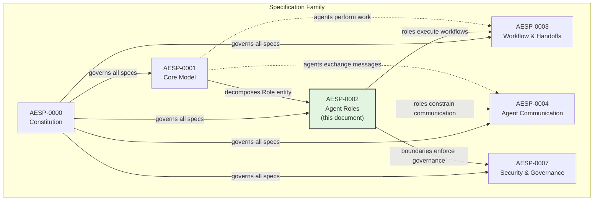

# AESP-0002: Agent Roles

**Status:** Draft  
**Depends On:** [AESP-0001 — Core Model](AESP-0001.md)  
**Leads To:** AESP-0003 (Workflow & Handoffs), AESP-0004 (Agent Communication), AESP-0007 (Security & Governance)  
**Published:** 2025-01  

---

## Section 1: Introduction

### 1.1 Purpose and Scope

This document, Autonomous Engineering Specification Protocol 0002 (AESP-0002), defines the role system for autonomous agents operating within an Autonomous Engineering Organization (AEO) ecosystem. It specifies the data models, permission architectures, composition rules, and lifecycle semantics that govern what agents can do, who decides what they may do, and how their capabilities are bounded, assigned, and audited.

AESP-0002 addresses the following functional areas:

- **Role definition** — the canonical description of roles available within an AEO, expressed as reusable, versioned **Role Templates**.
- **Role assignment** — the binding of a Role Template to a specific agent within a specific organizational scope, expressed as **Role Assignments**.
- **Permission modeling** — the architecture by which roles are translated into effective permissions, specified as **RBAC+** (Role-Based Access Control with Attribute-Based, Relationship-Based, and Policy-Based extensions).
- **Permission boundaries** — the maximum permission ceiling that constrains an agent regardless of role assignments, expressed as **Permission Boundaries**.
- **Trust and dynamic assumption** — the rules by which an agent may temporarily assume a role beyond its standing assignments, expressed as **Trust Policies** and **Role Sessions**.
- **Lifecycle management** — the state transitions that templates, assignments, and sessions undergo from creation through retirement.

AESP-0002 does NOT specify:

- The mechanics of agent-to-agent communication (see AESP-0004).
- The structure of work units or task decomposition (see AESP-0003).
- The cryptographic protocols for securing role tokens (see AESP-0007).
- The algorithm for automatic crew composition optimization (identified as future work in Section 14).

### 1.2 Relationship to AESP-0001

AESP-0001 defined the foundational `Role` entity as a monolithic record containing `id`, `name`, `description`, `parent_role_id`, `permissions[]`, `resource_quotas[]`, `approval_matrix`, and `metadata`. This entity conflated the static definition of a role (what it is and what it can do) with the dynamic binding of that role to an agent (who has it, in what context, and for how long).

AESP-0002 decomposes this monolithic Role into a dual-level model comprising **RoleTemplate** (the static definition half) and **RoleAssignment** (the dynamic binding half). This decomposition is recorded as [ADR-1: Dual-Level Model](#adr-1-dual-level-model). The mapping from AESP-0001 to AESP-0002 is as follows:

| AESP-0001 Construct | AESP-0002 Equivalent | Notes |
|---|---|---|
| `Role` entity | `RoleTemplate` | Static definition half |
| (implied binding) | `RoleAssignment` | Dynamic binding half, now explicit |
| `parent_role_id` | Template inheritance hierarchy | Preserved within `RoleTemplate`; max depth reduced from 3 to 2 levels |
| `permissions[]` | RBAC+ permission resolution pipeline | Expanded with ABAC conditions, ReBAC constraints, PBAC governance |
| `resource_quotas[]` | `PermissionBoundary` | Elevated to first-class entity |
| `approval_matrix` | `TrustPolicy` | Expanded for dynamic role assumption |

**Backward-compatibility rule:** Any valid AESP-0001 Role MUST be representable as a RoleTemplate with a corresponding default RoleAssignment. The converse is not required — AESP-0002 constructs MAY exceed the expressiveness of AESP-0001.

The following diagram situates AESP-0002 within the specification family:

### 1.3 Terminology and Definitions

This section defines terms used throughout AESP-0002. Terms from AESP-0001 are included by reference where applicable.

#### 1.3.1 Core Terms

**Role Template**
> A reusable, versioned blueprint that defines what a role is: its name, description, permissions, required capabilities, composition rules, and organizational dimension. Role Templates are immutable once published; changes produce new versions. See Section 3.

**Role Assignment**
> A contextual binding that links a Role Template (at a specific version) to an Agent within a scope (organization or workunit), with a status, time bounds, and fully resolved effective permissions. See Section 4.

**RBAC+**
> The layered permission architecture adopted by AESP-0002. RBAC+ extends classic Role-Based Access Control (RBAC) with three additional layers: Attribute-Based conditions (ABAC), Relationship-Based constraints (ReBAC), and Policy-Based governance (PBAC). See Section 2.2.

**Permission Boundary**
> A maximum permission ceiling that constrains the effective permissions of an agent. Boundaries are applied at multiple levels (agent, organization, workunit) and their intersection forms the effective ceiling. An agent's resolved role permissions can NEVER exceed its effective permission boundary. See Section 5.

**Trust Policy**
> A set of rules attached to a Role Template that governs which agents may dynamically assume that role, under what conditions, for how long, and whether approval is required. Trust Policies enable just-in-time (JIT) permission elevation without permanent assignment. See Section 6.

**Role Session**
> A time-bounded, auditable record of an agent actively using a role. A Role Session is created when an agent assumes a role via a Trust Policy and is valid only for the duration specified by that policy. See Section 6.

#### 1.3.2 Organizational Terms

**Namespace**
> The organizational scope within which a Role Assignment is valid. A namespace MUST be either an `organization_id` (role applies across the entire organization) or a `workunit_id` (role applies within a single work unit). See [ADR-5: Namespace-Scoped Roles](#adr-5-namespace-scoped-roles).

**Matrix Dimension**
> One of four independent organizational axes along which a Role Template is aligned: `delivery`, `capability`, `community`, or `system`. The dimension system enables agents to hold roles along multiple axes simultaneously without conflict. See Section 2.5 and [ADR-3: Matrix Role Dimensions](#adr-3-matrix-role-dimensions).

#### 1.3.3 Lifecycle Terms

**Template Lifecycle**
> The state progression of a Role Template through `draft → published → deprecated → retired`. Templates MUST be in the `published` state before they can be referenced by Role Assignments. See Section 6.

**Assignment Lifecycle**
> The state progression of a Role Assignment through `proposed → active → suspended → revoked → expired`. Only `active` assignments grant effective permissions. See Section 4.

#### 1.3.4 Abbreviations

| Abbreviation | Expansion |
|---|---|
| RBAC | Role-Based Access Control |
| ABAC | Attribute-Based Access Control |
| ReBAC | Relationship-Based Access Control |
| PBAC | Policy-Based Access Control |
| CEL | Common Expression Language |
| ARES | Agent Role Enrichment Score |
| JIT | Just-In-Time |
| DAG | Directed Acyclic Graph |
| UUID | Universally Unique Identifier |
| semver | Semantic Versioning (MAJOR.MINOR.PATCH) |

### 1.4 Conformance Criteria

The key words "MUST", "MUST NOT", "REQUIRED", "SHALL", "SHALL NOT", "SHOULD", "SHOULD NOT", "RECOMMENDED", "MAY", and "OPTIONAL" in this document are to be interpreted as described in [RFC 2119](https://tools.ietf.org/html/rfc2119).

An implementation conforms to AESP-0002 if and only if it satisfies all of the following criteria:

1. **Role Template Support:** The implementation MUST support the creation, retrieval, versioning, and lifecycle management of Role Templates as specified in Section 3.

2. **Role Assignment Support:** The implementation MUST support the creation, scoping, and lifecycle management of Role Assignments as specified in Section 4.
