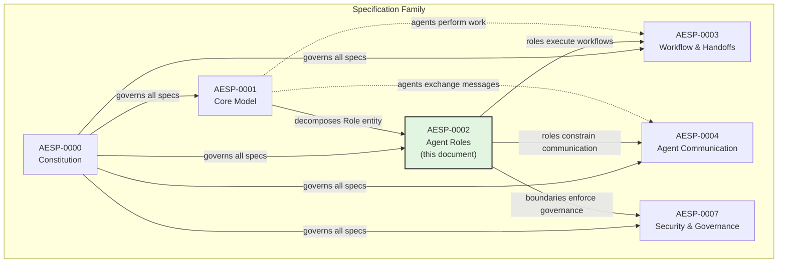
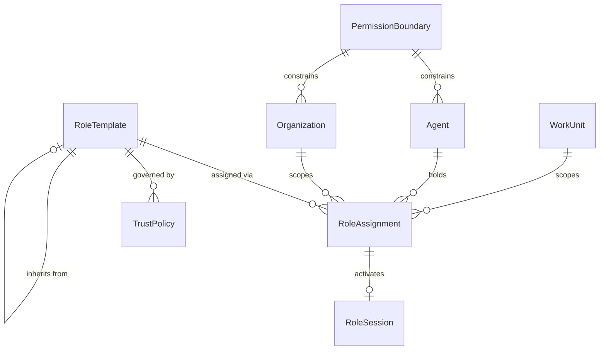
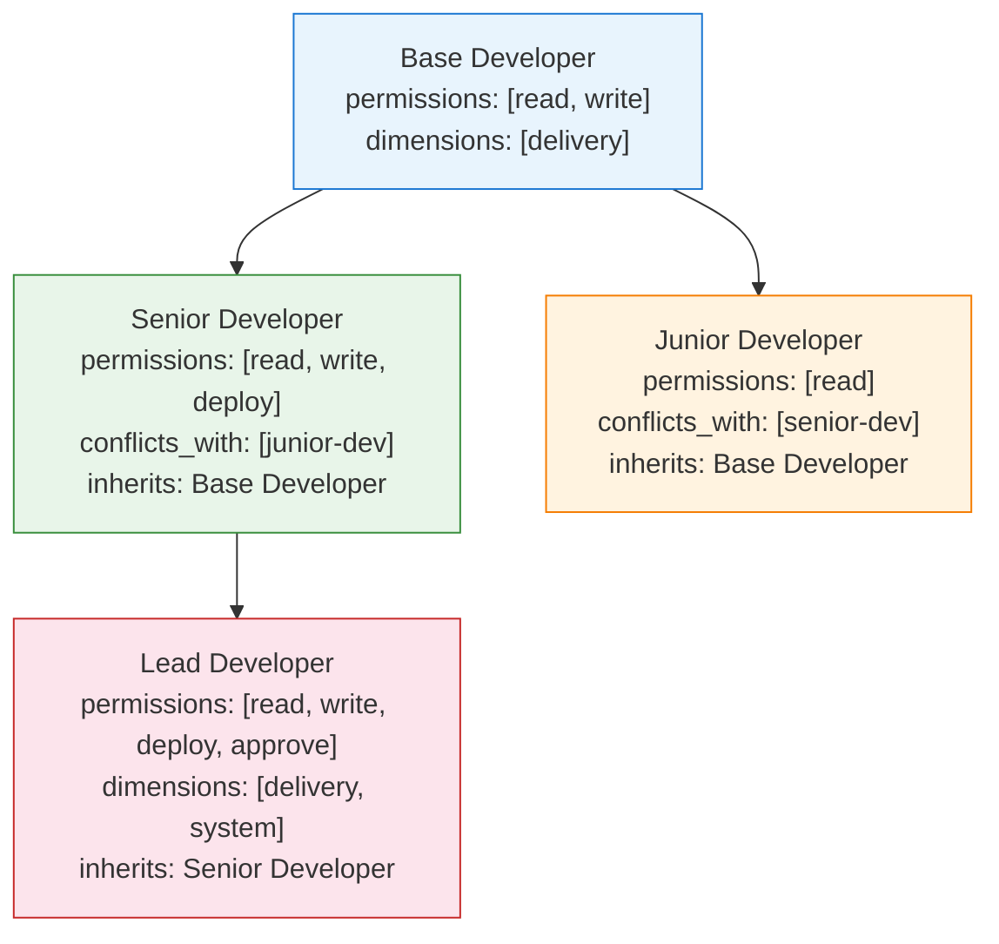

# AESP-0002: Agent Roles

**Status:** Draft  
**Depends On:** [AESP-0001 — Core Model](AESP-0001.md)  
**Leads To:** AESP-0003 (Workflow & Handoffs), AESP-0004 (Agent Communication), AESP-0007 (Security & Governance)  
**Published:** 2025-01  

---

## Section 1: Introduction

### 1.1 Purpose and Scope

This document, Autonomous Engineering Specification Protocol 0002 (AESP-0002), defines the role system for autonomous agents operating within an Autonomous Engineering Organization (AEO) ecosystem. It specifies the data models, permission architectures, composition rules, and lifecycle semantics that govern what agents can do, who decides what they may do, and how their capabilities are bounded, assigned, and audited.

AESP-0002 addresses the following functional areas:

- **Role definition** — the canonical description of roles available within an AEO, expressed as reusable, versioned **Role Templates**.
- **Role assignment** — the binding of a Role Template to a specific agent within a specific organizational scope, expressed as **Role Assignments**.
- **Permission modeling** — the architecture by which roles are translated into effective permissions, specified as **RBAC+** (Role-Based Access Control with Attribute-Based, Relationship-Based, and Policy-Based extensions).
- **Permission boundaries** — the maximum permission ceiling that constrains an agent regardless of role assignments, expressed as **Permission Boundaries**.
- **Trust and dynamic assumption** — the rules by which an agent may temporarily assume a role beyond its standing assignments, expressed as **Trust Policies** and **Role Sessions**.
- **Lifecycle management** — the state transitions that templates, assignments, and sessions undergo from creation through retirement.

AESP-0002 does NOT specify:

- The mechanics of agent-to-agent communication (see AESP-0004).
- The structure of work units or task decomposition (see AESP-0003).
- The cryptographic protocols for securing role tokens (see AESP-0007).
- The algorithm for automatic crew composition optimization (identified as future work in Section 14).

### 1.2 Relationship to AESP-0001

AESP-0001 defined the foundational `Role` entity as a monolithic record containing `id`, `name`, `description`, `parent_role_id`, `permissions[]`, `resource_quotas[]`, `approval_matrix`, and `metadata`. This entity conflated the static definition of a role (what it is and what it can do) with the dynamic binding of that role to an agent (who has it, in what context, and for how long).

AESP-0002 decomposes this monolithic Role into a dual-level model comprising **RoleTemplate** (the static definition half) and **RoleAssignment** (the dynamic binding half). This decomposition is recorded as [ADR-1: Dual-Level Model](#adr-1-dual-level-model). The mapping from AESP-0001 to AESP-0002 is as follows:

| AESP-0001 Construct | AESP-0002 Equivalent | Notes |
|---|---|---|
| `Role` entity | `RoleTemplate` | Static definition half |
| (implied binding) | `RoleAssignment` | Dynamic binding half, now explicit |
| `parent_role_id` | Template inheritance hierarchy | Preserved within `RoleTemplate`; max depth reduced from 3 to 2 levels |
| `permissions[]` | RBAC+ permission resolution pipeline | Expanded with ABAC conditions, ReBAC constraints, PBAC governance |
| `resource_quotas[]` | `PermissionBoundary` | Elevated to first-class entity |
| `approval_matrix` | `TrustPolicy` | Expanded for dynamic role assumption |

**Backward-compatibility rule:** Any valid AESP-0001 Role MUST be representable as a RoleTemplate with a corresponding default RoleAssignment. The converse is not required — AESP-0002 constructs MAY exceed the expressiveness of AESP-0001.

The following diagram situates AESP-0002 within the specification family:



### 1.3 Terminology and Definitions

This section defines terms used throughout AESP-0002. Terms from AESP-0001 are included by reference where applicable.

#### 1.3.1 Core Terms

**Role Template**
> A reusable, versioned blueprint that defines what a role is: its name, description, permissions, required capabilities, composition rules, and organizational dimension. Role Templates are immutable once published; changes produce new versions. See Section 3.

**Role Assignment**
> A contextual binding that links a Role Template (at a specific version) to an Agent within a scope (organization or workunit), with a status, time bounds, and fully resolved effective permissions. See Section 4.

**RBAC+**
> The layered permission architecture adopted by AESP-0002. RBAC+ extends classic Role-Based Access Control (RBAC) with three additional layers: Attribute-Based conditions (ABAC), Relationship-Based constraints (ReBAC), and Policy-Based governance (PBAC). See Section 2.2.

**Permission Boundary**
> A maximum permission ceiling that constrains the effective permissions of an agent. Boundaries are applied at multiple levels (agent, organization, workunit) and their intersection forms the effective ceiling. An agent's resolved role permissions can NEVER exceed its effective permission boundary. See Section 5.

**Trust Policy**
> A set of rules attached to a Role Template that governs which agents may dynamically assume that role, under what conditions, for how long, and whether approval is required. Trust Policies enable just-in-time (JIT) permission elevation without permanent assignment. See Section 6.

**Role Session**
> A time-bounded, auditable record of an agent actively using a role. A Role Session is created when an agent assumes a role via a Trust Policy and is valid only for the duration specified by that policy. See Section 6.

#### 1.3.2 Organizational Terms

**Namespace**
> The organizational scope within which a Role Assignment is valid. A namespace MUST be either an `organization_id` (role applies across the entire organization) or a `workunit_id` (role applies within a single work unit). See [ADR-5: Namespace-Scoped Roles](#adr-5-namespace-scoped-roles).

**Matrix Dimension**
> One of four independent organizational axes along which a Role Template is aligned: `delivery`, `capability`, `community`, or `system`. The dimension system enables agents to hold roles along multiple axes simultaneously without conflict. See Section 2.5 and [ADR-3: Matrix Role Dimensions](#adr-3-matrix-role-dimensions).

#### 1.3.3 Lifecycle Terms

**Template Lifecycle**
> The state progression of a Role Template through `draft → published → deprecated → retired`. Templates MUST be in the `published` state before they can be referenced by Role Assignments. See Section 6.

**Assignment Lifecycle**
> The state progression of a Role Assignment through `proposed → active → suspended → revoked → expired`. Only `active` assignments grant effective permissions. See Section 4.

#### 1.3.4 Abbreviations

| Abbreviation | Expansion |
|---|---|
| RBAC | Role-Based Access Control |
| ABAC | Attribute-Based Access Control |
| ReBAC | Relationship-Based Access Control |
| PBAC | Policy-Based Access Control |
| CEL | Common Expression Language |
| ARES | Agent Role Enrichment Score |
| JIT | Just-In-Time |
| DAG | Directed Acyclic Graph |
| UUID | Universally Unique Identifier |
| semver | Semantic Versioning (MAJOR.MINOR.PATCH) |

### 1.4 Conformance Criteria

The key words "MUST", "MUST NOT", "REQUIRED", "SHALL", "SHALL NOT", "SHOULD", "SHOULD NOT", "RECOMMENDED", "MAY", and "OPTIONAL" in this document are to be interpreted as described in [RFC 2119](https://tools.ietf.org/html/rfc2119).

An implementation conforms to AESP-0002 if and only if it satisfies all of the following criteria:

1. **Role Template Support:** The implementation MUST support the creation, retrieval, versioning, and lifecycle management of Role Templates as specified in Section 3.

2. **Role Assignment Support:** The implementation MUST support the creation, scoping, and lifecycle management of Role Assignments as specified in Section 4.

3. **RBAC+ Resolution:** The implementation MUST implement the RBAC core layer as specified in Section 2.2. Support for the ABAC, ReBAC, and PBAC layers is OPTIONAL for basic conformance but REQUIRED for full conformance.

4. **Permission Boundaries:** The implementation MUST support Permission Boundaries as specified in Section 5, including boundary intersection semantics.

5. **Standard Role Templates:** The implementation MUST support all 12 standard role templates defined in Section 7. Implementations MAY define additional custom templates.

6. **Namespace Scoping:** The implementation MUST enforce namespace isolation such that a Role Assignment in scope A grants no permissions in scope B unless an explicit cross-scope mechanism (e.g., ReBAC relationship tuple) is in effect.

7. **Conflict Enforcement:** The implementation MUST enforce composition rules (`can_coexist_with`, `conflicts_with`, `requires`) as specified in Section 3.5.

8. **Template Immutability:** The implementation MUST treat published Role Templates as immutable; modifications MUST create a new version rather than mutate the existing template.

9. **Deny-By-Default:** The implementation MUST deny all permissions not explicitly granted. A permission is granted only if it is allowed by role resolution AND does not exceed the effective permission boundary AND no deny rule applies.

**Conformance levels:**

| Level | Requirements | Description |
|---|---|---|
| Basic | Items 1–2, 5, 7–9 | Core template and assignment management |
| Standard | Items 1–9 (except 3 ReBAC/PBAC) | Full conformance without ReBAC/PBAC layers |
| Full | All items 1–9 | Complete RBAC+ implementation |

---

## Section 2: Role Model Overview

### 2.1 The Dual-Level Model

AESP-0002 adopts a dual-level model for role management, separating the static definition of a role from its dynamic assignment to agents. This separation is the central architectural decision of this specification (see [ADR-1: Dual-Level Model](#adr-1-dual-level-model)).

**Role Template** is the definition level. A Role Template is a reusable, versioned blueprint that describes what a role is: its name, description, the permissions it carries, the capabilities it requires, the rules governing its composition with other roles, and the organizational dimension to which it belongs. Role Templates are authored, published, and versioned independently of any specific agent.

**Role Assignment** is the binding level. A Role Assignment links a Role Template (at a specific version) to an Agent within a specific scope (organization or workunit). An assignment records when the role was assumed, when it expires, its current lifecycle status, and the effective permissions that result from resolving the template through the RBAC+ pipeline.

The separation yields four fundamental benefits:

1. **Separation of concerns:** Template authors (who design roles) and assignment administrators (who grant roles to agents) may be different actors with different permissions.
2. **Reusability:** A single Role Template may generate many Role Assignments without duplication.
3. **Contextuality:** The same Role Template yields different effective permissions in different scopes via namespace scoping and permission boundary intersection.
4. **Auditability:** Assignments carry temporal state (`assumed_at`, `expires_at`, `status`) and provenance (`assigned_by`, `assignment_reason`) that templates do not need.

An analogy from existing systems illustrates the relationship: in Kubernetes RBAC, a `Role` object defines permissions for resources within a namespace, and a `RoleBinding` object grants those permissions to a user or service account. In AWS IAM, a `Role` defines a policy document, and an `AssumeRole` operation creates temporary credentials. AESP-0002's Role Template corresponds to the Kubernetes `Role` / AWS `Role`; the Role Assignment corresponds to the `RoleBinding` / assumed-role session.

### 2.2 RBAC+ Architecture

AESP-0002 introduces **RBAC+**, a four-layer permission architecture that extends classic Role-Based Access Control with three additional layers. Pure RBAC is insufficient for autonomous agents because it cannot express context-aware conditions (e.g., "allow deployment only during business hours"), relationship-aware access (e.g., "allow access to resources owned by this team's agents"), or governance-aware constraints (e.g., "this permission requires dual approval").

The four layers are applied in sequence during permission resolution. Each layer can restrict permissions but cannot expand beyond what the previous layer permits.

```mermaid
graph LR
    subgraph "RBAC+ Layer Architecture"
        direction TB
        L1["Layer 1: RBAC Core<br/>Roles carry base permission sets<br/>Role hierarchy provides inheritance<br/>• RoleTemplate.permissions[]<br/>• Template inheritance DAG"]
        L2["Layer 2: ABAC Conditions<br/>CEL expressions evaluated at runtime<br/>against request attributes<br/>• Permission.condition<br/>• Context variables"]
        L3["Layer 3: ReBAC Constraints<br/>Relationship tuples resolved via<br/>relation graph<br/>• Zanzibar-style tuples<br/>• Ownership, membership"]
        L4["Layer 4: PBAC Governance<br/>Permission boundaries, trust policies,<br/>approval workflows<br/>• PermissionBoundary<br/>• TrustPolicy"]
    end

    Request["Permission Request<br/>(agent, action, resource, context)"]
    Response["Effective Permissions<br/>(allow/deny decisions)"]

    Request --> L1
    L1 -->|"permissions filtered by<br/>role hierarchy"| L2
    L2 -->|"permissions filtered by<br/>attribute conditions"| L3
    L3 -->|"permissions filtered by<br/>relationship constraints"| L4
    L4 -->|"permissions intersected<br/>with boundary + governance"| Response

    style L1 fill:#e8f4fd,stroke:#1976d2
    style L2 fill:#e8f5e9,stroke:#388e3c
    style L3 fill:#fff3e0,stroke:#f57c00
    style L4 fill:#fce4ec,stroke:#c62828
```



**Layer 1: RBAC Core.** Every Role Template carries a base set of permissions. Template inheritance (parent-child relationships in a DAG) extends these permissions up to a maximum depth of 2 levels. Child permissions override parent permissions for the same `(action, resource)` pair. This layer provides the structural backbone of the permission system.

**Layer 2: ABAC Conditions.** Individual permissions MAY include a CEL (Common Expression Language) condition that is evaluated at runtime against the request context. If the condition evaluates to `false`, the permission is removed from the effective set. Conditions can reference agent attributes, time, resource properties, and environmental variables.

**Layer 3: ReBAC Constraints.** Individual permissions MAY include a relationship constraint referencing a relationship tuple (e.g., "agent is owner of resource"). The tuple is resolved against a relation graph. If the relationship does not hold, the permission is removed. This layer enables ownership-based, membership-based, and delegation-based access patterns.

**Layer 4: PBAC Governance.** The final layer applies permission boundaries (maximum ceilings), trust policies (dynamic approval), and governance policies (organization-wide constraints). This layer is the safety net: even if all previous layers grant a permission, the boundary can deny it.

### 2.3 Entity Overview

AESP-0002 defines five primary entities. The following table provides a summary of each:

| Entity | Purpose | Key Attributes | Mutable? |
|---|---|---|---|
| `RoleTemplate` | Static definition of a role | `id`, `name`, `version`, `category`, `dimensions`, `permissions[]`, `composition_rules`, `parent_id` | No (immutable once published) |
| `RoleAssignment` | Dynamic binding of template to agent | `id`, `template_id`, `template_version`, `agent_id`, `scope`, `status`, `assumed_at`, `expires_at` | Status and expiry are mutable |
| `PermissionBoundary` | Maximum permission ceiling | `id`, `max_permissions[]`, `scope`, `priority` | Yes |
| `TrustPolicy` | Rules for dynamic role assumption | `id`, `template_id`, `trusted_agents[]`, `conditions`, `duration`, `require_approval` | Yes |
| `RoleSession` | Active usage record | `id`, `assignment_id`, `started_at`, `expires_at`, `context` | No (append-only) |

### 2.4 Relationship Model

The entities of AESP-0002 form a relationship graph with the following multiplicity and constraints:



**Constraint 1:** A Role Template MUST have at least one Permission or one parent template that has permissions. A template with no permissions and no parent is invalid.

**Constraint 2:** A Role Assignment MUST reference a published Role Template version. Draft templates cannot be assigned.

**Constraint 3:** An Agent MUST NOT hold two Role Assignments whose templates have conflicting composition rules within the same scope.

**Constraint 4:** A Permission Boundary MUST be scoped to either an Agent, an Organization, or a WorkUnit. Boundaries cannot exist without scope.

**Constraint 5:** A Trust Policy MUST reference exactly one Role Template. One template may have multiple trust policies.

**Constraint 6:** A Role Session MUST reference exactly one Role Assignment. Sessions are created on demand and are immutable.

### 2.5 Matrix Dimensions

Role Templates in AESP-0002 are aligned along one or more **matrix dimensions**, enabling agents to hold different types of roles simultaneously without conflict. The dimension system is inspired by the Spotify Model (squads, tribes, chapters, guilds), adapted for autonomous agent organizations.

| Dimension | Description | Example Roles | Conflict Rule |
|---|---|---|---|
| `delivery` | Roles tied to a specific work unit or project | Executor, Orchestrator, Guardian | Delivery roles in the same scope may conflict per composition rules |
| `capability` | Roles tied to a skill area or functional domain | Architect, Specialist, Researcher | Capability roles coexist freely across different capabilities |
| `community` | Roles tied to cross-cutting practices or standards | Facilitator, Liaison, Auditor | Community roles coexist freely |
| `system` | Roles tied to platform or infrastructure concerns | Strategist, Mediator, Evaluator | System roles coexist freely |

An agent MAY hold one role per dimension per scope without triggering conflict detection. For example, an agent may simultaneously hold:
- A **delivery** role (Executor) in WorkUnit "frontend-refresh"
- A **capability** role (Architect) in the "systems-design" chapter
- A **community** role (Auditor) in the "security-guild"

This is NOT a conflict because each role belongs to a different dimension. However, two delivery roles in the same work unit would trigger conflict detection per the composition rules (Section 3.5).

### 2.6 Namespace Scoping

Every Role Assignment in AESP-0002 is scoped to a **namespace**. The namespace determines where the assignment's permissions are valid. The scoping rules are:

1. **Organization scope:** The assignment is valid across the entire organization and all its work units.
2. **WorkUnit scope:** The assignment is valid only within the specified work unit.
3. **Intersection:** If an agent holds both an organization-scoped role and a workunit-scoped role, the effective permissions within that work unit are the union of both.
4. **No cross-scope inheritance:** A Role Assignment in scope A grants no permissions in scope B unless an explicit cross-scope mechanism (e.g., ReBAC relationship tuple) is in effect.

Namespace scoping is enforced by the permission resolution pipeline (Section 5) before the permission boundary check.

---

## Section 3: Role Templates

### 3.1 Definition and Purpose

A **Role Template** is the static definition half of the dual-level model. It is a reusable, versioned blueprint that describes what a role is, what it can do, and how it relates to other roles. Role Templates are authored by template designers, published by administrators, and consumed by assignment managers.

A Role Template serves three purposes:
1. **Definition:** It defines the permissions, capabilities, and composition rules of a role.
2. **Reusability:** It can be assigned to many agents without duplication.
3. **Governance:** It carries version history, audit trails, and lifecycle state.

### 3.2 Field Specification

A Role Template MUST contain the following fields:

| Field | Type | Required | Description |
|---|---|---|---|
| `id` | string (URN) | Yes | Unique identifier in the form `urn:aesp:role-template:{name}:{version}` |
| `name` | string | Yes | Human-readable name (e.g., "Senior Developer") |
| `description` | string | Yes | Detailed description of the role's purpose and responsibilities |
| `version` | string (semver) | Yes | Semantic version of the template |
| `category` | enum | Yes | One of: `execution`, `coordination`, `quality`, `bridge` |
| `dimensions` | string[] | Yes | One or more matrix dimensions: `delivery`, `capability`, `community`, `system` |
| `permissions` | Permission[] | Yes | Array of permission objects (may be empty if inheriting from parent) |
| `required_capabilities` | string[] | No | URNs of capabilities an agent MUST possess to be assigned this role |
| `composition_rules` | CompositionRules | No | Rules governing coexistence with other roles |
| `parent_id` | string (URN) | No | Reference to parent template for inheritance |
| `metadata` | object | No | Implementation-specific metadata |
| `status` | enum | Yes | Template lifecycle status: `draft`, `published`, `deprecated`, `retired` |
| `created_at` | timestamp | Yes | When the template was created |
| `published_at` | timestamp | No | When the template was published |

#### 3.2.1 Permission Sub-entity

Each entry in the `permissions` array is a Permission object:

| Field | Type | Required | Description |
|---|---|---|---|
| `action` | string | Yes | The action being permitted (e.g., `workunit:execute`) |
| `resource` | string (pattern) | Yes | The resource pattern (e.g., `organization:{org_id}:workunits:*`) |
| `condition` | string (CEL) | No | CEL expression evaluated at runtime |
| `relationship` | string (tuple) | No | ReBAC relationship tuple (e.g., `owner:resource:{resource_id}`) |
| `effect` | enum | Yes | `allow` or `deny` |

#### 3.2.2 CompositionRules Sub-entity

The `composition_rules` object governs how this template interacts with other roles:

| Field | Type | Description |
|---|---|---|
| `can_coexist_with` | string[] | Template IDs that may be simultaneously assigned to the same agent |
| `conflicts_with` | string[] | Template IDs that may NOT be simultaneously assigned |
| `requires` | string[] | Template IDs that MUST also be assigned (dependency) |
| `max_per_scope` | integer | Maximum number of agents that may hold this role in a given scope |

#### 3.2.3 QuotaEntry Sub-entity

Each entry in `resource_quota_defaults` is a QuotaEntry:

| Field | Type | Description |
|---|---|---|
| `resource_type` | enum | `compute`, `memory`, `tokens`, `storage`, `network`, `time` |
| `default_amount` | number | Default allocation for this resource |
| `max_amount` | number | Maximum allocation (ceiling) |

### 3.3 Template Categories

Role Templates are classified into four categories based on their primary function within the AEO:

| Category | Description | Primary Dimensions | Examples |
|---|---|---|---|
| `execution` | Roles that perform work | `delivery`, `capability` | Executor, Architect, Specialist |
| `coordination` | Roles that direct and enable work | `delivery`, `system` | Orchestrator, Facilitator, Strategist |
| `quality` | Roles that assess and protect | `capability`, `community` | Evaluator, Guardian, Auditor |
| `bridge` | Roles that connect and mediate | `community`, `system` | Liaison, Mediator |

### 3.4 Template Dimensions

A Role Template MUST be aligned to at least one matrix dimension (Section 2.5). The dimension alignment affects conflict detection and assignment rules:

1. **Single dimension:** The role participates in conflict detection only within that dimension.
2. **Multiple dimensions:** The role is treated as existing in each dimension independently. Conflict detection applies per-dimension.
3. **Dimension switching:** An agent may hold the same template in different scopes with different dimensions if the template supports multiple dimensions.

### 3.5 Composition Rules

Composition rules govern which roles may coexist on the same agent within the same scope. The rules are evaluated in the following order:

1. **`conflicts_with`:** If any assigned template's ID appears in the `conflicts_with` list of another assigned template, the assignment is rejected.
2. **`requires`:** If a template's `requires` list contains template IDs that are not currently assigned to the agent, the assignment is rejected.
3. **`can_coexist_with`:** If this list is non-empty, only templates in this list may coexist. If empty, no restrictions apply beyond `conflicts_with`.
4. **`max_per_scope`:** If the number of agents holding this role in the scope equals or exceeds `max_per_scope`, new assignments are rejected.

### 3.6 Template Versioning

Role Templates follow semantic versioning (semver). The version format is `MAJOR.MINOR.PATCH`:

- **MAJOR:** Breaking change — permissions removed, composition rules tightened, category changed. New major version requires explicit migration of assignments.
- **MINOR:** Addition — new permissions added, new capabilities required. Existing assignments continue to work with expanded permissions.
- **PATCH:** Fix — description updated, metadata corrected. No functional change.

**Version pinning:** Role Assignments MUST pin the exact template version at the time of assignment. An assignment referencing `role-template:specialist:1.2.3` continues to use version `1.2.3` even if `1.2.4` or `2.0.0` is published later.

**Version upgrade:** When a new version of a template is published, existing assignments are NOT automatically upgraded. Assignment administrators MUST explicitly migrate assignments to the new version. The migration process SHOULD preserve the assignment's scope, status, and temporal bounds.

### 3.7 Template Inheritance

Role Templates MAY inherit from a parent template, forming a Directed Acyclic Graph (DAG) with a maximum depth of 2 levels (parent → child → grandchild).

Inheritance semantics:
- **Permissions:** Child permissions override parent permissions for the same `(action, resource)` pair. Additional child permissions are merged.
- **Composition rules:** Child rules are merged with parent rules. Child `conflicts_with` takes precedence over parent `can_coexist_with`.
- **Required capabilities:** Union of parent and child capabilities.
- **Dimensions:** Child dimensions override parent dimensions.



**Cycle detection:** Template inheritance MUST form a DAG. Implementations MUST reject any inheritance relationship that would create a cycle.

**Depth limit:** Implementations MUST reject inheritance relationships that would exceed a depth of 2 levels (grandchild). This limit ensures predictable permission resolution performance.

### 3.8 Built-in vs Custom Templates

AESP-0002 defines 12 **built-in** (standard) role templates that all conformant implementations MUST support (Section 7). Implementations MAY also support **custom** templates created by organization administrators.

Custom templates:
- MUST follow the same field specification as built-in templates.
- MUST NOT reuse the IDs of built-in templates.
- MAY inherit from built-in templates.
- Are scoped to the organization that created them.

The following JSON example illustrates a built-in Role Template:

```json
{
  "id": "urn:aesp:role-template:executor:1.0.0",
  "name": "Executor",
  "description": "Performs work units and produces deliverables. The primary doer in the AEO.",
  "version": "1.0.0",
  "category": "execution",
  "dimensions": ["delivery"],
  "permissions": [
    {
      "action": "workunit:execute",
      "resource": "organization:{org_id}:workunits:*",
      "effect": "allow"
    },
    {
      "action": "artifact:create",
      "resource": "organization:{org_id}:artifacts:*",
      "effect": "allow"
    },
    {
      "action": "workunit:approve",
      "resource": "organization:{org_id}:workunits:*",
      "effect": "deny"
    }
  ],
  "required_capabilities": ["urn:aesp:capability:task-execution"],
  "composition_rules": {
    "can_coexist_with": ["urn:aesp:role-template:evaluator:1.0.0"],
    "conflicts_with": ["urn:aesp:role-template:orchestrator:1.0.0"],
    "requires": [],
    "max_per_scope": 10
  },
  "status": "published",
  "created_at": "2025-01-01T00:00:00Z",
  "published_at": "2025-01-01T00:00:00Z"
}
```

The following JSON example illustrates a custom Role Template inheriting from a built-in:

```json
{
  "id": "urn:aesp:role-template:senior-frontend-dev:1.0.0",
  "name": "Senior Frontend Developer",
  "description": "A senior developer specializing in frontend systems.",
  "version": "1.0.0",
  "category": "execution",
  "dimensions": ["delivery", "capability"],
  "permissions": [
    {
      "action": "workunit:execute",
      "resource": "organization:{org_id}:workunits:frontend:*",
      "effect": "allow"
    },
    {
      "action": "code:review",
      "resource": "organization:{org_id}:repositories:frontend:*",
      "effect": "allow"
    }
  ],
  "parent_id": "urn:aesp:role-template:executor:1.0.0",
  "composition_rules": {
    "can_coexist_with": [],
    "conflicts_with": [],
    "requires": ["urn:aesp:role-template:executor:1.0.0"]
  },
  "status": "published",
  "created_at": "2025-01-15T00:00:00Z",
  "published_at": "2025-01-15T00:00:00Z"
}
```

---

## Appendix: Architecture Decision Records

### ADR-1: Dual-Level Model

**Context:** AESP-0001 defined a monolithic Role entity that conflated static role definition with dynamic agent binding.

**Decision:** Decompose Role into RoleTemplate (static definition) and RoleAssignment (dynamic binding).

**Consequences:**
- (+) Clear separation of concerns between role design and role administration
- (+) Enables template reuse across many agents
- (+) Supports version pinning and independent lifecycle management
- (-) Increases system complexity (two entities instead of one)
- (-) Requires migration path from AESP-0001 Role entities

### ADR-2: RBAC+ Permission Architecture

**Context:** Pure RBAC cannot express context-aware, relationship-aware, or governance-aware permissions needed by autonomous agents.

**Decision:** Extend RBAC with ABAC (CEL conditions), ReBAC (relationship tuples), and PBAC (boundaries/trust policies) layers.

**Consequences:**
- (+) Expressive permission model suitable for complex agent interactions
- (+) Layered architecture allows progressive implementation (basic → standard → full conformance)
- (-) More complex permission resolution pipeline
- (-) CEL evaluation and ReBAC tuple resolution have performance costs

### ADR-3: Matrix Role Dimensions

**Context:** Agents in AEOs may participate in multiple organizational structures simultaneously (project teams, skill chapters, cross-cutting guilds).

**Decision:** Align templates to one or more of four dimensions: delivery, capability, community, system.

**Consequences:**
- (+) Models real-world multi-matrix organizational structures
- (+) Reduces false conflicts between complementary roles
- (-) Adds dimension tracking overhead
- (-) Requires dimension-aware conflict detection

### ADR-4: 12 Standard Role Templates

**Context:** AEO implementations need a common vocabulary of roles to ensure interoperability.

**Decision:** Define 12 built-in role templates across 4 categories (execution, coordination, quality, bridge).

**Consequences:**
- (+) Common role vocabulary enables cross-organization collaboration
- (+) Reduces design effort for new AEO implementations
- (-) May not cover all domain-specific needs (custom templates provided as escape hatch)

### ADR-5: Namespace-Scoped Roles

**Context:** Role assignments need clear boundaries of authority within hierarchical organizations.

**Decision:** Scope all assignments to either an organization or a workunit namespace.

**Consequences:**
- (+) Clear permission boundaries
- (+) Supports hierarchical delegation patterns
- (-) Cross-scope collaboration requires explicit ReBAC relationship tuples
