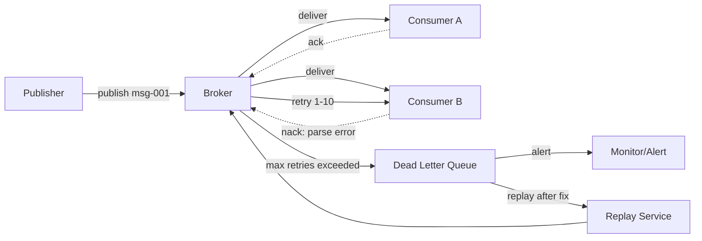

## 5. Communication Patterns

The transport layer defined in Chapter 4 determines how bytes flow between endpoints; this chapter defines what travels inside those transports. An agent communication protocol must support four fundamental interaction patterns: request-response for directed operations, publish-subscribe for event-driven decoupling, broadcast for one-to-many dissemination, and streaming for real-time incremental delivery. Each pattern carries distinct semantics for reliability, ordering, and failure handling that implementations MUST honor to remain interoperable.

The industry has converged on a hybrid architecture: request-response for intra-agent tool calls (MCP), event-driven pub-sub for inter-agent communication and long-running workflows, with streaming (SSE) for real-time updates [^14^]. This chapter specifies each pattern's wire format, lifecycle, error propagation, and selection criteria. Chapter 7 (Reliability) builds on these foundations for retry, circuit breaker, and saga semantics.

---

### 5.1 Request-Response Pattern

#### 5.1.1 Synchronous Request-Response

The request-response pattern is the workhorse of agent-to-agent and agent-to-tool communication. AESP-0003 adopts JSON-RPC 2.0 as the baseline RPC format, following the precedent established by MCP and A2A [^1^][^2^]. JSON-RPC provides explicit request IDs linking requests to responses, batch request support, and well-defined error semantics that map cleanly to the error code ranges defined in Chapter 3.

Method names follow a `{category}/{action}` convention that provides namespacing without requiring a formal interface definition language. Categories correspond to protocol functional areas (`tasks`, `skills`, `agents`, `system`), while actions denote verbs (`send`, `get`, `list`, `cancel`). A task submission, for example, uses `tasks/send`, and discovery uses `agents/discover`. This convention balances human readability with programmatic parsing and avoids the vendor-lockin of protobuf-generated stubs while remaining compatible with them when gRPC bindings are used.

ACP diverges from this approach by using REST/HTTP directly, with resource-oriented URLs and standard HTTP methods [^8^]. IBM positions ACP as more "integration-friendly" for enterprise deployments where curl/Postman compatibility and firewall-friendly HTTP semantics are priorities. AESP-0003 supports both: JSON-RPC 2.0 as the default for stateful agent coordination, with REST/HTTP as an optional binding for simple integrations. A2A's three-layer model demonstrates this separation — the same agent logic operates over JSON-RPC, gRPC, or HTTP/REST without modification [^5^].

Every request-response exchange MUST include the MVE-Required envelope fields defined in Chapter 3: `messageId`, `correlationId`, `idempotencyKey`, `traceContext`, and `timestamp`. The `messageId` serves as the JSON-RPC request `id`, while `correlationId` chains causality across multi-hop agent delegations. A2A's `contextId` and `taskId` fields provide native causality tracking that complements W3C Trace Context (`traceparent`/`tracestate`) [^10^][^11^]. Agents MUST reject messages containing mismatching `contextId` and `taskId` values to preserve causal consistency [^12^].

The following JSON Schema defines the TaskLifecycle envelope used for asynchronous request-response operations:

```json
{
  "$schema": "http://json-schema.org/draft-07/schema#",
  "title": "TaskLifecycle",
  "description": "Envelope for asynchronous request-response task management",
  "type": "object",
  "required": ["jsonrpc", "id", "method", "params"],
  "properties": {
    "jsonrpc": { "const": "2.0" },
    "id": { "type": ["string", "integer", "null"] },
    "method": { "type": "string", "pattern": "^[a-z]+/[a-z]+$" },
    "params": {
      "type": "object",
      "required": ["messageId", "correlationId", "idempotencyKey"],
      "properties": {
        "messageId": { "type": "string", "format": "uuid" },
        "correlationId": { "type": "string", "format": "uuid" },
        "idempotencyKey": { "type": "string", "format": "uuid" },
        "traceContext": {
          "type": "object",
          "properties": {
            "traceparent": { "type": "string" },
            "tracestate": { "type": "string" }
          }
        },
        "contextId": { "type": "string", "format": "uuid" },
        "taskId": { "type": "string", "format": "uuid" },
        "referenceTaskIds": {
          "type": "array",
          "items": { "type": "string", "format": "uuid" }
        },
        "deadline": { "type": "string", "format": "date-time" },
        "payload": { "type": "object" }
      }
    }
  }
}
```

#### 5.1.2 Timeout Semantics

Timeouts prevent indefinite blocking on downstream operations. AESP-0003 defines three timeout tiers: a **default timeout** of 5 seconds for standard operations (tool calls, discovery queries, simple task submissions), a **complex timeout** of 30 seconds for multi-step operations (agent delegation chains, file processing, structured data extraction), and a **configurable override** per-method advertised in the Agent Card. Implementations MAY support longer timeouts for specific long-running operations but MUST not exceed the caller-specified deadline if one is provided.

The 5-second default reflects the observation that HTTP's 5–10 ms overhead is negligible compared to LLM inference times (500 ms–5 s) [^4^], but agent systems add coordination overhead on top of inference. A 30-second complex timeout accommodates the p99 of multi-hop agent chains where each agent adds network round-trip plus inference latency. MCP implementations are encouraged to enforce timeouts and robust error handling covering version mismatches, capability negotiation failures, and unexpected disconnects [^21^].

#### 5.1.3 Deadline Propagation

Timeout tiers define local behavior; deadline propagation prevents cascading accumulation across agent chains. Without it, Service A calling Service B calling Service C results in the client waiting for the sum of all individual timeouts. gRPC solves this by propagating absolute timestamps (fixed points in time) rather than relative durations [^17^]. AESP-0003 adopts the same model.

When a caller issues a request, it computes an absolute deadline $D = T_{now} + T_{timeout}$ and includes $D$ in the envelope's `deadline` field. Each downstream agent receiving the request computes its remaining budget as $T_{remaining} = D - T_{local}$ and uses $T_{remaining}$ as its local timeout. The critical rule: agents MUST pass the incoming deadline to every downstream call and MUST NOT create a fresh deadline for subordinate requests [^18^][^19^]. Clock skew is addressed by gRPC's approach of converting the deadline to a relative timeout with elapsed time already deducted, shielding the system from unsynchronized clocks [^20^].

#### 5.1.4 Idempotency Keys

Exactly-once delivery is theoretically impossible in distributed systems (the two-generals problem); the practical standard is at-least-once delivery with idempotent consumers [^23^]. AESP-0003 mandates idempotency keys for all mutating operations. The client generates a UUID v4 `idempotencyKey`, places it in the envelope, and the receiver maintains a deduplication cache indexed by key.

The idempotency key pattern operates as follows: (1) the client generates a unique key, (2) the server checks whether the key exists in its dedup cache before processing, (3) duplicate requests return the cached result without reprocessing [^24^]. Same-key requests with different payloads MUST be rejected (following Stripe and AWS patterns) to prevent accidental replay attacks with modified parameters.

TTL policies bound cache growth: **24 hours** for API request deduplication, **7 days** for queue consumer deduplication (matching message queue retention periods) [^28^]. Kafka implements exactly-once semantics through a two-part mechanism — a Producer ID (PID) assigned by the broker and monotonically increasing sequence numbers per partition — similar to TCP but persisted to the replicated log [^25^][^26^]. AESP-0003 implementations SHOULD adopt analogous sequence-number tracking within each `contextId` scope.

#### 5.1.5 Request Cancellation

Long-running agent operations may be abandoned by their callers. A2A's task lifecycle includes an explicit `canceled` terminal state reached via a cancel notification sent as a JSON-RPC notification (no response expected). When a receiver processes a cancellation, it MUST terminate the associated operation and free resources, but SHOULD complete any non-interruptible cleanup (logging, state persistence, audit trail writing). If the operation has already completed when the cancel arrives, the cancel is ignored and the original result stands.

gRPC propagates context cancellation to the server when clients disconnect mid-stream, stopping unnecessary computation and saving CPU cycles on abandoned operations [^43^]. AESP-0003 implementations over HTTP/SSE SHOULD implement analogous cancellation via a DELETE request to the task endpoint or a `$/cancel` JSON-RPC notification.

#### 5.1.6 Progress Reporting

Operations exceeding 5 seconds MUST report progress to prevent caller timeout anxiety. A2A's `TaskStatusUpdateEvent` communicates lifecycle state changes (`submitted`, `working`, `input-required`, `completed`, `failed`) with intermediate messages describing current steps [^31^]. MCP-style progress reporting uses a 0–100 percentage field sent as incremental `TaskStatusUpdateEvent` messages over the SSE stream.

The `input-required` state deserves special mention: it is a first-class pause state where the agent requires more information or human approval, not an error condition [^32^]. Implementations MUST design UX and timeouts around this state explicitly. LangGraph offers complementary streaming modes: `values` for full state snapshots, `updates` for changed keys, and `messages` for token-by-token LLM output [^33^].

#### 5.1.7 JSON-RPC vs REST Comparison

Table 1 compares the three primary request-response approaches used in agent protocols. The choice depends on integration context: JSON-RPC for stateful agent-to-agent coordination, REST for simple HTTP-based integrations, and gRPC for high-performance internal communication.

| Dimension | JSON-RPC 2.0 | REST/HTTP | gRPC |
|-----------|-------------|-----------|------|
| **Envelope format** | Structured JSON with `id`, `method`, `params` | Resource-oriented URLs + HTTP methods | Binary protobuf over HTTP/2 |
| **State model** | Stateful sessions supported | Stateless by design | Stateful streams supported |
| **Correlation** | Native via `id` field | Requires custom headers | Implicit via stream context |
| **Batching** | Native batch arrays | Requires custom multipart | Native via multiplexing |
| **Streaming** | Via SSE upgrade | Via chunked transfer | Four streaming models built-in |
| **Payload size** | JSON text (verbose) | JSON/XML text | Binary (~30–50% smaller) |
| **Latency (p99)** | ~50–200 ms | ~100–300 ms | ~50–100 ms (binary + HTTP/2) |
| **Browser support** | Universal (HTTP) | Universal | Requires proxy/gRPC-Web |
| **Debuggability** | Human-readable JSON | Human-readable | Requires protoc decoding |
| **SDK required** | Recommended | No | Yes (code generation) |
| **Primary use case** | Agent coordination (MCP, A2A) | Simple integrations (ACP) | High-throughput internal mesh |

The JSON-RPC 2.0 approach dominates current agent protocols because it provides explicit correlation, batch support, and session-oriented design without the operational complexity of gRPC's binary format. ACP's REST approach offers lower barrier to entry — any HTTP client can call it without JSON-RPC SDK familiarity [^8^][^46^]. gRPC (added in A2A v0.3) provides 3–10x smaller payloads and significantly lower p99 latency than REST, but requires HTTP/2, a proxy for browser compatibility, and binary debugging tools [^43^]. AESP-0003's recommendation: use JSON-RPC 2.0 as the default, with REST and gRPC as negotiated alternatives via capability discovery.

---

### 5.2 Publish-Subscribe Pattern

#### 5.2.1 Topic Routing

Publish-subscribe reduces connection complexity from $O(N^2)$ to $O(N)$ by routing all communication through a central event bus, and is the foundational pattern for multi-agent communication [^11^]. AESP-0003 defines a hierarchical topic namespace following the convention `aeos://{org}/{namespace}/{event-type}`, with topic levels separated by `/`. This structure enables both precise targeting and broad subscription patterns.

Topic wildcards follow the MQTT specification [^20^]: the single-level wildcard `+` matches exactly one topic level, while the multi-level wildcard `#` matches zero or more levels at the end of a topic filter. For example, subscription to `aeos://acme/agents/+/status` receives status events from all agents in the `acme` organization without subscribing to each individually. Subscription to `aeos://acme/#` receives all events within the `acme` organization. Agents MUST validate wildcard placement (`#` only as the final character) and reject malformed topic filters.

#### 5.2.2 Subscription Lifecycle

Subscriptions progress through a defined state machine: **subscribe** (client sends subscription request) → **confirm** (broker acknowledges with subscription ID) → **active** (messages delivered) → **expire/unsubscribe** (subscription terminates). Each subscription carries a TTL; the broker MAY expire inactive subscriptions and MUST notify the client before expiration to allow renewal. Dynamic hierarchical topics with runtime-variable substitution enable subscribing applications to receive exactly the events they need without changes to existing producers or consumers [^29^].

#### 5.2.3 At-Least-Once Delivery

AESP-0003's baseline delivery guarantee for pub-sub is at-least-once. This requires three mechanisms operating in concert: (1) the broker persists messages until acknowledged, (2) consumers acknowledge delivery via a positive `ack` signal, and (3) unacknowledged messages are redelivered with exponential backoff. Deduplication is the consumer's responsibility: each message carries a `messageId` (UUID) in its envelope, and consumers MUST track processed IDs within a window matching the broker's redelivery timeout.

Exponential backoff with jitter reduces retry storms by 60–80% [^41^]. The retry schedule uses a base interval of 1 second with a maximum of 32 seconds (`2^5`), plus a random jitter of 0–50% of the computed interval. Messages failing delivery after the maximum retry count (default: 10 attempts) are routed to the Dead Letter Queue.

#### 5.2.4 Dead Letter Queue

A Dead Letter Queue (DLQ) is essential for poison pill handling — a single malformed message without a DLQ can block a consumer partition indefinitely [^40^]. When a message exceeds the maximum retry threshold, the broker routes it to a designated DLQ topic (e.g., `aeos://{org}/system/dead-letter`) with metadata headers preserving the original topic, retry count, failure reason, and timestamp.

The following Mermaid diagram illustrates the publish-subscribe pattern with DLQ routing:



**Case Study: The 10,000-Retry Incident.** A production payment processing system using Kafka encountered a single malformed message with an unexpected null field in the payment payload. The consumer's deserialization logic threw an exception, triggering automatic retry. Without a configured DLQ, the message was retried indefinitely — 10,000 times over 6 hours — blocking the entire consumer partition. All payment processing for that partition halted because the malformed message sat at the head of the queue, preventing subsequent valid messages from being processed. The incident was resolved by introducing a DLQ with `DeserializationExceptionHandler` routing poison pills to a dead-letter topic, allowing the pipeline to continue [^40^][^41^]. Systems MUST configure DLQs before deploying consumers in production.

#### 5.2.5 Message Persistence and Offset-Based Replay

Persistent messaging systems (Kafka, NATS JetStream, Pulsar) store messages durably with configurable retention periods, enabling consumers to replay events from arbitrary offsets. This capability is critical for agent systems: newly deployed agents can replay historical events to build state, debugging can reconstruct exact event sequences, and compliance requirements mandate immutable audit trails.

Event sourcing stores state changes as a sequence of events in an append-only log rather than overwriting current state, enabling complete audit trails, multiple query models, temporal queries, and decoupled read/write scaling [^25^][^26^]. The ESAA (Event Sourcing for Autonomous Agents) architecture demonstrates practical application: agents emit only structured intentions in validated JSON, a deterministic orchestrator persists events in an append-only log, and replay verification ensures forensic traceability [^27^]. AESP-0003 recommends event sourcing for all agent governance boundaries.

#### 5.2.6 Event Schema Requirements

All pub-sub messages MUST conform to the CloudEvents 1.0 specification with AESP-0003 extensions. The CloudEvents envelope provides `specversion`, `type`, `source`, `id`, `time`, and `datacontenttype` attributes. AESP-0003 adds agent-specific extensions: `aespagentid` (the originating agent), `aesptaskid` (associated task if any), `aespcontextid` (causality context), and `aesppriority` (1–10, default 5). These extensions enable filtering, routing, and correlation without parsing the event data payload.

---

### 5.3 Broadcast Pattern

#### 5.3.1 Scoped Broadcast

Broadcast extends pub-sub from one-to-many within a topic to one-to-all within a scope. AESP-0003 defines three broadcast scopes: **org-wide** (all agents within an organization), **team** (agents sharing a namespace or project), and **agent-group** (explicitly defined cohorts, e.g., "payment-processing-agents"). Scoped broadcast uses the same topic hierarchy as pub-sub but with wildcard patterns that expand to match all agents in the scope. An org-wide broadcast publishes to `aeos://{org}/#`; a team broadcast targets `aeos://{org}/{team}/#`.

Broadcast messages carry a `broadcastScope` envelope field with values `org`, `team`, or `group`, and a `broadcastId` (UUID) enabling receivers to detect duplicates from overlapping subscription patterns. Broadcast is intentionally best-effort: senders MUST NOT require acknowledgments from all recipients.

#### 5.3.2 Gossip Protocol

For decentralized environments without a central broker, AESP-0003 supports gossip (epidemic) protocols as an alternative broadcast mechanism. Gossip protocols achieve many-to-many communication through randomized peer selection, providing redundancy that makes the system self-healing — information finds its way through whatever routes are available [^5^]. Each agent maintains a partial view of the network (typically 20–30 peers) and periodically exchanges state with a random subset.

With fan-out $f = 3$, a 25,000-agent system converges in approximately 15 gossip rounds [^4^][^9^]. At 1-second gossip intervals, complete propagation takes under 20 seconds — acceptable for ambient context sharing, peer discovery, and soft-state synchronization, but unacceptable for hard real-time coordination. Gossip is positioned as a substrate layer beneath structured protocols (A2A, MCP) for runtime peer discovery and gradual semantic convergence, not as a replacement for directed task delegation [^4^].

The communication cost per agent per round is $O(1)$ — each agent contacts a constant number of peers regardless of total network size. The convergence time is $O(\log N)$ rounds, where $N$ is the number of agents. This makes gossip uniquely scalable for very large agent ensembles where centralized brokers would become bottlenecks.

#### 5.3.3 Best-Effort Delivery

Broadcast makes no ordering guarantees. Messages may arrive out of order, may be received multiple times (via overlapping gossip paths or wildcard subscriptions), and may not reach all agents. Applications requiring ordering MUST build sequence numbers and reordering buffers on top of the broadcast primitive. Applications requiring reliability MUST layer acknowledgment protocols (at their own expense) or use pub-sub with explicit consumer groups instead of broadcast.

---

### 5.4 Streaming Pattern

#### 5.4.1 Server-to-Client Streaming

Server-Sent Events (SSE) is the default streaming transport for AESP-0003. Every major LLM provider (OpenAI, Anthropic, Google) uses SSE for streaming responses because LLM token generation is fundamentally a one-way operation: the client sends a prompt, the server streams tokens back [^11^]. A2A uses SSE as its primary real-time mechanism, with the server advertising streaming capability via `capabilities.streaming: true` in the Agent Card [^1^].

An SSE stream begins with an HTTP response carrying `Content-Type: text/event-stream`. Subsequent events follow the SSE format: each event has an optional `id`, optional `event` type, and `data` payload. A2A delivers three event types over the stream: `Task` (current state snapshot), `TaskStatusUpdateEvent` (lifecycle state changes), and `TaskArtifactUpdateEvent` (chunked artifact delivery with `append` and `lastChunk` flags for reassembly) [^2^]. The stream closes when the task reaches a terminal state (`completed`, `failed`, `canceled`, `rejected`, `input_required`, or `auth_required`) [^3^].

The following JSON Schema defines the StreamingMessage envelope:
