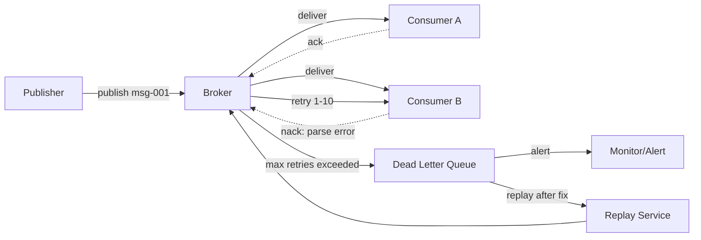
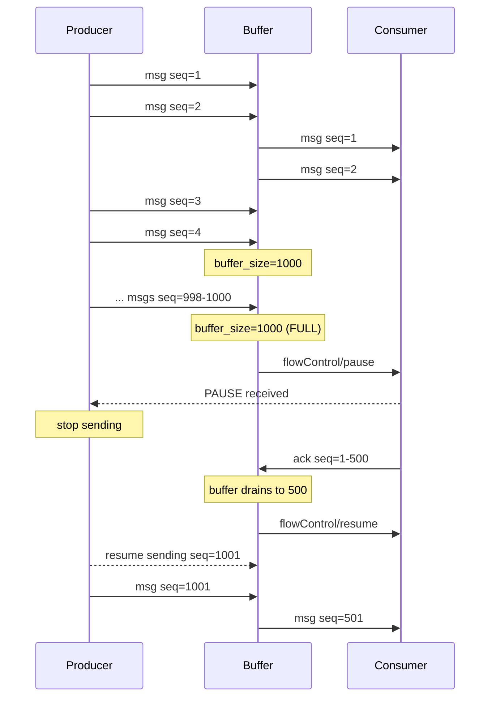
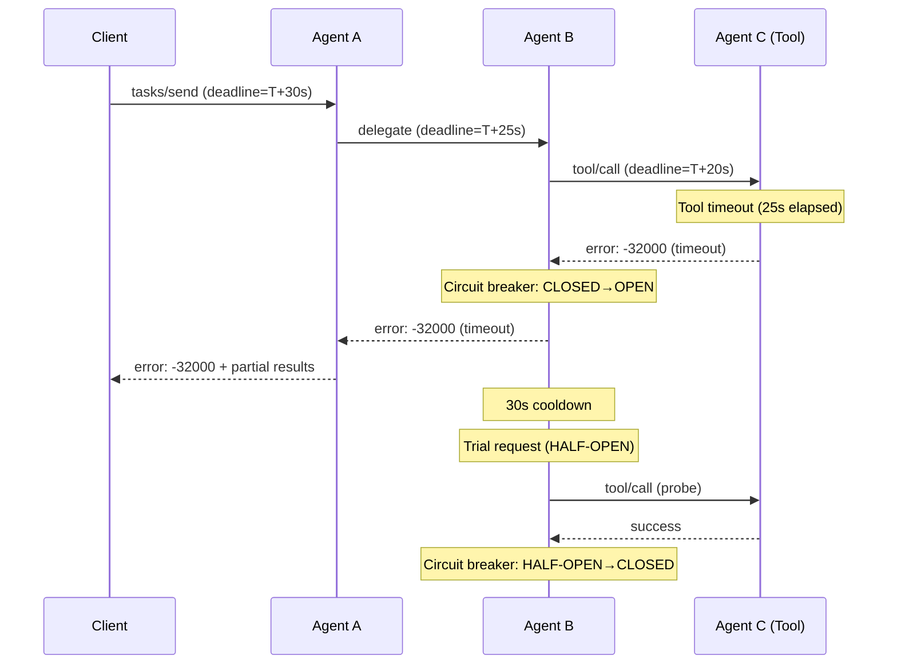
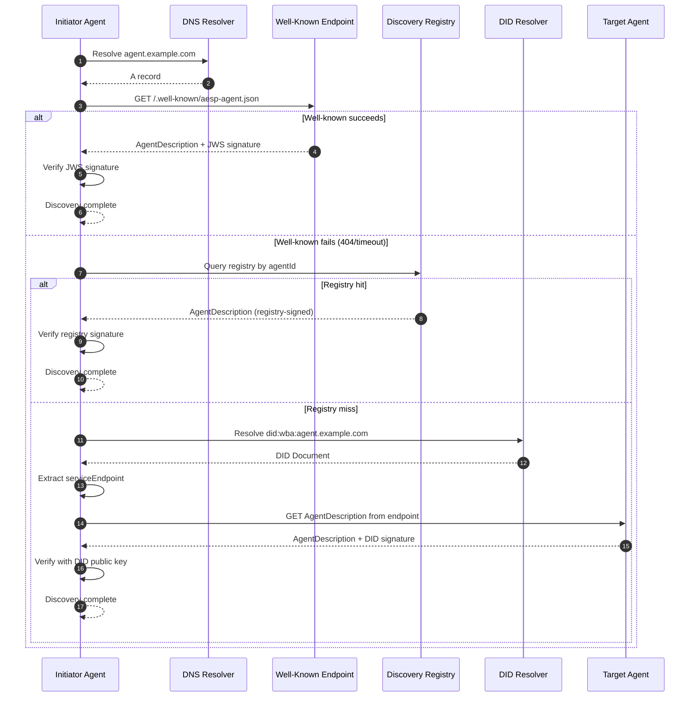
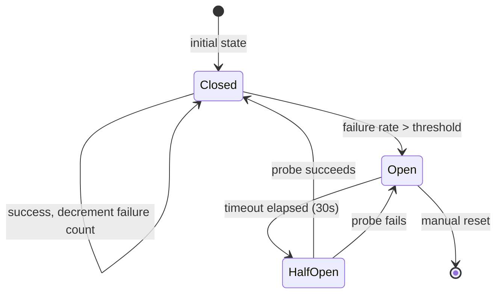
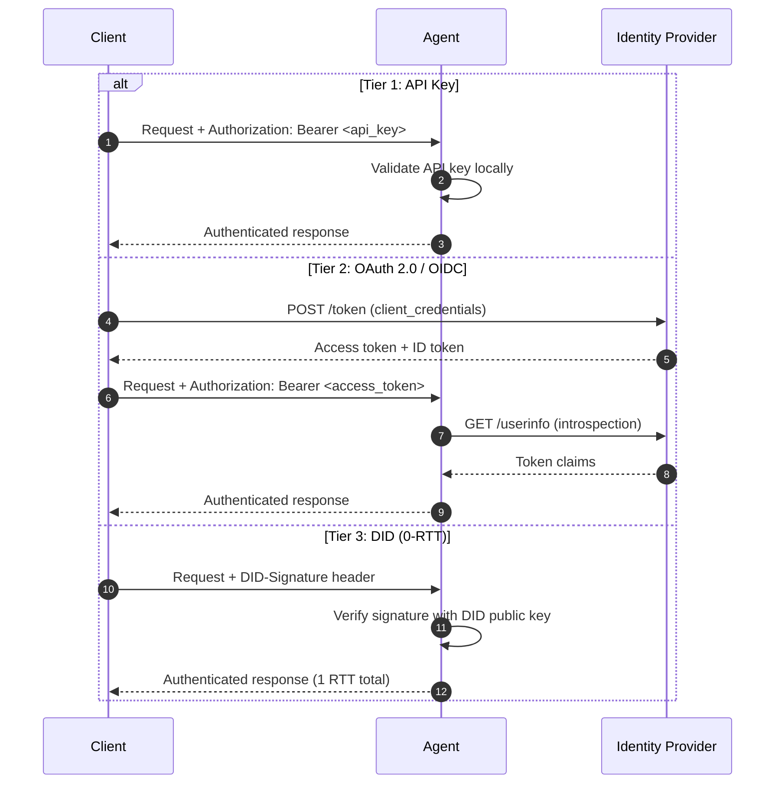

## 5. Communication Patterns

The transport layer defined in Chapter 4 determines how bytes flow between endpoints; this chapter defines what travels inside those transports. An agent communication protocol must support four fundamental interaction patterns: request-response for directed operations, publish-subscribe for event-driven decoupling, broadcast for one-to-many dissemination, and streaming for real-time incremental delivery. Each pattern carries distinct semantics for reliability, ordering, and failure handling that implementations MUST honor to remain interoperable.

The industry has converged on a hybrid architecture: request-response for intra-agent tool calls (MCP), event-driven pub-sub for inter-agent communication and long-running workflows, with streaming (SSE) for real-time updates [^14^]. This chapter specifies each pattern's wire format, lifecycle, error propagation, and selection criteria. Chapter 7 (Reliability) builds on these foundations for retry, circuit breaker, and saga semantics.

---

### 5.1 Request-Response Pattern

#### 5.1.1 Synchronous Request-Response

The request-response pattern is the workhorse of agent-to-agent and agent-to-tool communication. AESP-0003 adopts JSON-RPC 2.0 as the baseline RPC format, following the precedent established by MCP and A2A [^1^][^2^]. JSON-RPC provides explicit request IDs linking requests to responses, batch request support, and well-defined error semantics that map cleanly to the error code ranges defined in Chapter 3.

Method names follow a `{category}/{action}` convention that provides namespacing without requiring a formal interface definition language. Categories correspond to protocol functional areas (`tasks`, `skills`, `agents`, `system`), while actions denote verbs (`send`, `get`, `list`, `cancel`). A task submission, for example, uses `tasks/send`, and discovery uses `agents/discover`. This convention balances human readability with programmatic parsing and avoids the vendor-lockin of protobuf-generated stubs while remaining compatible with them when gRPC bindings are used.

ACP diverges from this approach by using REST/HTTP directly, with resource-oriented URLs and standard HTTP methods [^8^]. IBM positions ACP as more "integration-friendly" for enterprise deployments where curl/Postman compatibility and firewall-friendly HTTP semantics are priorities. AESP-0003 supports both: JSON-RPC 2.0 as the default for stateful agent coordination, with REST/HTTP as an optional binding for simple integrations. A2A's three-layer model demonstrates this separation — the same agent logic operates over JSON-RPC, gRPC, or HTTP/REST without modification [^5^].

Every request-response exchange MUST include the MVE-Required envelope fields defined in Chapter 3: `messageId`, `correlationId`, `idempotencyKey`, `traceContext`, and `timestamp`. The `messageId` serves as the JSON-RPC request `id`, while `correlationId` chains causality across multi-hop agent delegations. A2A's `contextId` and `taskId` fields provide native causality tracking that complements W3C Trace Context (`traceparent`/`tracestate`) [^10^][^11^]. Agents MUST reject messages containing mismatching `contextId` and `taskId` values to preserve causal consistency [^12^].

The following JSON Schema defines the TaskLifecycle envelope used for asynchronous request-response operations:

```json
{
  "$schema": "http://json-schema.org/draft-07/schema#",
  "title": "TaskLifecycle",
  "description": "Envelope for asynchronous request-response task management",
  "type": "object",
  "required": ["jsonrpc", "id", "method", "params"],
  "properties": {
    "jsonrpc": { "const": "2.0" },
    "id": { "type": ["string", "integer", "null"] },
    "method": { "type": "string", "pattern": "^[a-z]+/[a-z]+$" },
    "params": {
      "type": "object",
      "required": ["messageId", "correlationId", "idempotencyKey"],
      "properties": {
        "messageId": { "type": "string", "format": "uuid" },
        "correlationId": { "type": "string", "format": "uuid" },
        "idempotencyKey": { "type": "string", "format": "uuid" },
        "traceContext": {
          "type": "object",
          "properties": {
            "traceparent": { "type": "string" },
            "tracestate": { "type": "string" }
          }
        },
        "contextId": { "type": "string", "format": "uuid" },
        "taskId": { "type": "string", "format": "uuid" },
        "referenceTaskIds": {
          "type": "array",
          "items": { "type": "string", "format": "uuid" }
        },
        "deadline": { "type": "string", "format": "date-time" },
        "payload": { "type": "object" }
      }
    }
  }
}
```

#### 5.1.2 Timeout Semantics

Timeouts prevent indefinite blocking on downstream operations. AESP-0003 defines three timeout tiers: a **default timeout** of 5 seconds for standard operations (tool calls, discovery queries, simple task submissions), a **complex timeout** of 30 seconds for multi-step operations (agent delegation chains, file processing, structured data extraction), and a **configurable override** per-method advertised in the Agent Card. Implementations MAY support longer timeouts for specific long-running operations but MUST not exceed the caller-specified deadline if one is provided.

The 5-second default reflects the observation that HTTP's 5–10 ms overhead is negligible compared to LLM inference times (500 ms–5 s) [^4^], but agent systems add coordination overhead on top of inference. A 30-second complex timeout accommodates the p99 of multi-hop agent chains where each agent adds network round-trip plus inference latency. MCP implementations are encouraged to enforce timeouts and robust error handling covering version mismatches, capability negotiation failures, and unexpected disconnects [^21^].

#### 5.1.3 Deadline Propagation

Timeout tiers define local behavior; deadline propagation prevents cascading accumulation across agent chains. Without it, Service A calling Service B calling Service C results in the client waiting for the sum of all individual timeouts. gRPC solves this by propagating absolute timestamps (fixed points in time) rather than relative durations [^17^]. AESP-0003 adopts the same model.

When a caller issues a request, it computes an absolute deadline $D = T_{now} + T_{timeout}$ and includes $D$ in the envelope's `deadline` field. Each downstream agent receiving the request computes its remaining budget as $T_{remaining} = D - T_{local}$ and uses $T_{remaining}$ as its local timeout. The critical rule: agents MUST pass the incoming deadline to every downstream call and MUST NOT create a fresh deadline for subordinate requests [^18^][^19^]. Clock skew is addressed by gRPC's approach of converting the deadline to a relative timeout with elapsed time already deducted, shielding the system from unsynchronized clocks [^20^].

#### 5.1.4 Idempotency Keys

Exactly-once delivery is theoretically impossible in distributed systems (the two-generals problem); the practical standard is at-least-once delivery with idempotent consumers [^23^]. AESP-0003 mandates idempotency keys for all mutating operations. The client generates a UUID v4 `idempotencyKey`, places it in the envelope, and the receiver maintains a deduplication cache indexed by key.

The idempotency key pattern operates as follows: (1) the client generates a unique key, (2) the server checks whether the key exists in its dedup cache before processing, (3) duplicate requests return the cached result without reprocessing [^24^]. Same-key requests with different payloads MUST be rejected (following Stripe and AWS patterns) to prevent accidental replay attacks with modified parameters.

TTL policies bound cache growth: **24 hours** for API request deduplication, **7 days** for queue consumer deduplication (matching message queue retention periods) [^28^]. Kafka implements exactly-once semantics through a two-part mechanism — a Producer ID (PID) assigned by the broker and monotonically increasing sequence numbers per partition — similar to TCP but persisted to the replicated log [^25^][^26^]. AESP-0003 implementations SHOULD adopt analogous sequence-number tracking within each `contextId` scope.

#### 5.1.5 Request Cancellation

Long-running agent operations may be abandoned by their callers. A2A's task lifecycle includes an explicit `canceled` terminal state reached via a cancel notification sent as a JSON-RPC notification (no response expected). When a receiver processes a cancellation, it MUST terminate the associated operation and free resources, but SHOULD complete any non-interruptible cleanup (logging, state persistence, audit trail writing). If the operation has already completed when the cancel arrives, the cancel is ignored and the original result stands.

gRPC propagates context cancellation to the server when clients disconnect mid-stream, stopping unnecessary computation and saving CPU cycles on abandoned operations [^43^]. AESP-0003 implementations over HTTP/SSE SHOULD implement analogous cancellation via a DELETE request to the task endpoint or a `$/cancel` JSON-RPC notification.

#### 5.1.6 Progress Reporting

Operations exceeding 5 seconds MUST report progress to prevent caller timeout anxiety. A2A's `TaskStatusUpdateEvent` communicates lifecycle state changes (`submitted`, `working`, `input-required`, `completed`, `failed`) with intermediate messages describing current steps [^31^]. MCP-style progress reporting uses a 0–100 percentage field sent as incremental `TaskStatusUpdateEvent` messages over the SSE stream.

The `input-required` state deserves special mention: it is a first-class pause state where the agent requires more information or human approval, not an error condition [^32^]. Implementations MUST design UX and timeouts around this state explicitly. LangGraph offers complementary streaming modes: `values` for full state snapshots, `updates` for changed keys, and `messages` for token-by-token LLM output [^33^].

#### 5.1.7 JSON-RPC vs REST Comparison

Table 1 compares the three primary request-response approaches used in agent protocols. The choice depends on integration context: JSON-RPC for stateful agent-to-agent coordination, REST for simple HTTP-based integrations, and gRPC for high-performance internal communication.

| Dimension | JSON-RPC 2.0 | REST/HTTP | gRPC |
|-----------|-------------|-----------|------|
| **Envelope format** | Structured JSON with `id`, `method`, `params` | Resource-oriented URLs + HTTP methods | Binary protobuf over HTTP/2 |
| **State model** | Stateful sessions supported | Stateless by design | Stateful streams supported |
| **Correlation** | Native via `id` field | Requires custom headers | Implicit via stream context |
| **Batching** | Native batch arrays | Requires custom multipart | Native via multiplexing |
| **Streaming** | Via SSE upgrade | Via chunked transfer | Four streaming models built-in |
| **Payload size** | JSON text (verbose) | JSON/XML text | Binary (~30–50% smaller) |
| **Latency (p99)** | ~50–200 ms | ~100–300 ms | ~50–100 ms (binary + HTTP/2) |
| **Browser support** | Universal (HTTP) | Universal | Requires proxy/gRPC-Web |
| **Debuggability** | Human-readable JSON | Human-readable | Requires protoc decoding |
| **SDK required** | Recommended | No | Yes (code generation) |
| **Primary use case** | Agent coordination (MCP, A2A) | Simple integrations (ACP) | High-throughput internal mesh |

The JSON-RPC 2.0 approach dominates current agent protocols because it provides explicit correlation, batch support, and session-oriented design without the operational complexity of gRPC's binary format. ACP's REST approach offers lower barrier to entry — any HTTP client can call it without JSON-RPC SDK familiarity [^8^][^46^]. gRPC (added in A2A v0.3) provides 3–10x smaller payloads and significantly lower p99 latency than REST, but requires HTTP/2, a proxy for browser compatibility, and binary debugging tools [^43^]. AESP-0003's recommendation: use JSON-RPC 2.0 as the default, with REST and gRPC as negotiated alternatives via capability discovery.

---

### 5.2 Publish-Subscribe Pattern

#### 5.2.1 Topic Routing

Publish-subscribe reduces connection complexity from $O(N^2)$ to $O(N)$ by routing all communication through a central event bus, and is the foundational pattern for multi-agent communication [^11^]. AESP-0003 defines a hierarchical topic namespace following the convention `aeos://{org}/{namespace}/{event-type}`, with topic levels separated by `/`. This structure enables both precise targeting and broad subscription patterns.

Topic wildcards follow the MQTT specification [^20^]: the single-level wildcard `+` matches exactly one topic level, while the multi-level wildcard `#` matches zero or more levels at the end of a topic filter. For example, subscription to `aeos://acme/agents/+/status` receives status events from all agents in the `acme` organization without subscribing to each individually. Subscription to `aeos://acme/#` receives all events within the `acme` organization. Agents MUST validate wildcard placement (`#` only as the final character) and reject malformed topic filters.

#### 5.2.2 Subscription Lifecycle

Subscriptions progress through a defined state machine: **subscribe** (client sends subscription request) → **confirm** (broker acknowledges with subscription ID) → **active** (messages delivered) → **expire/unsubscribe** (subscription terminates). Each subscription carries a TTL; the broker MAY expire inactive subscriptions and MUST notify the client before expiration to allow renewal. Dynamic hierarchical topics with runtime-variable substitution enable subscribing applications to receive exactly the events they need without changes to existing producers or consumers [^29^].

#### 5.2.3 At-Least-Once Delivery

AESP-0003's baseline delivery guarantee for pub-sub is at-least-once. This requires three mechanisms operating in concert: (1) the broker persists messages until acknowledged, (2) consumers acknowledge delivery via a positive `ack` signal, and (3) unacknowledged messages are redelivered with exponential backoff. Deduplication is the consumer's responsibility: each message carries a `messageId` (UUID) in its envelope, and consumers MUST track processed IDs within a window matching the broker's redelivery timeout.

Exponential backoff with jitter reduces retry storms by 60–80% [^41^]. The retry schedule uses a base interval of 1 second with a maximum of 32 seconds (`2^5`), plus a random jitter of 0–50% of the computed interval. Messages failing delivery after the maximum retry count (default: 10 attempts) are routed to the Dead Letter Queue.

#### 5.2.4 Dead Letter Queue

A Dead Letter Queue (DLQ) is essential for poison pill handling — a single malformed message without a DLQ can block a consumer partition indefinitely [^40^]. When a message exceeds the maximum retry threshold, the broker routes it to a designated DLQ topic (e.g., `aeos://{org}/system/dead-letter`) with metadata headers preserving the original topic, retry count, failure reason, and timestamp.

The following Mermaid diagram illustrates the publish-subscribe pattern with DLQ routing:



**Case Study: The 10,000-Retry Incident.** A production payment processing system using Kafka encountered a single malformed message with an unexpected null field in the payment payload. The consumer's deserialization logic threw an exception, triggering automatic retry. Without a configured DLQ, the message was retried indefinitely — 10,000 times over 6 hours — blocking the entire consumer partition. All payment processing for that partition halted because the malformed message sat at the head of the queue, preventing subsequent valid messages from being processed. The incident was resolved by introducing a DLQ with `DeserializationExceptionHandler` routing poison pills to a dead-letter topic, allowing the pipeline to continue [^40^][^41^]. Systems MUST configure DLQs before deploying consumers in production.

#### 5.2.5 Message Persistence and Offset-Based Replay

Persistent messaging systems (Kafka, NATS JetStream, Pulsar) store messages durably with configurable retention periods, enabling consumers to replay events from arbitrary offsets. This capability is critical for agent systems: newly deployed agents can replay historical events to build state, debugging can reconstruct exact event sequences, and compliance requirements mandate immutable audit trails.

Event sourcing stores state changes as a sequence of events in an append-only log rather than overwriting current state, enabling complete audit trails, multiple query models, temporal queries, and decoupled read/write scaling [^25^][^26^]. The ESAA (Event Sourcing for Autonomous Agents) architecture demonstrates practical application: agents emit only structured intentions in validated JSON, a deterministic orchestrator persists events in an append-only log, and replay verification ensures forensic traceability [^27^]. AESP-0003 recommends event sourcing for all agent governance boundaries.

#### 5.2.6 Event Schema Requirements

All pub-sub messages MUST conform to the CloudEvents 1.0 specification with AESP-0003 extensions. The CloudEvents envelope provides `specversion`, `type`, `source`, `id`, `time`, and `datacontenttype` attributes. AESP-0003 adds agent-specific extensions: `aespagentid` (the originating agent), `aesptaskid` (associated task if any), `aespcontextid` (causality context), and `aesppriority` (1–10, default 5). These extensions enable filtering, routing, and correlation without parsing the event data payload.

---

### 5.3 Broadcast Pattern

#### 5.3.1 Scoped Broadcast

Broadcast extends pub-sub from one-to-many within a topic to one-to-all within a scope. AESP-0003 defines three broadcast scopes: **org-wide** (all agents within an organization), **team** (agents sharing a namespace or project), and **agent-group** (explicitly defined cohorts, e.g., "payment-processing-agents"). Scoped broadcast uses the same topic hierarchy as pub-sub but with wildcard patterns that expand to match all agents in the scope. An org-wide broadcast publishes to `aeos://{org}/#`; a team broadcast targets `aeos://{org}/{team}/#`.

Broadcast messages carry a `broadcastScope` envelope field with values `org`, `team`, or `group`, and a `broadcastId` (UUID) enabling receivers to detect duplicates from overlapping subscription patterns. Broadcast is intentionally best-effort: senders MUST NOT require acknowledgments from all recipients.

#### 5.3.2 Gossip Protocol

For decentralized environments without a central broker, AESP-0003 supports gossip (epidemic) protocols as an alternative broadcast mechanism. Gossip protocols achieve many-to-many communication through randomized peer selection, providing redundancy that makes the system self-healing — information finds its way through whatever routes are available [^5^]. Each agent maintains a partial view of the network (typically 20–30 peers) and periodically exchanges state with a random subset.

With fan-out $f = 3$, a 25,000-agent system converges in approximately 15 gossip rounds [^4^][^9^]. At 1-second gossip intervals, complete propagation takes under 20 seconds — acceptable for ambient context sharing, peer discovery, and soft-state synchronization, but unacceptable for hard real-time coordination. Gossip is positioned as a substrate layer beneath structured protocols (A2A, MCP) for runtime peer discovery and gradual semantic convergence, not as a replacement for directed task delegation [^4^].

The communication cost per agent per round is $O(1)$ — each agent contacts a constant number of peers regardless of total network size. The convergence time is $O(\log N)$ rounds, where $N$ is the number of agents. This makes gossip uniquely scalable for very large agent ensembles where centralized brokers would become bottlenecks.

#### 5.3.3 Best-Effort Delivery

Broadcast makes no ordering guarantees. Messages may arrive out of order, may be received multiple times (via overlapping gossip paths or wildcard subscriptions), and may not reach all agents. Applications requiring ordering MUST build sequence numbers and reordering buffers on top of the broadcast primitive. Applications requiring reliability MUST layer acknowledgment protocols (at their own expense) or use pub-sub with explicit consumer groups instead of broadcast.

---

### 5.4 Streaming Pattern

#### 5.4.1 Server-to-Client Streaming

Server-Sent Events (SSE) is the default streaming transport for AESP-0003. Every major LLM provider (OpenAI, Anthropic, Google) uses SSE for streaming responses because LLM token generation is fundamentally a one-way operation: the client sends a prompt, the server streams tokens back [^11^]. A2A uses SSE as its primary real-time mechanism, with the server advertising streaming capability via `capabilities.streaming: true` in the Agent Card [^1^].

An SSE stream begins with an HTTP response carrying `Content-Type: text/event-stream`. Subsequent events follow the SSE format: each event has an optional `id`, optional `event` type, and `data` payload. A2A delivers three event types over the stream: `Task` (current state snapshot), `TaskStatusUpdateEvent` (lifecycle state changes), and `TaskArtifactUpdateEvent` (chunked artifact delivery with `append` and `lastChunk` flags for reassembly) [^2^]. The stream closes when the task reaches a terminal state (`completed`, `failed`, `canceled`, `rejected`, `input_required`, or `auth_required`) [^3^].

The following JSON Schema defines the StreamingMessage envelope:

```json
{
  "$schema": "http://json-schema.org/draft-07/schema#",
  "title": "StreamingMessage",
  "description": "Server-Sent Events streaming message envelope for agent communication",
  "type": "object",
  "required": ["id", "event", "data"],
  "properties": {
    "id": { "type": "string", "format": "uuid", "description": "Event ID for resumption" },
    "event": {
      "type": "string",
      "enum": ["task", "status", "artifact", "progress", "error", "cancel"]
    },
    "data": {
      "type": "object",
      "required": ["messageId", "timestamp"],
      "properties": {
        "messageId": { "type": "string", "format": "uuid" },
        "timestamp": { "type": "string", "format": "date-time" },
        "taskId": { "type": "string", "format": "uuid" },
        "sequenceNumber": { "type": "integer", "minimum": 0 },
        "payload": { "type": "object" },
        "progress": {
          "type": "object",
          "properties": {
            "percent": { "type": "integer", "minimum": 0, "maximum": 100 },
            "description": { "type": "string" }
          }
        },
        "isFinal": { "type": "boolean", "description": "True if this is the last event" }
      }
    },
    "retry": { "type": "integer", "description": "Reconnection delay in milliseconds" }
  }
}
```

#### 5.4.2 Client-to-Server Streaming

Client-to-server streaming supports chunked upload of large inputs (documents, images, audio) and streaming input for interactive sessions. Two mechanisms are provided: chunked transfer encoding (RFC 9112) for HTTP-based upload, and bidirectional streaming for WebSocket or gRPC transports. Each chunk carries a sequence number starting at 0, and the final chunk is marked with `lastChunk: true`. The server assembles chunks in sequence-number order and acknowledges receipt of the final chunk with a summary response containing the assembled content hash.

#### 5.4.3 Stream Resumption

Network partitions are inevitable in distributed systems. AESP-0003 supports three resumption mechanisms matched to the transport: **Last-Event-ID** for SSE (the client sends the ID of the last received event on reconnection, and the server resumes from the following event) [^8^]; **offset-based** for Kafka (consumers track partition offsets and resume from the last committed position); and **sequence numbers** for WebSocket (clients track the highest received sequence number and request replay from that point).

A2A's `SubscribeToTask` RPC method allows clients to reconnect to an in-progress task stream after connection drops. Best practices include persisting `taskId` locally, detecting premature stream closure, resubscribing with exponential backoff, and de-duplicating events if the server replays overlapping state [^4^].

#### 5.4.4 Backpressure

Backpressure prevents fast producers from overwhelming slow consumers. The mechanism depends on the transport. gRPC inherits HTTP/2's window-based flow control, providing implicit backpressure: when a receiver processes messages slower than the sender sends them, the receive window shrinks, signaling the sender to pause [^40^][^42^]. The default initial window size is 65 KB, and both client and server send `WINDOW_UPDATE` frames depending on their consumption rate [^41^].

For SSE and WebSocket, where HTTP/2 flow control operates at the TCP level but not the application level, AESP-0003 defines an application-level pause/resume protocol. The consumer sends a `flowControl/pause` message when its buffer reaches a configurable threshold (default: 1000 messages), and the producer stops sending. When the consumer's buffer drains below a resume threshold (default: 500 messages), it sends `flowControl/resume`. Producers that do not receive a resume within a timeout period (default: 30 seconds) MAY close the stream and expect the consumer to reconnect when ready.

The following Mermaid diagram illustrates streaming backpressure with the pause/resume cycle:



#### 5.4.5 SSE vs WebSocket

SSE latency is approximately 5–10 ms per message; WebSocket achieves 1–3 ms [^12^]. For LLM token streaming, this difference is invisible: GPT-4o generates tokens at 80–100 tokens per second, with each token taking 10–12 ms to produce [^12^]. SSE's auto-reconnection, HTTP/2 multiplexing, and firewall compatibility make it the default choice. WebSocket SHOULD only be used when true bidirectional communication is needed during active streaming — human-in-the-loop approvals mid-generation, live steering, or multi-user collaborative sessions [^10^].

HTTP/2 multiplexing is a decisive factor: under HTTP/1.1, browsers limit SSE connections to 6 per domain; under HTTP/2, all streams multiplex over a single TCP connection, enabling 100+ concurrent streams [^35^][^36^][^37^]. WebSockets cannot benefit from HTTP/2 multiplexing because they upgrade to a different protocol entirely, requiring separate TCP connections.

---

### 5.5 Delivery Semantics

#### 5.5.1 At-Most-Once

At-most-once delivery means a message is delivered zero or one times — no retry, no duplication. This is the default for HTTP request-response without explicit retry configuration. It is suitable for idempotent read operations, telemetry, and logging where occasional loss is acceptable. Implementations MUST NOT retry failed at-most-once requests unless explicitly configured otherwise.

#### 5.5.2 At-Least-Once

At-least-once delivery guarantees that every message is delivered one or more times. This is the baseline for persistent messaging: the sender persists the message, attempts delivery, and retries until an acknowledgment is received. The consumer is responsible for deduplication. As noted in Section 5.1.4, the idempotency key pattern (client-generated UUID + server-side dedup cache) provides effective exactly-once processing on top of at-least-once transport [^23^][^24^].

AESP-0003 mandates at-least-once as the minimum guarantee for all pub-sub and streaming operations. Consumers MUST tolerate duplicate delivery gracefully. Brokers MUST persist messages until acknowledged and MUST implement exponential backoff with jitter for retries.

#### 5.5.3 Exactly-Once

Exactly-once semantics are the gold standard for operations where duplication has unacceptable consequences — financial transactions, inventory updates, and state-machine transitions. Kafka implements exactly-once through idempotent producer publishing (Producer ID + sequence numbers per partition) combined with transactional publishing for multi-partition operations [^25^][^26^]. This adds 2–5 ms latency and reduces throughput by 10–20% compared to at-least-once [^25^].

AESP-0003's position: exactly-once is achieved through the composition of at-least-once transport with idempotent consumers, not through transport-level guarantees alone. The protocol provides the primitives (idempotency keys, sequence numbers, dedup windows); implementations compose them to achieve exactly-once semantics where required.

**Case Study: Retry Storm in Production Workflow Engine.** Temporal's default retry policy includes unlimited retries with exponential backoff. During a 45-minute outage of a downstream payment API, a production workflow engine with this default policy generated 15,000–60,000 extra billable actions per hour — each retry counted as a workflow action despite every attempt failing deterministically (the downstream API returned 503 Service Unavailable) [^41^]. The root cause was the absence of a circuit breaker and the misconfiguration of `NonRetryableErrorTypes`: business validation errors (card declined, insufficient funds) were retried alongside transient network errors, even though the validation errors would deterministically fail on every attempt. Resolution required three changes: (1) limiting maximum retry attempts to 5, (2) classifying errors as retryable vs. non-retryable based on error code ranges (Chapter 3 defines -32001 to -32009 as non-retryable), and (3) adding a circuit breaker that halts all requests to a failing dependency for 30 seconds before allowing trial requests in Half-Open state [^38^][^39^].

Table 2 summarizes the three delivery semantics.

| Property | At-Most-Once | At-Least-Once | Exactly-Once |
|----------|-------------|---------------|--------------|
| **Delivery count** | 0 or 1 | $\geq 1$ | Exactly 1 |
| **Retry** | Never | Until ack | Until ack + dedup |
| **Deduplication** | None | Consumer-side | Transport + consumer |
| **Latency overhead** | None | Retry delay only | +2–5 ms (Kafka) [^25^] |
| **Throughput impact** | Baseline | Baseline | −10 to −20% [^25^] |
| **Storage required** | None | Retry queue | Transaction log |
| **Use case** | Telemetry, logs | Pub-sub, streaming | Payments, inventory |
| **Implementation** | Fire-and-forget | Ack + retry + dedup | Idempotent producer + transactions |

Table 3 provides a pattern selection matrix for protocol designers.

| Scenario | Pattern | Delivery | Transport | Rationale |
|----------|---------|----------|-----------|-----------|
| Tool call (single agent) | Request-response | At-most-once | HTTP/JSON-RPC | Fast, simple, loss acceptable |
| Agent task delegation | Request-response | At-least-once | HTTP/SSE | Task lifecycle tracking |
| Event notification | Pub-sub | At-least-once | Kafka/NATS | Decoupled, durable |
| Status broadcast | Broadcast | Best-effort | Gossip/SSE | Ambient, no ordering |
| Token streaming | Streaming | At-least-once | SSE | One-way, auto-reconnect |
| Bidirectional collaboration | Streaming | At-least-once | WebSocket | Live steering, approvals |
| Financial transaction | Request-response | Exactly-once | HTTP/JSON-RPC + dedup | No duplication tolerated |
| Real-time dashboard | Pub-sub | At-most-once | SSE | Tolerates gaps |

**Case Study: Hub-and-Spoke Context Overflow.** A customer support system used a hub-and-spoke architecture where a central orchestrator agent delegated to seven specialist agents (billing, technical, returns, shipping, escalation, feedback, compliance). Each specialist returned full conversation context to the hub after every interaction. At approximately 7 agents, the hub's context window overflowed: critical information from early interactions was pushed out of the LLM's context window, causing the hub to "forget" user constraints and repeat questions. The system exhibited information withholding — the hub knew the answers existed but could not access them within its limited context. FullContext summarization (achieving 12.3:1 compression with 77% context retention) was applied, replacing raw conversation transcripts with compressed summaries plus the 3–5 most recent raw turns. This extended the practical limit to approximately 25–30 specialist agents before context overflow recurred. The fundamental lesson: hub-and-spoke topologies degrade at $O(n)$ context growth where $n$ is the number of spokes, and summarization is not optional at scale.

The following Mermaid diagram illustrates error propagation in a request-response chain:



This pattern composes deadline propagation, circuit breaker state transitions, and partial result return. The circuit breaker begins in CLOSED state (normal operation). After configured failure threshold (default: 5 errors in 60 seconds), it transitions to OPEN, failing all requests immediately for a cooldown period (default: 30 seconds). A single trial request in HALF-OPEN state tests recovery; success returns the breaker to CLOSED, while failure resets the cooldown [^38^][^39^][^40^].

---

## 6. Capability Discovery and Negotiation

Before two agents can exchange tasks or share context, each must learn what the other can do, how it speaks, and whether they share a compatible protocol dialect. Capability discovery is the process by which an agent publishes its identity, skills, transport bindings, and security requirements; negotiation is the subsequent handshake by which two agents agree on a protocol version, transport, and feature set for their session. This chapter specifies the Agent Description document format, the discovery mechanisms through which it is obtained, the version negotiation handshake, and the extension negotiation protocol.

### 6.1 Agent Description Document

The Agent Description document is a machine-readable JSON metadata structure that serves as an agent's digital credential. It is the functional equivalent of A2A's Agent Card [^355^] and ANP's Agent Description Protocol (ANP-07) [^506^], unified into a single specification that supports both centralized and decentralized discovery topologies.

#### 6.1.1 Required Fields

Every Agent Description document MUST contain the following fields:

| Field | Type | Description |
|---|---|---|
| `agentId` | string | Globally unique identifier (UUID v4 or DID) |
| `name` | string | Human-readable agent name |
| `protocolVersion` | string | SemVer of the AESP protocol supported (e.g., `"1.2.0"`) |
| `supportedTransports` | array | Ordered list of transport bindings (see below) |
| `authentication` | object | `securitySchemes` array declaring accepted auth methods |
| `capabilities` | object | Feature flags and extension support |
| `skills` | array | Callable capabilities with input/output schemas |

The `supportedTransports` array MUST list entries in preference order, with the first entry representing the preferred interface. Each entry declares a `protocolBinding` (e.g., `"JSONRPC"`, `"GRPC"`, `"HTTP_REST"`), a `protocolVersion`, and a `url` where the binding is reachable [^355^]. The `authentication` field follows the OpenAPI Security Scheme Object format and MUST declare at least one scheme. Supported schemes include API keys, OAuth 2.0 Client Credentials (RFC 6749), OpenID Connect Discovery, and mutual TLS (mTLS) [^1^][^2^].

The `skills` array is the semantic core of the document. Each skill entry MUST contain `id`, `name`, `description`, `tags`, `inputModes` (array of media types), and `outputModes` (array of media types). Optional fields include `examples` (sample invocations) and `inputSchema`/`outputSchema` (JSON Schema objects describing the skill's interface). This structure enables automated agent selection: a planner agent can parse the skill descriptions of candidate worker agents and select the one whose tags and I/O modes match the subtask at hand [^355^].

#### 6.1.2 Role Assignment Integration

The `roleAssignments` field provides an optional array of references to AESP-0002 RoleTemplates and RoleAssignments. Each entry contains `roleTemplateId` (identifying a reusable capability template), `scope` (the namespace or resource collection the role applies to), and `constraints` (optional policy restrictions such as rate limits or time-of-day restrictions). This integration enables an agent to advertise not only what it can do (`skills`) but also what it is authorized to do within a given organizational context, supporting fine-grained access control on a per-skill basis [^39^][^40^]. When both `skills` and `roleAssignments` are present, the effective capability set is the intersection: a skill is only available if a matching role assignment grants access to it.

#### 6.1.3 Document Signing with JWS

Agent Description documents MUST be signed using JSON Web Signature (JWS, RFC 7515) to ensure authenticity and integrity [^25^]. Unsigned capability advertisements are an active attack surface: an attacker who publishes a forged Agent Card at a malicious or typosquatting domain can cause task hijacking, data exfiltration, and agent impersonation [^503^].

The signing process follows the detached payload pattern per RFC 7797. The document is serialized without the `signatures` field using JSON Canonicalization Scheme (JCS, RFC 8785), then base64url-encoded and signed [^26^]. The `signatures` array contains one or more entries, each with `alg` (algorithm, e.g., `"EdDSA"` or `"ES256"`), `kid` (key identifier), and `signature` (base64url-encoded signature bytes). Verification uses standard JWS libraries and, for production deployments, x5c certificate chains to make cards self-verifying [^27^]. Clients MUST reject Agent Description documents whose signature verification fails.

#### 6.1.4 AgentDescription JSON Schema

```json
{
  "$schema": "https://json-schema.org/draft/2020-12/schema",
  "$id": "https://aesp.org/schemas/AgentDescription.json",
  "title": "AgentDescription",
  "type": "object",
  "required": ["agentId", "name", "protocolVersion", "supportedTransports",
               "authentication", "capabilities", "skills"],
  "properties": {
    "agentId": { "type": "string", "format": "uuid" },
    "name": { "type": "string", "minLength": 1, "maxLength": 128 },
    "description": { "type": "string", "maxLength": 4096 },
    "protocolVersion": { "type": "string", "pattern": "^\\d+\\.\\d+\\.\\d+$" },
    "supportedTransports": {
      "type": "array", "minItems": 1,
      "items": {
        "type": "object",
        "required": ["protocolBinding", "protocolVersion", "url"],
        "properties": {
          "protocolBinding": { "type": "string", "enum": ["JSONRPC", "GRPC", "HTTP_REST", "WEBSOCKET", "NATS", "KAFKA"] },
          "protocolVersion": { "type": "string" },
          "url": { "type": "string", "format": "uri" },
          "priority": { "type": "integer", "minimum": 0, "maximum": 255 }
        }
      }
    },
    "authentication": {
      "type": "object",
      "required": ["securitySchemes"],
      "properties": {
        "securitySchemes": {
          "type": "array", "minItems": 1,
          "items": {
            "type": "object",
            "required": ["type", "scheme"],
            "properties": {
              "type": { "type": "string", "enum": ["apiKey", "http", "oauth2", "openIdConnect", "mutualTLS"] },
              "scheme": { "type": "string" },
              "flows": { "type": "object" },
              "openIdConnectUrl": { "type": "string", "format": "uri" }
            }
          }
        }
      }
    },
    "capabilities": {
      "type": "object",
      "properties": {
        "features": { "type": "array", "items": { "type": "string" } },
        "extensions": { "type": "array", "items": { "type": "string" } },
        "listChanged": { "type": "boolean", "description": "Supports push notifications for capability changes" },
        "subscribe": { "type": "boolean", "description": "Supports per-resource subscription" },
        "streaming": { "type": "boolean", "description": "Supports real-time streaming responses" },
        "pushNotifications": { "type": "boolean", "description": "Supports webhook push notifications" }
      }
    },
    "skills": {
      "type": "array",
      "items": {
        "type": "object",
        "required": ["id", "name", "description", "inputModes", "outputModes"],
        "properties": {
          "id": { "type": "string", "pattern": "^[a-zA-Z0-9_-]+$" },
          "name": { "type": "string" },
          "description": { "type": "string" },
          "tags": { "type": "array", "items": { "type": "string" } },
          "examples": { "type": "array", "items": { "type": "string" } },
          "inputModes": { "type": "array", "items": { "type": "string" } },
          "outputModes": { "type": "array", "items": { "type": "string" } },
          "inputSchema": { "type": "object" },
          "outputSchema": { "type": "object" }
        }
      }
    },
    "roleAssignments": {
      "type": "array",
      "items": {
        "type": "object",
        "required": ["roleTemplateId", "scope"],
        "properties": {
          "roleTemplateId": { "type": "string" },
          "scope": { "type": "string" },
          "constraints": { "type": "object" }
        }
      }
    },
    "governance": {
      "type": "object",
      "properties": {
        "rateLimits": { "type": "object" },
        "budgetCaps": { "type": "object" },
        "approvalWorkflows": { "type": "array", "items": { "type": "string" } }
      }
    },
    "signatures": {
      "type": "array",
      "items": {
        "type": "object",
        "required": ["alg", "signature"],
        "properties": {
          "alg": { "type": "string" },
          "kid": { "type": "string" },
          "signature": { "type": "string" }
        }
      }
    }
  }
}
```

The `governance` field (Section 6.4.4) and `signatures` field (Section 6.1.3) are optional at the schema level but REQUIRED in production deployments per the security considerations in Chapter 8.

### 6.2 Discovery Mechanisms

An agent must be able to locate another agent's Agent Description document before any capability negotiation can occur. This specification defines three complementary discovery mechanisms, drawn from the operational patterns of A2A, ANP, and DNS-SD.

#### 6.2.1 Well-Known URI Discovery

The primary discovery mechanism uses the well-known URI `/.well-known/aesp-agent.json` registered under RFC 8615. An agent hosting an AESP endpoint MUST serve its signed Agent Description document at this path over HTTPS [^355^]. The URL construction follows the A2A pattern: given a domain `agent.example.com`, the discovery URL is `https://agent.example.com/.well-known/aesp-agent.json`. The response MUST include caching guidance via standard HTTP `Cache-Control` headers, and clients MUST verify the JWS signature before trusting the document content. This mechanism requires a known domain, making DNS the trust anchor: the client trusts the domain owner to publish an accurate capability document.

#### 6.2.2 Centralized Discovery

In enterprise deployments, agents MAY register with a centralized discovery registry. The registry maintains a catalog of Agent Description documents indexed by agent ID, skill tags, and capability flags. Clients query the registry using structured search predicates (e.g., `"skills.tags contains 'routing' AND capabilities.streaming == true"`). Centralized discovery simplifies governance: administrators can enforce policies at the registry level, audit agent registrations, and revoke compromised agents by removing their entries. This pattern follows the A2A registry/catalog model [^355^] and the Consul service registry approach, where services register via HTTP API and Consul DNS returns only healthy instances [^527^].

#### 6.2.3 Decentralized Discovery

For cross-domain scenarios where no shared DNS authority exists, agents MAY use Decentralized Identifier (DID)-based discovery. The Agent Network Protocol (ANP) demonstrates this pattern with its `did:wba` (Web-Based Agent) method: each agent maintains a DID document containing its public key(s) and service endpoints [^603^]. The DID document is discoverable over HTTPS, and the service endpoints include entries of type `AgentDescription` pointing to the agent's capability document [^604^]. The `did:wba` method achieves zero round-trip time (0-RTT) authentication: the client sends its first request already carrying a DID-signed authentication proof, completing identity verification and data exchange in a single HTTP request [^33^][^34^]. This eliminates client registration with each server and avoids centralized identity providers, though it introduces additional cryptographic complexity and blockchain dependencies for certain DID methods [^19^].

#### 6.2.4 Discovery Mechanism Comparison

| Criterion | Well-Known URI (RFC 8615) | Centralized Registry | DID-Based (did:wba) |
|---|---|---|---|
| Trust anchor | DNS + TLS CA | Registry operator | Self-sovereign DID |
| Discovery latency | 1 RTT (HTTP GET) | 1–2 RTT (query + response) | 0–1 RTT (DID resolution) |
| Deployment complexity | Low (static file on web server) | Medium (registry infrastructure) | High (DID infrastructure) |
| Cross-domain support | Requires mutual DNS trust | Federation between registries | Native (no shared authority) |
| Revocation mechanism | DNS/CA revocation | Registry admin removal | DID document update |
| Signature verification | JWS over HTTPS | Registry-signed entries | DID-derived keys |
| Scale limit | Domain-scoped | Registry capacity | DHT/network capacity |
| Citation | A2A [^355^] | Consul [^527^] | ANP [^603^] |

The choice of discovery mechanism depends on deployment context. Well-known URIs are sufficient for single-organization deployments where DNS is trusted. Centralized registries provide governance and auditability for multi-team enterprise environments. DID-based discovery is appropriate for open, cross-domain agent ecosystems where self-sovereign identity is required. Implementations MAY support multiple mechanisms simultaneously, falling back from well-known URI to registry to DID resolution as needed.

The following Mermaid diagram illustrates the complete discovery flow with fallback:



Step 1 begins with DNS resolution, following the standard RFC 8615 well-known URI pattern. If the well-known endpoint responds with a valid signed Agent Description (step 4), discovery completes. If it fails, the initiator falls back to a centralized registry query (step 7), then to DID resolution (step 11). At each step, signature verification MUST succeed before the document is trusted.

### 6.3 Protocol Version Negotiation

Once the Agent Description document is obtained, the initiator and target MUST negotiate a mutually compatible protocol version before exchanging operational messages.

#### 6.3.1 Three-Phase Handshake

Version negotiation follows the MCP initialize pattern [^540^] adapted for agent-to-agent communication:

**Phase 1 — Initiator Proposal.** The initiator sends a `capabilities/negotiate` request containing an array of `protocolVersions` it supports, ordered from most to least preferred, along with its `capabilities` and `supportedTransports`.

**Phase 2 — Responder Selection.** The responder examines the initiator's version list and selects the highest version it also supports. The responder MUST reply with a `capabilities/negotiate` response containing the selected `protocolVersion`, its own `capabilities`, and the chosen `transportBinding`. If the responder supports the initiator's most preferred version, it MUST select that version [^540^].

**Phase 3 — Confirmation.** The initiator examines the responder's selected version. If the initiator supports it, it sends an `initialized` notification confirming the negotiation. The session is now established and operational messages may follow.

#### 6.3.2 Graceful Degradation

If no protocol version overlap exists between initiator and responder, the responder MUST return error code `-32101` (Version Negotiation Failed) with a `data` object listing its `supportedVersions`. The initiator SHOULD log the incompatibility and either abort the connection or attempt fallback transport discovery. This error code is drawn from the JSON-RPC 2.0 server error range (-32000 to -32099), extended by AESP for negotiation-specific failures.

The following table summarizes all version negotiation outcomes:

| Scenario | Initiator Versions | Responder Versions | Outcome | Action |
|---|---|---|---|---|
| Full overlap | `[2.0.0, 1.5.0]` | `[2.0.0, 1.4.0]` | Version `2.0.0` selected | Proceed to Phase 3 confirmation |
| Partial overlap | `[2.0.0, 1.5.0]` | `[1.5.0, 1.4.0]` | Version `1.5.0` selected | Proceed to Phase 3 confirmation |
| No overlap | `[2.0.0]` | `[1.4.0, 1.3.0]` | Error `-32101` | Log, disconnect, alert operator |
| Responder newer | `[1.5.0]` | `[2.0.0, 1.5.0]` | Version `1.5.0` selected | Responder downgrades; proceed |
| Empty initiator list | `[]` | `[2.0.0]` | Error `-32602` (Invalid Params) | Reject; initiator misconfigured |

The version comparison follows SemVer precedence rules: major versions are compared first, then minor, then patch. Pre-release identifiers (e.g., `2.0.0-beta.1`) are considered lower precedence than their release counterparts.

#### 6.3.3 Backward Compatibility

Agents following this specification MUST support backward compatibility within the same major version. Minor version increments (e.g., `1.2.0` to `1.3.0`) add features without breaking existing ones; an agent speaking `1.3.0` MUST correctly process messages from a `1.2.0` peer, ignoring unknown fields per forward-compatibility rules. Major version increments (e.g., `1.x` to `2.x`) may introduce breaking changes, and agents MUST negotiate a common major version or abort the connection. Patch versions (e.g., `1.2.0` to `1.2.1`) are transparent to the protocol and MUST NOT affect negotiation.

### 6.4 Feature and Extension Negotiation

After version agreement, the agents negotiate which optional features, extensions, and transport parameters will be active for the session.

#### 6.4.1 Capability Exchange

During the three-phase handshake, both parties exchange `capabilities` objects. The initiator advertises its features; the responder intersects them with its own supported set. Only capabilities mutually acknowledged during this exchange MAY be used in the session — this is the "no capability, no feature" rule drawn from MCP [^104^]. For example, if the initiator does not advertise `sampling` support, the responder MUST NOT send sampling requests. Similarly, if the responder does not advertise `tools/listChanged`, the initiator MUST NOT expect change notifications.

The `features` array contains well-known capability strings defined by the core specification (e.g., `"streaming"`, `"pushNotifications"`, `"humanInTheLoop"`). The `extensions` array contains reverse-domain-namespaced identifiers (e.g., `"com.example.anomaly-detection"`) for vendor-specific or domain-specific extensions.

#### 6.4.2 Dynamic Updates

Agents MAY support dynamic capability updates after the initial negotiation. When an agent's capability set changes (e.g., a new skill is deployed or an existing skill is deprecated), the agent MUST send a `capabilities/listChanged` notification to all connected peers that previously negotiated with it [^538^]. This notification contains only an event timestamp and no payload data, minimizing bandwidth. Recipients MUST invalidate their cached capability view and re-fetch the Agent Description document.

For agents that need real-time updates to individual resources (not just capability list changes), the `subscribe`/`unsubscribe` pattern from MCP is supported [^526^]. A peer sends `capabilities/subscribe` with a resource identifier; the agent responds with confirmation and subsequently sends `notifications/capabilities/updated` events when that specific resource changes. This pattern is particularly useful for monitoring skill availability in long-running multi-agent workflows.

#### 6.4.3 Extension Negotiation

Extensions use reverse-domain namespace identifiers to prevent collisions. An extension MUST be explicitly opted into by both parties during the capability exchange; unsupported extensions MUST be ignored. The initiator lists desired extensions in its `capabilities.extensions` array; the responder replies with the subset it supports. No extension MAY be activated unless both parties acknowledge it [^355^].

Extension negotiation follows binding-specific activation: for HTTP/REST transports, extensions are indicated via the `AESP-Extensions` header; for JSON-RPC, via the `extensions` field in request parameters; for gRPC, via custom metadata. This pattern mirrors A2A's approach where extension opt-in is declared through binding-specific mechanisms [^355^].

#### 6.4.4 Governance Hooks

The `governance` field in the Agent Description document embeds policy constraints that govern interaction. This addresses Gap 7 (governance integration) identified in the requirements analysis. The field contains three sub-objects:

- `rateLimits`: Maximum requests per minute, concurrent sessions, and burst allowances per client identity.
- `budgetCaps`: Maximum compute cost (in USD or abstract units) per task, per session, or per time period.
- `approvalWorkflows`: Array of workflow identifiers (e.g., `"human-approval-required"`, `"auto-approve-low-risk"`) that define the authorization process for skill invocations.

Governance hooks are advisory: the initiator SHOULD respect them, but enforcement is the responsibility of the responder's policy engine. This design follows the principle that capability discovery is an authenticated, authorized operation — the responder's security infrastructure enforces policy based on the authenticated identity of the initiator [^1^][^3^].

#### 6.4.5 CapabilityNegotiation JSON Schema

```json
{
  "$schema": "https://json-schema.org/draft/2020-12/schema",
  "$id": "https://aesp.org/schemas/CapabilityNegotiation.json",
  "title": "CapabilityNegotiation",
  "type": "object",
  "required": ["protocolVersions", "capabilities", "supportedTransports"],
  "properties": {
    "protocolVersions": {
      "type": "array",
      "description": "SemVer strings ordered from most to least preferred",
      "items": { "type": "string", "pattern": "^\\d+\\.\\d+\\.\\d+(-[a-zA-Z0-9.]+)?$" },
      "minItems": 1
    },
    "capabilities": {
      "type": "object",
      "properties": {
        "features": {
          "type": "array",
          "items": { "type": "string" },
          "description": "Well-known feature identifiers"
        },
        "extensions": {
          "type": "array",
          "items": { "type": "string", "pattern": "^[a-zA-Z0-9-]+(\\.[a-zA-Z0-9-]+)+$" },
          "description": "Reverse-domain extension identifiers"
        },
        "listChanged": { "type": "boolean" },
        "subscribe": { "type": "boolean" },
        "streaming": { "type": "boolean" },
        "pushNotifications": { "type": "boolean" }
      }
    },
    "supportedTransports": {
      "type": "array",
      "items": {
        "type": "object",
        "required": ["protocolBinding", "url"],
        "properties": {
          "protocolBinding": { "type": "string" },
          "protocolVersion": { "type": "string" },
          "url": { "type": "string", "format": "uri" }
        }
      }
    },
    "selectedVersion": { "type": "string", "description": "Populated in Phase 2 response" },
    "selectedTransport": {
      "type": "object",
      "description": "Populated in Phase 2 response",
      "properties": {
        "protocolBinding": { "type": "string" },
        "url": { "type": "string", "format": "uri" }
      }
    },
    "error": {
      "type": "object",
      "description": "Present only on negotiation failure",
      "properties": {
        "code": { "type": "integer" },
        "message": { "type": "string" },
        "data": {
          "type": "object",
          "properties": {
            "supportedVersions": { "type": "array", "items": { "type": "string" } }
          }
        }
      }
    }
  }
}
```

#### 6.4.6 Code Example: Discovery and Negotiation

The following Python example demonstrates the complete discovery and negotiation flow, combining well-known URI lookup with signature verification and the three-phase handshake:

```python
import httpx
import jws
from datetime import datetime, timezone

async def discover_and_negotiate(target_domain: str, my_versions: list[str]):
    """Discover an agent and negotiate protocol version."""

    # Phase 0: Well-known URI discovery
    discovery_url = f"https://{target_domain}/.well-known/aesp-agent.json"
    async with httpx.AsyncClient() as client:
        response = await client.get(discovery_url, timeout=10.0)
        response.raise_for_status()
        agent_desc = response.json()

    # Verify JWS signature before trusting the document
    if "signatures" in agent_desc:
        verify_agent_description(agent_desc)

    # Phase 1: Propose versions (highest preferred first)
    negotiate_request = {
        "jsonrpc": "2.0",
        "method": "capabilities/negotiate",
        "params": {
            "protocolVersions": sorted(
                my_versions,
                key=lambda v: [int(x) for x in v.split(".")],
                reverse=True
            ),
            "capabilities": {
                "features": ["streaming", "pushNotifications"],
                "extensions": ["com.example.adaptive-routing"],
                "listChanged": True,
                "subscribe": False,
                "streaming": True,
                "pushNotifications": True
            },
            "supportedTransports": [
                {"protocolBinding": "JSONRPC", "protocolVersion": "2.0",
                 "url": f"https://{target_domain}/aesp/jsonrpc"},
                {"protocolBinding": "HTTP_REST", "protocolVersion": "1.1",
                 "url": f"https://{target_domain}/aesp/rest"}
            ]
        },
        "id": 1
    }

    # Send to responder's preferred endpoint
    transport_url = agent_desc["supportedTransports"][0]["url"]
    async with httpx.AsyncClient() as client:
        resp = await client.post(transport_url, json=negotiate_request, timeout=10.0)
        result = resp.json()["result"]

    selected_version = result["selectedVersion"]
    selected_transport = result["selectedTransport"]
    responder_caps = result["capabilities"]

    # Intersect extensions (only mutually acknowledged)
    my_extensions = set(negotiate_request["params"]["capabilities"]["extensions"])
    agreed_extensions = my_extensions & set(responder_caps.get("extensions", []))

    # Phase 3: Send initialized notification
    init_notify = {
        "jsonrpc": "2.0",
        "method": "notifications/initialized",
        "params": {
            "protocolVersion": selected_version,
            "timestamp": datetime.now(timezone.utc).isoformat()
        }
    }
    async with httpx.AsyncClient() as client:
        await client.post(transport_url, json=init_notify)

    return {
        "agent": agent_desc,
        "version": selected_version,
        "transport": selected_transport,
        "capabilities": responder_caps,
        "extensions": list(agreed_extensions)
    }

def verify_agent_description(agent_desc: dict) -> None:
    """Verify JWS signature on Agent Description document."""
    signatures = agent_desc.pop("signatures", [])
    canonical_json = canonicalize_json(agent_desc)  # RFC 8785
    for sig in signatures:
        jws.verify(canonical_json, sig["signature"], algorithms=[sig["alg"]])
    agent_desc["signatures"] = signatures  # Restore for caller
```

This example illustrates the complete flow: well-known URI retrieval (line 9), JWS signature verification (line 16), version proposal sorted by preference (lines 20–26), capability and extension intersection (line 49), and the initialized confirmation (lines 52–59). The `verify_agent_description` function canonicalizes the JSON per RFC 8785 before cryptographic verification, ensuring that whitespace or key-order differences do not affect signature validity [^26^]. Production implementations MUST additionally validate certificate chains (when x5c is present), enforce signature algorithm allowlists, and handle negotiation failures (error `-32101`) with appropriate retry or fallback logic.

---

## 7. Reliability and Error Handling

Agent communication systems operate over unreliable infrastructure: TCP connections reset, LLM inference endpoints rate-limit, message brokers re-deliver, and network partitions isolate clusters. Chapter 5 defined the communication patterns; this chapter makes them reliable. The specification distinguishes between *transport-level* failures (connection drops, HTTP 5xx, timeouts) and *semantic-level* failures (hallucinated content, invalid tool arguments, policy violations) — the latter being unique to agent systems and invisible to traditional resilience patterns [^514^]. A complete reliability architecture MUST address both layers.

### 7.1 Error Classification and Handling

#### 7.1.1 Seven-Category Error Taxonomy

Every error in the AESP protocol MUST carry a numeric code, a human-readable message, a `retryable` boolean, and an optional causal chain linking the error to its origin. The code space follows JSON-RPC 2.0 conventions (§5.1 of the JSON-RPC 2.0 specification) with protocol-specific extensions in the range -32000 to -32767. Table 7.1 defines the seven error categories, their code ranges, retryability, and representative causes.

**Table 7.1: Error Code Taxonomy for AESP**

| Category | Code Range | Retryable | Representative Causes | Example Codes |
|----------|-----------|-----------|----------------------|---------------|
| Transport | -32000 to -32099 | Yes | TCP reset, TLS handshake failure, DNS resolution timeout | -32001 ConnectionReset, -32002 TLSHandshakeFailed |
| Protocol | -32100 to -32199 | Varies | Malformed envelope, version mismatch, invalid JSON-RPC | -32101 InvalidEnvelope, -32102 VersionMismatch |
| Authentication | -32200 to -32299 | No | Invalid credentials, expired token, missing auth header | -32201 InvalidCredentials, -32202 TokenExpired |
| Authorization | -32300 to -32399 | No | Insufficient permissions, capability not granted | -32301 InsufficientPermissions, -32302 CapabilityDenied |
| Timeout | -32400 to -32499 | Yes | Request deadline exceeded, inference timeout, queue timeout | -32401 DeadlineExceeded, -32402 InferenceTimeout |
| Resource Exhaustion | -32500 to -32599 | Yes | Rate limit exceeded, memory quota, context window full | -32501 RateLimitExceeded, -32502 ContextWindowFull |
| Application | -32600 to -32699 | No | Business validation error, hallucination detected, tool not found | -32601 ValidationError, -32602 HallucinationDetected |

The categorization is deliberate. Transport, timeout, and resource-exhaustion errors are *transient* — the underlying condition may resolve between the failure and the next attempt. Authentication, authorization, and application errors are *persistent* — retrying an invalid credential or a business validation error produces the same deterministic failure on every attempt, wasting compute and generating unnecessary load [^569^]. The `retryable` flag is not advisory; it is a normative declaration that retry implementations MUST evaluate before initiating any retry sequence. Protocol errors occupy a middle ground: a version mismatch (-32102) SHOULD trigger protocol negotiation rather than retry, while a malformed envelope SHOULD be rejected immediately as a client bug.

#### 7.1.2 Retryable vs. Non-Retryable: Mandatory Classification

Error classification is the most frequently misconfigured aspect of production retry systems. Temporal workflow data demonstrates that without explicit `NonRetryableErrorTypes` configuration, systems retry every error class indiscriminately — including business validation errors that will deterministically fail again on every attempt [^569^]. The specification therefore REQUIRES that every error response include an explicit `retryable` boolean determined at the point of failure generation. A server that cannot determine retryability MUST default to `retryable: false`.

The following error types MUST NOT be retried under any circumstances: authentication failures (credentials are invalid), authorization failures (permissions are insufficient), business validation errors (input violates domain constraints), schema violations (payload structure is wrong), and semantic failures (hallucination detected by validation layer). The following error types MAY be retried: transport failures (connection may recover), timeout errors (downstream may become responsive), rate-limit responses (quota may reset), and HTTP 5xx server errors (transient server condition).

The `ErrorResponse` schema formalizes this structure:

```json
{
  "$schema": "http://json-schema.org/draft-07/schema#",
  "title": "ErrorResponse",
  "type": "object",
  "required": ["code", "message", "retryable"],
  "properties": {
    "code": {
      "type": "integer",
      "description": "Error code from the seven-category taxonomy"
    },
    "message": {
      "type": "string",
      "description": "Human-readable error description"
    },
    "retryable": {
      "type": "boolean",
      "description": "Whether this error MAY be retried"
    },
    "category": {
      "type": "string",
      "enum": ["transport", "protocol", "authentication", "authorization", "timeout", "resource_exhaustion", "application"],
      "description": "Error category for filtering and routing"
    },
    "causalChain": {
      "type": "array",
      "description": "Ordered list of upstream errors from origin to consumer",
      "items": {
        "type": "object",
        "required": ["agentId", "error"],
        "properties": {
          "agentId": { "type": "string" },
          "error": {
            "type": "object",
            "required": ["code", "message"],
            "properties": {
              "code": { "type": "integer" },
              "message": { "type": "string" }
            }
          },
          "timestamp": {
            "type": "string",
            "format": "date-time"
          }
        }
      }
    },
    "details": {
      "type": "object",
      "description": "Category-specific diagnostic information"
    }
  }
}
```

#### 7.1.3 Error Propagation with Causal Chain

Multi-agent delegations create error propagation paths: Agent A calls Agent B, which calls Agent C. When C fails, A must receive not only the final error but the full causal chain linking C's failure back through B to A's original request. Without this chain, operators cannot determine whether a "deadline exceeded" error at A originated from a slow LLM at C, a network partition between B and C, or a queue backlog at B.

The causal chain is an ordered array of `(agentId, error, timestamp)` tuples, with the first element representing the error origin and each subsequent element representing a propagation hop. Each agent along the delegation path MUST append its own entry before forwarding the error upstream. The A2A protocol's `contextId` and task-state tracking provide native support for this pattern by maintaining task history across the delegation chain [^355^]. W3C Trace Context (traceparent/tracestate headers), a W3C Recommendation since November 2021, provides the cross-boundary correlation mechanism [^636^]. The hardest part of distributed tracing is not instrumentation but trace context propagation across service boundaries — most tracing issues in production are caused by missing propagation, not missing instrumentation [^528^].

#### 7.1.4 Graceful Degradation

When an error cannot be resolved through retry, the system MUST degrade gracefully rather than fail completely. The specification defines four degradation modes. First, *version mismatch* (-32102) triggers protocol fallback: if an agent does not support the requested protocol version, it MUST negotiate the highest mutually supported version rather than rejecting the request. Second, *authentication failure* (-32201) triggers a challenge-response sequence using the authentication scheme advertised in the responder's capability document (Chapter 8). Third, *timeout* (-32401) returns partial results if any intermediate results are available, with a `partial: true` flag and the completed portion of the output. Fourth, *resource exhaustion* (-32501) returns a `Retry-After` header (for HTTP transports) or an equivalent delay hint (for message-broker transports) indicating the earliest safe retry time. Graceful degradation is not optional: an agent that fails completely on a version mismatch when a lower version would suffice, or that discards partial results on timeout when 80% of the computation is complete, wastes user time and compute resources unnecessarily.

### 7.2 Retry Mechanisms

#### 7.2.1 Exponential Backoff with Full Jitter

The specification REQUIRES exponential backoff with full jitter for all retry attempts. The formula is:

$$sleep = \text{random}(0, \min(cap, base \times 2^{attempt}))$$

where `base` is the initial delay (default 1 second), `cap` is the maximum delay (default 60 seconds), `attempt` is the zero-based attempt count, and `random(a, b)` returns a uniformly distributed value in $[a, b]$. Full jitter — randomizing across the entire computed interval — is specified over equal jitter or decorrelated jitter because it provides the best protection against synchronized retry cascades (thundering herds) in multi-agent deployments [^513^].

**Case Study: Retry Storm at Production Scale**

Temporal Technologies' default retry policy — unlimited retries, 1-second initial interval, $2\times$ backoff coefficient, 100-second maximum interval — is reasonable for a single workflow. At production scale with hundreds or thousands of concurrent workflows, it becomes a cost multiplier during dependency outages [^569^]. Analysis from Xgrid (2026) quantifies the impact: during a 30-minute downstream outage, Temporal's default policy generates between 15,000 and 60,000 extra billable actions per hour across the affected workflow population. Each action incurs infrastructure cost (compute, storage, event recording) with zero probability of success while the dependency remains unavailable. The root cause is not the backoff formula but the interaction between unlimited retries, a large concurrent workflow count, and the absence of circuit breaker integration. Resolution required four strategies applied in combination: increasing the backoff coefficient to $3\times$ for faster asymptotic spacing, setting a hard `maxAttempts` cap (5 for non-critical paths, 3 for high-volume paths), implementing tiered retry (aggressive for first 2 attempts, conservative thereafter), and adding fail-fast for dependency health check failures [^569^].

Exponential backoff with full jitter reduces retry storms by 60-80% compared to fixed-interval retry, according to AWS distributed systems research [^513^]. The improvement comes from desynchronizing retry attempts: when $N$ agents fail simultaneously and retry at fixed intervals, their retries collide and amplify load on the recovering service; with full jitter, retries spread across the entire backoff window, distributing load evenly.

#### 7.2.2 Default Parameters and Configuration Bounds

Table 7.2 specifies the default retry parameters and their allowed ranges.

**Table 7.2: Retry Policy Parameters**

| Parameter | Default Value | Minimum | Maximum | Description |
|-----------|--------------|---------|---------|-------------|
| maxRetries | 3 | 0 | 10 | Maximum retry attempts before giving up |
| baseDelay | 1 s | 100 ms | 10 s | Initial delay before first retry |
| maxDelay | 60 s | 1 s | 300 s | Upper bound on any single retry delay |
| backoffMultiplier | 2.0 | 1.5 | 4.0 | Exponent base for delay computation |
| jitterFactor | 1.0 (full jitter) | 0.0 (no jitter) | 1.0 (full jitter) | Fraction of interval to randomize |
| retryBudget | 10% | 1% | 50% | Maximum fraction of normal traffic that retries may consume |

The `retryBudget` parameter is critical for preventing retry cascades from overwhelming healthy services. It limits the aggregate retry traffic to a defined fraction of normal request volume, ensuring that even during widespread failures, retry load remains bounded. Exceeding the retry budget MUST trigger circuit breaker transition to the OPEN state (Section 7.3).

#### 7.2.3 Deadlines Take Precedence

Retry loops MUST respect absolute deadlines. If a request carries a deadline timestamp (propagated via the `Deadline` header or equivalent), the retry loop MUST terminate when the deadline is reached regardless of remaining retry attempts. This prevents cascading timeout accumulation in multi-hop agent delegations: without deadline propagation, Agent A calling B calling C can result in the client waiting for the sum of all individual timeouts rather than the intended end-to-end deadline [^569^].

#### 7.2.4 Per-Transport Retry Behavior

Retry semantics vary by transport. For HTTP, implementations MUST respect the `429 Too Many Requests` response's `Retry-After` header when present, using the server-provided delay instead of the computed backoff value. For SSE (Server-Sent Events), the transport provides automatic reconnection with exponential backoff per the EventSource specification; application-level retries MUST coordinate with the transport's built-in reconnection to avoid double backoff. For WebSocket, reconnection is manual: implementations MUST apply exponential backoff with jitter on connection drops, with a recommended cap of 30 seconds for interactive use cases. For message brokers (Kafka, NATS, Redis Streams), retry is consumer-side: failed messages are re-queued or sent to a Dead Letter Queue after exhausting retry attempts.

### 7.3 Circuit Breaker Pattern

#### 7.3.1 Three-State Model

The circuit breaker operates in three states: CLOSED (normal operation, requests pass through, failures counted), OPEN (all requests rejected immediately, fail-fast protecting both caller and callee), and HALF-OPEN (after a timeout, a limited number of probe requests test whether the service has recovered) [^517^].



*Figure 7.1: Circuit breaker state machine. In CLOSED state, requests flow normally and failures are counted against a sliding window. When the failure rate exceeds the configured threshold (default 50%), the breaker transitions to OPEN. In OPEN state, all requests are rejected immediately with a -32501 RateLimitExceeded error. After the open-duration timeout (default 30 seconds), the breaker transitions to HALF-OPEN, allowing a single probe request. If the probe succeeds, the breaker returns to CLOSED; if it fails, it returns to OPEN.*

The default configuration is: failure rate threshold 50% (percentage of requests that must fail to trigger OPEN), open duration 30 seconds (time before HALF-OPEN probe), half-open request limit 1 (number of probes allowed), and sliding window size 100 requests or 60 seconds (whichever comes first). These defaults are drawn from the Resilience4j circuit breaker implementation, which provides both count-based and time-based sliding window options [^517^].

#### 7.3.2 Sliding Window Design

The sliding window tracks failure statistics over a recent period, preventing a circuit breaker from being influenced by stale data. Two window types are supported. A *count-based* window stores the outcome of the last $N$ requests (default $N=100$); it is simple and memory-efficient but does not account for request rate variability. A *time-based* window aggregates failures over the last $T$ seconds (default $T=60$); it adapts to traffic fluctuations but requires more bookkeeping. Implementations MAY support either window type but MUST document which type they use and its configuration. The time-based window is RECOMMENDED for agent systems where request rates vary significantly with workload.

#### 7.3.3 Transport Failures Only

Circuit breakers in this specification apply ONLY to transport-level failures: HTTP 5xx responses, TCP connection errors, TLS handshake failures, and request timeouts. They MUST NOT trigger on semantic failures such as hallucinated content, invalid tool arguments, or business validation errors. The rationale is fundamental: circuit breakers protect infrastructure by stopping requests to failing services, but semantic failures occur at the application layer where the service is functioning correctly from a transport perspective [^514^]. Treating HTTP 200 responses with bad content as circuit-breaker failures would open the breaker on every hallucination, blocking all traffic to a service that is technically healthy.

#### 7.3.4 Layered Resilience Architecture

Production resilience composes multiple patterns in a specific order. Table 7.3 compares the resilience patterns and their roles in the layered architecture.

**Table 7.3: Resilience Pattern Comparison**

| Pattern | Layer | Purpose | Trigger | Recovery | Cost if Missing |
|---------|-------|---------|---------|----------|-----------------|
| Bulkhead | 1 (outer) | Limit concurrency per agent/capability | Fixed pool exhaustion | None (prevention) | Cascade failure across all capabilities |
| Circuit Breaker | 2 | Fail-fast for known-bad dependencies | Failure rate > threshold | Automatic probe after timeout | Retry storms during outages |
| Retry | 3 | Recover from transient failures | Retryable error returned | Success on next attempt | Unnecessary failures from jitter |
| Fallback | 4 (inner) | Provide degraded response when all else fails | Circuit breaker OPEN or retries exhausted | Manual intervention or cached result | Complete service unavailability |

The composition order is critical: bulkhead first (prevent resource exhaustion), then circuit breaker (fail-fast for known-bad dependencies), then retry (recover from transient failures), then fallback (provide degraded response). Reversing this order — for example, placing retry before circuit breaker — causes the retry loop to exhaust its attempts against a failing service before the breaker can open, defeating the purpose of both patterns [^38^][^39^].

### 7.4 Saga Pattern for Distributed Transactions

#### 7.4.1 Saga as an Alternative to Two-Phase Commit

Two-phase commit (2PC) is unsuitable for agent systems because it requires holding locks across distributed services during the prepare phase, creating coupling and availability risk. The saga pattern decomposes a long-running transaction into a sequence of local transactions, each with a compensating action that undoes its effect if the overall saga fails. SagaLLM (PVLDB 2025) extends this pattern to LLM-based multi-agent systems with automated compensation generation — the system generates compensating actions using the same LLM that produced the original action, with explicit verification that the compensation reverses the original effect [^7^].

#### 7.4.2 Choreography vs. Orchestration

Sagas may be coordinated through choreography (each service emits events that trigger the next step) or orchestration (a central coordinator directs each step). AESP-0003 supports both: choreography for loosely-coupled agent workflows where agents react to events autonomously, and orchestration for complex transactions requiring explicit sequencing and error handling. The choice follows the same tradeoffs as general multi-agent coordination (Section 5.6): choreography scales better but is harder to debug; orchestration provides clearer control flow but introduces a single point of failure.

#### 7.4.3 Compensation Requirements

Every saga step MUST have a defined compensating action. The compensation MUST be idempotent (repeated execution produces the same result) and MUST complete within a bounded time. AESP-0003 implementations SHOULD verify compensation correctness through automated testing: apply the action, apply the compensation, and verify that the resulting state matches the initial state. SagaLLM's automated compensation generation addresses the "80% of saga failures originate from non-idempotent compensations" observation by generating compensations with explicit idempotency guarantees [^7^].

### 7.5 Health Checking and Load Shedding

#### 7.5.1 Liveness and Readiness Probes

Every agent MUST expose health check endpoints for liveness (is the process running?) and readiness (is the agent ready to accept requests?). The liveness probe is a simple HTTP GET returning 200 OK if the process is alive; failure triggers restart by the orchestrator. The readiness probe checks that the agent has completed initialization, connected to required dependencies, and is ready to process requests; failure removes the agent from the load balancer pool without restarting it. Health checks MUST be lightweight (no dependency calls) and MUST complete within 1 second.

#### 7.5.2 Load Shedding

When an agent is overloaded (queue depth exceeds threshold, latency p99 exceeds SLO, or CPU/memory exceeds limits), it MUST shed load by rejecting new requests with error code `-32501` (RateLimitExceeded) and a `Retry-After` header. Load shedding is preferable to accepting requests that will timeout or fail, as it provides immediate feedback to callers rather than wasting their time. The load shedding threshold SHOULD be set at 80% of capacity, providing a buffer before complete overload.

---

## 8. Security

Agent communication security operates at multiple layers: transport encryption protects messages in transit, authentication verifies identity, authorization controls access, and message-level signing provides non-repudiation. This chapter specifies the security architecture for AESP-0003, drawing from the IETF Agent Identity Protocol (AIP) [^8^], the IETF Agent Audit Trail (AAT) [^8^], A2A's security model [^355^], and ANP's DID-based authentication [^603^].

### 8.1 Transport Security

#### 8.1.1 TLS Requirements

All AESP-0003 communication MUST use TLS 1.2 or higher. TLS 1.0 and 1.1 are explicitly prohibited (RFC 8996). The following cipher suites are RECOMMENDED, in order of preference:

1. TLS_AES_256_GCM_SHA384 (TLS 1.3)
2. TLS_AES_128_GCM_SHA256 (TLS 1.3)
3. TLS_ECDHE_RSA_WITH_AES_256_GCM_SHA384
4. TLS_ECDHE_RSA_WITH_AES_128_GCM_SHA256

Certificate validation MUST verify the full certificate chain against a trusted root CA. Self-signed certificates are NOT permitted in production deployments. Mutual TLS (mTLS) is RECOMMENDED for service-to-service communication, providing bidirectional authentication without requiring additional tokens.

### 8.2 Authentication

#### 8.2.1 Tiered Authentication Model

AESP-0003 defines three authentication tiers, with Tier 1 being REQUIRED and Tiers 2-3 being OPTIONAL.

**Tier 1 — API Key or OAuth 2.0 Client Credentials.** The client presents an API key in the `Authorization: Bearer <token>` header, or obtains an access token via the OAuth 2.0 Client Credentials flow (RFC 6749, Section 4.4). The token MUST be validated on every request. Token expiration MUST be enforced; expired tokens MUST be rejected with error code `-32202` (TokenExpired).

**Tier 2 — OpenID Connect (OIDC).** Building on OAuth 2.0, OIDC provides identity verification through ID tokens containing claims about the authenticated entity. AESP-0003 uses OIDC for user-to-agent and agent-to-agent authentication where identity attributes (name, email, organization membership) are required for authorization decisions. The ID token MUST be validated according to the OIDC specification, including signature verification, issuer verification, audience verification, and expiration checking.

**Tier 3 — DID-Based Authentication.** The IETF Agent Identity Protocol (AIP) defines DID-based authentication with the `did:wba` (Web-Based Agent) method, achieving 0-RTT verification: the client sends its first request already carrying a DID-signed authentication proof, completing identity verification and data exchange in a single HTTP request [^603^]. This eliminates client registration and avoids centralized identity providers. The `did:wba` method resolves DIDs over HTTPS, making the trust anchor the HTTPS server hosting the DID document rather than a blockchain [^603^][^604^].

#### 8.2.2 Authentication Flow

The following Mermaid diagram illustrates the authentication flow with tiered fallback:



Tier 3 eliminates steps 5-6 (token introspection) by carrying the authentication proof directly in the request, reducing latency by one round-trip.

### 8.3 Authorization

#### 8.3.1 RBAC+ 4-Layer Model

Authorization in AESP-0003 follows the RBAC+ 4-layer model defined in AESP-0002 [^109^][^110^]. Every protocol operation — message send, capability query, session creation, task delegation — MUST be subject to role-based access control. The four layers are:

1. **Role Layer**: Defines RoleTemplates (reusable capability sets) and RoleAssignments (binding roles to agents within scopes).
2. **Permission Layer**: Defines granular permissions (e.g., `tasks:send`, `skills:invoke`, `sessions:create`).
3. **Scope Layer**: Limits permissions to specific namespaces, resources, or time periods.
4. **Condition Layer**: Adds dynamic constraints (rate limits, budget caps, approval workflows).

AESP-0003 adds protocol-specific permissions to the RBAC+ model: `aesp:connect` (establish a session), `aesp:delegate` (send a task to another agent), `aesp:subscribe` (subscribe to pub-sub topics), `aesp:stream` (open a streaming connection), and `aesp:discover` (query the Agent Description document). These permissions are evaluated at the transport binding layer before the operation is processed.

#### 8.3.2 Capability-Based Access Control

In addition to RBAC+, AESP-0003 supports capability-based access control following the IETF Agent Identity Protocol [^8^]. An agent may present an attenuated capability token — a cryptographically signed statement delegating a subset of its permissions to another agent. The token contains the delegator's DID, the delegate's DID, the delegated permissions, an expiration time, and a signature. Capability tokens enable fine-grained, short-lived delegation without requiring centralized authorization servers. They are particularly useful for multi-hop agent chains where each hop receives only the permissions it needs (principle of least privilege).

### 8.4 Message Signing and Non-Repudiation

#### 8.4.1 JWS Message Signing

All messages in Tier 2 and Tier 3 deployments MUST be signed using JSON Web Signature (JWS, RFC 7515). The signing process: (1) serialize the message envelope without the `signatures` field using JSON Canonicalization Scheme (JCS, RFC 8785), (2) create a JWS compact serialization with the appropriate algorithm (EdDSA or ES256 for new deployments, RS256 for legacy compatibility), (3) append the signature to the envelope. Receiving agents validate incoming signatures with the public key defined in the caller's Agent Description document or DID document.

#### 8.4.2 Non-Repudiation via Audit Trail

The IETF Agent Audit Trail (AAT) specification provides tamper-evident logging for agent communication [^8^]. Every message send, receive, and processing event is recorded in an append-only log with hash chaining (each entry contains the hash of the previous entry). This structure makes it impossible to modify historical entries without invalidating all subsequent entries. The audit trail covers four verification levels: L0 (no verification), L1 (transport-level TLS), L2 (message-level signature), L3 (full non-repudiation with audit trail), and L4 (full mutual authentication with all prior levels). EU AI Act compliance requires L3 or higher for high-risk AI systems.

### 8.5 Threat Model and Mitigations

#### 8.5.1 Identified Threats

| Threat | Description | Mitigation |
|--------|-------------|------------|
| Task Hijacking | Attacker forges Agent Card to redirect tasks to malicious agent | JWS signature verification on all Agent Description documents |
| Man-in-the-Middle | Attacker intercepts and modifies communication | TLS 1.2+ with certificate validation |
| Replay Attack | Attacker resends captured valid messages | Idempotency keys with server-side deduplication |
| Token Theft | Attacker steals authentication token | Short token lifetime (max 1 hour), mTLS for service-to-service |
| Prompt Injection | Attacker embeds malicious instructions in task payload | Input validation, sandboxed execution, output encoding |
| Denial of Service | Attacker overwhelms agent with requests | Rate limiting, bulkhead pattern, load shedding |
| Hallucination | LLM generates incorrect or harmful content | Semantic validation, human-in-the-loop for critical decisions |
| Supply Chain | Compromised dependency introduces vulnerability | Dependency pinning, SBOM, vulnerability scanning |

#### 8.5.2 Security Best Practices

1. **Defense in depth**: No single security mechanism is sufficient. Combine TLS, authentication, authorization, and message signing.
2. **Least privilege**: Agents should have only the permissions they need. Use capability tokens for short-lived delegation.
3. **Fail closed**: Authentication and authorization failures MUST reject the request. Never default to allowing access.
4. **Audit everything**: Log all security-relevant events (authentication attempts, authorization denials, session lifecycle) to the tamper-evident audit trail.
5. **Rotate credentials**: API keys and certificates SHOULD be rotated every 90 days. Automated rotation is RECOMMENDED.
6. **Validate inputs**: All message payloads MUST be validated against their declared JSON Schema before processing.
7. **Sandbox execution**: Tool executions SHOULD run in sandboxed environments with limited access to system resources.
8. **Encrypt at rest**: Persistent message queues, audit logs, and session state MUST be encrypted at rest.

---

*This completes AESP-0003: Communication Protocols — Chapters 5-8 (Communication Patterns, Capability Discovery, Reliability and Error Handling, Security).*