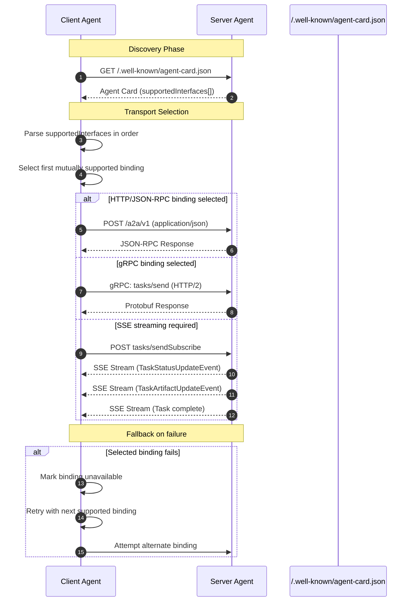

# AESP-0003: Communication Protocols

*Version 1.0.0-Draft | Status: Draft | Category: Standards Track | Date: 2026-07-10*

**Abstract.** This specification defines message formats, transport layer bindings, communication patterns, capability discovery, error handling, security, session management, and multi-agent coordination protocols for Autonomous Engineering Organizations (AEOs) conforming to the AESP standard family.

**Related Specifications.** AESP-0000 (Constitution), AESP-0001 (Core Model), AESP-0002 (Agent Roles)

## 1. Introduction

### 1.1 Purpose and Scope

This specification, AESP-0003 — Communication Protocols, defines the complete communication layer for Autonomous Engineering Organizations (AEOs). It establishes vendor-neutral, interoperable standards governing how autonomous agents exchange messages, negotiate capabilities, manage sessions, handle errors, and coordinate multi-agent workflows. The scope encompasses eight technical domains: message envelope formats and serialization rules; transport layer abstractions and bindings; synchronous and asynchronous communication patterns; protocol negotiation and capability discovery; error handling, retry semantics, and reliability guarantees; security, authentication, and authorization; session management and statefulness; and multi-agent communication topologies including delegation, orchestration, and choreography.

AESP-0003 occupies the communication layer within the AESP specification family. It builds directly upon three foundational specifications. AESP-0000 (Constitution) provides the governance framework and compliance model; every normative requirement inherits the amendment, authority, and audit obligations defined there [^103^]. AESP-0001 (Core Model) defines the agent architecture, identity model, and organizational structure; message addressing and boundary enforcement reference the identity and state models established in that document [^106^][^107^]. AESP-0002 (Agent Roles) specifies the RBAC+ (Role-Based Access Control Plus) 4-layer authorization architecture; all communication permissions are evaluated against the role templates and role assignments established by that specification [^109^][^110^]. Chapter 2 introduces the three-layer architectural model — Data Model, Operations, Transport Bindings — that organizes these eight domains into a coherent framework.

The target audience comprises four practitioner groups. **Protocol implementers** — developers building SDKs, client libraries, and server frameworks — require precise message schemas, state machine definitions, and wire-format specifications. **AEO platform builders** — engineers constructing agent organization infrastructure — require transport binding specifications, scaling patterns, and operational semantics. **Agent framework developers** — authors of LangGraph, CrewAI, AutoGen, and comparable orchestration frameworks — require communication pattern definitions, session management primitives, and multi-agent coordination protocols. **Security architects** require threat model coverage, credential lifecycle specifications, and non-repudiation mechanisms [^104^][^105^].

Conformance to this specification is organized into three tiers. **Tier 1 (Core)** defines mandatory requirements that all implementations MUST satisfy to claim compliance; these cover message envelope format, HTTP(S) transport, request-response patterns, capability discovery, error handling, TLS encryption, and session identification [^103^][^115^]. **Tier 2 (Extended)** defines recommended requirements that implementations SHOULD support for production-grade interoperability; these include WebSocket transport, pub-sub patterns, circuit breaker semantics, and graceful degradation chains [^101^][^102^]. **Tier 3 (Optional)** defines capabilities that implementations MAY support for specialized use cases, including gRPC transport, DID-based authentication, and cross-organizational federation [^118^][^127^].

### 1.2 Document Conventions

#### 1.2.1 Normative Language

The key words "MUST", "MUST NOT", "REQUIRED", "SHALL", "SHALL NOT", "SHOULD", "SHOULD NOT", "RECOMMENDED", "MAY", and "OPTIONAL" in this document are to be interpreted as described in RFC 2119 [^1^]. These terms indicate requirement levels as follows:

- **MUST** / **REQUIRED** / **SHALL**: An absolute requirement of the specification. Implementations that deviate are non-conformant.
- **MUST NOT** / **SHALL NOT**: An absolute prohibition. Implementations that violate this are non-conformant.
- **SHOULD** / **RECOMMENDED**: A recommended practice. Valid reasons may exist to ignore this item, but the full implications must be understood before choosing a different course.
- **SHOULD NOT**: A discouraged practice. Valid reasons may exist, but the implications must be understood.
- **MAY** / **OPTIONAL**: A truly optional item. One implementation may include it while another omits it, and both remain conformant.

Every requirement carries a unique identifier (REQ-001 through REQ-132) enabling traceability from design through implementation to conformance testing [^124^]. Requirements map to functional areas as follows: REQ-001–REQ-010 for message envelopes, REQ-011–REQ-019 for transport, REQ-020–REQ-025 for request-response, REQ-026–REQ-031 for pub-sub, REQ-032–REQ-037 for streaming, REQ-038–REQ-044 for protocol negotiation, REQ-045–REQ-051 for error handling, REQ-052–REQ-062 for security, REQ-063–REQ-068 for sessions, REQ-069–REQ-076 for multi-agent patterns, REQ-077–REQ-089 for compatibility, REQ-090–REQ-102 for quality attributes, REQ-103–REQ-112 for AESP dependencies, REQ-113–REQ-120 for extensibility, and REQ-121–REQ-132 for implicit requirements.

#### 1.2.2 JSON Notation and JSON Schema 2020-12 Conventions

This specification uses JSON as defined in RFC 8259 [^2^] for all message examples and schema definitions. All JSON messages MUST be UTF-8 encoded; implementations MUST reject messages with non-UTF-8 encoding [^4^]. Message schemas are defined using JSON Schema 2020-12 [^3^]. Examples use trailing commas for editorial clarity; implementations MUST NOT include trailing commas in wire-format messages unless the transport binding explicitly permits them [^121^].

### 1.3 Dependencies on Other AESP Specifications

#### 1.3.1 AESP-0000 Governance and Compliance Model Integration

AESP-0000 defines the constitutional framework governing all specifications in the AESP family. This specification MUST comply with the amendment process defined there [^103^]. All protocol implementations MUST be auditable for compliance; security events including authentication attempts, authorization denials, and session lifecycle transitions MUST be logged [^105^]. Protocol version negotiation, capability discovery, and session policy enforcement all operate within the authority delegation model established by AESP-0000 [^104^].

#### 1.3.2 AESP-0001 Agent Architecture and Identity Alignment

AESP-0001 defines the agent identity model, organizational structure, and the work-capability-resource state model. Sender and recipient identifiers in message envelopes MUST conform to the identity format specified there [^107^]. Organizational boundaries MUST be respected by all communication patterns; cross-organizational communication requires explicit authorization and MUST be auditable [^108^]. The session management model aligns with the agent state model from AESP-0001 [^106^].

#### 1.3.3 AESP-0002 RBAC+ 4-Layer Authorization Integration

AESP-0002 specifies the RBAC+ 4-layer authorization architecture comprising Role, Permission, Scope, and Condition layers. This specification MUST integrate with all four layers [^109^]. Every protocol operation — message send, capability query, session creation, task delegation — MUST be subject to role-based access control. Communication permissions MUST be scoped by agent role [^110^]. Agent description documents MUST include role assignments, and authorization decisions SHOULD reference RoleTemplates and RoleAssignments for policy evaluation [^111^][^112^].

### 1.4 Terminology

#### 1.4.1 Core Terms

The following terms are used throughout this specification with the precise meanings defined below.

**Agent**: An autonomous software entity capable of perceiving its environment, making decisions, and taking actions to achieve goals, possessing identity, capabilities, and state as defined in AESP-0001.

**Message**: A discrete unit of communication exchanged between agents, consisting of an envelope containing routing metadata and a payload containing the semantic content.

**Envelope**: The structured metadata wrapper surrounding a message payload, containing fields such as message identifier, timestamp, sender identity, recipient identity, message type, protocol version, and correlation identifiers [^2^].

**Transport Binding**: A concrete mapping of abstract protocol operations to a specific transport protocol (e.g., HTTP/SSE, WebSocket, STDIO) [^11^].

**Communication Pattern**: A reusable interaction structure between agents (request-response, publish-subscribe, streaming, delegation) defining sequencing, directionality, and reliability guarantees.

**Capability**: A declaration of an agent's ability to perform a specific operation or process a specific message type, advertised during protocol negotiation and consumed during task delegation.

**Session**: A bounded period of interaction between agents characterized by shared context, state persistence, and a unique session identifier. Sessions may be stateful or stateless [^29^].

**Task**: A unit of work delegated from one agent to another, characterized by a lifecycle state machine (pending, assigned, in-progress, completed, failed, cancelled) and deliverables [^31^].

#### 1.4.2 Pattern-Specific Terms

**Delegation**: The act of assigning a task from one agent (the delegator) to another (the delegate), accompanied by instructions, constraints, and a scope of authority.

**Orchestration**: A coordination pattern in which a central supervisor agent directs subordinate agents, managing sequencing, data flow, and error handling at the cost of a single point of failure.

**Choreography**: A coordination pattern in which agents interact through shared events without central supervision, scaling better than orchestration but harder to debug [^3^].

**Publish-Subscribe (Pub-Sub)**: A messaging pattern in which publishers broadcast messages to channels without knowledge of subscribers, reducing connection complexity from $O(N^2)$ to $O(N)$ [^10^].

**Streaming**: A communication pattern delivering a sequence of related messages continuously over a persistent connection for real-time progress reporting and incremental result delivery.

**Circuit Breaker**: A resilience pattern preventing cascade failures by rejecting requests to failing agents when failure thresholds are exceeded. Agent systems require semantic validation layers beyond transport-level circuit breakers because LLM failures may return HTTP 200 with valid but incorrect content [^514^].

**Saga**: A pattern managing long-running transactions across agents by decomposing them into local transactions, each with a compensating action for failure recovery.

**Idempotency Key**: A client-generated unique identifier enabling the server to recognize duplicate submissions and ensure at-most-once execution semantics, mandatory for all mutating operations.

#### 1.4.3 Abbreviations and Acronyms

Table 1.1 defines abbreviations and acronyms used throughout this specification.

| Abbreviation | Expansion | Context |
|:---|:---|:---|
| A2A | Agent-to-Agent Protocol | Google-led agent communication protocol |
| ACP | Agent Communication Protocol | IBM-led REST-based agent protocol |
| AEE | Agent Envelope Extension | IETF draft-cowles-aee-00 envelope format |
| AEO | Autonomous Engineering Organization | Organizational form defined by AESP-0000 |
| AESP | Autonomous Engineering Specification Protocol | This specification family |
| AIP | Agent Identity Protocol | IETF draft-prakash-aip-00 |
| ANP | Agent Network Protocol | DID-based decentralized agent protocol |
| AAT | Agent Audit Trail | IETF draft-sharif-agent-audit-trail-00 |
| CBOR | Concise Binary Object Representation | IETF RFC 8949 serialization format |
| DID | Decentralized Identifier | W3C DID Core 1.0 self-sovereign identity |
| DLQ | Dead Letter Queue | Message queue failure handling pattern |
| gRPC | Google Remote Procedure Call | HTTP/2-based RPC framework |
| HTTP | Hypertext Transfer Protocol | IETF RFC 9110/9112/9113 |
| IBCT | Invocation-Bound Capability Token | AIP cryptographic authorization token |
| JWS | JSON Web Signature | IETF RFC 7515 |
| JWT | JSON Web Token | IETF RFC 7519 |
| MCP | Model Context Protocol | Anthropic-led tool access protocol |
| mTLS | Mutual Transport Layer Security | TLS with client certificate authentication |
| NATS | Neural Autonomic Transport System | Lightweight message broker |
| OAuth | Open Authorization | IETF RFC 6749 authorization framework |
| OIDC | OpenID Connect | Identity layer on top of OAuth 2.0 |
| RBAC+ | Role-Based Access Control Plus | AESP-0002 4-layer authorization model |
| REST | Representational State Transfer | Architectural style (Fielding, 2000) |
| RPC | Remote Procedure Call | General distributed computing |
| SSE | Server-Sent Events | W3C / WHATWG server push standard |
| STDIO | Standard Input/Output | Process-local communication |
| TLS | Transport Layer Security | IETF RFC 8446 |
| URI | Uniform Resource Identifier | IETF RFC 3986 |
| WebSocket | WebSocket Protocol | IETF RFC 6455 |
| 0-RTT | Zero Round-Trip Time | TLS 1.3 / QUIC handshake optimization |

Terms appearing in this table are not expanded on first use in body text unless clarification is required.

### 1.5 Relationship to External Standards

#### 1.5.1 JSON-RPC 2.0 Alignment Strategy

This specification adopts JSON-RPC 2.0 [^5^] as the foundational RPC framework. Both MCP and A2A use JSON-RPC 2.0 natively, and the ecosystem provides mature client libraries, debugging tools, and middleware across all major programming languages [^4^][^46^]. JSON-RPC's request/response correlation via explicit message identifiers, batch request support, and structured error objects map directly to agent communication requirements [^18^].

This specification does not mandate JSON-RPC exclusively. A2A's three-layer model demonstrates that the same Data Model and Operations can operate over JSON-RPC and REST/HTTP bindings simultaneously [^355^]. ACP's REST-native approach provides an alternative requiring no SDK [^18^]. Implementations MAY support additional bindings provided they implement the same semantic operations in the Data Model layer.

#### 1.5.2 HTTP/1.1, HTTP/2, WebSocket Standard Compatibility Guarantees

This specification guarantees compatibility with HTTP/1.1 (RFC 9110, RFC 9112) [^6^], HTTP/2 (RFC 9113) [^7^], and WebSocket (RFC 6455) [^8^] as transport substrates. HTTP(S) is the default and REQUIRED transport; all implementations MUST support HTTP/1.1 as a minimum. HTTP/2 multiplexing solves the six-connections-per-domain limitation for Server-Sent Events, enabling 100+ concurrent streams over a single TCP connection [^37^]. WebSocket transport is RECOMMENDED for bidirectional streaming scenarios such as human-in-the-loop approval flows [^10^]. No protocol extensions that break standard HTTP semantics are permitted [^88^].

#### 1.5.3 Referenced IETF and W3C Standards

Table 1.2 enumerates the external standards normatively referenced by this specification.

| Standard | Reference | Version / Edition | Role in This Specification |
|:---|:---|:---|:---|
| RFC 2119 | Bradner, 1997 | March 1997 | Normative language key words [^1^] |
| RFC 3986 | Berners-Lee et al., 2005 | January 2005 | URI syntax for agent addressing |
| RFC 6455 | Fette & Melnikov, 2011 | December 2011 | WebSocket transport binding [^8^] |
| RFC 6749 | Hardt, 2012 | October 2012 | OAuth 2.0 authorization framework |
| RFC 7515 | Bradley et al., 2015 | May 2015 | JSON Web Signature for message signing |
| RFC 7519 | Jones et al., 2015 | May 2015 | JSON Web Token for authentication |
| RFC 8259 | Bray, 2017 | December 2017 | JSON serialization format [^2^] |
| RFC 8446 | Rescorla, 2018 | August 2018 | TLS 1.3 transport security |
| RFC 8615 | Nottingham, 2019 | May 2019 | Well-known URI discovery mechanism |
| RFC 8785 | Rundgren et al., 2020 | June 2020 | Canonical JSON for deterministic signing |
| RFC 8949 | Bormann & Hoffman, 2020 | December 2020 | CBOR binary serialization (optional) |
| RFC 9110 | Fielding et al., 2022 | June 2022 | HTTP semantics [^6^] |
| RFC 9112 | Fielding et al., 2022 | June 2022 | HTTP/1.1 message syntax [^6^] |
| RFC 9113 | Thomson & Beniest, 2022 | June 2022 | HTTP/2 frame layer [^7^] |
| RFC 9205 | Nottingham, 2022 | June 2022 | HTTP API best practices |
| JSON-RPC 2.0 | JSON-RPC WG, 2013 | March 2013 | RPC message format foundation [^5^] |
| JSON Schema 2020-12 | Wright et al., 2021 | December 2021 | Schema validation vocabulary [^3^] |
| W3C DID Core 1.0 | W3C, 2022 | July 2022 | Decentralized identifier standard |
| W3C Trace Context 1.0 | W3C, 2021 | November 2021 | Distributed tracing correlation |
| SSE (WHATWG) | WHATWG, 2024 | Living standard | Server-to-client streaming [^12^] |

Standards marked as "Living standard" are subject to ongoing revision; implementations SHOULD track the latest published version while maintaining backward compatibility.

---

## 2. Core Architecture and Protocol Stack

The architecture of AESP-0003 is organized around a three-layer model that separates data representation from operational semantics from transport mechanics — the single most important structural decision for ensuring the protocol can evolve across years of deployment without rewriting core logic. The three layers — Data Model, Operations, and Transport Bindings — were identified through comparative analysis of A2A [^12^], ANP [^21^], MCP [^41^], and AEE [^1^] as the convergent pattern across all major agent communication specifications. Each protocol independently arrived at the same tripartite division, providing strong evidence that this architecture reflects intrinsic properties of agent communication rather than arbitrary design preference.

### 2.1 Three-Layer Architectural Model

#### 2.1.1 Data Model Layer

The Data Model layer defines the structural contracts that all AESP-0003 messages MUST satisfy: field names, types, cardinality, serialization rules, and content type negotiation mechanisms. The foundational construct is the message envelope — a self-describing, transport-independent container carrying routing metadata, correlation identifiers, and the application payload as distinct, separable regions.

AESP-0003 adopts the AEE (Agent Envelope Exchange, IETF draft-cowles-aee-00) 14-field envelope as its canonical Data Model reference [^1^]. The envelope comprises ten required fields — `v`, `id`, `ts`, `type`, `from`, `to`, `intent`, `corr`, `priority`, and `payload` — together with four optional fields: `reply_to`, `trace`, `requires`, and `sig` [^2^]. This field set addresses four deficiencies in existing agent communication: no standard envelope format, lost causality without standardized correlation, coupled semantics where container and content are conflated, and human exclusion from the messaging model [^3^].

Serialization at the Data Model layer MUST support JSON (RFC 8259) as the canonical text representation. JSON was selected because human readability and debuggability are first-class constraints. Implementations MAY support additional formats (MessagePack, CBOR per RFC 8949, or Protocol Buffers) through content type negotiation, but JSON MUST remain the mandatory default. While binary formats deliver 10–20× parse speed improvement over JSON [^26^], these gains are secondary to the operational requirement that a developer can read a message from a log file without decoding tools.

Content type negotiation follows HTTP semantics (RFC 9110, Section 12). The sender advertises capabilities via `Accept`; the responder indicates the chosen format via `Content-Type`. Version negotiation occurs through the envelope `v` field, supplemented by protocol-version headers. This dual mechanism ensures version disagreements are detected at the earliest possible layer.

#### 2.1.2 Operations Layer

The Operations layer defines the communication patterns, state machines, and error handling rules that govern how agents exchange messages. It is concerned with the temporal and causal dimensions of communication — request-response lifecycles, streaming subscriptions, pub-sub topic semantics, and task state transitions.

AESP-0003 specifies four core interaction patterns at the Operations layer. First, synchronous request-response, derived from JSON-RPC 2.0 [^8^]. Second, server-sent streaming, where a client receives a temporally ordered sequence of update events. Third, publish-subscribe broadcast for one-to-many communication. Fourth, asynchronous task delegation with progress updates via streaming, push notification (webhook), or polling.

The Operations layer defines a two-level error taxonomy. Transport-level failures (connection timeout, TLS failure) are distinguished from application-level failures (invalid schema, unauthorized operation, semantic validation failure). This distinction is necessary because agent systems face a unique failure mode: an LLM hallucination may return HTTP 200 with valid JSON, appearing as a success to transport-level monitoring while being semantically wrong [^514^]. Circuit breakers address transport failures; semantic validation addresses content failures.

State machine semantics are specified for long-running operations. A task progresses through: `submitted` → `working` → `completed`/`failed`, with additional states `input_required` (paused for human approval) and `cancelled`. The `input_required` state reflects that agent workflows frequently require mid-execution human input that traditional RPC protocols do not accommodate.

#### 2.1.3 Transport Bindings Layer

The Transport Bindings layer defines how envelopes and operations are mapped onto concrete transport protocols. This layer handles framing, connection management, and delivery guarantees. The critical principle is that this layer contains no message semantics — it is a pure carrier responsible only for moving serialized envelopes from sender to receiver.

AESP-0003 defines multiple transport bindings. The HTTP binding uses POST with optional SSE upgrade for streaming. The WebSocket binding provides full-duplex communication for bidirectional streaming. The gRPC binding delivers high-performance internal communication with 3–10× smaller payloads and p99 latency of ~53 ms versus 1,245 ms for REST at 5,000 data points per call [^20^]. Message broker bindings (NATS, Kafka, Redis Streams) support event-driven architectures. The local stdio binding supports single-process agent-tool communication with sub-millisecond latency [^26^].

Each binding specification defines: (a) wire format; (b) connection semantics — lifecycle, keepalive, and reconnection; (c) delivery guarantees — at-most-once, at-least-once, or exactly-once; (d) security requirements — TLS, certificate validation, and authentication; and (e) quality-of-service controls — flow control and backpressure.

#### 2.1.4 Layer Interaction Rules

The three layers interact under strict rules designed to maximize independent evolvability. First, upward dependencies only: the Transport Bindings layer depends on the Operations layer for framing rules, and the Operations layer depends on the Data Model layer for message structure — but no layer may depend on a layer above it. The Data Model has no knowledge of operations or transports.

Second, no circular coupling: a change to the HTTP binding MUST NOT require changes to the task state machine, and a change to the error taxonomy MUST NOT require changes to envelope field definitions. Third, each layer is independently versionable. The envelope schema version evolves independently of the operations protocol version and independently of any transport binding version. Fourth, unknown fields at any layer MUST be ignored by conforming implementations [^6^], ensuring that extensions do not break existing implementations.

Table 1 compares the three-layer model across major agent protocols.

| Layer | A2A [^12^] | ANP [^21^] | MCP [^41^] | AEE [^1^] | AESP-0003 |
|-------|------------|------------|------------|-----------|-----------|
| Data Model | Task, Message, AgentCard, Part, Artifact | JSON-LD Agent Description, schema.org vocabulary | JSON-RPC 2.0 Request/Response/Notification | 14-field JSON envelope (v, id, ts, type, from, to, intent, corr, payload, etc.) | AEE-derived envelope with extensible payload |
| Operations | Send Message, Get Task, Cancel Task, Subscribe | Meta-protocol negotiation (ANP-06), DID-based messaging | Initialize handshake, tools/list, resources/read, prompts/get | Intent-based routing with requires constraints | 4 core patterns: request-response, streaming, pub-sub, async delegation |
| Transport Bindings | HTTP/SSE, gRPC (v0.3+), HTTP/REST | HTTPS, DID-based secure messaging | stdio (local), Streamable HTTP (remote) | HTTP, WebSocket, NATS, Kafka, Redis Streams | HTTP/SSE, WebSocket, gRPC, NATS, Kafka, Redis Streams, stdio |

The convergence in Table 1 is substantial. A2A organizes into Layer 1 (Canonical Data Model), Layer 2 (A2A Operations), and Layer 3 (Protocol Bindings) [^12^] [^581^]. ANP adopts Identity and Encrypted Communication at the base, Meta-Protocol in the middle, and Application Protocol at the top [^21^] [^504^]. MCP's transport/tool logic separation makes migration "a transport swap, not a rewrite" [^41^]. AEE supports "HTTP, WebSocket, NATS, Kafka, Redis Streams, or any other reliable or unreliable channel" [^4^]. This independent convergence across four protocols provides strong evidence that the three-layer model is a structural property of agent communication.

### 2.2 Transport-Agnostic Design Principles

#### 2.2.1 Separation of Message Semantics from Transport Mechanics

The separation of message semantics from transport mechanics is the single most important architectural decision for protocol longevity. When semantics are bound to a specific transport, the protocol inherits all constraints of that transport. When independent, the protocol can migrate to new transports as infrastructure evolves.

MCP provides the clearest evidence. MCP originally used stdio as its local transport, achieving ~0.3–1 ms p50 latency but creating operational difficulties at scale: no transport-layer auth, no audit point, and process coupling [^27^] [^28^]. In March 2025, MCP deprecated dual-endpoint SSE for Streamable HTTP [^14^] — enabled because MCP's transport abstraction separates mechanics from semantics. Tool definitions, request structures, and response formats remained unchanged while the wire transport was replaced [^41^].

AESP-0003 enforces this separation through normative layering: the Data Model and Operations specifications contain no transport-specific references. An envelope's `from` and `to` fields contain logical identifiers, not IP addresses. The `corr` field is meaningful over HTTP, NATS, or Kafka.

#### 2.2.2 Forward Compatibility Rule

Forward compatibility is achieved through a single normative rule: unknown fields MUST be ignored by conforming implementations [^6^]. This applies at all three layers. At the Data Model, an envelope containing unrecognized fields MUST be processed using recognized fields only. At the Operations layer, an unsupported operation type MUST elicit a standardized error response. At the Transport Bindings layer, unknown transport extensions MUST be ignored. This rule has proven effective across decades of protocol evolution — Protocol Buffers' field number preservation and HTTP's extension through new headers both operate on the same principle [^25^].

#### 2.2.3 Convergence Evidence

The transport-agnostic three-layer model has been independently validated by four distinct protocol efforts. A2A's model enables transport independence — "the same agent logic works over JSON-RPC, gRPC, or HTTP/REST without modification" [^12^] [^581^]. ANP's meta-protocol (ANP-06) enables dynamic protocol negotiation between agents [^506^]. AEE's envelope is explicitly transport-agnostic [^4^]. MCP's stdio-to-HTTP migration validates that layer independence enables protocol evolution without rewrites [^41^]. This convergence reflects a fundamental truth: data models evolve slowly, operations evolve moderately, and transports evolve rapidly. Separating these concerns into independently versionable layers allows each to evolve at its natural rate.

### 2.3 Conformance Tiers

AESP-0003 defines three conformance tiers to enable incremental adoption. An implementation MAY claim conformance to any tier, and the tier claimed MUST be documented in capability advertisements.

#### 2.3.1 Tier 1 — Core Conformance

Tier 1 conformance represents the minimum viable implementation. A Tier 1 implementation MUST support: (a) HTTP/1.1 or HTTP/2 as transport, with TLS 1.2 or higher; (b) JSON serialization (RFC 8259) as the mandatory data format; (c) synchronous request-response with proper identifier correlation and timeout handling; (d) the standardized two-level error taxonomy; and (e) the complete AEE-derived envelope with all ten required fields validated.

Tier 1 corresponds to AEE's MVE-Required conformance level [^5^]. HTTP was selected as the Tier 1 transport because it provides universal firewall compatibility, existing authentication infrastructure, and mature load balancing — characteristics shared by A2A [^2^], ACP [^1^], and ANP [^43^] as their default transports.

#### 2.3.2 Tier 2 — Extended Conformance

Tier 2 adds capabilities that SHOULD be implemented by production agents requiring streaming or async coordination. A Tier 2 implementation MUST satisfy all Tier 1 requirements and additionally support: (a) Server-Sent Events (SSE) for server-to-client streaming; (b) publish-subscribe messaging with topic hierarchies and wildcard subscription; (c) async task delegation with the full state machine (submitted, working, completed, failed, input_required, cancelled); (d) circuit breaker and retry with exponential backoff and jitter; and (e) OAuth 2.0 Client Credentials for authentication.

SSE dominates for agent token streaming because it works over standard HTTP with automatic reconnection [^8^]. Pub-sub reduces connection complexity from O(N²) to O(N) [^9^]. Circuit breaker composition — bulkhead first, then circuit breaker, then retry, then fallback — is essential for agent-to-agent calls [^38^] [^39^].

#### 2.3.3 Tier 3 — Optional Conformance

Tier 3 defines capabilities that MAY be implemented for specialized deployments. A Tier 3 implementation MUST satisfy all Tier 2 requirements and MAY support: (a) WebSocket for bidirectional real-time communication; (b) gRPC for high-performance internal service-to-service communication; (c) DID-based authentication per W3C DID Core with `did:wba` for 0-RTT verification [^603^]; (d) message-level encryption using JWE or COSE; and (e) saga patterns for long-running distributed transactions.

gRPC was added to A2A in v0.3 as a higher-performance alternative, delivering 3–10× smaller payloads and lower p99 latency than REST [^20^] [^22^]. WebSocket excels for bidirectional collaboration with human-in-the-loop approvals [^16^]. SagaLLM (PVLDB 2025) extends saga patterns to LLM-based multi-agent systems with automated compensation generation [^7^].

Table 2 summarizes transport binding characteristics across conformance tiers.

| Transport | Tier | Delivery Guarantee | Latency (typical) | Payload Efficiency | Connection Model | Best For |
|-----------|------|--------------------|--------------------|--------------------|--------------------|----------|
| HTTP/1.1 + TLS | 1 (Core) | At-least-once with retry | 5–15 ms per request | JSON (baseline) | Stateless per-request | Universal baseline, firewall-friendly |
| HTTP/2 + TLS | 1 (Core) | At-least-once with retry | 3–10 ms per request | JSON with header compression | Multiplexed persistent | High-throughput enterprise |
| SSE over HTTP | 2 (Extended) | At-least-once with reconnect | 48 ms event latency [^11^] | JSON text stream | Persistent, auto-reconnect | Token streaming, progress updates |
| NATS | 2 (Extended) | At-most-once (core), at-least-once (JetStream) | Sub-millisecond p99 [^31^] | Binary (subject + payload) | Persistent subject-based | Lightweight edge-to-cloud messaging |
| WebSocket | 3 (Optional) | At-least-once with app-level ack | 45 ms round-trip [^11^] | JSON or binary frames | Stateful full-duplex | Bidirectional collaboration, interrupts |
| gRPC over HTTP/2 | 3 (Optional) | At-most-once (unary), streaming (bidi) | 53 ms p99 at 5K points/call [^20^] | Protobuf (33% of JSON size) [^24^] | Multiplexed HTTP/2 streams | Internal high-performance mesh |
| Kafka | 3 (Optional) | At-least-once (default), exactly-once (transactional) | 20–100 ms p99 [^33^] | Binary with schema | Persistent log with replay | Durable event streaming, audit trails |

The progression reflects a deliberate tradeoff. Tier 1 maximizes interoperability — every language has an HTTP client, every developer can debug JSON, and every firewall allows HTTPS. Tier 2 adds streaming and async patterns for production agents. Tier 3 provides high-performance and advanced security where infrastructure supports it. A minimal agent can be implemented in hours (Tier 1); production deployments scale to enterprise requirements (Tiers 2–3).

### 2.4 Design Principles

#### 2.4.1 Human Readability and Debuggability

JSON canonical format is a non-negotiable requirement. All normative examples use JSON. All mandatory envelope fields use human-readable string values. Error messages SHOULD include human-readable descriptions alongside machine-processable codes.

This principle acknowledges that debugging distributed failures across multiple agent systems is the most expensive activity in protocol development. Engineers MUST inspect messages at every hop without specialized tooling. Binary-only protocols sacrifice this for performance gains that are often irrelevant: HTTP's 5–10 ms overhead is negligible compared to LLM inference times of 500 ms–5 s [^26^]. For high-throughput scenarios, a hybrid strategy is recommended: JSON envelopes for debuggable routing metadata, binary payloads for data-intensive content.

#### 2.4.2 Idempotency as Non-Negotiable Default

Exactly-once delivery is theoretically impossible in distributed systems — the two generals' problem establishes this limit [^52^]. All practical systems deliver at-least-once, and the consumer MUST handle duplicates. AESP-0003 mandates idempotency as the default.

Every operation envelope MUST include an `idempotency_key`, scoped to the sending entity and operation intent. The receiver MUST deduplicate based on this key, with recommended TTL of 24 hours for synchronous operations and 7 days for async tasks. Matching key and payload returns the cached response; matching key with differing payload MUST be rejected as a conflict. This extends to all patterns: pub-sub deduplication, saga compensations (where 80% of saga failures originate from non-idempotent compensations [^7^]), and background agent tasks requiring "dedupe keys just as much as payment APIs do" [^7^].

#### 2.4.3 Event-Driven Architecture as the Async Backbone

AESP-0003 adopts a hybrid model: request-response for intra-agent tool calls (fast, synchronous, deterministic) and events for inter-agent coordination (decoupled, asynchronous, scalable). Tool calls complete in milliseconds; delegated tasks execute over minutes or hours, requiring progress updates and resumption after disconnections.

The event-driven backbone provides complete audit trails through immutable event logs, state reconstruction via replay, and decoupled scaling. Event sourcing has been demonstrated in multi-agent systems with heterogeneous LLMs [^9^], and aligns with production streaming architectures using Kafka or NATS as the durable backbone.

#### 2.4.4 Defense in Depth

Security in AESP-0003 is a layered, independently evolvable stack. Layer 1 — transport security: TLS 1.2 or higher. Layer 2 — authentication: Tier 1 MUST support API key, OAuth 2.0, or mTLS; Tier 3 MAY support DID-based auth with `did:wba` for 0-RTT [^603^]. Layer 3 — authorization using capability-based access control with attenuated capability tokens per the IETF Agent Identity Protocol [^8^]. Layer 4 — message-level encryption (JWE or COSE) independent of transport TLS. Layer 5 — audit: tamper-evident hash-chained records per the IETF Agent Audit Trail, addressing EU AI Act requirements from L0 (no verification) to L4 (full mutual auth) [^8^].

Each layer upgrades independently — a TLS vulnerability does not require authorization changes; new auth mechanisms can be added without transport changes. This independence is essential for long-term protocol security.

The following JSON Schema defines the TransportBinding structure used for capability advertisement and transport negotiation.

```json
{
  "$schema": "https://json-schema.org/draft/2020-12/schema",
  "$id": "https://aesp-0003.org/schemas/transport-binding/v1",
  "title": "TransportBinding",
  "description": "A transport binding declaration for AESP-0003 capability advertisement. Agents list supported bindings in preference order; clients select the first mutually supported option.",
  "type": "object",
  "required": ["protocolBinding", "protocolVersion", "url"],
  "properties": {
    "protocolBinding": {
      "type": "string",
      "description": "The transport protocol binding identifier.",
      "enum": [
        "HTTP_JSONRPC", "HTTP_REST", "SSE", "WEBSOCKET",
        "GRPC", "NATS", "KAFKA", "REDIS_STREAMS", "STDIO"
      ]
    },
    "protocolVersion": {
      "type": "string",
      "description": "Version of the binding specification, in SemVer format.",
      "examples": ["1.0.0", "2.1.0"]
    },
    "url": {
      "type": "string",
      "format": "uri",
      "description": "Endpoint address for this binding. Format depends on protocolBinding."
    },
    "priority": {
      "type": "integer",
      "minimum": 0,
      "description": "Preference order. Lower values indicate higher priority."
    },
    "capabilities": {
      "type": "object",
      "properties": {
        "streaming": { "type": "boolean" },
        "bidirectional": { "type": "boolean" },
        "multiplexing": { "type": "boolean" },
        "deliveryGuarantee": {
          "type": "string",
          "enum": ["at_most_once", "at_least_once", "exactly_once"]
        },
        "tlsRequired": { "type": "boolean", "default": true },
        "authSchemes": {
          "type": "array",
          "items": { "type": "string", "enum": ["api_key", "oauth2", "mtls", "did"] }
        }
      }
    },
    "qos": {
      "type": "object",
      "properties": {
        "maxMessageSize": { "type": "integer" },
        "maxConcurrentStreams": { "type": "integer" },
        "heartbeatIntervalMs": { "type": "integer" }
      }
    }
  },
  "additionalProperties": true,
  "description": "Additional binding-specific parameters MAY be included. Unknown properties MUST be ignored."
}
```

The following Mermaid sequence diagram illustrates the transport selection flow during capability negotiation.



This architecture — three layers, transport-agnostic envelopes, forward compatibility, tiered conformance, and defense-in-depth security — provides the foundation for all subsequent chapters. Chapter 3 specifies the Data Model: envelope schema, field semantics, validation rules, and serialization. Chapter 4 specifies Transport Bindings: HTTP/SSE, WebSocket, gRPC, and message broker mappings. Chapters 5–8 cover the Operations layer: request-response, streaming, pub-sub, and multi-agent coordination. Security mechanisms are in Chapters 9–10, and the conformance test suite in Chapter 11.

---

## 3. Message Envelope and Serialization

Every agent communication protocol requires a common data model that answers three questions: what is being sent, who sent it, and why. This chapter defines the AESP-0003 Message Envelope — the canonical data structure all subsequent chapters build upon — together with serialization rules, content type negotiation, batching semantics, error representation, and CloudEvents integration. The specification adopts the principle from the Agent Envelope Exchange (AEE) Internet-Draft [^1^] that routing metadata MUST be separated from application payload so intermediaries can validate, route, and trace messages without parsing content they do not own.

The chapter draws from comparative analysis of five contemporary agent protocols — AEE [^2^], MCP [^7^], A2A [^12^], ACP [^15^], and ANP [^19^] — together with messaging patterns from AMQP 1.0 [^27^], MQTT 5.0 [^29^], and gRPC [^31^]. The result is a single envelope design with two conformance tiers, multiple serialization options, and explicit extension points.

---

### 3.1 Message Envelope Structure

The AESP-0003 message envelope is a JSON object with a fixed set of top-level fields following AEE's separation-of-concerns model: envelope fields handle identity, routing, correlation, and provenance; the `payload` field contains application-specific data [^2^]. Two conformance tiers support both full-featured and constrained deployments.

#### 3.1.1 MVE-Required Tier

Tier 1 implementations MUST support the MVE-Required (Minimum Viable Envelope — Required) tier consisting of 10 fields. These fields provide the minimum information necessary for message identity, routing, typing, correlation, tracing, and content negotiation across any transport.

**Table 1: MVE-Required Envelope Field Comparison across Agent Protocols**

| Field | AESP-0003 | AEE [^2^] | MCP [^7^] | A2A [^12^] | ACP [^15^] | Purpose |
|-------|-----------|-----------|-----------|------------|------------|---------|
| messageId | `messageId` | `id` | `id` | `messageId` | implicit | Unique message identifier |
| timestamp | `timestamp` | `ts` | n/a | n/a | implicit | Creation time (ISO 8601) |
| sender | `sender` | `from` | n/a | n/a | implicit | Originating entity ID |
| recipient | `recipient` | `to` | n/a | n/a | implicit | Destination entity or channel |
| messageType | `messageType` | `type` | method/result/error | `role` + `parts` | MessagePart type | Message classification |
| protocolVersion | `protocolVersion` | `v` | `jsonrpc: "2.0"` | n/a | n/a | Protocol version identifier |
| payload | `payload` | `payload` | `params` / `result` | `parts[]` | `MessagePart[]` | Application data |
| correlationId | `correlationId` | `corr` | n/a | `taskId` | session ID | Causal chain linkage |
| traceContext | `traceContext` | `trace` | n/a | n/a | n/a | W3C Trace Context |
| contentType | `contentType` | n/a | n/a | MIME in Part | MIME type | Payload media type |

AESP-0003 unifies concepts expressed differently across protocols: `sender`/`recipient` replace AEE's `from`/`to` for clarity; `protocolVersion` replaces MCP's embedded `jsonrpc: "2.0"`; `contentType`, drawn from ACP's MIME-typed MessageParts [^16^], enables multi-modal negotiation without payload inspection; `traceContext` implements W3C Trace Context (§3.1.5). The formal JSON Schema is specified in §3.1.6.

#### 3.1.2 MVE-5 Tier

For constrained environments — embedded devices, high-frequency telemetry, or bandwidth-limited edge deployments — the MVE-5 tier reduces the envelope to five mandatory fields: `messageId`, `timestamp`, `sender`, `recipient`, and `payload`. All other fields from the MVE-Required tier are omitted. MVE-5 messages are "log-friendly only" in the AEE sense [^5^]: they support fire-and-forget transmission and basic logging but lack correlation, tracing, and content type information. A recipient receiving an MVE-5 message MUST treat absent optional fields as having their type-appropriate default values (empty string for string fields, `null` for object fields).

MVE-5 is NOT sufficient for request-response interactions, multi-hop agent delegation, or any scenario requiring causal tracing. Implementations that support only MVE-5 MUST NOT initiate request messages — they MAY send notifications only.

#### 3.1.3 Message Type and Kind Classification

The `messageType` field classifies messages according to both their structural kind and their interaction semantics. The kind component indicates the message's role in a conversation, while the type component indicates its payload category.

**Kind values** (prefix before the `/` separator): `request`, `response`, `notification`, `stream-open`, `stream-data`, `stream-close`, `error`. A request message expects a response; a notification MUST NOT receive a response; stream messages carry streaming payload segments; an error message carries an ErrorPayload (§3.6).

**Type values** (suffix after the `/` separator): `task`, `event`, `status`, `artifact`, `control`. The complete `messageType` field is formed as `{kind}/{type}`, for example: `request/task`, `notification/event`, `stream-data/artifact`, `error/control`.

This two-level classification enables routing decisions based on kind alone. An intermediary can forward all `stream-*` messages to a streaming handler and all `error/*` messages to an error handler without parsing the payload or understanding type-specific semantics.

#### 3.1.4 Protocol Version Field

The `protocolVersion` field carries a semantic version string in the form `MAJOR.MINOR.PATCH`, as defined by Semantic Versioning 2.0.0. The current protocol version is `1.0.0`. Version negotiation follows an initiator-proposes, responder-selects pattern: the initiating agent sends its maximum supported version; the responder replies with the version it will use for the session, which MUST be less than or equal to the initiator's proposed version. If the responder cannot support any version acceptable to the initiator, it MUST respond with an error using code `-32101` (incompatible protocol version).

Forward compatibility is enforced by a strict rule: unknown top-level fields MUST be ignored by consumers [^6^]. This ensures that a `1.1.x` or `2.0.x` producer can send messages to a `1.0.x` consumer without breaking interoperability, provided the consumer follows the ignore-unknown-fields rule. Th