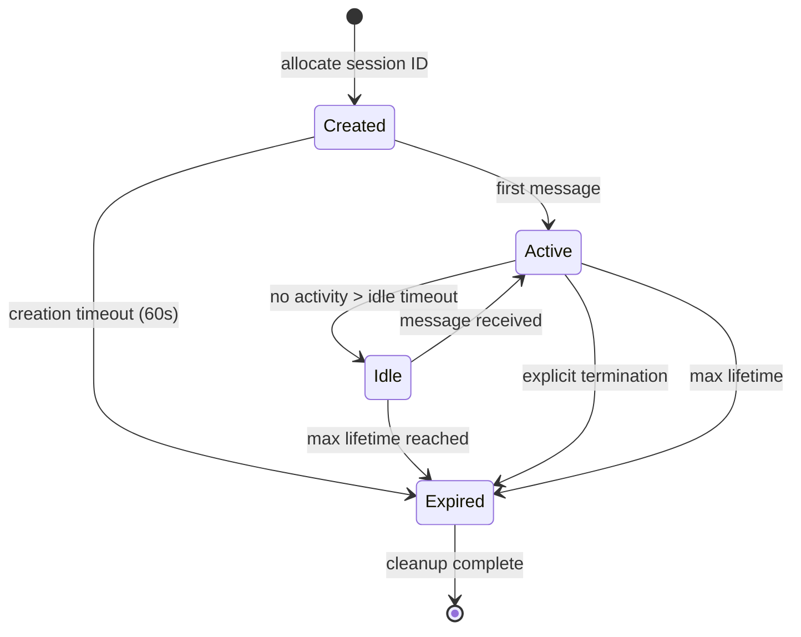
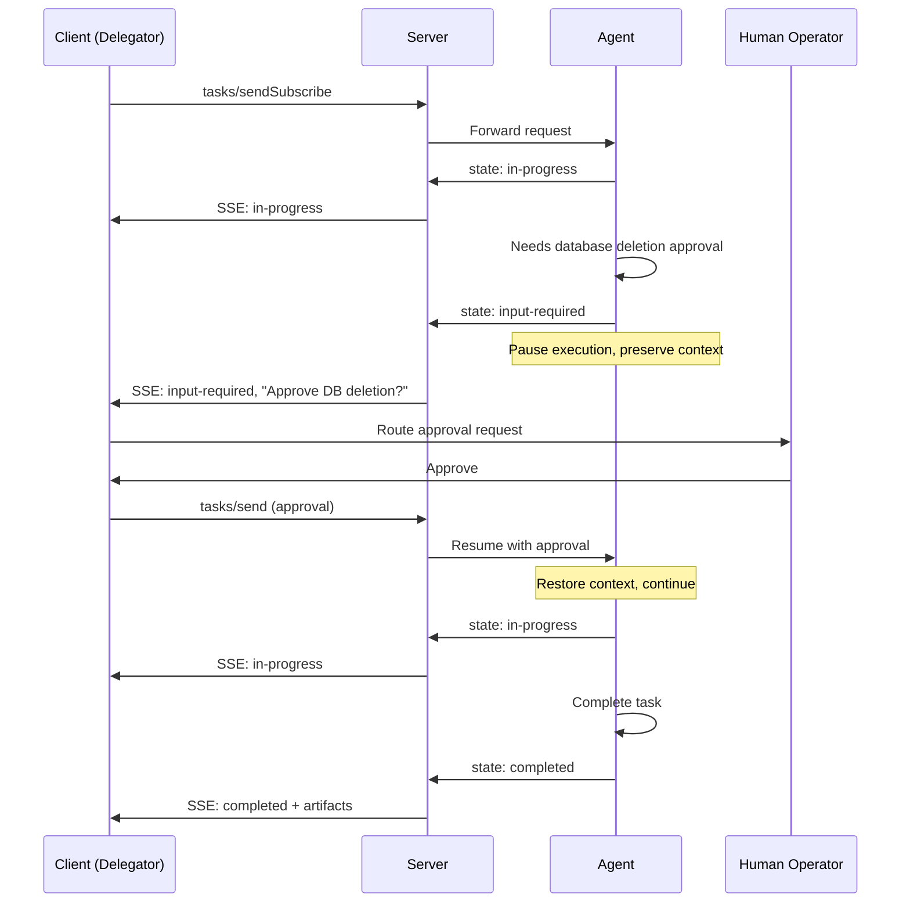
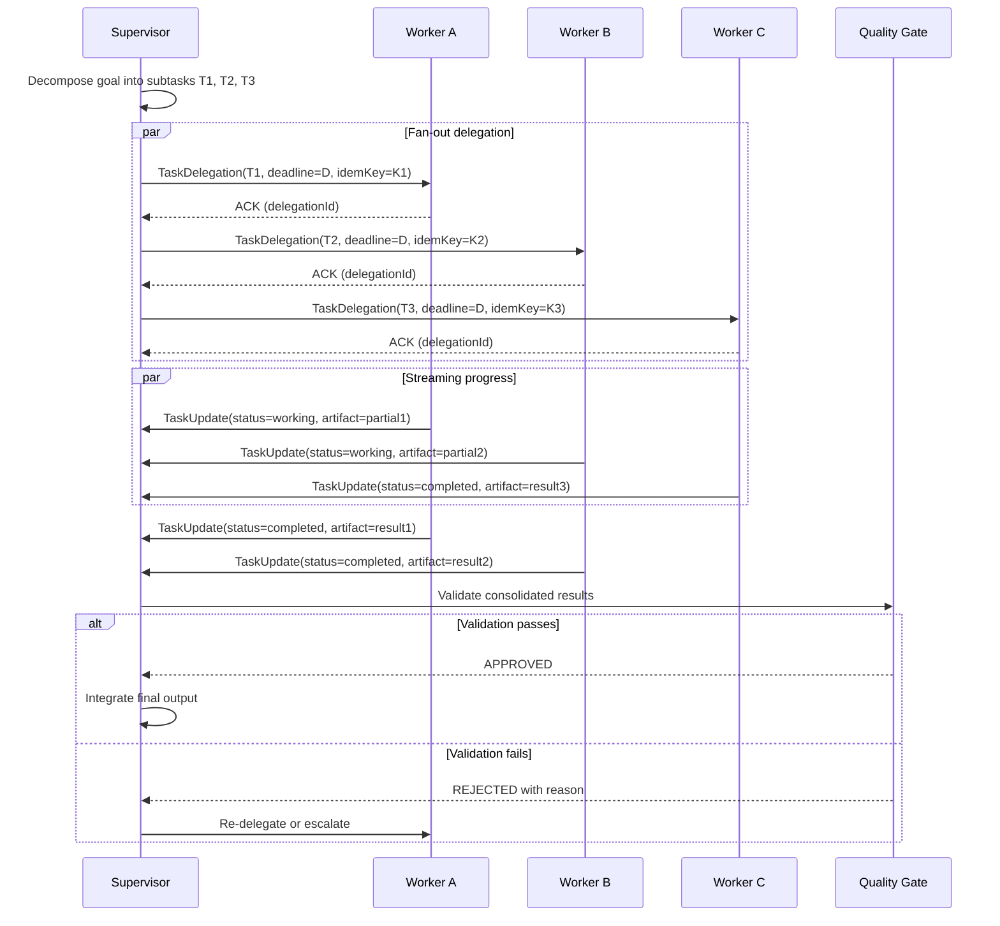

## 9. Session Management

Agent communication is fundamentally conversational. Unlike stateless API calls that complete in a single request-response pair, agent tasks span multiple turns, delegate sub-tasks to peers, pause for human approval, and resume after crashes. Session management provides the structural framework that makes these long-running, multi-party interactions reliable, recoverable, and scalable. This chapter defines session identification, lifecycle semantics, stateful and stateless operational modes, task state machines, context management strategies, and the formal input-required primitive that distinguishes agent protocols from traditional RPC.

### 9.1 Session Identification

Every session within AESP-0003 MUST carry a unique identifier generated with minimum 128-bit entropy to prevent prediction attacks across the expected deployment lifetime. The session identifier serves as the root correlation key linking all messages, state transitions, and audit records within a single conversational context.

#### 9.1.1 Session ID Formats

The protocol supports three transport bindings for session identification, listed in order of preference.

**HTTP cookie-based sessions** follow RFC 6265 semantics with `Secure`, `HttpOnly`, and `SameSite=Strict` attributes. The cookie value MUST contain the session identifier encoded as URL-safe base64 of at least 22 characters (128 bits of entropy). This binding is preferred for browser-embedded agents and human-in-the-loop workflows where the agent runs within a web application context.

**Header-based sessions** use the `AESP-Session-Id` HTTP header for explicit per-request session binding. (The MCP protocol historically used `Mcp-Session-Id`, now deprecated following SEP-2575; see Section 9.3.1.) Header propagation is preferred for server-to-server agent communication where cookie semantics do not apply. Servers MUST reject requests missing a session identifier in stateful mode with HTTP 400 and error code `SESSION_ID_REQUIRED`.

**URL parameter-based sessions** using `?session_id=` are supported only as a fallback for transports that cannot carry headers, such as certain WebSocket upgrade paths or legacy SSE endpoints. This binding SHOULD be avoided in production because query strings may appear in server logs, proxy caches, and referrer headers, creating an information disclosure risk.

#### 9.1.2 CSPRNG Generation and Rotation

Session identifiers MUST be generated using a Cryptographically Secure Pseudo-Random Number Generator (CSPRNG). Implementations MUST NOT use `Math.random()` or equivalent non-cryptographic sources. Suitable sources include `/dev/urandom` on POSIX systems, `getrandom(2)` on Linux, or platform-specific equivalents such as Java's `SecureRandom`.

Session identifiers MUST be rotated upon any privilege change: authentication escalation (anonymous to authenticated), role change (read-only to read-write), capability grant (additional tool permissions), or delegation acceptance (becoming a sub-agent of another entity). Rotation generates a new identifier while preserving session state; the old identifier MUST be invalidated within 30 seconds. This limits the blast radius of session fixation attacks in multi-agent delegation chains where compromised intermediate agents could replay captured identifiers.

#### 9.1.3 Context Propagation Across Delegation Boundaries

When an agent delegates a sub-task, three context identifiers MUST propagate across the delegation boundary.

The **`sessionId`** identifies the root conversational context. All agents participating in a single user request share the same root session identifier, enabling distributed tracing and audit correlation.

The **`correlationId`** (called `contextId` in A2A [^16^]) groups related tasks within a session. When an agent decomposes a request into parallel sub-tasks, each receives the same correlation identifier, allowing the delegator to aggregate results and detect completion across the group.

The **`traceContext`** follows W3C Trace Context (traceparent/tracestate) semantics. Each hop in a delegation chain generates a new span identifier while preserving the trace identifier, enabling end-to-end latency analysis across agent boundaries.

The combination of these three identifiers—session for conversation scoping, correlation for task grouping, and trace for observability—provides the minimum viable context propagation model. Implementations MAY extend this with custom context keys for domain-specific needs (tenant isolation, cost attribution), but MUST preserve the three standard identifiers through every protocol operation.

### 9.2 Session Lifecycle

A session progresses through well-defined states from creation to termination, with explicit semantics for idle management, cleanup, and recovery after restart.

#### 9.2.1 Session States

The lifecycle defines four primary states.

**Created**: The session is allocated but has not processed any message. It remains in this state until the first message arrives or a 60-second timeout elapses.

**Active**: The session has received at least one message and is processing turns. Transitions to active occur on any message exchange, including task submissions, status queries, and heartbeats.

**Idle**: No message has been received within the idle timeout period (default 30 minutes; see Section 9.2.2). Context remains in the store but the server MAY reduce resource allocation. The session transitions back to active on the next message.

**Expired**: The session reached maximum lifetime, was explicitly closed, or failed health checks. All resources are released, participants are notified, and state is archived. Session identifiers MUST NOT be reused.



**Figure 9.1** — Session lifecycle: created → active → idle → expired. Heartbeats during active operation reset the idle timer.

#### 9.2.2 Idle Timeout and Heartbeat

The default idle timeout is 30 minutes, advertised to clients via `idleTimeoutSeconds` in the session creation response. Heartbeat messages (JSON-RPC `$/heartbeat` or protocol `ping`) reset the idle timer. Servers SHOULD send heartbeats at intervals no greater than half the idle timeout to detect half-open connections where the client has crashed but TCP remains established.

If a session transitions to idle, the server MAY externalize state to storage and evict from memory. Upon receiving a new message, the server reloads state transparently to the client.

#### 9.2.3 Explicit Termination

Any participant MAY initiate termination via `session/terminate`. Upon receipt, the server MUST: mark the session expired; release all resources including tool connections and model slots; notify all participants via registered callbacks; write a final snapshot for audit; and respond with `terminationAck` containing the end timestamp. Termination is idempotent—repeated requests return the same acknowledgment.

#### 9.2.4 State Persistence and Recovery

Session snapshots capture complete state at transition points and periodic intervals (default 60 seconds during active operation). Snapshots are append-only, enabling time-travel debugging and audit reconstruction.

Production deployments use a two-layer architecture: durable execution engines (Temporal, Netflix Conductor, Azure Durable Tasks) handle macro-orchestration, while state-machine layers manage micro-level agent logic [^17^]. Conductor provides at-least-once delivery with sweeper recovery—background scanning for stalled tasks [^23^]. LangGraph checkpoints state after every step with arbitrary rollback across Memory, SQLite, Postgres, or Redis backends [^18^]. The CESSNA framework recovers from failure in under 1 ms with a local hot standby [^22^]. Production systems SHOULD target sub-second recovery and MUST ensure no in-flight task state is lost during restart.

### 9.3 Stateful and Stateless Modes

AESP-0003 supports both modes, selected per-deployment based on scalability, resilience, and complexity requirements.

#### 9.3.1 Stateless-First Mode

In stateless mode, each request is self-contained, carrying full conversational context. Any server instance can handle any request. This aligns with MCP's stateless-first architecture adopted in July 2026 via SEP-2575, which eliminated the `initialize` handshake and `Mcp-Session-Id` header [^29^]. SEP-2575 was motivated by three problems: sticky sessions impeded horizontal scaling; session loss on server failure reduced resilience; and per-client state management increased complexity with memory leaks [^30^]. Stateless mode requires clients to include full history (or compressed summaries) in each request. For short conversations this is acceptable; for long sessions the payload grows linearly with turn count, making context compression essential (Section 9.5.2).

#### 9.3.2 Stateful Mode

In stateful mode, the server maintains session context, and clients identify sessions via the session ID. This aligns with A2A's task pattern with full lifecycle management and nine named states [^1^]. Stateful mode is required for: multi-turn interaction referencing prior turns; long-running tasks spanning minutes or hours; session affinity to specific resources; and human-in-the-loop pause-and-resume (Section 9.6). MCP's pre-SEP-2575 architecture maintained stateful JSON-RPC sessions, but noted this state was intentionally lightweight—if the socket died, recovery was "not catastrophic" [^3^]. This philosophy—minimal protocol-level state with durable application-level state in external storage—remains the recommended approach.

#### 9.3.3 Selection Criteria

| Dimension | Stateless Mode | Stateful Mode |
|:---|:---|:---|
| Scalability | Horizontal: any server handles any request [^29^] | Requires affinity or shared state store |
| Resilience | Failure affects only in-flight requests | In-memory state lost on failure; external store needed |
| Latency | Higher per-request (full context transfer) | Lower per-request (cached context) |
| Complexity | Lower: no session management code | Higher: store, affinity, cleanup logic [^30^] |
| Multi-turn support | Client-managed history | Server-managed automatic access |
| Long-running tasks | Polling or webhooks required | Native: SSE streaming, push notifications [^1^] |
| Human-in-the-loop | Difficult: no server-side pause | Native: `input-required` state |
| Context growth | Linear in request payload | Constant per-request; grows server-side |
| Best for | Tool access, simple queries, high throughput | Complex workflows, approvals, streaming |

**Table 9.1** — Stateful vs. stateless comparison. Stateless prioritizes scalability and simplicity; stateful enables rich interaction patterns at infrastructure cost. Production systems frequently use both simultaneously—stateless for tool access and stateful for task orchestration.

The architectural implications extend beyond individual deployments. Stateless mode enables serverless and edge computing deployments where long-lived connections are impractical, while stateful mode enables streaming experiences where real-time progress updates and mid-execution human interaction are essential. Neither mode is universally superior; the protocol's flexibility to support both within a single deployment—stateless for tool endpoints and stateful for task orchestration—reflects the heterogeneous reality of production agent infrastructure.

#### 9.3.4 Session Affinity Strategies

| Strategy | Mechanism | Failure Handling | Scaling Impact | Best For |
|:---|:---|:---|:---|:---|
| Cookie-based | LB reads session cookie | Cookie loss → reassignment | Good: survives backend changes | Browser-embedded agents |
| IP hash | Hash of client IP | NAT changes redistribute | Poor: affects many sessions | Stable internal networks |
| Session ID routing | Hash of `AESP-Session-Id` | Preserved across reconnects | Good: 1/N on change | Server-to-server |
| Consistent hashing | Ring hash; minimal redistribution | Only failed node affected | Excellent: 1/N redistributed [^33^] | Large dynamic deployments |
| External state store | Shared Redis/Postgres/ScyllaDB | No affinity needed | Best: interchangeable [^34^] | Production elasticity |

**Table 9.2** — Session affinity strategies. External stores eliminate affinity entirely; consistent hashing minimizes redistribution on topology changes. The external state store approach is the recommended default for production deployments.

The external store approach is recommended for production. Session state resides in shared storage accessible to all instances; any server handles any request. LangGraph with ScyllaDB uses lightweight transactions for idempotent checkpoint writes and TTL for automatic expiration [^19^]. The A2A protocol's explicit task state machines and webhook delivery eliminate client-side affinity needs [^35^]. AESP-0003 follows this principle: design protocols so affinity is unnecessary rather than engineering around its limitations.

### 9.4 Task Lifecycle State Machine

While session management concerns the conversation container, task lifecycle management concerns the work within it. AESP-0003 extends A2A's model for task progress, failure, and human interaction.

#### 9.4.1 Standard Task States

Five core states are defined. **Pending**: submitted but not yet assigned, awaiting resource allocation. **Assigned**: allocated to an agent, preparing execution context. **In-progress**: actively executing (tool calls, LLM inference, sub-task delegation). **Completed**: finished successfully with artifacts available. **Failed**: terminated with error; includes error code, message, and optional diagnostics. **Cancelled**: explicitly terminated by a participant; includes actor identity and reason.

#### 9.4.2 Extended Task States

Three additional states support complex scenarios. **Input-required**: paused for information or human approval (Section 9.6). **Auth-required**: lacks authorization; delegator must grant capabilities. **Rejected**: agent refuses execution (policy violation, capability mismatch); distinct from failed as it is an intentional decision.

A2A groups these nine states into Running, Paused, and Finished categories [^1^]. AESP-0003 uses descriptive names (pending, assigned, in-progress) while maintaining semantic compatibility.

#### 9.4.3 Transition Rules and Event Emission

Every transition MUST emit an event to the delegator and parent task owner, including: task identifier, previous and new states, ISO 8601 timestamp, triggering actor, and optional reason. Tasks inherit the session's security context with capability attenuation per Chapter 8. Transitions involving privilege changes MUST trigger session ID rotation per Section 9.1.2.

```json
{
  "$schema": "https://json-schema.org/draft/2020-12/schema",
  "$id": "https://aesp.example.org/schemas/TaskLifecycle.json",
  "title": "TaskLifecycle",
  "description": "AESP-0003 task lifecycle state and transition record",
  "type": "object",
  "required": ["taskId", "state", "sessionId", "createdAt", "updatedAt"],
  "properties": {
    "taskId": { "type": "string", "format": "uuid" },
    "parentTaskId": { "type": ["string", "null"], "format": "uuid" },
    "sessionId": { "type": "string" },
    "correlationId": { "type": "string" },
    "state": {
      "type": "string",
      "enum": ["pending", "assigned", "in-progress", "completed",
        "failed", "cancelled", "input-required", "auth-required", "rejected"]
    },
    "previousState": {
      "type": ["string", "null"],
      "enum": ["pending", "assigned", "in-progress", "completed",
        "failed", "cancelled", "input-required", "auth-required", "rejected", null]
    },
    "createdAt": { "type": "string", "format": "date-time" },
    "updatedAt": { "type": "string", "format": "date-time" },
    "assignedTo": { "type": ["string", "null"] },
    "delegatedBy": { "type": ["string", "null"] },
    "transitions": {
      "type": "array",
      "items": {
        "type": "object",
        "required": ["from", "to", "timestamp", "actor"],
        "properties": {
          "from": { "type": "string" },
          "to": { "type": "string" },
          "timestamp": { "type": "string", "format": "date-time" },
          "actor": { "type": "string" },
          "message": { "type": "string" },
          "snapshotRef": { "type": "string" }
        }
      }
    },
    "artifacts": {
      "type": "array",
      "items": {
        "type": "object",
        "required": ["artifactId", "type", "content"],
        "properties": {
          "artifactId": { "type": "string", "format": "uuid" },
          "type": { "type": "string" },
          "content": { "type": "string" },
          "parts": {
            "type": "array",
            "items": {
              "type": "object",
              "properties": {
                "partIndex": { "type": "integer" },
                "append": { "type": "boolean" },
                "lastChunk": { "type": "boolean" }
              }
            }
          }
        }
      }
    }
  }
}
```

**Schema 9.1** — `TaskLifecycle` JSON Schema. Defines task state records with append-only transition history and artifact tracking. The `snapshotRef` field enables time-travel debugging by linking each transition to the context snapshot at that moment.

### 9.5 Context Management

Context management—selecting, compressing, and delivering relevant history to the LLM—is the dominant scaling bottleneck in multi-agent systems. While transport overhead can be optimized through binary serialization, the fundamental constraint is fitting relevant context within finite token windows [^24^].

#### 9.5.1 Thread Management

Production systems combine four strategies [^6^]: priority ordering positions content tiers in the window; sliding windows cap the tail to recent N turns; summarization compresses older turns; truncation is the hard backstop. A hybrid of running session summary with 3–5 recent raw turns is considered best practice, balancing quality, latency, and cost [^7^]. Enterprise platforms report average resolved sessions span 4.2 turns, with transaction sessions averaging 6–8 turns; single-turn interactions are only 20–25% of volume [^12^]. Systems incapable of multi-turn handling serve at most a quarter of real needs.

Conversation branching occurs when agents explore parallel approaches. A2A supports grouping via `contextId` while maintaining task immutability [^16^]. AESP-0003 extends this: forked threads inherit parent summaries but maintain independent sliding windows, with hierarchical thread identifiers (`sessionId/threadId/branchIndex`). Thread switching detaches active runs, clears state, fetches new history, and establishes fresh synchronization [^15^]. If a tool call from the old thread completes during a switch, its result is discarded rather than inserted into the new thread's messages, ensuring isolation.

A critical anti-pattern must be avoided: treating transcripts as the coordination layer. When transcripts are the source of truth, concurrency becomes guesswork and failure handling turns into re-prompting [^14^]. Engine-owned workflow runtimes with explicit state machines are required for production multi-agent systems. Dialogue State Tracking (DST)—incrementally estimating user goals as structured slot-value pairs—provides a formal framework for thread state management, typically evaluated using Joint Goal Accuracy (JGA) [^10^].

#### 9.5.2 Compression Techniques

| Technique | Compression | Retention | Latency | Best For |
|:---|:---|:---|:---|:---|
| Truncation | Unlimited | 0% of dropped | Zero | Emergency backstop only |
| Sliding window (3–5) | ~5:1 | 100% of recent | Zero | Recent continuity [^7^] |
| Naive summarization | ~8:1 | ~60% | 1× LLM call | Simple domains |
| FullContext [^24^] | **12.3:1** | **77%** | 1× LLM call | Long sessions (recommended) |
| ReSum [^25^] | ~10:1 | ~70% | Periodic tool invocation | Agent-controlled maintenance |
| AgentFold [^25^] | ~9:1 | ~68% | Inline with generation | Online state maintenance |
| H-MEM [^26^] | Variable | ~75% | Index lookup overhead | Very long multi-domain sessions |

**Table 9.3** — Context compression: ratios, retention rates, and latency characteristics. FullContext achieves the best compression-to-retention tradeoff at 12.3:1 with 77% recollection accuracy.

FullContext achieved the best tradeoff in evaluation across real ChatGPT conversations, delivering 92% space saving [^24^]. The trimming vs. summarization tradeoff is well-documented: trimming is deterministic with zero latency but causes abrupt amnesia where the agent forgets established facts; summarization retains long-range memory but adds latency and risks "summary drift" where compressed context deviates from original meaning [^8^]. Production systems SHOULD implement both: summarization for long-range preservation and sliding windows for recent turns to avoid drift on the most recent interactions.

Hierarchical architectures further improve efficiency for very long sessions. H-MEM uses four layers (Domain, Category, Memory Trace, Episode) with vector representations and positional indices, reducing retrieval overhead versus flat systems [^26^]. HiAgent uses planning subgoals as memory chunks, surpassing planning-only methods [^27^]. Mem0 distinguishes memory formation (selective fact retention) from summarization (compressing everything) [^28^]. AESP-0003 recommends this dual approach: summarization for general compression and selective memory formation for critical facts (user preferences, confirmed decisions, security authorizations) that must survive context resets.

#### 9.5.3 Size Limits and Context Reset

Implementations MUST enforce a maximum context size. At 80% capacity, summarization SHOULD trigger. At 95%, a context reset MUST occur—replacing full history with compressed summary and recent raw turns. This reset is transparent to participants; only the internal representation changes. Critical facts MUST be preserved in a separate append-only "facts log" that is never truncated. Implementations SHOULD expose context utilization metrics (current tokens, token limit, compression ratio) through the session status endpoint so operators can monitor capacity.

```json
{
  "$schema": "https://json-schema.org/draft/2020-12/schema",
  "$id": "https://aesp.example.org/schemas/ContextSnapshot.json",
  "title": "ContextSnapshot",
  "description": "AESP-0003 session context snapshot for persistence and recovery",
  "type": "object",
  "required": ["snapshotId", "sessionId", "timestamp", "version"],
  "properties": {
    "snapshotId": { "type": "string", "format": "uuid" },
    "sessionId": { "type": "string" },
    "parentSnapshotId": { "type": ["string", "null"], "format": "uuid" },
    "timestamp": { "type": "string", "format": "date-time" },
    "version": { "type": "string" },
    "sessionState": {
      "type": "object",
      "required": ["status", "idleTimeoutSeconds", "maxLifetimeSeconds"],
      "properties": {
        "status": { "type": "string", "enum": ["created", "active", "idle", "expired"] },
        "idleTimeoutSeconds": { "type": "integer", "minimum": 1 },
        "maxLifetimeSeconds": { "type": "integer", "minimum": 1 },
        "createdAt": { "type": "string", "format": "date-time" },
        "lastActivityAt": { "type": "string", "format": "date-time" },
        "terminatedAt": { "type": ["string", "null"], "format": "date-time" },
        "terminationReason": { "type": ["string", "null"],
          "enum": ["explicit", "timeout", "max_lifetime", "failure", null] }
      }
    },
    "conversationContext": {
      "type": "object",
      "required": ["summary", "recentTurns", "factsLog"],
      "properties": {
        "summary": { "type": "string" },
        "summaryMethod": { "type": "string",
          "enum": ["FullContext", "ReSum", "AgentFold", "truncation", "none"] },
        "recentTurns": {
          "type": "array",
          "items": {
            "type": "object",
            "required": ["turnIndex", "role", "content", "timestamp"],
            "properties": {
              "turnIndex": { "type": "integer" },
              "role": { "type": "string", "enum": ["user", "assistant", "system", "tool"] },
              "content": { "type": "string" },
              "timestamp": { "type": "string", "format": "date-time" },
              "toolCalls": { "type": "array" },
              "metadata": { "type": "object" }
            }
          }
        },
        "factsLog": {
          "type": "array",
          "items": {
            "type": "object",
            "required": ["factId", "statement", "establishedAt", "source"],
            "properties": {
              "factId": { "type": "string", "format": "uuid" },
              "statement": { "type": "string" },
              "establishedAt": { "type": "string", "format": "date-time" },
              "source": { "type": "string" },
              "confidence": { "type": "number", "minimum": 0, "maximum": 1 }
            }
          }
        },
        "tokenCount": { "type": "integer" },
        "tokenLimit": { "type": "integer" }
      }
    },
    "activeTasks": { "type": "array" },
    "participants": {
      "type": "array",
      "items": {
        "type": "object",
        "required": ["participantId", "role"],
        "properties": {
          "participantId": { "type": "string" },
          "role": { "type": "string", "enum": ["delegator", "executor", "observer", "human"] },
          "capabilities": { "type": "array", "items": { "type": "string" } },
          "joinedAt": { "type": "string", "format": "date-time" }
        }
      }
    },
    "traceContext": {
      "type": "object",
      "properties": {
        "traceparent": { "type": "string" },
        "tracestate": { "type": "string" }
      }
    }
  }
}
```

**Schema 9.2** — `ContextSnapshot` JSON Schema. Complete recoverable session state with compressed conversation, facts log, active tasks, and trace context. The `parentSnapshotId` creates a linked chain for audit trail reconstruction.

#### 9.5.4 Context as Scaling Bottleneck

The hub-and-spoke topology degrades at approximately seven peripheral agents, as the coordinator's context window overflows with status updates. Beyond this threshold, critical context is pushed out by newer messages—a phenomenon termed information withholding. This shifts the fundamental bottleneck from message throughput to context management, making compression ratios and hierarchical delegation architecture-critical design decisions rather than optional optimizations.

This bottleneck has three implications for protocol design. First, implementations SHOULD include contextSizeHint fields in messages, allowing senders to indicate approximate token cost so receivers can make informed context management decisions. Second, implementations SHOULD support explicit contextReset operations that trigger summarization and fact extraction on demand. Third, protocol specifications SHOULD assume limited context windows rather than relying on ever-expanding model capacity—hierarchical memory, sliding windows, and summarization are structural requirements, not temporary workarounds.

**Case Study: Context Overflow in Hub-and-Spoke Deployment.** A financial services firm deployed a hub-and-spoke system for trade processing with a central coordinator managing six specialist agents: order validation, risk assessment, compliance check, settlement preparation, notification, and audit logging. When a seventh agent (market data feed monitoring) was added, the coordinator's context overflowed during peak trading hours. Status updates from seven agents consumed approximately 3,500 tokens per round, leaving insufficient capacity for the coordinator's reasoning and decision-making. The system responded by implementing a hierarchical architecture: the six original specialists were organized into two groups of three (pre-trade and post-trade), each with its own sub-coordinator. The main coordinator managed only the two sub-coordinators and the market data agent, reducing per-round context consumption to approximately 1,800 tokens. Dialog state tracking across the reorganized topology required careful correlation identifier management to ensure sub-coordinator responses aggregated correctly at the top level. This pattern—hierarchical delegation to limit context fan-in—is the recommended approach for systems exceeding the ~7-agent hub capacity threshold.

### 9.6 The Input-Required Primitive

Traditional RPC assumes all execution data arrives in the initial request. Agent workflows violate this: agents need mid-execution approval, clarification, or policy escalation. The input-required primitive defines a formal pause-and-resume mechanism within the task lifecycle.

#### 9.6.1 Pause-and-Resume Semantics

When an agent requires external input, it transitions the task to `input-required` state. This is an explicit protocol event, not an implicit timeout or error. The event payload MUST include: the specific input requested (question, approval request, clarification); a timeout after which the task is abandoned; available response channels; and authorized participant identities.

While paused, the task makes no forward progress. The agent MAY release ephemeral resources but MUST preserve execution context sufficient to resume exactly where paused: conversation history, partial tool results, variable state, and execution plan position.



**Figure 9.2** — Input-required pause-and-resume sequence. The agent pauses for human approval; the response resumes execution from preserved context. All transitions delivered via SSE events.

#### 9.6.2 Resumption Channels

Three channels are supported, usable individually or in combination. **Message-based**: the client sends input via the standard protocol path; the server routes to the paused agent. This is the default and works across all transports. **Webhook-based**: the server calls a pre-registered webhook with request details; the external system responds via HTTP callback. Essential for serverless clients, mobile background mode, and batch systems. **Human-in-the-loop**: delegates to a human via out-of-band channels (email, Slack, approval UI); an adapter translates the response into a protocol message. Required for high-stakes decisions where automated responses are insufficient.

A2A's three-tier system—SSE streaming, webhook push notifications, and polling fallback—provides the transport foundation for these channels [^5^]. The input-required state is a first-class design feature that addresses a genuine gap in distributed systems protocols: traditional RPC assumes the client sends all needed data upfront, while agent workflows frequently require mid-execution human input [^32^].

#### 9.6.3 Timeout Interaction

When a task enters `input-required`, the overall deadline extends by the input timeout duration. If a task has a 10-minute deadline and the input request specifies 5 minutes, the effective deadline becomes 15 minutes from start. This acknowledges that input-required pauses are normal workflow elements, not failures.

If the input timeout expires without response, the task transitions to `failed` with code `INPUT_TIMEOUT`. The failure record includes the original request, timeout duration, and timestamp. If a response arrives after timeout but before the server durably commits the failure, the server MUST accept and resume (at-least-once semantics). Once the timeout is durably recorded, late responses are rejected with `TASK_ALREADY_TERMINATED`.

#### 9.6.4 Security and Approval Workflows

For critical actions—financial transactions, data deletion, privilege escalation, code deployment—the agent MUST await explicit human approval via `input-required`. Multi-signature requirements use the `requiredApprovers` field: the task resumes only after all listed approvers assent. Partial approvals are durably recorded so that if timeout occurs, the delegator knows which approvers responded.

The input request SHOULD include a cryptographic hash of the action (tool, arguments, targets, expected effects), enabling approvers to verify the described action matches the intended one. This prevents attacks where a compromised agent requests approval for an innocuous action while planning a malicious one.

**Case Study: MCP Stateless Migration.** In July 2026, MCP underwent fundamental architectural change to stateless-first through six coordinated Specification Enhancement Proposals. SEP-2575 eliminated the `initialize` handshake and `Mcp-Session-Id` header, converting MCP from stateful sessions to self-contained requests that any server instance could handle [^29^]. Three specific problems motivated the change: sticky sessions impeded horizontal scaling by requiring complex load-balancing configurations; server failure caused session state loss with no recovery path; and per-client state management produced memory leaks, session management bugs, and garbage-collection complexity [^30^].

The migration moved session context into request payloads. Servers became stateless request processors, enabling horizontal scaling without session affinity, serverless deployment without warm-pool constraints, and instant failover without state migration. Production MCP deployments now use in-memory JavaScript Maps or objects for active transports, with timeout-based cleanup for abandoned sessions [^4^]. For multi-instance deployments, operators supplement with Redis or database storage.

The lesson for AESP-0003 is clear: minimize protocol-layer session state and push durability to external storage when required. MCP post-migration session state is "intentionally lightweight... if the socket dies, recovery is 'not catastrophic' because no durable data is lost" [^3^]. For tool access scenarios, stateless mode is the correct default. For complex multi-agent orchestration, stateful mode with externalized storage provides necessary semantics without sacrificing scalability. Implementations MAY start stateless and promote to stateful when multi-turn complexity warrants it, using the selection criteria in Table 9.1 as the decision framework.

---

# 10. Multi-Agent Communication Patterns

Chapter 5 defined the four core interaction primitives — request-response, publish-subscribe, broadcast, and streaming — that agents use to exchange information. Chapter 7 layered reliability semantics on top: circuit breakers, saga compensation, semantic validation, and durable execution. This chapter scales those foundations to systems of many agents. It answers the question: *given a pool of agents with diverse capabilities, how should they be arranged, how should work flow among them, and how should they agree on shared state?*

The patterns described here satisfy REQ-069 through REQ-076 and REQ-100 through REQ-102. They are drawn from four decades of distributed artificial intelligence research, extending from Reid G. Smith's original Contract Net Protocol (1980) through the FIPA standardization era of the 1990s to the present day, where multi-agent orchestration frameworks such as Google's Agent Development Kit (ADK), AG2 (AutoGen), and LangGraph implement these abstractions at production scale [^18^] [^9^].

## 10.1 Communication Topologies

A communication topology defines the graph structure over which agent messages travel. The choice of topology constrains every other design decision: latency bounds, fault tolerance, observability, and the complexity of debugging. A peer-reviewed survey published in *MDPI Future Internet* (2026) establishes a $3 \times 2$ taxonomy of coordination topologies — centralized, decentralized, and hierarchical — crossed with static and dynamic adaptivity [^8^]. AESP-0003 recognizes four production topologies derived from this taxonomy.

### 10.1.1 Hub-and-Spoke (Centralized Star)

In the hub-and-spoke pattern, a single coordinator agent (the hub) maintains system-wide context and delegates to specialist agents (the spokes) that do not communicate directly with each other [^9^]. The coordinator handles task decomposition, specialist selection, and final integration.

The topology produces exactly $2n$ directed edges for $n$ spoke agents, yielding $O(n)$ coordination complexity and $O(1)$ routing at the hub [^10^]. This linear scaling makes hub-and-spoke attractive for small ensembles. However, production deployments encounter three failure modes. First, the hub is a single point of failure (SPOF); its failure halts all coordination. Second, routing quality degrades as context depth exceeds the model's effective window — empirical observation places this threshold at approximately seven spoke agents [^10^]. Third, information withholding occurs when critical context discovered by one spoke never reaches another because the hub fails to relay it [^10^]. REQ-070 (supervisor-worker delegation) is most naturally satisfied by hub-and-spoke, but implementations MUST plan for hierarchical decomposition once the spoke count exceeds seven.

### 10.1.2 Peer-to-Peer Mesh

In a mesh topology, no central coordinator exists. Agents communicate directly, each deciding autonomously when to act, whom to consult, and how to contribute [^8^]. Task allocation emerges from negotiation and self-selection; each agent holds local state and makes its own routing decisions.

The mesh eliminates the SPOF but pays $O(n^2)$ connection complexity in the worst case. Gossip protocols mitigate this: each agent randomly selects a fixed number of peers per round, achieving $O(1)$ communication per agent per round and $O(\log N)$ convergence across the network [^7^]. The Gossip-Enhanced Agentic Coordination Layer (GEACL) proposal positions gossip as a decentralized substrate beneath structured protocols, providing runtime peer discovery without centralized registries, distributed task-awareness dissemination, and gradual semantic convergence through anti-entropy reconciliation [^6^]. REQ-072 (peer-to-peer collaboration) is satisfied by mesh topologies with gossip-based discovery.

### 10.1.3 Hierarchical Tree

The hierarchical tree topology generalizes hub-and-spoke by making every agent a potential hub for its own subtree. Decisions cascade down the hierarchy while information bubbles up, with each level abstracting complexity for the level above [^3^]. This topology naturally models organizations with nested authority structures and supports recursive delegation as required by REQ-074 (hierarchical delegation).

Tree topologies inherit hub-and-spoke properties at each level: $O(n)$ complexity within a subtree, SPOF at each internal node, and depth limits imposed by context window constraints. The maximum practical depth for LLM-based agents is three to four levels before accumulated context compression obscures critical details.

### 10.1.4 Topology Selection Criteria

Topology selection MUST be driven by four factors: task structure (linear, branching, or cyclic), agent count, fault tolerance requirements, and debuggability needs. Table 10.1 compares the four topologies across these dimensions.

**Table 10.1: Topology Comparison Matrix**

| Criterion | Hub-and-Spoke | Peer-to-Peer Mesh | Hierarchical Tree | Hybrid |
|---|---|---|---|---|
| Coordination complexity | $O(n)$ [^9^] | $O(n^2)$ worst case [^8^] | $O(n)$ per subtree [^3^] | $O(n)$ governance + $O(k^2)$ peers |
| SPOF count | 1 (hub) [^10^] | 0 [^6^] | $h$ internal nodes | 1 per governance cell |
| Max agents before degradation | ~7 [^10^] | 1000+ [^7^] | ~20 (4 levels × 5) | Scales with cell size |
| Context window risk | High (hub overflow) [^10^] | Low (local only) [^8^] | Medium (per-level) | Mitigated by cell boundaries |
| Debuggability | High (central log) [^11^] | Low (distributed trace) [^13^] | Medium (per-subtree log) | High for governance, low for mesh |
| Best use case | Governance, deterministic flow | Open-ended exploration | Recursive decomposition | Production multi-domain systems |

Hub-and-spoke excels for governance, deterministic control flow, and simple operations where a single coordinator can maintain full context [^11^]. Mesh topologies suit open-ended exploration tasks where the problem space is too large for a single coordinator to decompose effectively [^8^]. Hierarchical trees map naturally to recursive task decomposition. For production systems, AESP-0003 RECOMMENDS hybrid composition: hub-and-spoke cells for governance, with mesh links enabling peer collaboration within each cell. This satisfies REQ-100 (horizontal scaling) by limiting any single hub's spoke count and REQ-096 (fault isolation) by containing failures within cells.

## 10.2 Delegation Patterns

Delegation patterns define how work moves from one agent to another. REQ-070 mandates supervisor-worker support, REQ-074 mandates hierarchical delegation, and REQ-102 mandates fan-out patterns. This section specifies four delegation patterns that together satisfy these requirements.

### 10.2.1 Supervisor-Worker

The supervisor-worker pattern implements REQ-070 directly. A supervisor agent receives a goal, decomposes it into subtasks, assigns each subtask to a worker agent, monitors progress, collects results, and integrates them into a final output [^9^]. The supervisor maintains the authoritative task state machine as required by REQ-071.

The following JSON Schema defines the TaskDelegation message used when a supervisor assigns work to a worker:

```json
{
  "$schema": "http://json-schema.org/draft-07/schema#",
  "title": "TaskDelegation",
  "type": "object",
  "required": ["delegationId", "taskId", "supervisor", "worker", "taskSpec", "deadline", "idempotencyKey"],
  "properties": {
    "delegationId": {
      "type": "string",
      "format": "uuid",
      "description": "Unique identifier for this delegation instance"
    },
    "taskId": {
      "type": "string",
      "format": "uuid",
      "description": "Identifier of the parent task being delegated"
    },
    "supervisor": {
      "type": "object",
      "required": ["agentId", "endpoint"],
      "properties": {
        "agentId": { "type": "string" },
        "endpoint": { "type": "string", "format": "uri" }
      }
    },
    "worker": {
      "type": "object",
      "required": ["agentId", "endpoint"],
      "properties": {
        "agentId": { "type": "string" },
        "endpoint": { "type": "string", "format": "uri" },
        "capabilityFilter": { "type": "string", "description": "Required capability for worker selection" }
      }
    },
    "taskSpec": {
      "type": "object",
      "required": ["description", "input", "expectedOutput"],
      "properties": {
        "description": { "type": "string", "description": "Human-readable task description" },
        "input": { "type": "object", "description": "Task input parameters" },
        "expectedOutput": { "type": "object", "description": "Schema for expected output" },
        "qualityGates": {
          "type": "array",
          "items": {
            "type": "object",
            "properties": {
              "checkType": { "type": "string", "enum": ["schema_validation", "semantic_check", "human_approval"] },
              "config": { "type": "object" }
            }
          }
        }
      }
    },
    "deadline": {
      "type": "string",
      "format": "date-time",
      "description": "Absolute UTC deadline for task completion"
    },
    "idempotencyKey": {
      "type": "string",
      "description": "Client-generated key for at-least-once deduplication"
    },
    "retryPolicy": {
      "type": "object",
      "properties": {
        "maxAttempts": { "type": "integer", "minimum": 1, "default": 3 },
        "backoffMs": { "type": "integer", "minimum": 0, "default": 1000 },
        "nonRetryableErrors": { "type": "array", "items": { "type": "string" } }
      }
    }
  }
}
```

The TaskDelegation message carries an absolute deadline (satisfying the deadline propagation requirement from Chapter 3), an idempotency key (satisfying REQ-095), and an optional quality gate array for semantic validation (satisfying the layered resilience requirement from Chapter 7). Workers MUST acknowledge receipt within the timeout specified in the supervisor's circuit breaker configuration; unacknowledged delegations MUST transition to a retry or escalation path per the saga pattern defined in Chapter 7.

The supervisor-worker pattern with streaming updates is illustrated in Figure 10.1.



**Figure 10.1**: Supervisor-worker pattern with streaming progress updates and quality gate validation. The supervisor fans out delegations in parallel, receives streaming status updates, validates consolidated results, and either approves or re-delegates.

### 10.2.2 Hierarchical Delegation

Hierarchical delegation extends supervisor-worker by making any worker a supervisor for its own subordinates, forming a delegation tree. REQ-074 requires support for recursive decomposition with tree traversal aggregation. Each internal node in the delegation tree is both a worker (to its parent) and a supervisor (to its children). The maximum depth MUST be bounded — AESP-0003 recommends a default limit of four levels to prevent context degradation at lower levels.

### 10.2.3 Contract Net Protocol

The Contract Net Protocol (CNP), introduced by Reid G. Smith in 1980, established the foundational paradigm for task allocation in multi-agent systems through an announce-bid-award cycle [^18^]. CNP operates through three phases: (1) a manager agent announces a task with requirements and constraints; (2) contractor agents evaluate the announcement and submit bids if capable; (3) the manager awards the contract to the best bidder [^21^].

CNP offers two key advantages over fixed supervisor-worker assignment. First, it has lower communication overhead than broadcast-everywhere approaches [^21^]. Second, it is naturally load-balancing: busy agents simply do not bid, so work flows to idle agents without explicit coordination. The Foundation for Intelligent Physical Agents (FIPA) developed a standardized version with formal ontologies and agent communication languages (ACL) [^20^], but modern extensions such as the Agent Capability Negotiation and Binding Protocol (ACNBP) address limitations including static capability descriptions and lack of security mechanisms for open agent ecosystems [^18^].

CNP satisfies REQ-069 (agent-to-agent direct messaging) because any agent may announce tasks, and REQ-102 (fan-out) because a manager may announce to all reachable contractors simultaneously. Implementations MUST handle the auctioneer SPOF by designating a backup manager or by using a consensus-based award phase when the primary manager fails.

### 10.2.4 Fan-Out and Bounded Concurrency

The fan-out pattern distributes one event to $N$ subscribers simultaneously, reducing end-to-end latency compared to sequential execution [^6^]. When combined with a subsequent fan-in phase, it implements the map-reduce pattern: distribute subtasks to $N$ workers, then collect and reduce their outputs. REQ-102 explicitly requires fan-out support for distributed processing.

Bounded concurrency is achieved through the bulkhead pattern: each worker pool has a fixed capacity, and excess tasks are queued or rejected rather than consuming unbounded resources. AESP-0003 RECOMMENDS that fan-out implementations specify a `maxConcurrency` parameter defaulting to the worker pool size, with overflow tasks placed on a durable queue. Production AI agent pipeline architecture