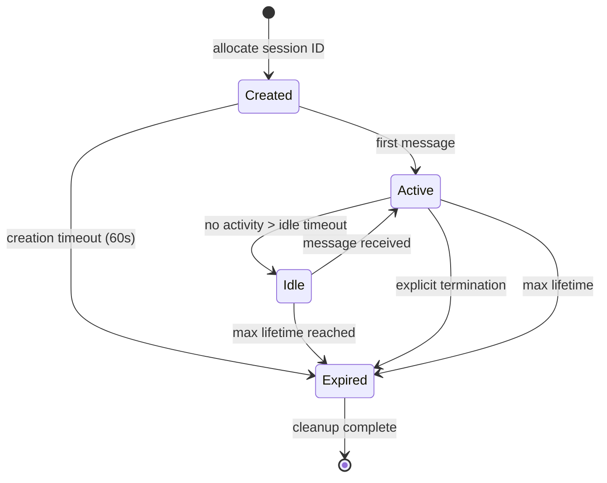

## 9. Session Management

Agent communication is fundamentally conversational. Unlike stateless API calls that complete in a single request-response pair, agent tasks span multiple turns, delegate sub-tasks to peers, pause for human approval, and resume after crashes. Session management provides the structural framework that makes these long-running, multi-party interactions reliable, recoverable, and scalable. This chapter defines session identification, lifecycle semantics, stateful and stateless operational modes, task state machines, context management strategies, and the formal input-required primitive that distinguishes agent protocols from traditional RPC.

### 9.1 Session Identification

Every session within AESP-0003 MUST carry a unique identifier generated with minimum 128-bit entropy to prevent prediction attacks across the expected deployment lifetime. The session identifier serves as the root correlation key linking all messages, state transitions, and audit records within a single conversational context.

#### 9.1.1 Session ID Formats

The protocol supports three transport bindings for session identification, listed in order of preference.

**HTTP cookie-based sessions** follow RFC 6265 semantics with `Secure`, `HttpOnly`, and `SameSite=Strict` attributes. The cookie value MUST contain the session identifier encoded as URL-safe base64 of at least 22 characters (128 bits of entropy). This binding is preferred for browser-embedded agents and human-in-the-loop workflows where the agent runs within a web application context.

**Header-based sessions** use the `AESP-Session-Id` HTTP header for explicit per-request session binding. (The MCP protocol historically used `Mcp-Session-Id`, now deprecated following SEP-2575; see Section 9.3.1.) Header propagation is preferred for server-to-server agent communication where cookie semantics do not apply. Servers MUST reject requests missing a session identifier in stateful mode with HTTP 400 and error code `SESSION_ID_REQUIRED`.

**URL parameter-based sessions** using `?session_id=` are supported only as a fallback for transports that cannot carry headers, such as certain WebSocket upgrade paths or legacy SSE endpoints. This binding SHOULD be avoided in production because query strings may appear in server logs, proxy caches, and referrer headers, creating an information disclosure risk.

#### 9.1.2 CSPRNG Generation and Rotation

Session identifiers MUST be generated using a Cryptographically Secure Pseudo-Random Number Generator (CSPRNG). Implementations MUST NOT use `Math.random()` or equivalent non-cryptographic sources. Suitable sources include `/dev/urandom` on POSIX systems, `getrandom(2)` on Linux, or platform-specific equivalents such as Java's `SecureRandom`.

Session identifiers MUST be rotated upon any privilege change: authentication escalation (anonymous to authenticated), role change (read-only to read-write), capability grant (additional tool permissions), or delegation acceptance (becoming a sub-agent of another entity). Rotation generates a new identifier while preserving session state; the old identifier MUST be invalidated within 30 seconds. This limits the blast radius of session fixation attacks in multi-agent delegation chains where compromised intermediate agents could replay captured identifiers.

#### 9.1.3 Context Propagation Across Delegation Boundaries

When an agent delegates a sub-task, three context identifiers MUST propagate across the delegation boundary.

The **`sessionId`** identifies the root conversational context. All agents participating in a single user request share the same root session identifier, enabling distributed tracing and audit correlation.

The **`correlationId`** (called `contextId` in A2A [^16^]) groups related tasks within a session. When an agent decomposes a request into parallel sub-tasks, each receives the same correlation identifier, allowing the delegator to aggregate results and detect completion across the group.

The **`traceContext`** follows W3C Trace Context (traceparent/tracestate) semantics. Each hop in a delegation chain generates a new span identifier while preserving the trace identifier, enabling end-to-end latency analysis across agent boundaries.

The combination of these three identifiers—session for conversation scoping, correlation for task grouping, and trace for observability—provides the minimum viable context propagation model. Implementations MAY extend this with custom context keys for domain-specific needs (tenant isolation, cost attribution), but MUST preserve the three standard identifiers through every protocol operation.

### 9.2 Session Lifecycle

A session progresses through well-defined states from creation to termination, with explicit semantics for idle management, cleanup, and recovery after restart.

#### 9.2.1 Session States

The lifecycle defines four primary states.

**Created**: The session is allocated but has not processed any message. It remains in this state until the first message arrives or a 60-second timeout elapses.

**Active**: The session has received at least one message and is processing turns. Transitions to active occur on any message exchange, including task submissions, status queries, and heartbeats.

**Idle**: No message has been received within the idle timeout period (default 30 minutes; see Section 9.2.2). Context remains in the store but the server MAY reduce resource allocation. The session transitions back to active on the next message.

**Expired**: The session reached maximum lifetime, was explicitly closed, or failed health checks. All resources are released, participants are notified, and state is archived. Session identifiers MUST NOT be reused.



**Figure 9.1** — Session lifecycle: created → active → idle → expired. Heartbeats during active operation reset the idle timer.

#### 9.2.2 Idle Timeout and Heartbeat

The default idle timeout is 30 minutes, advertised to clients via `idleTimeoutSeconds` in the session creation response. Heartbeat messages (JSON-RPC `$/heartbeat` or protocol `ping`) reset the idle timer. Servers SHOULD send heartbeats at intervals no greater than half the idle timeout to detect half-open connections where the client has crashed but TCP remains established.

If a session transitions to idle, the server MAY externalize state to storage and evict from memory. Upon receiving a new message, the server reloads state transparently to the client.

#### 9.2.3 Explicit Termination

Any participant MAY initiate termination via `session/terminate`. Upon receipt, the server MUST: mark the session expired; release all resources including tool connections and model slots; notify all participants via registered callbacks; write a final snapshot for audit; and respond with `terminationAck` containing the end timestamp. Termination is idempotent—repeated requests return the same acknowledgment.

#### 9.2.4 State Persistence and Recovery

Session snapshots capture complete state at transition points and periodic intervals (default 60 seconds during active operation). Snapshots are append-only, enabling time-travel debugging and audit reconstruction.

Production deployments use a two-layer architecture: durable execution engines (Temporal, Netflix Conductor, Azure Durable Tasks) handle macro-orchestration, while state-machine layers manage micro-level agent logic [^17^]. Conductor provides at-least-once delivery with sweeper recovery—background scanning for stalled tasks [^23^]. LangGraph checkpoints state after every step with arbitrary rollback across Memory, SQLite, Postgres, or Redis backends [^18^]. The CESSNA framework recovers from failure in under 1 ms with a local hot standby [^22^]. Production systems SHOULD target sub-second recovery and MUST ensure no in-flight task state is lost during restart.

### 9.3 Stateful and Stateless Modes

AESP-0003 supports both modes, selected per-deployment based on scalability, resilience, and complexity requirements.

#### 9.3.1 Stateless-First Mode

In stateless mode, each request is self-contained, carrying full conversational context. Any server instance can handle any request. This aligns with MCP's stateless-first architecture adopted in July 2026 via SEP-2575, which eliminated the `initialize` handshake and `Mcp-Session-Id` header [^29^]. SEP-2575 was motivated by three problems: sticky sessions impeded horizontal scaling; session loss on server failure reduced resilience; and per-client state management increased complexity with memory leaks [^30^]. Stateless mode requires clients to include full history (or compressed summaries) in each request. For short conversations this is acceptable; for long sessions the payload grows linearly with turn count, making context compression essential (Section 9.5.2).

#### 9.3.2 Stateful Mode

In stateful mode, the server maintains session context, and clients identify sessions via the session ID. This aligns with A2A's task pattern with full lifecycle management and nine named states [^1^]. Stateful mode is required for: multi-turn interaction referencing prior turns; long-running tasks spanning minutes or hours; session affinity to specific resources; and human-in-the-loop pause-and-resume (Section 9.6). MCP's pre-SEP-2575 architecture maintained stateful JSON-RPC sessions, but noted this state was intentionally lightweight—if the socket died, recovery was "not catastrophic" [^3^]. This philosophy—minimal protocol-level state with durable application-level state in external storage—remains the recommended approach.

#### 9.3.3 Selection Criteria

| Dimension | Stateless Mode | Stateful Mode |
|:---|:---|:---|
| Scalability | Horizontal: any server handles any request [^29^] | Requires affinity or shared state store |
| Resilience | Failure affects only in-flight requests | In-memory state lost on failure; external store needed |
| Latency | Higher per-request (full context transfer) | Lower per-request (cached context) |
| Complexity | Lower: no session management code | Higher: store, affinity, cleanup logic [^30^] |
| Multi-turn support | Client-managed history | Server-managed automatic access |
| Long-running tasks | Polling or webhooks required | Native: SSE streaming, push notifications [^1^] |
| Human-in-the-loop | Difficult: no server-side pause | Native: `input-required` state |
| Context growth | Linear in request payload | Constant per-request; grows server-side |
| Best for | Tool access, simple queries, high throughput | Complex workflows, approvals, streaming |

**Table 9.1** — Stateful vs. stateless comparison. Stateless prioritizes scalability and simplicity; stateful enables rich interaction patterns at infrastructure cost. Production systems frequently use both simultaneously—stateless for tool access and stateful for task orchestration.

The architectural implications extend beyond individual deployments. Stateless mode enables serverless and edge computing deployments where long-lived connections are impractical, while stateful mode enables streaming experiences where real-time progress updates and mid-execution human interaction are essential. Neither mode is universally superior; the protocol's flexibility to support both within a single deployment—stateless for tool endpoints and stateful for task orchestration—reflects the heterogeneous reality of production agent infrastructure.

#### 9.3.4 Session Affinity Strategies

| Strategy | Mechanism | Failure Handling | Scaling Impact | Best For |
|:---|:---|:---|:---|:---|
| Cookie-based | LB reads session cookie | Cookie loss → reassignment | Good: survives backend changes | Browser-embedded agents |
| IP hash | Hash of client IP | NAT changes redistribute | Poor: affects many sessions | Stable internal networks |
| Session ID routing | Hash of `AESP-Session-Id` | Preserved across reconnects | Good: 1/N on change | Server-to-server |
| Consistent hashing | Ring hash; minimal redistribution | Only failed node affected | Excellent: 1/N redistributed [^33^] | Large dynamic deployments |
| External state store | Shared Redis/Postgres/ScyllaDB | No affinity needed | Best: interchangeable [^34^] | Production elasticity |

**Table 9.2** — Session affinity strategies. External stores eliminate affinity entirely; consistent hashing minimizes redistribution on topology changes. The external state store approach is the recommended default for production deployments.

The external store approach is recommended for production. Session state resides in shared storage accessible to all instances; any server handles any request. LangGraph with ScyllaDB uses lightweight transactions for idempotent checkpoint writes and TTL for automatic expiration [^19^]. The A2A protocol's explicit task state machines and webhook delivery eliminate client-side affinity needs [^35^]. AESP-0003 follows this principle: design protocols so affinity is unnecessary rather than engineering around its limitations.

### 9.4 Task Lifecycle State Machine

While session management concerns the conversation container, task lifecycle management concerns the work within it. AESP-0003 extends A2A's model for task progress, failure, and human interaction.

#### 9.4.1 Standard Task States

Five core states are defined. **Pending**: submitted but not yet assigned, awaiting resource allocation. **Assigned**: allocated to an agent, preparing execution context. **In-progress**: actively executing (tool calls, LLM inference, sub-task delegation). **Completed**: finished successfully with artifacts available. **Failed**: terminated with error; includes error code, message, and optional diagnostics. **Cancelled**: explicitly terminated by a participant; includes actor identity and reason.

#### 9.4.2 Extended Task States

Three additional states support complex scenarios. **Input-required**: paused for information or human approval (Section 9.6). **Auth-required**: lacks authorization; delegator must grant capabilities. **Rejected**: agent refuses execution (policy violation, capability mismatch); distinct from failed as it is an intentional decision.

A2A groups these nine states into Running, Paused, and Finished categories [^1^]. AESP-0003 uses descriptive names (pending, assigned, in-progress) while maintaining semantic compatibility.

#### 9.4.3 Transition Rules and Event Emission

Every transition MUST emit an event to the delegator and parent task owner, including: task identifier, previous and new states, ISO 8601 timestamp, triggering actor, and optional reason. Tasks inherit the session's security context with capability attenuation per Chapter 8. Transitions involving privilege changes MUST trigger session ID rotation per Section 9.1.2.

```json
{
  "$schema": "https://json-schema.org/draft/2020-12/schema",
  "$id": "https://aesp.example.org/schemas/TaskLifecycle.json",
  "title": "TaskLifecycle",
  "description": "AESP-0003 task lifecycle state and transition record",
  "type": "object",
  "required": ["taskId", "state", "sessionId", "createdAt", "updatedAt"],
  "properties": {
    "taskId": { "type": "string", "format": "uuid" },
    "parentTaskId": { "type": ["string", "null"], "format": "uuid" },
    "sessionId": { "type": "string" },
    "correlationId": { "type": "string" },
    "state": {
      "type": "string",
      "enum": ["pending", "assigned", "in-progress", "completed",
        "failed", "cancelled", "input-required", "auth-required", "rejected"]
    },
    "previousState": {
      "type": ["string", "null"],
      "enum": ["pending", "assigned", "in-progress", "completed",
        "failed", "cancelled", "input-required", "auth-required", "rejected", null]
    },
    "createdAt": { "type": "string", "format": "date-time" },
    "updatedAt": { "type": "string", "format": "date-time" },
    "assignedTo": { "type": ["string", "null"] },
    "delegatedBy": { "type": ["string", "null"] },
    "transitions": {
      "type": "array",
      "items": {
        "type": "object",
        "required": ["from", "to", "timestamp", "actor"],
        "properties": {
          "from": { "type": "string" },
          "to": { "type": "string" },
          "timestamp": { "type": "string", "format": "date-time" },
          "actor": { "type": "string" },
          "message": { "type": "string" },
          "snapshotRef": { "type": "string" }
        }
      }
    },
    "artifacts": {
      "type": "array",
      "items": {
        "type": "object",
        "required": ["artifactId", "type", "content"],
        "properties": {
          "artifactId": { "type": "string", "format": "uuid" },
          "type": { "type": "string" },
          "content": { "type": "string" },
          "parts": {
            "type": "array",
            "items": {
              "type": "object",
              "properties": {
                "partIndex": { "type": "integer" },
                "append": { "type": "boolean" },
                "lastChunk": { "type": "boolean" }
              }
            }
          }
        }
      }
    }
  }
}
```

**Schema 9.1** — `TaskLifecycle` JSON Schema. Defines task state records with append-only transition history and artifact tracking. The `snapshotRef` field enables time-travel debugging by linking each transition to the context snapshot at that moment.

### 9.5 Context Management

Context management—selecting, compressing, and delivering relevant history to the LLM—is the dominant scaling bottleneck in multi-agent systems. While transport overhead can be optimized through binary serialization, the fundamental constraint is fitting relevant context within finite token windows [^24^].

#### 9.5.1 Thread Management

Production systems combine four strategies [^6^]: priority ordering positions content tiers in the window; sliding windows cap the tail to recent N turns; summarization compresses older turns; truncation is the hard backstop. A hybrid of running session summary with 3–5 recent raw turns is considered best practice, balancing quality, latency, and cost [^7^]. Enterprise platforms report average resolved sessions span 4.2 turns, with transaction sessions averaging 6–8 turns; single-turn interactions are only 20–25% of volume [^12^]. Systems incapable of multi-turn handling serve at most a quarter of real needs.

Conversation branching occurs when agents explore parallel approaches. A2A supports grouping via `contextId` while maintaining task immutability [^16^]. AESP-0003 extends this: forked threads inherit parent summaries but maintain independent sliding windows, with hierarchical thread identifiers (`sessionId/threadId/branchIndex`). Thread switching detaches active runs, clears state, fetches new history, and establishes fresh synchronization [^15^]. If a tool call from the old thread completes during a switch, its result is discarded rather than inserted into the new thread's messages, ensuring isolation.

A critical anti-pattern must be avoided: treating transcripts as the coordination layer. When transcripts are the source of truth, concurrency becomes guesswork and failure handling turns into re-prompting [^14^]. Engine-owned workflow runtimes with explicit state machines are required for production multi-agent systems. Dialogue State Tracking (DST)—incrementally estimating user goals as structured slot-value pairs—provides a formal framework for thread state management, typically evaluated using Joint Goal Accuracy (JGA) [^10^].

#### 9.5.2 Compression Techniques

| Technique | Compression | Retention | Latency | Best For |
|:---|:---|:---|:---|:---|
| Truncation | Unlimited | 0% of dropped | Zero | Emergency backstop only |
| Sliding window (3–5) | ~5:1 | 100% of recent | Zero | Recent continuity [^7^] |
| Naive summarization | ~8:1 | ~60% | 1× LLM call | Simple domains |
| FullContext [^24^] | **12.3:1** | **77%** | 1× LLM call | Long sessions (recommended) |
| ReSum [^25^] | ~10:1 | ~70% | Periodic tool invocation | Agent-controlled maintenance |
| AgentFold [^25^] | ~9:1 | ~68% | Inline with generation | Online state maintenance |
| H-MEM [^26^] | Variable | ~75% | Index lookup overhead | Very long multi-domain sessions |