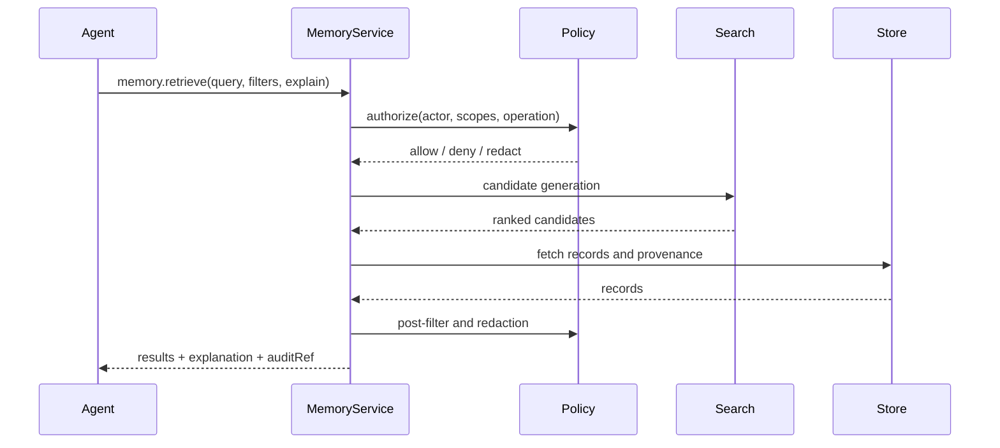
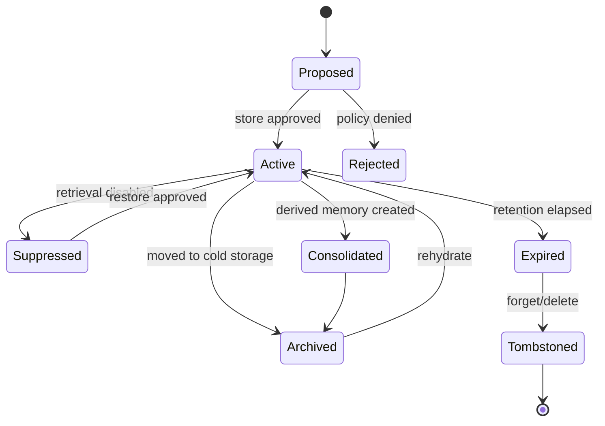

# AESP-0004: Memory Systems, Continued

## 5. Retrieval Mechanisms

### 5.1 Retrieval Pipeline

A memory retrieval pipeline transforms an agent need into selected records. A conforming implementation MAY use one or more retrieval modes, but it MUST expose the modes used and the ordering basis for returned records.



`MEM-REQ-042`: Retrieval MUST perform authorization before returning content.

`MEM-REQ-043`: Retrieval SHOULD perform post-retrieval policy filtering because candidates generated by indexes may include records whose policy changed after indexing.

`MEM-REQ-044`: Retrieval explanations MUST be machine-readable when `explain=true`.

### 5.2 Similarity Retrieval

Similarity retrieval compares query embeddings with memory embeddings. It works well for paraphrase, conceptual similarity, and exploratory recall. It works poorly when exact identifiers, negation, numeric constraints, or temporal order matter. AESP implementations SHOULD combine similarity with filters, lexical search, graph traversal, or reranking when correctness depends on exact facts.

`MEM-REQ-045`: Similarity retrieval MUST expose the distance metric or score semantics used for ranking.

`MEM-REQ-046`: Similarity retrieval SHOULD support a minimum relevance threshold.

`MEM-REQ-047`: Similarity retrieval MUST NOT be the only retrieval mode for policy records, legal constraints, or safety-critical procedures.

### 5.3 Lexical and Hybrid Retrieval

Lexical retrieval uses exact terms, BM25-style scoring, phrase matching, or structured fields. Hybrid retrieval combines lexical and semantic signals. Pinecone documents several hybrid approaches, including single-index dense+sparse vectors and separate dense/sparse indexes merged client-side, and warns that dense and sparse scores require weighting because their ranges differ [^5^].

`MEM-REQ-048`: Hybrid retrieval MUST declare how scores from different modalities are normalized, weighted, or merged.

`MEM-REQ-049`: Implementations SHOULD evaluate hybrid weights against a labeled relevance set drawn from the deployment workload.

### 5.4 Temporal Retrieval and Decay

Temporal retrieval uses timestamps, intervals, recency, frequency, deadlines, and event order. It is mandatory for episodic memory because the same fact can change over time.

`MEM-REQ-050`: Episodic retrieval MUST support filtering by observed time and recorded time.

`MEM-REQ-051`: Temporal ranking SHOULD distinguish recency from validity. A recent incorrect memory MUST NOT outrank an older authoritative policy solely because it is recent.

`MEM-REQ-052`: If a decay function affects retrieval, the function and its parameters MUST be inspectable.

The following decay model is RECOMMENDED as a simple default for non-authoritative episodic memories:

$$
score = relevance \times e^{-\lambda age} + \alpha importance + \beta frequency
$$

The coefficients are implementation-defined. Policy records, human approvals, legal constraints, and active work-unit requirements SHOULD NOT decay unless a retention policy explicitly says so.

### 5.5 Associative and Graph Retrieval

Associative retrieval follows links: same work unit, same actor, same file, same entity, same incident, prerequisite, contradiction, duplicate, or supersession. Graph retrieval generalizes associative retrieval through typed nodes and edges.

`MEM-REQ-053`: A memory service SHOULD support associative retrieval by at least `workUnitRef`, `agentRef`, `messageRef`, `artifactRef`, and `entityRef`.

`MEM-REQ-054`: Graph retrieval results MUST preserve the path or relationship basis used to include a record when `explain=true`.

### 5.6 Working-Memory Selection

Working-memory selection is the final step that chooses what enters the agent context. It is not identical to retrieval. A retrieved memory may be excluded because it is redundant, stale, low-confidence, policy-protected, too large, or less important than another item.

`MEM-REQ-055`: Working-memory selection MUST apply a bounded budget expressed in tokens, bytes, items, or another documented capacity unit.

`MEM-REQ-056`: Working-memory selection SHOULD prefer authoritative, recent, task-relevant, and high-confidence records.

`MEM-REQ-057`: Working-memory selection MUST preserve instructions and policy constraints ahead of ordinary episodic memories when both compete for capacity.

## 6. Distributed Memory

### 6.1 Distributed Memory Problem

Multi-agent systems often run multiple agents, replicas, tools, and services that observe and write memory concurrently. A centralized memory service is simpler, but it can become a latency bottleneck, availability risk, or governance boundary. A distributed memory system permits local writes and later synchronization, but must define merge semantics.

CRDTs are a natural fit for distributed agent memory because they allow replicas to accept local updates without coordination and converge deterministically after receiving the same updates [^7^]. AESP-0001 already models AEO state with event sourcing and conflict-aware state transitions. AESP-0004 extends that model to memory records.

### 6.2 Consistency Levels

A conforming implementation MUST declare its consistency level for each memory scope.

| Level | Semantics | Suitable Use |
|:---|:---|:---|
| `local` | Visible only on one replica | Scratch memories, offline work |
| `eventual` | Replicas converge after synchronization | Most episodic and semantic memories |
| `causal` | Causally dependent writes preserve order | Conversation and workflow histories |
| `strong` | Reads observe latest committed write | Policy, legal holds, permissions |

`MEM-REQ-058`: Shared team, organization, and federation memories MUST NOT use undocumented consistency semantics.

`MEM-REQ-059`: Authorization policies and deletion tombstones SHOULD use strong or causally consistent propagation when practical.

### 6.3 CRDT Mapping

The following CRDT mappings are RECOMMENDED:

| Memory Structure | Recommended CRDT | Notes |
|:---|:---|:---|
| Append-only event log | Grow-only set or causally ordered log | Use for immutable observations |
| Active memory set | Observed-remove set | Supports add/remove with tombstones |
| Importance score | PN-counter or bounded register | Merge carefully to avoid inflation |
| Single profile field | LWW-register with causal metadata | Use only when overwrite is acceptable |
| Entity relationships | OR-set of typed edges | Preserve provenance per edge |
| Suppression/deletion | Remove-wins set | Deletion should dominate stale adds |

`MEM-REQ-060`: Distributed delete, forget, and suppress operations MUST use remove-wins semantics unless a stronger legal or governance rule applies.

`MEM-REQ-061`: A memory CRDT MUST define merge behavior for concurrent add/update, update/delete, consolidate/delete, and policy-change/content-change conflicts.

`MEM-REQ-062`: CRDT metadata SHOULD be compactable without losing the ability to prevent deleted-memory resurrection.

### 6.4 Event Sourcing Alignment

Every distributed memory mutation SHOULD be represented as an immutable event. Projections can build active records, vector indexes, graph edges, and caches from those events. This arrangement supports audit, replay, migration, and cross-agent synchronization.

```json
{
  "eventType": "memory.updated",
  "eventId": "urn:aeo:event:memory:01JZQ6Q4A4R2",
  "memoryId": "urn:aeo:memory:team:aesp-0004:decision-17",
  "actor": "urn:aeo:agent:memory-service",
  "baseVersion": "7",
  "newVersion": "8",
  "occurredAt": "2026-07-10T12:00:00Z",
  "causal": {
    "replicaId": "memory-replica-us-east-1",
    "vector": { "memory-replica-us-east-1": 42, "memory-replica-eu-west-1": 39 }
  },
  "change": {
    "path": "/importance",
    "op": "replace",
    "value": 0.82
  }
}
```

### 6.5 Conflict Resolution

Conflicts MUST be resolved according to declared policy. Silent arbitrary overwrites are non-conformant for shared memories.

`MEM-REQ-063`: A memory service MUST record whether a conflict was resolved automatically, escalated to a human, or preserved as competing versions.

`MEM-REQ-064`: Concurrent semantic assertions that contradict each other SHOULD be preserved as alternatives with provenance instead of collapsed into one fact.

`MEM-REQ-065`: Procedural memory conflicts that affect safety, authority, or external side effects MUST be escalated or policy-resolved before use.

## 7. Memory Lifecycle

### 7.1 Lifecycle States

A memory record moves through a lifecycle:



`MEM-REQ-066`: A memory record MUST expose one of the lifecycle states defined in this specification or an extension state with a namespaced identifier.

`MEM-REQ-067`: Lifecycle transitions MUST be policy-checkable and auditable.

### 7.2 Creation and Admission

Not every observation should become long-term memory. Admission control protects privacy, storage cost, and retrieval quality.

`MEM-REQ-068`: Memory admission SHOULD evaluate relevance, sensitivity, duplication, confidence, expected future utility, and retention policy.

`MEM-REQ-069`: Implementations MUST provide a way to prevent specified content classes from being stored as long-term memory.

### 7.3 Consolidation

Consolidation converts lower-level memories into higher-level memories. Examples include:

| Input | Output | Type Shift |
|:---|:---|:---|
| Repeated user corrections | User preference | Episodic to semantic |
| Successful debugging sequence | Debugging playbook | Episodic to procedural |
| Multiple architecture notes | Decision summary | Episodic to semantic |
| Related entity mentions | Knowledge graph edges | Episodic to semantic |

`MEM-REQ-070`: Derived memories MUST link to source memories or source ranges unless policy prohibits retaining the link.

`MEM-REQ-071`: Consolidation SHOULD avoid destroying raw episodic evidence until the retention policy permits archival or deletion.

### 7.4 Forgetting and Retention

Forgetting is essential for safety, cost, legal compliance, and behavioral correctness. Old memories can become stale. Sensitive memories can become inappropriate to retain. Duplicated memories can drown out better evidence.

`MEM-REQ-072`: Implementations MUST support explicit forgetting by memory identifier.

`MEM-REQ-073`: Implementations SHOULD support policy-driven forgetting by age, scope, actor, sensitivity class, confidence, and source.

`MEM-REQ-074`: A memory service MUST expose retention policies in machine-readable form.

`MEM-REQ-075`: A memory service MUST be able to prove, through event or audit records, that a forgotten memory is excluded from default retrieval.

### 7.5 Archival and Rehydration

Archival moves memory to lower-cost or lower-availability storage. Rehydration returns it to active use.

`MEM-REQ-076`: Archived memories MUST retain enough metadata for discovery, retention, and audit.

`MEM-REQ-077`: Rehydrating archived memory MUST re-run authorization and current policy checks.

## 8. Inter-Agent Memory Protocol

### 8.1 Protocol Goals

AESP-0004 defines a vendor-neutral protocol for memory sharing between agents. The protocol supports request-response retrieval, explicit sharing, subscriptions, leases, and synchronization. It builds on AESP-0003 envelopes rather than defining a new transport.

`MEM-REQ-078`: Inter-agent memory messages MUST use AESP-0003 message envelopes.

`MEM-REQ-079`: A memory-sharing operation MUST identify the requesting actor, intended purpose, requested scope, retention intent, and requested operations.

### 8.2 Capability Declaration

Agents and memory services advertise memory support through a `MemoryCapability`.

```yaml
id: urn:aeo:capability:memory:team-store
type: MemoryCapability
version: "1.0.0"
supportedMemoryTypes:
  - working
  - episodic
  - semantic
  - procedural
supportedOperations:
  - store
  - retrieve
  - update
  - forget
  - consolidate
  - share
  - subscribe
retrievalModes:
  - lexical
  - semantic
  - temporal
  - graph
  - hybrid
scopes:
  - private
  - session
  - team
  - organization
consistency:
  team: causal
  organization: eventual
policy:
  requiresPurpose: true
  supportsLeases: true
  supportsRedaction: true
```

`MEM-REQ-080`: A memory capability declaration MUST include supported memory types, operations, scopes, retrieval modes, and consistency levels.

### 8.3 Memory Share

The `memory.share` operation grants another agent access to a memory or memory query result. Sharing MAY copy the memory, grant a lease, or create a subscription.

```json
{
  "messageType": "memory.share",
  "sender": "urn:aeo:agent:researcher",
  "recipient": "urn:aeo:agent:writer",
  "payload": {
    "grantType": "lease",
    "memoryIds": ["urn:aeo:memory:team:aesp-0004:source-12"],
    "operations": ["retrieve"],
    "purpose": "draft AESP-0004 storage backend section",
    "expiresAt": "2026-07-11T00:00:00Z",
    "redaction": "policy-default"
  }
}
```

`MEM-REQ-081`: A shared memory lease MUST include expiration or revocation semantics.

`MEM-REQ-082`: A memory copy MUST preserve provenance and original policy constraints unless an authorized policy transformation explicitly changes them.

### 8.4 Memory Subscribe

Subscriptions notify agents about matching memory events.

`MEM-REQ-083`: A memory subscription MUST declare event types, filters, delivery semantics, and authorization scope.

`MEM-REQ-084`: A subscription MUST stop delivering events when authorization changes revoke access.

### 8.5 Federation

Federated memory sharing crosses organizational boundaries. It is high risk and MUST be explicit.

`MEM-REQ-085`: Federation memory sharing MUST use mutually authenticated transport as defined by AESP-0003.

`MEM-REQ-086`: Federation memory sharing MUST include purpose limitation, retention limitation, and audit exchange requirements.

`MEM-REQ-087`: Federation memory sharing SHOULD prefer leases or redacted views over raw copies.
