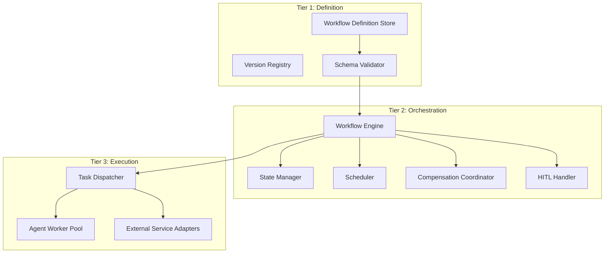

# AESP-0005: Workflow Orchestration, Reference

## 9. Multi-Agent Coordination

Workflows in a multi-agent AEO do not execute in isolation; they coordinate across multiple agents, roles, and organizations. This chapter defines the coordination models, delegation patterns, and shared state semantics that govern multi-agent workflow execution.

### 9.1 Coordination Models

The field has converged on three primary coordination models for multi-agent workflows, each with distinct architectural trade-offs.

| Model | Control Locus | Failure Domain | Best Use Case |
|:---|:---|:---|:---|
| Centralized Orchestration | Single orchestrator agent | Orchestrator is single point of failure | Mission-critical, regulated workflows |
| Hierarchical Orchestration | Layered orchestrators with delegation | Layer boundary | Large-scale distributed workflows |
| Choreography | Distributed among agents via events | Per-agent autonomy | Loose coupling, high parallelism |
| Hybrid (Orchestration + Choreography) | Mixed | Configurable | Production multi-agent systems |

LangGraph implements centralized graph-based orchestration with a supervisor node routing between specialized worker agents [^2^]. CrewAI uses hierarchical orchestration with manager agents delegating to worker crews [^9^]. Camunda's BPMN engine provides centralized orchestration with explicit process modeling and ad-hoc sub-processes for non-deterministic agent reasoning [^3^]. The Strands Agents framework exposes Graph, Swarm, and Workflow patterns supporting all three coordination models with consistent shared state [^10^].

`WF-REQ-109`: A workflow definition MUST declare its coordination model (`centralized`, `hierarchical`, `choreography`, or `hybrid`) as a metadata field.

`WF-REQ-110`: A centralized orchestrator MUST own workflow state and task sequencing. Agents executing tasks MUST NOT mutate workflow state directly; they MUST return results that the orchestrator applies to state.

`WF-REQ-111`: Choreographed workflows MUST define event types, event ordering guarantees, and per-agent event handling logic. Event ordering MUST be total within a single choreography stream to ensure consistent state evolution.

`WF-REQ-112`: Hybrid workflows MUST declare which segments are orchestrated and which are choreographed, and MUST define the transition semantics between segments (event-driven handoff, state-synchronization barrier, etc.).

### 9.2 Delegation Patterns

A delegation transfers authority and responsibility for a task or sub-workflow from one agent to another. The receiving agent operates under the constraints of the delegating agent's authority plus the limits of its own role.

`WF-REQ-113`: A delegation MUST specify: the delegating agent, the receiving agent or role, the delegated authority scope, the delegated tasks, the expected outcomes, the timeout, and the revocation conditions.

`WF-REQ-114`: A delegated task's authority scope MUST NOT exceed the delegating agent's authority scope. Attempts to delegate broader authority MUST be rejected by the workflow engine.

`WF-REQ-115`: A delegation MUST be revocable. The delegating agent MUST be able to revoke the delegation at any time before task completion, with appropriate compensation actions if side effects occurred.

The following delegation patterns are RECOMMENDED:

| Pattern | Description | Authority Flow |
|:---|:---|:---|
| Supervisor-Worker | Supervisor delegates specific tasks to workers | Supervisor retains full control |
| Peer-to-Peer | Agents delegate bidirectionally based on capability | Symmetric authority transfer |
| Hierarchical Chain | Top-level agent delegates to mid-level, which delegates to worker | Multi-hop delegation chain |
| Contract Net | Manager announces task, agents bid, manager awards contract | Bidding-based selection |
| Black Board | Agents read/write shared state, opportunistic task pickup | Implicit, no direct delegation |

### 9.3 Contract Net Protocol

The Contract Net Protocol is a coordination pattern where a manager agent announces a task to potential contractors, receives bids, and awards a contract to the selected bidder. This pattern is appropriate for dynamic task allocation where the optimal agent for a task cannot be predetermined.

`WF-REQ-116`: A contract net announcement MUST include: task identifier and description, eligibility criteria (required capabilities, permissions), bid deadline, evaluation criteria, and award deadline.

`WF-REQ-117`: Contractor bids MUST include: bid identifier, proposing agent, confidence or cost estimate, estimated duration, and any conditions on acceptance.

`WF-REQ-118`: Contract award MUST be deterministic and auditable. The award decision MUST be based on declared evaluation criteria applied to received bids.

`WF-REQ-119`: A contract net workflow MUST handle the case where no bids are received before the deadline. The workflow MUST escalate to an alternative allocation strategy or fail with reason `no_bids`.

### 9.4 Shared Workflow State

When multiple agents coordinate within a workflow, they MAY share state through explicit mechanisms rather than relying on side-channel communication.

`WF-REQ-120`: Shared workflow state MUST be stored in the workflow's own state record, not in individual agent memory. Agents MUST read shared state via workflow queries and write shared state via workflow signals or task result returns.

`WF-REQ-121`: Concurrent updates to shared workflow state MUST be serialized through the orchestrator. Direct concurrent writes from multiple agents to the same state field MUST be rejected as a race condition.

`WF-REQ-122`: Shared workflow state visible to multiple agents MUST be access-controlled per agent or role. Sensitive state fields MUST NOT be visible to all agents in the workflow.

### 9.5 Multi-Agent Failure Coordination

When one agent in a multi-agent workflow fails, the failure may propagate to other agents and other workflows depending on the coordination model.

`WF-REQ-123`: A centralized orchestrator MUST detect agent failures within a configurable heartbeat interval (default 30 seconds) and execute the configured failure handling (retry, escalate, compensate).

`WF-REQ-124`: A choreographed workflow MUST support timeout-based detection: if an expected event from an agent does not arrive within the declared window, the workflow MUST execute timeout handling.

`WF-REQ-125`: Multi-agent workflows MUST implement isolation boundaries: a failure in one sub-workflow MUST NOT propagate to siblings unless explicitly configured. Compensation chains SHOULD be scoped per isolation boundary.

## 10. Implementation Guidelines

This chapter provides practical guidance for implementing AESP-0005 compliant workflow orchestration engines. It covers minimum viable implementations, recommended architectures, common anti-patterns, and migration strategies.

### 10.1 Minimum Viable Implementation

A minimum viable conforming implementation MUST support:

1. JSON workflow definition parsing and validation against the AESP-0005 schema.
2. Workflow instance creation with unique identifier assignment.
3. Sequential task execution with at-least-once delivery semantics.
4. Workflow state persistence (in-memory minimum; durable preferred).
5. Basic failure handling: retry with exponential backoff, configurable max attempts.
6. Workflow completion signaling and result retrieval.
7. AESP-0003 message envelope conformance for task dispatch.
8. Audit event emission for workflow lifecycle transitions.

`WF-REQ-126`: An implementation claiming Tier 1 (Core) conformance MUST satisfy all MUST requirements in Chapters 1-9.

`WF-REQ-127`: An implementation claiming Tier 2 (Durable) conformance MUST additionally support: durable state persistence with crash recovery, event-sourced or snapshot checkpointing, workflow replay, and long-running workflows exceeding 24 hours.

`WF-REQ-128`: An implementation claiming Tier 3 (Distributed) conformance MUST additionally support: multi-agent coordination patterns (Chapter 9), saga compensation with automatic undo chains, distributed workflow instances across multiple workers, and cross-organization workflow federation.

### 10.2 Recommended Architecture

The RECOMMENDED production architecture is a three-tier workflow engine with clear separation between definition, orchestration, and execution concerns.



| Component | Responsibility | RECOMMENDED Implementation |
|:---|:---|:---|
| Definition Store | Versioned workflow definitions | Git-backed repository or artifact registry |
| Workflow Engine | Task sequencing, state machine transitions | Temporal, Cadence, or custom |
| State Manager | Durable state persistence | Event log (Kafka, Postgres) |
| Scheduler | Cron, event triggers, delayed execution | Quartz, Temporal schedules, or cloud-native scheduler |
| Compensation Coordinator | Saga execution, rollback | Built into workflow engine |
| HITL Handler | Signal routing, escalation | Message bus + notification adapters |
| Task Dispatcher | Agent selection and message delivery | AESP-0003 transport bindings |
| Agent Worker Pool | Stateless task execution | Container orchestration (Kubernetes) |

This architecture aligns with Temporal's reference architecture: durable state in the server cluster, stateless workers executing activities, and workflow code defining the coordination logic [^1^].

### 10.3 Anti-Patterns

The following patterns are discouraged because they lead to operational, governance, or reliability problems.

| Anti-Pattern | Why It Fails | RECOMMENDED Alternative |
|:---|:---|:---|
| Implicit agent self-sequencing | No external observability, hard to recover | Explicit workflow graph |
| Synchronous HTTP for long tasks | Resource exhaustion, no durability | Async task dispatch with durable state |
| Full-state replay on every event | O(n^2) replay time for long workflows | Snapshot checkpoints |
| Single monolithic orchestrator | Single point of failure, scaling bottleneck | Hierarchical orchestration |
| Hidden compensations in task code | Compensations not discoverable, not auditable | Declarative compensation actions |
| Hard-coded agent assignments | Inflexible, no role-based assignment | Role/capability-based selectors |
| Sleeping in workflow code | Wastes resources, non-deterministic | Durable timers |
| Random number generation in workflows | Breaks determinism on replay | Generate in activities, pass via signals |
| External state mutation without compensation | Cannot rollback multi-step workflows | Saga pattern with explicit compensations |
| Logging sensitive data in audit trail | Compliance violation | Redact or reference-only audit |

`WF-REQ-129`: Workflow definition code MUST NOT use external side effects (network calls, file system writes, random number generation) directly. All side effects MUST be encapsulated in activities invoked by the workflow.

`WF-REQ-130`: Workflow definitions MUST be deterministic given the same input and event sequence. The same workflow replayed MUST produce the same task dispatch sequence.

### 10.4 Migration Strategies

Workflow systems evolve over time. Implementing migrations safely requires careful planning and explicit rollback strategies.

`WF-REQ-131`: A workflow definition version migration MUST support three modes: `replace` (cancel old, start new with same identifier), `continue-old` (continue old version to completion, start new with new version), `migrate-in-place` (resume old workflow using new version).

`WF-REQ-132`: Migration between workflow engines (Temporal → Camunda, for example) MUST preserve workflow instance identifiers, task history, and audit trail. A migration that loses history is non-conformant.

## 11. Conformance and Testing

This chapter defines the conformance tiers, test families, and evaluation metrics that implementations must satisfy to claim AESP-0005 compliance.

### 11.1 Conformance Tiers

| Tier | Name | Capability | Required for |
|:---|:---|:---|:---|
| Tier 1 | Core | Sequential workflows, basic state machine, retry, audit | All implementations |
| Tier 2 | Durable | Durable execution, checkpointing, HITL signals, scheduled triggers | Production deployments |
| Tier 3 | Distributed | Multi-agent coordination, saga compensation, hierarchical workflows | Enterprise multi-agent systems |
| Tier 4 | Federated | Cross-organization workflows, external triggers, regulatory compliance | Cross-org, regulated industries |

`WF-REQ-133`: A conformance claim MUST identify its tier and any features within that tier that are not supported.

`WF-REQ-134`: Conformance claims SHOULD be verified against the AESP conformance test suite, which contains test vectors for each MUST requirement.

### 11.2 Required Test Families

A conforming test suite SHOULD include the following test families:

1. **Schema validation tests**: Workflow definitions must validate against the AESP-0005 schema.
2. **Sequential execution tests**: Tasks execute in declared order with correct input/output flow.
3. **Parallel execution tests**: Parallel gateways fan out and join correctly.
4. **Conditional routing tests**: Decisions select correct paths based on evaluated conditions.
5. **Retry policy tests**: Tasks retry according to declared policy with correct backoff.
6. **Saga compensation tests**: Failed workflows trigger compensation in reverse order.
7. **HITL signal tests**: Paused workflows resume on signal delivery with correct state.
8. **Escalation tests**: Timeouts trigger configured escalation policies.
9. **Persistence recovery tests**: Workflow state survives engine restart and resumes correctly.
10. **Multi-agent coordination tests**: Delegation, contract net, and shared state behave correctly.
11. **Audit trail tests**: All state transitions are recorded with full context.
12. **Concurrent execution tests**: Parallel tasks do not corrupt shared state.

`WF-REQ-135`: A Core conformance test suite MUST verify that all MUST requirements in Chapters 1-4 are satisfied.

`WF-REQ-136`: A Durable conformance test suite MUST additionally verify that workflow instances survive simulated process crashes and resume from the correct execution point.

`WF-REQ-137`: A Distributed conformance test suite MUST verify that multi-agent workflows coordinate correctly under simulated agent failures and message delays.

### 11.3 Evaluation Metrics

Workflow orchestration quality SHOULD be evaluated using the following metrics:

| Metric | Definition | RECOMMENDED Target |
|:---|:---|:---|
| Workflow Success Rate | Percentage of workflow instances reaching COMPLETED state | > 99% for routine workflows |
| Mean Time to Recovery | Time from failure detection to workflow resume | < 60 seconds |
| Checkpoint Recovery Time | Time to restore state from last checkpoint | < 5 seconds for snapshot, linear in events for event-sourced |
| Compensation Success Rate | Percentage of compensations that succeed on first attempt | > 95% |
| HITL Response Time | Median time from HITL pause to signal delivery | < 4 hours for business hours, < 24 hours otherwise |
| Task Dispatch Latency | Time from task ready to agent receiving dispatch | < 1 second |
| Audit Completeness | Percentage of state transitions recorded in audit trail | 100% |

`WF-REQ-138`: Implementations SHOULD publish conformance test results, including which tier is claimed and the metrics achieved, to enable cross-implementation comparison.

## 12. Appendices

### 12.1 Workflow Operation Error Codes

| Code | Meaning |
|:---|:---|
| `WORKFLOW_NOT_FOUND` | Requested workflow instance does not exist or is not visible |
| `WORKFLOW_ALREADY_RUNNING` | Attempt to start a workflow instance that is already running |
| `WORKFLOW_TIMEOUT` | Workflow exceeded its declared timeout |
| `TASK_NOT_FOUND` | Task identifier does not match any task in the workflow definition |
| `TASK_ACCESS_DENIED` | Actor lacks permission to execute the task |
| `TASK_TIMEOUT` | Task exceeded its declared startToCloseTimeout |
| `TASK_FAILED_RETRYABLE` | Task failed but retry policy applies |
| `TASK_FAILED_FATAL` | Task failed with no retry remaining |
| `COMPENSATION_FAILED` | Compensation action failed during saga rollback |
| `COMPENSATION_UNAVAILABLE` | Failed task has no compensation declared |
| `CIRCUIT_OPEN` | Task dispatched to failing target with open circuit breaker |
| `AGENT_UNAVAILABLE` | No agent matches the task's selection criteria |
| `SIGNAL_TYPE_MISMATCH` | Signal received does not match expected signal type for paused workflow |
| `SIGNAL_TIMEOUT` | Expected signal not received within declared timeout |
| `HITL_ESCALATED` | HITL pause escalated due to timeout |
| `SCHEMA_VALIDATION_FAILED` | Workflow definition failed schema validation |
| `VERSION_INCOMPATIBLE` | Running workflow cannot migrate to requested definition version |

### 12.2 Example Workflow Instance Lifecycle

```json
{
  "workflowInstanceId": "urn:aeo:workflow:deploy-review:v3-instance-42",
  "workflowDefinitionId": "urn:aeo:workflow:deploy-review:v3",
  "version": "3.2.1",
  "state": "RUNNING",
  "currentNode": "approve-deployment",
  "startTime": "2026-07-10T12:00:00Z",
  "lastUpdateTime": "2026-07-10T14:25:30Z",
  "taskStates": {
    "plan-deployment": {
      "state": "COMPLETED",
      "agentId": "urn:aeo:agent:devops-planner",
      "startTime": "2026-07-10T12:00:05Z",
      "endTime": "2026-07-10T12:05:22Z",
      "outputs": { "planId": "plan-42", "riskScore": 0.23 }
    },
    "run-tests": {
      "state": "COMPLETED",
      "agentId": "urn:aeo:agent:test-runner",
      "startTime": "2026-07-10T12:05:25Z",
      "endTime": "2026-07-10T12:18:11Z",
      "outputs": { "testsRun": 1247, "testsPassed": 1247, "testsFailed": 0 }
    },
    "security-scan": {
      "state": "COMPLETED",
      "agentId": "urn:aeo:agent:security-scanner",
      "startTime": "2026-07-10T12:18:14Z",
      "endTime": "2026-07-10T12:25:00Z",
      "outputs": { "vulnerabilities": 0, "scanCoverage": "98.7%" }
    },
    "approve-deployment": {
      "state": "AWAITING_APPROVAL",
      "agentId": "urn:aeo:human:senior-engineer",
      "startTime": "2026-07-10T14:25:30Z",
      "expectedSignals": ["approval.decision"],
      "timeout": "2026-07-10T18:00:00Z",
      "escalationPolicy": "escalateToSupervisor"
    }
  },
  "compensationStack": [
    { "taskId": "security-scan", "status": "available", "action": "cancel-scan" },
    { "taskId": "run-tests", "status": "available", "action": "cancel-test-run" }
  ],
  "audit": [
    { "event": "WORKFLOW_STARTED", "timestamp": "2026-07-10T12:00:00Z" },
    { "event": "TASK_COMPLETED", "taskId": "plan-deployment", "timestamp": "2026-07-10T12:05:22Z" },
    { "event": "TASK_COMPLETED", "taskId": "run-tests", "timestamp": "2026-07-10T12:18:11Z" },
    { "event": "TASK_COMPLETED", "taskId": "security-scan", "timestamp": "2026-07-10T12:25:00Z" },
    { "event": "TASK_PAUSED_HITL", "taskId": "approve-deployment", "timestamp": "2026-07-10T14:25:30Z" }
  ]
}
```

### 12.3 Requirement Index

Requirements `WF-REQ-001` through `WF-REQ-138` define the normative surface of this draft. Future revisions SHOULD preserve identifiers and append new identifiers rather than renumbering existing requirements.

| Range | Domain | Count |
|:---|:---|:---|
| `WF-REQ-001` to `WF-REQ-015` | Workflow Graph Model | 15 |
| `WF-REQ-016` to `WF-REQ-025` | Workflow Instance State | 10 |
| `WF-REQ-026` to `WF-REQ-035` | Task Decomposition | 10 |
| `WF-REQ-036` to `WF-REQ-045` | Execution Semantics | 10 |
| `WF-REQ-046` to `WF-REQ-066` | Failure Handling | 21 |
| `WF-REQ-067` to `WF-REQ-082` | Scheduling & Triggers | 16 |
| `WF-REQ-083` to `WF-REQ-095` | State Persistence | 13 |
| `WF-REQ-096` to `WF-REQ-108` | Human-in-the-Loop | 13 |
| `WF-REQ-109` to `WF-REQ-125` | Multi-Agent Coordination | 17 |
| `WF-REQ-126` to `WF-REQ-138` | Implementation & Conformance | 13 |

# References

[^1^]: Temporal Technologies, "Temporal Platform Documentation", accessed 2026-07-10, https://docs.temporal.io/

[^2^]: LangChain, "LangGraph: Multi-Agent Workflows", accessed 2026-07-10, https://www.langchain.com/blog/langgraph-multi-agent-workflows

[^3^]: Camunda, "BPMN: Business Process Model and Notation", accessed 2026-07-10, https://camunda.com/bpmn/

[^4^]: Scott Bradner, "Key words for use in RFCs to Indicate Requirement Levels", RFC 2119, 1997, https://www.rfc-editor.org/rfc/rfc2119

[^5^]: Temporal Technologies, "Saga Compensating Transactions", accessed 2026-07-10, https://temporal.io/blog/compensating-actions-part-of-a-complete-breakfast-with-sagas

[^6^]: Temporal Technologies, "Human-in-the-Loop AI Agent Cookbook", accessed 2026-07-10, https://docs.temporal.io/ai-cookbook/human-in-the-loop-python

[^7^]: University of Maryland Parallel Understanding Systems Group, "Hierarchical Task Network Planning: Formalization and Analysis", accessed 2026-07-10, https://www.cs.umd.edu/projects/plus/Planning/htn.html

[^8^]: DEV Community, "5 AI Agent Error Handling Patterns That Keep Your Agent Running at 3 AM", accessed 2026-07-10, https://dev.to/nebulagg/5-ai-agent-error-handling-patterns-that-keep-your-agent-running-at-3-am-2j0j

[^9^]: QubitTool, "Multi-Agent Orchestration Patterns: Supervisor vs Swarm vs Hierarchical", accessed 2026-07-10, https://qubittool.com/blog/multi-agent-orchestration-patterns

[^10^]: Strands Agents, "Multi-agent Patterns: Graph, Swarm, and Workflow", accessed 2026-07-10, https://strandsagents.com/docs/user-guide/concepts/multi-agent/multi-agent-patterns
