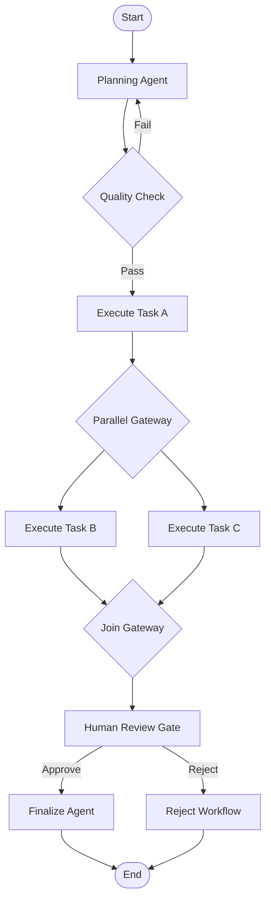

# AESP-0005: Workflow Orchestration

*Version 1.0.0-Draft | Status: Draft | Category: Standards Track | Date: 2026-07-10*

**Abstract.** This specification defines workflow orchestration semantics, workflow graph models, task decomposition patterns, execution state machines, failure handling and compensation, scheduling, state persistence, human-in-the-loop integration, multi-agent coordination models, and conformance requirements for Autonomous Engineering Organizations (AEOs) conforming to the AESP standard family.

**Related Specifications.** AESP-0000 (Constitution), AESP-0001 (Core Model), AESP-0002 (Agent Roles), AESP-0003 (Communication Protocols), AESP-0004 (Memory Systems)

> **Document Structure:** This specification is split across three files:
> - `AESP-0005.md` — Chapters 1-4: Introduction, Workflow Model Architecture, Task Decomposition, Execution Semantics
> - `AESP-0005-continued.md` — Chapters 5-8: Failure Handling, Scheduling & Triggers, State Persistence, Human-in-the-Loop
> - `AESP-0005-reference.md` — Chapters 9-12: Multi-Agent Coordination, Implementation Guidelines, Conformance, Appendices and References

## 1. Introduction

### 1.1 Purpose and Scope

AESP-0005 defines the workflow orchestration layer for autonomous agents operating inside an Autonomous Engineering Organization. As agent systems progress from single-turn prompts to multi-step, multi-agent, multi-session operations, the need for a formal orchestration model becomes critical. Without explicit orchestration, agents operate without predictable sequencing, error recovery, state visibility, or governance oversight.

Workflow orchestration in an AEO context addresses five fundamental questions. First, **what work should be done and in what order** — the definition of workflow graphs, task dependencies, sequencing rules, and parallel execution boundaries. Second, **who performs each unit of work** — the mapping from tasks to agents, roles, capabilities, and sub-workflows. Third, **what happens when work fails** — retry policies, compensation chains, escalation paths, and state recovery. Fourth, **how does work persist across time** — checkpoints, durable execution, scheduling, and human-in-the-loop pauses that may last hours or days. Fifth, **how do multiple agents coordinate** — orchestration, choreography, delegation, and shared-state models.

Temporal has emerged as the industry standard for durable workflow execution, used by OpenAI for Codex in production and across financial services, healthcare, and enterprise automation [^1^]. LangGraph provides graph-based agent orchestration with integrated state management and human-in-the-loop support [^2^]. Camunda's BPMN engine has been extended for agentic orchestration, providing governance and audit trails for AI agent workflows [^3^]. These implementations demonstrate convergent patterns that AESP-0005 codifies as a vendor-neutral standard.

This specification defines:

1. A workflow graph model supporting sequential, parallel, conditional, iterative, and hierarchical execution patterns.
2. Task decomposition semantics for breaking complex goals into executable units.
3. Execution state machines with defined states, transitions, and lifecycle rules.
4. Failure handling including retry policies, circuit breakers, saga compensation, and escalation.
5. Scheduling models for time-based, event-driven, and trigger-activated workflows.
6. State persistence and checkpointing aligned with AESP-0004 memory model.
7. Human-in-the-loop integration for approval, review, and intervention gates.
8. Multi-agent coordination patterns for orchestration, choreography, and delegation.
9. Conformance tiers and testing requirements.

This specification does not mandate a particular workflow engine, runtime, programming language, or deployment topology. Implementations MAY use Temporal, LangGraph, Camunda, Apache Airflow, Prefect, Argo Workflows, AWS Step Functions, or custom engines, provided the required AESP semantics are exposed through the normative interfaces defined here.

### 1.2 Normative Language

The key words "MUST", "MUST NOT", "REQUIRED", "SHALL", "SHALL NOT", "SHOULD", "SHOULD NOT", "RECOMMENDED", "MAY", and "OPTIONAL" in this document are to be interpreted as described in RFC 2119 [^4^].

Every requirement in this specification is assigned an identifier in the form `WF-REQ-NNN`. Requirement identifiers are stable across editorial revisions unless the requirement is removed by the AESP governance process.

### 1.3 Design Principles

#### 1.3.1 Orchestration Is Explicit

An AEO MUST NOT rely on implicit agent self-sequencing for multi-step work. Every workflow graph, task dependency, and state transition MUST be explicitly declared. Temporal's durable execution model demonstrates that explicit workflow definitions enable reliable recovery, audit, and human oversight [^1^]. LangGraph's graph-based approach shows that explicit state machines improve debuggability and testability compared to implicit agent loops [^2^].

#### 1.3.2 Workflows Are State Machines

Every workflow instance MUST have a well-defined state that persists across failures, restarts, and agent reassignments. The workflow state machine defines valid transitions, guarded transitions (authorization, policy), and terminal states. Camunda's BPMN engine and Temporal's workflow runtime both implement this principle: the workflow engine owns the state, and agents execute as activities within that state machine [^3^][^1^].

#### 1.3.3 Failure Is Anticipated

Workflow definitions MUST declare failure handling for each task or task group. Retry policies, compensation actions, circuit breaker thresholds, and escalation paths MUST be specified at design time, not discovered at runtime. The saga pattern, with compensating transactions for each forward action, is the RECOMMENDED approach for multi-step workflows with side effects [^5^].

#### 1.3.4 Humans Are Part of the Flow

Human-in-the-loop gates MUST be first-class workflow constructs, not afterthoughts. Approval steps, review gates, escalation points, and manual intervention slots MUST be explicitly modeled in the workflow definition. Temporal's signal-based human-in-the-loop pattern and Camunda's user task model provide reference implementations for this principle [^6^][^3^].

#### 1.3.5 Workflows Compose Hierarchically

Workflows MAY invoke sub-workflows, forming a hierarchy of orchestration scopes. Sub-workflow boundaries define isolation, error propagation, compensation scope, and state visibility. A parent workflow MUST be able to monitor, signal, cancel, and retrieve results from child workflows.

### 1.4 Relationship to Existing AESP Specifications

#### 1.4.1 AESP-0000 Constitution

AESP-0000 establishes the constitutional rules for vendor neutrality, machine-readable specifications, and auditability. Workflow orchestration is a governance-sensitive domain because workflows encode organizational policies, approval matrices, and escalation procedures. Workflow definitions and execution traces MUST be auditable, and workflow modifications MUST follow the AESP-0000 amendment process when they affect governed policies.

#### 1.4.2 AESP-0001 Core Model

AESP-0001 defines the WorkUnit entity as a unit of work assigned to an agent. AESP-0005 extends this concept: a workflow graph decomposes a goal into WorkUnits, each with defined inputs, outputs, dependencies, and success criteria. Workflow execution state aligns with the AESP-0001 state model. Agents referenced in workflow tasks MUST be identifiable using the AESP-0001 identity model.

#### 1.4.3 AESP-0002 Agent Roles

AESP-0002 defines role templates and permission boundaries. Workflow tasks MUST be assigned to agents based on role capabilities and permission scopes. Role-based authorization MUST be enforced before task dispatch. Workflow definitions MAY reference role templates for task assignment without specifying concrete agent identities.

#### 1.4.4 AESP-0003 Communication Protocols

AESP-0003 defines message envelopes, transport bindings, and communication patterns. Workflow orchestration messages — task assignments, status updates, result delivery, signals, cancellations — MUST use AESP-0003 envelopes. Inter-agent coordination within workflow execution builds on AESP-0003 multi-agent patterns.

#### 1.4.5 AESP-0004 Memory Systems

AESP-0004 defines memory types and storage backends. Workflow state, execution history, checkpoint data, and intermediate results SHOULD be stored using AESP-0004 memory records. Procedural memory, as defined in AESP-0004 Section 2.5, is the RECOMMENDED storage type for workflow definitions that represent reusable procedures. Episodic memory SHOULD capture execution traces for replay, debugging, and audit.

### 1.5 Terminology

**Workflow**: A directed graph of tasks with defined dependencies, execution rules, failure handling, and completion criteria.

**Workflow Instance**: A single execution of a workflow definition, with its own state, history, and identifier.

**Task**: The smallest unit of work in a workflow, assigned to an agent or sub-workflow.

**Task Decomposition**: The process of breaking a complex goal into a directed graph of tasks.

**Workflow Graph**: A directed, potentially cyclic graph where nodes represent tasks and edges represent dependencies, data flow, or control flow.

**Orchestration**: A coordination model where a central workflow engine controls task sequencing, state management, and error handling.

**Choreography**: A coordination model where agents interact through shared events without central control, each agent knowing its role in the overall workflow.

**Compensation**: A semantic undo action that reverses the effect of a previously completed task, defined as part of the saga pattern.

**Saga**: A sequence of tasks where each task has a compensating action, enabling reliable rollback of multi-step workflows.

**Checkpoint**: A durable snapshot of workflow state at a point where execution can safely resume after failure.

**Human-in-the-Loop (HITL)**: A workflow pattern that pauses execution to await human input, approval, or intervention.

**Signal**: An asynchronous message delivered to a running workflow instance, typically used for HITL and event-driven triggers.

**Workflow Definition**: The static specification of a workflow graph, tasks, policies, and metadata, expressed in machine-readable form.

**Activity**: A stateless function or operation invoked by a workflow engine on behalf of a task, corresponding to a Temporal activity or Camunda service task [^1^][^3^].

## 2. Workflow Model Architecture

### 2.1 Workflow Graph Model

A conforming implementation MUST support a directed graph model for workflow definition, where nodes represent tasks or sub-workflows and edges represent sequencing constraints, data dependencies, or control flow.

| Graph Element | Representation | Purpose |
|:---|:---|:---|
| Task Node | Rectangle with rounded corners | A unit of work executed by an agent |
| Sub-workflow Node | Double-lined rectangle | A nested workflow invoked as a node |
| Decision Node | Diamond (gateway) | Conditional branching based on state |
| Parallel Gateway | Plus symbol inside diamond | Fan-out to parallel tasks |
| Join Gateway | Plus symbol inside diamond | Synchronize parallel branches |
| Start Node | Circle (thin border) | Workflow entry point |
| End Node | Circle (thick border) | Workflow terminal state |
| Sequence Edge | Solid arrow | Control flow dependency |
| Data Edge | Dashed arrow | Data flow dependency |
| Event Edge | Dotted arrow | Event-triggered flow |

`WF-REQ-001`: A workflow graph MUST have exactly one start node and at least one end node.

`WF-REQ-002`: Every node in a workflow graph MUST be reachable from the start node through a path of sequence edges.

`WF-REQ-003`: Every node in a workflow graph MUST have at least one path to an end node, unless it is explicitly designated as an asynchronous fire-and-forget node.

`WF-REQ-004`: Workflow graphs MAY contain cycles, provided cycle termination conditions are explicitly declared.

The following diagram illustrates a canonical three-phase workflow graph:



### 2.2 Workflow Definition Schema

A conforming implementation MUST be able to serialize workflow definitions to JSON. The physical representation MAY use YAML, XML (BPMN), or another format, but JSON interchange is REQUIRED for cross-platform compatibility.

```json
{
  "$schema": "https://aesp.dev/schemas/aesp-0005/workflow-definition.schema.json",
  "type": "object",
  "required": [
    "workflowId",
    "name",
    "version",
    "nodes",
    "edges",
    "startNode",
    "endNodes"
  ],
  "properties": {
    "workflowId": { "type": "string", "format": "uri" },
    "name": { "type": "string" },
    "version": { "type": "string", "pattern": "^\\d+\\.\\d+\\.\\d+$" },
    "description": { "type": "string" },
    "tags": { "type": "array", "items": { "type": "string" } },
    "timeout": { "type": "string", "description": "ISO 8601 duration" },
    "nodes": {
      "type": "array",
      "items": { "$ref": "#/definitions/Node" }
    },
    "edges": {
      "type": "array",
      "items": { "$ref": "#/definitions/Edge" }
    },
    "startNode": { "type": "string" },
    "endNodes": { "type": "array", "items": { "type": "string" } },
    "metadata": { "type": "object" }
  },
  "definitions": {
    "Node": {
      "type": "object",
      "required": ["id", "type"],
      "properties": {
        "id": { "type": "string" },
        "type": {
          "type": "string",
          "enum": ["task", "subworkflow", "decision", "parallel", "join", "start", "end", "event"]
        },
        "name": { "type": "string" },
        "description": { "type": "string" },
        "taskType": { "type": "string" },
        "agentSelector": { "$ref": "#/definitions/AgentSelector" },
        "timeout": { "type": "string" },
        "retryPolicy": { "$ref": "#/definitions/RetryPolicy" },
        "compensation": { "type": "string" },
        "inputSchema": { "type": "object" },
        "outputSchema": { "type": "object" }
      }
    },
    "Edge": {
      "type": "object",
      "required": ["from", "to"],
      "properties": {
        "from": { "type": "string" },
        "to": { "type": "string" },
        "condition": { "type": "string" },
        "type": {
          "type": "string",
          "enum": ["sequence", "data", "event", "default"]
        }
      }
    },
    "AgentSelector": {
      "type": "object",
      "properties": {
        "role": { "type": "string" },
        "capability": { "type": "string" },
        "agentId": { "type": "string", "format": "uri" },
        "pool": { "type": "string" }
      }
    },
    "RetryPolicy": {
      "type": "object",
      "properties": {
        "maxAttempts": { "type": "integer", "minimum": 0 },
        "initialInterval": { "type": "string" },
        "maxInterval": { "type": "string" },
        "backoffCoefficient": { "type": "number", "minimum": 1.0 },
        "nonRetryableErrors": { "type": "array", "items": { "type": "string" } }
      }
    }
  }
}
```

`WF-REQ-005`: A workflow definition MUST include a semantic version identifier MAJOR.MINOR.PATCH.

`WF-REQ-006`: A workflow definition MUST declare its timeout or indicate that no timeout applies.

`WF-REQ-007`: Each task node in a workflow graph MUST declare an agent selector (by role, capability, or identity) or indicate that assignment is deferred to runtime.

### 2.3 Workflow Instance State Model

Every workflow instance MUST traverse a defined set of states:

```
PENDING → SCHEDULED → RUNNING → PAUSED ⇄ RUNNING → COMPLETED
                                          ↓
                                       FAILED
                                          ↓
                                    COMPENSATING → COMPENSATED
                                          ↓
                                       CANCELLED
```

| State | Definition | Mutability |
|:---|:---|:---|
| `PENDING` | Workflow created but not yet scheduled | Metadata only |
| `SCHEDULED` | Workflow queued for execution | Metadata only |
| `RUNNING` | One or more tasks executing | State + task results |
| `PAUSED` | Execution suspended (HITL, policy, error) | HITL input, policy |
| `FAILED` | Unrecoverable error occurred | Error details |
| `COMPENSATING` | Running compensation chain for failed workflow | Compensation state |
| `COMPENSATED` | All compensations completed | Compensation evidence |
| `COMPLETED` | All tasks finished successfully | Final results |
| `CANCELLED` | Explicit cancellation requested | Cancellation reason |

`WF-REQ-008`: A workflow instance MUST expose its current state, state history (including timestamps and actors for each transition), and a unique workflow instance identifier.

`WF-REQ-009`: A workflow instance that enters FAILED state MUST declare whether compensation is available, in progress, completed, or not supported.

`WF-REQ-010`: A workflow instance in PAUSED state MUST expose the reason for pausing, the expected input or signal type, and the timeout for automatic escalation.

`WF-REQ-011`: Workflow state transitions MUST be auditable, recording the transition source, target, actor (system or human), timestamp, and reason.

### 2.4 Task Instance State Model

Each task within a workflow instance has its own state machine:

```
PENDING → ASSIGNED → RUNNING → COMPLETED
                 ↓                  ↓
              FAILED_RETRYABLE → RUNNING (retry)
                 ↓
              FAILED_FATAL
                 ↓
              SKIPPED (conditional)
```

| State | Definition |
|:---|:---|
| `PENDING` | Task created, awaiting assignment |
| `ASSIGNED` | Agent assigned, execution not yet started |
| `RUNNING` | Agent is executing the task |
| `COMPLETED` | Task finished with success result |
| `FAILED_RETRYABLE` | Task failed but retry policy applies |
| `FAILED_FATAL` | Task failed, no retry possible or retries exhausted |
| `SKIPPED` | Task skipped due to conditional evaluation |

`WF-REQ-012`: A task instance MUST expose its state, assigned agent, start and end timestamps, input snapshot, output or error details, and retry count.

`WF-REQ-013`: A task that enters FAILED_FATAL state MUST provide the error classification, error details, and any partial results produced before failure.

## 3. Task Decomposition

### 3.1 Decomposition Strategies

Task decomposition transforms a complex goal into a structured workflow graph. A conforming implementation MUST support at least one of the following decomposition strategies and MAY support multiple.

#### 3.1.1 Sequential Decomposition

Goals are broken into a linear sequence of steps, each completing before the next begins. This is the simplest strategy, suitable when each step depends on the previous one.

`WF-REQ-014`: Sequential decomposition MUST preserve task ordering and pass outputs as inputs to subsequent tasks.

#### 3.1.2 Hierarchical Decomposition (HTN)

A goal is decomposed into sub-goals, each further decomposed until reaching primitive tasks. Hierarchical Task Network (HTN) planning formalizes this approach [^7^].

`WF-REQ-015`: Hierarchical decomposition MUST produce a valid decomposition tree where leaf nodes are executable tasks and internal nodes are sub-goals or sub-workflows.

`WF-REQ-016`: Hierarchical decomposition MUST detect and report unmet preconditions at each decomposition level.

#### 3.1.3 Parallel Decomposition

Independent sub-tasks are identified and scheduled for concurrent execution. Fan-out is controlled by parallel gateways in the workflow graph.

`WF-REQ-017`: Parallel decomposition MUST identify data dependencies that prevent parallel execution and fall back to sequential execution for dependent tasks.

#### 3.1.4 Conditional Decomposition

A decision node evaluates workflow state and routes execution to different branches based on conditions. This supports if-then-else, switch, and dynamic routing patterns.

`WF-REQ-018`: Conditional decomposition MUST declare the condition expression language and make the condition evaluation transparent in the audit trail.

### 3.2 Decomposition Agents

Task decomposition MAY be performed by a human, an LLM-powered planner, a rule-based system, or a combination. Regardless of the decomposer, the output MUST be a valid workflow graph conforming to the schema in Section 2.2.

`WF-REQ-019`: A machine-generated workflow graph MUST be validated against the workflow definition schema before execution.

`WF-REQ-020`: The decomposition process MUST be recorded as provenance in the workflow instance metadata, including the decomposer identity (human or agent), decomposition strategy used, and input goal.

`WF-REQ-021`: LLM-based decomposition agents MUST have their output reviewed when the workflow contains tasks that modify protected resources, require human approval, or exceed a configurable risk threshold.

### 3.3 Decomposition Quality Requirements

`WF-REQ-022`: Each decomposed task MUST have a clear success criterion expressed as either a boolean condition, a schema validation rule, or an evaluation prompt for LLM-based tasks.

`WF-REQ-023`: Decomposition MUST avoid tasks that are too large to complete within a single context window or agent session, unless the task is itself a sub-workflow with its own decomposition.

`WF-REQ-024`: Decomposition SHOULD prefer task granularities that minimize cross-task data transfer and maximize task independence.

## 4. Execution Semantics

### 4.1 Execution Engine Responsibilities

A workflow execution engine is responsible for state management, task dispatch, event handling, timeout enforcement, retry management, compensation coordination, and audit logging.

`WF-REQ-025`: A workflow execution engine MUST maintain durable state for all running and paused workflow instances, recovering correctly after process restart or infrastructure failure.

`WF-REQ-026`: A workflow execution engine MUST support at-least-once task delivery semantics, with idempotency keys to prevent duplicate execution.

`WF-REQ-027`: A workflow execution engine MUST enforce task timeouts and propagate timeout events to the workflow failure handling logic.

Temporal's durable execution model provides the reference pattern: workflow state is persisted as an event log, activities are dispatched to stateless workers, and the engine reconstructs workflow state by replaying the event log after failures [^1^]. LangGraph uses checkpoint-based persistence where each node execution saves state to a configurable store (in-memory, SQLite, or Postgres) [^2^].

### 4.2 Task Dispatch

Task dispatch selects an agent or worker to execute a task and delivers the task input.

`WF-REQ-028`: Task dispatch MUST evaluate agent selector rules (role, capability, identity, pool) against available agents before assignment.

`WF-REQ-029`: Task dispatch MUST include the full task input, expected output schema, timeout, retry policy, and correlation identifiers in the dispatch message.

`WF-REQ-030`: Task dispatch messages MUST conform to AESP-0003 message envelope format.

`WF-REQ-031`: If no suitable agent is available for task assignment, the workflow MUST enter PAUSED state with reason `agent_unavailable` and MAY be configured to wait, escalate, or fail.

### 4.3 Data Flow Between Tasks

Data flows between tasks along data edges and sequence edges. A task receives its inputs from predecessor tasks according to declared data dependencies.

`WF-REQ-032`: A task MUST receive its declared inputs before execution begins. Missing inputs MUST cause the task to enter FAILED_RETRYABLE state.

`WF-REQ-033`: Data passed between tasks SHOULD include source task identifier, output field path, target task input field, and transformation description.

`WF-REQ-034`: Large data objects (exceeding 1 MB) SHOULD be passed by reference using AESP-0004 memory record identifiers rather than inline in the workflow state.

### 4.4 Parallel Execution

Parallel execution allows independent tasks to run concurrently, reducing total workflow duration.

`WF-REQ-035`: A parallel gateway MUST fan out to all outgoing edges simultaneously, creating a child task for each.

`WF-REQ-036`: A join gateway MUST wait for all inbound branches to complete before proceeding, unless a cancellation or failure on one branch triggers compensation.

`WF-REQ-037`: Parallel branches MUST have isolated failure domains: a failure on one branch MUST NOT automatically fail other branches unless explicitly configured.

### 4.5 Conditional Routing and Decisions

Decision nodes evaluate conditions to select one of multiple outgoing paths.

`WF-REQ-038`: A decision node MUST evaluate conditions in declared order and follow the first matching path. If no condition matches and no default edge exists, the workflow MUST enter FAILED state with reason `unhandled_condition`.

`WF-REQ-039`: Condition expressions MUST be deterministic and side-effect-free to ensure replay safety.

`WF-REQ-040`: Decision outcomes MUST be recorded in the workflow audit trail, including the condition expression, evaluated values, and selected path.

### 4.6 Sub-Workflow Invocation

A task node MAY reference another workflow definition as a sub-workflow, creating a parent-child workflow hierarchy.

`WF-REQ-041`: A sub-workflow invocation MUST create a new workflow instance with its own state, identifier, and lifecycle.

`WF-REQ-042`: The parent workflow MAY monitor, signal, cancel, or request status from a child workflow using AESP-0003 message envelopes.

`WF-REQ-043`: Sub-workflow failures MUST propagate to the parent according to declared error propagation policy (isolated, escalate, compensate).

`WF-REQ-044`: A parent workflow MAY define timeout behavior for sub-workflows, including escalation to an alternative sub-workflow, compensation, or human intervention.
