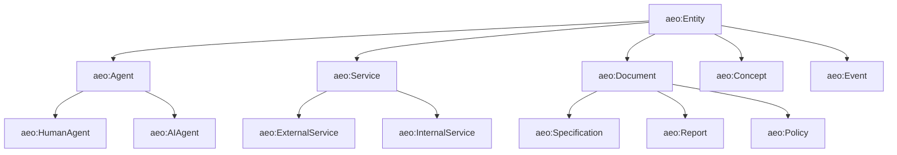

# AESP-0006: Knowledge Graph

*Version 1.0.0-Draft | Status: Draft | Category: Standards Track | Date: 2026-07-10*

**Abstract.** This specification defines knowledge graph semantics for Autonomous Engineering Organizations, including entity and relationship modeling, ontology and schema languages, query semantics, construction and extraction methods, reasoning and inference rules, integration with AESP-0004 semantic memory, distributed knowledge graph federation, and conformance requirements.

**Related Specifications.** AESP-0000 (Constitution), AESP-0001 (Core Model), AESP-0004 (Memory Systems)

> **Document Structure:** This specification is split across three files:
> - `AESP-0006.md` — Chapters 1-4: Introduction, Knowledge Graph Model Architecture, Entity and Relationship Modeling, Ontology and Schema
> - `AESP-0006-continued.md` — Chapters 5-8: Query Semantics, Construction and Extraction, Reasoning and Inference, Integration with Memory Systems
> - `AESP-0006-reference.md` — Chapters 9-12: Distributed Knowledge Graphs, Implementation Guidelines, Conformance and Testing, Appendices and References

## 1. Introduction

### 1.1 Purpose and Scope

AESP-0006 defines the knowledge graph layer for Autonomous Engineering Organizations. While AESP-0004 establishes memory records as discrete, addressable units of information, AESP-0006 defines how those memory records can be structured, queried, and reasoned over as a graph of entities and relationships. The knowledge graph complements AESP-0004 semantic memory: AESP-0004 provides the memory substrate; AESP-0006 provides the graph semantics, schema, query, and reasoning layers that operate on top of that substrate.

Knowledge graphs in the AEO context serve five roles. First, **structured representation of domain knowledge** — entities, their attributes, and the typed relationships between them form an executable model of the AEO's operational domain. Second, **query and traversal substrate** — multi-hop reasoning, path queries, and subgraph extraction are essential for agents that need to navigate complex dependency graphs, code relationships, infrastructure topologies, and organizational structures. Third, **reasoning substrate** — inference rules derive implicit facts from explicit ones, supporting ontology-driven reasoning and consistency checking. Fourth, **provenance and evidence** — knowledge graphs track the source of each fact, its confidence, and its lineage, which is critical for audit and explainability. Fifth, **inter-agent shared understanding** — agents operating on the same knowledge graph share a common world model rather than exchanging fragmented memory records.

Property graph databases (Neo4j, Memgraph, TigerGraph, JanusGraph) and RDF triple stores (Apache Jena, Stardog, Blazegraph, GraphDB) have converged on a set of complementary graph data models. Neo4j's property graph with Cypher query language serves as one reference pattern [^1^]. Stardog's RDF-star model with SPARQL provides another, with support for provenance and reification at the triple level [^2^]. Microsoft's GraphRAG framework demonstrated that LLM-driven entity extraction combined with community detection over knowledge graphs produces high-quality retrieval for complex queries [^3^]. The W3C Semantic Web standards — RDF 1.1, RDF Schema, OWL 2, SPARQL 1.1, SHACL — provide the foundational ontology and constraint languages [^4^][^5^][^6^][^7^].

This specification defines:

1. A dual-model knowledge graph supporting both RDF triple stores and property graphs.
2. Entity and relationship modeling with typed predicates, attributes, and provenance.
3. Ontology and schema languages compatible with RDF Schema and OWL 2 profiles.
4. Query semantics covering path queries, subgraph extraction, semantic search, and constraint validation.
5. Construction methods including manual curation, automated extraction, and schema mapping.
6. Reasoning rules covering transitive closure, subsumption, equivalence, and default logic.
7. Integration with AESP-0004 semantic memory as the canonical storage layer.
8. Federation and partitioning for distributed knowledge graphs.
9. Conformance tiers and evaluation metrics.

This specification does not mandate a particular graph database, query engine, or reasoning implementation. Implementations MAY use Neo4j, Apache Jena, Stardog, Memgraph, TigerGraph, Blazegraph, Amazon Neptune, or custom engines, provided the required AESP-0006 semantics are exposed through the normative interfaces defined here.

### 1.2 Normative Language

The key words "MUST", "MUST NOT", "REQUIRED", "SHALL", "SHALL NOT", "SHOULD", "SHOULD NOT", "RECOMMENDED", "MAY", and "OPTIONAL" in this document are to be interpreted as described in RFC 2119 [^8^].

Every requirement in this specification is assigned an identifier in the form `KG-REQ-NNN`. Requirement identifiers are stable across editorial revisions unless the requirement is removed by the AESP governance process.

### 1.3 Design Principles

#### 1.3.1 Graphs Are Typed

Every node and edge in an AESP-0006 knowledge graph MUST have an explicit type drawn from a declared ontology. Untyped nodes and edges are non-conformant. Typing enables reasoning, schema validation, query optimization, and explainability — without types, a graph is merely a collection of unlabeled connections.

#### 1.3.2 Provenance Is Mandatory

Every fact in the knowledge graph MUST carry provenance metadata identifying its source, confidence, and timestamp. Knowledge graphs without provenance cannot be audited, cannot be trusted for regulated decisions, and cannot be reliably evolved when sources change. The PROV-O ontology provides one reference model for representing provenance [^9^].

#### 1.3.3 Schemas Are Constraints, Not Suggestions

Every knowledge graph MUST have a declared schema or ontology that constrains what types of nodes, edges, and properties are permitted. Validation against the schema is a hard requirement, not advisory. SHACL (Shapes Constraint Language) provides the reference for property graph and RDF schema validation [^7^].

#### 1.3.4 Reasoning Is Bounded

Reasoning and inference MUST be bounded by declared rules with explicit termination conditions. Unbounded reasoning can lead to infinite loops, inconsistent conclusions, and unpredictable query performance. AESP-0006 defines the rule families that conforming implementations MUST support and MAY extend.

#### 1.3.5 Graphs Compose with Memory

Knowledge graphs in AESP-0006 are not separate from memory; they are a structured view of the AEO's semantic memory. AESP-0006 builds on AESP-0004's semantic memory model: semantic memory records become knowledge graph nodes, and typed relationships between records become edges.

### 1.4 Relationship to Existing AESP Specifications

#### 1.4.1 AESP-0000 Constitution

AESP-0000 establishes vendor neutrality and machine-readability requirements. Knowledge graph schemas MUST be machine-readable, versioned, and auditable. Vocabulary and ontology definitions SHOULD use standard IRIs from established vocabularies (RDF, SKOS, PROV-O, schema.org, DCAT) where applicable to support cross-AEO interoperability.

#### 1.4.2 AESP-0001 Core Model

AESP-0001 defines the foundational entities — Agent, Organization, Role, WorkUnit, Capability, Resource. These entities appear as node types in AESP-0006 knowledge graphs. AESP-0006 references AESP-0001 entities by their URIs (e.g., `urn:aeo:agent:planner`) as graph nodes, preserving identity consistency across specifications.

#### 1.4.3 AESP-0004 Memory Systems

AESP-0004 defines four memory types: working, episodic, semantic, and procedural. AESP-0006 knowledge graphs are the canonical structural representation of semantic memory. A knowledge graph node MAY be backed by an AESP-0004 semantic memory record, and vice versa. Episodic memory records that document events involving multiple entities SHOULD record the entity references as graph edges, enabling graph reconstruction from event history.

### 1.5 Terminology

**Knowledge Graph**: A directed, typed graph of entities (nodes) and relationships (edges), where each node and edge has a type from a declared ontology, attributes from declared property schemas, and provenance metadata.

**Entity**: A node in the knowledge graph representing a discrete, identifiable thing — an agent, a document, a service, a concept, or any other domain object.

**Relationship**: A directed, typed edge in the knowledge graph connecting two entities.

**Predicate**: The type of a relationship, drawn from the ontology. In RDF, predicates are IRIs; in property graphs, they are edge labels.

**Ontology**: A formal specification of the types, predicates, and constraints that govern a knowledge graph. AESP-0006 supports RDF Schema, OWL 2 profiles, and property graph schemas.

**Schema**: A machine-readable specification of the structure of nodes, edges, and properties permitted in a knowledge graph.

**Triple**: An RDF statement of the form (subject, predicate, object) representing a single fact.

**Quad**: A triple augmented with a named graph identifier, enabling provenance and grouping at the triple level.

**Property Graph**: A graph model where nodes and edges carry key-value property maps. Neo4j and Memgraph are property graph databases.

**RDF Graph**: A graph model where facts are triples. Apache Jena, Stardog, and Blazegraph are RDF triple stores.

**Named Graph**: An RDF mechanism for grouping triples under a graph identifier, enabling per-fact provenance and federation.

**Shape**: A SHACL declaration that constrains the structure of nodes or edges in a graph.

**Inference**: The derivation of new facts from existing facts using declared rules.

**Reasoner**: A component that performs inference over a knowledge graph.

**Embedding**: A dense vector representation of a node, edge, or subgraph, learned from graph structure and attributes.

**GraphRAG**: Retrieval-Augmented Generation where retrieval operates over a knowledge graph rather than a flat document corpus.

## 2. Knowledge Graph Model Architecture

### 2.1 Dual-Model Support

AESP-0006 supports both RDF triple stores and property graphs. Conforming implementations MUST support at least one of these models and MAY support both.

| Model | Primitive | Query Language | Schema | Reasoning |
|:---|:---|:---|:---|:---|
| RDF | Triple (s, p, o) | SPARQL 1.1 | RDFS, OWL 2, SHACL | RDFS, OWL-DL, OWL-RL, rules |
| Property Graph | Node + Edge + Properties | Cypher, GQL | Property schemas | Custom rules, graph algorithms |

`KG-REQ-001`: A conforming implementation MUST be able to import and export knowledge graphs in a canonical JSON-LD or RDF/Turtle representation for interchange.

`KG-REQ-002`: A conforming implementation MUST support the basic graph operations of node creation, edge creation, attribute update, node deletion, and edge deletion.

`KG-REQ-003`: A knowledge graph MUST identify each node with a globally unique IRI (Internationalized Resource Identifier) and each edge with the IRIs of its endpoints plus its predicate IRI.

### 2.2 Node Model

A node in an AESP-0006 knowledge graph represents an entity. Each node MUST have:

1. An IRI as the primary identifier.
2. A type drawn from the ontology.
3. A property map of attribute name to attribute value.
4. Provenance metadata recording the source, contributor, confidence, and timestamp.

```json
{
  "id": "urn:aeo:entity:service:auth-gateway",
  "type": "aeo:Service",
  "label": "Authentication Gateway",
  "properties": {
    "aeo:version": "2.7.3",
    "aeo:runtime": "go-1.22",
    "aeo:deploymentStage": "production",
    "aeo:ownerTeam": "urn:aeo:team:platform-security"
  },
  "provenance": {
    "aeo:source": "urn:aeo:source:terraform-state-prod",
    "aeo:contributor": "urn:aeo:agent:infrastructure-scanner",
    "aeo:confidence": 0.99,
    "aeo:observedAt": "2026-07-10T08:00:00Z",
    "aeo:recordedAt": "2026-07-10T08:05:23Z"
  }
}
```

`KG-REQ-004`: Every node MUST have at least one type. Nodes with multiple types (multiple inheritance) MUST be permitted by the schema.

`KG-REQ-005`: Node types MUST be declared in the ontology with their permitted attributes, attribute types, and cardinality constraints.

`KG-REQ-006`: Node IRIs MUST be persistent. Once created, a node IRI MUST continue to identify the same logical entity, even if the node's attributes change.

`KG-REQ-007`: Node merging — combining two nodes that represent the same logical entity — MUST be an explicit operation with auditable provenance, not a silent deduplication.

### 2.3 Edge Model

An edge in an AESP-0006 knowledge graph represents a typed relationship between two nodes. Each edge MUST have:

1. An identifier (IRI or graph-local identifier).
2. A predicate (relationship type) drawn from the ontology.
3. A source node IRI.
4. A target node IRI.
5. A direction (default: source to target).
6. A property map of attribute name to attribute value.
7. Provenance metadata.

`KG-REQ-008`: Every edge MUST have exactly one source and exactly one target. Hyperedges (relations among three or more entities) MUST be reified using an intermediate node if needed, per Section 3.5.

`KG-REQ-009`: Edge direction MUST be preserved in the graph model. Bidirectional edges MUST be modeled as two directed edges with inverse predicates or as a single edge with bidirectional semantics declared in the schema.

`KG-REQ-010`: An edge MAY have an optional qualifier that further refines its meaning. Qualifiers are property maps attached to the edge. For example, an edge of type `aeo:employedBy` between a person node and an organization node MAY carry qualifiers like `startDate`, `endDate`, and `role`.

### 2.4 Property Model

Properties on nodes and edges are typed values. AESP-0006 supports the following primitive property types:

| Type | Description | Example |
|:---|:---|:---|
| `xsd:string` | Unicode string | `"Authentication Gateway"` |
| `xsd:integer` | 64-bit integer | `42` |
| `xsd:decimal` | Arbitrary precision decimal | `3.14159` |
| `xsd:boolean` | True or false | `true` |
| `xsd:dateTime` | ISO 8601 timestamp | `2026-07-10T12:00:00Z` |
| `xsd:duration` | ISO 8601 duration | `P1Y2M10DT2H30M` |
| `xsd:anyURI` | IRI reference | `urn:aeo:agent:planner` |
| `xsd:langString` | String with language tag | `"depósito"@pt-BR` |

`KG-REQ-011`: Every property MUST declare its type in the schema. Properties without declared types MUST be rejected at write time.

`KG-REQ-012`: Multi-valued properties MUST be modeled as ordered or unordered lists with explicit semantics in the schema. The order of values in a list MUST be preserved if declared `rdf:List` or an equivalent construct.

`KG-REQ-013`: Property values MUST conform to their declared type. Type coercion SHOULD be performed only when explicitly declared in the schema, and SHOULD be auditable.

### 2.5 Graph Identity and IRI Patterns

AESP-0006 recommends the following IRI patterns for AEO entities:

| Entity Class | IRI Pattern | Example |
|:---|:---|:---|
| Agent | `urn:aeo:agent:{scope}:{name}` | `urn:aeo:agent:planner` |
| Service | `urn:aeo:entity:service:{name}` | `urn:aeo:entity:service:auth-gateway` |
| Document | `urn:aeo:entity:document:{type}:{id}` | `urn:aeo:entity:document:rfc:2119` |
| Concept | `urn:aeo:concept:{namespace}:{name}` | `urn:aeo:concept:workflow:saga` |
| Event | `urn:aeo:event:{type}:{id}` | `urn:aeo:event:deployment:42` |
| Memory Record | `urn:aeo:memory:{scope}:{id}` | `urn:aeo:memory:team:aesp-0006:decision-7` |

`KG-REQ-014`: AESP-defined entity IRIs SHOULD follow the patterns above. Custom IRIs are permitted but MUST be declared in the AEO's namespace registry.

`KG-REQ-015`: External vocabularies SHOULD use their canonical IRIs (e.g., `rdf:type`, `rdfs:label`, `prov:wasDerivedFrom`, `schema:name`).

### 2.6 Knowledge Graph Container

A knowledge graph in AESP-0006 is contained within a graph container that declares:

1. The graph IRI — a globally unique identifier for this graph instance.
2. The ontology IRI — the ontology that governs types and constraints.
3. The version — semantic version of the graph's structure and contents.
4. The provenance — who created this graph, when, and from what sources.
5. The access policy — which agents and roles may read or modify the graph.

`KG-REQ-016`: Every knowledge graph MUST be associated with exactly one primary ontology that governs its schema. Extension ontologies MAY be imported to add additional types and predicates.

`KG-REQ-017`: Knowledge graph modifications MUST be version-controlled. Each version MUST declare what changed (added nodes, added edges, modified properties, deleted entities) and the reason for the change.

`KG-REQ-018`: Knowledge graph containers MUST support at least two access modes: `read` (query without modification) and `write` (add, update, delete operations). An optional `admin` mode MAY be supported for ontology modifications and graph structure changes.

## 3. Entity and Relationship Modeling

### 3.1 Naming Conventions

AESP-0006 adopts the following naming conventions to promote clarity and consistency:

- **Class names** (types): CamelCase, singular noun (`Agent`, `Document`, `ServiceInstance`).
- **Property names**: camelCase, noun phrase (`version`, `deploymentStage`, `lastModifiedAt`).
- **Predicate names**: camelCase, verb phrase in present tense (`dependsOn`, `deployedTo`, `ownedBy`, `parentOf`).
- **Inverse predicates**: Where applicable, define an inverse predicate (`dependsOn` ↔ `dependencyOf`).

`KG-REQ-019`: All class, property, and predicate names MUST be declared in the ontology. Names not declared in the ontology MUST NOT appear in the graph.

### 3.2 Type Hierarchies and Inheritance

AESP-0006 supports class hierarchies where a more specific class inherits properties and constraints from a more general class.

`KG-REQ-020`: A class MAY declare one or more parent classes (multiple inheritance). The class inherits all properties and constraints from its ancestors.

`KG-REQ-021`: The class hierarchy MUST be acyclic. A cycle in the class hierarchy MUST be rejected at ontology validation time.

`KG-REQ-022`: When a node has multiple types, the effective set of permitted properties is the union of properties declared on all assigned types and their ancestors.

The following diagram illustrates a class hierarchy in the AEO domain:



### 3.3 Relationship Cardinality

Each predicate declaration MUST specify its expected cardinality on the source and target sides:

| Cardinality | Meaning |
|:---|:---|
| `1` | Exactly one related entity |
| `0..1` | Zero or one related entity |
| `1..*` | One or more related entities |
| `0..*` | Zero or more related entities (unbounded) |
| `n..m` | Specific lower and upper bounds |

`KG-REQ-023`: Cardinality constraints MUST be declared in the ontology and enforced at write time. Violations MUST be rejected with a validation error.

`KG-REQ-024`: Cardinality constraints are enforced on the declared direction of the predicate. Inverse predicates MUST declare their own cardinality.

### 3.4 Inverse Predicates

When a predicate has a natural inverse (e.g., `parentOf` ↔ `childOf`), the ontology MUST declare both predicates as inverses of each other.

`KG-REQ-025`: An inverse predicate declaration MUST specify the predicate it inverts. When an edge of type P is created with source S and target T, the graph MAY automatically create the inverse edge unless explicitly disabled.

`KG-REQ-026`: Inverse predicates MUST have consistent cardinality. If P is declared as `0..1` from S to T, its inverse Q MUST be `0..*` from T to S.

### 3.5 N-ary Relations and Reification

Relations involving more than two entities (n-ary relations) MUST be reified — represented using an intermediate node that holds the relation's properties and connects to each participant via typed edges.

`KG-REQ-027`: An n-ary relation MUST be represented as a reification node of type that indicates the relation semantics, connected to each participant via edges of type `aeo:hasParticipant` or a more specific predicate.

`KG-REQ-028`: The reification node MUST carry the relation's own properties (e.g., temporal extent, confidence, source) and the participant-specific qualifiers.

Example: modeling a software deployment event that involves a service, a deployer agent, a target environment, and a timestamp:

```json
{
  "id": "urn:aeo:event:deployment:42",
  "type": "aeo:Deployment",
  "properties": {
    "aeo:timestamp": "2026-07-10T12:30:00Z",
    "aeo:version": "2.7.4"
  },
  "edges": [
    { "predicate": "aeo:deployedService", "target": "urn:aeo:entity:service:auth-gateway" },
    { "predicate": "aeo:deployedBy", "target": "urn:aeo:agent:deployer" },
    { "predicate": "aeo:deployedTo", "target": "urn:aeo:environment:prod-us-east-1" }
  ]
}
```

### 3.6 Identity and Merging

Entities may be referenced by multiple names or identifiers across data sources (e.g., a service may have a name in Terraform, an ID in Kubernetes, a hostname in DNS). Knowledge graphs MUST support identity resolution and entity merging.

`KG-REQ-029`: An entity MAY have multiple identifier properties (e.g., `aeo:k8sId`, `aeo:terraformName`). The ontology MUST declare which property is the canonical IRI.

`KG-REQ-030`: Entity merging MUST be explicit. Two nodes representing the same logical entity MAY be merged by an explicit merge operation that preserves provenance from both source nodes.

`KG-REQ-031`: After merging, all references to the merged nodes MUST resolve to the canonical merged node. Implementations MUST provide a redirect map for any surviving external references.

## 4. Ontology and Schema

### 4.1 Ontology Languages

AESP-0006 supports three ontology language families:

| Language | Standard | Strengths |
|:---|:---|:---|
| RDF Schema (RDFS) | W3C Recommendation | Simple class and property hierarchies, basic domain/range constraints |
| OWL 2 Profiles | W3C Recommendation | Rich class expressions, property characteristics, complex constraints |
| SHACL | W3C Recommendation | Property graph shape validation, constraint language |

`KG-REQ-032`: A conforming ontology MUST be expressible in at least one of RDFS, OWL 2 RL, or SHACL.

`KG-REQ-033`: OWL 2 ontologies used by AESP-0006 implementations MUST be limited to one of the profiles: OWL 2 EL, OWL 2 QL, OWL 2 RL, or a custom profile whose expressivity is declared.

### 4.2 Property Characteristics

Property characteristics in OWL and property graph schemas MUST be declared:

| Characteristic | Meaning |
|:---|:---|
| `Functional` | The property has at most one value for any subject |
| `Inverse functional` | The property's value uniquely identifies the subject |
| `Transitive` | If P(a,b) and P(b,c), then P(a,c) |
| `Symmetric` | If P(a,b), then P(b,a) |
| `Asymmetric` | If P(a,b), then NOT P(b,a) |
| `Reflexive` | P(a,a) for all a |
| `Irreflexive` | NOT P(a,a) for all a |

`KG-REQ-034`: Properties with semantic implications (transitivity, symmetry, etc.) MUST declare their characteristics in the ontology. Reasoners MUST apply the declared characteristics during inference.

### 4.3 Class Expressions

AESP-0006 supports OWL 2 class expressions for defining complex classes:

- **Intersection**: `A AND B` — instances of both A and B.
- **Union**: `A OR B` — instances of either A or B.
- **Complement**: `NOT A` — instances not of A.
- **Existential restriction**: `∃P.C` — instances that have at least one P-edge to an instance of C.
- **Universal restriction**: `∀P.C` — instances whose all P-edges go to instances of C.
- **Cardinality restriction**: `≥n P.C` — instances that have at least n P-edges to instances of C.

`KG-REQ-035`: Class expressions MUST be evaluated by the reasoner during inference. Subclass relationships derived from class expressions MUST be inferable and queryable.

### 4.4 Constraint Validation with SHACL

SHACL (Shapes Constraint Language) provides a constraint language for validating RDF and property graph data against declared shapes [^7^].

```turtle
ex:ServiceShape
    a sh:NodeShape ;
    sh:targetClass aeo:Service ;
    sh:property [
        sh:path aeo:version ;
        sh:datatype xsd:string ;
        sh:minCount 1 ;
        sh:maxCount 1 ;
    ] ;
    sh:property [
        sh:path aeo:ownerTeam ;
        sh:nodeKind sh:IRI ;
        sh:minCount 1 ;
    ] .
```

`KG-REQ-036`: A conforming implementation MUST support SHACL Core constraint validation, including cardinality constraints, datatype constraints, value range constraints, and pattern constraints.

`KG-REQ-037`: SHACL validation reports MUST identify the violated shape, the offending node or value, the violated constraint, and a severity level (`Violation`, `Warning`, `Info`).

`KG-REQ-038`: Validation MAY be performed at write time (rejection on violation) or at query time (filtering or flagging). The schema declaration MUST specify which mode applies.

### 4.5 Ontology Versioning and Evolution

Ontologies evolve over time as domain knowledge expands. AESP-0006 mandates semantic versioning for ontologies and defines compatibility rules.

`KG-REQ-039`: Every ontology MUST declare a semantic version identifier MAJOR.MINOR.PATCH.

`KG-REQ-040`: Backward-compatible ontology changes (adding classes, adding properties, broadening ranges, narrowing cardinality) MUST increment the MINOR version. Breaking changes (removing classes, removing properties, narrowing ranges, tightening cardinality) MUST increment the MAJOR version.

`KG-REQ-041`: When an ontology transitions to a new MAJOR version, all knowledge graphs using the old version MUST be migrated to the new version, declared as a separate versioned graph, or marked as deprecated.

`KG-REQ-042`: Ontology authors SHOULD publish change logs describing ontology evolution and providing migration guides for affected knowledge graphs.

### 4.6 Standard AEO Ontology

AESP-0006 recommends a baseline AEO ontology covering the entities defined in AESP-0001 (Agent, Organization, Role, WorkUnit, Capability, Resource) and the relationships between them. Implementations MAY extend the baseline ontology with domain-specific classes and properties.

The following baseline predicates are RECOMMENDED:

| Predicate | Domain | Range | Inverse | Description |
|:---|:---|:---|:---|:---|
| `aeo:hasMember` | Organization | Agent | `aeo:memberOf` | Membership in an organization |
| `aeo:hasRole` | Agent | Role | — | Role assignment |
| `aeo:performsWorkUnit` | Agent | WorkUnit | `aeo:performedBy` | Agent executes work unit |
| `aeo:hasCapability` | Agent | Capability | `aeo:capabilityOf` | Agent possesses capability |
| `aeo:dependsOn` | WorkUnit | WorkUnit | `aeo:dependencyOf` | Work unit depends on another |
| `aeo:produces` | WorkUnit | Resource | `aeo:producedBy` | Work unit produces a resource |
| `aeo:consumes` | WorkUnit | Resource | `aeo:consumedBy` | Work unit consumes a resource |
| `aeo:references` | Resource | Entity | `aeo:referencedBy` | Resource references an entity |
| `aeo:derivedFrom` | Entity | Entity | `aeo:derived` | Entity derived from another |
| `aeo:governedBy` | Entity | Policy | `aeo:governs` | Entity governed by a policy |
