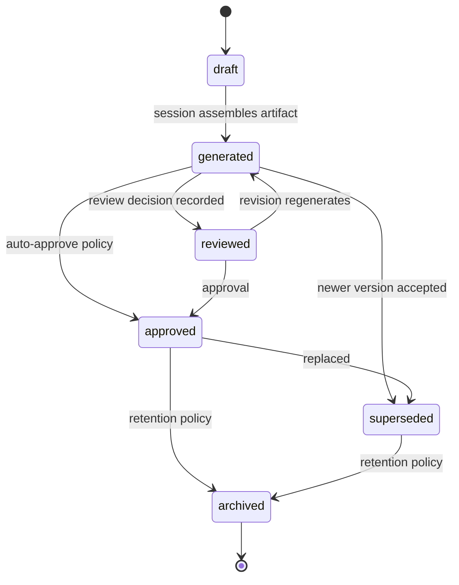

# AESP-0007: Code Generation, Continued

## 5. Generation Execution

Generation execution turns a validated request into artifacts, diagnostics, and an auditable session history. AESP-0007 defines execution semantics without mandating a particular runtime topology.

### 5.1 Execution Pipeline

A conforming session SHOULD progress through the following stages:

1. Authorize requester and resolve engine.
2. Validate request structure, constraints, and required context.
3. Materialize context pack and pin content hashes.
4. Execute generation according to mode.
5. Assemble artifacts and compute content hashes.
6. Run validators.
7. Apply review policy.
8. Emit response and persist provenance.

`CG-REQ-069`: Implementations MUST perform request validation before generation side effects that write to shared artifact stores or repositories.

`CG-REQ-070`: Implementations MUST pin resolved context content hashes before generation begins when determinism mode is `reproducible` or `best-effort`.

`CG-REQ-071`: Stage failures MUST identify the failing stage in diagnostics and MUST NOT claim success for later stages that did not run.

### 5.2 Multi-file Generation

AEOs commonly generate repositories, packages, modules, tests, configuration, documentation, and infrastructure together.

`CG-REQ-072`: Multi-file sessions MUST treat the set of produced artifacts as a single transactional unit for acceptance unless the request declares per-artifact acceptance.

`CG-REQ-073`: Cross-file references (imports, package manifests, route tables, documentation links) SHOULD be validated as a graph when validators for those relationships are configured.

`CG-REQ-074`: Multi-file responses MUST provide a manifest listing every artifact path, kind, language or media type, and content hash.

`CG-REQ-075`: When generating package manifests and source files together, dependency declarations MUST be consistent with imports or module references detected by configured validators.

### 5.3 Multi-language and Mixed Outputs

`CG-REQ-076`: A session MAY produce mixed-language outputs and non-code artifacts (YAML, JSON, Markdown, Terraform, SQL, protobuf) if allowed by constraints.

`CG-REQ-077`: Each artifact MUST declare its language or media type. Undeclared types are non-conformant for accepted artifacts.

`CG-REQ-078`: Language-specific validators MUST be selected based on declared language or media type, not solely on file extension, when both are available and conflict.

### 5.4 Streaming and Progress

`CG-REQ-079`: Implementations MAY stream partial artifacts, token progress, or file-level progress events using AESP-0003 messaging patterns.

`CG-REQ-080`: Streamed partial content MUST be marked `draft` or `ephemeral` until final assembly and validation complete.

`CG-REQ-081`: Progress events MUST include session identifier, stage, and a monotonic sequence number or timestamp.

### 5.5 Cancellation and Timeouts

`CG-REQ-082`: Sessions MUST support cancellation by an authorized actor. Cancellation MUST transition the session to `cancelled` and MUST stop further writes to accepted artifact state.

`CG-REQ-083`: Timeout policies MUST be configurable. On timeout, the session MUST fail or cancel with a structured timeout error and MAY return partial artifacts only if marked incomplete.

`CG-REQ-084`: Cancelled sessions MUST retain audit history and any durable partial artifacts according to retention policy.

### 5.6 Determinism and Reproducibility

Determinism is a spectrum. AESP-0007 standardizes declaration and evidence, not a claim that all model-backed generation is bit-identical.

`CG-REQ-085`: Every session MUST declare its determinism mode.

`CG-REQ-086`: For `reproducible` sessions, re-executing the same request with the same engine version, model or template versions, seed, configuration, and context hashes SHOULD produce identical artifact content hashes. If an implementation cannot guarantee this, it MUST NOT advertise `reproducible`.

`CG-REQ-087`: Seeds, model identifiers, template versions, toolchain versions (formatter, compiler, linter), and context hashes used for reproducibility MUST be present in provenance.

`CG-REQ-088`: `best-effort` sessions SHOULD minimize nondeterminism (temperature zero, pinned versions) but MAY acknowledge residual nondeterminism in the execution summary.

### 5.7 Provenance and Traceability

`CG-REQ-089`: Every accepted artifact MUST have a provenance record containing at least: request id, session id, engine id and version, producer agent, input references, context hashes, model or template identifiers, content hash, and timestamps.

`CG-REQ-090`: Provenance records MUST support lineage queries from artifact to request and from request to resulting artifacts.

`CG-REQ-091`: When generation uses AESP-0004 memory or AESP-0006 graph context, provenance MUST include those source references.

`CG-REQ-092`: Provenance MUST distinguish observed inputs from inferred or summarized context derived during the session.

### 5.8 Result Assembly and Delivery

`CG-REQ-093`: Final artifact bytes returned to callers MUST match the content hashes recorded in the response and provenance.

`CG-REQ-094`: Delivery MAY use inline content, content-addressed storage references, or repository commit references, but the response MUST make the retrieval method explicit.

`CG-REQ-095`: If artifacts are delivered as a repository commit, the response MUST include commit identifier, base revision, and branch or ref policy used.

### 5.9 Integration with Workflows

`CG-REQ-096`: When invoked from an AESP-0005 workflow, the generation session id MUST be correlated with the workflow instance id and task id.

`CG-REQ-097`: Workflow retries of generation tasks MUST either reuse idempotency keys to avoid duplicate accepted artifacts or create explicitly versioned regenerations.

`CG-REQ-098`: Human review gates required by generation policy SHOULD be represented as AESP-0005 HITL tasks when orchestration is workflow-managed.

## 6. Validation

Validation is a first-class stage of generation, not an optional CI afterthought.

### 6.1 Validation Pipeline

`CG-REQ-099`: A session MUST run all validators declared as required by the request or applicable policy before entering `completed` or `awaiting_review`.

`CG-REQ-100`: Validator execution order SHOULD be deterministic and documented. Fail-fast behavior MAY stop the pipeline after the first blocking failure but MUST still record which validators did not run.

`CG-REQ-101`: Each validator MUST emit a structured result with validator id, version, status (`passed`, `passed-with-warnings`, `failed`, `skipped`), findings, and duration.

### 6.2 Syntax and Formatting

`CG-REQ-102`: Syntax validation MUST reject artifacts that cannot be parsed in their declared language or schema format when a parser is available for that type.

`CG-REQ-103`: Formatting validation SHOULD verify conformance to the project's declared formatter profile when one is configured.

`CG-REQ-104`: Implementations MAY auto-format generated artifacts before hashing final content if the request permits auto-format. Auto-format MUST be recorded in provenance.

### 6.3 Type Correctness

`CG-REQ-105`: For typed languages, type validation SHOULD run the project's typechecker or an equivalent constrained checker when configured.

`CG-REQ-106`: Type validation failures that are blocking MUST prevent `completed` status.

`CG-REQ-107`: Cross-artifact type consistency (for example exported types consumed by generated clients) SHOULD be checked in multi-file sessions when type graphs are available.

### 6.4 Policy Compliance

`CG-REQ-108`: Policy validators MUST evaluate organization rules such as license headers, allowed licenses, architectural layering, naming conventions, and prohibited APIs.

`CG-REQ-109`: Policy findings MUST reference the policy rule identifier and severity.

`CG-REQ-110`: Critical policy violations MUST be blocking unless an explicit, auditable waiver is attached to the session.

### 6.5 Security Validation

`CG-REQ-111`: Security validation MUST include at least secret scanning for common credential patterns before artifacts may be approved for shared repositories.

`CG-REQ-112`: Security validation SHOULD detect high-risk constructs relevant to the language (for example unsafe deserialization, command injection sinks, disabled certificate verification) when corresponding rules are configured.

`CG-REQ-113`: Security failures classified as blocking MUST prevent approval. Advisory findings MUST appear as warnings.

### 6.6 Dependency Integrity

`CG-REQ-114`: When generation adds or modifies dependencies, validators MUST verify that dependency identifiers, versions, and lockfile entries are consistent.

`CG-REQ-115`: Implementations SHOULD verify that newly introduced packages are not on a deny list and SHOULD record package provenance when available.

`CG-REQ-116`: Generated dependency changes MUST be capable of producing or updating an SBOM fragment when SBOM policy is enabled.

### 6.7 Tests and Linting

`CG-REQ-117`: Requests MAY require generated or existing tests to pass as a validation gate.

`CG-REQ-118`: Lint validation SHOULD use the repository's configured linter profiles when present.

`CG-REQ-119`: Test execution as part of generation validation MUST be sandboxed according to security policy and MUST record the test command, environment fingerprint, and results.

### 6.8 Validation Reports

```json
{
  "sessionId": "urn:aeo:codegen:session:2026-07-10-42",
  "status": "passed-with-warnings",
  "validators": [
    {
      "id": "syntax",
      "version": "1.0.0",
      "status": "passed",
      "findings": []
    },
    {
      "id": "security",
      "version": "2.3.1",
      "status": "passed-with-warnings",
      "findings": [
        {
          "severity": "warning",
          "code": "SEC-WEAK-RANDOM",
          "path": "src/payments/retry.ts",
          "message": "Math.random used where cryptographic RNG may be required"
        }
      ]
    }
  ]
}
```

`CG-REQ-120`: Validation reports MUST be durable and linked from the generation response.

`CG-REQ-121`: Findings MUST include severity, machine-readable code, subject path or artifact id, and message.

`CG-REQ-122`: Aggregated session validation status MUST be the worst status among required validators, with `failed` > `passed-with-warnings` > `passed` > `skipped`.

## 7. Artifact Lifecycle

### 7.1 Lifecycle States

AESP-0007 defines the following artifact lifecycle states:

| State | Meaning |
|:---|:---|
| `draft` | Incomplete or preview content, not yet a generation result |
| `generated` | Produced by a session and hashed, pending or after validation |
| `reviewed` | Review completed with a non-terminal or terminal review record |
| `approved` | Accepted for use under applicable policy |
| `superseded` | Replaced by a newer artifact version |
| `archived` | Retained for history but not active for new consumption |

`CG-REQ-123`: Conforming implementations MUST support the states above or a mapped superset that preserves their semantics.

`CG-REQ-124`: Artifact state MUST be queryable independently of session state.

`CG-REQ-125`: An artifact MUST NOT be `approved` without either successful required validation or an auditable waiver, plus satisfaction of the applicable review policy.

### 7.2 Transitions



`CG-REQ-126`: Illegal transitions (for example `archived` to `approved` without a controlled restore procedure) MUST be rejected.

`CG-REQ-127`: Every transition MUST record actor, timestamp, from-state, to-state, and reason or linked review decision.

`CG-REQ-128`: Supersession MUST maintain a forward pointer from old to new artifact and a backward pointer from new to old.

### 7.3 Versioning

`CG-REQ-129`: Artifact versions MUST be monotonically ordered within an artifact lineage.

`CG-REQ-130`: Content-identical regeneration MAY collapse to the same content hash but MUST still create a new session record; implementations MAY reuse artifact ids only when policy explicitly allows content-addressed deduplication and lineage is preserved.

`CG-REQ-131`: Consumers SHOULD pin approved artifact versions rather than floating to latest generated content.

### 7.4 Storage and Retention

`CG-REQ-132`: Approved and superseded artifacts needed for audit MUST be retained according to organization retention policy.

`CG-REQ-133`: Archival MUST preserve content hash, provenance references, and review history even if bulk content is moved to cold storage.

`CG-REQ-134`: Deletion of artifacts that were ever approved MUST be an explicit, authorized, audited operation and MUST be compatible with legal or compliance holds.

### 7.5 Relationship to Repository State

`CG-REQ-135`: When artifacts are applied to a git or other VCS repository, the mapping from artifact version to commit, branch, and path MUST be recorded.

`CG-REQ-136`: Repository reverts that undo approved generated changes SHOULD create a lifecycle event linking the revert commit to the affected artifacts.

## 8. Review and Approval

### 8.1 Review Models

AESP-0007 supports human review, automated review, and hybrid review chains.

`CG-REQ-137`: Every request MUST declare a review policy: `none`, `automated-only`, `human-required`, `human-on-failure`, or `human-required-on-policy-warn`, or an organization-defined policy with equivalent explicitness.

`CG-REQ-138`: Review policies that permit `none` MUST still require validation if validators are configured. Absence of review is not absence of validation.

`CG-REQ-139`: Organization policy MAY override request review policy to a stricter level. Overrides MUST be auditable.

### 8.2 Automated Review

`CG-REQ-140`: Automated reviewers are agents or services that emit review decisions based on validation reports, heuristics, or model judgment.

`CG-REQ-141`: Automated review decisions MUST identify the reviewer identity, rule pack or model version, and evidence used.

`CG-REQ-142`: Automated approval of security-critical paths MUST be disabled unless explicitly enabled by organization policy with documented rationale.

### 8.3 Human Review

`CG-REQ-143`: Human review tasks MUST present the change set, validation report, provenance summary, and linked request context.

`CG-REQ-144`: Human reviewers MUST be authenticated and authorized for the artifact scope they approve.

`CG-REQ-145`: Human review interfaces MAY be asynchronous. Sessions in `awaiting_review` MUST support timeout and escalation policies.

### 8.4 Decisions

Allowed review decisions:

| Decision | Effect |
|:---|:---|
| `approve` | Artifacts may transition to `approved` |
| `reject` | Session fails review; artifacts are not approved |
| `request_revision` | New generation or patch session expected |
| `escalate` | Forward to another reviewer or role |

`CG-REQ-146`: Every decision MUST be recorded with decision type, actor, timestamp, optional comment, and subject artifact set.

`CG-REQ-147`: `request_revision` MUST reference the issues to address and SHOULD link to a follow-up request or session when created.

`CG-REQ-148`: Rejection MUST NOT delete generation history.

### 8.5 Revision and Regeneration under Review

`CG-REQ-149`: Revisions produced after `request_revision` MUST link to the prior session and review decision.

`CG-REQ-150`: Reviewers SHOULD be shown a diff against the previously reviewed artifact set.

`CG-REQ-151`: Approval of a revised set MUST not silently approve superseded intermediate drafts.

### 8.6 Audit History

`CG-REQ-152`: Implementations MUST retain an append-only audit history of requests, sessions, validation reports, review decisions, and lifecycle transitions for the configured retention period.

`CG-REQ-153`: Audit records MUST be exportable in a machine-readable format for compliance and incident response.

`CG-REQ-154`: Audit history MUST be protected against undetected tampering using append-only storage, signatures, or equivalent controls appropriate to the AEO's threat model.
