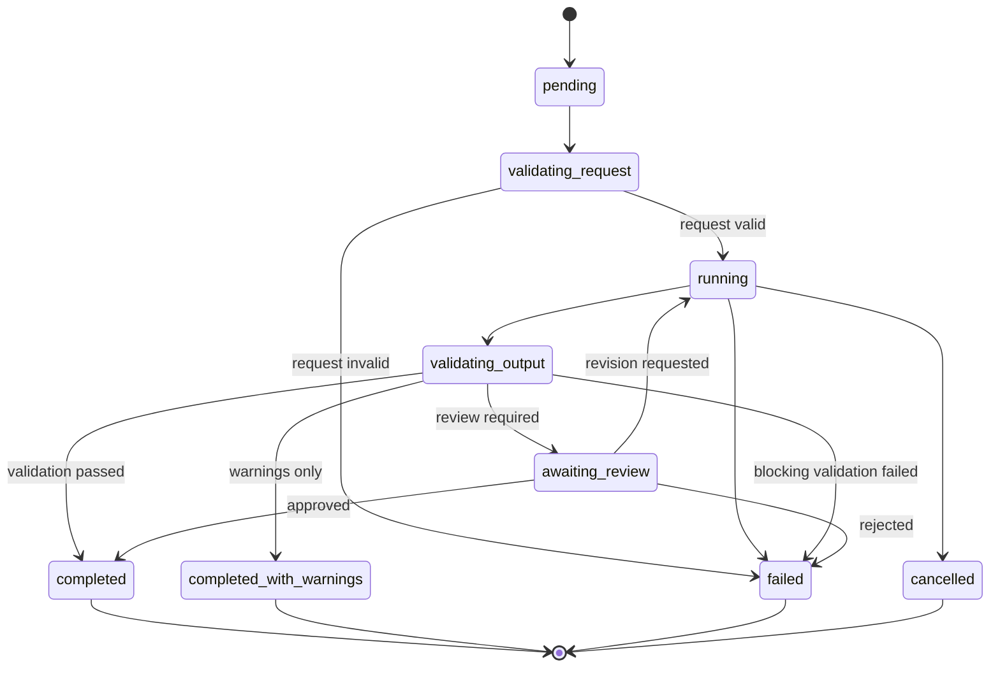

# AESP-0007: Code Generation

*Version 1.0.0-Draft | Status: Draft | Category: Standards Track | Date: 2026-07-10*

**Abstract.** This specification defines code generation semantics for Autonomous Engineering Organizations, including generation request and response contracts, template-driven and model-driven generation modes, determinism and provenance requirements, multi-file generation sessions, output validation, artifact lifecycle management, review and approval workflows, policy and security constraints, and conformance requirements.

**Related Specifications.** AESP-0000 (Constitution), AESP-0001 (Core Model), AESP-0003 (Communication Protocols), AESP-0005 (Workflow Orchestration), AESP-0006 (Knowledge Graph)

> **Document Structure:** This specification is split across three files:
> - `AESP-0007.md` — Chapters 1-4: Introduction, Generation Model Architecture, Inputs and Constraints, Generation Modes
> - `AESP-0007-continued.md` — Chapters 5-8: Generation Execution, Validation, Artifact Lifecycle, Review and Approval
> - `AESP-0007-reference.md` — Chapters 9-12: Security and Policy, Implementation Guidelines, Conformance and Testing, Appendices and References

## 1. Introduction

### 1.1 Purpose and Scope

AESP-0007 defines the code generation layer for Autonomous Engineering Organizations. As AEOs move from advisory copilots to production-changing agents, generation ceases to be an informal prompt/response exchange and becomes a governed, reproducible, and auditable protocol. Without explicit generation contracts, agents produce artifacts that cannot be validated, traced, reviewed, or safely regenerated.

Code generation in the AEO context serves six roles. First, **request contracts** — structured prompts, schemas, templates, variables, constraints, and context inputs that define what is to be generated. Second, **execution modes** — template-driven, model-driven, hybrid, incremental, regeneration, patch, and partial generation with declared determinism expectations. Third, **response contracts** — generated artifacts, metadata, provenance, diagnostics, warnings, and execution summaries. Fourth, **validation** — syntax, formatting, type correctness, policy compliance, security checks, dependency integrity, tests, and linting. Fifth, **lifecycle and review** — draft through archived states, human and automated review, approval, rejection, revision, and audit history. Sixth, **integration** — composition with AESP workflows, memory, knowledge graphs, execution context, and prior artifacts.

Industry practice has converged on several complementary generation patterns. Template engines (Handlebars, Jinja, Cookiecutter, Yeoman, OpenAPI generators) provide deterministic scaffolding from schemas and blueprints [^1^]. Model-driven assistants (GitHub Copilot, Cursor, Claude Code, Aider, Continue) generate free-form and multi-file code from natural language and repository context [^2^]. AST- and IR-based systems (tree-sitter transforms, language servers, compiler intermediate representations) enable structured edits with stronger guarantees than pure text substitution [^3^]. Secure coding and SBOM practices require generated code to carry provenance, dependency inventories, and policy evidence [^4^][^5^].

This specification defines:

1. A generation model architecture with request, session, engine, artifact, and validation surfaces.
2. Input contracts for prompts, schemas, templates, variables, constraints, and context packs.
3. Generation modes covering template, model, hybrid, incremental, regeneration, patch, and partial generation.
4. Execution semantics including multi-file sessions, streaming, cancellation, and result assembly.
5. Determinism, reproducibility, seed management, model identification, and provenance.
6. Validation pipelines for syntax, types, policy, security, dependencies, tests, and linting.
7. Artifact lifecycle states and transitions.
8. Review and approval workflows with human and automated reviewers.
9. Security, policy, and conformance requirements.

This specification does not mandate a particular language model, template engine, IDE, repository host, or CI system. Implementations MAY use commercial copilots, open-source coding agents, internal LLM gateways, pure template generators, or hybrid systems, provided the required AESP-0007 semantics are exposed through the normative interfaces defined here.

### 1.2 Normative Language

The key words "MUST", "MUST NOT", "REQUIRED", "SHALL", "SHALL NOT", "SHOULD", "SHOULD NOT", "RECOMMENDED", "MAY", and "OPTIONAL" in this document are to be interpreted as described in RFC 2119 [^6^].

Every requirement in this specification is assigned an identifier in the form `CG-REQ-NNN`. Requirement identifiers are stable across editorial revisions unless the requirement is removed by the AESP governance process.

### 1.3 Design Principles

#### 1.3.1 Generation Is Contractual

Code generation MUST be initiated by an explicit, machine-readable generation request. Free-form chat that mutates a repository without a request contract is non-conformant as an AESP-0007 generation session. Contracts enable validation, replay, audit, and policy enforcement.

#### 1.3.2 Artifacts Are First-Class

Every generated file, patch, configuration fragment, or documentation unit MUST be represented as an addressable artifact with identity, content hash, language or media type, provenance, and lifecycle state. Artifacts are not anonymous blobs in a chat transcript.

#### 1.3.3 Provenance Is Mandatory

Every accepted generation result MUST record who requested generation, which engine and model or template set produced it, which inputs and context were used, which validators ran, and which reviewers approved or rejected it. Generation without provenance cannot be trusted in regulated or multi-agent environments.

#### 1.3.4 Validation Is Part of Generation

A generation session is incomplete until declared validators have run and their outcomes are recorded. Implementations MUST NOT present unvalidated output as accepted production artifacts.

#### 1.3.5 Regeneration Is Explicit

Regenerating, patching, or partially replacing prior artifacts MUST be modeled as distinct operations with lineage to prior artifact versions. Silent overwrite of approved artifacts is non-conformant.

### 1.4 Relationship to Existing AESP Specifications

#### 1.4.1 AESP-0000 Constitution

AESP-0000 establishes vendor neutrality, machine-readability, and auditability. Generation requests, responses, validation reports, and review records MUST be machine-readable and versioned. Generation policies that encode organizational security or compliance rules MUST remain auditable under AESP-0000 governance.

#### 1.4.2 AESP-0001 Core Model

AESP-0001 defines Agent, WorkUnit, Capability, and Resource. A generation request is typically associated with a WorkUnit. Generated artifacts are Resources. Generating agents MUST be identifiable under the AESP-0001 identity model, and generation capabilities SHOULD be advertised as AESP-0001 capabilities.

#### 1.4.3 AESP-0003 Communication Protocols

AESP-0003 defines message envelopes, reliability, and multi-agent messaging. Generation request, progress, result, review, and cancellation messages MUST use AESP-0003 envelopes when exchanged between agents or services. Capability discovery for generation engines SHOULD use AESP-0003 discovery patterns.

#### 1.4.4 AESP-0005 Workflow Orchestration

AESP-0005 defines workflow graphs, durable execution, and human-in-the-loop gates. Multi-step generation (plan → generate → validate → review → apply) SHOULD be expressed as AESP-0005 workflows. Approval gates in AESP-0007 MUST be mappable to AESP-0005 HITL constructs.

#### 1.4.5 AESP-0006 Knowledge Graph

AESP-0006 provides structured domain knowledge. Generation sessions MAY retrieve schema, dependency, service, or API facts from a knowledge graph as context. When graph-derived facts influence generation, the generation provenance MUST reference the graph entities, graph version, and query evidence used.

### 1.5 Terminology

**Generation Request**: A machine-readable contract that specifies the intended outputs, inputs, mode, constraints, validators, and configuration for a generation session.

**Generation Session**: A single execution of a generation request, with its own identifier, state, artifacts, diagnostics, and audit trail.

**Generation Engine**: The component that performs generation. An engine MAY be template-driven, model-driven, hybrid, or AST/IR-based.

**Artifact**: An addressable generated unit such as a source file, patch, module, configuration document, test file, or documentation fragment.

**Template**: A parameterized text, AST, or scaffold definition used for deterministic or partially deterministic generation.

**Prompt**: Natural-language or structured instructions supplied to a model-driven generator.

**Schema**: A formal description of expected structure for inputs or outputs (for example JSON Schema, OpenAPI, protobuf, or language-specific types).

**Context Pack**: A curated set of context inputs (files, memory records, graph facts, prior artifacts, execution metadata) attached to a request.

**Patch**: A structured diff or edit set applied to existing artifacts rather than a full rewrite.

**Validation Report**: The machine-readable outcome of syntax, type, policy, security, dependency, test, and lint checks on generated artifacts.

**Provenance Record**: Metadata describing the origin, lineage, tools, models, templates, seeds, and reviewers associated with an artifact.

**Review Decision**: An accept, reject, request-revision, or escalate outcome recorded by a human or automated reviewer.

**Lifecycle State**: The governed status of an artifact (`draft`, `generated`, `reviewed`, `approved`, `superseded`, `archived`).

## 2. Generation Model Architecture

### 2.1 Architectural Surfaces

AESP-0007 decomposes code generation into five interacting surfaces:

| Surface | Responsibility |
|:---|:---|
| Request | Declares intent, inputs, mode, constraints, and acceptance criteria |
| Session | Owns execution state, progress, cancellation, and result assembly |
| Engine | Performs template, model, hybrid, or structured generation |
| Artifact Store | Persists artifacts, versions, hashes, and lifecycle state |
| Validation & Review | Evaluates quality, policy, and approval before acceptance |

`CG-REQ-001`: A conforming implementation MUST expose generation through an explicit request/session model. Implicit repository mutation without a session identifier is non-conformant.

`CG-REQ-002`: A generation session MUST be uniquely identified by an IRI or UUID and MUST remain addressable for audit after completion, failure, or cancellation according to retention policy.

`CG-REQ-003`: A conforming implementation MUST support at least one generation engine type among `template`, `model`, and `hybrid`, and MUST declare which types it supports.

### 2.2 Generation Request Object

A generation request is the normative input contract.

```json
{
  "id": "urn:aeo:codegen:request:2026-07-10-42",
  "workUnitRef": "urn:aeo:workunit:feature-payments-retry",
  "requester": "urn:aeo:agent:planner",
  "mode": "hybrid",
  "targets": [
    {
      "path": "src/payments/retry.ts",
      "language": "typescript",
      "kind": "source"
    }
  ],
  "inputs": {
    "promptRef": "urn:aeo:prompt:payments-retry-v3",
    "templateRef": "urn:aeo:template:ts-service-handler:1.2.0",
    "schemaRef": "urn:aeo:schema:openapi:payments:3.1.0",
    "variables": {
      "serviceName": "payments",
      "maxRetries": 5
    },
    "contextPackRef": "urn:aeo:context:payments-retry-2026-07-10"
  },
  "constraints": {
    "languagesAllowed": ["typescript"],
    "pathsAllowed": ["src/payments/**"],
    "pathsDenied": ["src/payments/legacy/**"],
    "maxFiles": 12,
    "maxBytes": 250000,
    "forbidNetworkCalls": true
  },
  "config": {
    "determinism": "best-effort",
    "seed": "0xAESP0007",
    "temperature": 0.0,
    "model": {
      "provider": "example-llm",
      "name": "codegen-pro",
      "version": "2026-06-01"
    }
  },
  "validators": ["syntax", "types", "lint", "policy", "security"],
  "reviewPolicy": "human-required-on-policy-warn"
}
```

`CG-REQ-004`: Every generation request MUST declare `id`, `requester`, `mode`, at least one target or target selector, and a validation policy or explicit validator list.

`CG-REQ-005`: Every generation request MUST declare either concrete targets, a target selector, or a project/package scope. Unscoped generation that may write anywhere in a repository is non-conformant.

`CG-REQ-006`: Request identifiers MUST be unique within the AEO and SHOULD be IRIs using a stable namespace such as `urn:aeo:codegen:request:{id}`.

### 2.3 Generation Response Object

A generation response returns the session outcome and produced artifacts.

```json
{
  "requestId": "urn:aeo:codegen:request:2026-07-10-42",
  "sessionId": "urn:aeo:codegen:session:2026-07-10-42",
  "status": "completed",
  "artifacts": [
    {
      "id": "urn:aeo:artifact:src/payments/retry.ts:v3",
      "path": "src/payments/retry.ts",
      "kind": "source",
      "language": "typescript",
      "contentHash": "sha256:example",
      "lifecycleState": "generated",
      "provenanceRef": "urn:aeo:provenance:artifact:retry-v3"
    }
  ],
  "validation": {
    "status": "passed-with-warnings",
    "reports": ["urn:aeo:validation:session:2026-07-10-42"]
  },
  "diagnostics": [],
  "warnings": [
    {
      "code": "CG-WARN-STYLE",
      "message": "Import order differs from project formatter default"
    }
  ],
  "executionSummary": {
    "startedAt": "2026-07-10T14:00:00Z",
    "completedAt": "2026-07-10T14:00:08Z",
    "engine": "hybrid-v1",
    "filesTouched": 1,
    "tokensIn": 4200,
    "tokensOut": 900
  }
}
```

`CG-REQ-007`: A generation response MUST include `requestId`, `sessionId`, `status`, `artifacts` (possibly empty), and an `executionSummary`.

`CG-REQ-008`: Response `status` MUST be one of `accepted`, `running`, `completed`, `completed-with-warnings`, `failed`, `cancelled`, or `awaiting-review`.

`CG-REQ-009`: Every produced artifact in a response MUST include identity, path or logical name, content hash, kind, and lifecycle state.

### 2.4 Session State Machine

Generation sessions follow a defined state machine.



`CG-REQ-010`: Implementations MUST implement the session states `pending`, `validating_request`, `running`, `validating_output`, `awaiting_review`, `completed`, `completed_with_warnings`, `failed`, and `cancelled`, or a superset that preserves these semantics.

`CG-REQ-011`: Session state transitions MUST be auditable. Each transition MUST record timestamp, actor or system component, and reason when the transition is not the default success path.

`CG-REQ-012`: A session in `completed` or `completed_with_warnings` MUST NOT mutate previously returned artifact content without creating a new session or new artifact version.

### 2.5 Engine Capabilities

Engines advertise capabilities so planners and workflows can select them.

| Capability | Description |
|:---|:---|
| `template.render` | Render parameterized templates |
| `model.generate` | Produce content from prompts and context |
| `ast.transform` | Apply structured AST or IR transforms |
| `patch.apply` | Produce or apply unified/structured patches |
| `multi.file` | Generate coordinated multi-file outputs |
| `multi.language` | Generate across multiple languages in one session |
| `stream.partial` | Stream partial artifacts or progress events |
| `deterministic.mode` | Honor seed and temperature constraints for reproducibility |

`CG-REQ-013`: An engine MUST publish a capability descriptor listing supported modes, languages, max context size, determinism guarantees, and validator integrations.

`CG-REQ-014`: A session MUST NOT be dispatched to an engine that does not advertise a required capability declared by the request.

`CG-REQ-015`: Capability descriptors MUST be versioned. Clients MUST be able to pin an engine version for reproducibility.

### 2.6 Artifact Identity

`CG-REQ-016`: Each artifact MUST have a stable identifier distinct from its filesystem path, because paths may be renamed while lineage continues.

`CG-REQ-017`: Artifact content MUST be content-addressable by cryptographic hash. SHA-256 is RECOMMENDED.

`CG-REQ-018`: When an artifact supersedes another, the new artifact MUST reference the prior artifact identifier and version.

### 2.7 Error Model

`CG-REQ-019`: Generation failures MUST use structured error codes distinguishing at least: invalid request, authorization denied, engine unavailable, context resolution failure, generation failure, validation failure, review rejection, and cancellation.

`CG-REQ-020`: Error responses MUST include a human-readable message, machine-readable code, failing stage, and correlation identifiers for request and session.

## 3. Inputs and Constraints

### 3.1 Prompt Contracts

Prompts may be inline or referenced by IRI.

`CG-REQ-021`: A model-driven or hybrid request MUST include either an inline prompt, a `promptRef`, or a prompt template with bound variables.

`CG-REQ-022`: Prompt references MUST resolve to versioned prompt artifacts. Unversioned mutable prompts MUST NOT be used when the request declares `determinism: reproducible`.

`CG-REQ-023`: Prompts MAY include structured sections (role, task, constraints, acceptance criteria, examples). When structured sections are used, implementations SHOULD preserve section boundaries in provenance.

### 3.2 Schema Inputs

Schemas constrain outputs or describe APIs and data models used during generation.

`CG-REQ-024`: When a request declares an output schema, generated artifacts that claim schema conformance MUST be validated against that schema before acceptance.

`CG-REQ-025`: Schema references MUST include schema language and version (for example JSON Schema 2020-12, OpenAPI 3.1, protobuf edition).

`CG-REQ-026`: If schema validation fails, the session MUST NOT transition to `completed` unless the request explicitly allows schema warnings as non-blocking.

### 3.3 Template Inputs

`CG-REQ-027`: Template-driven generation MUST identify the template set by versioned reference.

`CG-REQ-028`: Template rendering MUST fail closed when required variables are missing, unless the template declares defaults for those variables.

`CG-REQ-029`: Templates SHOULD be free of unrestricted executable code. If executable template logic is supported, the engine MUST sandbox it and record that execution occurred in provenance.

### 3.4 Variables and Bindings

`CG-REQ-030`: Request variables MUST be typed when a variable schema is declared. Type violations MUST fail request validation.

`CG-REQ-031`: Secret values used as variables MUST be redacted from logs, responses, and provenance payloads that are broadly readable. Provenance MAY store secret references, not secret material.

`CG-REQ-032`: Variable interpolation MUST be deterministic for a fixed template version and variable map.

### 3.5 Constraints

Constraints bound what generation is allowed to do.

| Constraint Class | Examples |
|:---|:---|
| Path | allowlists, denylists, max file count |
| Language | allowed languages and dialects |
| Size | max bytes, max tokens, max files |
| Dependency | allowed package registries, banned packages |
| Style | formatter, linter profile, license headers |
| Security | no eval, no hardcoded secrets, no disabled TLS |
| Behavioral | no network during generation, no shell execution |

`CG-REQ-033`: Path allowlists and denylists MUST be enforced before artifacts are written or returned as accepted.

`CG-REQ-034`: Size and count limits MUST be enforced. Exceeding limits MUST fail the session or truncate only if the request explicitly permits truncation and records it.

`CG-REQ-035`: Security constraints declared in the request or organization policy MUST be treated as hard constraints. Soft style constraints MAY produce warnings.

`CG-REQ-036`: Constraint evaluation results MUST appear in the validation report.

### 3.6 Context Inputs

Context packs assemble the information a generator may use.

Common context sources include:

1. Repository files and snippets.
2. AESP-0004 memory records (working, episodic, semantic, procedural).
3. AESP-0006 knowledge graph entities and paths.
4. Prior artifacts and review comments.
5. Workflow and execution context from AESP-0005.
6. External specifications (OpenAPI, protobuf, JSON Schema).

`CG-REQ-037`: Every context item included in a session MUST be identified by URI or path, content hash or version, and access scope.

`CG-REQ-038`: Context packs MUST declare whether each item is `required`, `optional`, or `advisory`.

`CG-REQ-039`: If a required context item cannot be resolved, request validation MUST fail.

`CG-REQ-040`: Context used during generation MUST be listed in provenance. Implementations MUST NOT silently inject unlisted context into accepted sessions.

### 3.7 Generation Configuration

Configuration controls engine behavior without changing the logical request target.

`CG-REQ-041`: Configuration MUST include determinism mode (`reproducible`, `best-effort`, or `exploratory`).

`CG-REQ-042`: For `reproducible` mode, the request MUST pin model or template versions, seed when applicable, temperature or equivalent randomness controls, and context content hashes.

`CG-REQ-043`: Exploratory mode MAY use non-deterministic sampling, but resulting artifacts MUST still carry provenance and MUST NOT be auto-approved solely because generation succeeded.

`CG-REQ-044`: Configuration parameters that affect output (temperature, top_p, stop sequences, max tokens, formatter profile) MUST be recorded in the execution summary or provenance record.

## 4. Generation Modes

### 4.1 Template-Driven Generation

Template-driven generation renders parameterized scaffolds with little or no free-form model sampling.

`CG-REQ-045`: Template-driven sessions MUST be deterministic for a fixed template version, variable map, and template engine version.

`CG-REQ-046`: Template-driven outputs MUST identify the template identifiers and versions used for each artifact.

`CG-REQ-047`: Template engines MUST support dry-run rendering that returns the would-be artifacts without committing lifecycle transitions beyond `draft` or ephemeral preview, as configured.

### 4.2 Model-Driven Generation

Model-driven generation uses a language model or coding model to synthesize content from prompts and context.

`CG-REQ-048`: Model-driven sessions MUST record model provider, model name, model version or snapshot identifier, and decoding parameters.

`CG-REQ-049`: Model-driven sessions MUST NOT claim bit-for-bit reproducibility unless `determinism: reproducible` is declared and the implementation documents the conditions under which reproducibility holds.

`CG-REQ-050`: When a model proposes file paths outside the request scope, the engine MUST reject those paths or require an explicit scope expansion approval.

### 4.3 Hybrid Generation

Hybrid generation combines templates, schemas, and models—for example scaffolding structure by template and filling complex bodies by model.

`CG-REQ-051`: Hybrid sessions MUST declare which artifacts or regions are template-controlled versus model-controlled.

`CG-REQ-052`: Hybrid provenance MUST attribute each artifact region to its producing mechanism when attribution is available.

`CG-REQ-053`: If template and model outputs conflict, the engine MUST apply a declared precedence policy (`template-wins`, `model-wins`, `fail`, or `review`).

### 4.4 Incremental Generation

Incremental generation extends an existing artifact set rather than regenerating everything.

`CG-REQ-054`: Incremental requests MUST reference the base artifact set or repository revision being extended.

`CG-REQ-055`: Incremental generation MUST preserve unchanged artifacts by reference rather than rewriting them without need.

`CG-REQ-056`: Incremental sessions SHOULD produce a change set summarizing added, modified, and unchanged targets.

### 4.5 Regeneration

Regeneration creates a new version of previously generated artifacts under an updated request.

`CG-REQ-057`: Regeneration MUST create new artifact versions and MUST mark prior versions `superseded` when the new versions are accepted, according to lifecycle policy.

`CG-REQ-058`: Regeneration requests MUST reference the prior session or artifact set being replaced.

`CG-REQ-059`: Regeneration MUST NOT delete audit history of prior versions.

### 4.6 Patch Generation

Patch generation produces diffs or structured edits against existing content.

`CG-REQ-060`: Patch artifacts MUST be representable in a documented patch format (for example unified diff, JSON patch, or AST edit list).

`CG-REQ-061`: Before a patch is accepted, the implementation MUST verify that the patch applies cleanly to the declared base revision or content hash.

`CG-REQ-062`: Failed patch application MUST fail the session or mark the patch artifact invalid; silent partial application is non-conformant unless explicitly requested and reported.

### 4.7 Partial Generation

Partial generation produces a subset of requested targets, for example after cancellation, budget exhaustion, or staged workflows.

`CG-REQ-063`: Partial success MUST be explicitly signaled. Implementations MUST NOT report `completed` if required targets are missing.

`CG-REQ-064`: Partial responses MUST identify completed targets, incomplete targets, and the reason generation stopped.

`CG-REQ-065`: Callers MUST be able to resume or re-request remaining targets with lineage to the partial session.

### 4.8 Mode Selection Guidance

`CG-REQ-066`: Planners and workflows SHOULD select template-driven mode when outputs are fully schema- or scaffold-determined.

`CG-REQ-067`: Planners SHOULD select model-driven or hybrid mode when semantic synthesis beyond templates is required.

`CG-REQ-068`: Security-sensitive paths SHOULD prefer template, AST, or patch modes with stricter validators over unconstrained free-form generation.
