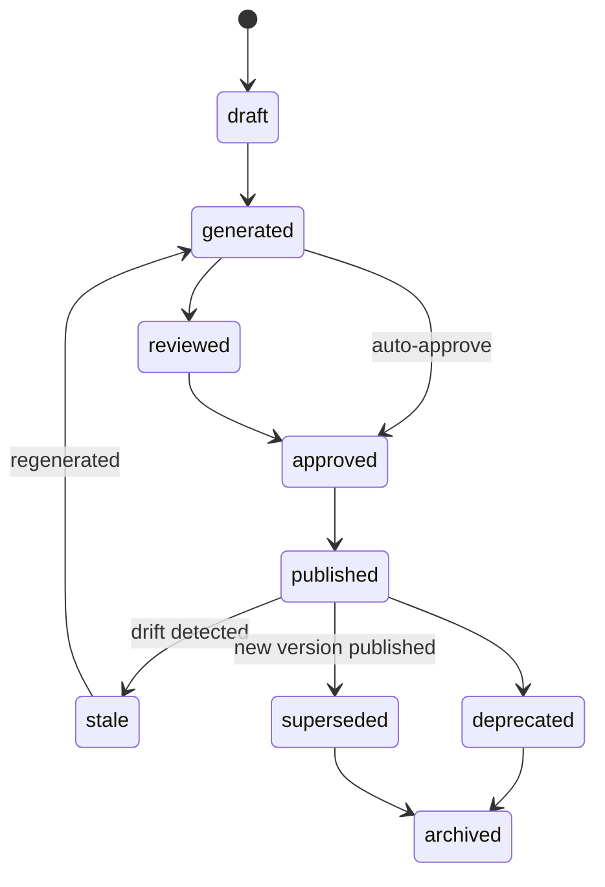

# AESP-0008: Documentation Generator, Continued

## 5. Pipeline Execution

Pipeline execution turns a validated documentation request into a document set, validation evidence, and optional publish outcomes.

### 5.1 Execution Stages

A conforming session SHOULD progress through:

1. Authorize requester and resolve engine.
2. Validate request structure and constraints.
3. Resolve and pin sources (source graph materialization).
4. Generate documents according to mode.
5. Assemble document set and compute content hashes.
6. Run validators (structure, links, freshness, completeness, policy).
7. Apply review policy.
8. Publish if policy permits.
9. Emit response and persist provenance.

`DOC-REQ-061`: Implementations MUST resolve and pin sources before generation side effects that write accepted documents.

`DOC-REQ-062`: Stage failures MUST identify the failing stage and MUST NOT claim success for later stages that did not run.

`DOC-REQ-063`: Request validation MUST fail closed on missing required sources, invalid target paths, or unsupported modes.

### 5.2 Multi-document Sets

`DOC-REQ-064`: Multi-document sessions MUST produce a manifest listing every document path, kind, format, audience, and content hash.

`DOC-REQ-065`: Cross-document links within a set SHOULD be validated as a graph when link validators are enabled.

`DOC-REQ-066`: Document sets MAY be accepted transactionally (all-or-nothing) or per-document; the request MUST declare the acceptance granularity.

### 5.3 Multi-format Rendering

Common formats include Markdown, MDX, HTML, PDF, OpenAPI-rendered portals, man pages, and machine-readable doc packages (JSON/YAML).

`DOC-REQ-067`: Each document MUST declare its format and media type.

`DOC-REQ-068`: When multiple formats are generated from the same logical document, they MUST share a logical document identity and source pins.

`DOC-REQ-069`: Format conversion steps MUST record converter identity and version in provenance.

### 5.4 Streaming and Progress

`DOC-REQ-070`: Implementations MAY stream progress or partial documents using AESP-0003 messaging patterns.

`DOC-REQ-071`: Streamed partial content MUST be marked `draft` until final assembly and validation complete.

`DOC-REQ-072`: Progress events MUST include session identifier, stage, and a monotonic sequence number or timestamp.

### 5.5 Cancellation and Timeouts

`DOC-REQ-073`: Sessions MUST support cancellation by an authorized actor.

`DOC-REQ-074`: Timeout policies MUST be configurable. On timeout, the session MUST fail or cancel with a structured error.

`DOC-REQ-075`: Cancelled sessions MUST retain audit history according to retention policy.

### 5.6 Determinism and Provenance

`DOC-REQ-076`: Every session MUST declare its determinism mode.

`DOC-REQ-077`: For `reproducible` sessions, re-execution with identical engine version, templates, source pins, and configuration SHOULD produce identical document content hashes. Implementations that cannot guarantee this MUST NOT advertise `reproducible`.

`DOC-REQ-078`: Every accepted document MUST have a provenance record containing at least: request id, session id, engine id and version, producer agent, source pins, template or model identifiers, content hash, and timestamps.

`DOC-REQ-079`: Provenance MUST support lineage queries from document to sources and from source change to affected documents.

`DOC-REQ-080`: Provenance MUST distinguish source-derived content from model-inferred narrative when both are present.

### 5.7 Integration with Workflows and Code Generation

`DOC-REQ-081`: When invoked from an AESP-0005 workflow, the documentation session id MUST be correlated with the workflow instance id and task id.

`DOC-REQ-082`: When documenting AESP-0007 artifacts, the documentation provenance MUST reference the code generation session or artifact identifiers.

`DOC-REQ-083`: Workflow retries MUST either reuse idempotency keys or create explicitly versioned regenerations.

## 6. Synchronization and Drift

Synchronization is the mechanism that keeps living documentation honest.

### 6.1 Source Change Events

`DOC-REQ-084`: Living documentation systems MUST be able to consume source-change events that identify changed source URIs, versions, and content hashes.

`DOC-REQ-085`: Source-change handlers MUST map changes to affected document sets using the stored source graph.

`DOC-REQ-086`: Unmapped source changes under a watched scope SHOULD raise an unowned-drift warning for operator attention.

### 6.2 Drift Detection

Drift types include:

| Drift Type | Meaning |
|:---|:---|
| `content-hash-mismatch` | Source changed since last pin |
| `missing-source` | Source no longer resolvable |
| `schema-breaking` | Schema compatibility check failed |
| `link-break` | Document links resolve to missing targets |
| `section-gap` | Required sections absent after regeneration rules |
| `manual-override-stale` | Manually authoritative section older than source |

`DOC-REQ-087`: Drift reports MUST identify document id, source id, drift type, severity, detected-at timestamp, and recommended action.

`DOC-REQ-088`: Blocking drift MUST prevent documents from remaining labeled `current` or `published-current` under living profiles.

`DOC-REQ-089`: Drift detection MAY run without full regeneration (`validate-only`) when policy allows.

### 6.3 Synchronization Policies

`DOC-REQ-090`: Every living document set MUST declare a synchronization policy including trigger, action, max staleness, and failure escalation.

`DOC-REQ-091`: `maxStaleness` MUST be interpreted as an upper bound on acceptable time between source change observation and either regeneration or explicit drift flagging.

`DOC-REQ-092`: If regeneration fails, the previous published version MAY remain available but MUST be marked stale or degraded according to policy.

### 6.4 Manual Authoritative Sections

Some narrative sections are intentionally human-owned.

`DOC-REQ-093`: Documents MAY mark sections as `manual-authoritative`. Such sections MUST NOT be silently overwritten by generators.

`DOC-REQ-094`: Manual-authoritative sections SHOULD declare related sources for drift hints even when content is not auto-regenerated.

`DOC-REQ-095`: Merges of generated and manual sections MUST preserve manual markers across regeneration.

### 6.5 Bidirectional Hints

`DOC-REQ-096`: Implementations MAY propose source updates from documentation edits (docs-to-source hints), but MUST NOT apply source mutations without an explicit, authorized workflow.

`DOC-REQ-097`: Docs-to-source proposals MUST be represented as reviewable change requests, not silent writes.

## 7. Document Lifecycle

### 7.1 Lifecycle States

| State | Meaning |
|:---|:---|
| `draft` | Incomplete or preview content |
| `generated` | Produced and hashed by a session |
| `reviewed` | Review decision recorded |
| `approved` | Accepted for publish eligibility |
| `published` | Available at a publish target |
| `stale` | Drift or staleness detected against sources |
| `superseded` | Replaced by a newer version |
| `deprecated` | Still available but discouraged |
| `archived` | Retained for history, not active |

`DOC-REQ-098`: Conforming implementations MUST support `draft`, `generated`, `approved`, `published`, `stale`, `superseded`, and `archived`, or a mapped superset preserving these semantics.

`DOC-REQ-099`: Document state MUST be queryable independently of session state.

`DOC-REQ-100`: A document MUST NOT be `published` without successful required validation (or auditable waiver) and satisfaction of the applicable review/publish policy.

### 7.2 Transitions

`DOC-REQ-101`: Illegal transitions MUST be rejected.

`DOC-REQ-102`: Every transition MUST record actor, timestamp, from-state, to-state, and reason or linked review/publish decision.

`DOC-REQ-103`: Supersession MUST maintain bidirectional version pointers.

### 7.3 Versioning

`DOC-REQ-104`: Document versions MUST be monotonically ordered within a lineage.

`DOC-REQ-105`: Consumers SHOULD pin published document versions for audit and compliance packs.

`DOC-REQ-106`: Semantic versioning of document sets is RECOMMENDED when documents describe external APIs or SDKs.

### 7.4 Retention and Archival

`DOC-REQ-107`: Published and superseded documents required for audit MUST be retained per organization policy.

`DOC-REQ-108`: Archival MUST preserve content hash, provenance, and review/publish history.

`DOC-REQ-109`: Deletion of ever-published documents MUST be explicit, authorized, and audited.

### 7.5 Repository and Portal Mapping

`DOC-REQ-110`: When documents are stored in VCS, mapping from document version to commit, path, and branch MUST be recorded.

`DOC-REQ-111`: When documents are published to portals or knowledge bases, external URLs and package versions MUST be recorded in the publish receipt.

## 8. Review and Publishing

### 8.1 Review Policies

`DOC-REQ-112`: Every request MUST declare a review policy: `none`, `automated-only`, `human-required`, `human-on-drift`, `human-on-policy-warn`, or an organization-defined equivalent.

`DOC-REQ-113`: Absence of review is not absence of validation. Validators still apply when configured.

`DOC-REQ-114`: Organization policy MAY override request review policy to a stricter level. Overrides MUST be auditable.

### 8.2 Automated and Human Review

`DOC-REQ-115`: Automated review decisions MUST identify reviewer identity, rule pack or model version, and evidence.

`DOC-REQ-116`: Human review tasks MUST present the document diff or change set, source pins, validation report, and drift report when applicable.

`DOC-REQ-117`: Human reviewers MUST be authenticated and authorized for the document scope.

### 8.3 Decisions

| Decision | Effect |
|:---|:---|
| `approve` | Documents may transition toward publish |
| `reject` | Session fails review |
| `request_revision` | Regeneration or manual edit expected |
| `escalate` | Forward to another role |

`DOC-REQ-118`: Every decision MUST record decision type, actor, timestamp, optional comment, and subject document set.

`DOC-REQ-119`: Rejection MUST NOT delete generation history.

`DOC-REQ-120`: Revisions MUST link to the prior session and review decision.

### 8.4 Publish Policies

Publish policies include `manual`, `auto-on-approve`, `auto-on-validate`, and `review-then-publish`.

`DOC-REQ-121`: Publish actions MUST produce a publish receipt containing target, document versions, content hashes, publisher identity, and timestamp.

`DOC-REQ-122`: Publish to customer-facing or external targets SHOULD require stricter review than internal developer docs by default.

`DOC-REQ-123`: Failed publish MUST leave documents in a non-`published` state or mark partial publish explicitly.

### 8.5 Quality Validation Families

`DOC-REQ-124`: Structure validators MUST verify required sections and front-matter for declared document kinds.

`DOC-REQ-125`: Link validators MUST check internal links and SHOULD check external links according to policy.

`DOC-REQ-126`: Freshness validators MUST compare source pins to current source hashes when living profiles are active.

`DOC-REQ-127`: Completeness validators SHOULD detect undocumented public API elements when schema or code sources declare them.

`DOC-REQ-128`: Policy validators MUST evaluate license headers, confidentiality banners, terminology packs, and prohibited content rules when configured.

`DOC-REQ-129`: Validation reports MUST be durable and linked from the documentation response.

`DOC-REQ-130`: Aggregated validation status MUST be the worst status among required validators (`failed` > `passed-with-warnings` > `passed` > `skipped`).

### 8.6 Audit History

`DOC-REQ-131`: Implementations MUST retain append-only audit history of requests, sessions, source pins, validation reports, review decisions, publish receipts, and lifecycle transitions for the configured retention period.

`DOC-REQ-132`: Audit records MUST be exportable in a machine-readable format.

`DOC-REQ-133`: Audit history MUST be protected against undetected tampering using controls appropriate to the AEO threat model.
