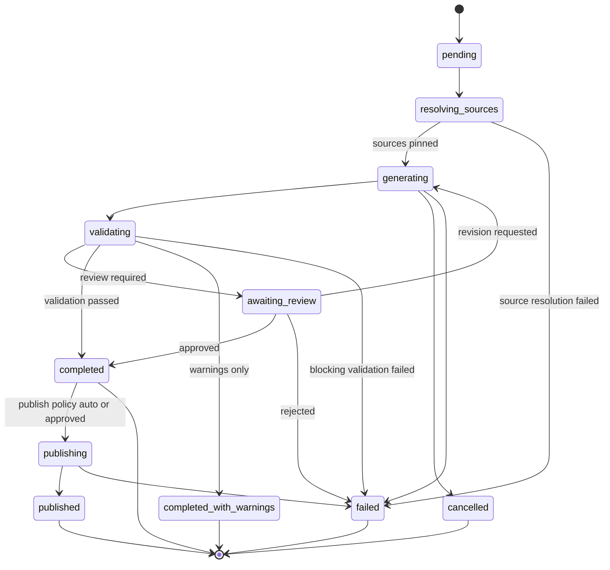

# AESP-0008: Documentation Generator

*Version 1.0.0-Draft | Status: Draft | Category: Standards Track | Date: 2026-07-10*

**Abstract.** This specification defines documentation generation semantics for Autonomous Engineering Organizations, including documentation request and response contracts, multi-source input models, schema-to-docs and code-to-docs pipelines, living documentation and drift detection, multi-format publishing, quality validation, document lifecycle and review, policy controls, and conformance requirements.

**Related Specifications.** AESP-0000 (Constitution), AESP-0001 (Core Model), AESP-0003 (Communication Protocols), AESP-0005 (Workflow Orchestration), AESP-0007 (Code Generation)

> **Document Structure:** This specification is split across three files:
> - `AESP-0008.md` — Chapters 1-4: Introduction, Documentation Model Architecture, Sources and Inputs, Generation Modes
> - `AESP-0008-continued.md` — Chapters 5-8: Pipeline Execution, Synchronization and Drift, Document Lifecycle, Review and Publishing
> - `AESP-0008-reference.md` — Chapters 9-12: Security and Policy, Implementation Guidelines, Conformance and Testing, Appendices and References

## 1. Introduction

### 1.1 Purpose and Scope

AESP-0008 defines the documentation generation layer for Autonomous Engineering Organizations. In an Agent OS built on AESP, agents do not only produce code and infrastructure; they produce the explanations, contracts, runbooks, and operator guidance that make those artifacts operable. Without a governed documentation protocol, generated systems drift from their descriptions, human operators lose trust, and multi-agent collaboration collapses into tribal knowledge.

Documentation generation in the AEO context serves six roles. First, **source-bound authorship** — documentation is derived from schemas, APIs, code, configurations, workflows, knowledge graphs, and prior documents rather than free-floating prose. Second, **pipeline execution** — request contracts, multi-stage rendering, validation, and publishing form an auditable session. Third, **living documentation** — continuous or event-driven regeneration keeps docs synchronized with source change. Fourth, **multi-format publishing** — Markdown, HTML, OpenAPI portals, ADRs, runbooks, and machine-readable doc packages serve different consumers. Fifth, **quality and governance** — link integrity, freshness, completeness, policy compliance, and review gates protect readers. Sixth, **integration** — documentation pipelines compose with AESP-0005 workflows, AESP-0007 code generation, memory, and knowledge graphs.

Industry practice has converged on complementary patterns. OpenAPI and AsyncAPI tooling render API references from machine-readable contracts [^1^]. Documentation-as-code platforms (MkDocs, Docusaurus, Sphinx, Antora) treat docs as versioned repository artifacts [^2^]. Schema-driven generators produce SDKs and reference pages from protobuf, JSON Schema, and GraphQL SDL [^3^]. Architecture Decision Records (ADRs) and runbook automation frameworks encode operational knowledge as structured documents [^4^]. Living documentation and contract-testing movements treat documentation drift as a first-class defect [^5^].

This specification defines:

1. A documentation model architecture with request, session, source graph, document set, and publish surfaces.
2. Source contracts for schemas, APIs, code, configs, memory, knowledge graph facts, and prior docs.
3. Generation modes including schema-to-docs, code-to-docs, template, model-driven, hybrid, and living documentation.
4. Execution semantics for multi-document sets, incremental updates, and multi-format rendering.
5. Drift detection and synchronization policies against declared sources.
6. Quality validation for structure, links, freshness, completeness, and policy.
7. Document lifecycle, review, publishing, and deprecation.
8. Security, access control, and conformance requirements.

This specification does not mandate a particular static site generator, API portal, LLM, or CMS. Implementations MAY use MkDocs, Docusaurus, Sphinx, Redoc, Swagger UI, Backstage TechDocs, custom renderers, or hybrid systems, provided the required AESP-0008 semantics are exposed through the normative interfaces defined here.

### 1.2 Normative Language

The key words "MUST", "MUST NOT", "REQUIRED", "SHALL", "SHALL NOT", "SHOULD", "SHOULD NOT", "RECOMMENDED", "MAY", and "OPTIONAL" in this document are to be interpreted as described in RFC 2119 [^6^].

Every requirement in this specification is assigned an identifier in the form `DOC-REQ-NNN`. Requirement identifiers are stable across editorial revisions unless the requirement is removed by the AESP governance process.

### 1.3 Design Principles

#### 1.3.1 Documentation Is Source-Bound

Normative operational and API documentation MUST declare the sources from which it was derived. Free-form prose without source binding is permitted for narrative content, but contract, API, and runbook documents that claim system truth MUST be regenerable from declared sources or explicitly marked as manually authoritative.

#### 1.3.2 Drift Is a Defect

When a documented fact no longer matches its source of truth, the system MUST detect and report drift. Silent staleness is non-conformant for living documentation profiles.

#### 1.3.3 Readers Are Multiple Audiences

Documentation sets MUST support audience targeting (operator, developer, auditor, agent). A single source graph MAY render different views without inventing conflicting facts.

#### 1.3.4 Provenance Is Mandatory

Every published document MUST record generation session, sources, toolchain versions, and review state. Documentation without provenance cannot be trusted in multi-agent or regulated environments.

#### 1.3.5 Docs Compose with Code Generation

AESP-0008 complements AESP-0007. Code generation produces executable artifacts; documentation generation produces explanatory and contractual artifacts. When both operate on the same schema or API, they MUST share source identity and version pins where practical.

### 1.4 Relationship to Existing AESP Specifications

#### 1.4.1 AESP-0000 Constitution

AESP-0000 establishes vendor neutrality, machine-readability, and auditability. Documentation packages, schemas, and publish manifests MUST be machine-readable and versioned when used as governed AEO artifacts.

#### 1.4.2 AESP-0001 Core Model

Documentation requests are typically associated with WorkUnits. Document sets and published packages are Resources. Documenting agents MUST be identifiable under the AESP-0001 identity model.

#### 1.4.3 AESP-0003 Communication Protocols

Documentation request, progress, result, review, and publish messages MUST use AESP-0003 envelopes when exchanged between agents or services.

#### 1.4.4 AESP-0005 Workflow Orchestration

Multi-step documentation pipelines (collect sources → generate → validate → review → publish) SHOULD be expressed as AESP-0005 workflows. Human review of high-impact docs MUST be mappable to AESP-0005 HITL constructs.

#### 1.4.5 AESP-0007 Code Generation

AESP-0007 defines generation contracts for code and related artifacts. AESP-0008 MAY consume AESP-0007 artifacts, OpenAPI/JSON Schema resources, and repository revisions as sources. Document generation SHOULD reuse AESP-0007 patterns for session identity, content hashing, and lifecycle where applicable, without requiring full code-generation capability.

### 1.5 Terminology

**Documentation Request**: A machine-readable contract specifying sources, targets, modes, audiences, formats, validators, and publish policy.

**Documentation Session**: A single execution of a documentation request with identity, state, outputs, diagnostics, and audit trail.

**Source**: An input artifact used to generate documentation (schema, API, code file, config, memory record, graph fact, prior document).

**Source Graph**: The directed set of sources and their relationships used for a session.

**Document**: An addressable documentation unit with identity, format, content hash, audience, and lifecycle state.

**Document Set**: A coherent collection of documents generated or updated together (for example a service doc site or API reference package).

**Living Documentation**: Documentation that is regenerated or revalidated on source change according to a declared synchronization policy.

**Drift**: A detected mismatch between documentation content (or claims) and current source state.

**Publish Target**: A destination for accepted documentation (repository path, portal, package registry, knowledge base).

**Audience**: The intended consumer class of a document (`developer`, `operator`, `auditor`, `agent`, `customer`, or organization-defined).

## 2. Documentation Model Architecture

### 2.1 Architectural Surfaces

AESP-0008 decomposes documentation generation into six surfaces:

| Surface | Responsibility |
|:---|:---|
| Request | Declares sources, targets, modes, audiences, formats, and policy |
| Session | Owns execution state, progress, cancellation, and result assembly |
| Source Resolver | Materializes and pins source content hashes and versions |
| Generator | Renders documents from templates, schemas, models, or hybrids |
| Validator | Checks structure, links, freshness, completeness, and policy |
| Publisher | Delivers accepted document sets to publish targets |

`DOC-REQ-001`: A conforming implementation MUST expose documentation generation through an explicit request/session model.

`DOC-REQ-002`: A documentation session MUST be uniquely identified by an IRI or UUID and MUST remain addressable for audit after completion, failure, or cancellation according to retention policy.

`DOC-REQ-003`: A conforming implementation MUST support at least one generator mode among `schema-to-docs`, `template`, and `model`, and MUST declare which modes it supports.

### 2.2 Documentation Request Object

```json
{
  "id": "urn:aeo:docs:request:payments-api-ref-42",
  "workUnitRef": "urn:aeo:workunit:docs-payments-api",
  "requester": "urn:aeo:agent:doc-curator",
  "mode": "schema-to-docs",
  "sources": [
    {
      "id": "urn:aeo:source:openapi:payments:3.1.0",
      "kind": "openapi",
      "uri": "specs/payments.openapi.yaml",
      "version": "3.1.0",
      "contentHash": "sha256:example-openapi"
    }
  ],
  "targets": [
    {
      "path": "docs/api/payments/",
      "format": "markdown",
      "audience": "developer",
      "kind": "api-reference"
    }
  ],
  "syncPolicy": {
    "profile": "living",
    "onSourceChange": "regenerate",
    "maxStaleness": "P1D"
  },
  "validators": ["structure", "links", "freshness", "policy"],
  "publishPolicy": "review-then-publish",
  "config": {
    "determinism": "reproducible",
    "templateSet": "urn:aeo:template:api-ref-md:1.4.0"
  }
}
```

`DOC-REQ-004`: Every documentation request MUST declare `id`, `requester`, `mode`, at least one source or source selector, and at least one target.

`DOC-REQ-005`: Requests MUST declare a validation policy or explicit validator list.

`DOC-REQ-006`: Request identifiers MUST be unique within the AEO and SHOULD use a stable namespace such as `urn:aeo:docs:request:{id}`.

### 2.3 Documentation Response Object

`DOC-REQ-007`: A documentation response MUST include `requestId`, `sessionId`, `status`, `documents` (possibly empty), `sourcePins`, and an `executionSummary`.

`DOC-REQ-008`: Response `status` MUST be one of `accepted`, `running`, `completed`, `completed-with-warnings`, `failed`, `cancelled`, `awaiting-review`, or `published`.

`DOC-REQ-009`: Every produced document MUST include identity, path or logical name, format, audience, content hash, and lifecycle state.

### 2.4 Session State Machine



`DOC-REQ-010`: Implementations MUST implement the session states `pending`, `resolving_sources`, `generating`, `validating`, `awaiting_review`, `completed`, `completed_with_warnings`, `publishing`, `published`, `failed`, and `cancelled`, or a superset that preserves these semantics.

`DOC-REQ-011`: Session state transitions MUST be auditable with timestamp, actor or component, and reason for non-default paths.

`DOC-REQ-012`: A session in `published` MUST NOT mutate previously published document content without creating a new session or document version.

### 2.5 Document Identity

`DOC-REQ-013`: Each document MUST have a stable identifier distinct from its filesystem path.

`DOC-REQ-014`: Document content MUST be content-addressable by cryptographic hash. SHA-256 is RECOMMENDED.

`DOC-REQ-015`: When a document supersedes another, the new document MUST reference the prior document identifier and version.

### 2.6 Capability Descriptors

`DOC-REQ-016`: A documentation engine MUST publish a capability descriptor listing supported modes, source kinds, output formats, audiences, and determinism guarantees.

`DOC-REQ-017`: A session MUST NOT be dispatched to an engine lacking a required capability declared by the request.

`DOC-REQ-018`: Capability descriptors MUST be versioned so clients can pin engine versions for reproducibility.

### 2.7 Error Model

`DOC-REQ-019`: Documentation failures MUST use structured error codes distinguishing at least: invalid request, authorization denied, source resolution failure, generation failure, validation failure, drift blocking, review rejection, publish failure, and cancellation.

`DOC-REQ-020`: Error responses MUST include a human-readable message, machine-readable code, failing stage, and correlation identifiers for request and session.

## 3. Sources and Inputs

### 3.1 Source Kinds

AESP-0008 defines the following baseline source kinds:

| Kind | Description |
|:---|:---|
| `openapi` / `asyncapi` | API contracts |
| `json-schema` / `protobuf` / `graphql-sdl` | Data and interface schemas |
| `source-code` | Application or library source |
| `config` | Configuration, Helm, Terraform, policy files |
| `workflow` | AESP-0005 workflow definitions |
| `memory` | AESP-0004 memory records used as narrative or fact sources |
| `knowledge-graph` | AESP-0006 entities, paths, or query results |
| `codegen-artifact` | AESP-0007 generated artifacts |
| `prior-document` | Existing docs used for incremental rewrite or merge |
| `adr` / `runbook` | Structured operational knowledge templates |

`DOC-REQ-021`: Every source entry MUST declare `id`, `kind`, and a resolvable `uri` or inline payload reference.

`DOC-REQ-022`: Resolvable sources MUST be pinned by version identifier, content hash, or both before generation begins when determinism mode is `reproducible` or `best-effort`.

`DOC-REQ-023`: Unknown source kinds MAY be supported via namespaced extensions, but baseline kinds above SHOULD be preferred for interoperability.

### 3.2 Source Graph

`DOC-REQ-024`: A session MUST construct a source graph relating primary sources to dependent sources (for example OpenAPI → referenced schemas → example payloads).

`DOC-REQ-025`: Cyclic source dependencies MUST be detected and MUST fail request validation unless an explicit cycle policy permits them.

`DOC-REQ-026`: Source graph snapshots MUST be recorded in session provenance.

### 3.3 Access Control on Sources

`DOC-REQ-027`: Source resolution MUST enforce access control. Agents MUST NOT document sources they are not authorized to read.

`DOC-REQ-028`: Documents derived from restricted sources MUST inherit access restrictions at least as strict as the most restricted contributing source, unless an explicit declassification policy applies.

`DOC-REQ-029`: Existence of restricted sources MUST NOT be leaked through error messages or generated public docs.

### 3.4 Templates and Style Packs

`DOC-REQ-030`: Template-driven documentation MUST identify the template set by versioned reference.

`DOC-REQ-031`: Style packs (tone, heading conventions, required sections, terminology glossaries) MUST be versioned when used to influence generation.

`DOC-REQ-032`: Organization glossaries SHOULD be applied consistently so multi-agent docs share terminology.

### 3.5 Audience and Localization

`DOC-REQ-033`: Each target document MUST declare an audience.

`DOC-REQ-034`: Requests MAY declare locale or language. Localized outputs MUST pin translation memory or model versions when reproducibility is required.

`DOC-REQ-035`: Audience-specific redaction rules MUST be applied before publish for non-public audiences.

### 3.6 Constraints

`DOC-REQ-036`: Path allowlists and denylists MUST be enforced for write targets.

`DOC-REQ-037`: Size and document-count limits MUST be enforced.

`DOC-REQ-038`: Constraint evaluation results MUST appear in the validation report.

### 3.7 Configuration and Determinism

`DOC-REQ-039`: Configuration MUST include determinism mode (`reproducible`, `best-effort`, or `exploratory`).

`DOC-REQ-040`: For `reproducible` mode, the request MUST pin generator/template versions, source hashes, and any model identifiers used.

`DOC-REQ-041`: Configuration parameters that affect output MUST be recorded in provenance or the execution summary.

## 4. Generation Modes

### 4.1 Schema-to-Docs

Schema-to-docs renders documentation primarily from formal contracts (OpenAPI, AsyncAPI, JSON Schema, protobuf, GraphQL).

`DOC-REQ-042`: Schema-to-docs sessions MUST bind each generated reference page to the schema element identifiers it describes.

`DOC-REQ-043`: Breaking schema changes MUST be detectable as documentation regeneration triggers when living documentation is enabled.

`DOC-REQ-044`: Examples embedded in schemas SHOULD be rendered as documentation examples and MUST remain consistent with schema constraints after validation.

### 4.2 Code-to-Docs

Code-to-docs extracts documentation from source comments, signatures, annotations, and structural analysis.

`DOC-REQ-045`: Code-to-docs MUST record language, parser or extractor version, and source revision.

`DOC-REQ-046`: Extracted public API docs SHOULD distinguish exported versus internal symbols according to language conventions or explicit annotations.

`DOC-REQ-047`: Code-to-docs MUST NOT invent behavioral guarantees not present in code, annotations, or linked schemas unless clearly marked as inferred.

### 4.3 Template-Driven Documentation

`DOC-REQ-048`: Template-driven sessions MUST be deterministic for a fixed template version, variable map, and source pins.

`DOC-REQ-049`: Required template variables without values MUST fail generation.

### 4.4 Model-Driven Documentation

`DOC-REQ-050`: Model-driven sessions MUST record model provider, name, version, and decoding parameters.

`DOC-REQ-051`: Model-written narrative MUST be distinguishable from source-derived normative content in metadata or section markers when both appear in the same document.

`DOC-REQ-052`: Model-driven content that asserts system facts MUST be subject to freshness or factuality validators when such validators are configured.

### 4.5 Hybrid Generation

`DOC-REQ-053`: Hybrid sessions MUST declare which sections are schema/template-controlled versus model-controlled.

`DOC-REQ-054`: Conflicts between template and model sections MUST apply a declared precedence policy (`template-wins`, `schema-wins`, `model-wins`, `fail`, or `review`).

### 4.6 Living Documentation Mode

Living documentation continuously or event-driven keeps docs aligned with sources.

`DOC-REQ-055`: Living documentation profiles MUST declare triggers (`on-commit`, `on-schema-change`, `scheduled`, `manual`) and action (`validate-only`, `regenerate`, `regenerate-and-publish`).

`DOC-REQ-056`: Living documentation MUST store last-known source pins and last successful generation session.

`DOC-REQ-057`: When drift exceeds policy thresholds, the system MUST raise a structured drift event and MUST NOT silently leave published docs marked current.

### 4.7 Incremental and Partial Generation

`DOC-REQ-058`: Incremental requests MUST reference the base document set or revision being updated.

`DOC-REQ-059`: Partial success MUST be explicitly signaled; required targets missing MUST NOT yield `completed` or `published`.

`DOC-REQ-060`: Partial responses MUST list completed documents, incomplete targets, and stop reason.
