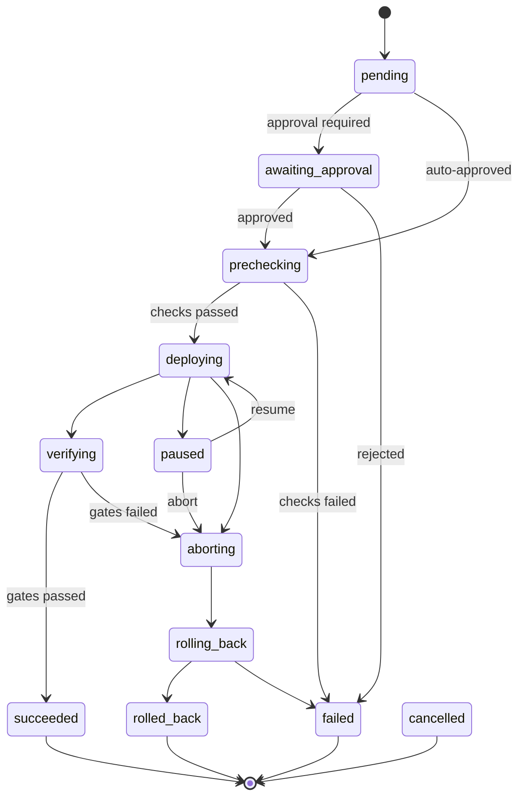

# AESP-0009: Deployment Automation

*Version 1.0.0-Draft | Status: Draft | Category: Standards Track | Date: 2026-07-10*

**Abstract.** This specification defines deployment automation semantics for Autonomous Engineering Organizations, including deployment request and response contracts, environment and target models, artifact promotion, rollout strategies, progressive delivery and health gates, rollback procedures, freeze windows, deployment provenance, policy controls, and conformance requirements.

**Related Specifications.** AESP-0000 (Constitution), AESP-0001 (Core Model), AESP-0003 (Communication Protocols), AESP-0005 (Workflow Orchestration), AESP-0007 (Code Generation), AESP-0008 (Documentation Generator)

> **Document Structure:** This specification is split across three files:
> - `AESP-0009.md` — Chapters 1-4: Introduction, Deployment Model Architecture, Artifacts Environments and Targets, Rollout Strategies
> - `AESP-0009-continued.md` — Chapters 5-8: Deployment Execution, Health Gates and Progressive Delivery, Rollback, Environment Promotion
> - `AESP-0009-reference.md` — Chapters 9-12: Security and Policy, Implementation Guidelines, Conformance and Testing, Appendices and References

## 1. Introduction

### 1.1 Purpose and Scope

AESP-0009 defines the deployment automation layer for Autonomous Engineering Organizations. In an Agent OS built on AESP, agents that generate code and documentation must also move artifacts safely across environments. Without a governed deployment protocol, autonomous systems risk uncontrolled production change, untraceable rollouts, and irreversible failures.

Deployment automation in the AEO context serves six roles. First, **contractual change** — every production-affecting deploy is an explicit, machine-readable request with artifact identity, target environment, strategy, and gates. Second, **environment modeling** — targets, clusters, regions, and promotion chains are first-class. Third, **rollout control** — rolling, blue/green, canary, recreate, and shadow strategies share common semantics. Fourth, **progressive delivery** — traffic shifting, health signals, automated abort, and hold-for-approval. Fifth, **rollback and compensation** — reverse paths are declared before forward motion. Sixth, **integration** — deploys compose with AESP-0005 workflows, AESP-0007 artifacts, AESP-0008 release docs, and future AESP-0012 remediation.

Industry practice has converged on complementary deployment patterns. Kubernetes Deployment/ReplicaSet rolling updates and Argo Rollouts provide progressive delivery primitives [^1^][^2^]. Spinnaker formalized multi-cloud pipelines with canary analysis and pipeline-as-code [^3^]. GitOps systems (Argo CD, Flux) treat desired state in git as the deployment contract [^4^]. Feature flags and service meshes enable fine-grained traffic control during rollout [^5^]. SLSA and supply-chain controls require verified artifact provenance before production install [^6^].

This specification defines:

1. A deployment model architecture with request, session, environment, target, and gate surfaces.
2. Artifact packaging, identity, and promotion eligibility rules.
3. Environment topology and access boundaries.
4. Rollout strategies and progressive delivery semantics.
5. Execution pipelines with pre-deploy, deploy, verify, and post-deploy stages.
6. Health gates, metrics, and automated abort conditions.
7. Rollback, freeze windows, and promotion chains.
8. Security, policy, and conformance requirements.

This specification does not mandate Kubernetes, a particular CI/CD product, cloud provider, or service mesh. Implementations MAY use Argo, Flux, Spinnaker, GitHub Actions, GitLab CI, Tekton, AWS CodeDeploy, custom controllers, or hybrid systems, provided the required AESP-0009 semantics are exposed through the normative interfaces defined here.

### 1.2 Normative Language

The key words "MUST", "MUST NOT", "REQUIRED", "SHALL", "SHALL NOT", "SHOULD", "SHOULD NOT", "RECOMMENDED", "MAY", and "OPTIONAL" in this document are to be interpreted as described in RFC 2119 [^7^].

Every requirement in this specification is assigned an identifier in the form `DEP-REQ-NNN`. Requirement identifiers are stable across editorial revisions unless the requirement is removed by the AESP governance process.

### 1.3 Design Principles

#### 1.3.1 Deployments Are Contracts

A production-affecting deployment MUST be initiated by an explicit deployment request. Ad hoc shell commands that mutate production without a session identity are non-conformant as AESP-0009 deployments.

#### 1.3.2 Artifacts Are Immutable and Addressable

What is deployed MUST be identified by content hash or immutable artifact version. Mutable tags without digest pinning are non-conformant for production environments unless an explicit exception policy applies.

#### 1.3.3 Rollback Is Designed In

Every deployment strategy that changes production traffic or desired state MUST declare a rollback or abort path before execution begins, or explicitly document why rollback is impossible and which compensating controls apply.

#### 1.3.4 Health Gates Are Mandatory for Progressive Delivery

Canary and blue/green promotions MUST evaluate declared health signals before increasing blast radius. Time-only waits without health evaluation are insufficient for L2+ progressive delivery claims.

#### 1.3.5 Promotion Is Explicit

Moving an artifact from staging to production is a distinct, authorized operation—not an accidental side effect of building again.

### 1.4 Relationship to Existing AESP Specifications

#### 1.4.1 AESP-0000 Constitution

Deployment policies that encode organizational change control MUST be machine-readable and auditable under AESP-0000 governance.

#### 1.4.2 AESP-0001 Core Model

Deployment requests are typically WorkUnits. Deployable packages and environment endpoints are Resources. Deploying agents MUST be identifiable under AESP-0001.

#### 1.4.3 AESP-0003 Communication Protocols

Deployment request, progress, gate, abort, and completion messages MUST use AESP-0003 envelopes when exchanged between agents or services.

#### 1.4.4 AESP-0005 Workflow Orchestration

Multi-step deploys (build verify → approve → canary → full → verify) SHOULD be expressed as AESP-0005 workflows. Human change-advisory or break-glass approvals MUST be mappable to AESP-0005 HITL constructs.

#### 1.4.5 AESP-0007 Code Generation

Deployable artifacts SHOULD carry AESP-0007 (or equivalent) content hashes and provenance. Deployment MUST NOT silently repackage unpinned generated output for production.

#### 1.4.6 AESP-0008 Documentation Generator

Release notes, runbooks, and deploy manifests MAY be coupled to deployment sessions. When present, documentation package versions SHOULD be recorded in deployment provenance.

### 1.5 Terminology

**Deployment Request**: A machine-readable contract specifying artifact, environment, strategy, gates, and policy.

**Deployment Session**: A single execution of a deployment request with identity, state, events, and audit trail.

**Artifact**: An immutable deployable unit (container image, package, bundle, config set) identified by digest or version.

**Environment**: A named deployment domain with policy, access controls, and target set (for example `dev`, `staging`, `prod`).

**Target**: A concrete destination such as a cluster, namespace, region, function, or host group.

**Rollout Strategy**: The algorithm for replacing previous desired state with new desired state.

**Health Gate**: A condition evaluated during or after rollout that permits progress, hold, or abort.

**Promotion**: Authorization and transfer of an artifact (or release candidate) from one environment to another.

**Rollback**: Restoration of a prior known-good desired state or traffic configuration.

**Freeze Window**: A time window during which deployments to specified environments are restricted.

## 2. Deployment Model Architecture

### 2.1 Architectural Surfaces

| Surface | Responsibility |
|:---|:---|
| Request | Declares artifact, environment, strategy, gates, and policy |
| Session | Owns execution state, events, cancellation, and result |
| Environment Registry | Defines environments, targets, and promotion edges |
| Controller | Executes strategy against infrastructure adapters |
| Gate Engine | Evaluates health, policy, approval, and freeze conditions |
| Evidence Store | Persists provenance, logs references, and audit history |

`DEP-REQ-001`: A conforming implementation MUST expose deployment through an explicit request/session model.

`DEP-REQ-002`: A deployment session MUST be uniquely identified by an IRI or UUID and MUST remain addressable for audit after completion, failure, abort, or cancellation according to retention policy.

`DEP-REQ-003`: A conforming implementation MUST support at least one rollout strategy among `rolling`, `recreate`, `blue-green`, and `canary`, and MUST declare which strategies it supports.

### 2.2 Deployment Request Object

```json
{
  "id": "urn:aeo:deploy:request:payments-2026-07-10-7",
  "workUnitRef": "urn:aeo:workunit:release-payments-2.7.4",
  "requester": "urn:aeo:agent:release-conductor",
  "artifact": {
    "id": "urn:aeo:artifact:payments-api:2.7.4",
    "digest": "sha256:example-image",
    "type": "oci-image",
    "sbomRef": "urn:aeo:sbom:payments-api:2.7.4"
  },
  "environment": "prod",
  "targets": ["urn:aeo:target:k8s:prod-us-east-1:payments"],
  "strategy": {
    "type": "canary",
    "steps": [
      { "weight": 5, "pause": "PT10M" },
      { "weight": 25, "pause": "PT20M" },
      { "weight": 100 }
    ]
  },
  "gates": ["smoke", "error-rate", "latency-p99", "policy"],
  "rollback": {
    "mode": "automatic-on-gate-fail",
    "toArtifact": "urn:aeo:artifact:payments-api:2.7.3"
  },
  "approvalPolicy": "human-required-for-prod"
}
```

`DEP-REQ-004`: Every deployment request MUST declare `id`, `requester`, `artifact`, `environment`, and `strategy`.

`DEP-REQ-005`: Production requests MUST declare rollback configuration or an explicit `rollback: none` with documented justification.

`DEP-REQ-006`: Request identifiers MUST be unique within the AEO and SHOULD use a stable namespace such as `urn:aeo:deploy:request:{id}`.

### 2.3 Deployment Response Object

`DEP-REQ-007`: A deployment response MUST include `requestId`, `sessionId`, `status`, `environment`, `artifact`, current rollout progress, and an `executionSummary`.

`DEP-REQ-008`: Response `status` MUST be one of `accepted`, `awaiting-approval`, `running`, `paused`, `verifying`, `succeeded`, `succeeded-with-warnings`, `failed`, `aborted`, `rolling-back`, `rolled-back`, or `cancelled`.

`DEP-REQ-009`: Responses MUST identify the previously active artifact (if any) and the newly desired artifact.

### 2.4 Session State Machine



`DEP-REQ-010`: Implementations MUST implement the states above (or a semantic superset) for progressive strategies that require them; simpler strategies MAY collapse `paused` if unsupported, but MUST still support abort and failure terminal states.

`DEP-REQ-011`: Session transitions MUST be auditable with timestamp, actor or component, and reason for non-default paths.

`DEP-REQ-012`: A succeeded session MUST NOT mutate the deployed artifact identity without a new deployment session.

### 2.5 Controllers and Adapters

`DEP-REQ-013`: Controllers MUST publish capability descriptors listing supported strategies, target types, gate types, and cloud/runtime integrations.

`DEP-REQ-014`: Infrastructure-specific identifiers MUST NOT replace canonical AESP IRIs in external APIs.

`DEP-REQ-015`: Adapters MUST translate AESP deployment intents into backend operations without dropping required provenance fields.

### 2.6 Error Model

`DEP-REQ-016`: Deployment failures MUST use structured error codes distinguishing at least: invalid request, authorization denied, freeze active, approval rejected, precheck failure, artifact unavailable, strategy failure, gate failure, rollback failure, and cancellation.

`DEP-REQ-017`: Error responses MUST include machine-readable code, failing stage, human-readable message, and request/session correlation identifiers.

## 3. Artifacts, Environments, and Targets

### 3.1 Artifact Identity

`DEP-REQ-018`: Deployable artifacts MUST be identified by immutable digest or content-addressed version for production environments.

`DEP-REQ-019`: Artifact metadata MUST include type, producer reference when known, and creation or build timestamp.

`DEP-REQ-020`: When SBOMs or signatures are required by policy, missing SBOM or failed signature verification MUST block production deployment.

`DEP-REQ-021`: Mutable tags (for example `:latest`) MUST be resolved to digests before production deploy and the digest MUST be recorded.

### 3.2 Environment Model

`DEP-REQ-022`: Every environment MUST have a unique identifier, sensitivity class (`nonprod`, `prod`, or organization-defined), and policy profile.

`DEP-REQ-023`: Environment policy MUST declare who may deploy, required approvals, allowed strategies, and freeze calendar references.

`DEP-REQ-024`: Cross-environment credentials MUST NOT be shared in a way that allows a lower environment identity to deploy to a higher environment.

### 3.3 Targets

`DEP-REQ-025`: Targets MUST declare type (for example `kubernetes-workload`, `serverless-function`, `vm-group`, `edge-fleet`) and locator metadata.

`DEP-REQ-026`: Multi-target deployments MUST declare whether targets are updated in parallel, sequential, or region-by-region order.

`DEP-REQ-027`: Partial multi-target failure MUST be reported per target and MUST trigger the declared failure policy (`abort-all`, `continue`, or `rollback-succeeded-targets`).

### 3.4 Desired State vs Observed State

`DEP-REQ-028`: Controllers MUST distinguish desired state (what the session intends) from observed state (what infrastructure reports).

`DEP-REQ-029`: Session success MUST require observed state to converge to desired state within configured timeout, unless the strategy explicitly defines eventual convergence with degraded status.

`DEP-REQ-030`: Divergence after success (configuration drift) SHOULD raise events consumable by observability and remediation systems; it is not silently ignored for production targets.

### 3.5 Configuration and Secrets at Deploy Time

`DEP-REQ-031`: Environment configuration injected at deploy time MUST be versioned or hashed and recorded in provenance.

`DEP-REQ-032`: Secret values MUST NOT appear in deployment responses, logs, or provenance payloads; secret references MAY.

`DEP-REQ-033`: Config-only deployments (no new binary artifact) MUST still create a deployment session with config hash identity.

## 4. Rollout Strategies

### 4.1 Common Strategy Requirements

`DEP-REQ-034`: Every strategy declaration MUST include `type` and strategy-specific parameters.

`DEP-REQ-035`: Strategies MUST define success criteria and failure criteria.

`DEP-REQ-036`: Strategies that expose users to new versions MUST support abort before completion.

### 4.2 Recreate

Recreate terminates the old version then starts the new version (possible downtime).

`DEP-REQ-037`: Recreate strategy MUST declare expected downtime allowance.

`DEP-REQ-038`: Recreate SHOULD be restricted in production by policy unless explicitly allowed.

### 4.3 Rolling

Rolling replaces instances gradually while maintaining availability targets.

`DEP-REQ-039`: Rolling strategy MUST declare max unavailable and/or max surge parameters (or equivalents).

`DEP-REQ-040`: Rolling updates MUST halt or abort when health gates fail according to policy.

### 4.4 Blue/Green

Blue/green prepares a full new environment (green) then switches traffic from blue.

`DEP-REQ-041`: Blue/green MUST keep blue available for rollback until green is accepted or a retention policy expires.

`DEP-REQ-042`: Traffic switch MUST be an explicit step with recorded timestamp and actor/system initiator.

`DEP-REQ-043`: Post-switch verification gates MUST run before blue is decommissioned when policy requires.

### 4.5 Canary

Canary exposes a fraction of traffic or instances to the new version.

`DEP-REQ-044`: Canary steps MUST declare traffic weight or instance count and evaluation window.

`DEP-REQ-045`: Advancement to the next canary step MUST require declared gates to pass, unless a human explicitly overrides with audit.

`DEP-REQ-046`: Canary analysis SHOULD support metric baselines comparing canary to control baseline when metrics gates are configured.

### 4.6 Shadow / Dark Launch

Shadow sends duplicated traffic to a new version without serving responses to users.

`DEP-REQ-047`: Shadow deployments MUST NOT affect user-visible responses.

`DEP-REQ-048`: Shadow sessions MUST still record artifact identity, volume, and comparison metrics when configured.

### 4.7 Strategy Selection Guidance

`DEP-REQ-049`: Planners SHOULD prefer canary or blue/green for high-risk production services when supported.

`DEP-REQ-050`: Stateless services MAY use rolling updates with tight health gates when canary infrastructure is unavailable.

`DEP-REQ-051`: Database migrations and incompatible schema changes MUST be modeled with explicit expand/contract or dual-write steps; pure rolling app deploys MUST NOT be assumed safe for breaking schema changes.
