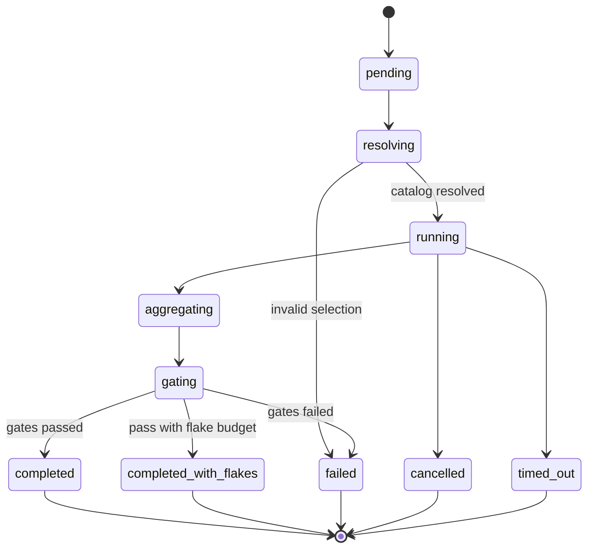

# AESP-0010: Testing & Validation

*Version 1.0.0-Draft | Status: Draft | Category: Standards Track | Date: 2026-07-10*

**Abstract.** This specification defines testing and validation semantics for Autonomous Engineering Organizations, including test request and result contracts, test taxonomy, test generation and selection, execution environments, oracles and coverage, quality gates, flake handling, evidence packages, policy controls, and conformance requirements.

**Related Specifications.** AESP-0000 (Constitution), AESP-0001 (Core Model), AESP-0003 (Communication Protocols), AESP-0005 (Workflow Orchestration), AESP-0007 (Code Generation), AESP-0009 (Deployment Automation)

> **Document Structure:** This specification is split across three files:
> - `AESP-0010.md` — Chapters 1-4: Introduction, Testing Model Architecture, Test Taxonomy, Test Generation and Authoring
> - `AESP-0010-continued.md` — Chapters 5-8: Execution Semantics, Coverage Oracles and Gates, Environments and Data, Results and Lifecycle
> - `AESP-0010-reference.md` — Chapters 9-12: Security and Policy, Implementation Guidelines, Conformance and Testing, Appendices and References

## 1. Introduction

### 1.1 Purpose and Scope

AESP-0010 defines the testing and validation layer for Autonomous Engineering Organizations. In an Agent OS built on AESP, agents generate code, documentation, and deployments at machine speed. Without a governed testing protocol, autonomous change cannot be trusted, quality gates become tribal checklists, and failures escape into production without reproducible evidence.

Testing and validation in the AEO context serve six roles. First, **contractual verification** — every test run is an explicit session with subject artifacts, suite selection, environment, and gate policy. Second, **taxonomy** — unit through acceptance, plus security, performance, and chaos, share common result semantics. Third, **generation and maintenance** — agents may author and update tests under the same provenance rules as product code. Fourth, **execution control** — isolation, determinism, retries, flake classification, and resource budgets. Fifth, **evidence** — coverage, oracles, logs, and artifacts form audit-grade packages for deploy gates. Sixth, **integration** — tests compose with AESP-0005 workflows, AESP-0007 generation validation, and AESP-0009 pre/post-deploy gates.

Industry practice has converged on complementary testing patterns. xUnit-family runners and language-native frameworks dominate unit testing [^1^]. Contract testing (Pact and schema-based approaches) reduces integration brittle-ness across services [^2^]. Property-based testing and fuzzing expand input space beyond example cases [^3^]. Continuous testing in CI/CD pipelines with quality gates is standard for regulated and high-velocity teams [^4^]. Test impact analysis and selective test execution address cost at scale [^5^]. Mutation testing and coverage metrics provide incomplete but useful quality signals when not treated as sole truth [^6^].

This specification defines:

1. A testing model architecture with request, session, suite, runner, and evidence surfaces.
2. A normative test taxonomy and result model.
3. Test generation, selection, prioritization, and quarantine semantics.
4. Execution environments, isolation, determinism, and flake handling.
5. Oracles, assertions, coverage, and quality gates.
6. Test data and fixture governance.
7. Result packaging for humans, agents, and deploy controllers.
8. Security, policy, and conformance requirements.

This specification does not mandate a particular test framework, CI system, browser automation stack, or cloud device farm. Implementations MAY use JUnit, pytest, Jest, Go test, Playwright, Cypress, k6, JMeter, OWASP ZAP, custom runners, or hybrid systems, provided the required AESP-0010 semantics are exposed through the normative interfaces defined here.

### 1.2 Normative Language

The key words "MUST", "MUST NOT", "REQUIRED", "SHALL", "SHALL NOT", "SHOULD", "SHOULD NOT", "RECOMMENDED", "MAY", and "OPTIONAL" in this document are to be interpreted as described in RFC 2119 [^7^].

Every requirement in this specification is assigned an identifier in the form `TEST-REQ-NNN`. Requirement identifiers are stable across editorial revisions unless the requirement is removed by the AESP governance process.

### 1.3 Design Principles

#### 1.3.1 Tests Are Contracts Against Change

A quality gate MUST evaluate explicit test sessions with addressable suites and versioned subjects. Informal “we tried it manually” is not a conforming production gate.

#### 1.3.2 Evidence Over Vibes

Pass/fail without evidence is insufficient for governed environments. Sessions MUST produce machine-readable results with subject identity, environment fingerprint, and provenance.

#### 1.3.3 Flakes Are First-Class Failures of Process

Intermittent failures MUST be classified and governed. Silent retry-until-green without recording flake evidence is non-conformant for L2+.

#### 1.3.4 Generated Tests Are Not Automatically Trustworthy

Agent-authored tests MUST follow generation provenance (AESP-0007 where applicable) and MUST NOT alone authorize production solely because they pass.

#### 1.3.5 Right Test, Right Layer

Taxonomy exists to prevent overusing expensive end-to-end tests for unit concerns and underusing integration/contract tests for boundary risks.

### 1.4 Relationship to Existing AESP Specifications

#### 1.4.1 AESP-0000 Constitution

Test policies and gate thresholds that encode organizational risk appetite MUST be machine-readable and auditable.

#### 1.4.2 AESP-0001 Core Model

Test sessions are typically WorkUnits. Suites, reports, and fixtures are Resources. Testing agents MUST be identifiable under AESP-0001.

#### 1.4.3 AESP-0003 Communication Protocols

Test dispatch, progress, cancellation, and result messages MUST use AESP-0003 envelopes when exchanged between agents or services.

#### 1.4.4 AESP-0005 Workflow Orchestration

Multi-stage pipelines (unit → integration → contract → e2e → security) SHOULD be AESP-0005 workflows. Human adjudication of flaky blockers MUST map to HITL constructs.

#### 1.4.5 AESP-0007 Code Generation

Generated product code and generated tests MUST carry artifact identity and provenance. AESP-0007 validation stages MAY invoke AESP-0010 runners.

#### 1.4.6 AESP-0009 Deployment Automation

Deploy prechecks and progressive delivery gates SHOULD consume AESP-0010 evidence packages rather than opaque CI status bits alone.

### 1.5 Terminology

**Test Request**: A machine-readable contract specifying subjects, suites, environment, selection policy, and gates.

**Test Session**: A single execution of a test request with identity, state, results, and evidence.

**Subject**: The artifact or revision under test (code, image, API, config, document package).

**Suite**: A named collection of test cases with type, owner, and selectors.

**Test Case**: The smallest addressable executable check with identity and expected outcome class.

**Oracle**: The mechanism that decides correctness (assertions, contracts, snapshots, metamorphic relations, human judgment).

**Quality Gate**: A policy that maps session results (and related signals) to pass, fail, or conditional outcomes.

**Evidence Package**: The durable bundle of results, logs, coverage, artifacts, and provenance for a session.

**Flake**: A test outcome that is non-deterministic with respect to an unchanged subject and environment class.

**Quarantine**: Temporary exclusion of a test case from gating with mandatory tracking.

## 2. Testing Model Architecture

### 2.1 Architectural Surfaces

| Surface | Responsibility |
|:---|:---|
| Request | Declares subjects, suites, env, selection, budgets, gates |
| Session | Owns execution state, retries, cancellation, results |
| Catalog | Registry of suites, cases, owners, and quarantine state |
| Runner | Executes cases in an environment with resource controls |
| Oracle/Coverage | Evaluates assertions and measures coverage signals |
| Evidence Store | Persists reports, artifacts, and provenance |

`TEST-REQ-001`: A conforming implementation MUST expose testing through an explicit request/session model.

`TEST-REQ-002`: A test session MUST be uniquely identified by an IRI or UUID and MUST remain addressable for audit after completion, failure, or cancellation according to retention policy.

`TEST-REQ-003`: A conforming implementation MUST support at least two test types from the taxonomy in Chapter 3 and MUST declare which types it supports.

### 2.2 Test Request Object

```json
{
  "id": "urn:aeo:test:request:payments-pr-8842",
  "workUnitRef": "urn:aeo:workunit:verify-payments-2.7.4",
  "requester": "urn:aeo:agent:ci-orchestrator",
  "subjects": [
    {
      "id": "urn:aeo:artifact:payments-api:2.7.4",
      "digest": "sha256:example",
      "type": "source-revision",
      "ref": "git:sha:abc123"
    }
  ],
  "suites": ["unit:payments", "contract:payments-openapi", "integration:payments-db"],
  "selection": {
    "mode": "impact",
    "baseRef": "git:sha:def456",
    "includeQuarantined": false
  },
  "environment": {
    "class": "ephemeral-ci",
    "fingerprintPolicy": "record"
  },
  "budgets": {
    "maxDuration": "PT30M",
    "maxParallelism": 8
  },
  "gates": {
    "failOn": ["failed", "error"],
    "maxFlakeRate": 0.01,
    "minCoverage": { "line": 0.8 }
  }
}
```

`TEST-REQ-004`: Every test request MUST declare `id`, `requester`, at least one `subject`, and either explicit `suites` or a resolvable suite selector.

`TEST-REQ-005`: Gate policy MUST be declared on the request or inherited from a versioned project/environment policy pack.

`TEST-REQ-006`: Request identifiers MUST be unique within the AEO and SHOULD use `urn:aeo:test:request:{id}`.

### 2.3 Test Response Object

`TEST-REQ-007`: A test response MUST include `requestId`, `sessionId`, `status`, aggregate counts, gate outcome, and evidence package reference.

`TEST-REQ-008`: Response `status` MUST be one of `accepted`, `running`, `completed`, `completed-with-flakes`, `failed`, `error`, `cancelled`, or `timed-out`.

`TEST-REQ-009`: Aggregate counts MUST include at least `passed`, `failed`, `errored`, `skipped`, `quarantined`, and `flaky` (when flake detection is enabled).

### 2.4 Session State Machine



`TEST-REQ-010`: Implementations MUST implement these states or a semantic superset.

`TEST-REQ-011`: Transitions MUST be auditable with timestamp, actor or component, and reason for non-default paths.

`TEST-REQ-012`: A completed session MUST NOT rewrite historical case results; re-runs MUST create new sessions or explicit retry records linked to the parent session.

### 2.5 Catalog and Identity

`TEST-REQ-013`: Every test case used for gating MUST have a stable identifier distinct from display name.

`TEST-REQ-014`: Renaming a test case SHOULD preserve identity via an explicit alias map; identity loss MUST be treated as a new case for trend analytics.

`TEST-REQ-015`: Suites MUST declare owner (agent or team), test type, and default environment class.

### 2.6 Error Model

`TEST-REQ-016`: Structured errors MUST distinguish at least: invalid request, authorization denied, subject unresolved, suite not found, environment provisioning failure, runner failure, timeout, and cancellation.

`TEST-REQ-017`: Errors MUST include machine-readable code, failing stage, message, and request/session correlation identifiers.

## 3. Test Taxonomy

### 3.1 Baseline Types

| Type | Intent | Typical Speed | Typical Isolation |
|:---|:---|:---|:---|
| `unit` | Behavior of a small module in isolation | fast | high |
| `integration` | Collaboration of components with real or test doubles of dependencies | medium | medium |
| `contract` | Boundary compatibility (API/schema/message) | medium | high/medium |
| `component` | Service-level behavior with controlled collaborators | medium | medium |
| `system` / `e2e` | End-to-end user or agent journeys | slow | low |
| `acceptance` | Business/stakeholder criteria | variable | low/medium |
| `security` | Abuse cases, SAST/DAST/dependency findings mapped to tests | variable | medium |
| `performance` | Latency, throughput, resource cost | slow | low/medium |
| `chaos` | Resilience under fault injection | slow | low |
| `smoke` | Shallow post-deploy or post-build confidence | fast | medium |

`TEST-REQ-018`: Every suite MUST declare exactly one primary type from the baseline set or a namespaced extension type.

`TEST-REQ-019`: Extension types MUST document their semantics and mapping to the nearest baseline type for gate policy.

`TEST-REQ-020`: Smoke suites used as AESP-0009 post-deploy gates MUST be explicitly labeled `smoke` or equivalent and MUST declare maximum duration budgets.

### 3.2 Outcome Classes

`TEST-REQ-021`: Case outcomes MUST use at least: `passed`, `failed`, `errored`, `skipped`, `quarantined`.

`TEST-REQ-022`: Implementations MAY add `flaky-passed` / `flaky-failed` or encode flake in metadata; flake status MUST be queryable.

`TEST-REQ-023`: `errored` (infrastructure/runner problems) MUST be distinguishable from assertion `failed`.

### 3.3 Severity and Criticality

`TEST-REQ-024`: Cases and suites MAY declare criticality (`blocking`, `non-blocking`, `informational`).

`TEST-REQ-025`: Gate policy MUST define how non-blocking failures affect overall session gate outcome.

`TEST-REQ-026`: Downgrading a previously blocking test to non-blocking MUST be an auditable catalog change.

### 3.4 Relationships to Artifacts

`TEST-REQ-027`: Cases SHOULD declare the subjects or code paths they cover when known.

`TEST-REQ-028`: Contract tests MUST reference the contract artifact identity (OpenAPI, async API, schema, proto) by version or digest.

`TEST-REQ-029`: Performance tests MUST declare the workload profile identity and version.

## 4. Test Generation and Authoring

### 4.1 Human and Agent Authoring

`TEST-REQ-030`: Test authoring MAY be human, agent, or hybrid. Author identity MUST be recorded in provenance for generated or modified tests used in gates.

`TEST-REQ-031`: Agent-authored tests intended for gating SHOULD pass review policy appropriate to their criticality.

`TEST-REQ-032`: Tests that only assert tautologies or mock the system under test out of existence MUST NOT be counted as meaningful coverage for gate minimums when detectable.

### 4.2 Generation Modes

Generation modes include template-based (from schemas), model-driven, property/fuzz seed generation, record-replay, and differential tests from prior versions.

`TEST-REQ-033`: Generated tests MUST reference their generator, generator version, and source inputs (for example schema digest).

`TEST-REQ-034`: When tests are produced via AESP-0007, the code generation session id MUST be linked from test artifact provenance.

`TEST-REQ-035`: Snapshot or golden-file tests MUST record when snapshots were last intentionally updated and by whom.

### 4.3 Selection and Prioritization

`TEST-REQ-036`: Selection modes MUST include at least `all` and MAY include `impact`, `changed-suite`, `failed-last`, and `risk-based`.

`TEST-REQ-037`: Impact-based selection MUST record the base subject and the algorithm/version used to compute the subset.

`TEST-REQ-038`: Selective runs that are used as production deploy gates MUST either be full required suites or an explicitly approved reduced set defined by policy.

### 4.4 Quarantine and Maintenance

`TEST-REQ-039`: Quarantine MUST be explicit in the catalog with reason, owner, open time, and optional expiry.

`TEST-REQ-040`: Expired quarantines MUST return to gating automatically or fail a meta-gate that quarantine hygiene is violated.

`TEST-REQ-041`: Auto-quarantine on flake MAY be enabled only with policy and MUST emit audit events.

### 4.5 Mutation and Negative Testing

`TEST-REQ-042`: Implementations MAY support mutation testing; mutation score MUST NOT be the sole production gate unless policy explicitly chooses it.

`TEST-REQ-043`: Security and abuse-case tests SHOULD be kept distinct from happy-path acceptance suites for clarity of gate reporting.
