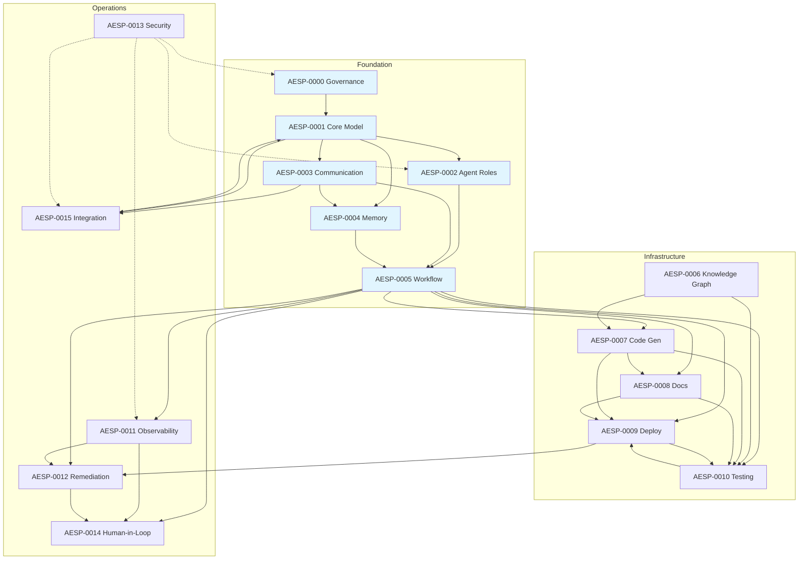

# AESP Specification Index

This directory contains the complete set of Autonomous Engineering
Specification (AESP) documents. Each specification is numbered sequentially
and addresses a distinct architectural concern within the autonomous
engineering domain.

## Specification Status Legend

| Status | Description |
|--------|-------------|
| PLANNED | Reserved in the roadmap but not yet authored. |
| DRAFT | Under active development. Content is incomplete and subject to breaking changes. |
| CANDIDATE | Feature-complete. Undergoing final review before stabilization. |
| STABLE | Released. Only backward-compatible changes permitted. |
| DEPRECATED | Superseded by a newer specification or approach. |
| RETIRED | No longer maintained or relevant. |

## Specification List

### Phase 1: Foundation (Q3 2026)

| Spec | Title | Status | Description |
|------|-------|--------|-------------|
| [AESP-0000](AESP-0000.md) | Specification Governance & Process | DRAFT | Governance model, change process, version control, and contribution workflow for all AESP specifications. Defines the rules by which all other specifications are created, reviewed, and maintained. |
| [AESP-0001](AESP-0001.md) | Core Model | DRAFT | Foundational AEO data model for agents, organizations, roles, work units, capabilities, resources, state, identity, and extensibility. |
| [AESP-0002](AESP-0002.md) | Agent Roles | DRAFT | Role templates, responsibilities, permission boundaries, escalation expectations, and role-based operational patterns for autonomous engineering agents. |
| [AESP-0003](AESP-0003.md) | Communication Protocols | DRAFT | Message envelopes, transport bindings, communication patterns, capability discovery, reliability, security, sessions, and multi-agent coordination. |
| [AESP-0004](AESP-0004.md) | Memory Systems | DRAFT | Memory architectures, operations, storage backends, retrieval mechanisms, distributed consistency, lifecycle controls, and inter-agent memory sharing protocols. |
| [AESP-0005](AESP-0005.md) | Workflow Orchestration | DRAFT | Workflow graphs, execution semantics, failure handling, scheduling, and cross-agent orchestration patterns. |

### Phase 2: Infrastructure (Q4 2026)

| Spec | Title | Status | Description |
|------|-------|--------|-------------|
| [AESP-0006](AESP-0006.md) | Knowledge Graph | DRAFT | Knowledge graph semantics, entity and relationship modeling, ontology and schema languages, query semantics, construction, reasoning, memory integration, and graph federation. |
| [AESP-0007](AESP-0007.md) | Code Generation | DRAFT | Code generation request and response contracts, template and model-driven modes, determinism and provenance, multi-file generation, output validation, artifact lifecycle, review workflows, and conformance requirements. |
| [AESP-0008](AESP-0008.md) | Documentation Generator | DRAFT | Documentation request contracts, schema-to-docs and living documentation pipelines, source pinning and drift detection, multi-format publishing, quality validation, document lifecycle, and conformance requirements. |
| [AESP-0009](AESP-0009.md) | Deployment Automation | DRAFT | Deployment request contracts, environment and target models, rollout strategies, progressive delivery and health gates, rollback, environment promotion, freeze windows, provenance, and conformance requirements. |
| [AESP-0010](AESP-0010.md) | Testing & Validation | DRAFT | Test request and evidence contracts, test taxonomy, generation and selection, execution semantics, oracles and coverage, quality gates, flake handling, environments and data controls, and conformance requirements. |

### Phase 3: Operations (Q1 2027)

| Spec | Title | Status | Description |
|------|-------|--------|-------------|
| [AESP-0011](AESP-0011.md) | Observability | DRAFT | Telemetry signals, work-unit correlation, SLOs, alerting, pipelines, investigation packages, and conformance for Agent OS runtimes. |
| [AESP-0012](AESP-0012.md) | Remediation & Self-Healing | DRAFT | Incidents, playbooks, automated actions, guardrails, verification, escalation, and deploy-rollback linkage for self-healing operations. |
| [AESP-0013](AESP-0013.md) | Security & Compliance | DRAFT | Cross-cutting identity, authn/authz, secrets, classification, audit, supply chain, multi-agent threats, and compliance mapping. |
| [AESP-0014](AESP-0014.md) | Human-in-the-Loop | DRAFT | Human task contracts, approvals, reviews, intervene/takeover, escalation SLAs, and Mission Control surfaces. |
| [AESP-0015](AESP-0015.md) | Integration & Interoperability | DRAFT | Adapters, OpenAI/Anthropic-compatible and local LLM providers, MCP profile, plugins, discovery, and multi-vendor interoperability. |

## Specification Dependencies

The following diagram illustrates the dependency relationships between
specifications. Foundation specifications (AESP-0000 through AESP-0005) are
referenced by specifications in later phases.

For the Agent OS control loop, correlation keys, and Hermes recommended levels, see **[ARCHITECTURE.md](ARCHITECTURE.md)**. For suite-level conformance profiles, see **[CONFORMANCE.md](CONFORMANCE.md)**. For working-group gap analysis and dispositions, see **[GAP-ANALYSIS.md](GAP-ANALYSIS.md)**. Shared event types: **[EVENT-REGISTRY.md](EVENT-REGISTRY.md)**.

## How to Read the Specifications

Specifications SHOULD be read in the following order:

1. **Start with AESP-0000** to understand the governance model and
   specification conventions.
2. **Read AESP-0001** and **[ARCHITECTURE.md](ARCHITECTURE.md)** for the
   suite-wide Agent OS map.
3. **Proceed through Foundation** specifications (AESP-0002 through AESP-0005)
   in order, as later specifications build on earlier ones.
4. **Continue through Infrastructure** (AESP-0006 through AESP-0010) and
   **Operations** (AESP-0011 through AESP-0015). Prefer reading 0013 (Security)
   early when implementing production systems; read 0015 when integrating
   providers, MCP, or plugins.

## Contributing

To propose changes to any specification, follow the process outlined in
[CONTRIBUTING.md](../CONTRIBUTING.md). All changes MUST adhere to the
conventions defined in AESP-0000.

---

*Last updated: 2026-07-10*
