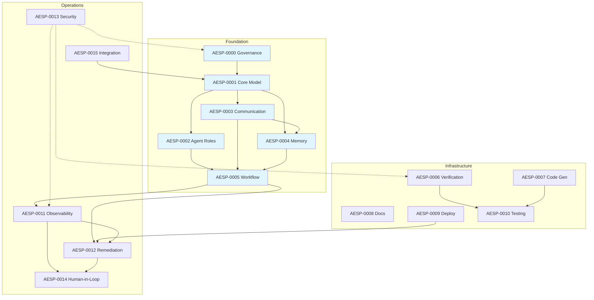

# AESP Specification Index

This directory contains the complete set of Autonomous Engineering
Specification (AESP) documents. Each specification is numbered sequentially
and addresses a distinct architectural concern within the autonomous
engineering domain.

## Specification Status Legend

| Status | Description |
|--------|-------------|
| PLANNED | Reserved in the roadmap but not yet authored. |
| DRAFT | Under active development. Content is incomplete and subject to breaking changes. |
| CANDIDATE | Feature-complete. Undergoing final review before stabilization. |
| STABLE | Released. Only backward-compatible changes permitted. |
| DEPRECATED | Superseded by a newer specification or approach. |
| RETIRED | No longer maintained or relevant. |

## Specification List

### Phase 1: Foundation (Q3 2026)

| Spec | Title | Status | Description |
|------|-------|--------|-------------|
| [AESP-0000](AESP-0000.md) | Specification Governance & Process | DRAFT | Governance model, change process, version control, and contribution workflow for all AESP specifications. Defines the rules by which all other specifications are created, reviewed, and maintained. |
| [AESP-0001](AESP-0001.md) | Core Model | DRAFT | Foundational AEO data model for agents, organizations, roles, work units, capabilities, resources, state, identity, and extensibility. |
| [AESP-0002](AESP-0002.md) | Agent Roles | DRAFT | Role templates, responsibilities, permission boundaries, escalation expectations, and role-based operational patterns for autonomous engineering agents. |
| [AESP-0003](AESP-0003.md) | Communication Protocols | DRAFT | Message envelopes, transport bindings, communication patterns, capability discovery, reliability, security, sessions, and multi-agent coordination. |
| [AESP-0004](AESP-0004.md) | Memory Systems | DRAFT | Memory architectures, operations, storage backends, retrieval mechanisms, distributed consistency, lifecycle controls, and inter-agent memory sharing protocols. |
| AESP-0005 | Workflow Orchestration | PLANNED | Workflow graphs, execution semantics, failure handling, scheduling, and cross-agent orchestration patterns. |

### Phase 2: Infrastructure (Q4 2026)

| Spec | Title | Status | Description |
|------|-------|--------|-------------|
| [AESP-0006](AESP-0006.md) | Continuous Verification | DRAFT | Continuous validation protocols, assertion frameworks, drift detection, and compliance monitoring. Defines how systems continuously verify that actual state matches declared intent. |
| [AESP-0007](AESP-0007.md) | Code Generation | DRAFT | Code generation protocols, template engines, output validation, and artifact lifecycle management. Specifies how production code is generated from higher-level specifications. |
| [AESP-0008](AESP-0008.md) | Documentation Generator | DRAFT | Automated documentation generation, schema-to-docs pipelines, and living documentation patterns. Defines how documentation is derived from and kept in sync with system artifacts. |
| [AESP-0009](AESP-0009.md) | Deployment Automation | DRAFT | Deployment orchestration, rollout strategies, rollback procedures, and environment promotion. Specifies the safe, automated movement of artifacts across environments. |
| [AESP-0010](AESP-0010.md) | Testing & Validation | DRAFT | Testing frameworks, validation protocols, test generation, and coverage requirements. Defines comprehensive testing at unit, integration, system, and acceptance levels. |

### Phase 3: Operations (Q1 2027)

| Spec | Title | Status | Description |
|------|-------|--------|-------------|
| [AESP-0011](AESP-0011.md) | Observability | DRAFT | Telemetry standards, event schemas, metric aggregation, tracing, and alerting protocols. Specifies how systems expose and report their internal state and behavior. |
| [AESP-0012](AESP-0012.md) | Remediation & Self-Healing | DRAFT | Automated remediation workflows, escalation chains, circuit breaker patterns, and healing strategies. Defines how systems detect and recover from failures without human intervention. |
| [AESP-0013](AESP-0013.md) | Security & Compliance | DRAFT | Security frameworks, compliance mapping, audit logging, access control, and threat models. Specifies security-by-design principles and regulatory compliance mechanisms. |
| [AESP-0014](AESP-0014.md) | Human-in-the-Loop | DRAFT | Human intervention points, approval workflows, escalation protocols, and operator interfaces. Defines when and how humans participate in autonomous system decisions. |
| [AESP-0015](AESP-0015.md) | Integration & Interoperability | DRAFT | Integration protocols, API standards, adapter patterns, and cross-system communication. Specifies how autonomous engineering platforms integrate with external systems and tools. |

## Specification Dependencies

The following diagram illustrates the dependency relationships between
specifications. Foundation specifications (AESP-0000 through AESP-0005) are
referenced by specifications in later phases.

## How to Read the Specifications

Specifications SHOULD be read in the following order:

1. **Start with AESP-0000** to understand the governance model and
   specification conventions.
2. **Read AESP-0001** to understand the overall architecture and how all
   components fit together.
3. **Proceed through Foundation** specifications (AESP-0002 through AESP-0005)
   in order, as later specifications build on earlier ones.
4. **Continue through Infrastructure** (AESP-0006 through AESP-0010) and
   **Operations** (AESP-0011 through AESP-0015) specifications, which may be
   read in any order within their phase, though cross-references exist.

## Contributing

To propose changes to any specification, follow the process outlined in
[CONTRIBUTING.md](../CONTRIBUTING.md). All changes MUST adhere to the
conventions defined in AESP-0000.

---

*Last updated: 2026-07-10*
