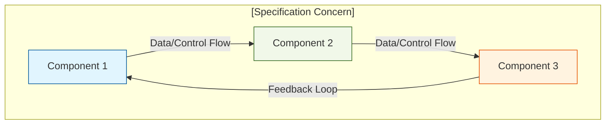
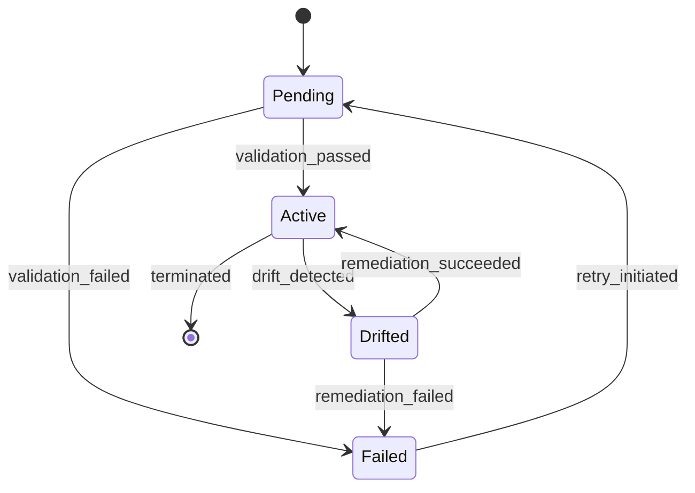
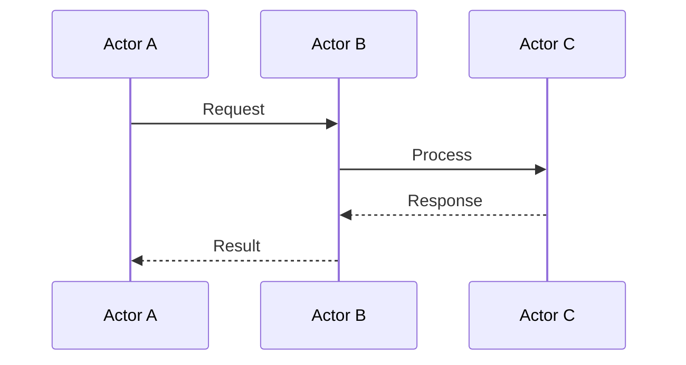

# AESP-NNNN: [Title]

**Status:** DRAFT
**Version:** 1.0.0-DEV
**Phase:** [Foundation | Infrastructure | Operations]
**Last Updated:** YYYY-MM-DD
**Reviewers:** @reviewer1, @reviewer2

---

## Abstract

[Provide a concise summary (150-300 words) of the specification. The abstract
SHOULD be self-contained and understandable without reading the full document.
Describe what this specification defines, why it matters, and the scope of
coverage.]

[Example:]
> This specification defines the canonical reference architecture for
> autonomous engineering platforms. It establishes the component model, data
> flow patterns, system boundaries, and structural relationships between all
> concerns addressed by the Autonomous Engineering Specification (AESP) suite.
> Implementations claiming AESP compliance MUST conform to the architectural
> model and interface definitions described herein.

---

## Motivation

[Explain the problem this specification solves. Describe the current state of
the industry, the gaps that exist, and why a standardized approach is
necessary. Include evidence of the problem where possible — case studies,
industry reports, or documented failures.]

### Problem Statement

[Clear, specific description of the problem.]

### Current Approaches

[Describe existing solutions and their limitations. Be vendor-neutral —
describe categories of solutions, not specific products.]

### Why Standardization

[Explain why a specification is needed and what benefits it provides over
ad-hoc approaches.]

---

## Scope

[Define what this specification covers. Be explicit about the boundaries.]

This specification addresses:

- [Specific concern 1]
- [Specific concern 2]
- [Specific concern 3]
- [Interface definitions]
- [Protocol definitions]
- [Data model definitions]

---

## Non-Goals

[Explicitly state what this specification does NOT cover. This is critical for
preventing scope creep and managing expectations.]

This specification explicitly does NOT address:

- [Out-of-scope concern 1 — consider: why is it out of scope? Where is it covered?]
- [Out-of-scope concern 2]
- [Specific technology implementations]
- [Product-specific features]

---

## Definitions

[Define all domain-specific terms used in this specification. Definitions
SHOULD be ordered alphabetically.]

| Term | Definition |
|------|------------|
| **Term 1** | Precise, unambiguous definition. |
| **Term 2** | Precise, unambiguous definition with cross-reference to related terms. |
| **Autonomous Engineering** | The discipline of designing and operating systems that combine declarative intent, continuous verification, automated remediation, and human-in-the-loop governance to manage complex technical infrastructure with minimal human intervention. |
| **Desired State** | The formally declared target configuration of a system, as specified by operators or generated systems, against which actual state is compared. |
| **Drift** | Any deviation of actual system state from desired state detected through continuous verification processes. |
| **Intent** | A high-level, human-readable declaration of desired outcomes, independent of implementation details. |
| **Remediation** | The process of automatically or semi-automatically correcting drift to restore alignment between actual and desired state. |

---

## Normative Language

[State the RFC 2119 compliance of this document.]

The key words "MUST", "MUST NOT", "REQUIRED", "SHALL", "SHALL NOT",
"SHOULD", "SHOULD NOT", "RECOMMENDED", "MAY", and "OPTIONAL" in this
document are to be interpreted as described in [RFC 2119](https://tools.ietf.org/html/rfc2119).

---

## Architecture

[Describe the architectural model for this specification. Include component
diagrams, data flow diagrams, and structural relationships.]

### Component Model



### Data Model

[Define the core data structures, schemas, and types used in this
specification. Use tables, code blocks, or schema definitions.]

```yaml
# Example data model
resource_descriptor:
  api_version: "aesp.io/v1"
  kind: "ResourceDescriptor"
  metadata:
    name: "string - REQUIRED"
    namespace: "string - OPTIONAL"
    version: "string - REQUIRED - Semantic version"
    labels: "map<string,string> - OPTIONAL"
  spec:
    # ... specification-specific fields
```

### State Transitions

[If applicable, describe the lifecycle and state transitions of entities
managed by this specification.]



---

## Protocols

[Define all protocols, interfaces, and communication patterns specified
herein. Each protocol MUST include: purpose, message format, sequence,
error handling, and version compatibility rules.]

### Protocol: [Protocol Name]

**Purpose:** [What this protocol does]
**Version:** 1.0

#### Message Format

[Define the structure of messages exchanged in this protocol.]

#### Sequence



#### Error Handling

[Define error conditions, error codes, and recovery procedures.]

| Error Code | Condition | Recovery Action |
|------------|-----------|-----------------|
| E001 | [Condition] | [Recovery] |
| E002 | [Condition] | [Recovery] |

---

## Examples

[Provide comprehensive, realistic examples of correct implementation. Each
example SHOULD demonstrate a different aspect or use case.]

### Example 1: [Use Case Name]

```yaml
# Example configuration
api_version: "aesp.io/v1"
kind: "ExampleResource"
metadata:
  name: "production-cluster"
spec:
  # Complete, correct example
```

### Example 2: [Use Case Name]

[Additional example with different configuration or use case.]

---

## Counter-Examples

[Document common incorrect approaches, anti-patterns, and misconceptions.
Counter-examples help readers understand boundaries and avoid common mistakes.]

### Counter-Example 1: [Anti-Pattern Name]

```yaml
# INCORRECT: This configuration violates [specific requirement]
api_version: "aesp.io/v1"
kind: "ExampleResource"
metadata:
  name: "bad-example"
spec:
  # Incorrect configuration that demonstrates what NOT to do
```

**Why this is wrong:** [Explanation of the violation and its consequences.]

**Correct approach:** [Reference to the corresponding correct example above.]

---

## Implementation Notes

[Provide guidance to implementors. This section is non-normative but SHOULD
contain practical advice for those building systems that conform to this
specification.]

### Performance Considerations

[Notes on performance characteristics, scalability, and resource usage.]

### Implementation Strategies

[Different valid approaches to implementing this specification, with
trade-offs.]

### Conformance Testing

[How implementations can verify their conformance to this specification.
Reference the conformance test suite if available.]

---

## Best Practices

[Recommendations for effectively using this specification. These are
non-normative but represent accumulated wisdom from practitioners.]

1. **[Practice Name]:** [Description and rationale.]
2. **[Practice Name]:** [Description and rationale.]
3. **[Practice Name]:** [Description and rationale.]

---

## Anti-Patterns

[Document common anti-patterns — approaches that seem reasonable but lead to
problems. Each anti-pattern SHOULD include: name, description, consequences,
and the preferred alternative.]

### [Anti-Pattern Name]

**Description:** [What it is and why people do it.]
**Consequences:** [What goes wrong.]
**Alternative:** [The better approach.]

---

## Security Considerations

[Analyze the security implications of this specification. Address:
authentication, authorization, data protection, audit logging, threat models,
and compliance implications.]

### Threat Model

| Threat | Severity | Mitigation |
|--------|----------|------------|
| [Threat 1] | High | [Mitigation] |
| [Threat 2] | Medium | [Mitigation] |

### Compliance Mapping

| Standard | Requirement | AESP Reference |
|----------|-------------|----------------|
| [SOC 2] | [CC6.1] | [Section X.Y] |
| [ISO 27001] | [A.12.1.2] | [Section X.Z] |

---

## Future Work

[Document known areas for future enhancement. This helps readers understand
the evolution path and avoids premature standardization.]

1. **[Feature Name]:** [Description and rationale for deferral.]
2. **[Feature Name]:** [Description and rationale for deferral.]

---

## References

### Normative References

[References that are required for implementing this specification.]

- [RFC 2119](https://tools.ietf.org/html/rfc2119) — Key words for use in RFCs to Indicate Requirement Levels
- [AESP-0000](../specification/AESP-0000.md) — Specification Governance & Process
- [AESP-0001](../specification/AESP-0001.md) — Architecture Overview

### Informative References

[References that provide helpful context but are not required for
implementation.]

- [Relevant standard, paper, or book]
- [Industry report or case study]

---

## Mermaid Diagrams

[Summary of all Mermaid diagrams included in this specification, for quick
reference.]

| Diagram | Type | Description |
|---------|------|-------------|
| [Diagram 1] | graph TD | Component architecture |
| [Diagram 2] | sequenceDiagram | Protocol interaction |
| [Diagram 3] | stateDiagram-v2 | Entity lifecycle |

---

## Checklists

### Implementation Checklist

- [ ] All REQUIRED interfaces implemented
- [ ] All REQUIRED protocols supported
- [ ] All error conditions handled
- [ ] Conformance tests pass
- [ ] Security requirements met
- [ ] Documentation complete

### Review Checklist

- [ ] All normative statements use RFC 2119 keywords correctly
- [ ] Examples are correct and complete
- [ ] Counter-examples address common mistakes
- [ ] Diagrams are accurate and readable
- [ ] Cross-references to other specifications are valid
- [ ] Security considerations addressed
- [ ] No vendor-specific language

### Deployment Checklist

- [ ] Prerequisites verified
- [ ] Configuration validated
- [ ] Integration points tested
- [ ] Monitoring configured
- [ ] Rollback procedure documented
- [ ] Operator training completed

---

## Decision Records

[Document significant design decisions made during the development of this
specification. Each decision SHOULD include: context, decision, consequences,
and status.]

### ADR-NNNN: [Decision Title]

**Status:** [Proposed | Accepted | Deprecated | Superseded]
**Date:** YYYY-MM-DD
**Deciders:** @decider1, @decider2

**Context:** [What is the issue that we're seeing that is motivating this
decision or change?]

**Decision:** [What is the change that we're proposing or have agreed on?]

**Consequences:** [What becomes easier or more difficult to do because of
this change?]

**Alternatives Considered:**

| Alternative | Pros | Cons | Decision |
|-------------|------|------|----------|
| [Option A] | [Pros] | [Cons] | Rejected — [reason] |
| [Option B] | [Pros] | [Cons] | Accepted |

---

## Migration Guide

[Provide guidance for migrating from previous versions of this specification
or from alternative approaches. This section is REQUIRED if the specification
supersedes or modifies a previous version.]

### From [Previous Version]

| Previous | Current | Migration Action |
|----------|---------|------------------|
| [Old field/name] | [New field/name] | [Action required] |

### From [Alternative Approach]

[Steps to migrate from non-AESP approaches.]

---

## Compatibility

### Backwards Compatibility

[State the backwards compatibility guarantees of this specification.]

This specification [IS / IS NOT] backwards-compatible with [previous version].
Implementations targeting [version] MUST [specific migration actions].

### Forwards Compatibility

[State the forwards compatibility approach.]

Unknown fields [MUST / SHOULD / MAY] be [preserved / ignored / rejected].
This ensures that [rationale].

### Version Negotiation

[If applicable, describe how implementations negotiate protocol versions.]

---

## Appendix A: Glossary

[Alphabetical list of all terms used in this specification, with
cross-references to the Definitions section.]

## Appendix B: Revision History

| Version | Date | Author | Changes |
|---------|------|--------|---------|
| 0.1.0-DEV | YYYY-MM-DD | @author | Initial draft |
| 0.2.0-DEV | YYYY-MM-DD | @author | Added [section/feature] |

---

*This specification is part of the Autonomous Engineering Specification (AESP).
For the full specification suite, see [specification/README.md](../specification/README.md).*
